# CAN FD Communication Example on RA Boards

## Table of Contents
1. [Introduction](#introduction)
    1. [Supported Boards](#supported-boards)
2. [Required Resources](#required-resources)
    1. [Hardware Requirements](#hardware-requirements)
        1. [Common Hardware](#common-hardware)
        2. [Additional Hardware](#additional-hardware)
        3. [Hardware Connections](#hardware-connections)
    2. [Software Requirements](#software-requirements)
3. [Application Execution](#application-execution)
4. [Project Notes](#project-notes)
    1. [System-Level Block Diagram](#system-level-block-diagram)
    2. [FSP Modules Used](#fsp-modules-used)
    3. [Module Configuration Notes](#module-configuration-notes)
    4. [API Usage](#api-usage)
    5. [Memory Usage](#memory-usage)
    6. [Application Execution Flow](#application-execution-flow)
    7. [Troubleshooting Tips](#troubleshooting-tips)
    8. [Known Limitations](#known-limitations)
5. [Special Topics](#special-topics)
6. [Conclusion and Next Steps](#conclusion-and-next-steps)
7. [References](#references)
8. [Notice](#notice)

## Introduction
This sample project demonstrates CAN FD communication using Renesas RA microcontrollers across two RA boards. During runtime, users can set the nominal rate, FD data rate, and sample point, then begin transmission using the chosen settings. To halt transmission and adjust the baud rate, users simply press Enter without inputting a value, which returns them to the configuration menu.

In operation, data is initially sent from Board 1 to Board 2. Upon receiving the data, Board 2 displays it on the terminal and responds with updated data. Board 1 then receives this response, converts the CAN frame into a CAN FD frame, and sends it back to Board 2. After receiving the CAN FD frame, Board 2 updates the data once more and transmits it to Board 1. Finally, Board 1 displays the received data on the terminal.

Please refer to the [Example Project Usage Guide](https://github.com/renesas/ra-fsp-examples/blob/master/example_projects/Example%20Project%20Usage%20Guide.pdf) 
for general information on example projects.

### Supported Boards

| #  | Board | MCU | J-Link OB VCOM | SEGGER_RTT Address | On-board CAN Transceiver | Board-Specific Guide |
|----|-------|-----|----------------|--------------------|--------------|----------------------|
| 1  | EK-RA4C1   | R7FA4C1BD3CFP | ☑ | N/A        |☑ | [EK-RA4C1 Guide](can_fd_board_specific_notes.md#ek-ra4c1) |
| 2  | EK-RA4E2   | R7FA4E2B93CFM | ☑ | N/A        |☑ | [EK-RA4E2 Guide](can_fd_board_specific_notes.md#ek-ra4e2) |
| 3  | EK-RA4L1   | R7FA4L1BD4CFP | ☑ | N/A        |☑ | [EK-RA4L1 Guide](can_fd_board_specific_notes.md#ek-ra4l1) |
| 4  | EK-RA6E2   | R7FA6E2BB3CFM | ☑ | N/A        |☑ | [EK-RA6E2 Guide](can_fd_board_specific_notes.md#ek-ra6e2) |
| 5  | EK-RA6M5   | R7FA6M5BH3CFC | ☐ | 0x20000d48 |☑ | [EK-RA6M5 Guide](can_fd_board_specific_notes.md#ek-ra6m5) |
| 6  | EK-RA8D1   | R7FA8D1BHECBD | ☑ | N/A        |☐ | [EK-RA8D1 Guide](can_fd_board_specific_notes.md#ek-ra8d1) |
| 7  | EK-RA8D2   | R7KA8D2KFLCAC | ☑ | N/A        |☐ | [EK-RA8D2 Guide](can_fd_board_specific_notes.md#ek-ra8d2) |
| 8  | EK-RA8E2   | R7FA8E2AFDCBD | ☑ | N/A        |☑ | [EK-RA8E2 Guide](can_fd_board_specific_notes.md#ek-ra8e2) |
| 9  | EK-RA8M1   | R7FA8M1AHECBD | ☑ | N/A        |☑ | [EK-RA8M1 Guide](can_fd_board_specific_notes.md#ek-ra8m1) |
| 10 | EK-RA8M2   | R7KA8M2JFLCAC | ☑ | N/A        |☑ | [EK-RA8M2 Guide](can_fd_board_specific_notes.md#ek-ra8m2) |
| 11 | EK-RA8P1   | R7KA8P1KFLCAC | ☑ | N/A        |☐ | [EK-RA8P1 Guide](can_fd_board_specific_notes.md#ek-ra8p1) |
| 12 | EK-RA8T2   | R7KA8T2LFECAC | ☑ | N/A        |☑ | [EK-RA8T2 Guide](can_fd_board_specific_notes.md#ek-ra8t2) |
| 13 | FPB-RA8E1  | R7FA8E1AFDCFB | ☑ | N/A        |☐ | [FPB-RA8E1 Guide](can_fd_board_specific_notes.md#fpb-ra8e1) |
| 14 | MCK-RA4T1  | R7FA4T1BB3CFM | ☐ | 0x20001124 |☐ | [MCK-RA4T1 Guide](can_fd_board_specific_notes.md#mck-ra4t1) |
| 15 | MCK-RA6T3  | R7FA6T3BB3CFM | ☐ | 0x20001124 |☐ | [MCK-RA6T3 Guide](can_fd_board_specific_notes.md#mck-ra6t3) |
| 16 | MCK-RA8T1  | R7FA8T1AHECBD | ☑ | N/A        |☐ | [MCK-RA8T1 Guide](can_fd_board_specific_notes.md#mck-ra8t1) |
| 17 | MCK-RA8T2  | R7KA8T2LFECAC | ☑ | N/A        |☐ | [MCK-RA8T2 Guide](can_fd_board_specific_notes.md#mck-ra8t2) | 

 

**Note:**
* Boards marked with ☑ under **J-Link OB VCOM** support serial communication via J-Link OB VCOM. Using a serial terminal application (e.g., Tera Term) to interact.
* Boards marked with ☑ under **On-board CAN Transceiver** support the on-board CAN Transceiver. 
* Segger RTT block address may be needed to download and observe EP operation using a hex file with J-Link RTT Viewer.

## Required Resources

### Hardware Requirements

#### Common Hardware
* 2 x Supported RA boards (Refer to [Supported Boards](#supported-boards) section).
* 2 x USB cables for programming and debugging (USB cable type varies by board model).

#### Additional Hardware
* Detailed **Additional Hardware** for each supported board is described in the [Board-Specific Guide](#supported-boards).

#### Hardware Connections
* Note:
    * Requires 2 RA boards to run the project.
    * The boards can be of the same type (e.g., EK-RA8M1 <--> EK-RA8M1) or different types (e.g., EK-RA8M1 <--> MCK-RA6T3).
    * In case of the same type of boards, the on-board CAN transceivers support (mount) on the boards (e.g., EK-RA4C1 <--> EK-RA4C1), which can be used for testing by connecting the CANH, CANL and GND pins.
    * In case of the same type of boards, the on-board CAN transceivers do not support on the boards (e.g., EK-RA8D1 <--> EK-RA8D1), the OM13099 (external CAN-FD Transceiver Board) can be used to test the application.
    * In case of the different types of boards, the on-board CAN transceivers do not support on the boards (e.g., EK-RA8D1 <--> MCK-RA6T3), the OM13099 (external CAN-FD Transceiver Board) can be used to test the application.
* Detailed **Specific Connections** for each supported board is described in the [Board-Specific Guide](#supported-boards).
* Common Connections:
    * After completing board-specific hardware connections, connect the RA board's USB debug ports to the host PC using the appropriate USB cables.

### Software Requirements
* Renesas Flexible Software Package (FSP): Version 6.5.0
* e2 studio: Version 2026-04.2
* SEGGER J-Link RTT Viewer: Version 9.42
* LLVM Embedded Toolchain for ARM: Version 21.1.1
* GCC ARM Embedded Toolchain: Version 13.2.1.arm-13-7
* Terminal Console Application: Tera Term or a similar application

**Note:** Refer to the [FSP version requirements](https://github.com/renesas/ra-fsp-examples/blob/master/example_projects/version_info_table.md) table per IDE to correctly download the needed [FSP release](https://github.com/renesas/fsp/releases).

## Application Execution
**Note: In this example project, the same code runs on both boards. The board from which the user initiates the transmission becomes the Board 1 and board which receives the data becomes Board 2. To run and debug the application, the user must connect to both boards. This can be accomplished using either two separate e² studio instances. Two terminal sessions are also required to monitor the communication between the boards.**
	
1. Import the example project.

* By default, the EP uses serial terminal (e.g., Tera Term) for boards that support J-Link OB VCOM. For boards that do not support it, the SEGGER J-Link RTT Viewer is used instead.

    | Terminal | Macro |
    |----------|-------|
    | Serial Terminal (J-Link OB VCOM) | `USE_VIRTUAL_COM=1` |
    | SEGGER J-Link RTT Viewer | `USE_VIRTUAL_COM=0` |
 
* Configuration Path:
 
    * **LLVM:** `Project Properties → C/C++ Build → Settings → Tool Settings → Compiler → Includes → Macro Defines (-D)`
 
    * **GCC:** `Project Properties → C/C++ Build → Settings → Tool Settings → GNU ARM Cross C Compiler → Preprocessor → Defined symbols (-D)`

2. Generate, and build the example project.
3. Before running the example project, make sure [Hardware Connections](#hardware-connections) are completed.
4. Connect to the terminal application.
    * For using the serial terminal (UART):
        * To echo back what was typed in Tera Term, the user needs to enable it through: [Setup] -> [Terminal...] -> Check [Local echo].
        * The configuration parameters of the serial port on the serial terminal application are as follows:
            * Port: Port is a port provided by the J-Link on-board.
            * Speed: 115200
            * Data: 8 bit
            * Parity: none
            * Stop bits: 1 bit
            * Flow control: none
    * For using SEGGER J-Link RTT Viewer:
        * If an EP is modified, compiled, and downloaded please find the block address (for the variable in RAM called _SEGGER_RTT) in .map file generated in the project folder (e2studio\Debug or e2studio\Release).
5. Debug or flash the EP to two RA boards to view output log.

### Execution Output

**Note:** Execution results may vary depending on the supported features and hardware capabilities of each board.

The images below showcase the output on the serial terminal application (Tera Term):

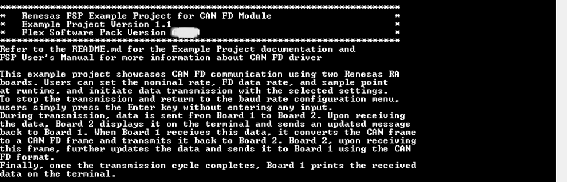

Menu option:

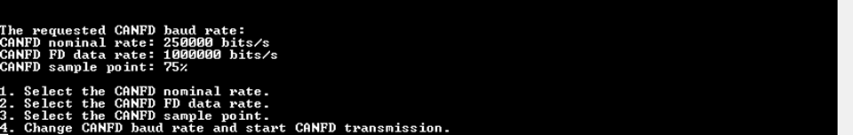

Change baudrate runtime (make sure the configured baud rate of 2 Boards are same):

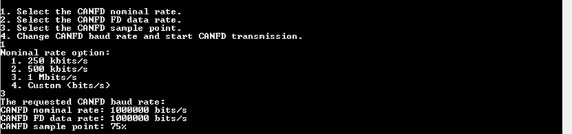

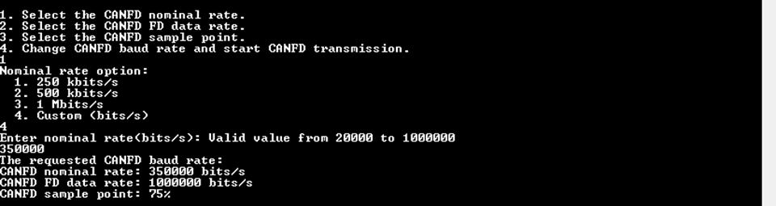

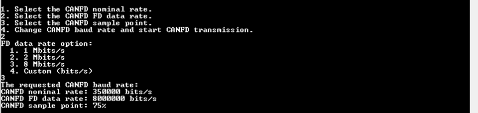

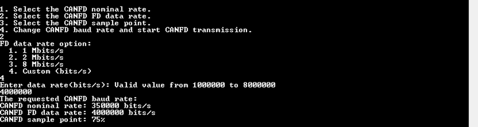

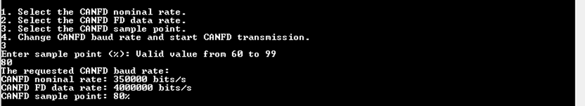

Data Transmission from Board 1 to Board 2

**Note:** In the custom baud rate option, using a non-standard or uncommon CAN FD baud rate may cause the EP to fail to operate correctly.

Board 1 log:

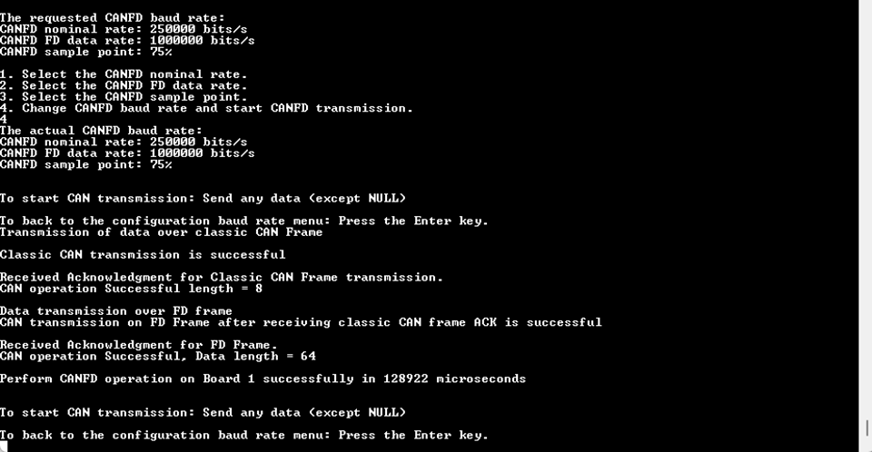

Board 2 log:

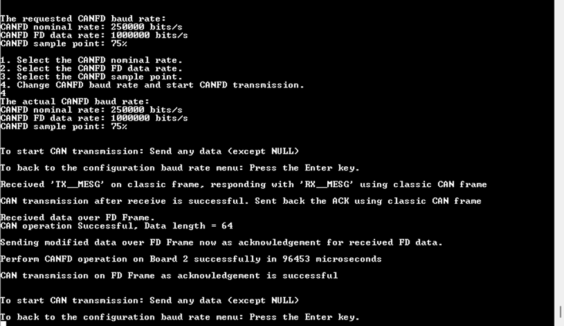

LED behavior as below:
* For boards that have 3 LEDs:  
    * LED1 will be turned ON when CAN transmission operation is in progress.  
    * LED2 will be turned ON when CAN transmission operation is successful.  
    * LED3 will be turned ON when an error occurs.

* For boards that have 2 LEDs:  
    * LED1 will be turned ON when CAN transmission operation is in progress.
    * LED2 will be turned ON when CAN transmission operation is successful.
    * LED1 & LED2 will be turned ON when an error occurs.

# Project Notes 

This section provides a system-level block diagram of the CAN FD EP that visually represents the overall architecture, highlighting how different modules interact and how data flows through the system. 
It shows FSP modules CAN, and GPT, which are essential for the application's functionality. Module configuration details are generally covered in the FSP User Manual (UM), with additional notes provided only when specific configurations deviate from the standard setup and require user attention. API usage is documented with references to the FSP UM, and the actual implementation of these APIs is illustrated in the application flow diagram.

Memory usage is outlined, including RAM and Flash consumption, along with the initial FSP version used during the release of the example project, categorized by MCU group and compiler. Lastly, any non-default clock configurations and special considerations for clock setup are clearly documented to ensure proper system operation.

## System-Level Block Diagram

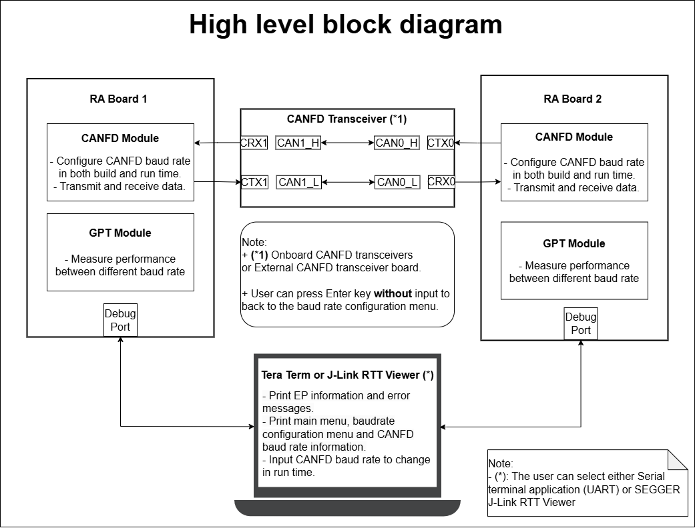

## FSP Modules Used

List all the various modules that are used in this example project. Refer to the FSP User Manual for further details on each module listed below.

| Module Name | Usage  | Searchable Keyword|
|-------------|-----------------------------------------------|-----------------------------------------------|
| CANFD | CANFD module is used to support CAN with both flexible data rate and classic frame, to support multiple channel operation and gateway function. | CAN |
| GPT | GPT is used to measure execution time of CANFD module operations. | r_gpt |

 

## Module Configuration Notes

This section describes FSP Configurator properties that are important or different from the default configuration.

**Configuration Properties for CAN FD Lite (r_canfdlite) — `g_canfd0` instance** `configuration.xml > Stacks > g_canfd0 CAN FD Lite (r_canfdlite) > Properties > Settings > Property`

| Module Property Path and Identifier | Default Value | Used Value | Reason |
|-----------------------------------|---------------|------------|--------|
| Common > Reception > Acceptance Filtering > Channel 1 Rule Count | 16 | 16 | Number of acceptance filter list rules dedicated to Channel 1. |
| Module g_canfd0 CAN FD Lite (r_canfdlite) > Bitrate > Manual > Use manual settings | No | Yes | Use manual baud rate values so that automatic baud rate values are overwritten and user configured baud rate values are used. |
| Module g_canfd0 CAN FD Lite (r_canfdlite) > Transmit Interrupts > TXMB0 | ☐ | ☑ | Relevant Tx buffer is enabled to trigger interrupt after transmission is complete. |
| Module g_canfd0 CAN FD Lite (r_canfdlite) > Channel Error Interrupts > Error Warning | ☐ | ☑ | Select which channel error interrupt sources to enable. |
| Module g_canfd0 CAN FD Lite (r_canfdlite) > Channel Error Interrupts > Error Passive | ☐ | ☑ | Select which channel error interrupt sources to enable. |
| Module g_canfd0 CAN FD Lite (r_canfdlite) > Channel Error Interrupts > Bus-Off Entry | ☐ | ☑ | Select which channel error interrupt sources to enable. |
| Module g_canfd0 CAN FD Lite (r_canfdlite) > Channel Error Interrupts > Bus-Off Recovery | ☐ | ☑ | Select which channel error interrupt sources to enable. |
| Module g_canfd0 CAN FD Lite (r_canfdlite) > Channel Error Interrupts > Overload | ☐ | ☑ | Select which channel error interrupt sources to enable. |
| Module g_canfd0 CAN FD Lite (r_canfdlite) > Global Error Interrupt > Sources > DLC Check | ☐ | ☑ | When enabled, received messages are rejected if their DLC is less than the AFL rule configuration. |
| Module g_canfd0 CAN FD Lite (r_canfdlite) > Global Error Interrupt > Sources > Message Lost | ☐ | ☑ | Detect message loss when RX buffers overflow; RX FIFOs are recommended. |
| Module g_canfd0 CAN FD Lite (r_canfdlite) > Global Error Interrupt > Sources > FD Payload Overflow | ☐ | ☑ | Configure whether received messages larger than the destination buffer are truncated or rejected. |
| Module g_canfd0 CAN FD Lite (r_canfdlite) > Reception > Message Buffers > Payload Size | 8 bytes | 64 bytes | Configure RX message buffer to support CAN FD payload size. |
| Module g_canfd0 CAN FD Lite (r_canfdlite) > Reception > FIFOs > FIFO 0 > Enable | Disabled | Enabled | Enable RX FIFO 0. |
| Module g_canfd0 CAN FD Lite (r_canfdlite) > Reception > FIFOs > FIFO 0 > Payload Size | 8 bytes | 64 bytes | Select the message payload size for RX FIFO 0. |
| Module g_canfd0 CAN FD Lite (r_canfdlite) > Reception > FIFOs > FIFO 0 > Depth | 16 stages | 8 stages | Select the number of stages for RX FIFO 0. |
| Module g_canfd0 CAN FD Lite (r_canfdlite) > Reception > FIFOs > FIFO 1 > Enable | Disabled | Enabled | Enable RX FIFO 1. |
| Module g_canfd0 CAN FD Lite (r_canfdlite) > Reception > FIFOs > FIFO 1 > Payload Size | 8 bytes | 64 bytes | Select the message payload size for RX FIFO 1. |
| Module g_canfd0 CAN FD Lite (r_canfdlite) > Reception > FIFOs > FIFO 1 > Depth | 16 stages | 8 stages | Select the number of stages for RX FIFO 1. |

 

**Configuration Properties for General PWM Timer (r_gpt) — `g_timer` instance** `configuration.xml > Stacks > g_timer Timer, General PWM (r_gpt) > Properties > Settings > Property > Module g_timer Timer, General PWM (r_gpt)`

| Module Property Path and Identifier | Default Value | Used Value | Reason |
|-----------------------------------|---------------|------------|--------|
| General > Channel | 0 | 0 | Use GPT Channel 0 to measure execution time of CAN FD operations. |
| General > Period | 0x10000 | 0x100000000 | Set the period to 0x100000000 raw count. |

 

**Clock Configuration** `configuration.xml > Clocks > Clocks Configuration`

| Clock | Default Value | Used Value | Reason |
|-------|---------------|------------|--------|
| CANFDCLK | - | 40MHz | Set CANFD module clock to 40 MHz to match the source code. |

 

### API Usage
The links below list the FSP-provided APIs that may be used at the application layer.

* [CAN FD Module APIs on FSP User Manual on GitHub](https://renesas.github.io/fsp/group___c_a_n_f_d.html)
* [Timer, General PWM Module APIs on FSP User Manual on GitHub](https://renesas.github.io/fsp/group___g_p_t.html)

### Memory Usage
Memory usage varies depending on the target board, compiler, and build configuration.
 
**Reference Measurements:**
 

 
|   Compiler                              |   Flash Usage   | RAM Usage (Static) |
| :-------------------------------------: | :-------------: | :----------------: |
|   GCC (e.g., EK-RA6M5)                  |     ~25.5 KB    |       ~4.3 KB      |
|   LLVM (e.g., EK-RA8M2)                 |     ~34.5 KB    |       ~3.9 KB      |

 
 
**Notes:**
* RAM usage reflects static allocation only. Additional memory is required for stack and heap.
* The values above are provided for reference purposes. Actual memory usage may differ based on project configuration and optimization settings.
 
**Memory Analysis:**

For detailed memory usage breakdown, refer to the build output (e.g., .map file) or use the Memory Usage view in e²studio.

**Accessing Memory Usage View in e²studio:**

* Navigate to:

        Renesas Views -> C/C++ -> Memory Usage
 
* Then select the target project in the Project Explorer to display memory details.

### Application Execution Flow
This section describes the sequence of events and usage of API during the execution flow of the application.
The diagram shows the overall CAN FD communication flow: the application initializes the CAN FD module, the user sets baud rates and sample points, and transmission begins. The system then sends and receives CAN FD and ACK frames via the HAL, compares transmitted and received data for verification, and finally confirms successful CAN operation to the user.

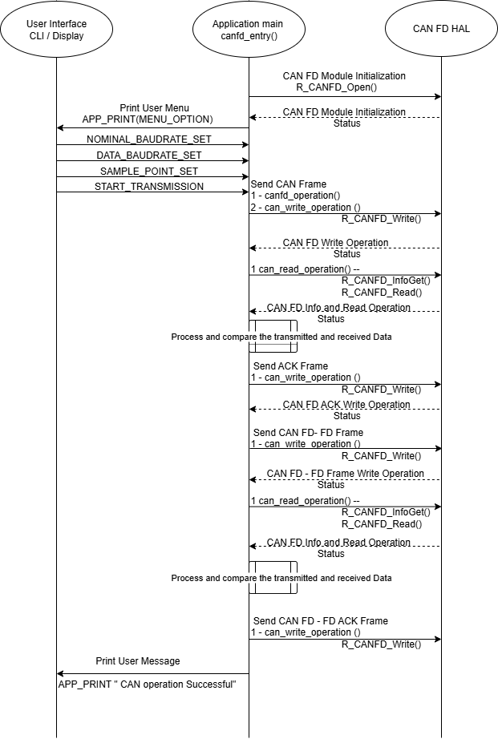

### Troubleshooting Tips
Note:
1. Ensure the configured bitrate of 2 Boards are same.
2. In this example project, the same code runs on both boards. The board from which the user initiates the transmission becomes the Board 1 and board which receives the data becomes Board 2.
3. The user is expected to enter data not exceeding 15 bytes in size.
4. For OM13099 (CAN Transceiver Board):  
    a. Connect P3 loopback connection on CAN Transceiver Board with jumper cables instead of a db9 serial cable.

    b. Connect jumpers J3, J4, J5 and J6 on OM13099 (CAN Transceiver Board) to establish connection to CAN termination resistors.

### Known Limitations
None.

## Special Topics 
None.

## Conclusion and Next Steps 
This example project provides a practical demonstration of CAN FD communication between two Renesas RA microcontroller boards. It highlights dynamic runtime configuration of nominal and data baud rates, sample points, and showcases bidirectional data exchange using both standard CAN and CAN FD frames. The use of identical application code across both boards streamlines deployment, while the hardware setup supports both on-board and external CAN FD transceivers for added flexibility.

Through the transmission and response sequence, the user gains valuable hands-on experience in configuring and running CAN FD application on RA devices.

To further explore CAN FD implementation on Renesas RA MCUs:

Review the project source code located in the src directory.

Refer to the HAL driver and its documentation in the FSP User Manual for deeper technical insights.

Visit renesas.com for additional CAN FD resources, application notes, and documentation related to RA devices.

## References
The following documents provide general reference and background information.

* [FSP User Manual on GitHub](https://renesas.github.io/fsp/)
* [FSP Known Issues](https://github.com/renesas/fsp/issues)
* [Renesas Flexible Software Package (FSP) User's Manual](https://www.renesas.com/en/software-tool/ra-flexible-software-package-fsp?srsltid=AfmBOopFRZx3YfY2rVxBDXVXcmgzH-yigw7jNpgUU6sPaqIfMf5z0u2w)
* [Renesas RA MCU Hardware User's Manual (e.g., RA8D1)](https://www.renesas.com/en/document/mah/ra8d1-group-users-manual-hardware)
* [Documentation & Downloads Search](https://www.renesas.com/en/support/document-search?page=0)

## Notice

1. Descriptions of circuits, software and other related
information in this document are provided only to illustrate the
operation of semiconductor products and application examples. You are
fully responsible for the incorporation or any other use of the
circuits, software, and information in the design of your product or
system. Renesas Electronics disclaims any and all liability for any
losses and damages incurred by you or third parties arising from the use
of these circuits, software, or information. 

2. Renesas Electronics
hereby expressly disclaims any warranties against and liability for
infringement or any other claims involving patents, copyrights, or other
intellectual property rights of third parties, by or arising from the
use of Renesas Electronics products or technical information described
in this document, including but not limited to, the product data,
drawings, charts, programs, algorithms, and application examples. 

3. No license, express, implied or otherwise, is granted hereby under any
patents, copyrights or other intellectual property rights of Renesas
Electronics or others. 

4. You shall be responsible for determining what
licenses are required from any third parties, and obtaining such
licenses for the lawful import, export, manufacture, sales, utilization,
distribution or other disposal of any products incorporating Renesas
Electronics products, if required. 

5. You shall not alter, modify, copy,
or reverse engineer any Renesas Electronics product, whether in whole or
in part. Renesas Electronics disclaims any and all liability for any
losses or damages incurred by you or third parties arising from such
alteration, modification, copying or reverse engineering. 

6. Renesas Electronics products are classified according to the following two
quality grades: "Standard" and "High Quality". The intended applications
for each Renesas Electronics product depends on the product's quality
grade, as indicated below. "Standard": Computers; office equipment;
communications equipment; test and measurement equipment; audio and
visual equipment; home electronic appliances; machine tools; personal
electronic equipment; industrial robots; etc. "High Quality":
Transportation equipment (automobiles, trains, ships, etc.); traffic
control (traffic lights); large-scale communication equipment; key
financial terminal systems; safety control equipment; etc. Unless
expressly designated as a high reliability product or a product for
harsh environments in a Renesas Electronics data sheet or other Renesas
Electronics document, Renesas Electronics products are not intended or
authorized for use in products or systems that may pose a direct threat
to human life or bodily injury (artificial life support devices or
systems; surgical implantations; etc.), or may cause serious property
damage (space system; undersea repeaters; nuclear power control systems;
aircraft control systems; key plant systems; military equipment; etc.).
Renesas Electronics disclaims any and all liability for any damages or
losses incurred by you or any third parties arising from the use of any
Renesas Electronics product that is inconsistent with any Renesas
Electronics data sheet, user's manual or other Renesas Electronics
document. 

7. No semiconductor product is absolutely secure. Notwithstanding any security measures or features that may be implemented in Renesas Electronics hardware or software products, Renesas Electronics shall have absolutely no liability arising out of
any vulnerability or security breach, including but not limited to any unauthorized access to or use of a Renesas Electronics product or a system that uses a Renesas Electronics product. RENESAS ELECTRONICS DOES NOT WARRANT OR GUARANTEE THAT RENESAS ELECTRONICS PRODUCTS, OR ANY
SYSTEMS CREATED USING RENESAS ELECTRONICS PRODUCTS WILL BE INVULNERABLE OR FREE FROM CORRUPTION, ATTACK, VIRUSES, INTERFERENCE, HACKING, DATA LOSS OR THEFT, OR OTHER SECURITY INTRUSION ("Vulnerability Issues"). RENESAS ELECTRONICS DISCLAIMS ANY AND ALL RESPONSIBILITY OR LIABILITY
ARISING FROM OR RELATED TO ANY VULNERABILITY ISSUES. FURTHERMORE, TO THE EXTENT PERMITTED BY APPLICABLE LAW, RENESAS ELECTRONICS DISCLAIMS ANY AND ALL WARRANTIES, EXPRESS OR IMPLIED, WITH RESPECT TO THIS DOCUMENT
AND ANY RELATED OR ACCOMPANYING SOFTWARE OR HARDWARE, INCLUDING BUT NOT LIMITED TO THE IMPLIED WARRANTIES OF MERCHANTABILITY, OR FITNESS FOR A PARTICULAR PURPOSE. 

8. When using Renesas Electronics products, refer to the latest product information (data sheets, user's manuals, application notes, "General Notes for Handling and Using Semiconductor Devices" in
the reliability handbook, etc.), and ensure that usage conditions are within the ranges specified by Renesas Electronics with respect to
maximum ratings, operating power supply voltage range, heat dissipation characteristics, installation, etc. Renesas Electronics disclaims any
and all liability for any malfunctions, failure or accident arising out of the use of Renesas Electronics products outside of such specified
ranges. 

9. Although Renesas Electronics endeavors to improve the quality and reliability of Renesas Electronics products, semiconductor products
have specific characteristics, such as the occurrence of failure at a certain rate and malfunctions under certain use conditions. Unless
designated as a high reliability product or a product for harsh environments in a Renesas Electronics data sheet or other Renesas
Electronics document, Renesas Electronics products are not subject to radiation resistance design. You are responsible for implementing safety
measures to guard against the possibility of bodily injury, injury or damage caused by fire, and/or danger to the public in the event of a
failure or malfunction of Renesas Electronics products, such as safety design for hardware and software, including but not limited to
redundancy, fire control and malfunction prevention, appropriate treatment for aging degradation or any other appropriate measures.
Because the evaluation of microcomputer software alone is very difficult and impractical, you are responsible for evaluating the safety of the
final products or systems manufactured by you. 

10. Please contact a
Renesas Electronics sales office for details as to environmental matters such as the environmental compatibility of each Renesas Electronics
product. You are responsible for carefully and sufficiently investigating applicable laws and regulations that regulate the
inclusion or use of controlled substances, including without limitation, the EU RoHS Directive, and using Renesas Electronics products in
compliance with all these applicable laws and regulations. Renesas Electronics disclaims any and all liability for damages or losses
occurring as a result of your noncompliance with applicable laws and regulations. 

11. Renesas Electronics products and technologies shall not be used for or incorporated into any products or systems whose
manufacture, use, or sale is prohibited under any applicable domestic or foreign laws or regulations. You shall comply with any applicable export
control laws and regulations promulgated and administered by the governments of any countries asserting jurisdiction over the parties or
transactions. 

12. It is the responsibility of the buyer or distributor of Renesas Electronics products, or any other party who distributes,
disposes of, or otherwise sells or transfers the product to a third party, to notify such third party in advance of the contents and
conditions set forth in this document. 

13. This document shall not be
reprinted, reproduced or duplicated in any form, in whole or in part, without prior written consent of Renesas Electronics. 

14. Please contact a Renesas Electronics sales office if you have any questions regarding the information contained in this document or Renesas Electronics
products. (Note1) "Renesas Electronics" as used in this document means Renesas Electronics Corporation and also includes its directly or
indirectly controlled subsidiaries. (Note2) "Renesas Electronics product(s)" means any product developed or manufactured by or for
Renesas Electronics.

                                                                                   (Rev.5.0-1 October 2020)
## Corporate Headquarters 

Contact information TOYOSU FORESIA, 3-2-24

Toyosu, Koto-ku, Tokyo 135-0061, Japan 

www.renesas.com 

## Contact information 

For further information on a product, technology, the most up-to-date version of a
document, or your nearest sales office, please visit:
www.renesas.com/contact/. 

## Trademarks 
Renesas and the Renesas logo are trademarks of Renesas Electronics Corporation. All trademarks and
registered trademarks are the property of their respective owners.

							© 2026 Renesas Electronics Corporation. All rights reserved
