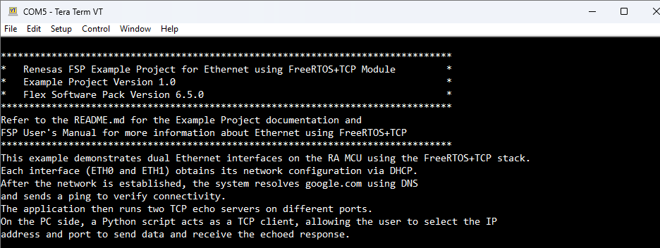
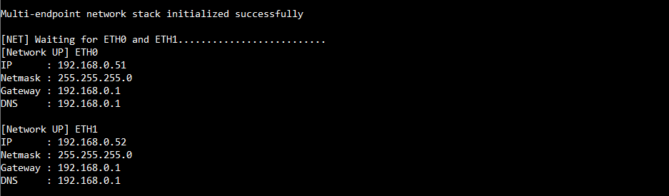
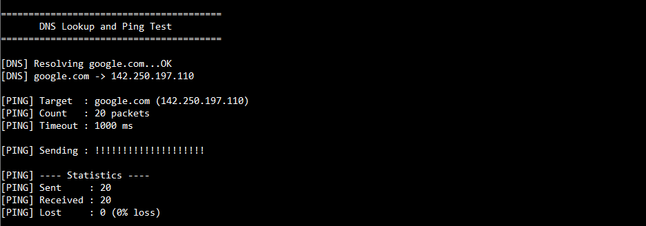
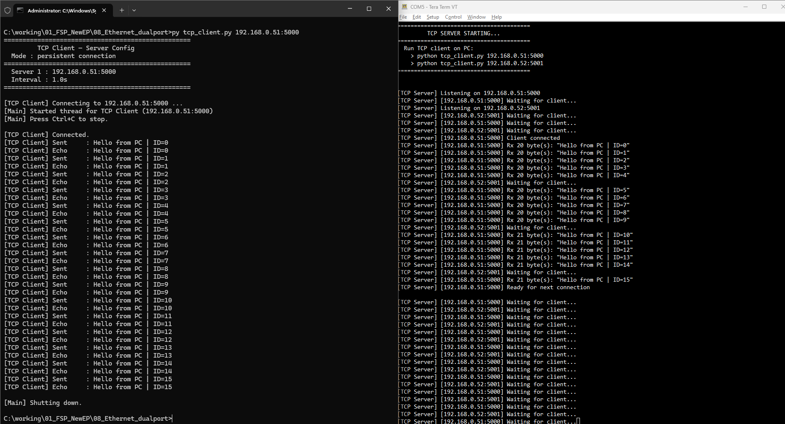
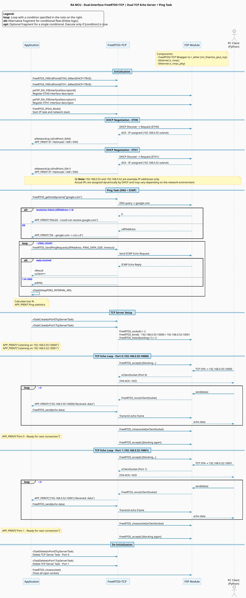

# FreeRTOS TCP Dual Port Example on RA Boards

## Table of Contents
1. [Introduction](#introduction)
    1. [Supported Boards](#supported-boards)
2. [Required Resources](#required-resources)
    1. [Hardware Requirements](#hardware-requirements)
        1. [Common Hardware](#common-hardware)
        2. [Additional Hardware](#additional-hardware)
        3. [Hardware Connections](#hardware-connections)
    2. [Software Requirements](#software-requirements)
3. [Execution Application](#execution-application)
4. [Project Notes](#project-notes)
    1. [System-Level Block Diagram](#system-level-block-diagram)
    2. [FSP Modules Used](#fsp-modules-used)
    3. [Module Configuration Notes](#module-configuration-notes)
    4. [API Usage](#api-usage)
    5. [Memory Usage](#memory-usage)
    6. [Clock Configuration](#clock-configuration)
    7. [Application Execution Flow](#application-execution-flow)
    8. [Troubleshooting Tips](#troubleshooting-tips)
    9. [Known Limitations](#known-limitations)
5. [Special Topics](#special-topics)
6. [Conclusion and Next Steps](#conclusion-and-next-steps)
7. [References](#references)
8. [Notice](#notice)

## Introduction
This example demonstrates dual Ethernet interfaces on the RA MCU using the FreeRTOS+TCP stack. Each interface (ETH0 and ETH1) obtains its network configuration via DHCP. After the network is established, the system resolves google.com using DNS and sends a ping to verify connectivity. The application then runs two TCP echo servers on different ports. On the PC side, a Python script acts as a TCP client, allowing the user to select the IP address and port to send data and receive the echoed response.

Please refer to the [Example Project Usage Guide](https://github.com/renesas/ra-fsp-examples/blob/master/example_projects/Example%20Project%20Usage%20Guide.pdf) for general information on example projects.

### Supported Boards

| #  | Board | MCU | J-Link OB VCOM | SEGGER_RTT Address | Board-Specific Guide |
|----|-------|-----|----------------|--------------------|----------------------|
| 1  | EK-RA8T2   | R7KA8T2LFECAC | ☑ | N/A | [EK-RA8T2 Guide](freertos_tcp_dual_port_board_specific_notes.md#ek-ra8t2) |
| 1  | MCK-RA8T2  | R7KA8T2LFECAC | ☑ | N/A | [MCK-RA8T2 Guide](freertos_tcp_dual_port_board_specific_notes.md#mck-ra8t2) |

 

**Notes:**
- Boards with **☑** under **J-Link OB VCOM** support serial communication via J-Link Virtual COM Port. Use a serial terminal (e.g., Tera Term) to interact.
- **SEGGER RTT Viewer** is an alternative for boards without J-Link OB VCOM support. The **SEGGER_RTT Address** may be required to locate the RTT buffer in memory.

## Required Resources

### Hardware Requirements

#### Common Hardware
* 1 × Supported RA board (Refer to [Supported Boards](#supported-boards) section).
* 1 × USB cable for programming and debugging (USB cable type varies by board model).
* 1 × Ethernet router with an internet connection.
* 3 × Ethernet cables for connecting the dual Ethernet ports on the RA board and the host PC to the network router.

#### Additional Hardware
* Detailed **Additional Hardware** for each supported board is described in the [Board-Specific Guide](#supported-boards).

#### Hardware Connections
* Detailed **Specific Hardware** for each supported board is described in the [Board-Specific Guide](#supported-boards).

* Common Connections (after completing board-specific hardware setup):
    * Connect both Ethernet ports of the RA board to the same router.
    * Connect the RA board’s USB debug port to the host PC using an appropriate USB cable for programming and debugging.

### Software Requirements
* Renesas Flexible Software Package (FSP): Version 6.5.0
* e2 studio: Version 2026-04.2
* LLVM Embedded Toolchain for ARM: Version 21.1.1
* Terminal Console Application: Tera Term or a similar application

**Note:** Refer to the [FSP version requirements](https://github.com/renesas/ra-fsp-examples/blob/master/example_projects/version_info_table.md) table per IDE to correctly download the needed [FSP release](https://github.com/renesas/fsp/releases).

## Application Execution
1. Import, generate, and build the example project.
2. Before running the example project, make sure the [hardware connections](#hardware-connections) are completed.
3. Download the example project to the RA board using the USB debug port.
4. Open a terminal application on the host PC and establish a connection to the board using one of the following interfaces. Refer to the [Supported Boards](#supported-boards) section to determine the appropriate method for your board:

    - **Serial Terminal** (e.g., Tera Term) via VCOM (J-Link OB VCOM).
        * COM port: Provided by the J-Link on-board
        * Baud rate: 115200 bps
        * Data length: 8 bits
        * Parity: None
        * Stop bit: 1 bit
        * Flow control: None
   
### Execution Output

**Note:** Execution results may vary depending on the supported features and hardware capabilities of each board.

* The following example shows the execution output on the EK-RA8T2 board:

    * The terminal displays the EP information:

        

    * The terminal displays the DHCP operation:

        

    * The terminal displays the DNS operation:

        

    * The terminal displays the TCP server on port 0 operation:

        

    * The terminal displays the TCP server on port 1 operation:

        

## Project Notes

### System-Level Block Diagram

### FSP Modules Used

List all the various modules that are used in this example project. Refer to the FSP User Manual for further details on each module listed below.

| Module Name            | Usage                                                                 | Searchable Keyword |
|-----------------------|----------------------------------------------------------------------|--------------------|
| FreeRTOS+ TCP         | Provides a TCP/IP networking stack for communication over Ethernet.  | freertos_plus_tcp  |
| Ethernet (r_rmac)     | Driver for the Ethernet peripheral on RA MCUs. Transmits and receives Ethernet (IEEE 802.3) frames. | r_rmac             |
| Ethernet (r_rmac_phy) | Configures and manages the external Ethernet PHY device used by the RMAC module. | r_rmac_phy         |

 

### Module Configuration Notes

This section describes FSP Configurator properties which are important or different from those selected by default.

---

**Configuration Properties for BSP** `configuration.xml > BSP > Properties > Settings > Property`

| Configuration | Default Value | Used Value | Description |
|---|---|---|---|
| RA Common > Heap size (bytes) | 0 | 0x2000 | Set the heap size |
| RA Common > Main stack size (bytes) | 0 | 0x1000 | Set the main stack size |

 

---

**Configuration Properties for Clocks** `configuration.xml > Clocks`

| Clock      | Default Value| Source Clock |      Divider     | Description                         |
|------------|--------------|--------------|------------------|-------------------------------------|
| SCICLK     | Disabled     | PLL1R        | SCICLK Div/4     | Select SCI clock                    |
| ESWCLK     | Disabled     | PLL1P        | ESWCLK Div/4     | Select Ethernet Switch clock        |
| ESWPHYCLK  | Disabled     | PLL1P        | ESWPHYCLK Div/2  | Select Ethernet Switch PHY clock    |
| ETHPHYCLK  | Disabled     | PLL2Q        | ETHPHYCLK Div/32 | Select Ethernet PHY clock           |

 

---

**Configuration Properties for FreeRTOS** `configuration.xml > Net Thread > Properties > Settings > Property`

| Configuration | Default Value | Used Value | Description |
|---|---|---|---|
| Common > General > Memory Allocation > Support Dynamic Allocation| Disabled | Enabled | Enable dynamic memory allocation |
| Common > General > Memory Allocation > Total Heap Size | 1024 | 0x9000 | Increase total FreeRTOS heap size |

 

---

**Configuration Properties for Ethernet (r_rmac_phy) - Port 0**`configuration.xml > Stacks > g_rmac_phy0 Ethernet (r_rmac_phy) > Properties > Settings > Property`

| Configuration | Default Value | Used Value | Description |
|---|---|---|---|
| Select MII Type | RMII | GMII | Set GMII interface |
| Default PHY-LSI Port | 0 | 0 | Select PHY LSI port 0 |
| MDIO hold timing adjustment | 0 | 7 | Set MDIO hold time for RMAC PHY |

 

---

**Configuration Properties for Ethernet PHY-LSI - Port 0**`configuration.xml > Stacks >  g_rmac_phy_lsi0 Ethernet PHY-LSI > Properties > Settings > Property`

| Configuration | Default Value | Used Value | Description |
|---|---|---|---|
| PHY LSI Address | 0/1 | 0 | PHY LSI address must be set to 0 for EK-RA8T2 and 1 for MCK-RA8T2 |

 

---

**Configuration Properties for Ethernet (r_rmac_phy) - Port 1** `configuration.xml > Stacks > g_rmac_phy1 Ethernet (r_rmac_phy) > Properties > Settings > Property`

| Configuration | Default Value | Used Value | Description |
|---|---|---|---|
| Select MII Type | RMII | GMII | Set GMII interface |
| Default PHY-LSI Port | 0 | 1 | Select PHY LSI port 1 |
| MDIO hold timing adjustment | 0 | 7 | Set MDIO hold time for RMAC PHY |

 

**Configuration Properties for Ethernet PHY-LSI - Port 1**`configuration.xml > Stacks >  g_rmac_phy_lsi2 Ethernet PHY-LSI > Properties > Settings > Property`

| Configuration | Default Value | Used Value | Description |
|---|---|---|---|
| PHY LSI Address | 1/2 | 0 | PHY LSI address must be set to 1 for EK-RA8T2 and 2 for MCK-RA8T2 |

 

### API Usage
The links below list the FSP-provided APIs that may be used at the application layer.

* [Ethernet (r_rmac_phy) APIs on FSP User Manual on GitHub](https://renesas.github.io/fsp/group___r_m_a_c.html?q=r_rmac_phy#:~:text=Function%20Documentation)
* [Ethernet (r_rmac) APIs on FSP User Manual on GitHub](https://renesas.github.io/fsp/group___r_m_a_c.html?q=r_rmac_phy#:~:text=Function%20Documentation)

### Memory Usage
Memory usage varies depending on the target board, compiler, and build configuration.
 
**Reference Measurements (EK-RA8T2):**
 

 
|   Compiler                              |   Flash Usage   | RAM Usage (Static) |
| :-------------------------------------: | :-------------: | :----------------: |
|   LLVM (EK-RA8T2)                       |     ~152.7 KB    |       ~ 85.8 KB      |

 
 
**Notes:**

* RAM usage reflects static allocation only. Additional memory is required for stack and heap.
* The values above are provided for reference purposes. Actual memory usage may differ based on project configuration and optimization settings.
 
**Memory Analysis:**

For detailed memory usage breakdown, refer to the build output (e.g., .map file) or use the Memory Usage view in e²studio.

**Accessing Memory Usage View in e²studio:**

* Navigate to:

        Renesas Views -> C/C++ -> Memory Usage
 
* Then select the target project in the Project Explorer to display memory details.

### Application Execution Flow
This section describes the sequence of events and usage of APIs during the execution flow of the application. The diagram shows the EP operation flow:

### Troubleshooting Tips
None.

### Known Limitations
None.

## Special Topics

## Conclusion and Next Steps
* To learn more about the Ethernet dual-port implementation on Renesas RA MCUs:
    * Review the project source code located in the src directory.
    * Refer to the HAL driver and its documentation in the FSP User Manual for deeper technical insights.
    * Visit renesas.com for additional resources, application notes, and documentation related to RA devices.

## References
The following documents provide general reference and background information.

* [FreeRTOS-Plus-TCP Multiple Interfaces](https://www.freertos.org/Documentation/03-Libraries/02-FreeRTOS-plus/02-FreeRTOS-plus-TCP/03-Multiple-interface/01-Multiple-interfaces)
* [FSP User Manual on GitHub](https://renesas.github.io/fsp/)
* [Renesas Flexible Software Package (FSP) User's Manual](https://www.renesas.com/en/software-tool/ra-flexible-software-package-fsp?srsltid=AfmBOopFRZx3YfY2rVxBDXVXcmgzH-yigw7jNpgUU6sPaqIfMf5z0u2w)
* [Renesas RA MCU Hardware User's Manual (e.g., RA8T2)](https://www.renesas.com/en/document/mah/ra8t2-group-users-manual-hardware)
* [Documentation & Downloads Search](https://www.renesas.com/en/support/document-search?page=0)
* [FSP Known Issues](https://github.com/renesas/fsp/issues)

## Notice

1. Descriptions of circuits, software and other related
information in this document are provided only to illustrate the
operation of semiconductor products and application examples. You are
fully responsible for the incorporation or any other use of the
circuits, software, and information in the design of your product or
system. Renesas Electronics disclaims any and all liability for any
losses and damages incurred by you or third parties arising from the use
of these circuits, software, or information. 

2. Renesas Electronics
hereby expressly disclaims any warranties against and liability for
infringement or any other claims involving patents, copyrights, or other
intellectual property rights of third parties, by or arising from the
use of Renesas Electronics products or technical information described
in this document, including but not limited to, the product data,
drawings, charts, programs, algorithms, and application examples. 

3. No license, express, implied or otherwise, is granted hereby under any
patents, copyrights or other intellectual property rights of Renesas
Electronics or others. 

4. You shall be responsible for determining what
licenses are required from any third parties, and obtaining such
licenses for the lawful import, export, manufacture, sales, utilization,
distribution or other disposal of any products incorporating Renesas
Electronics products, if required. 

5. You shall not alter, modify, copy,
or reverse engineer any Renesas Electronics product, whether in whole or
in part. Renesas Electronics disclaims any and all liability for any
losses or damages incurred by you or third parties arising from such
alteration, modification, copying or reverse engineering. 

6. Renesas Electronics products are classified according to the following two
quality grades: "Standard" and "High Quality". The intended applications
for each Renesas Electronics product depends on the product's quality
grade, as indicated below. "Standard": Computers; office equipment;
communications equipment; test and measurement equipment; audio and
visual equipment; home electronic appliances; machine tools; personal
electronic equipment; industrial robots; etc. "High Quality":
Transportation equipment (automobiles, trains, ships, etc.); traffic
control (traffic lights); large-scale communication equipment; key
financial terminal systems; safety control equipment; etc. Unless
expressly designated as a high reliability product or a product for
harsh environments in a Renesas Electronics data sheet or other Renesas
Electronics document, Renesas Electronics products are not intended or
authorized for use in products or systems that may pose a direct threat
to human life or bodily injury (artificial life support devices or
systems; surgical implantations; etc.), or may cause serious property
damage (space system; undersea repeaters; nuclear power control systems;
aircraft control systems; key plant systems; military equipment; etc.).
Renesas Electronics disclaims any and all liability for any damages or
losses incurred by you or any third parties arising from the use of any
Renesas Electronics product that is inconsistent with any Renesas
Electronics data sheet, user's manual or other Renesas Electronics
document. 

7. No semiconductor product is absolutely secure. Notwithstanding any security measures or features that may be implemented in Renesas Electronics hardware or software products, Renesas Electronics shall have absolutely no liability arising out of
any vulnerability or security breach, including but not limited to any unauthorized access to or use of a Renesas Electronics product or a system that uses a Renesas Electronics product. RENESAS ELECTRONICS DOES NOT WARRANT OR GUARANTEE THAT RENESAS ELECTRONICS PRODUCTS, OR ANY
SYSTEMS CREATED USING RENESAS ELECTRONICS PRODUCTS WILL BE INVULNERABLE OR FREE FROM CORRUPTION, ATTACK, VIRUSES, INTERFERENCE, HACKING, DATA LOSS OR THEFT, OR OTHER SECURITY INTRUSION ("Vulnerability Issues"). RENESAS ELECTRONICS DISCLAIMS ANY AND ALL RESPONSIBILITY OR LIABILITY
ARISING FROM OR RELATED TO ANY VULNERABILITY ISSUES. FURTHERMORE, TO THE EXTENT PERMITTED BY APPLICABLE LAW, RENESAS ELECTRONICS DISCLAIMS ANY AND ALL WARRANTIES, EXPRESS OR IMPLIED, WITH RESPECT TO THIS DOCUMENT
AND ANY RELATED OR ACCOMPANYING SOFTWARE OR HARDWARE, INCLUDING BUT NOT LIMITED TO THE IMPLIED WARRANTIES OF MERCHANTABILITY, OR FITNESS FOR A PARTICULAR PURPOSE. 

8. When using Renesas Electronics products, refer to the latest product information (data sheets, user's manuals, application notes, "General Notes for Handling and Using Semiconductor Devices" in
the reliability handbook, etc.), and ensure that usage conditions are within the ranges specified by Renesas Electronics with respect to
maximum ratings, operating power supply voltage range, heat dissipation characteristics, installation, etc. Renesas Electronics disclaims any
and all liability for any malfunctions, failure or accident arising out of the use of Renesas Electronics products outside of such specified
ranges. 

9. Although Renesas Electronics endeavors to improve the quality and reliability of Renesas Electronics products, semiconductor products
have specific characteristics, such as the occurrence of failure at a certain rate and malfunctions under certain use conditions. Unless
designated as a high reliability product or a product for harsh environments in a Renesas Electronics data sheet or other Renesas
Electronics document, Renesas Electronics products are not subject to radiation resistance design. You are responsible for implementing safety
measures to guard against the possibility of bodily injury, injury or damage caused by fire, and/or danger to the public in the event of a
failure or malfunction of Renesas Electronics products, such as safety design for hardware and software, including but not limited to
redundancy, fire control and malfunction prevention, appropriate treatment for aging degradation or any other appropriate measures.
Because the evaluation of microcomputer software alone is very difficult and impractical, you are responsible for evaluating the safety of the
final products or systems manufactured by you. 

10. Please contact a
Renesas Electronics sales office for details as to environmental matters such as the environmental compatibility of each Renesas Electronics
product. You are responsible for carefully and sufficiently investigating applicable laws and regulations that regulate the
inclusion or use of controlled substances, including without limitation, the EU RoHS Directive, and using Renesas Electronics products in
compliance with all these applicable laws and regulations. Renesas Electronics disclaims any and all liability for damages or losses
occurring as a result of your noncompliance with applicable laws and regulations. 

11. Renesas Electronics products and technologies shall not be used for or incorporated into any products or systems whose
manufacture, use, or sale is prohibited under any applicable domestic or foreign laws or regulations. You shall comply with any applicable export
control laws and regulations promulgated and administered by the governments of any countries asserting jurisdiction over the parties or
transactions. 

12. It is the responsibility of the buyer or distributor of Renesas Electronics products, or any other party who distributes,
disposes of, or otherwise sells or transfers the product to a third party, to notify such third party in advance of the contents and
conditions set forth in this document. 

13. This document shall not be
reprinted, reproduced or duplicated in any form, in whole or in part, without prior written consent of Renesas Electronics. 

14. Please contact a Renesas Electronics sales office if you have any questions regarding the information contained in this document or Renesas Electronics
products. (Note1) "Renesas Electronics" as used in this document means Renesas Electronics Corporation and also includes its directly or
indirectly controlled subsidiaries. (Note2) "Renesas Electronics product(s)" means any product developed or manufactured by or for
Renesas Electronics.

                                                                                   (Rev.5.0-1 October 2020)
## Corporate Headquarters 

Contact information TOYOSU FORESIA, 3-2-24

Toyosu, Koto-ku, Tokyo 135-0061, Japan 

www.renesas.com 

## Contact information 

For further information on a product, technology, the most up-to-date version of a
document, or your nearest sales office, please visit:
www.renesas.com/contact/. 

## Trademarks 
Renesas and the Renesas logo are trademarks of Renesas Electronics Corporation. All trademarks and
registered trademarks are the property of their respective owners.

							© 2026 Renesas Electronics Corporation. All rights reserved
