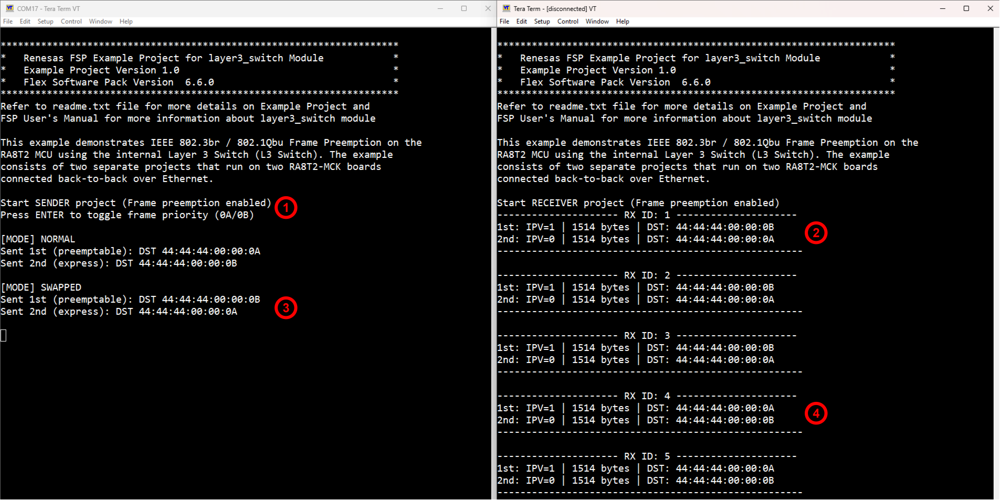
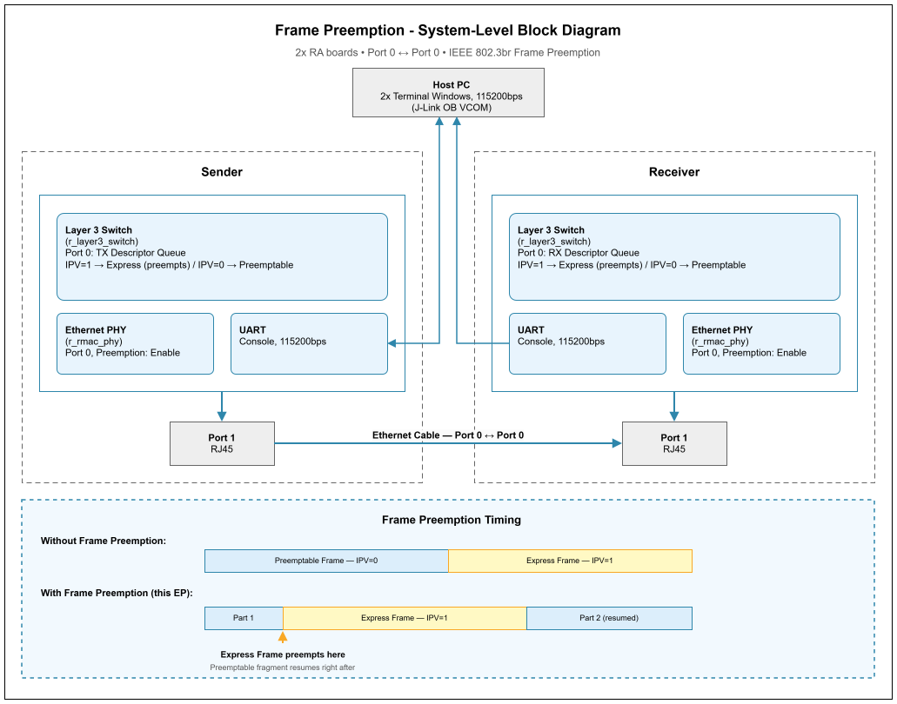

# Frame Preemption Example on RA Boards

## Table of Contents
1. [Introduction](#introduction)
    1. [Supported Boards](#supported-boards)
2. [Required Resources](#required-resources)
    1. [Hardware Requirements](#hardware-requirements)
        1. [Common Hardware](#common-hardware)
        2. [Additional Hardware](#additional-hardware)
        3. [Hardware Connections](#hardware-connections)
    2. [Software Requirements](#software-requirements)
3. [Execution Application](#execution-application)
4. [Project Notes](#project-notes)
    1. [System-Level Block Diagram](#system-level-block-diagram)
    2. [FSP Modules Used](#fsp-modules-used)
    3. [Module Configuration Notes](#module-configuration-notes)
    4. [API Usage](#api-usage)
    5. [Memory Usage](#memory-usage)
    6. [Clock Configuration](#clock-configuration)
    7. [Application Execution Flow](#application-execution-flow)
    8. [Troubleshooting Tips](#troubleshooting-tips)
    9. [Known Limitations](#known-limitations)
5. [Special Topics](#special-topics)
6. [Conclusion and Next Steps](#conclusion-and-next-steps)
7. [References](#references)
8. [Notice](#notice)

## Introduction
This example demonstrates IEEE 802.3br / 802.1Qbu **Frame Preemption** on the RA8T2 MCU using the internal Layer 3 Switch (L3 Switch). The example consists of two separate projects that run on two RA8T2-MCK boards connected back-to-back over Ethernet:

* **Sender** (`frame_preemption_sender_mck_ra8t2_ep`): Sends two Ethernet frames per cycle through the L3 Switch TX queue on Port 1. The user can press ENTER at runtime (via the serial console) to swap which of the two frames is sent as the **Express Frame** (IPV = 1) versus the **Preemptable Frame** (IPV = 0). When the Express Frame is submitted while the Preemptable Frame is still being transmitted, the L3 Switch pauses the lower-priority frame and sends the higher-priority one first — this is the Frame Preemption mechanism defined in IEEE 802.3br.

* **Receiver** (`frame_preemption_receiver_mck_ra8t2_ep`): Continuously polls the L3 Switch RX queue on Port 1. Each received frame with a matching destination MAC prefix (`44:44:44:00:00:xx`) is printed to the serial terminal with its IPV (read back from the frame payload), frame size, and destination MAC address, letting the user observe frame delivery order and confirm the preemption effect.

Please refer to the [Example Project Usage Guide](https://github.com/renesas/ra-fsp-examples/blob/master/example_projects/Example%20Project%20Usage%20Guide.pdf) for general information on example projects.

### Supported Boards

<div style="margin-left:2em; max-height:200px; overflow-y:auto; border:1px solid #ccc; border-radius:4px;">

| #  | Board | MCU | J-Link OB VCOM | SEGGER_RTT Address | Board-Specific Guide |
|----|-------|-----|----------------|--------------------|----------------------|
| 1  | RA8T2-MCK | R7KA8T2LFECAC | ✅ | N/A | [RA8T2-MCK Guide](frame_preemption_board_specific_notes.md#ra8t2-mck) |

</div><br>

**Notes:**
- Boards with a checkmark under **J-Link OB VCOM** support serial communication via J-Link Virtual COM Port. Use a serial terminal (e.g., Tera Term) to interact.
- **SEGGER RTT Viewer** is an alternative for boards without J-Link OB VCOM support. The **SEGGER_RTT Address** may be required to locate the RTT buffer in memory.
- Both the Sender and Receiver projects target the same board model; two physical boards are required to run the example.

## Required Resources

### Hardware Requirements

#### Common Hardware
* 2 x RA boards (one for the Sender project, one for the Receiver project).
* 2 x USB cables for programming and debugging (USB cable type varies by board model).
* 1 x Ethernet cable to connect the Sender board to the Receiver board.

#### Additional Hardware
* Detailed **Additional Hardware** for the supported board is described in the [Board-Specific Guide](#supported-boards).

#### Hardware Connections
* Detailed **Specific Connections** for the supported board are described in the [Board-Specific Guide](#supported-boards).
* Common Connections (after completing board-specific hardware setup):
    * Connect the USB debug port of each board to the host PC using a USB cable.

### Software Requirements
* Renesas Flexible Software Package (FSP): Version 6.6.0
* e2 studio: Version 2026-07 (26.7.0)
* LLVM Embedded Toolchain for ARM: Version 22.1.0
* Terminal Console Application: Tera Term or a similar application

**Note:** Refer to the [FSP version requirements](https://github.com/renesas/ra-fsp-examples/blob/master/example_projects/version_info_table.md) table per IDE to correctly download the needed [FSP release](https://github.com/renesas/fsp/releases).

## Execution Application
1. Import, generate, and build **both** the Sender and Receiver example projects.
2. Before running, make sure all [hardware connections](#hardware-connections) are completed.
3. Download the **Sender** project to the first RA board and the **Receiver** project to the second RA board using the USB debug port.
4. Open two terminal windows on the host PC — one per board — and connect using the J-Link OB VCOM:
    - COM port: Provided by the J-Link on-board debugger
    - Baud rate: 115200 bps
    - Data length: 8 bits
    - Parity: None
    - Stop bit: 1 bit
    - Flow control: None
5. Reset both boards. The Receiver should be running before the Sender begins transmitting to avoid missing early frames.
6. On the Sender terminal, press **ENTER** at any time to toggle which frame (0A or 0B) carries the Express priority.

### Execution Output

*Note:* Execution results may vary depending on the supported features and hardware capabilities of each board.

The Sender console reports which DST MAC (0A/0B) currently plays the preemptable vs. express role, and always transmits the preemptable frame first. The Receiver groups every 2 received frames into one numbered `RX ID:` block, tagging each with its `1st:`/`2nd:` arrival order:



What each numbered callout (①-④) shows:
1. Sender just started — startup banner and the ENTER prompt.
2. Receiver, `RX ID: 1` — the express frame (IPV=1) always arrives before the preemptable frame (IPV=0).
3. Sender after pressing ENTER — `[MODE] SWAPPED`: the two DST MACs swap roles, but preemptable is still sent first, express second.
4. Receiver, `RX ID: 4` — the DST MACs shown now match the swap, but the arrival order is still express first.

## Project Notes

### System-Level Block Diagram



### FSP Modules Used

<div style="margin-left:2em; max-height:200px; overflow-y:auto; border:1px solid #ccc; border-radius:4px;">

| Module Name | Usage | Searchable Keyword |
|-------------|-------|---------------------|
| Layer 3 Switch (r_layer3_switch) | Creates and manages the TX descriptor queue (Sender) or RX descriptor queue (Receiver) on Port 1. The Sender sets the IPV field on each TX descriptor to select Express vs. Preemptable frame handling. | r_layer3_switch |
| Ethernet PHY (r_rmac_phy) | Configures and manages the external Ethernet PHY. | r_rmac_phy |
| SCI UART (r_sci_b_uart) | Drives the serial console (`g_uart_console`) used for printf-based status/log output and, on the Sender, ENTER-key input to toggle priority. | r_sci_b_uart |

</div><br>

### Module Configuration Notes
This section describes FSP Configurator properties which are important or different from those selected by default.

---

**Configuration Properties for BSP** `configuration.xml > BSP > Properties > Settings > Property`

<div style="margin-left:2em; max-height:200px; overflow-y:auto; border:1px solid #ccc; border-radius:4px;">

| Configuration | Default Value | Used Value | Description |
|---|---|---|---|
| RA Common > Main stack size (bytes) | 0x400 | 1024 (Sender), 2048 (Receiver) | Main stack size. |
| RA Common > Heap size (bytes) | 0x0 | 0 (both projects) | Heap size |

</div><br>

---

**Configuration Properties for Layer 3 Switch (g_layer3_switch0, r_layer3_switch)** `configuration.xml > Stacks > g_layer3_switch0 Layer 3 Switch (r_layer3_switch) > Properties > Settings > Property`

<div style="margin-left:2em; max-height:200px; overflow-y:auto; border:1px solid #ccc; border-radius:4px;">

| Configuration | Default Value | Used Value | Description |
|---|---|---|---|
| Port 1 > IPV queue for preemptable frames | Queue 0 | Queue 0 | Selects which IPV queue on Port 1 receives/transmits preemptable-frame traffic |
| Port 1 > Callback | NULL | `layer3_switch_callback` | Registers the callback invoked on TX complete (Sender) / RX events (Receiver) |
| Port 0/Port 1 > Frame preemption fragment size | 64 (both ports) | 64 (both ports) | Minimum fragment size used when a preemptable frame is interrupted |

</div><br>

---

**Configuration Properties for Ethernet PHY (g_rmac_phy1, r_rmac_phy)** `configuration.xml > Stacks > g_rmac_phy1 Ethernet PHY (r_rmac_phy) > Properties > Settings > Property`

<div style="margin-left:2em; max-height:200px; overflow-y:auto; border:1px solid #ccc; border-radius:4px;">

| Configuration | Default Value | Used Value | Description |
|---|---|---|---|
| MII Type | RMII | MII | Selects the MII electrical interface between MAC and PHY |
| MDIO hold timing adjustment | 0 | 7 | MDIO hold time used when communicating with the PHY over the management interface |
| Frame preemption | Disable | Enable | Enables IEEE 802.3br frame preemption support at the PHY/MAC layer |
| Frame preemption verification interval | 10 | 10 | Interval (in the unit defined by the driver) used for the preemption verification handshake |

</div><br>

### API Usage
* [Layer 3 Switch (r_layer3_switch) APIs on FSP User Manual on GitHub](https://renesas.github.io/fsp/group___l_a_y_e_r3___s_w_i_t_c_h.html)
* [Ethernet PHY (r_rmac_phy) APIs on FSP User Manual on GitHub](https://renesas.github.io/fsp/group___r_m_a_c.html)

<div style="margin-left:2em; max-height:200px; overflow-y:auto; border:1px solid #ccc; border-radius:4px;">

| API | Usage |
|-----|-------|
| `R_LAYER3_SWITCH_Open` | Opens and initializes the L3 Switch driver (both projects) |
| `R_LAYER3_SWITCH_CreateDescriptorQueue` | Creates the TX queue (Sender) or RX queue (Receiver) on Port 1 |
| `R_LAYER3_SWITCH_SetDescriptor` | Writes a descriptor into the queue — buffer pointer, size, and (Sender only) the IPV value that marks a frame as Express or Preemptable |
| `R_LAYER3_SWITCH_StartDescriptorQueue` | Starts/restarts descriptor queue processing after a descriptor is written or reset |
| `R_LAYER3_SWITCH_GetDescriptor` | Reads the next descriptor from the queue — confirms TX completion (Sender) or retrieves a received frame (Receiver) |
| `R_RMAC_PHY_LinkStatusGet` | Polls the PHY link status; both projects wait for link-up before entering the main loop |
| `R_BSP_SoftwareDelay` | Blocking delay used for the Sender's 1-second send cycle, TX-complete polling, and the Receiver's 1 ms RX poll interval |

</div><br>

### Memory Usage
Memory usage varies depending on the target board, compiler, and build configuration.

**Reference Measurements (RA8T2-MCK):**

| Project | Compiler | Flash Usage | RAM Usage (Static) |
|:---:|:---:|:---:|:---:|
| Sender | LLVM (RA8T2-MCK) | 22 KB | 19 KB |
| Receiver | LLVM (RA8T2-MCK) | 22 KB | 17 KB |

**Notes:**
* RAM usage reflects static allocation only. Additional memory is required for stack and heap.
* The values above are provided for reference purposes. Actual memory usage may differ based on project configuration and optimization settings.

**Memory Analysis:** refer to the build output (e.g., .map file) or use the Memory Usage view in e²studio (Renesas Views -> C/C++ -> Memory Usage).

### Clock Configuration
| Clock | Default Value | Source Clock | Divider | Description |
|---|---|---|---|---|
| SCICLK | Disabled | PLL2R | Div/4 | Clock source for the SCI UART console peripheral |
| ESWCLK | Disabled | PLL1P | Div/4 | Clock source for the Ethernet Switch (L3 Switch) core |
| ESWPHYCLK | Disabled | PLL1P | Div/2 | Clock source for the Ethernet Switch PHY interface |
| ETHPHYCLK | Disabled | PLL2Q | Div/32 | Clock source for the external Ethernet PHY reference clock |

### Application Execution Flow

#### Sender Flow
1. Initialize the UART console for serial terminal output (`uart_console_init`).
2. Read the FSP pack version (`R_FSP_VersionGet`) and print the startup banner and EP description to the serial terminal.
3. Open the L3 Switch driver (`R_LAYER3_SWITCH_Open`).
4. Create a TX descriptor queue on Port 1 (`frame_preemption_example_transmit_descriptor_initialize` -> `R_LAYER3_SWITCH_CreateDescriptorQueue`).
5. Poll `R_RMAC_PHY_LinkStatusGet` until the Ethernet link is established.
6. Print the startup message and ENTER-key instructions, then print the initial priority mode (`frame_preemption_example_print_send_order`).
7. Enter the main loop:
    * Check for a completed line via non-blocking UART read (`uart_console_has_line`); if ENTER was pressed, toggle the priority mode and print the new mode/order.
    * Wait 1 second (`R_BSP_SoftwareDelay`).
    * Determine which frame buffer (`gp_frame_0a_data` or `gp_frame_0b_data`) currently plays the preemptable vs. express role, and encode the corresponding IPV value into payload byte 14 of each.
    * Send the **preemptable** frame (IPV = 0) first via `frame_preemption_example_transmit_update`; poll `g_tx_complete_flag` until the TX-complete callback fires.
    * Send the **express** frame (IPV = 1) second, the same way.

#### Receiver Flow
1. Initialize the UART console for serial terminal output.
2. Read the FSP pack version (`R_FSP_VersionGet`) and print the startup banner and EP description to the serial terminal.
3. Open the L3 Switch driver (`R_LAYER3_SWITCH_Open`).
4. Create an RX descriptor queue on Port 1 (`frame_preemption_example_reception_descriptor_initialize` -> `R_LAYER3_SWITCH_CreateDescriptorQueue`), pre-loading all but one descriptor as empty RX buffers.
5. Poll `R_RMAC_PHY_LinkStatusGet` until the Ethernet link is established.
6. Print the startup message to the serial terminal.
7. Enter the main loop:
    * Call `frame_preemption_example_reception_update` to poll `R_LAYER3_SWITCH_GetDescriptor` for a completed RX descriptor; wait 1 ms between polls.
    * If a frame was received and its destination MAC prefix matches `44:44:44:00:00`, increment the receive counter. Print a `RX ID: n` header before the first frame of each pair, then a line tagged `1st:`/`2nd:` with the IPV (read back from payload byte 14), size, and destination MAC; print the closing border after the second frame of the pair.
    * Once all pre-loaded RX descriptors have been consumed, the descriptor queue is refreshed (`frame_preemption_example_reset_rx_descriptor`) so reception can continue.

#### Priority Toggle Behavior

| Mode | Frame 0A (DST: 44:44:44:00:00:**0A**) | Frame 0B (DST: 44:44:44:00:00:**0B**) |
|------|---------------------------------------|---------------------------------------|
| Normal (default) | Preemptable (IPV = 0) | Express (IPV = 1) |
| Swapped (after ENTER) | Express (IPV = 1) | Preemptable (IPV = 0) |

When the Express Frame (IPV = 1) is submitted while the Preemptable Frame (IPV = 0) is still transmitting, the L3 Switch suspends the Preemptable Frame, sends the Express Frame in full, then resumes and completes the Preemptable Frame. The Receiver observes this as a change in frame arrival order relative to the order the Sender issued them.

### Troubleshooting Tips
* If the Receiver does not display any frames, verify the Ethernet cable is connected between Port 1 of both boards and that the PHY link is established on both sides (both projects block at startup on `R_RMAC_PHY_LinkStatusGet`).
* If the IPV value shown on the Receiver does not reflect the expected priority immediately after pressing ENTER on the Sender, allow one full 1-second send cycle to complete before the new priority takes effect.

### Known Limitations
* None.

## Special Topics

### Frame Preemption Overview (IEEE 802.3br / 802.1Qbu)

Frame Preemption allows a high-priority **Express Frame** to interrupt the transmission of a lower-priority **Preemptable Frame**. The Preemptable Frame is split into fragments; after the Express Frame is fully transmitted, the remaining fragments of the Preemptable Frame are sent and reassembled at the receiver.

```
Without preemption:
──[ Preemptable Frame (1514 bytes) ]──[ Express Frame (1514 bytes) ]──

With preemption:
──[ Preemptable part 1 ]──[ Express Frame (complete) ]──[ Preemptable part 2 ]──
                        ↑
                Express Frame preempts here
```

The Receiver always receives fully reassembled frames — it does not see individual fragments.

### IPV (Internal Priority Value)

The IPV is a 3-bit field in the L3 Switch TX descriptor (`info1_tx.ipv`) that the switch uses to decide whether a frame is Express or Preemptable:

| IPV Value | Frame Type | Behavior |
|:---------:|:----------:|----------|
| 1 | Express | Can preempt any Preemptable Frame currently in progress |
| 0 | Preemptable | May be interrupted by an Express Frame |

Higher IPV values (2-7) can also be used depending on switch configuration, this example only uses IPV = 0 and IPV = 1.

## Conclusion and Next Steps
* To learn more about the Frame Preemption implementation on Renesas RA MCUs:
    * Review the project source code located in the `src` directory of each project.
    * Refer to the L3 Switch driver documentation in the FSP User Manual for deeper technical insights into descriptor queue management and preemption configuration.
    * Visit renesas.com for additional resources, application notes, and documentation related to RA devices.

## References
* [IEEE 802.3br Frame Preemption Standard](https://standards.ieee.org/ieee/802.3br/6040/)
* [IEEE 802.1Qbu Bridge Port Extension](https://standards.ieee.org/ieee/802.1Qbu/6021/)
* [FSP User Manual on GitHub](https://renesas.github.io/fsp/)
* [Renesas Flexible Software Package (FSP) User's Manual](https://www.renesas.com/en/software-tool/ra-flexible-software-package-fsp)
* [Renesas RA8T2 Group User's Manual: Hardware](https://www.renesas.com/en/document/mah/ra8t2-group-users-manual-hardware)
* [Documentation & Downloads Search](https://www.renesas.com/en/support/document-search?page=0)
* [FSP Known Issues](https://github.com/renesas/fsp/issues)

## Notice

1. Descriptions of circuits, software and other related
information in this document are provided only to illustrate the
operation of semiconductor products and application examples. You are
fully responsible for the incorporation or any other use of the
circuits, software, and information in the design of your product or
system. Renesas Electronics disclaims any and all liability for any
losses and damages incurred by you or third parties arising from the use
of these circuits, software, or information.

2. Renesas Electronics
hereby expressly disclaims any warranties against and liability for
infringement or any other claims involving patents, copyrights, or other
intellectual property rights of third parties, by or arising from the
use of Renesas Electronics products or technical information described
in this document, including but not limited to, the product data,
drawings, charts, programs, algorithms, and application examples.

3. No license, express, implied or otherwise, is granted hereby under any
patents, copyrights or other intellectual property rights of Renesas
Electronics or others.

4. You shall be responsible for determining what
licenses are required from any third parties, and obtaining such
licenses for the lawful import, export, manufacture, sales, utilization,
distribution or other disposal of any products incorporating Renesas
Electronics products, if required.

5. You shall not alter, modify, copy,
or reverse engineer any Renesas Electronics product, whether in whole or
in part. Renesas Electronics disclaims any and all liability for any
losses or damages incurred by you or third parties arising from such
alteration, modification, copying or reverse engineering.

6. Renesas Electronics products are classified according to the following two
quality grades: "Standard" and "High Quality". The intended applications
for each Renesas Electronics product depends on the product's quality
grade, as indicated below. "Standard": Computers; office equipment;
communications equipment; test and measurement equipment; audio and
visual equipment; home electronic appliances; machine tools; personal
electronic equipment; industrial robots; etc. "High Quality":
Transportation equipment (automobiles, trains, ships, etc.); traffic
control (traffic lights); large-scale communication equipment; key
financial terminal systems; safety control equipment; etc. Unless
expressly designated as a high reliability product or a product for
harsh environments in a Renesas Electronics data sheet or other Renesas
Electronics document, Renesas Electronics products are not intended or
authorized for use in products or systems that may pose a direct threat
to human life or bodily injury (artificial life support devices or
systems; surgical implantations; etc.), or may cause serious property
damage (space system; undersea repeaters; nuclear power control systems;
aircraft control systems; key plant systems; military equipment; etc.).
Renesas Electronics disclaims any and all liability for any damages or
losses incurred by you or any third parties arising from the use of any
Renesas Electronics product that is inconsistent with any Renesas
Electronics data sheet, user's manual or other Renesas Electronics
document.

7. No semiconductor product is absolutely secure. Notwithstanding any security measures or features that may be implemented in Renesas Electronics hardware or software products, Renesas Electronics shall have absolutely no liability arising out of
any vulnerability or security breach, including but not limited to any unauthorized access to or use of a Renesas Electronics product or a system that uses a Renesas Electronics product. RENESAS ELECTRONICS DOES NOT WARRANT OR GUARANTEE THAT RENESAS ELECTRONICS PRODUCTS, OR ANY
SYSTEMS CREATED USING RENESAS ELECTRONICS PRODUCTS WILL BE INVULNERABLE OR FREE FROM CORRUPTION, ATTACK, VIRUSES, INTERFERENCE, HACKING, DATA LOSS OR THEFT, OR OTHER SECURITY INTRUSION ("Vulnerability Issues"). RENESAS ELECTRONICS DISCLAIMS ANY AND ALL RESPONSIBILITY OR LIABILITY
ARISING FROM OR RELATED TO ANY VULNERABILITY ISSUES. FURTHERMORE, TO THE EXTENT PERMITTED BY APPLICABLE LAW, RENESAS ELECTRONICS DISCLAIMS ANY AND ALL WARRANTIES, EXPRESS OR IMPLIED, WITH RESPECT TO THIS DOCUMENT
AND ANY RELATED OR ACCOMPANYING SOFTWARE OR HARDWARE, INCLUDING BUT NOT LIMITED TO THE IMPLIED WARRANTIES OF MERCHANTABILITY, OR FITNESS FOR A PARTICULAR PURPOSE.

8. When using Renesas Electronics products, refer to the latest product information (data sheets, user's manuals, application notes, "General Notes for Handling and Using Semiconductor Devices" in
the reliability handbook, etc.), and ensure that usage conditions are within the ranges specified by Renesas Electronics with respect to
maximum ratings, operating power supply voltage range, heat dissipation characteristics, installation, etc. Renesas Electronics disclaims any
and all liability for any malfunctions, failure or accident arising out of the use of Renesas Electronics products outside of such specified
ranges.

9. Although Renesas Electronics endeavors to improve the quality and reliability of Renesas Electronics products, semiconductor products
have specific characteristics, such as the occurrence of failure at a certain rate and malfunctions under certain use conditions. Unless
designated as a high reliability product or a product for harsh environments in a Renesas Electronics data sheet or other Renesas
Electronics document, Renesas Electronics products are not subject to radiation resistance design. You are responsible for implementing safety
measures to guard against the possibility of bodily injury, injury or damage caused by fire, and/or danger to the public in the event of a
failure or malfunction of Renesas Electronics products, such as safety design for hardware and software, including but not limited to
redundancy, fire control and malfunction prevention, appropriate treatment for aging degradation or any other appropriate measures.
Because the evaluation of microcomputer software alone is very difficult and impractical, you are responsible for evaluating the safety of the
final products or systems manufactured by you.

10. Please contact a
Renesas Electronics sales office for details as to environmental matters such as the environmental compatibility of each Renesas Electronics
product. You are responsible for carefully and sufficiently investigating applicable laws and regulations that regulate the
inclusion or use of controlled substances, including without limitation, the EU RoHS Directive, and using Renesas Electronics products in
compliance with all these applicable laws and regulations. Renesas Electronics disclaims any and all liability for damages or losses
occurring as a result of your noncompliance with applicable laws and regulations.

11. Renesas Electronics products and technologies shall not be used for or incorporated into any products or systems whose
manufacture, use, or sale is prohibited under any applicable domestic or foreign laws or regulations. You shall comply with any applicable export
control laws and regulations promulgated and administered by the governments of any countries asserting jurisdiction over the parties or
transactions.

12. It is the responsibility of the buyer or distributor of Renesas Electronics products, or any other party who distributes,
disposes of, or otherwise sells or transfers the product to a third party, to notify such third party in advance of the contents and
conditions set forth in this document.

13. This document shall not be
reprinted, reproduced or duplicated in any form, in whole or in part, without prior written consent of Renesas Electronics.

14. Please contact a Renesas Electronics sales office if you have any questions regarding the information contained in this document or Renesas Electronics
products. (Note1) "Renesas Electronics" as used in this document means Renesas Electronics Corporation and also includes its directly or
indirectly controlled subsidiaries. (Note2) "Renesas Electronics product(s)" means any product developed or manufactured by or for
Renesas Electronics.

                                                                                   (Rev.5.0-1 October 2020)
## Corporate Headquarters

Contact information TOYOSU FORESIA, 3-2-24

Toyosu, Koto-ku, Tokyo 135-0061, Japan

www.renesas.com

## Contact information

For further information on a product, technology, the most up-to-date version of a
document, or your nearest sales office, please visit:
www.renesas.com/contact/.

## Trademarks
Renesas and the Renesas logo are trademarks of Renesas Electronics Corporation. All trademarks and
registered trademarks are the property of their respective owners.

							© 2026 Renesas Electronics Corporation. All rights reserved
