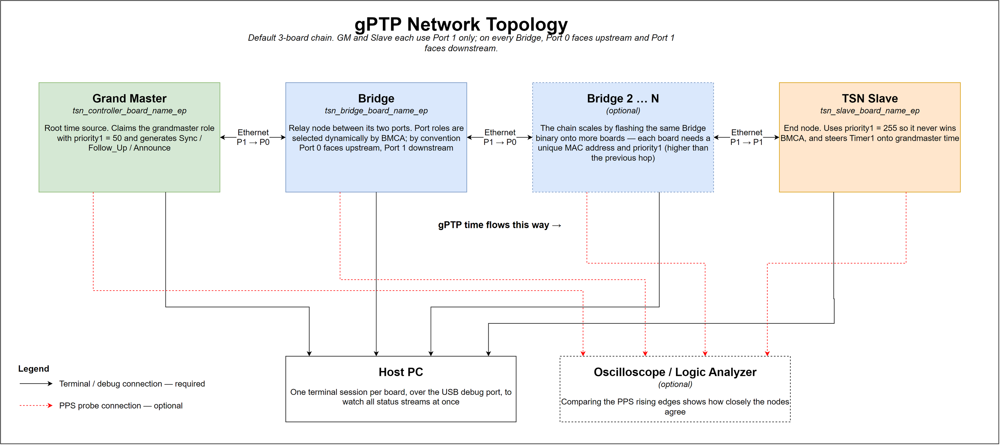
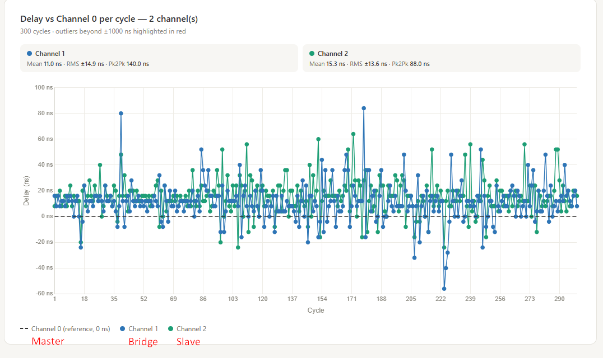
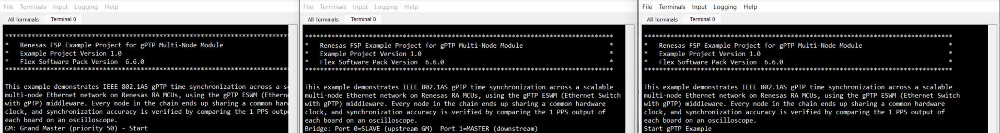
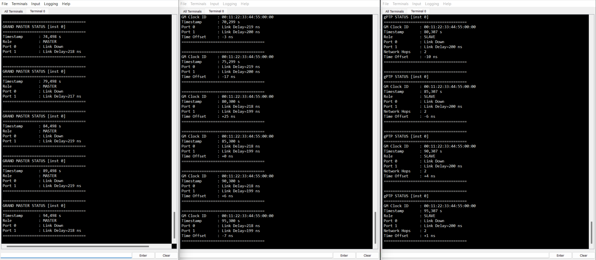
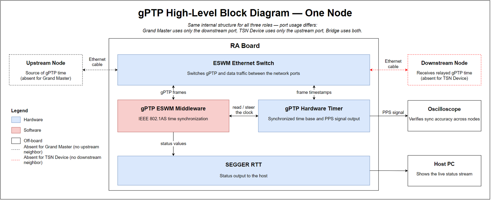
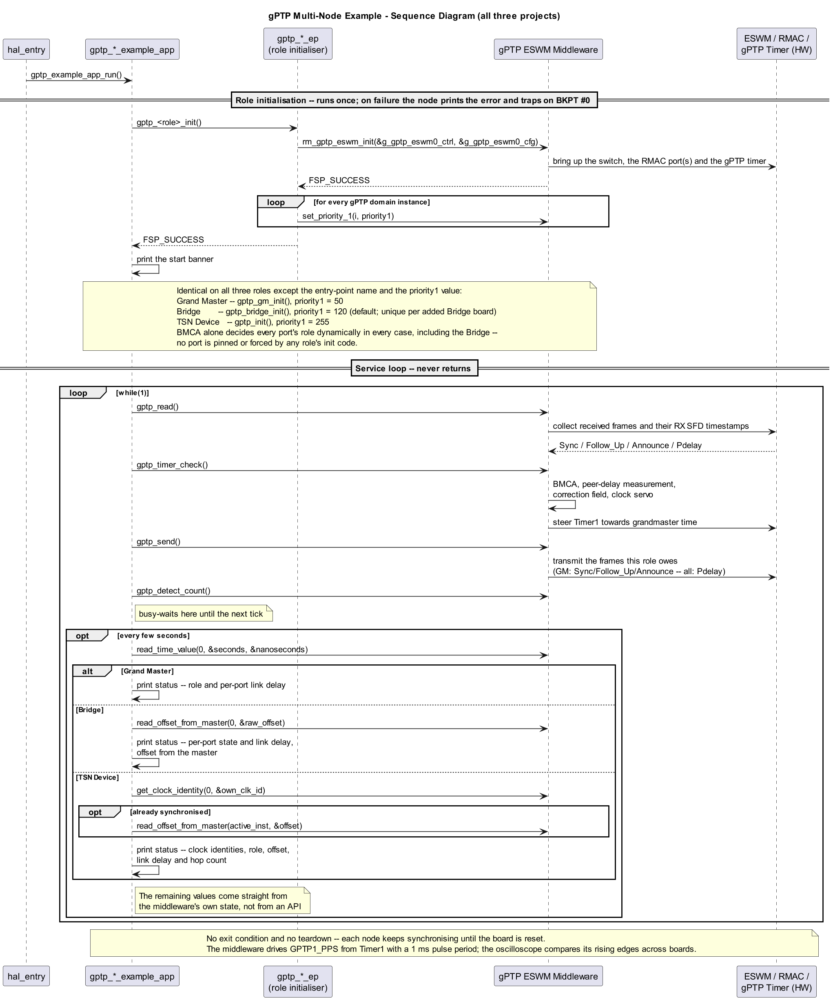

# gPTP Multi-Node Time Synchronization Example on RA Boards

## Table of Contents
1. [Introduction](#introduction)
    1. [Supported Boards](#supported-boards)
2. [Required Resources](#required-resources)
    1. [Hardware Requirements](#hardware-requirements)
        1. [Required Boards](#required-boards)
        2. [Additional Hardware](#additional-hardware)
        3. [Hardware Connections](#hardware-connections)
    2. [Software Requirements](#software-requirements)
3. [Verifying Application](#verifying-application)
    1. [PPS Measurement Setup](#pps-measurement-setup)
    2. [Execution Output](#execution-output)
4. [Project Notes](#project-notes)
    1. [System-Level Block Diagram](#system-level-block-diagram)
    2. [FSP Modules Used](#fsp-modules-used)
    3. [Module Configuration Notes](#module-configuration-notes)
    4. [API Usage](#api-usage)
    5. [Memory Usage](#memory-usage)
    6. [Clock Configuration](#clock-configuration)
    7. [Application Execution Flow](#application-execution-flow)
    8. [Troubleshooting Tips](#troubleshooting-tips)
    9. [Known Limitations](#known-limitations)
5. [Special Topics](#special-topics)
    1. [Alternate Topologies](#alternate-topologies)
6. [Conclusion and Next Steps](#conclusion-and-next-steps)
7. [References](#references)
8. [Notice](#notice)

## Introduction

This example project demonstrates IEEE 802.1AS (gPTP) time synchronization across a scalable
multi-node Ethernet network built from Renesas RA MCUs. Every non-grandmaster node in the chain
disciplines its hardware clock to the same grandmaster. The terminal alone is enough to confirm
convergence: the Grand Master reports its role and link delay, the Bridge reports both port states
and its time offset, and the TSN Device reports its role, time offset, link delay, and hop count.
Comparing the boards' `GPTP1_PPS` pulse outputs on an oscilloscope is an **optional** cross-check,
not a requirement.

The example ships as **three e² studio projects — one per network role**. You flash each board
with the project matching the role you want it to play:

| Project | Role in the network | What it does |
|---------|---------------------|--------------|
| `tsn_controller_board_name_ep` | TSN Grand Master | Wins BMCA with `priority1 = 50`, originates Sync / Follow_Up / Announce |
| `tsn_bridge_board_name_ep` | TSN Bridge | Relays gPTP between its two ports; port roles and relay behaviour are selected dynamically by BMCA, not fixed in software |
| `tsn_slave_board_name_ep` | TSN Device (Slave) | Never becomes grandmaster (`priority1 = 255`), disciplines its clock to the received Sync |

The default use case uses **three boards, one bridge**:

```
[TSN GM] ──> [Bridge] ──> [TSN Device]
```

The chain is scalable beyond this by flashing another board with the Bridge project and inserting
it into the chain — but every board on the network must have a **unique MAC address and a unique
`priority1`**, not "no changes":

* **MAC address** — in the new Bridge board's `configuration.xml`, set the MAC Address property to
  the same new value on `g_ether0`, `g_ether1`, and `g_layer3_switch0` (both Port 0 and Port 1).
* **`priority1`** — in the new Bridge board's `src/gptp_bridge_ep.h`, give
  `GPTP_ESWM_EXAMPLE_MASTER_PRIORITY` a value higher than the Bridge immediately upstream of it (in
  BMCA, lower wins, so each hop going away from the GM must rank lower):

  ```
  priority1 :   50   <  120  <  125  <  130  <  ...  <  255
  BMCA rank :   GM   >  BR1  >  BR2  >  BR3  >  ...  >  Slave
              (highest rank, wins)                  (lowest rank)
  ```

  (GM = 50, Slave = 255 — leave those two as they are.)

Rebuild and reflash the board after changing both values.

There is no interactive menu. Each node prints a role-specific status block over **SEGGER RTT** at
regular intervals: the Grand Master reports `MASTER` and per-port link delay, the Bridge reports
per-port link delay and time offset, and the TSN Device reports `SLAVE`, time offset, per-port link
delay, and hop count.

### Supported Boards

<div style="margin-left:2em; max-height:200px; overflow-y:auto; border:1px solid #ccc; border-radius:4px;">

| # | Board | MCU | J-Link OB VCOM | Role Support | Board-Specific Guide |
|---|-------|-----|----------------|--------------|-----------------------|
| 1 | MCK-RA8T2 | R7KA8T2LFECAC | ☑ | Grand Master, Bridge, Device | [MCK-RA8T2 Guide](gptp_board_specific_notes.md#mck-ra8t2--board-specific-guide) |

</div><br>

**Note:**
* A minimum of **three** boards is needed for the default use case. The chain scales beyond three
  boards by adding more Bridge boards — each needs a unique MAC address and `priority1`, see
  [Introduction](#introduction).

## Required Resources

### Hardware Requirements

#### Required Boards

* 3 × MCK-RA8T2 board (1 Grand Master + 1 Bridge + 1 TSN Device) for the default use case.
* Each additional Bridge node in a longer chain needs one more MCK-RA8T2 board, plus a unique MAC
  address and `priority1` on that board — see [Introduction](#introduction).

Note: For a setup with no Bridge, see [Alternate Topologies](#alternate-topologies).

#### Additional Hardware

* 3 × USB cable — one per board, for programming and for the terminal session.
* 2 × Ethernet cable — GM ↔ Bridge, Bridge ↔ TSN Device.
* *(Optional)* 1 × oscilloscope or logic analyzer with at least one channel per board, to compare
  the `GPTP1_PPS` pulse rising edges.
* Detailed **Additional Hardware** of each board is described in the
  [Board-Specific Guide](#supported-boards).

#### Hardware Connections

Cable the boards into a linear chain. By convention the Bridge's **Port 0 faces upstream**
(towards the grandmaster) and **Port 1 faces downstream** — port roles are actually selected
dynamically by BMCA, not fixed in software, but this cabling convention keeps every Bridge
consistent:

```
[GM]      Port 1 ──Eth──> Port 0 [Bridge]
[Bridge]  Port 1 ──Eth──> Port 1 [TSN Device]
```

The Grand Master and TSN Device each use a single active port — **Port 1**
(`GPTP_GM_ACTIVE_PORT` / `GPTP_SLAVE_ACTIVE_PORT`), not Port 0 — so connect their Ethernet cable to
the board's Port 1 connector.

To extend the chain beyond three boards, insert further Bridge boards between the Bridge and the
TSN Device, keeping the same Port 0 upstream / Port 1 downstream convention on every Bridge.



Assign the projects to boards as follows:

<div style="margin-left:2em; max-height:200px; overflow-y:auto; border:1px solid #ccc; border-radius:4px;">

| Board | Role | Project to flash |
|-------|------|------------------|
| Board 1 | Grand Master | `tsn_controller_board_name_ep` |
| Board 2 | Bridge | `tsn_bridge_board_name_ep` |
| Board 3 | TSN Device | `tsn_slave_board_name_ep` |

</div><br>

**Debug connections:** connect the USB debug port of every board to the PC. You need one terminal
session per board to watch all three status streams at once.

Detailed **Specific Connections** of each board is described in the
[Board-Specific Guide](#supported-boards).

### Hardware Configuration
Detailed **Hardware Configuration** of each board is described in the
[Board-Specific Guide](#supported-boards).

### Software Requirements

* Renesas Flexible Software Package (FSP): Version 6.6.0
* e² studio: Version 2026-04.2
* LLVM Embedded Toolchain for ARM: Version 22.1.0
* SEGGER J-Link RTT Viewer: Version 9.42

## Verifying Application

1. Import all three projects into e² studio, run **Generate Project Content** on each, and build
   them.
2. Flash each board with the project for its role, following the board assignment table in
   [Hardware Connections](#hardware-connections).
3. Connect the Ethernet cables into the chain and the USB debug cable of every board to the PC.
4. Power all boards and open one SEGGER J-Link RTT Viewer session per board (console output goes
   over SEGGER RTT, not UART).
5. Watch the RTT Viewer output for each board. After convergence, confirm the role-specific
   results: the Grand Master reports `Role : MASTER`; the Bridge reports `Link Delay=<x> ns` on
   both `Port 0` and `Port 1`, plus a `Time Offset`; and the TSN Device reports `Role : SLAVE`,
   with a numeric `Time Offset` and `Link Delay=<x> ns` on its in-use port.
6. *(Optional)* Cross-check the reported offset against the `GPTP1_PPS` pulse rising edges as
   described in [PPS Measurement Setup](#pps-measurement-setup).

**Note:** on each Bridge node both ports must show `Link Delay=<x> ns`. If a Bridge still shows
`Link Down` on a port after the chain is fully cabled and powered, reset that board.

### PPS Measurement Setup

**Optional** — an independent, hardware-level cross-check of synchronization accuracy on top of
the role-specific RTT status (see [Execution Output](#execution-output)).

Every MCK-RA8T2 board outputs the pulse signal named `GPTP1_PPS` on the same pin, so probing is
identical on all three boards. The pin is driven by the gPTP hardware timer, not by application
code. In the middleware version supplied with this EP, `GPTP_OUTPUT_PULSE_PERIOD` is hard-coded to
`GPTP_PULSE_PERIOD_MSEC`, so the output pulse repeats every **1 ms** despite the signal name.

<div style="margin-left:2em; max-height:200px; overflow-y:auto; border:1px solid #ccc; border-radius:4px;">

| Oscilloscope Channel | Board | Signal | Acceptance target |
|---|---|---|---|
| Ch.0 | Grand Master | `GPTP1_PPS` | Reference edge |
| Ch.1 | Bridge | `GPTP1_PPS` | Edge-to-edge offset from the GM < 1 µs after convergence |
| Ch.2 | TSN Device | `GPTP1_PPS` | Edge-to-edge offset from the GM < 1 µs after convergence |

</div><br>

For the MCU pin and board connector that `GPTP1_PPS` maps to, see the
[Board-Specific Guide](#supported-boards).

Captured result — `GPTP1_PPS` edges across all three boards after convergence:



### Execution Output

Each board prints a role-specific status block periodically over SEGGER RTT — the same field
layout on all three projects, just with different values per role.

**Startup banner** — printed once at boot (`print_banner()`):



**Periodic status** — printed every 5 seconds by `print_status()` (GM) / `print_gptp_status()`
(Bridge, Device) — `STATUS_INTERVAL` loop ticks at the 1 ms GPT period; Grand Master, Bridge and
TSN Device side by side after convergence:



* **Grand Master** — role, timestamp, and the measured link delay on each of its ports.
* **Bridge** — the measured link delay on each of its two ports, plus the Bridge's own time
  offset.
* **TSN Device** — its role, `GM Clock ID` (the actual grandmaster's clock identity, read via
  `read_grandmaster_identity()` — tracked end-to-end through the chain, not just the immediate
  upstream neighbour), the link delay on each port, its time offset, and `Network Hops`
  (`steps_removed` — how many relay hops back to the grandmaster).

Each `Port <n>` line reads `Link Delay=<x> ns` once that port is AS-capable and its mean link
delay has been measured, or `Link Down` if the port isn't AS-capable (not connected, or not used
by this board's role). Until the Device reaches `SYNC_SLAVE` its status block instead prints
`Role : WAITING`, `--` for `Time Offset`/`Network Hops`, and `Link Down` on both ports — use that
as the "not converged yet" indicator. The Bridge's `Time Offset` should likewise only be treated
as valid once both of its ports show a measured `Link Delay`. These fields refresh every 5
seconds, so use them as coarse convergence indicators rather than precise measurements.

For the actual edge alignment, compare the `GPTP1_PPS` outputs across the boards as described in
[PPS Measurement Setup](#pps-measurement-setup).

## Project Notes

### System-Level Block Diagram



Every node has the same internal structure; only the number of Ethernet ports in use and the role
initializer differ. The layers are:

* **Application layer** (`src/`) — `hal_entry.c` calls `gptp_example_app_run()`, which calls the
  role initializer in `gptp_*_ep.c` and then runs the gPTP service loop and the status printer
  (output goes over SEGGER RTT, bundled as vendor source in `src/SEGGER_RTT/`, not an FSP
  Configurator module).
* **gPTP ESWM middleware** — runs BMCA, exchanges Sync / Follow_Up / Announce / Pdelay frames, and
  drives the clock servo.
* **Hardware** — the ESWM Ethernet switch with one RMAC per port (two on the Bridge, one on the GM
  and Device), and the gPTP hardware timer that timestamps frames at the SFD and generates the
  1 ms `GPTP1_PPS` pulse output configured by the current middleware.

### FSP Modules Used

<div style="margin-left:2em; max-height:300px; overflow-y:auto; border:1px solid #ccc; border-radius:4px;">

| Module Name | Usage | Searchable Keyword |
|-------------|-------|--------------------|
| gPTP ESWM (Ethernet Switch with gPTP) | Core IEEE 802.1AS middleware — runs BMCA, exchanges Sync / Follow_Up / Announce / Pdelay messages, drives the clock servo, and manages the local and synchronized hardware clock domains | `rm_gptp_eswm` |
| Ethernet Switch (Layer3 Switch) | Controls the embedded switch: port bring-up, forwarding, and receive-side gPTP timestamp storage | `r_layer3_switch` |
| Ethernet (RMAC) | Per-port Ethernet MAC used for frame transmission and reception and for hardware SFD timestamping | `r_ether` |
| Ethernet PHY (RMAC PHY) | PHY management and link status for each Ethernet port | `r_rmac_phy` |

</div><br>

Instances generated per project:

<div style="margin-left:2em; max-height:200px; overflow-y:auto; border:1px solid #ccc; border-radius:4px;">

| Instance | GM | Bridge | Device |
|----------|:--:|:------:|:------:|
| `g_gptp_eswm0` (gPTP ESWM) | ☑ | ☑ | ☑ |
| `g_gptp_sys_port0` (bare-metal gPTP system port) | ☑ | ☑ | ☑ |
| `g_layer3_switch0` (2 ports, 10 L3 filters) | ☑ | ☑ | ☑ |
| `g_ether0` (Ethernet port 0) | ☑ | ☑ | ☑ |
| `g_ether1` (Ethernet port 1) | ☑ | ☑ | ☑ |

</div><br>

### Module Configuration Notes

The Ethernet Switch, Ethernet (RMAC), Ethernet PHY (RMAC PHY) and gPTP middleware stacks each have
non-default Configurator properties this example relies on, one table per stack below. Every other
Configurator property on these stacks is left at default.

**Configuration Properties for "g_layer3_switch0 Ethernet Switch (r_layer3_switch)" instance**
`configuration.xml > Stacks > g_layer3_switch0 Ethernet Switch (r_layer3_switch) > Properties > Settings > Property`

<div style="margin-left:2em; max-height:250px; overflow-y:auto; border:1px solid #ccc; border-radius:4px;">

| Project | Module Property Path and Identifier | Default Value | Used Value | Description |
|---------|--------------------------------------|----------------|-------------|-------------|
| All | Common > gPTP Support | Disable | Enable | Enables receive-side gPTP timestamp storage in the switch driver. Required for the peer-delay measurement. |
| All | Module g_layer3_switch0 Ethernet Switch (r_layer3_switch) > Port 0/1 > Forwarding to CPU | Enable | Enable | Already the module default; called out here because gPTP requires received Sync / Follow_Up / Announce / peer-delay frames to reach the CPU, so it must not be turned off. |
| Grand Master | Module g_layer3_switch0 Ethernet Switch (r_layer3_switch) > Port 0/1 > Port 0/1 > MAC Address | `00:11:22:33:44:55` | `00:11:22:33:44:55` | Same MAC on both ports (only Port 1 is actively used in the gPTP chain) — distinct per project so frames can be told apart on the wire/in a capture. |
| Bridge | Module g_layer3_switch0 Ethernet Switch (r_layer3_switch) > Port 0/1 > Port 0/1 > MAC Address | `00:11:22:33:44:55` | `00:11:22:33:44:77` | Same MAC on both Bridge ports — distinct per project so frames can be told apart on the wire/in a capture. |
| TSN Device | Module g_layer3_switch0 Ethernet Switch (r_layer3_switch) > Port 0/1 > Port 0/1 > MAC Address | `00:11:22:33:44:55` | `00:11:22:33:44:66` | Same MAC on both ports (only Port 1 is actively used in the gPTP chain) — distinct per project so frames can be told apart on the wire/in a capture. |

</div><br>

**Configuration Properties for "g_ether0/g_ether1 Ethernet (RMAC)" instance** 
`configuration.xml > Stacks > g_ether0 Ethernet (RMAC) > Properties > Settings > Property > Module g_ether0/g_ether1 Ethernet (r_rmac)`

<div style="margin-left:2em; max-height:250px; overflow-y:auto; border:1px solid #ccc; border-radius:4px;">

| Project | Module Property Path and Identifier | Default Value | Used Value | Description |
|---------|--------------------------------------|----------------|-------------|-------------|
| Grand Master | General > MAC Address (`g_ether0`/`g_ether1`) | `00:11:22:33:44:55` | `00:11:22:33:44:55` | Same MAC on both ports (only Port 1 is actively used) — kept identical to the switch port's MAC above. |
| Bridge | General > MAC Address (`g_ether0`/`g_ether1`) | `00:11:22:33:44:55` | `00:11:22:33:44:77` | Same MAC on both Bridge ports — kept identical to the switch port's MAC above. |
| TSN Device | General > MAC Address (`g_ether0`/`g_ether1`) | `00:11:22:33:44:55` | `00:11:22:33:44:66` | Same MAC on both ports (only Port 1 is actively used) — kept identical to the switch port's MAC above. |
| All | General > Zero Copy | Disable | Disable | Left at default. Zero Copy was found to desynchronize RX timestamps from frames in this driver, so it stays off on every port. |

</div><br>

**Configuration Properties for "g_rmac_phy0/g_rmac_phy1 Ethernet (r_rmac_phy)" instance**
`configuration.xml > Stacks > g_rmac_phy0/g_rmac_phy1 Ethernet (r_rmac_phy) > Properties > Settings > Property > Module g_rmac_phy0/g_rmac_phy1 Ethernet (r_rmac_phy)`

<div style="margin-left:2em; max-height:250px; overflow-y:auto; border:1px solid #ccc; border-radius:4px;">

| Project | Module Property Path and Identifier | Default Value | Used Value | Description |
|---------|--------------------------------------|----------------|-------------|-------------|
| All | PHY LSI Address (`g_rmac_phy0`, Port 0) | `0` | `1` | On-board MDIO address of the port's PHY; wiring-dependent, not the same on every port. |
| All | PHY LSI Address (`g_rmac_phy1`, Port 1) | `0` | `2` | On-board MDIO address of the port's PHY; wiring-dependent, not the same on every port. |
| All | MDIO Hold Timing Adjustment | `0` | `7` | Adjusts the MDIO hold time. |

</div><br>

Everything else that defines this example's behaviour is applied **at run time from the application
layer**, not through RA Configurator properties. The values are compile-time macros in each
project's `gptp_*_ep.h`, and the role initializer pushes them into the middleware.

The example deliberately configures only what it needs to fix each node's role. Every other gPTP
parameter — announce and sync receipt timeouts, the peer-delay probe interval, the mean link delay
threshold — is left at its middleware default on all three nodes.

<div style="margin-left:2em; max-height:300px; overflow-y:auto; border:1px solid #ccc; border-radius:4px;">

| Macro / setting | Grand Master | Bridge | TSN Device | Description |
|-----------------|--------------|--------|------------|-------------|
| `GPTP_ESWM_EXAMPLE_INSTANCE_NUMBER` | `1` | `1` | `1` | Only gPTP instance 1 is used. |
| `priority1` via `set_priority_1()` | `50` | `120` | `255` | Lower wins BMCA. The GM becomes grandmaster; the Device never can; the Bridge sets its own `priority1` explicitly so a neighbour Bridge or the GM always outranks it. |

</div><br>

### API Usage

* [Ethernet Switch (r_layer3_switch) on FSP User Manual](https://renesas.github.io/fsp/)
* [gPTP ESWM (rm_gptp_eswm) on FSP User Manual](https://renesas.github.io/fsp/)
* [Ethernet (RMAC) on FSP User Manual](https://renesas.github.io/fsp/)

### Memory Usage

Measured with `llvm-size` on the Debug build of each project.

<div style="margin-left:2em; max-height:200px; overflow-y:auto; border:1px solid #ccc; border-radius:4px;">

| Project | Compiler | Flash Usage | RAM Usage (Static) |
|---------|:--------:|:-----------:|:------------------:|
| `tsn_controller_board_name_ep` (GM) | LLVM 22.1.0 | ~53.7 KB | ~239.4 KB |
| `tsn_bridge_board_name_ep` (Bridge) | LLVM 22.1.0 | ~53.9 KB | ~239.4 KB |
| `tsn_slave_board_name_ep` (Device) | LLVM 22.1.0 | ~54.1 KB | ~239.4 KB |

</div><br>

**Note:**
* Flash usage is `text + data`; static RAM usage is `data + bss`.
* Additional memory is required at run time for the stack and the heap, which are not included
  above.
* These are Debug builds; a Release build is typically smaller.
* For a full breakdown open the project's `.map` file in `Debug/`, or use the **Memory Usage** view in e² studio.

### Clock Configuration

No special clock adjustments are necessary. The projects use the default MCK-RA8T2 clock
configuration generated by the RA Configurator. The gPTP hardware timer is clocked from the
Ethernet subsystem and is disciplined by the middleware's clock servo; no application code changes any clock setting.

### Application Execution Flow

All three projects have the same shape. `hal_entry()` makes one call into `gptp_example_app_run()`,
which is the application's single entry point and never returns: it initializes gPTP for that
node's role (`gptp_gm_init()`, `gptp_bridge_init()` or `gptp_init()` in the project's `gptp_*_ep.c`),
then loops forever calling `gptp_read()` → `gptp_timer_check()` → `gptp_send()` →
`gptp_detect_count()`, printing the role's status block on that pacing tick.

The diagram below shows the same flow, with the three role initializers side by side and the
middleware and hardware interactions the service loop drives:



### Troubleshooting Tips

None.

### Known Limitations

None currently identified.

## Special Topics

### Alternate Topologies

The three-project set below supports one smaller alternate setup with no source changes.

#### 2-Board Setup (No Bridge)

Skip the Bridge project and cable the Grand Master directly to the TSN Device:

```
[TSN GM] Port 1 ──Ethernet── Port 1 [TSN Device]
```

| Board | Role | Project to flash |
|---|---|---|
| Board 1 | Grand Master | `tsn_controller_board_name_ep` |
| Board 2 | TSN Device | `tsn_slave_board_name_ep` |

Both boards use their single active port — **Port 1** (`GPTP_GM_ACTIVE_PORT` /
`GPTP_SLAVE_ACTIVE_PORT`), same as in the 3-board chain — so connect Port 1 on the Grand Master
directly to Port 1 on the TSN Device. The role-specific terminal checks in
[Verifying Application](#verifying-application) still apply; omit the Bridge checks.

## Conclusion and Next Steps

**Conclusion:**
* IEEE 802.1AS time synchronization runs across a GM → Bridge → Device chain of RA boards
  using the gPTP ESWM middleware and the embedded Ethernet switch.
* For this EP, an edge-to-edge offset below 1 µs after convergence is the acceptance target for a
  system with fewer than seven hops; it is not presented as a guaranteed IEEE 802.1AS limit. The
  RTT status fields refresh every 5 seconds, so they are coarse
  indicators. The current middleware configures the `GPTP1_PPS` pulse period to 1 ms; comparing
  those pulse edges on an oscilloscope is the accurate way to measure the actual offset.
* The topology scales beyond three boards by flashing more boards with the Bridge project, each
  given its own unique MAC address and `priority1` — see [Introduction](#introduction).

**Next Steps:**
* Review the application sources in each project's `src/` folder — `gptp_*_example_app.c` for the
  demo flow and status printing, `gptp_*_ep.c` for the middleware calls.
* Consult the FSP User Manual for the `rm_gptp_eswm` and `r_layer3_switch` module documentation.
* Extend the chain with additional Bridge boards and re-measure the accumulated offset.
* Visit [renesas.com](https://www.renesas.com/) for further RA MCU and TSN resources.

## References

The following documents can be referred to for enhancing your understanding of the operation of this example project:
* [FSP User Manual on GitHub](https://renesas.github.io/fsp/)
* [FSP Known Issues](https://github.com/renesas/fsp/issues)
* [Documentation & Downloads Search](https://www.renesas.com/en/support/document-search?page=0)

## Notice

1. Descriptions of circuits, software and other related
information in this document are provided only to illustrate the
operation of semiconductor products and application examples. You are
fully responsible for the incorporation or any other use of the
circuits, software, and information in the design of your product or
system. Renesas Electronics disclaims any and all liability for any
losses and damages incurred by you or third parties arising from the use
of these circuits, software, or information. 

2. Renesas Electronics
hereby expressly disclaims any warranties against and liability for
infringement or any other claims involving patents, copyrights, or other
intellectual property rights of third parties, by or arising from the use
of Renesas Electronics products or technical information described
in this document, including but not limited to, the product data,
drawings, charts, programs, algorithms, and application examples. 

3. No license, express, implied or otherwise, is granted hereby under any
patents, copyrights or other intellectual property rights of Renesas
Electronics or others. 

4. You shall be responsible for determining what
licenses are required from any third parties, and obtaining such
licenses for the lawful import, export, manufacture, sales, utilization,
distribution or other disposal of any products incorporating Renesas
Electronics products, if required. 

5. You shall not alter, modify, copy,
or reverse engineer any Renesas Electronics product, whether in whole or
in part. Renesas Electronics disclaims any and all liability for any
losses or damages incurred by you or third parties arising from such
alteration, modification, copying or reverse engineering. 

6. Renesas Electronics products are classified according to the following two
quality grades: "Standard" and "High Quality". The intended applications
for each Renesas Electronics product depends on the product's quality
grade, as indicated below. "Standard": Computers; office equipment;
communications equipment; test and measurement equipment; audio and
visual equipment; home electronic appliances; machine tools; personal
electronic equipment; industrial robots; etc. "High Quality":
Transportation equipment (automobiles, trains, ships, etc.); traffic
control (traffic lights); large-scale communication equipment; key
financial terminal systems; safety control equipment; etc. Unless
expressly designated as a high reliability product or a product for
harsh environments in a Renesas Electronics data sheet or other Renesas
Electronics document, Renesas Electronics products are not intended or
authorized for use in products or systems that may pose a direct threat
to human life or bodily injury (artificial life support devices or
systems; surgical implantations; etc.), or may cause serious property
damage (space system; undersea repeaters; nuclear power control systems;
aircraft control systems; key plant systems; military equipment; etc.).
Renesas Electronics disclaims any and all liability for any damages or
losses incurred by you or any third parties arising from the use of any
Renesas Electronics product that is inconsistent with any Renesas
Electronics data sheet, user's manual or other Renesas Electronics
document. 

7. No semiconductor product is absolutely secure. Notwithstanding any security measures or features that may be implemented in Renesas Electronics hardware or software products, Renesas Electronics shall have absolutely no liability arising out of
any vulnerability or security breach, including but not limited to any unauthorized access to or use of a Renesas Electronics product or a system that uses a Renesas Electronics product. RENESAS ELECTRONICS DOES NOT WARRANT OR GUARANTEE THAT RENESAS ELECTRONICS PRODUCTS, OR ANY
SYSTEMS CREATED USING RENESAS ELECTRONICS PRODUCTS WILL BE INVULNERABLE OR FREE FROM CORRUPTION, ATTACK, VIRUSES, INTERFERENCE, HACKING, DATA LOSS OR THEFT, OR OTHER SECURITY INTRUSION ("Vulnerability Issues"). RENESAS ELECTRONICS DISCLAIMS ANY AND ALL RESPONSIBILITY OR LIABILITY
ARISING FROM OR RELATED TO ANY VULNERABILITY ISSUES. FURTHERMORE, TO THE EXTENT PERMITTED BY APPLICABLE LAW, RENESAS ELECTRONICS DISCLAIMS ANY AND ALL WARRANTIES, EXPRESS OR IMPLIED, WITH RESPECT TO THIS DOCUMENT
AND ANY RELATED OR ACCOMPANYING SOFTWARE OR HARDWARE, INCLUDING BUT NOT LIMITED TO THE IMPLIED WARRANTIES OF MERCHANTABILITY, OR FITNESS FOR A PARTICULAR PURPOSE. 

8. When using Renesas Electronics products, refer to the latest product information (data sheets, user's manuals, application notes, "General Notes for Handling and Using Semiconductor Devices" in
the reliability handbook, etc.), and ensure that usage conditions are within the ranges specified by Renesas Electronics with respect to
maximum ratings, operating power supply voltage range, heat dissipation characteristics, installation, etc. Renesas Electronics disclaims any
and all liability for any malfunctions, failure or accident arising out of the use of Renesas Electronics products outside of such specified
ranges. 

9. Although Renesas Electronics endeavors to improve the quality and reliability of Renesas Electronics products, semiconductor products
have specific characteristics, such as the occurrence of failure at a certain rate and malfunctions under certain use conditions. Unless
designated as a high reliability product or a product for harsh environments in a Renesas Electronics data sheet or other Renesas
Electronics document, Renesas Electronics products are not subject to radiation resistance design. You are responsible for implementing safety
measures to guard against the possibility of bodily injury, injury or damage caused by fire, and/or danger to the public in the event of a
failure or malfunction of Renesas Electronics products, such as safety design for hardware and software, including but not limited to
redundancy, fire control and malfunction prevention, appropriate treatment for aging degradation or any other appropriate measures.
Because the evaluation of microcomputer software alone is very difficult and impractical, you are responsible for evaluating the safety of the
final products or systems manufactured by you. 

10. Please contact a
Renesas Electronics sales office for details as to environmental matters such as the environmental compatibility of each Renesas Electronics
product. You are responsible for carefully and sufficiently investigating applicable laws and regulations that regulate the
inclusion or use of controlled substances, including without limitation, the EU RoHS Directive, and using Renesas Electronics products in
compliance with all these applicable laws and regulations. Renesas Electronics disclaims any and all liability for damages or losses
occurring as a result of your noncompliance with applicable laws and regulations. 

11. Renesas Electronics products and technologies shall not be used for or incorporated into any products or systems whose
manufacture, use, or sale is prohibited under any applicable domestic or foreign laws or regulations. You shall comply with any applicable export
control laws and regulations promulgated and administered by the governments of any countries asserting jurisdiction over the parties or
transactions. 

12. It is the responsibility of the buyer or distributor of Renesas Electronics products, or any other party who distributes,
disposes of, or otherwise sells or transfers the product to a third party, to notify such third party in advance of the contents and
conditions set forth in this document. 

13. This document shall not be
reprinted, reproduced or duplicated in any form, in whole or in part, without prior written consent of Renesas Electronics. 

14. Please contact a Renesas Electronics sales office if you have any questions regarding the information contained in this document or Renesas Electronics
products. (Note1) "Renesas Electronics" as used in this document means Renesas Electronics Corporation and also includes its directly or
indirectly controlled subsidiaries. (Note2) "Renesas Electronics product(s)" means any product developed or manufactured by or for
Renesas Electronics.

                                                                                   (Rev.5.0-1 October 2020)
## Corporate Headquarters 

Contact information TOYOSU FORESIA, 3-2-24

Toyosu, Koto-ku, Tokyo 135-0061, Japan 

www.renesas.com 

## Contact information 

For further information on a product, technology, the most up-to-date version of a
document, or your nearest sales office, please visit:
www.renesas.com/contact/. 

## Trademarks 
Renesas and the Renesas logo are trademarks of Renesas Electronics Corporation. All trademarks and
registered trademarks are the property of their respective owners.

                            © 2026 Renesas Electronics Corporation. All rights reserved
