# Time-Aware Shaper (TAS) Example on RA Boards

## Table of Contents
1. [Introduction](#introduction)
    1. [Supported Boards](#supported-boards)
2. [Required Resources](#required-resources)
    1. [Hardware Requirements](#hardware-requirements)
        1. [Required Boards](#required-boards)
        2. [Additional Hardware](#additional-hardware)
        3. [Hardware Connections](#hardware-connections)
    2. [Software Requirements](#software-requirements)
3. [Verifying Application](#verifying-application)
    1. [Setting Up the Python Environment for Use Case 1](#setting-up-the-python-environment-for-use-case-1)
    2. [Oscilloscope Measurement Setup](#oscilloscope-measurement-setup)
    3. [Wireshark Verification](#wireshark-verification)
    4. [Execution Output](#execution-output)
4. [Project Notes](#project-notes)
    1. [System-Level Block Diagram](#system-level-block-diagram)
    2. [FSP Modules Used](#fsp-modules-used)
    3. [Module Configuration Notes](#module-configuration-notes)
    4. [API Usage](#api-usage)
    5. [Memory Usage](#memory-usage)
    6. [Clock Configuration](#clock-configuration)
    7. [Application Execution Flow](#application-execution-flow)
    8. [Troubleshooting Tips](#troubleshooting-tips)
    9. [Known Limitations](#known-limitations)
5. [Special Topics](#special-topics)
6. [Conclusion and Next Steps](#conclusion-and-next-steps)
7. [References](#references)
8. [Notice](#notice)

## Introduction

This standalone, single-board example demonstrates IEEE 802.1Qbv Time-Aware Shaper (TAS) on the
Ethernet switch (ESWM) of one Renesas RA MCU. A local free-running timer drives a repeating gate
schedule that controls when each egress queue may transmit; no gPTP network or second TSN node is
required.

The Main menu selects one of two runtime traffic profiles. The example programs the selected
forwarding path, MAC queue steering, gate-control list, and oscilloscope status pins. A later `1`
or `2` request safely reconfigures the active profile; `3` reconfigures cycle start.

- **Use Case 1 — port-to-port:** A PC generates the test frames (using the included
  `tas_example_win.py` script). Frames enter Port 0 and TAS shapes their Port 1 egress; the MCU
  does not touch traffic after setup.
- **Use Case 2 — CPU-generated:** The MCU itself builds and injects the test frames through the
  switch's internal CPU/GWCA Port 2. TAS shapes their Port 1 egress, with no external traffic
  generator required. Port 1 still needs an active link partner or receiver.

Cycle start defaults to fixed 3 seconds and is configurable at runtime. The timer source, cycle
geometry, and shared gate schedule remain compile-time configuration.

### Supported Boards

| # | Board | MCU | Board-Specific Guide |
|---|-------|-----|----------------------|
| 1 | MCK-RA8T2 | R7KA8T2LFECAC | [MCK-RA8T2 Guide](tas_board_specific_notes.md#mck-ra8t2--board-specific-guide) |

 

## Required Resources

### Hardware Requirements

#### Required Boards
* 1 × Supported RA board (see [Supported Boards](#supported-boards)).

#### Additional Hardware
* Common devices:
    * 1 × USB cable for programming, debugging and the UART console.
    * 1 × Ethernet cable from the board's gated egress Port 1 to a powered Ethernet link partner
      or receiver. This connection is required for both use cases; Use Case 2 waits for the Port 1
      link before creating its TX queue. A capture-capable PC NIC is recommended so the shaped
      traffic can be verified on the wire.
    * *(Optional)* 1 × Oscilloscope with at least 4 channels, to observe the TAS gate status pins
      (see [Oscilloscope Measurement Setup](#oscilloscope-measurement-setup)). This only proves the
      gate schedule itself is cycling correctly inside the switch — it says nothing about whether
      real network traffic is being classified and shaped. To prove that, capture actual traffic
      instead, as described in [Wireshark Verification](#wireshark-verification).
* When Use Case 1 is selected:
    * 1 × Ethernet cable, from the board's Port 0 to a PC network interface — this is the sender
      side; ingress and egress must be different physical ports, so this cannot be Port 1.
    * A PC with [Npcap](https://npcap.com/) installed, to run the supplied Python frame sender. If
      the same PC also receives and captures Port 1 traffic, it needs a second Ethernet interface.
* Detailed **Additional Hardware** of each board is described in the
  [Board-Specific Guide](#supported-boards).

#### Hardware Connections

* Common connections:
    * Connect the USB debug port on the RA board to the PC using a USB cable.
    * Connect the board's Port 1 to the PC via an Ethernet (LAN) cable before resetting the board.
    * *(Optional)* Connect oscilloscope probes to the TAS gate status pins — see
      [Oscilloscope Measurement Setup](#oscilloscope-measurement-setup).
* When Use Case 1 is selected:
    * Connect the board's Ethernet Port 0 to the PC network interface that will run
      `tas_example_win.py`. Port 1 is the gated egress port and must stay separate from this sender.
* Detailed **Specific Connections** of each board is described in the
  [Board-Specific Guide](#supported-boards).

### Hardware Configuration
Detailed **Hardware Configuration** of each board is described in the
[Board-Specific Guide](#supported-boards).

### Software Requirements
* Renesas Flexible Software Package (FSP): Version 6.6.0
* e2 studio: Version 2026-07
* LLVM Embedded Toolchain for ARM: Version 22.1.0
* Terminal Console Application: Tera Term or a similar application
* When Use Case 1 is selected: Python 3.x, [Scapy](https://scapy.net/), and [Npcap](https://npcap.com/)

**Note:** Refer to the [FSP version requirements](https://github.com/renesas/ra-fsp-examples/blob/master/example_projects/version_info_table.md)
table per IDE to correctly download the needed [FSP release](https://github.com/renesas/fsp/releases).

## Verifying Application

1. Import, generate, and build the example project once; the same image supports both use cases.
2. Before running the example project, complete the common hardware connections and confirm the powered
   receiver or link partner on Port 1 is connected. Use Case 2 waits indefinitely for this link.
3. Download the example project to the RA board using the USB debug port.
4. Open a serial terminal application (e.g. Tera Term) on the host PC and connect to the COM port
   provided by the board's UART console. The configuration parameters of the serial port are as
   follows:
    * Data: 8 bit
    * Parity: none
    * Stop bits: 1 bit
    * Flow control: none
5. Reset the board. At the Main menu enter `1` for port-to-port traffic or `2` for CPU-generated
   traffic.
    * This immediately starts TAS with the default fixed 3-second delay; the timer starts only
      after the valid profile selection, so time spent at the menu does not consume the delay.
    * While traffic is running, select `3` to reconfigure fixed mode (whole-second delay from `1`
      through `60`) or dynamic mode. `1`/`2` changes profile and `3` changes cycle-start settings.
    * A changed valid setting closes and reopens the switch. The terminal then shows the selected
      use case and programmed schedule, including timer reading, absolute start, and lead time,
      followed by Main menu.
6. When Use Case 1 is selected, start the PC-side frame sender as described in
   [Setting Up the Python Environment for Use Case 1](#setting-up-the-python-environment-for-use-case-1).
7. Capture the Port 1 output and confirm the gate windows are shaping real traffic as described in
   [Wireshark Verification](#wireshark-verification). This applies to the externally generated
   Use Case 1 traffic and the CPU-generated Use Case 2 traffic. *(Optional)* Cross-check the
   gate schedule directly on an oscilloscope as described in
   [Oscilloscope Measurement Setup](#oscilloscope-measurement-setup).

### Setting Up the Python Environment for Use Case 1

The Python program `tas_example_win.py` generates the Ethernet test frames that Use Case 1
shapes. It sends four frames per 25 ms cycle, one per traffic class, using the destination MAC
addresses that the EP's MAC table steers into queues Q0–Q3.

**Note:** Raw Ethernet frame injection on Windows requires [Npcap](https://npcap.com/). The
supplied batch file checks for it and prompts you if it is missing.

1. Install Python from https://www.python.org/downloads/

2. Install [Npcap](https://npcap.com/) (select WinPcap API-compatible mode during installation).

3. Open a terminal and navigate to the project directory containing the script:

    `cd path/to/tas_mck_ra8t2_ep`

    **Note:** Replace `path/to/tas_mck_ra8t2_ep` with the actual folder path on your PC.

4. Rename `run_tas.txt` to `run_tas.bat`.

5. Run the launcher, which creates a virtual environment, installs Scapy, and starts the
   sender:

    `run_tas.bat`

    **Note:** To run the steps manually instead: `python -m venv venv`, activate it with
    `.\venv\Scripts\activate.bat`, then `pip install scapy`, then
    `python tas_example_win.py`.

6. Select the PC network interface that is connected to the board's Port 0 when prompted — this is
   the sending side (ingress), not the interface you will capture on in
   [Wireshark Verification](#wireshark-verification).

    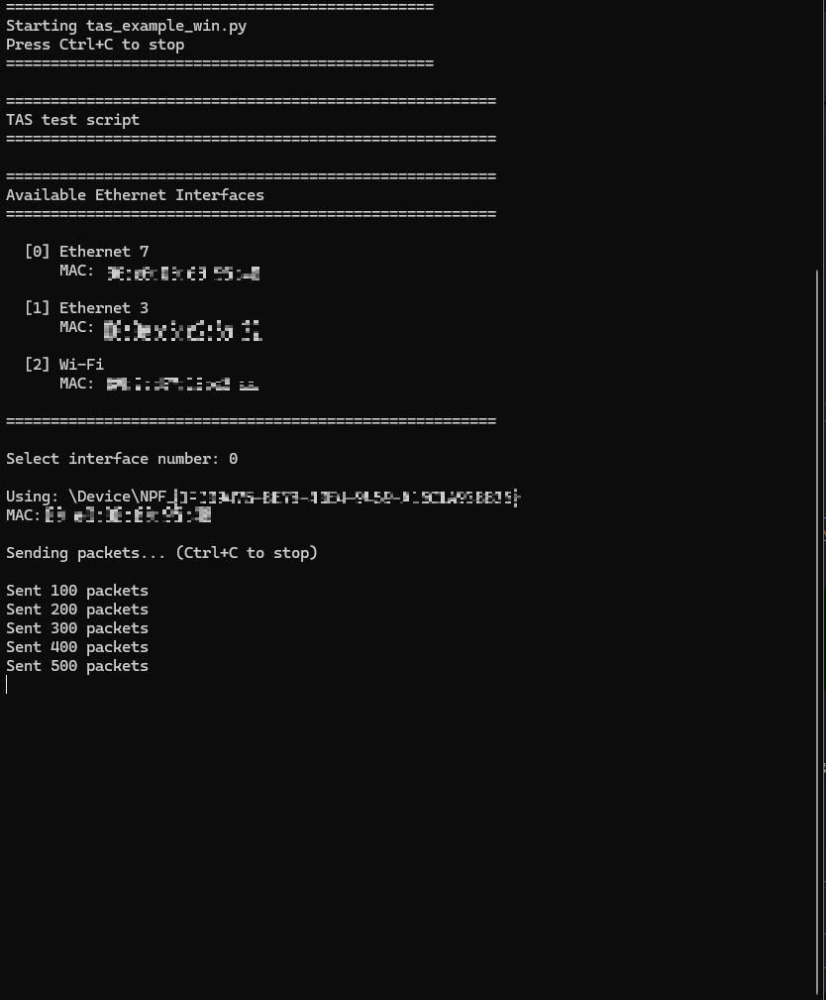

7. The script then transmits the four test frames continuously on a 25 ms cycle. Leave it running
   while you observe the oscilloscope.

8. Press `Ctrl+C` to stop the sender when finished.

**Note:** The script raises the Windows system timer resolution to 1 ms for its own runtime
(`timeBeginPeriod`) and reuses one raw socket for every send, since the default ~15.6 ms timer
resolution and per-call socket creation otherwise make the intended 1 ms inter-packet spacing and
25 ms cycle sync wildly inconsistent. If it falls behind schedule (e.g. a PC scheduling stutter),
it resyncs to the current time instead of bursting through the backlog of missed cycles.

### Oscilloscope Measurement Setup

The EP routes the gate state of queues Q0–Q3 on the gated egress port (Port 1) to four
oscilloscope status pins. Each channel goes high while its queue's gate is open.

| Oscilloscope Channel | Status Pin | Queue | Expected Gate Window (25 ms cycle) |
|---|---|---|---|
| Ch.0 | `ET_TAS_STA0` | Q0 | open 0 ms → 5 ms |
| Ch.1 | `ET_TAS_STA1` | Q1 | open 5 ms → 10 ms |
| Ch.2 | `ET_TAS_STA2` | Q2 | open 10 ms → 15 ms |
| Ch.3 | `ET_TAS_STA3` | Q3 | open 15 ms → 20 ms |

 

**Expected result:** four non-overlapping 5 ms pulses stepping across the cycle, then a 5 ms
interval (20–25 ms) in which all four channels are low, repeating every 25 ms.

**Captured result** - a logic analyzer capture of all four channels: each gate stays open for
~4.9997 ms (Queue 0 through Queue 3) and one full cycle measures ~24.9986 ms, matching the
programmed 5 ms windows and 25 ms cycle within measurement noise.

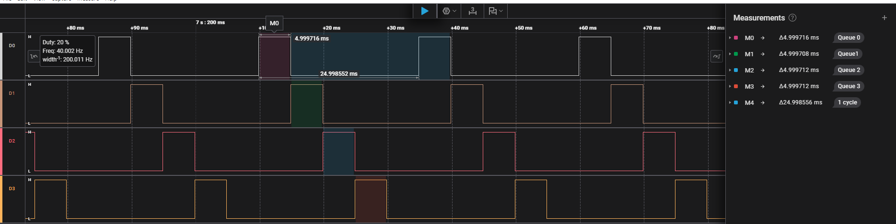

For the MCU pin and board connector that each status pin maps to, see the
[Board-Specific Guide](#supported-boards).

### Wireshark Verification

Capturing on Port 1 confirms the switch is actually classifying and shaping real traffic — a
per-queue burst pattern only appears if the switch is opening/closing gates on schedule for genuine
traffic, which the oscilloscope's gate-timer status pins cannot prove by themselves.

**Pick the right interface.** Sending and capturing are two different PC network interfaces:

* The **sender** interface (Use Case 1 only) is whatever you selected when
  `tas_example_win.py` prompted for one — it must be connected to the board's ingress Port 0. See
  [Selecting the PC sender interface](#setting-up-the-python-environment-for-use-case-1) above.
* The **capture** interface, selected inside Wireshark itself, must be connected to the board's
  gated egress **Port 1** — the shaped output you actually want to verify. On a single PC this
  means two separate NICs (or a NIC plus a USB Ethernet adapter): one plugged into Port 0 to send
  (Use Case 1 only), one plugged into Port 1 to capture. Do not point Wireshark at the sending
  interface — Port 0's raw, unshaped traffic will not show the gate pattern.

1. In Wireshark, start a capture on the PC network interface connected to the board's **Port 1**
   while the sender (Use Case 1) or the board itself (Use Case 2) is generating traffic.
2. Open **Statistics → I/O Graph**. The default 1 s interval averages away the 25 ms cycle, so
   set the graph interval to **500 us** to resolve individual gate windows.
3. Add one graph line per destination MAC (`44:44:44:00:00:0A`–`0D`, one per queue) as the
   display filter, so each queue's burst shows as its own trace. In the graph line table at the
   bottom, name each line (e.g. `gate0`–`gate3`), set its display filter to
   `eth.dst == 44:44:44:00:00:0a` (and `0b`/`0c`/`0d` for the others), give each a distinct color,
   and leave Y Axis on **Bits**.
4. Expect four non-overlapping bursts stepping across each 25 ms cycle, matching the gate windows
   in the [Oscilloscope Measurement Setup](#oscilloscope-measurement-setup) table above.

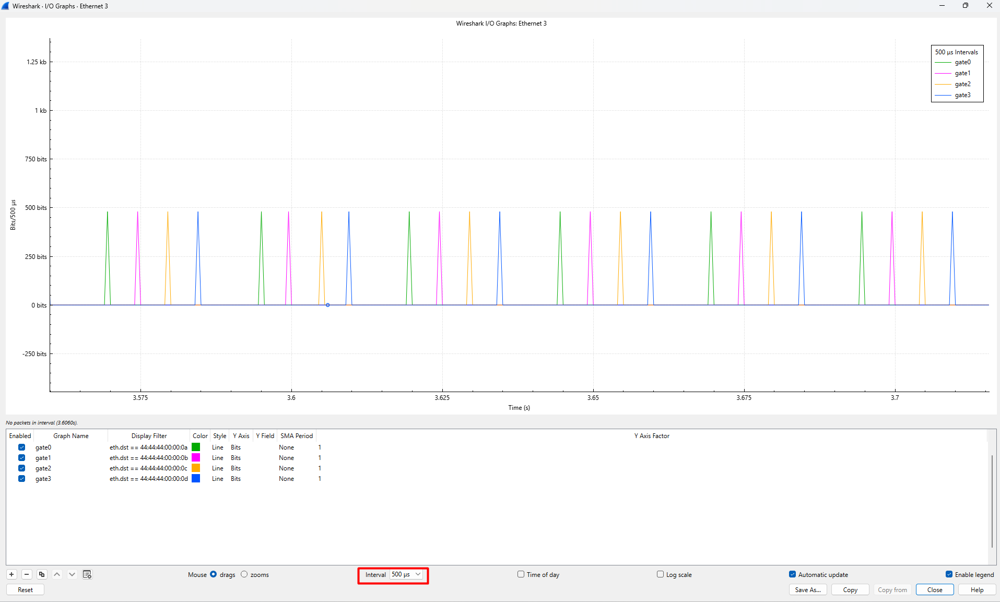

**Note:** When switching between Use Case 1 and Use Case 2 (or re-running the same one), close the
old I/O Graph window and restart the capture rather than reusing it — old and new traffic otherwise
mix on the same graph and cycle boundaries become hard to read.

**Captured result** - the packet list on the Port 1 capture interface for each use case, filtered
to the four queue-steering destination MACs. Consecutive frames land ~5 ms apart within a cycle
and ~10 ms apart across the wrap to the next cycle, matching the programmed schedule.

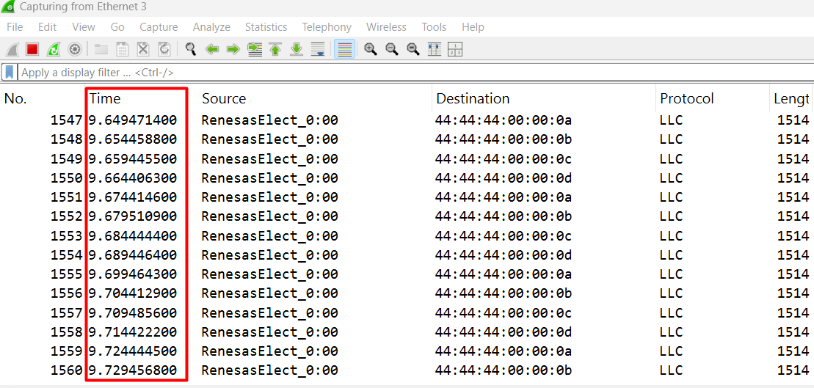

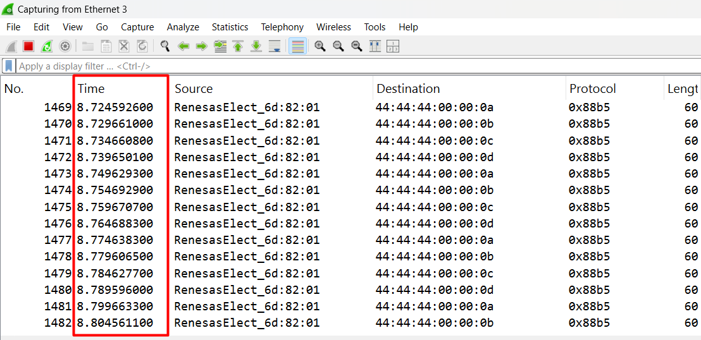

### Execution Output

The following serial-terminal captures are from one continuous run. They show the selected
runtime profile and the schedule submitted to TAS; use the oscilloscope or a wire capture to
verify the physical gate edge or shaped traffic.

**EP banner and information** - the banner identifies the TAS EP and FSP version. `EP_INFO`
states that this is a standalone, single-board demonstration using the ESWM local free-running
timer by default.

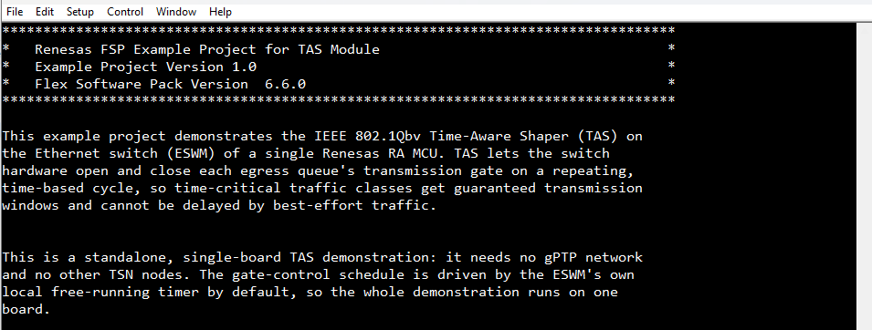

**Main menu** - select UC1 or UC2 to run immediately with the default fixed 3-second cycle start;
select `3` only to reconfigure cycle start.

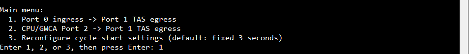

**Fixed cycle-start reconfiguration** - select menu item `3`, choose fixed mode, and enter the
delay in whole seconds. The capture uses a 5-second delay from the new timer epoch.

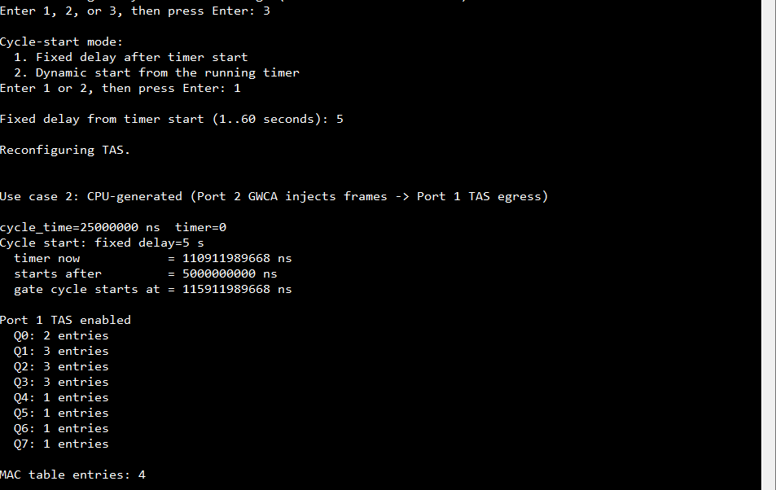

**Use Case 1: port-to-port shaping** - Port 0 is the ingress source and Port 1 is the TAS egress.
The terminal reports the programmed fixed start, gate entry count for each queue, and MAC table
entry count.

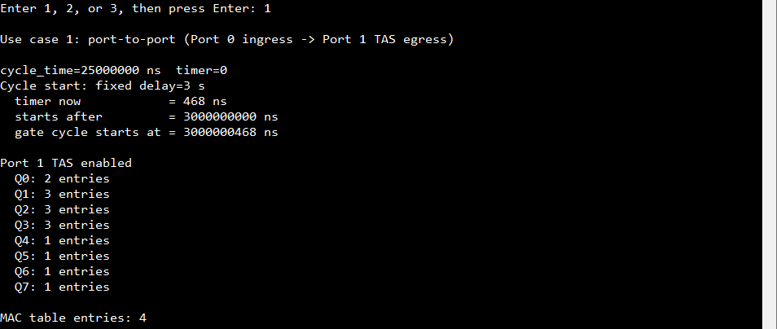

**Use Case 2: CPU-generated traffic** - selecting `2` closes and reconfigures TAS, then uses
the CPU/GWCA Port 2 source and Port 1 TAS egress while retaining the fixed cycle-start setting.

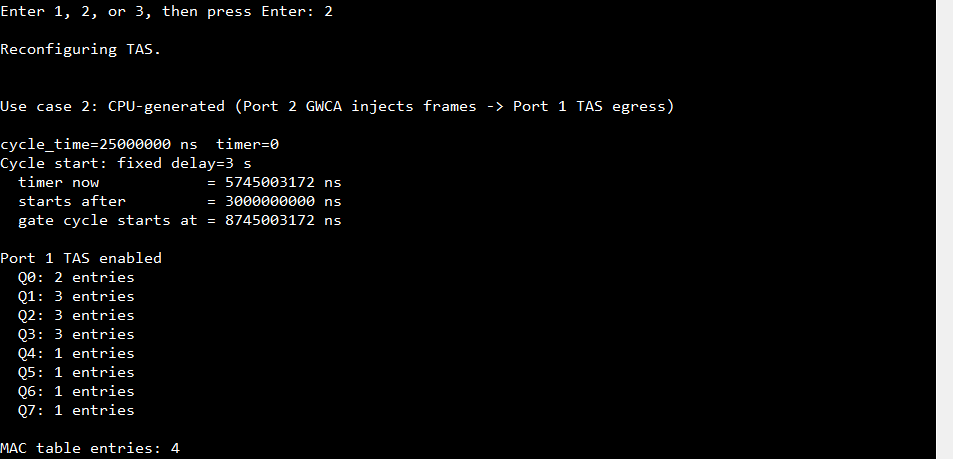

**Runtime change to dynamic cycle start** - selecting `3`, then dynamic mode, closes and
reconfigures TAS again. The reported `timer now`, `starts after`, and `gate cycle starts at`
values show the dynamic start resolved from the running timer.

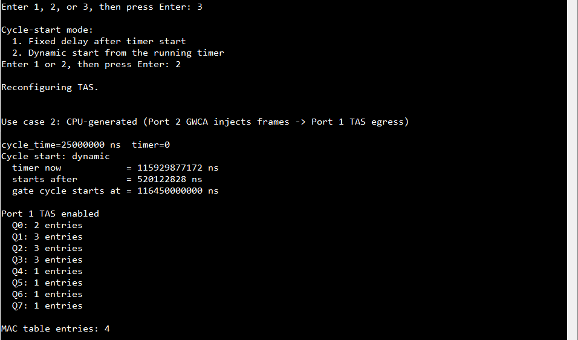

## Project Notes

### System-Level Block Diagram

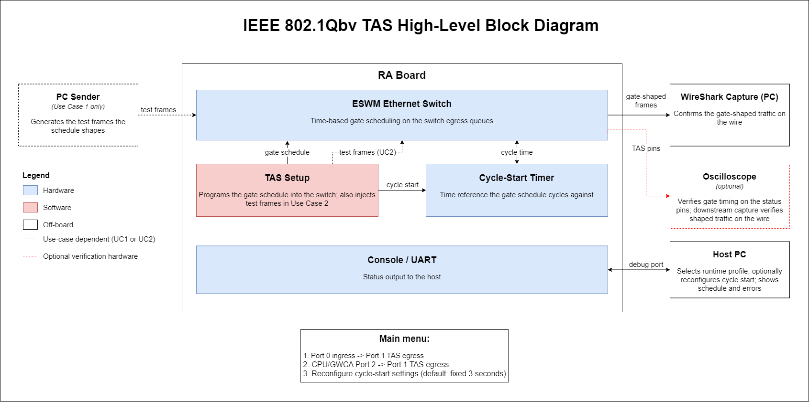

### FSP Modules Used

List all the various modules that are used in this example project. Refer to the FSP User Manual
for further details on each module listed below.

| Module Name | Usage | Searchable Keyword |
|-------------|-------|--------------------|
| Ethernet Switch (Layer3 Switch) | Copies the generated switch configuration and adds the selected profile's source-to-egress forwarding target before opening; programs and enables the IEEE 802.1Qbv gate-control list per port; configures the MAC forwarding table used to steer each test class into its own queue; creates the CPU-side TX descriptor queue for Use Case 2; and closes/reopens for a runtime profile or cycle-start change. | `r_layer3_switch` |
| gPTP Timer | Supplies the selected ESWM hardware timer that the TAS gate schedule uses as its cycle-start reference. This standalone project starts local timer 0. | `r_gptp` |
| Ethernet PHY (RMAC PHY) | Per-port PHY management and link status, used to bring the switch ports up and (Use Case 2) to wait for link before injecting frames. | `r_rmac_phy` |
| SCI_B UART | Retargets `printf` to the UART console and receives the initial and runtime profile/cycle-start selections; it presents the banner, menus, programmed schedule, and any errors on a serial terminal. | `r_sci_b_uart` |
| I/O Port | Board pin configuration at warm start, including the TAS gate status output pins. | `r_ioport` |

 

### Module Configuration Notes

This EP's TAS behaviour is configured in the **application source**, not in the FSP Configurator.
The UART menus select the UC1 or UC2 traffic profile at runtime. Cycle start defaults to fixed
3 seconds and can be reconfigured at runtime. Timer source, cycle geometry, and the shared gate
schedule in `tas_config.h` and `tas_config.c` remain compile-time settings.
The Ethernet Switch stack has four non-default properties this EP relies on; every other
Configurator property on the Ethernet Switch and gPTP stacks is left at default.

**Configuration Properties for "g_layer3_switch0 Ethernet Switch (r_layer3_switch)" instance**
`configuration.xml > Stacks > g_layer3_switch0 Ethernet Switch (r_layer3_switch) > Properties > Settings > Property > Module g_layer3_switch0 Ethernet Switch (r_layer3_switch)`

|   Module Property Path and Identifier   |   Default Value   |   Used Value   | Description |
|-----------------------------------------|-------------------|----------------|-------------|
| General > TAS Support | Disable | Enable | Required — without it `tas_configure_schedule()` returns `FSP_ERR_UNSUPPORTED` and the EP reports this explicitly on the console. |
| General > gPTP Support | Disable | Enable | Required — makes the switch's internal TAS timer infrastructure available through the `g_gptp0` instance. |
| Port 0/1 > Forwarding to CPU | Disable | Enable | Required so frames reach the CPU port — Use Case 2 injects test frames through it, and status reporting reads back what the switch is doing. |
| Port 0/1 > gPTP Timer Number | 0 | Port 0: `0`, Port 1: `1` | Per-port RMAC timestamp-timer association. TAS selects its schedule timer through `TAS_GPTP_TIMER`; it is independent of the egress port. |

 

**Configuration Properties for the TAS application** `src/tas_config.h`

| Macro | Used Value | Description |
|---|---|---|
| `TAS_GPTP_TIMER` | `0` | ESWM timer used as the standalone TAS schedule timebase. It is independent of the selected egress port. |
| `TAS_START_TIMER` | `1` | `1` = this module starts the timer (standalone). Set to `0` in a gPTP project, where the gPTP stack already started it. |
| `TAS_CYCLE_TIME_NS` | `25000000` | Gate-control-list cycle period (25 ms). |
| `TAS_CYCLE_START_FIXED_DEFAULT_S` | `3` | Default fixed delay used when the user selects UC1 or UC2 without reconfiguring cycle start. |
| `TAS_CYCLE_START_MODE_FIXED` / `TAS_CYCLE_START_MODE_DYNAMIC` | `0` / `1` | Runtime mode identifiers selected from the UART menu; neither is a build-time selection. |
| `TAS_CYCLE_START_FIXED_MIN_S` / `TAS_CYCLE_START_FIXED_MAX_S` | `1` / `60` | Valid fixed delays in whole seconds, measured from the new timer epoch after confirmation. |
| `TAS_CYCLE_START_MARGIN_NS` | `500000000` | Dynamic mode only — lead time added to the timer reading before rounding to the next cycle boundary. |
| `TAS_SOURCE_PORT` | `0` | UC1 profile source: the ingress port external traffic enters on. Must differ from `TAS_DESTINATION_PORT`; the switch does not re-egress a frame out the same port it ingressed on. |
| `TAS_DESTINATION_PORT` | `1` | The gated egress port whose queues the schedule shapes. |
| `TAS_CPU_PORT` | `2` | UC2 profile source: the internal CPU / GWCA port used to inject frames when UC2 is selected. |
| `TAS_MAC_TABLE_ENABLE` | `1` | Adds one MAC table entry per schedule row that has a MAC, steering that MAC into that row's queue. |
| `TAS_STATUS_PINS_ENABLE` | `1` | Routes each row's gate state to its `ET_TAS_STA0..3` oscilloscope pin. |
| `TAS_TX_ETHERTYPE` | `0x88B5` | UC2 only at runtime — EtherType of the generated frames (IEEE local experimental). |
| `TAS_TX_SOURCE_MAC` | `74:90:50:6D:82:01` | UC2 only at runtime — source MAC of the generated frames (this board's Port 1 MAC, the port these frames egress from). |

 

**Gate schedule table** `src/tas_config.c`

Each row of `g_tas_rows[]` describes one (port, queue) gate: its open windows inside the cycle,
the destination MAC steered into it, and which status pin reports it. The runtime-selected profile
supplies the MAC steering source: Port 0 for UC1 or CPU Port 2 for UC2. The default table is:

| Queue | Gate Windows | Steered MAC | Ingress Port (UC1 / UC2) | Status Pin |
|---|---|---|---|---|
| Q0 | open 0 ms, for 5 ms | `44:44:44:00:00:0A` | Port 0 / CPU Port 2 | `ET_TAS_STA0` |
| Q1 | open 5 ms, for 5 ms | `44:44:44:00:00:0B` | Port 0 / CPU Port 2 | `ET_TAS_STA1` |
| Q2 | open 10 ms, for 5 ms | `44:44:44:00:00:0C` | Port 0 / CPU Port 2 | `ET_TAS_STA2` |
| Q3 | open 15 ms, for 5 ms | `44:44:44:00:00:0D` | Port 0 / CPU Port 2 | `ET_TAS_STA3` |
| Q4–Q7 | permanently closed | none | — | unused |

 

Use Case 1 and Use Case 2 use identical gate timing — only the ingress port the MACs are steered
from differs, so the same schedule can be driven either by external traffic or by the MCU itself.

### API Usage

The links below list the FSP-provided APIs used at the application layer.

* [Ethernet Switch (Layer3 Switch) APIs on FSP User Manual on GitHub](https://renesas.github.io/fsp/)
* [gPTP Timer APIs on FSP User Manual on GitHub](https://renesas.github.io/fsp/)
* [SCI_B UART Module APIs on FSP User Manual on GitHub](https://renesas.github.io/fsp/group___s_c_i___b___u_a_r_t.html)
* [I/O Port APIs on FSP User Manual on GitHub](https://renesas.github.io/fsp/group___i_o_p_o_r_t.html)

### Memory Usage

Memory usage varies depending on the target board, compiler, and build configuration.

**Reference Measurements:**

| Compiler | Flash Usage | RAM Usage (Static) |
|:--------:|:-----------:|:-------------------:|
| LLVM 22.1.0 | 33,666 bytes (~32.9 KB) | 7,460 bytes (~7.3 KB) |

 

**Note:**
* Flash usage is `text + data`; static RAM usage is `data + bss`.
* Additional memory is required at run time for the stack and the heap, which are not included
  above (the `Debug/*.map` file also reserves a separate ~12 KB main stack region).
* Measured from the Debug build's `Debug/tas_mck_ra8t2_ep.map`. A Release build is typically
  smaller.
* For a full breakdown open the project's `.map` file in `Debug/`, or use the **Memory Usage** view in e² studio.

### Clock Configuration

No special clock adjustments are necessary for this EP. The gate schedule uses ESWM timer 0 by
default (`TAS_GPTP_TIMER = 0`), which is started by the EP itself (`TAS_START_TIMER = 1`).

### Application Execution Flow

This section describes the sequence of events and usage of APIs during the execution flow of the
application. The diagram shows the TAS setup and steady-state operation for both use cases:

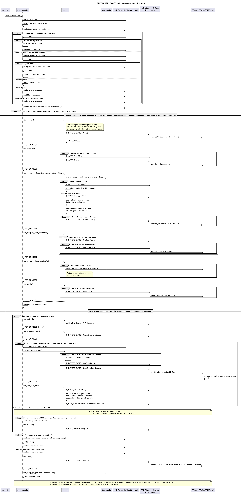

In summary:

1. `hal_entry()` calls `tas_example_run()`, which never returns.
2. The console is initialized, then the EP banner and Main menu are printed. Choices `1`/`2` select
   the profile and immediately use the default fixed 3-second cycle start. Choice `3` reconfigures
   fixed (1--60 seconds) or dynamic cycle start before a profile is selected or while TAS runs.
3. The setup sequence runs in order with that selected profile — copy the generated switch configuration, add its source-to-egress forwarding target, open the switch, start the timer, program the schedule, add
   the MAC table entries, route the status pins, then enable TAS. Each step's return code is
   checked; the first failure is reported on the console and traps execution, so the EP never
   continues with a partially programmed schedule.
4. The programmed schedule is printed.
5. When UC1 is selected the application then idles forever while the switch shapes externally injected
   traffic in hardware. When UC2 is selected it waits for link, creates the TX descriptor queue, and
   then injects one frame per queue every cycle, forever. In either state, `1` or `2` requests a
   profile change and `3` opens the cycle-start submenu; a changed configuration closes and
   reinitializes the switch.

### Troubleshooting Tips

**Problem: no pulses on the oscilloscope status pins.**

* **Cause:** Status-pin routing is disabled, the probes are on the wrong pins, or TAS never got
  enabled.
* **Fix:** Confirm `TAS_STATUS_PINS_ENABLE` is `1`, check the probe pins against the
  [Board-Specific Guide](#supported-boards), and confirm the console printed
  `Port 1 TAS enabled`.

### Known Limitations

1. Only four gate status pins exist (`ET_TAS_STA0..3`), so at most four of the eight queues can be
   observed on an oscilloscope at once. The default schedule therefore instruments Q0–Q3 and
   leaves Q4–Q7 permanently closed.
2. Use Case 1's PC sender has no time synchronization with the board — its clock and the board's
   TAS timer are independent, so the arrival phase of external traffic drifts against the gate
   schedule over a long capture. This can make one queue's Wireshark burst look compressed or
   stretched relative to its neighbors even though the switch is gating correctly; verify the
   physical gate edge with the oscilloscope (see
   [Oscilloscope Measurement Setup](#oscilloscope-measurement-setup)) before suspecting a
   scheduling bug. Use Case 2 is not affected, since the MCU drives both the schedule and the
   traffic from the same timer.

## Special Topics

**Choosing between the two use cases**

Both use cases program an identical gate schedule; they differ only in where the shaped traffic
comes from. Main-menu choices `1`/`2` select UC1 or UC2 after reset or while a profile is active,
using the default fixed 3-second cycle start until choice `3` reconfigures it. No use-case-specific
rebuild is required.

* **Use Case 1 (port-to-port)** validates the switch against a real external traffic source. Use
  it when you want to confirm that traffic arriving from the network is shaped correctly, and you
  have a PC (or another sender) available.
* **Use Case 2 (CPU-generated)** needs no external sender: the MCU builds the frames and injects
  them through the internal GWCA port. It still needs a powered link partner or receiver on gated
  egress Port 1. Use it for bring-up without a separate traffic-generator PC, or as the starting
  point for an application that transmits its own time-critical traffic.

**Reusing the TAS module in another project**

`tas_ep.{c,h}` is written to be copied verbatim into another project — it calls only FSP APIs,
checks and returns error status, and prints nothing. Only `tas_config.{c,h}` needs to change to
describe a different schedule.

## Conclusion and Next Steps

* **Conclusion:**

    This example project demonstrates the IEEE 802.1Qbv Time-Aware Shaper on the Ethernet switch
    of a Renesas RA MCU, on a single board and with no gPTP network required. Users learn how to:

    * Describe a gate-control schedule as data and program it into the switch hardware
    * Steer traffic classes into individual egress queues using the switch MAC table
    * Drive the schedule from either a local free-running timer or a gPTP-synchronized timer
    * Verify gate timing directly with an oscilloscope using the ESWM gate status pins
    * Drive the schedule either from external traffic or from MCU-generated frames

    Because the shaping is performed entirely by the switch hardware, the gate windows keep their
    timing with no CPU involvement once the schedule is enabled.

* **Next Steps:**

    * Review the project source code located in the `src` directory — in particular
      `tas_config.c`, where the schedule is expressed as an editable table.
    * Modify the schedule (cycle time, window offsets and durations, queues used) and re-measure
      the gate windows on the oscilloscope to see the effect.
    * Refer to the HAL driver and its documentation in the FSP User Manual for deeper technical
      insights.
    * Combine this module with a gPTP stack to align a gate schedule to network time across
      multiple nodes.
    * Visit renesas.com for additional application notes and documentation related to RA devices.

## References
The following documents can be referred to for enhancing your understanding of the operation of
this example project:
* [FSP User Manual on GitHub](https://renesas.github.io/fsp/)
* [FSP Known Issues](https://github.com/renesas/fsp/issues)
* [Documentation & Downloads Search](https://www.renesas.com/en/support/document-search?page=0)
* [IEEE 802.1Q](https://standards.ieee.org/ieee/802.1Q/6844/) — Bridges and Bridged Networks,
  which incorporates the 802.1Qbv Enhancements for Scheduled Traffic (Time-Aware Shaper).

## Notice

1. Descriptions of circuits, software and other related
information in this document are provided only to illustrate the
operation of semiconductor products and application examples. You are
fully responsible for the incorporation or any other use of the
circuits, software, and information in the design of your product or
system. Renesas Electronics disclaims any and all liability for any
losses and damages incurred by you or third parties arising from the use
of these circuits, software, or information. 

2. Renesas Electronics
hereby expressly disclaims any warranties against and liability for
infringement or any other claims involving patents, copyrights, or other
intellectual property rights of third parties, by or arising from the
use of Renesas Electronics products or technical information described
in this document, including but not limited to, the product data,
drawings, charts, programs, algorithms, and application examples. 

3. No license, express, implied or otherwise, is granted hereby under any
patents, copyrights or other intellectual property rights of Renesas
Electronics or others. 

4. You shall be responsible for determining what
licenses are required from any third parties, and obtaining such
licenses for the lawful import, export, manufacture, sales, utilization,
distribution or other disposal of any products incorporating Renesas
Electronics products, if required. 

5. You shall not alter, modify, copy,
or reverse engineer any Renesas Electronics product, whether in whole or
in part. Renesas Electronics disclaims any and all liability for any
losses or damages incurred by you or third parties arising from such
alteration, modification, copying or reverse engineering. 

6. Renesas Electronics products are classified according to the following two
quality grades: "Standard" and "High Quality". The intended applications
for each Renesas Electronics product depends on the product's quality
grade, as indicated below. "Standard": Computers; office equipment;
communications equipment; test and measurement equipment; audio and
visual equipment; home electronic appliances; machine tools; personal
electronic equipment; industrial robots; etc. "High Quality":
Transportation equipment (automobiles, trains, ships, etc.); traffic
control (traffic lights); large-scale communication equipment; key
financial terminal systems; safety control equipment; etc. Unless
expressly designated as a high reliability product or a product for
harsh environments in a Renesas Electronics data sheet or other Renesas
Electronics document, Renesas Electronics products are not intended or
authorized for use in products or systems that may pose a direct threat
to human life or bodily injury (artificial life support devices or
systems; surgical implantations; etc.), or may cause serious property
damage (space system; undersea repeaters; nuclear power control systems;
aircraft control systems; key plant systems; military equipment; etc.).
Renesas Electronics disclaims any and all liability for any damages or
losses incurred by you or any third parties arising from the use of any
Renesas Electronics product that is inconsistent with any Renesas
Electronics data sheet, user's manual or other Renesas Electronics
document. 

7. No semiconductor product is absolutely secure. Notwithstanding any security measures or features that may be implemented in Renesas Electronics hardware or software products, Renesas Electronics shall have absolutely no liability arising out of
any vulnerability or security breach, including but not limited to any unauthorized access to or use of a Renesas Electronics product or a system that uses a Renesas Electronics product. RENESAS ELECTRONICS DOES NOT WARRANT OR GUARANTEE THAT RENESAS ELECTRONICS PRODUCTS, OR ANY
SYSTEMS CREATED USING RENESAS ELECTRONICS PRODUCTS WILL BE INVULNERABLE OR FREE FROM CORRUPTION, ATTACK, VIRUSES, INTERFERENCE, HACKING, DATA LOSS OR THEFT, OR OTHER SECURITY INTRUSION ("Vulnerability Issues"). RENESAS ELECTRONICS DISCLAIMS ANY AND ALL RESPONSIBILITY OR LIABILITY
ARISING FROM OR RELATED TO ANY VULNERABILITY ISSUES. FURTHERMORE, TO THE EXTENT PERMITTED BY APPLICABLE LAW, RENESAS ELECTRONICS DISCLAIMS ANY AND ALL WARRANTIES, EXPRESS OR IMPLIED, WITH RESPECT TO THIS DOCUMENT
AND ANY RELATED OR ACCOMPANYING SOFTWARE OR HARDWARE, INCLUDING BUT NOT LIMITED TO THE IMPLIED WARRANTIES OF MERCHANTABILITY, OR FITNESS FOR A PARTICULAR PURPOSE. 

8. When using Renesas Electronics products, refer to the latest product information (data sheets, user's manuals, application notes, "General Notes for Handling and Using Semiconductor Devices" in
the reliability handbook, etc.), and ensure that usage conditions are within the ranges specified by Renesas Electronics with respect to
maximum ratings, operating power supply voltage range, heat dissipation characteristics, installation, etc. Renesas Electronics disclaims any
and all liability for any malfunctions, failure or accident arising out of the use of Renesas Electronics products outside of such specified
ranges. 

9. Although Renesas Electronics endeavors to improve the quality and reliability of Renesas Electronics products, semiconductor products
have specific characteristics, such as the occurrence of failure at a certain rate and malfunctions under certain use conditions. Unless
designated as a high reliability product or a product for harsh environments in a Renesas Electronics data sheet or other Renesas
Electronics document, Renesas Electronics products are not subject to radiation resistance design. You are responsible for implementing safety
measures to guard against the possibility of bodily injury, injury or damage caused by fire, and/or danger to the public in the event of a
failure or malfunction of Renesas Electronics products, such as safety design for hardware and software, including but not limited to
redundancy, fire control and malfunction prevention, appropriate treatment for aging degradation or any other appropriate measures.
Because the evaluation of microcomputer software alone is very difficult and impractical, you are responsible for evaluating the safety of the
final products or systems manufactured by you. 

10. Please contact a
Renesas Electronics sales office for details as to environmental matters such as the environmental compatibility of each Renesas Electronics
product. You are responsible for carefully and sufficiently investigating applicable laws and regulations that regulate the
inclusion or use of controlled substances, including without limitation, the EU RoHS Directive, and using Renesas Electronics products in
compliance with all these applicable laws and regulations. Renesas Electronics disclaims any and all liability for damages or losses
occurring as a result of your noncompliance with applicable laws and regulations. 

11. Renesas Electronics products and technologies shall not be used for or incorporated into any products or systems whose
manufacture, use, or sale is prohibited under any applicable domestic or foreign laws or regulations. You shall comply with any applicable export
control laws and regulations promulgated and administered by the governments of any countries asserting jurisdiction over the parties or
transactions. 

12. It is the responsibility of the buyer or distributor of Renesas Electronics products, or any other party who distributes,
disposes of, or otherwise sells or transfers the product to a third party, to notify such third party in advance of the contents and
conditions set forth in this document. 

13. This document shall not be
reprinted, reproduced or duplicated in any form, in whole or in part, without prior written consent of Renesas Electronics. 

14. Please contact a Renesas Electronics sales office if you have any questions regarding the information contained in this document or Renesas Electronics
products. (Note1) "Renesas Electronics" as used in this document means Renesas Electronics Corporation and also includes its directly or
indirectly controlled subsidiaries. (Note2) "Renesas Electronics product(s)" means any product developed or manufactured by or for
Renesas Electronics.

                                                                                   (Rev.5.0-1 October 2020)
## Corporate Headquarters 

Contact information TOYOSU FORESIA, 3-2-24

Toyosu, Koto-ku, Tokyo 135-0061, Japan 

www.renesas.com 

## Contact information 

For further information on a product, technology, the most up-to-date version of a
document, or your nearest sales office, please visit:
www.renesas.com/contact/. 

## Trademarks 
Renesas and the Renesas logo are trademarks of Renesas Electronics Corporation. All trademarks and
registered trademarks are the property of their respective owners.

                            © 2026 Renesas Electronics Corporation. All rights reserved
