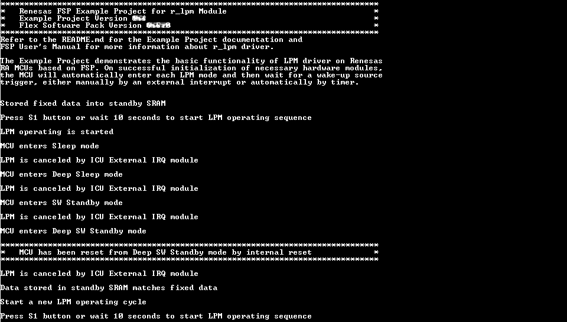
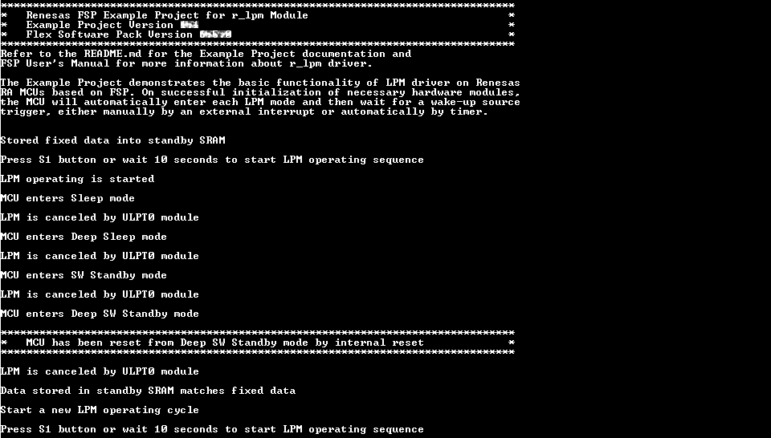
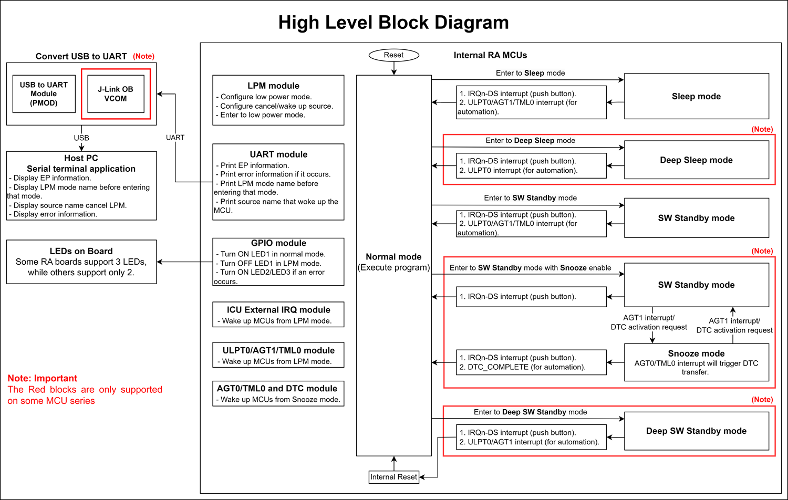
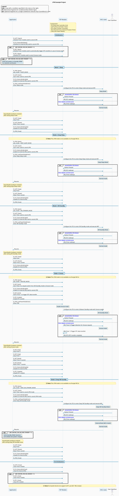
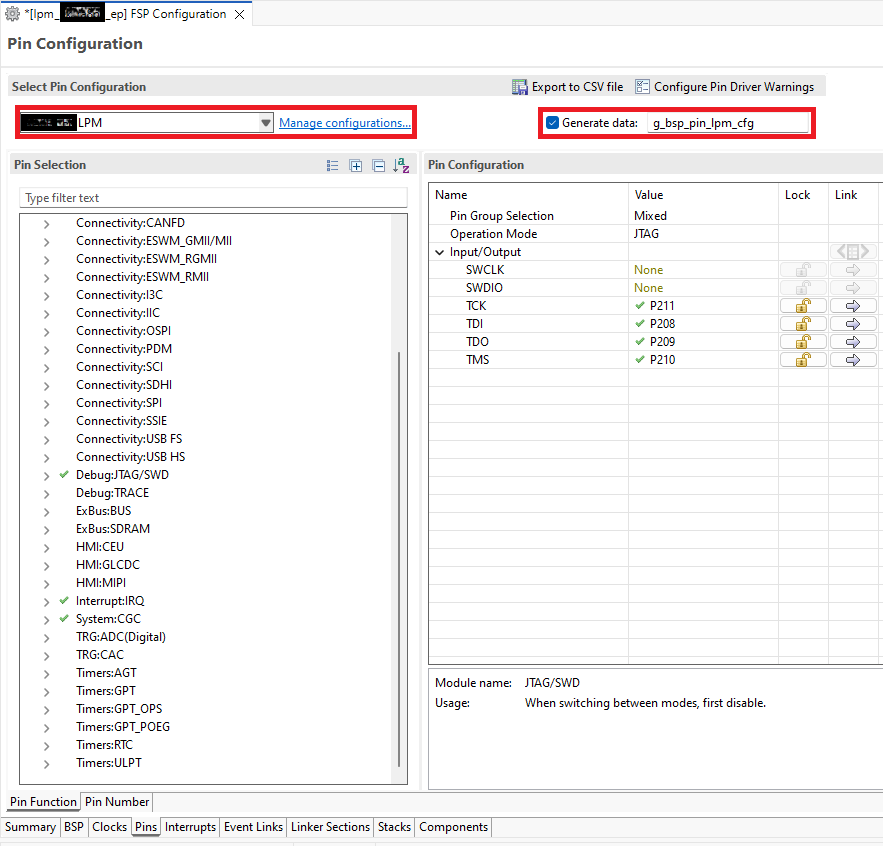

# Low Power Mode Example on RA Boards

## Table of Contents
1. [Introduction](#introduction)
    1. [Supported Boards](#supported-boards)
2. [Required Resources](#required-resources)
    1. [Hardware Requirements](#hardware-requirements)
        1. [Common Hardware](#common-hardware)
        2. [Additional Hardware](#additional-hardware)
        3. [Hardware Connections](#hardware-connections)
    2. [Software Requirements](#software-requirements)
3. [Application Execution](#application-execution)
4. [Project Notes](#project-notes)
    1. [System-Level Block Diagram](#system-level-block-diagram)
    2. [FSP Modules Used](#fsp-modules-used)
    3. [Module Configuration Notes](#module-configuration-notes)
    4. [API Usage](#api-usage)
    5. [Memory Usage](#memory-usage)
    6. [Application Execution Flow](#application-execution-flow)
    7. [Troubleshooting Tips](#troubleshooting-tips)
    8. [Known Limitations](#known-limitations)
5. [Special Topics](#special-topics)
6. [Conclusion and Next Steps](#conclusion-and-next-steps)
7. [References](#references)
8. [Notice](#notice)

## Introduction
The Low Power Mode (LPM) Example Project (EP) demonstrates the basic functionalities of the LPM module on Renesas RA MCUs using Renesas FSP. The project also illustrates methods to reduce MCU power consumption and restore the pre-LPM states of peripheral modules. The EP will perform different low power mode transitions based on the user's selection of Low Power Mode, request, and cancel sources in the RA Configurator. The MCU will automatically enter each LPM mode and then wait for cancel sources to trigger manually by an external interrupt or automatically by a timer to exit LPM mode. Turn OFF LED1 and display the LPM mode name on the console before entering each LPM mode. Turn ON LED1 and display the cancel source name on the console after exiting each LPM mode. The EP log will print to the Host PC via the UART interface at a baud rate of 115200 bps. The LED2/LED3 will turn ON if an error occurs.

Please refer to the [Example Project Usage Guide](https://github.com/renesas/ra-fsp-examples/blob/master/example_projects/Example%20Project%20Usage%20Guide.pdf) for general information on example projects.

### Supported Boards

| #  | Board | MCU | J-Link OB VCOM | Board-Specific Guide |
|----|-------|-----|----------------|----------------------|
| 1  | EK-RA2A1   | R7FA2A1AB3CFM | ☐ | [EK-RA2A1 Guide](lpm_board_specific_notes.md#ekra2a1) |
| 2  | EK-RA2A2   | R7FA2A2AD3CFP | ☑ | [EK-RA2A2 Guide](lpm_board_specific_notes.md#ekra2a2) |
| 3  | EK-RA2E1   | R7FA2E1A92DFM | ☐ | [EK-RA2E1 Guide](lpm_board_specific_notes.md#ekra2e1) |
| 4  | EK-RA2E2   | R7FA2E2A72DNK | ☐ | [EK-RA2E2 Guide](lpm_board_specific_notes.md#ekra2e2) |
| 5  | EK-RA2L1   | R7FA2L1AB2DFP | ☐ | [EK-RA2L1 Guide](lpm_board_specific_notes.md#ekra2l1) |
| 6  | EK-RA2L2   | R7FA2L2094CFM | ☑ | [EK-RA2L2 Guide](lpm_board_specific_notes.md#ekra2l2) |
| 7  | EK-RA4C1   | R7FA4C1BD3CFP | ☑ | [EK-RA4C1 Guide](lpm_board_specific_notes.md#ekra4c1) |
| 8  | EK-RA4E2   | R7FA4E2B93CFM | ☑ | [EK-RA4E2 Guide](lpm_board_specific_notes.md#ekra4e2) |
| 9  | EK-RA4L1   | R7FA4L1BD4CFP | ☑ | [EK-RA4L1 Guide](lpm_board_specific_notes.md#ekra4l1) |
| 10 | EK-RA4M1   | R7FA4M1AB3CFP | ☐ | [EK-RA4M1 Guide](lpm_board_specific_notes.md#ekra4m1) |
| 11 | EK-RA4M2   | R7FA4M2AD3CFP | ☐ | [EK-RA4M2 Guide](lpm_board_specific_notes.md#ekra4m2) |
| 12 | EK-RA4M3   | R7FA4M3AF3CFB | ☐ | [EK-RA4M3 Guide](lpm_board_specific_notes.md#ekra4m3) |
| 13 | EK-RA4W1   | R7FA4W1AD2CNG | ☐ | [EK-RA4W1 Guide](lpm_board_specific_notes.md#ekra4w1) |
| 14 | EK-RA6E2   | R7FA6E2BB3CFM | ☑ | [EK-RA6E2 Guide](lpm_board_specific_notes.md#ekra6e2) |
| 15 | EK-RA6M1   | R7FA6M1AD3CFP | ☐ | [EK-RA6M1 Guide](lpm_board_specific_notes.md#ekra6m1) |
| 16 | EK-RA6M2   | R7FA6M2AF3CFB | ☐ | [EK-RA6M2 Guide](lpm_board_specific_notes.md#ekra6m2) |
| 17 | EK-RA6M3   | R7FA6M3AH3CFC | ☐ | [EK-RA6M3 Guide](lpm_board_specific_notes.md#ekra6m3) |
| 18 | EK-RA6M3G  | R7FA6M3AH3CFC | ☐ | [EK-RA6M3G Guide](lpm_board_specific_notes.md#ekra6m3g) |
| 19 | EK-RA6M4   | R7FA6M4AF3CFB | ☐ | [EK-RA6M4 Guide](lpm_board_specific_notes.md#ekra6m4) |
| 20 | EK-RA6M5   | R7FA6M5BH3CFC | ☐ | [EK-RA6M5 Guide](lpm_board_specific_notes.md#ekra6m5) |
| 21 | EK-RA8D1   | R7FA8D1BHECBD | ☑ | [EK-RA8D1 Guide](lpm_board_specific_notes.md#ekra8d1) |
| 22 | EK-RA8E2   | R7FA8E2AFDCBD | ☑ | [EK-RA8E2 Guide](lpm_board_specific_notes.md#ekra8e2) |
| 23 | EK-RA8M1   | R7FA8M1AHECBD | ☑ | [EK-RA8M1 Guide](lpm_board_specific_notes.md#ekra8m1) |
| 24 | EK-RA8P1   | R7KA8P1KFLCAC | ☑ | [EK-RA8P1 Guide](lpm_board_specific_notes.md#ekra8p1) |
| 25 | FPB-RA0E1  | R7FA0E1073CFJ | ☑ | [FPB-RA0E1 Guide](lpm_board_specific_notes.md#fpbra0e1) |
| 26 | FPB-RA0E2  | R7FA0E2094CFM | ☑ | [FPB-RA0E2 Guide](lpm_board_specific_notes.md#fpbra0e2) |
| 27 | FPB-RA0L1  | R7FA0L1074CFL | ☑ | [FPB-RA0L1 Guide](lpm_board_specific_notes.md#fpbra0l1) |
| 28 | FPB-RA2E3  | R7FA2E3073CFL | ☑ | [FPB-RA2E3 Guide](lpm_board_specific_notes.md#fpbra2e3) |
| 29 | FPB-RA2T1  | R7FA2T1074CFL | ☑ | [FPB-RA2T1 Guide](lpm_board_specific_notes.md#fpbra2t1) |
| 30 | FPB-RA4E1  | R7FA4E10D2CFM | ☐ | [FPB-RA4E1 Guide](lpm_board_specific_notes.md#fpbra4e1) |
| 31 | FPB-RA6E1  | R7FA6E10F2CFP | ☐ | [FPB-RA6E1 Guide](lpm_board_specific_notes.md#fpbra6e1) |
| 32 | FPB-RA8E1  | R7FA8E1AFDCFB | ☑ | [FPB-RA8E1 Guide](lpm_board_specific_notes.md#fpbra8e1) |
| 33 | MCK-RA4T1  | R7FA4T1BB3CFM | ☑ | [MCK-RA4T1 Guide](lpm_board_specific_notes.md#mckra4t1) |
| 34 | MCK-RA6T2  | R7FA6T2BD3CFP | ☐ | [MCK-RA6T2 Guide](lpm_board_specific_notes.md#mckra6t2) |
| 35 | MCK-RA6T3  | R7FA6T3BB3CFM | ☑ | [MCK-RA6T3 Guide](lpm_board_specific_notes.md#mckra6t3) |
| 36 | MCK-RA8T1  | R7FA8T1AHECBD | ☑ | [MCK-RA8T1 Guide](lpm_board_specific_notes.md#mckra8t1) |
| 37 | MCK-RA8T2  | R7KA8T2LFECAC | ☑ | [MCK-RA8T2 Guide](lpm_board_specific_notes.md#mckra8t2) |
| 38 | RSSK-RA6T1 | R7FA6T1AD3CFP | ☐ | [RSSK-RA6T1 Guide](lpm_board_specific_notes.md#rsskra6t1) |

 

**Notes:**
* Boards with **☑** under **J-Link OB VCOM** support serial communication via J-Link OB VCOM. Using a serial terminal application (e.g., Tera Term) to interact.
* For boards that do not support J-Link OB VCOM, use Pmod UART for serial communication.

## Required Resources

### Hardware Requirements

#### Common Hardware
* 1 × Supported RA board (Refer to [Supported Boards](#supported-boards) section).
* 1 × USB cable for programming and debugging (USB cable type varies by board model).

#### Additional Hardware
* Detailed **Additional Hardware** for each supported board is described in the [Board-Specific Guide](#supported-boards).

#### Hardware Connections
* Detailed **Specific Connections** for each supported board is described in the [Board-Specific Guide](#supported-boards).
* After completing board-specific hardware connections, perform the following common connection steps:
    * Connect the RA board's USB debug port to the host PC using the appropriate USB cable.

### Software Requirements
* Renesas Flexible Software Package (FSP): Version 6.5.0
* e2 studio: Version 2026-04.2
* LLVM Embedded Toolchain for ARM: Version 21.1.1
* GCC ARM Embedded Toolchain: Version 13.2.1.arm-13-7
* Terminal Console Application: Tera Term or a similar application

**Note:** Refer to the [FSP version requirements](https://github.com/renesas/ra-fsp-examples/blob/master/example_projects/version_info_table.md) table per IDE to correctly download the needed [FSP release](https://github.com/renesas/fsp/releases).

## Application Execution
1. Import, generate, and build the example project.
2. Before running the example project, make sure the [hardware connections](#hardware-connections) are completed.
3. Download the example project to the RA board using the USB debug port. J-Link may be disconnected when MCU enter LPM mode. So, the user should stop debugging after downloading the EP.
4. Open a serial terminal application (e.g., Tera Term) on the host PC and connect to the COM port provided by the J-Link OB VCOM or Pmod USBUART. The configuration parameters of the serial port on the serial terminal application are as follows:
    * Speed: 115200
    * Data: 8 bit
    * Parity: none
    * Stop bits: 1 bit
    * Flow control: none
5. Power-cycle the RA board.
    * Power-cycle the RA board is required to avoid influence of debugging into cancel LPM mode. When the influence happens, the log "LPM is canceled, but source has not been detected" will be printed.
6. Press the user push-button S1 or wait 10 seconds to enter and cancel LPM mode. It will turn OFF LED1 before entering each LPM mode and turn ON LED1 after exiting each LPM mode.
7. The LPM mode name will be displayed on the terminal application before entering each LPM mode, and the canceling source name will be displayed on the serial terminal application after exiting each LPM mode.

### Execution Output

**Note:** Execution results may vary depending on the supported features and hardware capabilities of each board.

* The following example shows the execution output on the EK-RA8D1 board:

    * The log when use push-button S1 to cancel/end LPM mode:

        

    * The log when automatically cancel/end LPM mode by timer:

        

## Project Notes

### System-Level Block Diagram

### FSP Modules Used

List all the various modules that are used in this example project. Refer to the FSP User Manual for further details on each module listed below.

| Module Name | Usage | Searchable Keyword |
|-------------|-------|--------------------|
| LPM | LPM is used to configure power cancellation, mode selection and return the MCU to low power mode to reduce power consumption. | r_lpm |
| ULPT | ULPT is used to automatically cancel LPM modes; It is used as the request source and end source in Snooze mode if the MCU supports this mode. | r_ulpt |
| External IRQ | External IRQ is used to manually cancel the LPM modes. | r_icu |
| DTC | DTC is used to automatically cancel Snooze mode, only used on MCUs that support Snooze mode. | r_dtc |
| SCI B UART | SCI B UART is used to print the log of the example project to the serial terminal application. | r_sci_b_uart |

 

Note:
* For boards that do not support ULPT (r_ulpt), use AGT (r_agt) or TML (r_tml) instead.
* For boards that do not support SCI B UART (r_sci_b_uart), use SCI UART (r_sci_uart) or UARTA (r_uarta) instead.

### Module Configuration Notes

This section describes FSP Configurator properties which are important or different from those selected by default.

**Configuration Properties for Low Power Modes (r_lpm) — `g_lpm_sleep` instance (For MCUs that support Sleep mode)** `configuration.xml > Stacks > g_lpm_sleep Low Power Modes (r_lpm) > Properties > Settings > Property`

|   Configuration   |   Default Value   |   Used Value   | Description |
|-----------------------------------------|-------------------|----------------|-------------|
| General > Low Power Mode | Sleep mode | Sleep mode | Select Sleep mode for this LPM instance. |

 

**Configuration Properties for Low Power Modes (r_lpm) — `g_lpm_deep_sleep` instance (For MCUs that support Deep Sleep mode)** `configuration.xml > Stacks > g_lpm_deep_sleep Low Power Modes (r_lpm) > Properties > Settings > Property`

|   Configuration   |   Default Value   |   Used Value   | Description |
|-----------------------------------------|-------------------|----------------|-------------|
| General > Low Power Mode | Sleep mode | Deep Sleep mode | Select Deep Sleep mode for this LPM instance. |
| Deep Sleep and Standby Options > Wake Sources > IRQXX | ☐ | ☑ | Select IRQXX interrupt as source to cancel Deep Sleep mode. The value XX is specific to each board. |
| Deep Sleep and Standby Options > Wake Sources > ULPT0 Underflow Interrupt | ☐ | ☑ | Select ULPT0 Underflow Interrupt as the source to cancel Deep Sleep mode. |
| RAM Retention Control (Not available on every MCU) > TCM retention in Deep Sleep and Standby modes | Supply power to TCM | Supply power to TCM | Retained TCM in Deep Sleep mode. |

 

**Configuration Properties for Low Power Modes (r_lpm) — `g_lpm_sw_standby_with_snooze` instance (For MCUs that support Snooze mode)** `configuration.xml > Stacks > g_lpm_sw_standby_with_snooze Low Power Modes (r_lpm) > Properties > Settings > Property`

|   Configuration   |   Default Value   |   Used Value   |  Description |
|-----------------------------------------|-------------------|----------------|------------|
| General > Low Power Mode | Sleep mode | Snooze mode | Select Snooze mode for this LPM instance. |
| Deep Sleep and Standby Options > Wake Sources > IRQXX | ☐ | ☑ | Select IRQXX interrupt as source to cancel Software Standby mode. The value XX is specific to each board. |
| Deep Sleep and Standby Options > Snooze Options (Not available on every MCU) > Snooze End Sources > AGT1 Underflow | ☐ | ☑ | Select AGT1 Underflow interrupt as source to wake Snooze mode. This property is not available on every MCU. |
| Deep Sleep and Standby Options > Snooze Options (Not available on every MCU) > Snooze Request Sources | RXD0 falling edge | AGT1 Underflow | Select AGT1 Underflow interrupt as source to enter Snooze mode. This property is not available on every MCU. |
| Deep Sleep and Standby Options > Snooze Options (Not available on every MCU) > DTC state in Snooze Mode | Disabled | Enabled | Enable wake from Snooze mode from this source. |
| Deep Sleep and Standby Options > Snooze Options (Not available on every MCU) > Snooze Cancel Source | None | DTC Transfer Complete | Select DTC Transfer Complete interrupt as the source to cancel Snooze mode. |

 

**Configuration Properties for Low Power Modes (r_lpm) — `g_lpm_sw_standby` instance (For MCUs that support Software Standby mode)** `configuration.xml > Stacks > g_lpm_sw_standby Low Power Modes (r_lpm) > Properties > Settings > Property`

|   Configuration   |   Default Value   |   Used Value   |  Description |
|-----------------------------------------|-------------------|----------------|------------|
| General > Low Power Mode | Sleep mode | Software Standby mode | Select Software Standby mode for this LPM instance. |
| Deep Sleep and Standby Options > Wake Sources > IRQXX | ☐ | ☑ | Select IRQXX interrupt as source to cancel Software Standby mode. The value XX is specific to each board. |
| Deep Sleep and Standby Options > Wake Sources > ULPT0/AGT1/AGTW1 Underflow/32-bit interval timer interrupt | ☐ | ☑ | Select ULPT0/AGT1/AGTW Underflow/32-bit interval timer interrupt as the source to cancel Software Standby mode. The interrupt is specific to each board. |
| RAM Retention Control (Not available on every MCU) > RAM retention in Standby mode > Supply power to RAM Region n [Start_address, End_address] | ☐ | ☑ | Retained this memory region in Software Standby mode. The values n, Start_address, End_address are specific to each board. |
| RAM Retention Control (Not available on every MCU) > TCM retention in Deep Sleep and Standby modes | Supply power to TCM | Supply power to TCM | Retained TCM in Software Standby mode. |
| RAM Retention Control (Not available on every MCU) > Standby RAM retention in Standby and Deep Standby modes | Supply power to Standby RAM | Supply power to Standby RAM | Retained Standby RAM in Software Standby mode. |

 

**Configuration Properties for Low Power Modes (r_lpm) — `g_lpm_deep_sw_standby` instance (For MCUs that support Deep Software Standby mode)** `configuration.xml > Stacks > g_lpm_deep_sw_standby Low Power Modes (r_lpm) > Properties > Settings > Property`

|   Configuration   |   Default Value   |   Used Value   |  Description |
|-----------------------------------------|-------------------|----------------|------------|
| General > Low Power Mode | Sleep mode | Deep Software Standby mode | Select Deep Software Standby mode for this LPM instance. |
| General > Output port state in standby and deep standby | No change | No change | Retained state of the output pins in Deep Software Standby mode. |
| RAM Retention Control (Not available on every MCU) > Standby RAM retention in Standby and Deep Standby modes | Supply power to Standby RAM | Supply power to Standby RAM | Retained Standby RAM in Deep Software Standby mode. |
| Deep Standby Options (Not available on every MCU) > Cancel Sources > IRQXX | ☐ | ☑ | Select IRQXX interrupt as source to cancel Deep Software Standby mode. The value XX is specific to each board. |
| Deep Standby Options (Not available on every MCU) > Cancel Sources > ULPT0/AGT1 Underflow | ☐ | ☑ | Select ULPT0/AGT1 Underflow interrupt as the source to cancel Deep Software Standby mode. |

 

**Configuration Properties for SCI UART (r_sci_uart) — `g_uart` instance (For MCUs that support SCI UART)** `configuration.xml > Stacks > g_uart UART (r_sci_uart) > Properties > Settings > Property`

|   Configuration   |   Default Value   |   Used Value   |  Description |
|-----------------------------------------|-------------------|----------------|------------|
| General > Channel | 0 | X | Use SCI UART Channel X to print the project log to the host PC. The value X is specific to each board. |
| Baud > Baud Rate | 115200 | 115200 | Select a baud rate of 115200 bits per second. |
| Interrupts > Callback | NULL | uart_callback | It is called from the interrupt service routine (ISR) upon SCI UART transaction completion reporting the transaction status. |

 

**Configuration Properties for SCI B UART (r_sci_b_uart) — `g_uart` instance (For MCUs that support SCI B UART)** `configuration.xml > Stacks > g_uart UART (r_sci_b_uart) > Properties > Settings > Property`

|   Configuration   |   Default Value   |   Used Value   |  Description |
|-----------------------------------------|-------------------|----------------|------------|
| General > Channel | 0 | X | Use SCI B UART Channel X to print the project log to the host PC. The value X is specific to each board. |
| Baud > Baud Rate | 115200 | 115200 | Select a baud rate of 115200 bits per second. |
| Interrupts > Callback | NULL | uart_callback | It is called from the interrupt service routine (ISR) upon SCI B UART transaction completion reporting the transaction status. |

 

**Configuration Properties for UARTA (r_uarta) — `g_uart` instance (For MCUs that support UARTA)** `configuration.xml > Stacks > g_uart UART (r_uarta) > Properties > Settings > Property`

|   Configuration   |   Default Value   |   Used Value   |  Description |
|-----------------------------------------|-------------------|----------------|------------|
| General > Channel | 0 | X | Use UARTA Channel X to print the project log to the host PC. The value X is specific to each board. |
| Baud > Baud Rate | 115200 | 115200 | Select a baud rate of 115200 bits per second. |
| Interrupts > Callback | NULL | uart_callback | It is called from the interrupt service routine (ISR) upon UARTA transaction completion reporting the transaction status. |

 

**Configuration Properties for Timer, Low-Power (r_agt) — `g_timer_cancel_lpm` instance (For MCUs that support AGT)** `configuration.xml > Stacks > g_timer_cancel_lpm Timer, Low-Power (r_agt) > Properties > Settings > Property`

**g_timer_cancel_lpm instance:**
|   Configuration   |   Default Value   |   Used Value   |  Description |
|-----------------------------------------|-------------------|----------------|------------|
| General > Name | g_timer0 | g_timer_cancel_lpm | Module name. |
| General > Counter Bit Width | AGT 16-bit | AGT 16-bit/AGTW 32-bit | Select 16-bit/AGTW 32-bit for counter register bit width. The selected value depends on the board type. |
| General > Channel | 0 | 1 | Use AGT Channel 1 to cancel LPM modes. |
| General > Mode | Periodic | Periodic | Select periodic mode. |
| General > Period | 0x10000 | 10 | Specify the timer period based on the selected unit. |
| General > Period Unit | Raw Counts | Seconds | Unit of the period specified above. |
| General > Count Source | PCLKB | LOCO | Select LOCO as AGT counter clock source. |
| Interrupts > Callback | NULL | timer_cancel_lpm_callback | A user callback function. If this callback function is provided, it is called from the interrupt service routine (ISR) each time the timer period elapses. |
| Interrupts > Underflow Interrupt Priority | Disabled | Priority 3 | Timer interrupt priority. |

 

**Configuration Properties for Timer, Low-Power (r_agt) — `g_timer_trigger_dtc` instance (For MCUs that support AGT)** `configuration.xml > Stacks > g_timer_trigger_dtc Timer, Low-Power (r_agt) > Properties > Settings > Property`

|   Configuration   |   Default Value   |   Used Value   |  Description |
|-----------------------------------------|-------------------|----------------|------------|
| General > Name | g_timer0 | g_timer_trigger_dtc | Module name. |
| General > Counter Bit Width | AGT 16-bit | AGT 16-bit/AGTW 32-bit | Select 16-bit/AGTW 32-bit for counter register bit width. The selected value depends on the board type. |
| General > Channel | 0 | 0 | Use AGT Channel 1 to trigger DTC. |
| General > Mode | Periodic | Periodic | Select periodic mode. |
| General > Period | 0x10000 | 18 | Specify the timer period based on the selected unit. |
| General > Period Unit | Raw Counts | Seconds | Unit of the period specified above. |
| General > Count Source | PCLKB | LOCO | Select LOCO as AGT counter clock source. |
| Interrupts > Callback | NULL | NULL | A user callback function. If this callback function is provided, it is called from the interrupt service routine (ISR) each time the timer period elapses. |
| Interrupts > Underflow Interrupt Priority | Disabled | Priority 3 | Timer interrupt priority. |

 

**Configuration Properties for 32-bit Interval Timer (r_tml) — `g_timer_cancel_lpm` instance (For MCUs that support TML)** `configuration.xml > Stacks > g_timer_cancel_lpm 32-bit Interval Timer (r_tml) > Properties > Settings > Property`

**Configuration Properties for using TML (For MCUs that support TML)**
|   Configuration   |   Default Value   |   Used Value   |  Description |
|-----------------------------------------|-------------------|----------------|------------|
| Common > Interrupt Support | Disabled | Enabled | Enable support for interrupts. |
| General > Channel Selection | 0 | 0 | Use TML Channel 0 to cancel LPM modes. |
| General > Mode | 16-bit Counter Mode | 32-bit Counter Mode | Configure the ULPT timer in 32-bit Counter Mode. |
| Counter Mode Settings > Period | 0x10000 | 10 | Set the periodic value for the TML timer. |
| Counter Mode Settings > Period Unit | Raw Counts | Seconds | Set the periodic for the TML timer to 10 seconds. |
| Interrupt > Callback function | NULL | timer_cancel_lpm_callback | It is called from the interrupt service routine (ISR) each time the timer period elapses. |
| Interrupt > Priority | Disabled | Priority 3 | Select TML interrupt priority. |

 

**Configuration Properties for Ultra-Low-Power (r_ulpt) — `g_timer_cancel_lpm` instance (For MCUs that support ULPT)** `configuration.xml > Stacks > g_timer_cancel_lpm Timer, Ultra-Low-Power (r_ulpt) > Properties > Settings > Property`

|   Configuration   |   Default Value   |   Used Value   |  Description |
|-----------------------------------------|-------------------|----------------|------------|
| General > Channel | 0 | 0 | Use ULPT Channel 0 to cancel LPM modes. |
| General > Mode | Periodic | Periodic | Configure the ULPT timer in periodic mode. |
| General > Period | 0x10000 | 10 | Set the periodic value for the ULPT timer. |
| General > Period Unit | Raw Counts | Seconds | Set the periodic for the ULPT timer to 10 seconds. |
| General > Count Source | LOCO | LOCO | Select LOCO as ULPT clock source to operate in LPM mode. |
| Interrupts > Callback | NULL | timer_cancel_lpm_callback | It is called from the interrupt service routine (ISR) each time the timer period elapses. |
| Interrupts > Underflow Interrupt Priority | Disabled | Priority 12 | Select ULPT interrupt priority. |

 

**Configuration Properties for External IRQ (r_icu) — `g_external_irq` instance (For MCUs that support ULPT)** `configuration.xml > Stacks > g_external_irq External IRQ (r_icu) > Properties > Settings > Property > Module g_external_irq External IRQ (r_icu)`

|   Configuration   |   Default Value   |   Used Value   |  Description |
|-----------------------------------------|-------------------|----------------|------------|
| Channel | 0 | XX | Use External IRQ channel XX to cancel LPM modes. The value XX is specific to each board. |
| Trigger | Rising | Falling | Detect button press using falling edge. |
| Callback | NULL | external_irq_cancel_lpm_callback | It is called from the interrupt service routine (ISR) upon a falling edge is detected on the IRQ pin. |
| Pin Interrupt Priority | Priority 12 | Priority 12 | Select the External IRQ interrupt priority. |

 

**Configuration Properties for Transfer (r_dtc) — `g_dtc_cancel_snooze` instance (For MCUs that trigger DTC by AGT)** `configuration.xml > Stacks > g_dtc_cancel_snooze Transfer (r_dtc) AGT0 INT (AGT interrupt) > Properties > Settings > Property`

|   Configuration   |   Default Value   |   Used Value   |  Description |
|-----------------------------------------|-------------------|----------------|------------|
| Interrupt Frequency | After all transfers have completed | After each transfer | Select to have interrupt after each transfer. |
| Number of Transfer | 0 | 1 | Specify the number of transfers to be performed. |
| Activation Source | Disabled | AGT0 INT (AGT interrupt) | Select AGT0 INT (AGT interrupt) as the the DTC transfer start event. |

 

**Configuration Properties for Transfer (r_dtc) — `g_dtc_cancel_snooze` instance (For MCUs that trigger DTC by AGTW)** `configuration.xml > Stacks > g_dtc_cancel_snooze Transfer (r_dtc) AGTW0 INT (AGTW interrupt) > Properties > Settings > Property`

|   Configuration   |   Default Value   |   Used Value   |  Description |
|-----------------------------------------|-------------------|----------------|------------|
| Interrupt Frequency | After all transfers have completed | After each transfer | Select to have interrupt after each transfer. |
| Number of Transfer | 0 | 1 | Specify the number of transfers to be performed. |
| Activation Source | Disabled | AGTW0 INT (AGTW interrupt) | Select AGTW0 INT (AGTW interrupt) as the the DTC transfer start event. |

 

**Configuration Properties for using DTC (For MCUs that trigger DTC by TML)**

**Configuration Properties for Transfer (r_dtc) — `g_dtc_cancel_snooze` instance (For MCUs that trigger DTC by TML)** `configuration.xml > Stacks > g_dtc_cancel_snooze Transfer (r_dtc) TML0 ITL OR (TML timer event) > Properties > Settings > Property`

|   Configuration   |   Default Value   |   Used Value   |  Description |
|-----------------------------------------|-------------------|----------------|--------------|
| Interrupt Frequency | After all transfers have completed | After each transfer | Select to have interrupt after each transfer. |
| Number of Transfer | 0 | 1 | Specify the number of transfers to be performed. |
| Activation Source | Disabled | TML0 ITL OR (TML timer event) | Select TML0 ITL OR (TML timer event) as the the DTC transfer start event. |

 

**Clock Configuration**

If the clock configuration deviates from the default or requires special handling for specific EPs, those details will be documented here to support EP demonstration. However, for the LPM EP, no special clock adjustments are necessary.

### API Usage
The links below list the FSP-provided APIs that may be used at the application layer.

* [LPM Module APIs on FSP User Manual on GitHub](https://renesas.github.io/fsp/group___l_p_m.html#:~:text=Function%20Documentation)
* [External IRQ Module APIs on FSP User Manual on GitHub](https://renesas.github.io/fsp/group___i_c_u.html#:~:text=Function%20Documentation)
* [AGT Module APIs on FSP User Manual on GitHub](https://renesas.github.io/fsp/group___a_g_t.html#:~:text=Function%20Documentation)
* [TML Module APIs on FSP User Manual on GitHub](https://renesas.github.io/fsp/group___t_m_l.html#:~:text=Function%20Documentation)
* [ULPT Module APIs on FSP User Manual on GitHub](https://renesas.github.io/fsp/group___u_l_p_t.html#:~:text=Function%20Documentation)
* [SCI UART Module APIs on FSP User Manual on GitHub](https://renesas.github.io/fsp/group___s_c_i___u_a_r_t.html#:~:text=Function%20Documentation)
* [SCI B UART Module APIs on FSP User Manual on GitHub](https://renesas.github.io/fsp/group___s_c_i___b___u_a_r_t.html#:~:text=Function%20Documentation)
* [UARTA Module APIs on FSP User Manual on GitHub](https://renesas.github.io/fsp/group___u_a_r_t_a.html#:~:text=Function%20Documentation)
* [DTC Module APIs on FSP User Manual on GitHub](https://renesas.github.io/fsp/group___d_t_c.html#:~:text=Function%20Documentation)

### Memory Usage
Memory usage varies depending on the target board, compiler, and build configuration.
 
**Reference Measurements:**
 

 
|   Compiler                              |   Flash Usage   | RAM Usage (Static) |
| :-------------------------------------: | :-------------: | :----------------: |
|   GCC (e.g., EK-RA8D1)                  |     ~16.1 KB    |       ~1.7 KB      |
|   LLVM (e.g., EK-RA8P1)                 |     ~24.9 KB    |       ~1.3 KB      |

 
 
**Notes:**

* RAM usage reflects static allocation only. Additional memory is required for stack and heap.
* The values above are provided for reference purposes. Actual memory usage may differ based on project configuration and optimization settings.
 
**Memory Analysis:**

For detailed memory usage breakdown, refer to the build output (e.g., .map file) or use the Memory Usage view in e²studio.

**Accessing Memory Usage View in e²studio:**

* Navigate to:

        Renesas Views -> C/C++ -> Memory Usage
 
* Then select the target project in the Project Explorer to display memory details.

### Application Execution Flow
This section describes the sequence of events and usage of APIs during the execution flow of the application. The diagram shows the LPM operation flow:

### Troubleshooting Tips
None.

### Known Limitations
None.

## Special Topics

### Supported LPM Modes
Legend: ✓ = Supported, ✗ = Not Supported

| #  | Board | Sleep | Deep Sleep | Snooze | Software Standby | Deep Software Standby |
|----|-------|-------|------------|--------|------------------|-----------------------|
| 1  | EK-RA2A1   | ✓ | ✗ | ✓ | ✓ | ✗ |
| 2  | EK-RA2A2   | ✓ | ✗ | ✓ | ✓ | ✗ |
| 3  | EK-RA2E1   | ✓ | ✗ | ✓ | ✓ | ✗ |
| 4  | EK-RA2E2   | ✓ | ✗ | ✓ | ✓ | ✗ |
| 5  | EK-RA2L1   | ✓ | ✗ | ✓ | ✓ | ✗ |
| 6  | EK-RA2L2   | ✓ | ✗ | ✓ | ✓ | ✗ |
| 7  | EK-RA4C1   | ✓ | ✗ | ✓ | ✓ | ✗ |
| 8  | EK-RA4E2   | ✓ | ✗ | ✓ | ✓ | ✓ |
| 9  | EK-RA4L1   | ✓ | ✗ | ✓ | ✓ | ✗ |
| 10 | EK-RA4M1   | ✓ | ✗ | ✓ | ✓ | ✗ |
| 11 | EK-RA4M2   | ✓ | ✗ | ✓ | ✓ | ✓ |
| 12 | EK-RA4M3   | ✓ | ✗ | ✓ | ✓ | ✓ |
| 13 | EK-RA4W1   | ✓ | ✗ | ✓ | ✓ | ✗ |
| 14 | EK-RA6E2   | ✓ | ✗ | ✓ | ✓ | ✓ |
| 15 | EK-RA6M1   | ✓ | ✗ | ✓ | ✓ | ✓ |
| 16 | EK-RA6M2   | ✓ | ✗ | ✓ | ✓ | ✓ |
| 17 | EK-RA6M3   | ✓ | ✗ | ✓ | ✓ | ✓ |
| 18 | EK-RA6M3G  | ✓ | ✗ | ✓ | ✓ | ✓ |
| 19 | EK-RA6M4   | ✓ | ✗ | ✓ | ✓ | ✓ |
| 20 | EK-RA6M5   | ✓ | ✗ | ✓ | ✓ | ✓ |
| 21 | EK-RA8D1   | ✓ | ✓ | ✗ | ✓ | ✓ |
| 22 | EK-RA8E2   | ✓ | ✓ | ✗ | ✓ | ✓ |
| 23 | EK-RA8M1   | ✓ | ✓ | ✗ | ✓ | ✓ |
| 24 | EK-RA8P1   | ✓ | ✓ | ✗ | ✓ | ✓ |
| 25 | FPB-RA0E1  | ✓ | ✗ | ✓ | ✓ | ✗ |
| 26 | FPB-RA0E2  | ✓ | ✗ | ✓ | ✓ | ✗ |
| 27 | FPB-RA0L1  | ✓ | ✗ | ✓ | ✓ | ✗ |
| 28 | FPB-RA2E3  | ✓ | ✗ | ✓ | ✓ | ✗ |
| 29 | FPB-RA2T1  | ✓ | ✗ | ✓ | ✓ | ✗ |
| 30 | FPB-RA4E1  | ✓ | ✗ | ✓ | ✓ | ✓ |
| 31 | FPB-RA6E1  | ✓ | ✗ | ✓ | ✓ | ✓ |
| 32 | FPB-RA8E1  | ✓ | ✓ | ✗ | ✓ | ✓ |
| 33 | MCK-RA4T1  | ✓ | ✗ | ✓ | ✓ | ✓ |
| 34 | MCK-RA6T2  | ✓ | ✗ | ✓ | ✓ | ✓ |
| 35 | MCK-RA6T3  | ✓ | ✗ | ✓ | ✓ | ✓ |
| 36 | MCK-RA8T1  | ✓ | ✓ | ✗ | ✓ | ✓ |
| 37 | MCK-RA8T2  | ✓ | ✓ | ✗ | ✓ | ✓ |
| 38 | RSSK-RA6T1 | ✓ | ✗ | ✓ | ✓ | ✓ |

### Supported Transition Sequences

|  #  | Transition Sequences                                                    | Supported MCUs                                       |
|-----|-------------------------------------------------------------------------|------------------------------------------------------|
|  1  | Normal → Sleep → Normal                                                 | MCUs support Sleep mode.                             |
|  2  | Normal → Deep Sleep → Normal                                            | MCUs support Deep Sleep mode.                        |
|  3  | Normal → Software Standby → Normal                                      | MCUs support Software Standby mode.                  |
|  4  | Normal → Software Standby → Snooze → Normal                             | MCUs support Software Standby and Snooze modes.      |
|  5  | Normal → Deep Software Standby → Normal                                 | MCUs support Deep Software Standby mode.             |

### LPM Configuration Notes
* The pin configuration file for LPM mode in each example project is named with the suffix "LPM". The user can change these configurations by selecting the file and setting the ports on the FSP's pin configurator. Unused pins in LPM modes are set as input ports to reduce the MCU's power consumption; Check the "Handling of Unused Pins" section in the MCU's user manual for more details.

    

* If using RTOS, the Systick timer must be stopped before entering the Sleep mode because any interrupt will cancel the Sleep mode. The timer must be re-started after waking up.

### Hardware Modifications Required for Measuring MCU Current
Refer to the **Special Notes** section in the [Board-Specific Guide](#supported-boards) for details on required hardware modifications for measuring MCU current on each supported board.

## Conclusion and Next Steps
* To further explore LPM implementation on Renesas RA MCUs:
    * Review the project source code located in the src directory.
    * Refer to the HAL driver and its documentation in the FSP User Manual for deeper technical insights.
    * Visit renesas.com for additional LPM resources, application notes, and documentation related to RA devices.

## References
The following documents provide general reference and background information.

* [FSP User Manual on GitHub](https://renesas.github.io/fsp/)
* [Renesas Flexible Software Package (FSP) User's Manual](https://www.renesas.com/en/software-tool/ra-flexible-software-package-fsp?srsltid=AfmBOopFRZx3YfY2rVxBDXVXcmgzH-yigw7jNpgUU6sPaqIfMf5z0u2w)
* [Renesas RA MCU Hardware User's Manual (e.g., RA8D1)](https://www.renesas.com/en/document/mah/ra8d1-group-users-manual-hardware)
* [Documentation & Downloads Search](https://www.renesas.com/en/support/document-search?page=0)
* [FSP Known Issues](https://github.com/renesas/fsp/issues)

## Notice

1. Descriptions of circuits, software and other related
information in this document are provided only to illustrate the
operation of semiconductor products and application examples. You are
fully responsible for the incorporation or any other use of the
circuits, software, and information in the design of your product or
system. Renesas Electronics disclaims any and all liability for any
losses and damages incurred by you or third parties arising from the use
of these circuits, software, or information. 

2. Renesas Electronics
hereby expressly disclaims any warranties against and liability for
infringement or any other claims involving patents, copyrights, or other
intellectual property rights of third parties, by or arising from the
use of Renesas Electronics products or technical information described
in this document, including but not limited to, the product data,
drawings, charts, programs, algorithms, and application examples. 

3. No license, express, implied or otherwise, is granted hereby under any
patents, copyrights or other intellectual property rights of Renesas
Electronics or others. 

4. You shall be responsible for determining what
licenses are required from any third parties, and obtaining such
licenses for the lawful import, export, manufacture, sales, utilization,
distribution or other disposal of any products incorporating Renesas
Electronics products, if required. 

5. You shall not alter, modify, copy,
or reverse engineer any Renesas Electronics product, whether in whole or
in part. Renesas Electronics disclaims any and all liability for any
losses or damages incurred by you or third parties arising from such
alteration, modification, copying or reverse engineering. 

6. Renesas Electronics products are classified according to the following two
quality grades: "Standard" and "High Quality". The intended applications
for each Renesas Electronics product depends on the product's quality
grade, as indicated below. "Standard": Computers; office equipment;
communications equipment; test and measurement equipment; audio and
visual equipment; home electronic appliances; machine tools; personal
electronic equipment; industrial robots; etc. "High Quality":
Transportation equipment (automobiles, trains, ships, etc.); traffic
control (traffic lights); large-scale communication equipment; key
financial terminal systems; safety control equipment; etc. Unless
expressly designated as a high reliability product or a product for
harsh environments in a Renesas Electronics data sheet or other Renesas
Electronics document, Renesas Electronics products are not intended or
authorized for use in products or systems that may pose a direct threat
to human life or bodily injury (artificial life support devices or
systems; surgical implantations; etc.), or may cause serious property
damage (space system; undersea repeaters; nuclear power control systems;
aircraft control systems; key plant systems; military equipment; etc.).
Renesas Electronics disclaims any and all liability for any damages or
losses incurred by you or any third parties arising from the use of any
Renesas Electronics product that is inconsistent with any Renesas
Electronics data sheet, user's manual or other Renesas Electronics
document. 

7. No semiconductor product is absolutely secure. Notwithstanding any security measures or features that may be implemented in Renesas Electronics hardware or software products, Renesas Electronics shall have absolutely no liability arising out of
any vulnerability or security breach, including but not limited to any unauthorized access to or use of a Renesas Electronics product or a system that uses a Renesas Electronics product. RENESAS ELECTRONICS DOES NOT WARRANT OR GUARANTEE THAT RENESAS ELECTRONICS PRODUCTS, OR ANY
SYSTEMS CREATED USING RENESAS ELECTRONICS PRODUCTS WILL BE INVULNERABLE OR FREE FROM CORRUPTION, ATTACK, VIRUSES, INTERFERENCE, HACKING, DATA LOSS OR THEFT, OR OTHER SECURITY INTRUSION ("Vulnerability Issues"). RENESAS ELECTRONICS DISCLAIMS ANY AND ALL RESPONSIBILITY OR LIABILITY
ARISING FROM OR RELATED TO ANY VULNERABILITY ISSUES. FURTHERMORE, TO THE EXTENT PERMITTED BY APPLICABLE LAW, RENESAS ELECTRONICS DISCLAIMS ANY AND ALL WARRANTIES, EXPRESS OR IMPLIED, WITH RESPECT TO THIS DOCUMENT
AND ANY RELATED OR ACCOMPANYING SOFTWARE OR HARDWARE, INCLUDING BUT NOT LIMITED TO THE IMPLIED WARRANTIES OF MERCHANTABILITY, OR FITNESS FOR A PARTICULAR PURPOSE. 

8. When using Renesas Electronics products, refer to the latest product information (data sheets, user's manuals, application notes, "General Notes for Handling and Using Semiconductor Devices" in
the reliability handbook, etc.), and ensure that usage conditions are within the ranges specified by Renesas Electronics with respect to
maximum ratings, operating power supply voltage range, heat dissipation characteristics, installation, etc. Renesas Electronics disclaims any
and all liability for any malfunctions, failure or accident arising out of the use of Renesas Electronics products outside of such specified
ranges. 

9. Although Renesas Electronics endeavors to improve the quality and reliability of Renesas Electronics products, semiconductor products
have specific characteristics, such as the occurrence of failure at a certain rate and malfunctions under certain use conditions. Unless
designated as a high reliability product or a product for harsh environments in a Renesas Electronics data sheet or other Renesas
Electronics document, Renesas Electronics products are not subject to radiation resistance design. You are responsible for implementing safety
measures to guard against the possibility of bodily injury, injury or damage caused by fire, and/or danger to the public in the event of a
failure or malfunction of Renesas Electronics products, such as safety design for hardware and software, including but not limited to
redundancy, fire control and malfunction prevention, appropriate treatment for aging degradation or any other appropriate measures.
Because the evaluation of microcomputer software alone is very difficult and impractical, you are responsible for evaluating the safety of the
final products or systems manufactured by you. 

10. Please contact a
Renesas Electronics sales office for details as to environmental matters such as the environmental compatibility of each Renesas Electronics
product. You are responsible for carefully and sufficiently investigating applicable laws and regulations that regulate the
inclusion or use of controlled substances, including without limitation, the EU RoHS Directive, and using Renesas Electronics products in
compliance with all these applicable laws and regulations. Renesas Electronics disclaims any and all liability for damages or losses
occurring as a result of your noncompliance with applicable laws and regulations. 

11. Renesas Electronics products and technologies shall not be used for or incorporated into any products or systems whose
manufacture, use, or sale is prohibited under any applicable domestic or foreign laws or regulations. You shall comply with any applicable export
control laws and regulations promulgated and administered by the governments of any countries asserting jurisdiction over the parties or
transactions. 

12. It is the responsibility of the buyer or distributor of Renesas Electronics products, or any other party who distributes,
disposes of, or otherwise sells or transfers the product to a third party, to notify such third party in advance of the contents and
conditions set forth in this document. 

13. This document shall not be
reprinted, reproduced or duplicated in any form, in whole or in part, without prior written consent of Renesas Electronics. 

14. Please contact a Renesas Electronics sales office if you have any questions regarding the information contained in this document or Renesas Electronics
products. (Note1) "Renesas Electronics" as used in this document means Renesas Electronics Corporation and also includes its directly or
indirectly controlled subsidiaries. (Note2) "Renesas Electronics product(s)" means any product developed or manufactured by or for
Renesas Electronics.

                                                                                   (Rev.5.0-1 October 2020)
## Corporate Headquarters 

Contact information TOYOSU FORESIA, 3-2-24

Toyosu, Koto-ku, Tokyo 135-0061, Japan 

www.renesas.com 

## Contact information 

For further information on a product, technology, the most up-to-date version of a
document, or your nearest sales office, please visit:
www.renesas.com/contact/. 

## Trademarks 
Renesas and the Renesas logo are trademarks of Renesas Electronics Corporation. All trademarks and
registered trademarks are the property of their respective owners.

							© 2026 Renesas Electronics Corporation. All rights reserved
