# Post Quantum Cryptography Example on RA Boards

## Table of Contents
1. [Introduction](#introduction)
    1. [Supported Boards](#supported-boards)
2. [Required Resources](#required-resources)
    1. [Hardware Requirements](#hardware-requirements)
        1. [Required Boards](#required-boards)
        2. [Additional Hardware](#additional-hardware)
        3. [Hardware Connections](#hardware-connections)
    2. [Software Requirements](#software-requirements)
3. [Verifying Application](#verifying-application)
4. [Project Notes](#project-notes)
    1. [System-Level Block Diagram](#system-level-block-diagram)
    2. [FSP Modules Used](#fsp-modules-used)
    3. [Module Configuration Notes](#module-configuration-notes)
    4. [API Usage](#api-usage)
    5. [Memory Usage](#memory-usage)
    6. [Clock Configuration](#clock-configuration)
    7. [Application Execution Flow](#application-execution-flow)
    8. [Troubleshooting Tips](#troubleshooting-tips)
    9. [Known Limitations](#known-limitations)
5. [Special Topics](#special-topics)
6. [Conclusion and Next Steps](#conclusion-and-next-steps)
7. [References](#references)
8. [Notice](#notice)

## Introduction
The project demonstrates the basic functionality of Post-Quantum Cryptography (PQC) on Renesas RA MCUs using the PSA Crypto API and Renesas FSP. All cryptographic operations are performed through the PSA Crypto API with underlying Mbed TLS library support. The example showcases four distinct use cases executed sequentially on a single MCU, simulating multi-party cryptographic operations, and a fifth use case that validates interoperability with an external device in a real-world distributed environment.

For ML-KEM (Key Encapsulation Mechanism), the MCU first simulates a two-party key exchange where a decapsulator generates an ML-KEM keypair, exports the public key, and an encapsulator uses it to create a shared secret through encapsulation. The decapsulator then decapsulates the received ciphertext to derive the identical shared secret, demonstrating quantum-resistant key establishment. The second ML-KEM use case demonstrates key persistence: the decapsulator exports its keypair as a backup, then restores the keypair from backup and successfully decapsulates a previously stored ciphertext, verifying the restored key maintains full cryptographic functionality.

For ML-DSA (Digital Signature Algorithm), the MCU simulates a two-party signing scenario where a signer generates an ML-DSA signing keypair, exports the public key for distribution, and signs a message. The verifier imports the public key and verifies the signature to authenticate the message source. The second ML-DSA use case demonstrates signing key persistence: the signer exports its keypair as a backup, then restores the keypair from backup and signs a new message with the restored key. Since the restored signing key corresponds to the same public key material, signatures created before the backup restore remain verifiable by the verifier. Similarly, signatures created after the restore are also verifiable with the same verifier public key, as the restored keypair is identical to the original.

The final use case combines both algorithms in a hybrid workflow, where the RA MCU performs ML-KEM decapsulation to establish a shared secret and then uses ML-DSA to sign it, with both operations validated against an external Host PC rather than simulated within the same device. This demonstrates that the RA MCU's PSA Crypto API implementation can correctly interoperate with an independent external party in a real-world distributed environment.

The EP information, menu options and error messages are displayed in the terminal application. The EP allows the user to select the Post Quantum Demonstration in the main menu. The User can select between the SEGGER J-Link RTT viewer and the serial terminal (UART) with J-Link OB VCOM for the terminal application. Note that the EP supports the Serial terminal by default.

**Main menu:**
Select Post Quantum Cryptography demonstration:
1. ML-KEM: Two-Party Key Exchange
2. ML-KEM: Export/Import Keypair (Backup & Recovery)
3. ML-DSA: Two-Party Signing & Verification
4. ML-DSA: Export/Import Keypair (Backup & Recovery)
5. ML-KEM Decap & ML-DSA Sign (Remote Verify)

Please refer to the [Example Project Usage Guide](https://github.com/renesas/ra-fsp-examples/blob/master/example_projects/Example%20Project%20Usage%20Guide.pdf) for general information on example projects.

### Supported Boards

| # | Board | MCU | J-Link OB VCOM | SEGGER_RTT Address | Board-Specific Guide |
|---|-------|-----|----------------|--------------------|----------------------|
| 1 | EK-RA8P1 | R7KA8P1KFLCAC | ☑ | N/A | [EK-RA8P1 Guide](post_quantum_cryptography_board_specific_notes.md#ekra8p1--board-specific-guide) |

 

**Note:**
* Boards marked with ☑ under **J-Link OB VCOM** support the J-Link On-Board Virtual COM Port (VCOM).
* Segger RTT block address may be needed to download and observe EP operation using a hex file with J-Link RTT Viewer.

## Required Resources

### Hardware Requirements

#### Required Boards
* 1 × Supported RA board.

#### Additional Hardware
* Common devices:
    * 2 × USB cables: 1 for programming and debugging, 1 for USB PCDC (The USB cable type depends on the specific board).
* Detailed **Additional Hardware** of each board is described in the [Board-Specific Guide](#supported-boards).

#### Hardware Connections

* Detailed **Specific Connections** of each board is described in the [Board-Specific Guide](#supported-boards).

* Common connections:
    * Connect the USB Full Speed Port on RA Board to the PC using a USB cable.
    * Connect the USB Debug port on RA board to the PC using a USB cable after the additional hardware connections are completed.

### Hardware Configuration
Detailed **Hardware Configuration** of each board is described in the [Board-Specific Guide](#supported-boards).

### Software Requirements
* Renesas Flexible Software Package (FSP): Version 6.5.0
* e2 studio: Version 2026-04.2
* LLVM Embedded Toolchain for ARM: Version 21.1.1
* Terminal Console Application: Tera Term or a similar application

**Note:** Refer to the [FSP version requirements](https://github.com/renesas/ra-fsp-examples/blob/master/example_projects/version_info_table.md) table per IDE to correctly download the needed [FSP release](https://github.com/renesas/fsp/releases).

## Verifying Application
1. Import, generate, and build the example project.
2. Before running the example project, make sure the hardware connections are completed.
3. Download the example project to the RA board using the USB debug port.
4. Open a serial terminal application (e.g., Tera Term) on the host PC and connect to the COM port provided by the J-Link OB VCOM or Pmod USBUART. The configuration parameters of the serial port on the serial terminal application are as follows:
    * Speed: 115200
    * Data: 8 bit
    * Parity: none
    * Stop bits: 1 bit
    * Flow control: none
5. Set up the environment to perform use case 5 as described in [Setting Up the Python Environment for Use Case 5](#setting-up-the-python-environment-for-use-case-5).

### Setting Up the Python Environment for Use Case 5

The Python program `pqc_test.py` communicates with the Post-Quantum Cryptography example project 
running on the RA MCU via a USB PCDC COM port.

**Note:** This setup has been tested with Python 3.11.4. It is strongly recommended to use a 
Python virtual environment to avoid conflicts with other Python projects on your machine.

1. Install Python from https://www.python.org/downloads/

2. Open a terminal:
   * **Windows**: Search for `cmd` or `PowerShell` in the Start menu
   * **macOS/Linux**: Open the `Terminal` application

3. Navigate to the `python_test_program` directory in this example project:

    `cd path/to/python_test_program`

    **Note:** Replace `path/to/python_test_program` with the actual folder path on your PC

4. Create a virtual environment to isolate the project dependencies:

    `python -m venv virt_pqc`

5. Activate the virtual environment:
    * **Windows**: `.\virt_pqc\Scripts\activate.bat`
    * **macOS/Linux**: `source virt_pqc/bin/activate`

    **Note:** You should see `(virt_pqc)` appear at the beginning of your terminal prompt, indicating the environment is active.

6. Install the required Python libraries:

    `python -m pip install -r requirements.txt`

7. Open device manager -> Ports (COM & LPT) and determine the COM port assigned to the USB PCDC COM port (e.g. COM45)

    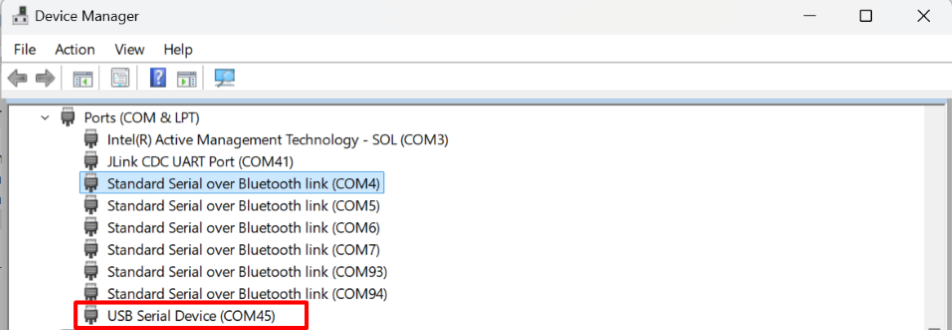

8. Select option 5 on RA Board to excute the ML-KEM Decap & ML-DSA Sign (Remote Verify) demonstration

    ")

9. Then, run the pqc_test.py program

    `python pqc_test.py -c COM45`

    **Note:** Replace `COM45` to actual COM Port determine in step 7

10. After run the pqc_test.py program, the example project will continue the senario. 

    * View log of use case 5

    ")

    * View python program log

    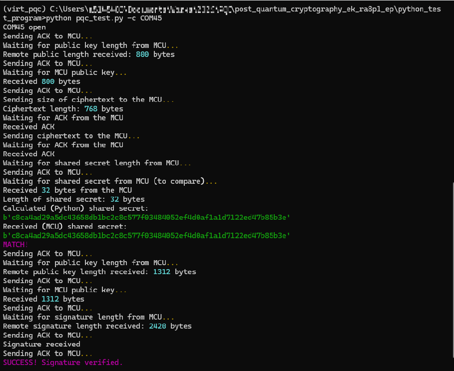

11. When finished deactivate the virtual environment:

    `deactivate`

### Execution Output
* The following example illustrates the execution output. Execution results on other boards may vary depending on the supported features and hardware capabilities.

    * EP Information:

        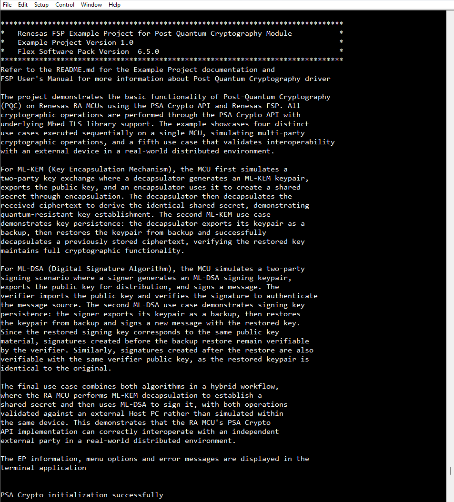

    * EP main menu:

        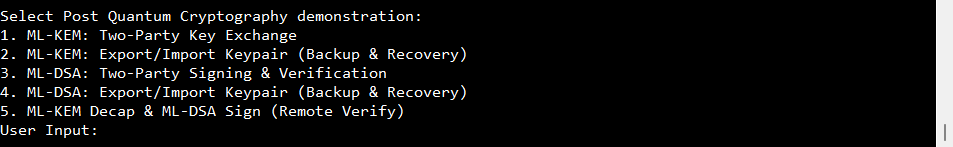

    * ML-KEM: Two-Party Key Exchange demonstration:

        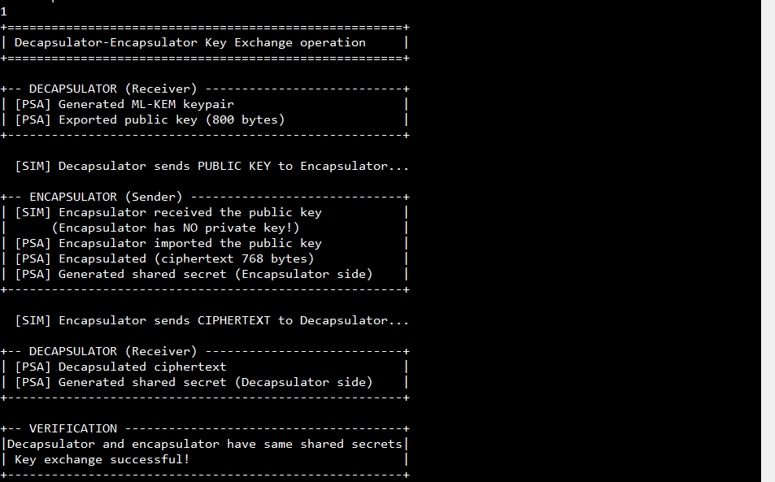

    * ML-KEM: Export/Import Keypair (Backup & Recovery) demonstration:

        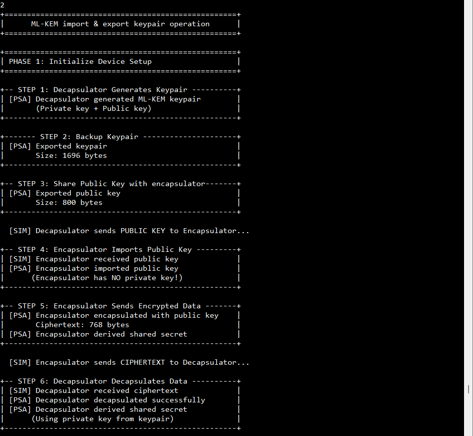
        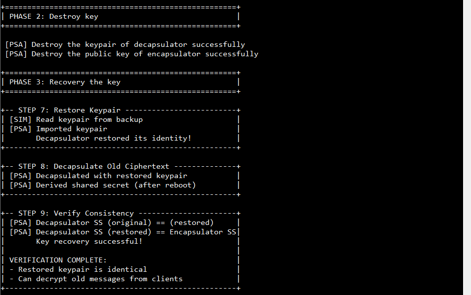

    * ML-DSA: Two-Party Signing & Verification demonstration:

        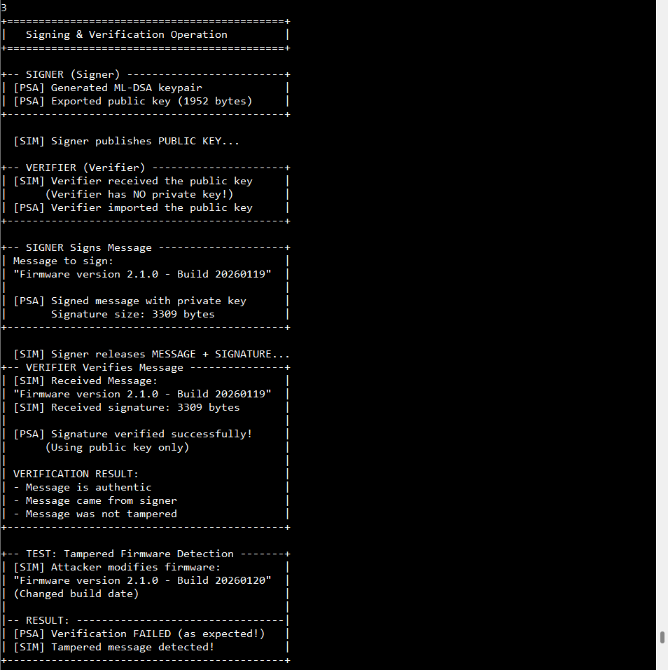

    * ML-DSA: Export/Import Keypair (Backup & Recovery) demonstration:

        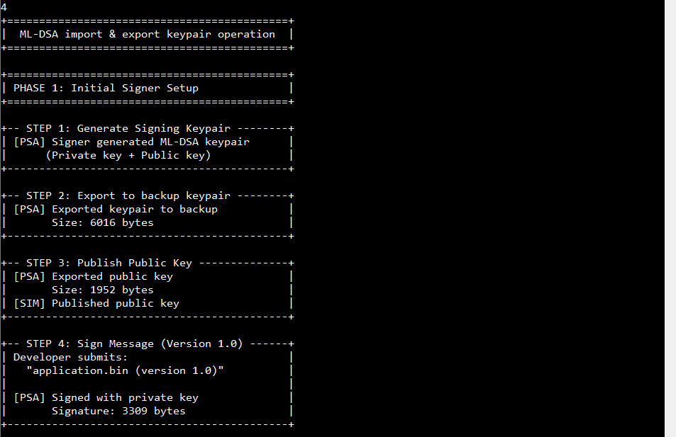
        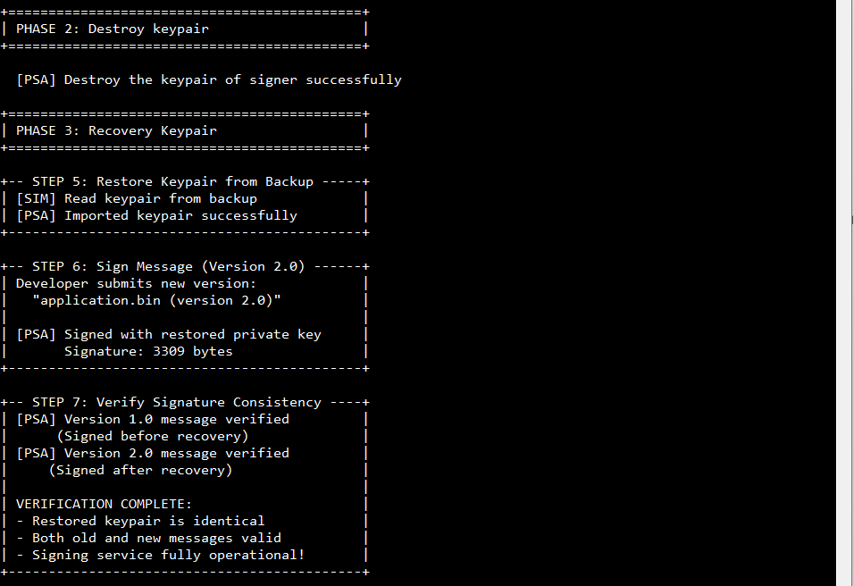

    * ML-KEM Decap & ML-DSA Sign (Remote Verify) demonstration:

        ")

        ")

## Project Notes

### System-Level Block Diagram


### FSP Modules Used

List all the various modules that are used in this example project. Refer to the FSP User Manual for further details on each module listed below.

| Module Name | Usage | Searchable Keyword |
|-------------|-------|--------------------|
| MbedTLS Crypto Port | MbedTLS Crypto Port is used to connect MbedTLS to the Arm PSA Crypto API. | rm_psa_crypto |
| Post Quantum Cryptography | Post Quantum Cryptography is the PQC library support. It includes ML-KEM for key exchange and ML-DSA for digital signature | PQC |
| LittleFS | LittleFS is used to store key handle on external SPI flash for persistent key | LittleFS |
| LittleFS on SPI Flash | This module provides the hardware port layer for the LittleFS file system on SPI flash memory. | rm_littlefs_spi_flash |
| OSPI Flash | OSPI_B is used to configure flash device and perform write, read, or erase operations on flash device's memory array. | r_ospi_b |
| DMAC | DMAC is used to write data to OSPI_B flash and read back to verification without CPU. | r_dmac |
| USB PCDC Communication Device |  USB PCDC Communication Device is used to communicate with Host PC via USB PCDC for cross-device cryptographic validation. | rm_comms_usb_pcdc |
| GPT |  GPT is used to trigger USB events retrieval every timer period. | r_gpt |
| USB Basic |  USB Basic is used to handle usb functions. | r_usb_basic |

 

### Module Configuration Notes

This section describes FSP Configurator properties which are important or different from those selected by default.

**Configuration Properties for "(Crypto Only)" instance** `configuration.xml > Stacks > MbedTLS (Crypto Only) > Properties > Settings > Property > Common`

|   Module Property Path and Identifier   |   Default Value   |   Used Value   | Description |
|-----------------------------------------|-------------------|----------------|-------------|
| Hardware Acceleration > Hash > SHA256/224 | Use Software | Use Hardware | Use Hardware for hash operation. |
| Hardware Acceleration > Hash > SHA512/384 | Use Software | Use Hardware | Use Hardware for hash operation. |
| Hardware Acceleration > Hash > SHA3_224/256/384/512 | Use Software | Use Hardware | Use Hardware for hash operation. |
| Hash > MBEDTLS_SHA3_C | Undefine | Define | Enable MBEDTLS_SHA3_C. |
| Platform > MBEDTLS_PLATFORM_MEMORY | Define | Undefine | Disable MBEDTLS_PLATFORM_MEMORY when not using an RTOS. |
| General > MBEDTLS_THREADING_ALT | Define | Undefine | Disable MBEDTLS_THREADING_ALT when not using an RTOS. |
| General > MBEDTLS_THREADING_C | Define | Undefine | Disable MBEDTLS_THREADING_C when not using an RTOS. |
| Storage > MBEDTLS_FS_IO | Undefine | Define | Enable MBEDTLS_FS_IO when using LittleFS. |
| Storage > MBEDTLS_PSA_CRYPTO_STORAGE_C | Undefine | Define | Enable MBEDTLS_PSA_CRYPTO_STORAGE_C when using LittleFS. |
| Storage > MBEDTLS_PSA_ITS_FILE_C | Undefine | Define | Enable MBEDTLS_PSA_ITS_FILE_C when using LittleFS. |
| Post Quantum Cryptography (PQC) > MBEDTLS_MLKEM_C | Undefine | Define | Enable MBEDTLS_MLKEM_C. |
| Post Quantum Cryptography (PQC) > MBEDTLS_ML_DSA_C | Undefine | Define | Enable MBEDTLS_ML_DSA_C. |

 

**Configuration Properties for "LittleFS on SPI Flash (rm_littlefs_spi_flash)" instance** `configuration.xml > Stacks > LittleFS on SPI Flash (rm_littlefs_spi_flash) > Properties > Settings > Property > Module LittleFS on SPI Flash (rm_littlefs_spi_flash)`

|   Module Property Path and Identifier   |   Default Value   |   Used Value   | Description |
|-----------------------------------------|-------------------|----------------|-------------|
| Delay Callback | g_rm_littlefs_spi_flash0_callback | NULL | Disable Delay Callback. |

 

**Configuration Properties for "OSPI Flash MX25L (r_ospi_b)" instance** `configuration.xml > Stacks > OSPI Flash MX25L (r_ospi_b) > Properties > Settings > Property > Common`

|   Module Property Path and Identifier   |   Default Value   |   Used Value   | Description |
|-----------------------------------------|-------------------|----------------|-------------|
| DMAC Support | Disable | Enable | Enable DMAC support. |

 

**Configuration Properties for "USB PCDC Communication Device (rm_comms_usb_pcdc)" instance** `configuration.xml > Stacks > g_comms_usb_pcdc0 USB PCDC Communication Device (rm_comms_usb_pcdc) > Properties > Settings > Property > Module g_comms_usb_pcdc0 USB PCDC Communication Device (rm_comms_usb_pcdc)`

|   Module Property Path and Identifier   |   Default Value   |   Used Value   | Description |
|-----------------------------------------|-------------------|----------------|-------------|
| Callback | Callback | rm_comms_usb_pcdc_callback | Handle USB events. |

 

**Configuration Properties for "General PWM (r_gpt)" instance** `configuration.xml > Stacks > g_timer0 General PWM (r_gpt) > Properties > Settings > Property > Module g_timer0 General PWM (r_gpt)`

|   Module Property Path and Identifier   |   Default Value   |   Used Value   | Description |
|-----------------------------------------|-------------------|----------------|-------------|
| General > Period | 0x10000 | 1 | Set timer period to 1 milliseconds. |
| General > Period | Raw Counts | Milliseconds | Set timer period unit to milliseconds. |
| Interrupts > Overflow/Crest Interrupt Priority | Disable | Priority 3 | Enable the overflow interrupt to receive USB events every timer period. |

 

**Pin Configuration Properties** `configuration.xml > Pins > Pin Selection > Ports`

|   Pin Configuration   |   Default Value   |   Used Value   | Description |
|-----------------------------------------|-------------------|----------------|-------------|
| P5 > P500 > Pin Configuration > Mode | Disable | Output mode (Initial Low) | Set VBUSEN pin of USB FS to output low to use USB Device. |

 

### API Usage
The links below list the FSP-provided APIs used at the application layer.

* [Mbed Crypto H/W Acceleration APIs on FSP User Manual on GitHub](https://renesas.github.io/fsp/group___r_m___p_s_a___c_r_y_p_t_o.html)
* [PSA Crypto APIs on GitHub](https://arm-software.github.io/psa-api/crypto)
* [LittleFS APIs on GitHub](https://github.com/littlefs-project/littlefs/tree/master)
* [LittleFS on SPI Flash APIs on FSP User Manual on GitHub](https://renesas.github.io/fsp/group___r_m___l_i_t_t_l_e_f_s___s_p_i___f_l_a_s_h.html)
* [USB PCDC Communication Device APIs on FSP User Manual on GitHub](https://renesas.github.io/fsp/group___r_m___c_o_m_m_s___u_s_b___p_c_d_c.html)
* [SCI UART Module APIs on FSP User Manual on GitHub](https://renesas.github.io/fsp/group___s_c_i___u_a_r_t.html)
* [SCI B UART Module APIs on FSP User Manual on GitHub](https://renesas.github.io/fsp/group___s_c_i___b___u_a_r_t.html)
* [UARTA Module APIs on FSP User Manual on GitHub](https://renesas.github.io/fsp/group___u_a_r_t_a.html)

### Memory Usage

Memory usage varies depending on the target board, compiler, and build configuration.

**Reference Measurements:**

|   Compiler                              |   Flash Usage   | RAM Usage (Static) |
| :-------------------------------------: | :-------------: | :----------------: |
|   LLVM (e.g., EK-RA8P1)                 |    ~299.4 KB    |      ~122 KB       |

 

**Notes:**

* RAM usage reflects static allocation only. Additional memory is required for stack and heap.
* The values above are provided for reference purposes. Actual memory usage may differ based on project configuration and optimization settings.

**Memory Analysis:**

For detailed memory usage breakdown, refer to the build output (e.g., .map file) or use the Memory Usage view in e²studio.

**Accessing Memory Usage View in e²studio:**

* Navigate to:
    
        Renesas Views -> C/C++ -> Memory Usage

* Then select the target project in the Project Explorer to display memory details.

### Clock Configuration

If the clock configuration deviates from the default or requires special handling for specific EPs, those details will be documented here to support EP demonstration. However, for the PQC EP, no special clock adjustments are necessary.

### Application Execution Flow
This section describes the sequence of events and usage of APIs during the execution flow of the application. The diagram shows the PQC operation flow:

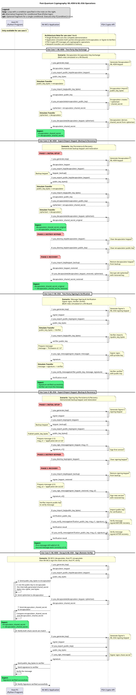

### Troubleshooting Tips
None.

### Known Limitations
None.

## Special Topics

**Security Considerations for Production Deployment**

The implementation in this example project does not apply any protection to the keypair stored in flash memory. The following recommendations should be addressed before deploying to a production environment.

Keypair Encryption with DOTF (Decrypt On-The-Fly) on External OSPI Flash
Since the keypair resides in external OSPI Flash, a physical attacker can desolder the chip and read its contents directly. The built-in DOTF engine addresses this threat.

The OSPI_B module passes every read through an internal AES-CTR engine before data reaches the CPU, plaintext never appears on the external bus. The DOTF region key is held inside the RSIP-E50D security engine and never written to external flash. All data written to the protected region must be pre-encrypted with the same DOTF key before programming.

## Conclusion and Next Steps

* **Conclusion:**

    This example project successfully demonstrates the implementation of Post-Quantum Cryptography algorithms on Renesas RA MCUs. Through four comprehensive use cases, users learn how to:

    * Establish quantum-resistant shared secrets using ML-KEM key encapsulation
    * Create and verify digital signatures using ML-DSA for message authentication
    * Implement key backup and recovery mechanisms to ensure cryptographic continuity
    * Utilize the PSA Crypto API for standardized cryptographic operations

    In use case 1 to 4, the project proves that RA MCUs are capable of running advanced post-quantum algorithms while maintaining compatibility with industry-standard APIs. By simulating multi-party scenarios on a single board, developers can understand the complete cryptographic workflows before deploying them in real distributed systems.

    In use case 5, the project integrate ML-KEM and ML-DSA communication with a external device to demonstrate real-world interoperability of the FSP PSA Crypto implementation.

* **Next Steps:**

    To further explore Post Quantum Cryptography implementation on Renesas RA MCUs:

    * Review the project source code located in the src directory.
    * Refer to the HAL driver and its documentation in the FSP User Manual for deeper technical insights.
    * Visit renesas.com for additional application notes, and documentation related to RA devices.
    * Refer **Security Considerations for Production Deployment** in [Special Topics](#special-topics) to apply secure implementation in real-world applications.

## References
The following documents can be referred to for enhancing your understanding of the operation of this example project:
* [FSP User Manual on GitHub](https://renesas.github.io/fsp/)
* [FSP Known Issues](https://github.com/renesas/fsp/issues)
* [Documentation & Downloads Search](https://www.renesas.com/en/support/document-search?page=0)
* [R11AN0773 - RA8 Series MCU Decryption on the Fly for OSPI](https://www.renesas.com/en/document/apn/application-design-using-ra8-series-mcu-decryption-fly-ospi)

## Notice

1. Descriptions of circuits, software and other related
information in this document are provided only to illustrate the
operation of semiconductor products and application examples. You are
fully responsible for the incorporation or any other use of the
circuits, software, and information in the design of your product or
system. Renesas Electronics disclaims any and all liability for any
losses and damages incurred by you or third parties arising from the use
of these circuits, software, or information. 

2. Renesas Electronics
hereby expressly disclaims any warranties against and liability for
infringement or any other claims involving patents, copyrights, or other
intellectual property rights of third parties, by or arising from the
use of Renesas Electronics products or technical information described
in this document, including but not limited to, the product data,
drawings, charts, programs, algorithms, and application examples. 

3. No license, express, implied or otherwise, is granted hereby under any
patents, copyrights or other intellectual property rights of Renesas
Electronics or others. 

4. You shall be responsible for determining what
licenses are required from any third parties, and obtaining such
licenses for the lawful import, export, manufacture, sales, utilization,
distribution or other disposal of any products incorporating Renesas
Electronics products, if required. 

5. You shall not alter, modify, copy,
or reverse engineer any Renesas Electronics product, whether in whole or
in part. Renesas Electronics disclaims any and all liability for any
losses or damages incurred by you or third parties arising from such
alteration, modification, copying or reverse engineering. 

6. Renesas Electronics products are classified according to the following two
quality grades: "Standard" and "High Quality". The intended applications
for each Renesas Electronics product depends on the product's quality
grade, as indicated below. "Standard": Computers; office equipment;
communications equipment; test and measurement equipment; audio and
visual equipment; home electronic appliances; machine tools; personal
electronic equipment; industrial robots; etc. "High Quality":
Transportation equipment (automobiles, trains, ships, etc.); traffic
control (traffic lights); large-scale communication equipment; key
financial terminal systems; safety control equipment; etc. Unless
expressly designated as a high reliability product or a product for
harsh environments in a Renesas Electronics data sheet or other Renesas
Electronics document, Renesas Electronics products are not intended or
authorized for use in products or systems that may pose a direct threat
to human life or bodily injury (artificial life support devices or
systems; surgical implantations; etc.), or may cause serious property
damage (space system; undersea repeaters; nuclear power control systems;
aircraft control systems; key plant systems; military equipment; etc.).
Renesas Electronics disclaims any and all liability for any damages or
losses incurred by you or any third parties arising from the use of any
Renesas Electronics product that is inconsistent with any Renesas
Electronics data sheet, user's manual or other Renesas Electronics
document. 

7. No semiconductor product is absolutely secure. Notwithstanding any security measures or features that may be implemented in Renesas Electronics hardware or software products, Renesas Electronics shall have absolutely no liability arising out of
any vulnerability or security breach, including but not limited to any unauthorized access to or use of a Renesas Electronics product or a system that uses a Renesas Electronics product. RENESAS ELECTRONICS DOES NOT WARRANT OR GUARANTEE THAT RENESAS ELECTRONICS PRODUCTS, OR ANY
SYSTEMS CREATED USING RENESAS ELECTRONICS PRODUCTS WILL BE INVULNERABLE OR FREE FROM CORRUPTION, ATTACK, VIRUSES, INTERFERENCE, HACKING, DATA LOSS OR THEFT, OR OTHER SECURITY INTRUSION ("Vulnerability Issues"). RENESAS ELECTRONICS DISCLAIMS ANY AND ALL RESPONSIBILITY OR LIABILITY
ARISING FROM OR RELATED TO ANY VULNERABILITY ISSUES. FURTHERMORE, TO THE EXTENT PERMITTED BY APPLICABLE LAW, RENESAS ELECTRONICS DISCLAIMS ANY AND ALL WARRANTIES, EXPRESS OR IMPLIED, WITH RESPECT TO THIS DOCUMENT
AND ANY RELATED OR ACCOMPANYING SOFTWARE OR HARDWARE, INCLUDING BUT NOT LIMITED TO THE IMPLIED WARRANTIES OF MERCHANTABILITY, OR FITNESS FOR A PARTICULAR PURPOSE. 

8. When using Renesas Electronics products, refer to the latest product information (data sheets, user's manuals, application notes, "General Notes for Handling and Using Semiconductor Devices" in
the reliability handbook, etc.), and ensure that usage conditions are within the ranges specified by Renesas Electronics with respect to
maximum ratings, operating power supply voltage range, heat dissipation characteristics, installation, etc. Renesas Electronics disclaims any
and all liability for any malfunctions, failure or accident arising out of the use of Renesas Electronics products outside of such specified
ranges. 

9. Although Renesas Electronics endeavors to improve the quality and reliability of Renesas Electronics products, semiconductor products
have specific characteristics, such as the occurrence of failure at a certain rate and malfunctions under certain use conditions. Unless
designated as a high reliability product or a product for harsh environments in a Renesas Electronics data sheet or other Renesas
Electronics document, Renesas Electronics products are not subject to radiation resistance design. You are responsible for implementing safety
measures to guard against the possibility of bodily injury, injury or damage caused by fire, and/or danger to the public in the event of a
failure or malfunction of Renesas Electronics products, such as safety design for hardware and software, including but not limited to
redundancy, fire control and malfunction prevention, appropriate treatment for aging degradation or any other appropriate measures.
Because the evaluation of microcomputer software alone is very difficult and impractical, you are responsible for evaluating the safety of the
final products or systems manufactured by you. 

10. Please contact a
Renesas Electronics sales office for details as to environmental matters such as the environmental compatibility of each Renesas Electronics
product. You are responsible for carefully and sufficiently investigating applicable laws and regulations that regulate the
inclusion or use of controlled substances, including without limitation, the EU RoHS Directive, and using Renesas Electronics products in
compliance with all these applicable laws and regulations. Renesas Electronics disclaims any and all liability for damages or losses
occurring as a result of your noncompliance with applicable laws and regulations. 

11. Renesas Electronics products and technologies shall not be used for or incorporated into any products or systems whose
manufacture, use, or sale is prohibited under any applicable domestic or foreign laws or regulations. You shall comply with any applicable export
control laws and regulations promulgated and administered by the governments of any countries asserting jurisdiction over the parties or
transactions. 

12. It is the responsibility of the buyer or distributor of Renesas Electronics products, or any other party who distributes,
disposes of, or otherwise sells or transfers the product to a third party, to notify such third party in advance of the contents and
conditions set forth in this document. 

13. This document shall not be
reprinted, reproduced or duplicated in any form, in whole or in part, without prior written consent of Renesas Electronics. 

14. Please contact a Renesas Electronics sales office if you have any questions regarding the information contained in this document or Renesas Electronics
products. (Note1) "Renesas Electronics" as used in this document means Renesas Electronics Corporation and also includes its directly or
indirectly controlled subsidiaries. (Note2) "Renesas Electronics product(s)" means any product developed or manufactured by or for
Renesas Electronics.

                                                                                   (Rev.5.0-1 October 2020)
## Corporate Headquarters 

Contact information TOYOSU FORESIA, 3-2-24

Toyosu, Koto-ku, Tokyo 135-0061, Japan 

www.renesas.com 

## Contact information 

For further information on a product, technology, the most up-to-date version of a
document, or your nearest sales office, please visit:
www.renesas.com/contact/. 

## Trademarks 
Renesas and the Renesas logo are trademarks of Renesas Electronics Corporation. All trademarks and
registered trademarks are the property of their respective owners.

							© 2026 Renesas Electronics Corporation. All rights reserved

