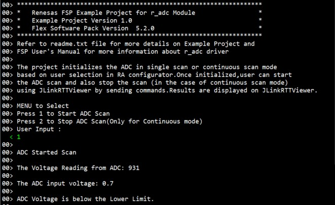
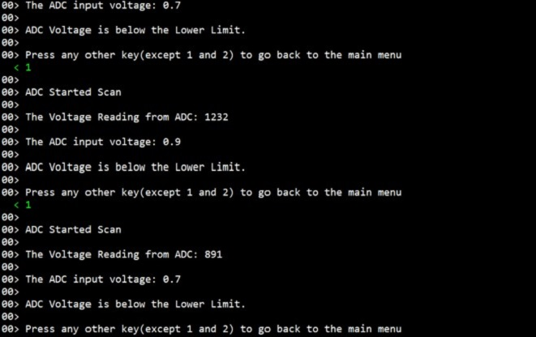
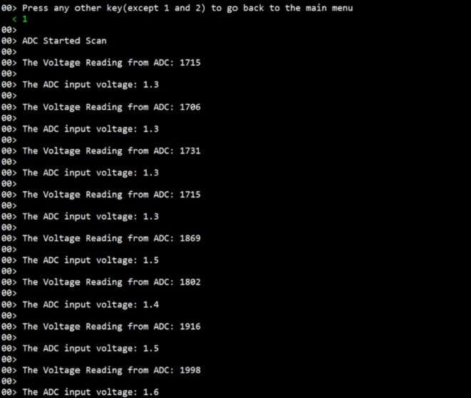
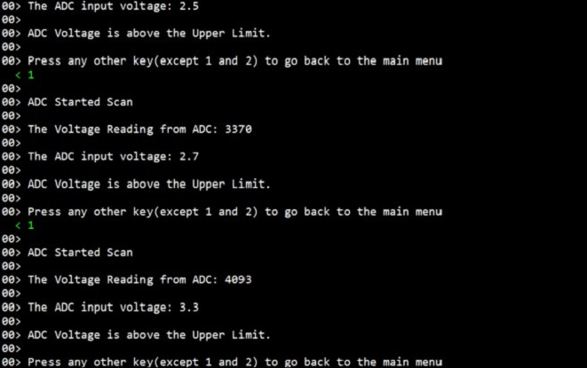

# Introduction #
 
This example project demonstrates basic functionalities of ADC driver, including the ADC's Window Compare Mode on Renesas 
RA MCUs based on Renesas FSP. An RTT input command triggers the ADC scan to read the analog data of adc channel and outputs 
the converted data onto the RTT output.The project initializes the ADC in single scan or continuous scan mode based on user 
selection in RA configurator. Once initialized,user can initiate the ADC scan and also stop the scan (in the case of continuous 
scan mode) using JLinkRTTViewer by sending commands. User provide ADC channel input voltage from 0V to 3.3V with a variable 
power supply unit at the ADC channel voltage input pin. Once ADC scan is initialized, Window Compare Mode is enabled and compares 
the ADC channel input voltage with the upper and lower limits. The upper limit and lower limit are configured in RA Configurator. 
If the ADC channel input voltage is above the upper limit or below the lower limit, it triggers an event and notifies the user to 
act accordingly. Result and ADC status is displayed on the JLinkRTTViewer.

Please refer to the [Example Project Usage Guide](https://github.com/renesas/ra-fsp-examples/blob/master/example_projects/Example%20Project%20Usage%20Guide.pdf) 
for general information on example projects and [readme.txt](./readme.txt) for specifics of operation.

## Required Resources ## 
To build and run the ADC example project, the following resources are needed.

### Hardware ###
* Renesas RA Evaluation kit - 1x
* USB A to USB Micro B Cable - 1x (For MCK-RA8T1: USB A to USB Type C Cable - 1x)
* External Variable Power Supply Unit - 1x
* Jumper wires to connect Variable Power Supply Unit with RA Evaluation Kits - 2x

Refer to [readme.txt](./readme.txt) for information on how to connect the hardware.

### Software ###
* Renesas Flexible Software Package (FSP): Version 5.6.0
* e2 studio: Version 2024-10
* SEGGER J-Link RTT Viewer: Version 7.98g
* GCC ARM Embedded Toolchain: Version 13.2.1.arm-13-7
* Refer to the software required section in [Example Project Usage Guide](https://github.com/renesas/ra-fsp-examples/blob/master/example_projects/Example%20Project%20Usage%20Guide.pdf)

## Related Collateral References ##
The following documents can be referred to for enhancing your understanding of 
the operation of this example project:
- [FSP User Manual on GitHub](https://renesas.github.io/fsp/)
- [FSP Known Issues](https://github.com/renesas/fsp/issues)

# Project Notes #

## System Level Block Diagram ##
 High level block diagram
  

## FSP Modules Used ##
List of important modules that are used in this example project. Refer to the FSP User Manual for further details on each module listed below.

| Module Name | Usage | Searchable Keyword  |
|-------------|-----------------------------------------------|-----------------------------------------------|
|ADC | Driver for the ADC peripheral to demonstrate basic functionalities of ADC, including the Window Compare Mode on Renesas RA MCUs | adc|

## Module Configuration Notes ##
This section describes FSP Configurator properties which are important or different than those selected by default. 

**ADC Window Compare Mode Configuration properties**

|   Module Property Path and Identifier   |   Default Value   |   Used Value   |   Reason   |
| :-------------------------------------: | :---------------: | :------------: | :--------: |
| configuration.xml -> HAL/Common -> Properties > Settings > Property > Module g_adc ADC (r_adc) >Input > Channel Scan Mask (channel availability varies by MCU) | Unchecked | Check (availability varies by MCU) | ADC input voltage supplied at available ADC channel (varies by MCU). |
| configuration.xml -> HAL/Common -> Properties > Settings > Property > Module g_adc ADC (r_adc) >Input > Window Compare > Window A > Channels to compare (channel availability varies by MCU and unit) | Unchecked | Check (same channel selected for Channel Scan Mask) | ADC Compares the input voltage supplied at the ADC input channel with upper and lower boundaries of the Window. |
| configuration.xml -> HAL/Common -> Properties > Settings > Property > Module g_adc ADC (r_adc) >Input > Window Compare > Window A > Enable | Disabled | Enabled | To enable Window Compare Mode in Window A |
| configuration.xml -> HAL/Common -> Properties > Settings > Property > Module g_adc ADC (r_adc) >Input > Window Compare > Window A > Lower Reference | 0 | 9929/1241 | To configure Lower reference for Window Compare Mode in Window A for 16bit/12bit ADCs |
| configuration.xml -> HAL/Common -> Properties > Settings > Property > Module g_adc ADC (r_adc) >Input > Window Compare > Window A > Upper Reference | 0 | 24824/3103 | To configure Upper reference for Window Compare Mode in Window A for 16bit/12bit ADCs |
| configuration.xml -> HAL/Common -> Properties > Settings > Property > Module g_adc ADC (r_adc) >Input > Window Compare > Window Mode | Disabled | Enabled | To enable Window Compare Mode in Window A |
| configuration.xml -> HAL/Common -> Properties > Settings > Property > Module g_adc ADC (r_adc) >Interrupts > Callback | None | adc_callback | To assign callback function for the window compare event |
| configuration.xml -> HAL/Common -> Properties > Settings > Property > Module g_adc ADC (r_adc) >Interrupts > Scan End Interrupt Priority | Disabled | Priority 1 | To assign interrupt priority for scan end event |
| configuration.xml -> HAL/Common -> Properties > Settings > Property > Module g_adc ADC (r_adc) >Interrupts > Window Compare A Interrupt Priority | Disabled | Priority 1 | To assign interrupt priority for window compare event of Window A |
| configuration.xml -> HAL/Common -> Properties > Settings > Property > Pins > ANxxx | None | Pxxx (Select Pin for ADC Channel - channel availability varies by MCU) | ADC input voltage supplied at available ADC channel (varies by MCU). |

The table below lists the FSP provided API used at the application layer by this example project.

| API Name    | Usage                                                                          |
|-------------|--------------------------------------------------------------------------------|
| R_ADC_Open | This API is used to Open the ADC instance. |
| R_ADC_ScanCfg | This API is used to configure the ADC scan parameters  |
| R_ADC_Calibrate | This API is used to initiate ADC Calibration. |
| R_ADC_ScanStart | This API is used to start the ADC Scan.  |
| R_ADC_Read | This API is used to read the adc converted value from the specific ADC channel.  |
| R_ADC_ScanStop | This API is used to stop the ADC scan. |
| R_ADC_Close | This API is used to close the ADC module |
| R_ADC_StatusGet | This API is used get the adc status. |

## Verifying operation ##
1. Import, generate and build adc EPs in e2studio/iar.
   Before running the example project, make sure hardware connections are done.
2. Download adc EP to one Renesas RA MCU Evaluation kit and run the project.
3. Now open Jlink RTT Viewer and connect to RA MCU board.
4. User can perform Menu option operations and check corresponding results JlinkRTTViewer.
5. Also user can supply input voltage to ADC scan channel pin and verify result on JLinkRTT_Viewer.
6. If the ADC value is outside the window compare, it status is shown in the JLinkRTT_Viewer.
   The Boundary values of ADC Window Compare Mode are
	Lower Reference is 1V
	Upper Reference is 2.5V
	Reference Voltage is 3.3V

## ADC Value calculation ##

   Digital Output = (2^n * Analog input voltage)/(Reference Voltage)
          n = Number of bits
		  Digital Output is then converted to its Binary Equivalent

   For Example:
   1) If the Analog input voltage is 1.5V
    	For 12 bit ADC
		Digital Output = (2^12 * 1.5)/3.3
		               = (4096 * 1.5)/3.3
					   = 6144/3.3
		Digital Output = 1861
		
		For 16 bit ADC
		Digital Output = (2^15 * 1.5)/3.3
		               = (32768 * 1.5)/3.3
					   = 49152/3.3
		Digital Output = 14894
	
	Note: Limitation for 16 bit ADC - Refer: Table 32.13 A/D conversion result output ranges of each A/D conversion in the RA2A1 User Manual (R01UH0888EJ0100 Rev.1.00)
		
   
   Below images showcases the ADC output on JLinkRTT_Viewer:

   
 
   
 
   
 
   
