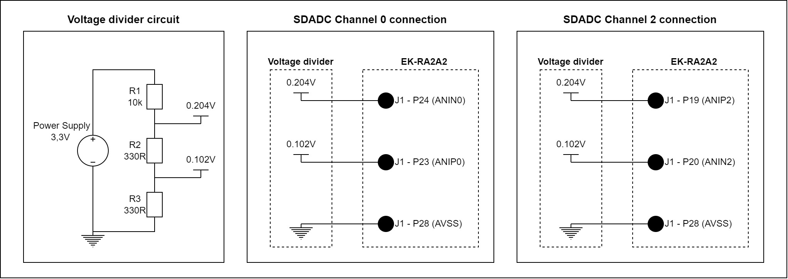
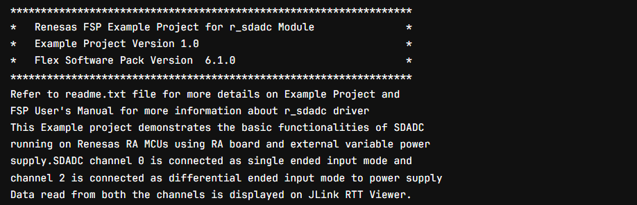
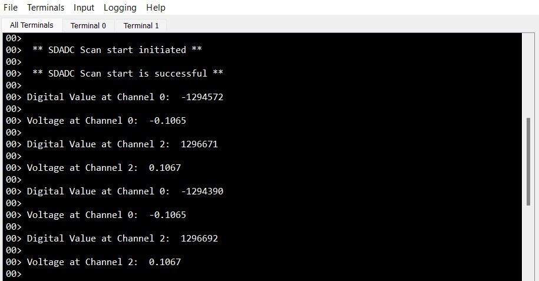

# Introduction #

This Example project demonstrates the basic functionalities of SDADC running on Renesas RA MCUs using RA board. The SDADC channel 0 and channel 2 is connected as differential ended input mode. Data read from both the channels is displayed on JLink RTT Viewer.

Please refer to the [Example Project Usage Guide](https://github.com/renesas/ra-fsp-examples/blob/master/example_projects/Example%20Project%20Usage%20Guide.pdf) 
for general information on example projects and [readme.txt](./readme.txt) for specifics of operation.

## Required Resources ## 
To build and run the SDADC example project, the following resources are needed.

### Hardware ###
* 1 x Renesas RA boards: EK-RA2A2
* 1 x Micro USB cable
* 1 x Breadboard
* 1 x 10 k ohm 1% Resistor
* 2 x 330 ohm 1% Resistor
* 6 x Jumper cable (male to female)

### Hardware Connection ###

### Software ###
* e2studio version 2024-01
* FSP version 5.2.0
* J-Link RTT Viewer version 7.94d
* GCC ARM Embedded toolchain version 13.2.1.arm-13-7

Refer to the software required section in [Example Project Usage Guide](https://github.com/renesas/ra-fsp-examples/blob/master/example_projects/Example%20Project%20Usage%20Guide.pdf)

## Related Collateral References ##
The following documents can be referred to for enhancing your understanding of 
the operation of this example project:
- [FSP User Manual on GitHub](https://renesas.github.io/fsp/)
- [FSP Known Issues](https://github.com/renesas/fsp/issues)

# Project Notes #

## FSP Modules Used ##
List all the various modules that are used in this example project. Refer to the FSP User Manual for further details on each module listed below.

| Module Name | Usage | Searchable Keyword  |
|-------------|-----------------------------------------------|-----------------------------------------------|
| SDADC | The SDADC module is used to convert an analog input signal to digital values at 24-bit resolution with a preamplifier. | r_sdadc_b |

## API Usage ##
The table below lists the FSP provided API used at the application layer by this example project.

| API Name    | Usage                                                                          |
|-------------|--------------------------------------------------------------------------------|
| R_SDADC_B_Open | This API is used to apply power and initialize the SDADC_B module based on the user configuration. |
| R_SDADC_B_ScanCfg | This API is used to configure the enabled channels of the SDADC. |
| R_SDADC_B_ScanStart | This API is used to start converting analog input signals to digital values. |
| R_SDADC_B_StatusGet | This API is used to retrieve the status of the SDADC module. |
| R_SDADC_B_Read32 | This API is used to read the most recent conversion result from a channel. |
| R_SDADC_B_Close | This API is used to remove power and de-initialize the SDADC_B module based on the user configuration. |

## Verifying Operation ##
1. Import, generate and build the example project.
2. Connect the hardware according to the instructions in readme.txt file and hardware_connection.jpg image. 
3. Debug the example project by e2studio IDE.

## RTT Viewer Log ##
* The example project information.

  

* SDADC conversion results.

  
