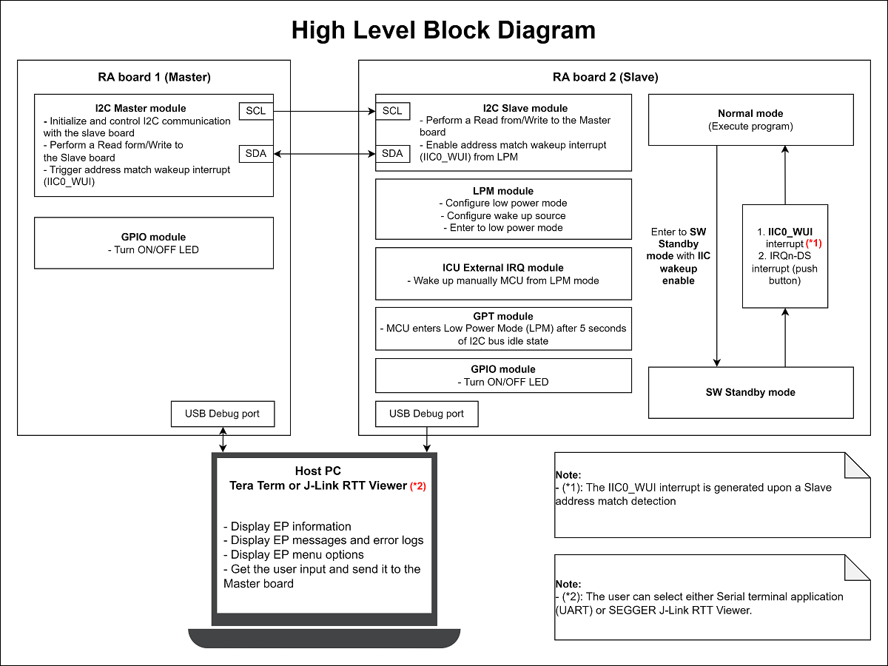
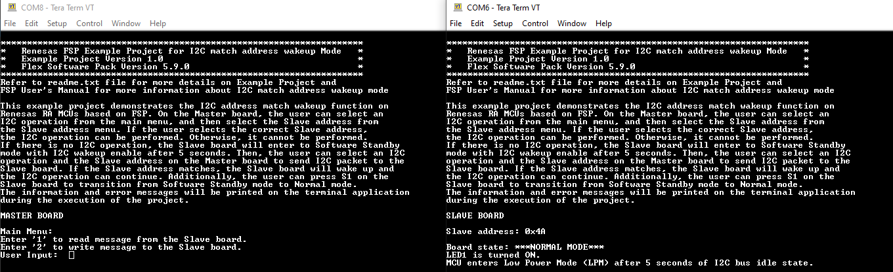
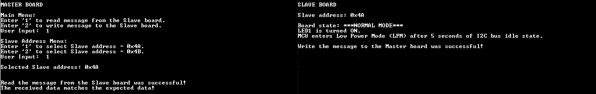
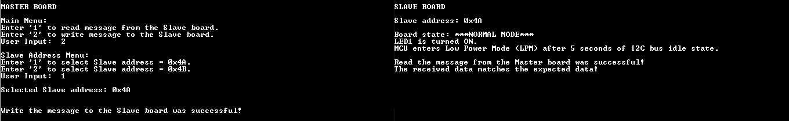
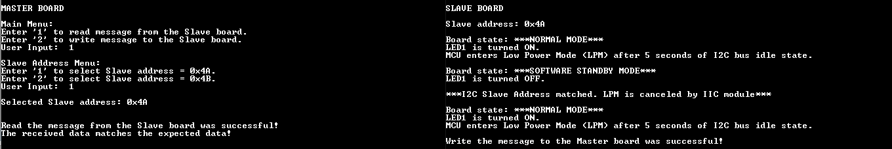
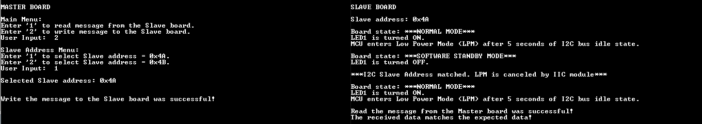
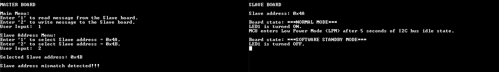
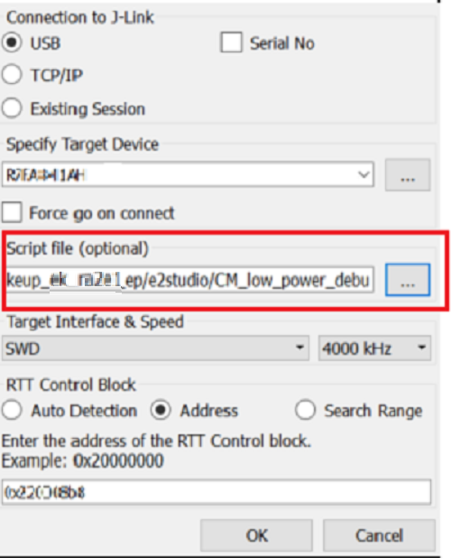
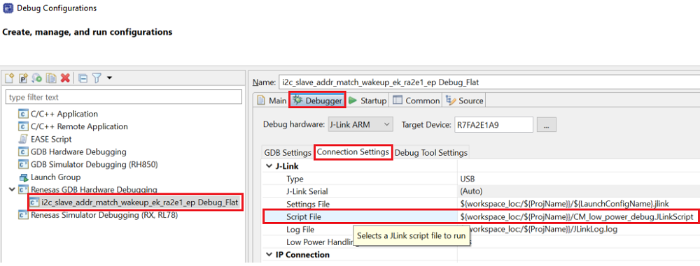

# Introduction #
This example project demonstrates the I2C address match wakeup function on Renesas RA MCUs based on FSP. On the Master board, the user can select an I2C operation from the main menu, and then select the Slave address from the Slave address menu. If the user selects the correct Slave address, the I2C operation can be performed. Otherwise, it cannot be performed. If there is no I2C operation, the Slave board will enter to Software Standby mode with I2C wakeup enable after 5 seconds. Then, the user can select an I2C operation and the Slave address on the Master board to send I2C packet to the Slave board. If the Slave address matches, the Slave board will wake up and the I2C operation can continue. Additionally, the user can press S1 on the Slave board to transition from Software Standby mode to Normal mode. The information and error messages will be printed on the terminal application during the execution of the project.

In Normal mode, the board state LED (LED1) is turned ON. In Software Standby mode, the board state LED (LED1) is turned OFF. If any error had occurred, the board state LED (LED1) is turned OFF and the error LED (LED2) is turned ON (If the board supports at least 2 USER LEDs).

For Terminal application:
* To display information, the user can select between the SEGGER J-Link RTT Viewer and the Serial terminal (UART). It is important to note that the user should only operate a single terminal application at a time to avoid conflicts or data inconsistencies.
* By default, the EP information is printed to the host PC using the Serial terminal.
* To utilize the SEGGER J-Link RTT Viewer instead of the Serial terminal, please refer to the first step in the "Verifying Operation" section.

Please refer to the [Example Project Usage Guide](https://github.com/renesas/ra-fsp-examples/blob/master/example_projects/Example%20Project%20Usage%20Guide.pdf) 
for general information on example projects and [readme.txt](./readme.txt) for specifics of operation.

## Required Resources ## 
To build and run the i2c_addr_match_wakeup example project, the following resources are needed.

### Software ###
* Renesas Flexible Software Package (FSP): Version 5.9.0
* e2 studio: Version 2025-04
* SEGGER J-Link RTT Viewer: Version 8.12f
* GCC ARM Embedded Toolchain: Version 13.2.1.arm-13-7
* Terminal Console Application: Tera Term or a similar application

Refer to the software required section in [Example Project Usage Guide](https://github.com/renesas/ra-fsp-examples/blob/master/example_projects/Example%20Project%20Usage%20Guide.pdf) for basic information on setting up and using the above software

### Hardware ###
Supported RA board: EK-RA2E1
* 2 x Renesas RA boards.
* 1 x Host PC.
* 2 x Micro USB cables for programming and debugging.
* Some jumper wires.
* For RA boards that do not support J-Link OB VCOM: EK-RA2E1
	* 2 x USB to UART Converters (e.g., Pmod USBUART: https://digilent.com/shop/pmod-usbuart-usb-to-uart-interface/).
	* 2 x Micro USB cables used to connect the Pmod USBUART to the RA board.

### Hardware Connections ###
* Connect the USB debug port on 2 RA boards to the host PC via 2 Micro USB cables for programming and debugging.
* Connect 2 Pmod USBUART modules to the host PC via 2 Micro USB cables.
* For Pmod USBUART: Jumper JP1 placement is LCL-VCC pins (The attached system board is powered independently from the PMOD USBUART).
* Connect 2 Pmod USBUART modules to 2 RA boards as shown below:
	* For EK-RA2E1:
		| RA board |----| Pmod USBUART |
        |--------------|----|-------------|
        |RXD0 P206 (J2:15)|--->|TXD Pin (J2:3)|
        |TXD0 P205 (J2:16)|--->|RXD Pin (J2:2)|
		|GND (J2:40)|--->|GND Pin (J2:5)|
* Connect the Master board to the Slave board as shown below:
	* For EK-RA2E1:
        | Master board |----| Slave board |
        |--------------|----|-------------|
       	|SDA0 P407 (J24:9)|--->|SDA0 P407 (J24:9)|
        |SCL0 P408 (J24:10)|--->|SCL0 P408 (J24:10)|

## Related Collateral References ##
The following documents can be referred to for enhancing your understanding of 
the operation of this example project:
- [FSP User Manual on GitHub](https://renesas.github.io/fsp/)
- [FSP Known Issues](https://github.com/renesas/fsp/issues)

# Project Notes #

## System Level Block Diagram ##
High level block diagram of the system is shown below:
 

## FSP Modules Used ##
List all the various modules that are used in this example project. Refer to the FSP User Manual for further details on each module listed below.

| Module Name | Usage | Searchable Keyword  |
|-------------|-----------------------------------------------|-----------------------------------------------|
| I2C Master | I2C Master is used to communicate with the I2C Slave device. | r_iic_master |
| I2C Slave | I2C Slave is used to configure as the I2C Slave device. | r_iic_slave |
| LPM | LPM is used to configure low power mode selection, wake source and enter the MCU to low power mode to reduce power consumption. | r_lpm |
| External IRQ | External IRQ is used to manually cancel the LPM mode. | r_icu |
| GPT | GPT timer is used to automatically trigger the MCU to enter low power mode in case of I2C bus idle state. | r_gpt |

## Module Configuration Notes ##
This section describes FSP Configurator properties which are important or different than those selected by default. 

**Configuration Properties for i2c_master_addr_match_wakeup project:**  
**Configuration Properties for using I2C Master**

|   Module Property Path and Identifier   |   Default Value   |   Used Value   |   Reason   |
|-----------------------------------------|-------------------|----------------|------------|
| configuration.xml > Stacks > g_i2c_master I2C Master (r_iic_master) > Properties > Settings > Property > Module g_i2c_master I2C Master (r_iic_master) > Slave Address | 0x00 | 0x4A | Specify the slave address. |
| configuration.xml > Stacks > g_i2c_master I2C Master (r_iic_master) > Properties > Settings > Property > Module g_i2c_master I2C Master (r_iic_master) > Callback | NULL | iic_master_callback | It is called from the interrupt service routine (ISR) upon IIC transaction completion reporting the transaction status. |
| configuration.xml > Stacks > g_i2c_master I2C Master (r_iic_master) > Properties > Settings > Property > Module g_i2c_master I2C Master (r_iic_master) > Interrupt Priority Level | Priority 2 | Priority 2 | Select the interrupt priority level. |

**Configuration Properties for i2c_slave_addr_match_wakeup project:**  
**Configuration Properties for using I2C Slave**

|   Module Property Path and Identifier   |   Default Value   |   Used Value   |   Reason   |
|-----------------------------------------|-------------------|----------------|------------|
| configuration.xml > Stacks > g_i2c_slave I2C Slave (r_iic_slave) > Properties > Settings > Property > Module g_i2c_slave I2C Slave (r_iic_slave) > Slave Address | 0x00 | 0x4A | Specify the slave address. |
| configuration.xml > Stacks > g_i2c_slave I2C Slave (r_iic_slave) > Properties > Settings > Property > Module g_i2c_slave I2C Slave (r_iic_slave) > Callback | NULL | iic_slave_callback | It is called from the interrupt service routine (ISR) to report I2C Slave transaction events and status. |
| configuration.xml > Stacks > g_i2c_slave I2C Slave (r_iic_slave) > Properties > Settings > Property > Module g_i2c_slave I2C Slave (r_iic_slave) > Interrupt Priority Level > Transmit, Receive, and Transmit End | Priority 2 | Priority 2 | Select the interrupt priority level for TXI, RXI, and TEI interrupts. |
| configuration.xml > Stacks > g_i2c_slave I2C Slave (r_iic_slave) > Properties > Settings > Property > Module g_i2c_slave I2C Slave (r_iic_slave) > Interrupt Priority Level > Error | Priority 2 | Priority 2 | Select the interrupt priority level for ERI interrupt. |

|   Interrupt Configuration Path   	      |   Default Value   |   Used Value   |   Reason   |
|-----------------------------------------|-------------------|----------------|------------|
| configuration.xml > Interrupts > Interrupts Configuration > New User Event > IIC > IIC0 > IIC0 WUI (Wakeup interrupt) | empty | iic_slave_wu_isr | Assign the IIC0 WUI (Wakeup interrupt) to the interrupt vector table. |

**Configuration Properties for using LPM**
|   Module Property Path and Identifier   |   Default Value   |   Used Value   |   Reason   |
|-----------------------------------------|-------------------|----------------|------------|
| configuration.xml > Stacks > g_lpm_sw_standby Low Power Modes (r_lpm) > Properties > Settings > Property > Module g_lpm_sw_standby Low Power Modes (r_lpm) > General > Name | g_lpm0 | g_lpm_sw_standby | Module name. |
| configuration.xml > Stacks > g_lpm_sw_standby Low Power Modes (r_lpm) > Properties > Settings > Property > Module g_lpm_sw_standby Low Power Modes (r_lpm) > General > Low Power Mode | Sleep mode | Software Standby mode | Select power mode to be entered. |
| configuration.xml > Stacks > g_lpm_sw_standby Low Power Modes (r_lpm) > Properties > Settings > Property > Module g_lpm_sw_standby Low Power Modes (r_lpm) > Deep Sleep and Standby Options > Wake Sources > IRQ3 | ☐ | ☑ | Select IRQ3 as the source to cancel Software Standby mode. |
| configuration.xml > Stacks > g_lpm_sw_standby Low Power Modes (r_lpm) > Properties > Settings > Property > Module g_lpm_sw_standby Low Power Modes (r_lpm) > Deep Sleep and Standby Options > Wake Sources > I2C 0 | ☐ | ☑ | Select I2C 0 as the source to cancel Software Standby mode. |

**Configuration Properties for using External IRQ**
|   Module Property Path and Identifier   |   Default Value   |   Used Value   |   Reason   |
|-----------------------------------------|-------------------|----------------|------------|
| configuration.xml > Stacks > g_external_irq External IRQ (r_icu) > Properties > Settings > Property > Module g_external_irq External IRQ (r_icu) > Channel | 0 | 3 | Specify the external IRQ channel. |
| configuration.xml > Stacks > g_external_irq External IRQ (r_icu) > Properties > Settings > Property > Module g_external_irq External IRQ (r_icu) > Trigger | Rising | Falling | Select the signal edge that triggers an interrupt. |
| configuration.xml > Stacks > g_external_irq External IRQ (r_icu) > Properties > Settings > Property > Module g_external_irq External IRQ (r_icu) > Callback | NULL | external_irq_callback | It is called from the interrupt service routine (ISR) upon a falling edge is detected on the IRQ pin. |
| configuration.xml > Stacks > g_external_irq External IRQ (r_icu) > Properties > Settings > Property > Module g_external_irq External IRQ (r_icu) > Pin Interrupt Priority | Priority 2 | Priority 2 | Select the External IRQ interrupt priority. |

**Configuration Properties for using GPT timer**
|   Module Property Path and Identifier   |   Default Value   |   Used Value   |   Reason   |
|-----------------------------------------|-------------------|----------------|------------|
| configuration.xml > Stacks > g_timer_sleep Timer, General PWM (r_gpt) > Properties > Settings > Property > Module g_timer_sleep Timer, General PWM (r_gpt) > General > Name | g_timer0 | g_timer_sleep | Module name. |
| configuration.xml > Stacks > g_timer_sleep Timer, General PWM (r_gpt) > Properties > Settings > Property > Module g_timer_sleep Timer, General PWM (r_gpt) > General > Channel | 0 | 0 | Select the GPT channel. |
| configuration.xml > Stacks > g_timer_sleep Timer, General PWM (r_gpt) > Properties > Settings > Property > Module g_timer_sleep Timer, General PWM (r_gpt) > General > Mode | Periodic | Periodic | Mode selection. |
| configuration.xml > Stacks > g_timer_sleep Timer, General PWM (r_gpt) > Properties > Settings > Property > Module g_timer_sleep Timer, General PWM (r_gpt) > General > Period | 0x10000 | 5 | Specify the timer period. |
| configuration.xml > Stacks > g_timer_sleep Timer, General PWM (r_gpt) > Properties > Settings > Property > Module g_timer_sleep Timer, General PWM (r_gpt) > General > Period Unit | Raw Counts | Seconds | Specify unit of the timer period. |
| configuration.xml > Stacks > g_timer_sleep Timer, General PWM (r_gpt) > Properties > Settings > Property > Module g_timer_sleep Timer, General PWM (r_gpt) > Interrupts > Callback | NULL | timer_sleep_callback | It is called from the interrupt service routine (ISR) each time the timer period elapses. |
| configuration.xml > Stacks > g_timer_sleep Timer, General PWM (r_gpt) > Properties > Settings > Property > Module g_timer_sleep Timer, General PWM (r_gpt) > Interrupts > Overflow/Crest Interrupt Priority | Disable | Priority 2 | Select the overflow interrupt priority. |

**Configuration Properties for using the Serial Terminal (UART): Apply to both projects**
|   Interrupt Configuration Path          |   Default Value   |   Used Value   |   Reason   |
|-----------------------------------------|-------------------|----------------|------------|
| configuration.xml > Interrupts > Interrupts Configuration > New User Event > SCI > SCI0 > SCI0 RXI (Receive data full) | empty | sci_uart_rxi_isr | Assign the UART receive ISR (Receive data full) to the interrupt vector table. |
| configuration.xml > Interrupts > Interrupts Configuration > New User Event > SCI > SCI0 > SCI0 TXI (Transmit data empty) | empty | sci_uart_txi_isr | Assign the UART transfer ISR (Transfer data empty) to the interrupt vector table. |
| configuration.xml > Interrupts > Interrupts Configuration > New User Event > SCI > SCI0 > SCI0 TEI (Transmit end) | empty | sci_uart_tei_isr | Assign the UART transfer ISR (Transfer end) to the interrupt vector table. |
| configuration.xml > Interrupts > Interrupts Configuration > New User Event > SCI > SCI0 > SCI0 ERI (Receive error) | empty | sci_uart_eri_isr | Assign the UART receive ISR (Receive error) to the interrupt vector table. |

## API Usage ##
The table below lists the FSP provided API used at the application layer in this example project.

| API Name    | Usage                                                                          |
|-------------|--------------------------------------------------------------------------------|
| R_IIC_MASTER_Open | This API is used to open the I2C master device. |
| R_IIC_MASTER_SlaveAddressSet | This API is used to set address and addressing mode of the slave device. |
| R_IIC_MASTER_Close | This API is used to close the I2C master device. |
| R_IIC_MASTER_Write | This API is used to perform a write to the I2C device. |
| R_IIC_MASTER_Read | This API is used to perform a read from the I2C device. |
| R_IIC_SLAVE_Open | This API is used to open the I2C slave device. |
| R_IIC_SLAVE_Close | This API is used to close the I2C slave device. |
| R_IIC_SLAVE_Write | This API is used to perform a write to the I2C Master device. |
| R_IIC_SLAVE_Read | This API is used to perform a read from the I2C Master device. |
| R_LPM_Open | This API is used to initialize the LPM module. |
| R_LPM_Close | This API is used to de-initialize the LPM module. |
| R_LPM_LowPowerModeEnter | This API is used to enter low power mode using WFI macro. |
| R_ICU_ExternalIrqOpen | This API is used to open the external interrupt channel. |
| R_ICU_ExternalIrqEnable | This API is used to enable external interrupt for specified channel at NVIC. |
| R_ICU_ExternalIrqClose | This API is used to close the external interrupt channel. |
| R_GPT_Open | This API is used to initialize the GPT module. |
| R_GPT_Start | This API is used to start the GPT module. |
| R_GPT_Reset | This API is used to reset the GPT module. |
| R_GPT_Close | This API is used to de-initialize the GPT module. |
| R_BSP_SoftwareDelay| This API is used to delay a specified period of time. |
| R_BSP_IrqCfgEnable | This API is used to set the interrupt priority and context, clear pending interrupts, then enable the interrupt. |
| R_BSP_IrqDisable | This API is used to disable interrupt in the NVIC. |
| R_BSP_IrqStatusClear | This API is used to clear the interrupt status flag (IR) for a given interrupt. |
| R_IOPORT_PinWrite | This API is used to set a pin's output either high or low. |
| R_IOPORT_PinCfg | This API is used to configure the settings of a pin. |

**For using the Serial Terminal (UART):**
| API Name    | Usage                                                                          |
|-------------|--------------------------------------------------------------------------------|
| R_SCI_UART_Open | This API is used to initialize the SCI UART module. |
| R_SCI_UART_Write | This API is used to perform a write operation. |
| R_SCI_UART_Close | This API is used to de-initialize the SCI UART module. |

## Verifying Operation ##
1. Import, generate, and build the i2c_master_addr_match_wakeup and i2c_slave_addr_match_wakeup projects.
    * By default, the EP supports Serial terminal
	    * Define USE_SERIAL_TERM=1 macro in:
            * Project Properties -> C/C++ Build -> Settings -> Tool Settings -> GNU ARM Cross C Compiler -> Preprocessor
	* To use SEGGER J-Link RTT Viewer, please follow the instructions as shown below:
		* Define USE_SERIAL_TERM=0 macro in:
	        * Project Properties -> C/C++ Build -> Settings -> Tool Settings -> GNU ARM Cross C Compiler -> Preprocessor
2. Set up the hardware properly according to the instructions mentioned in the "Hardware Connections" section.
3. Download the i2c_master_addr_match_wakeup EP to Board1 to run in Master mode.  
   Download the i2c_slave_addr_match_wakeup EP to Board2 to run in Slave mode.  
   **Note:** After finished downloading the EP using the debug option in e2studio, the user should terminate the session before connecting to terminal application. The EP should be run in Standalone mode.
4. Open Serial terminal application (default) or J-Link RTT Viewer on the host PC for 2 boards. After connecting successfully, power cycle both boards to view the output status.
5. On the Board1 (Master mode), after the main menu is displayed on the terminal application, the user selects option to perform I2C operation as desired.
    * Type '1' and enter to read message from the Slave board. The Slave address menu is displayed.
		* Type '1' and enter to select Slave address = 0x4A. The I2C operation can be performed.
		* Type '2' and enter to select Slave address = 0x4B. The I2C operation cannot be performed due to the incorrect selected Slave address.
	* Type '2' and enter to write message to the Slave board. The Slave address menu is displayed.
		* Type '1' and enter to select Slave address = 0x4A. The I2C operation can be performed.
		* Type '2' and enter to select Slave address = 0x4B. The I2C operation cannot be performed due to the incorrect selected Slave address.
6. The Board2 (Slave mode) enters Software Standby mode with I2C wakeup enable after 5 seconds of I2C bus idle state. The board state message is displayed on the terminal application. The user can wake up the Board2 by:
    * Perform read or write operations on the Board1 after selecting correct Slave address (0x4A) to wake up by I2C address match wakeup. If the user selects the incorrect Slave address (0x4B), the I2C operation cannot be performed and the Board2 cannot wake up.
	* Press S1 on the Board2 to wake up by IRQ.

**Note:**
* It is important to note that the user should connect to either the terminal application or the debug session in e2studio at a time to avoid potential errors.
* For Serial terminal application:
    * To echo back what was typed in Tera Term, the user needs to enable it through: [Setup] -> [Terminal...] -> Check [Local echo].
	* To ensure a new line is added after each input, the user needs to set transmit option through: [Setup] -> [Terminal...] -> New-line -> Transmit: CR+LF.
	* The configuration parameters of the serial port on the terminal application are as follows:
		* COM port is port provided by the Pmod USBUART or J-Link OB VCOM
		* Baud rate: 115200 bps
		* Data length: 8-bits
		* Parity: none
	    * Stop bit: 1-bit
		* Flow control: none
* For SEGGER J-Link RTT Viewer:
	* To use J-Link RTT Viewer in Low Power Mode, please refer to "Special Topics" section.
	* If an EP is modified, compiled, and downloaded please find the block address (for the variable in RAM called _SEGGER_RTT) in .map file generated in the build configuration folder (Debug/Release).

The EP information:

I2C operations in normal mode:

The Slave board enters Software Standby mode with I2C wakeup enable after 5 seconds of I2C bus idle state:

LPM wakes up by I2C Master Read operation:

LPM wakes up by I2C Master Write operation:

LPM cannot wake up due to the incorrect selected Slave address:

LPM wakes up by ICU:

## Special Topics ##
### SEGGER J-Link RTT Viewer in Low Power Modes ###
The RTT console comes in handy for viewing the application messages while running or debugging the application. To use the RTT console, the debugger script for the LPM must be selected as shown below:

Open J-Link RTT Viewer -> File -> Connect -> Script file (optional) -> Select the CM_low_power_debug.JLinkScript file, which is attached in i2c_slave_addr_match_wakeup project.

### Debugging Low Power Modes ###
By default, it is not possible to debug the low power modes of an RA device. If an application tries to enter Sleep mode, pending a peripheral interrupt to wake it, this will not happen as it will be woken almost immediately by a debug interrupt.

If the application tries to enter Software or Deep Software Standby modes, then the connection between the CPU and the IDE will be lost, closing the debug session within the IDE.

However, if the supplied debug script is specified then it will be possible to debug the low power modes.

**Note:** Follow the below introduction to add the debugger script in e2studio.

Right-click the project and select Debug As -> Debug Configurations... and configure the debugger as shown below:

