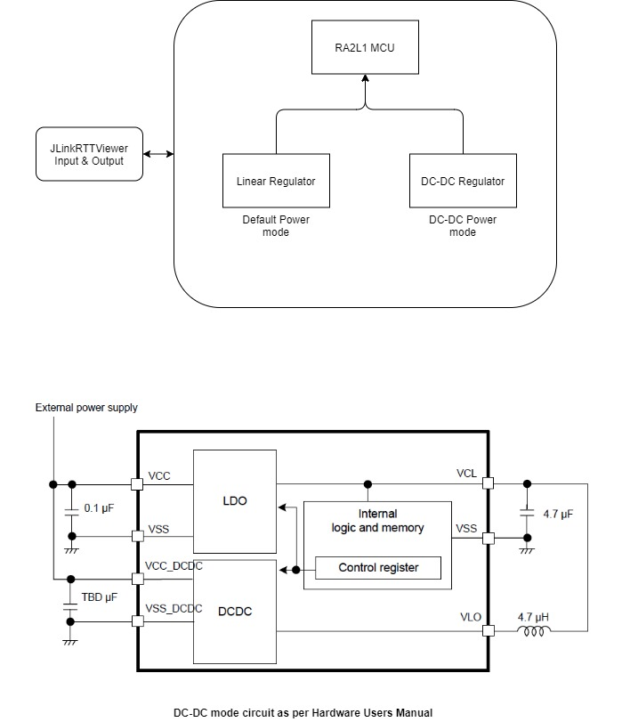
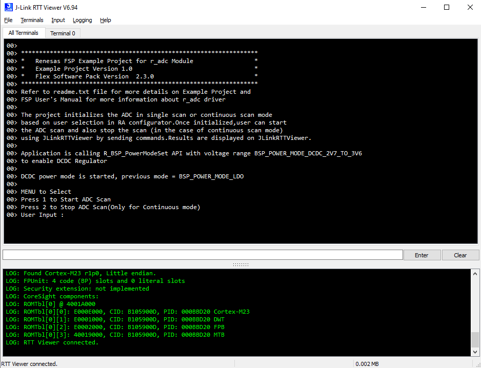

# Introduction #

This example project demonstrates the typical use of the DC-DC Regulator while operating ADC module using the HAL API's provided by FSP.
The project enables DC-DC regulator from BSP properties and calls R_BSP_PowerModeSet API at run time to change the MCU power 
input from Linear Regulator (LDO) mode to Switching Regulator (DC-DC) mode with Voltage range selected as 2.7V - 3.6V.

This example project can be easily modified to support varying the input voltage range at run time as well. 
This can be done by calling above mentioned API with required Voltage range as an input. The API will return the previous mode value.
User can initiate the ADC scan using JLinkRTTViewer by sending commands. Result and ADC status is displayed on the JLinkRTTViewer.

Please refer to the [Example Project Usage Guide](https://github.com/renesas/ra-fsp-examples/blob/master/example_projects/Example%20Project%20Usage%20Guide.pdf) 
for general information on example projects and [readme.txt](./readme.txt) for specifics of operation.

## Required Resources ##
To build and run the DC-DC example project, the following resources are needed.

### Hardware ###
* Renesas RA™ MCU kit
* Micro USB cable

Refer to [readme.txt](./readme.txt) on information on how to connect the hardware.

### Software ###
Refer to software described in [Example Project Usage Guide](https://github.com/renesas/ra-fsp-examples/blob/master/example_projects/Example%20Project%20Usage%20Guide.pdf)

## Related Collateral References ##
The following documents can be referred to for enhancing your understanding of 
the operation of this example project:
- [FSP User Manual on GitHub](https://renesas.github.io/fsp/)
- [FSP Known Issues](https://github.com/renesas/fsp/issues)

# Project Notes #

## System Level Block Diagram ##
  

## FSP Modules Used ##
List all the various modules that are used in this example project. Refer to the FSP User Manual for further details on each module listed below.

| Module Name | Usage (why is it used in the example project) | Searchable Keyword (using New Stack > Search) |
|-------------|-----------------------------------------------|-----------------------------------------------|
| r_adc |ADC module is used to demonstrate that MCU can use a module with the DC-DC Regulator | r_adc   |

## Module Configuration Notes ##
This section describes FSP Configurator properties which are important or different than those selected by default. 

|   Module Property Path and Identifier   |   Default Value   |   Used Value   |   Reason   |
| :-------------------------------------: | :---------------: | :------------: | :--------: |
|   configuration.xml -> BSP -> Properties -> RA2L1 Family -> Power -> DC-DC Regulator  |   Disabled   |   Enabled   |   Example project demonstrate the DC_DC Regulator functionality. It needs to be enabled in-order to use the feature.   |

## API Usage ##

The table below lists the FSP provided API used at the application layer by this example project.

| API Name    | Usage                                                                          |
|-------------|--------------------------------------------------------------------------------|
|R_BSP_PowerModeSet| Used to change the MCU power input mode from Linear Regulator (LDO) mode to DC-DC mode with supply input voltage as input|
|R_ADC_ScanStart| This API is used to start the ADC scanning|

## Verifying operation ##
By default this example project uses LDO mode and switches the power mode to DC-DC Regulator during run time by calling R_BSP_PowerModeSet API with 2.7V - 3.6V as input range.

Once user made the require Hardware changes and example project is running, user will get following output on JLinkRTT_Viewer.

To change the input voltage range to some other value, user can refer [readme.txt](./readme.txt) file from this example project.