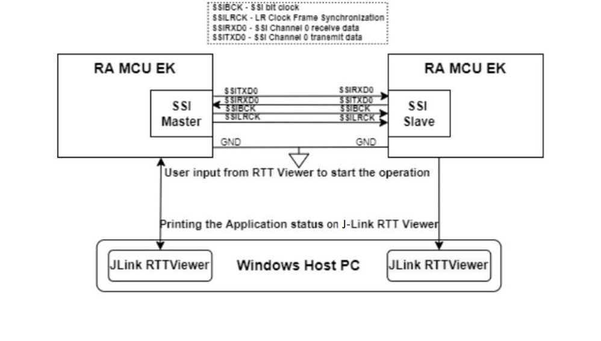

# Introduction #
This project demonstrates the basic functionalities of SSI driver and streaming example of SSI Slave on Renesas RA MCUs based on Renesas FSP. The project configures two RA boards, the first board with one channel as the SSI Master and the second board with one channel as the SSI Slave. The EP is configured with two options, is displayed on both the SSI Master and the SSI Slave EPs. The selection of which can be done from the J-Link RTT Viewer.
1. Master Write - Slave Read
2. Slave Write - Master Read

On Selecting Master Write - Slave Read on both Master and Slave, the Master starts writing data, and the Slave reads the data. On Selecting Slave Write - Master Read on both Master and Slave, the Slave starts writing data, and the Master reads the data. The two example projects ssi_master_ek_ra2l2_ep and ssi_slave_ek_ra2l2_ep are provided for the SSI Slave EP, one intended for Master and other for Slave.
 
Please refer to the [Example Project Usage Guide](https://github.com/renesas/ra-fsp-examples/blob/master/example_projects/Example%20Project%20Usage%20Guide.pdf) 
for general information on example projects and [readme.txt](./readme.txt) for specifics of operation.

## Required Resources ##
To build and run the SSI example project, the following resources are needed.

### Software ###
* Renesas Flexible Software Package (FSP): Version 6.3.0
* e2 studio: Version 2025-12
* SEGGER J-Link RTT Viewer: Version 8.92
* GCC ARM Embedded Toolchain: Version 13.2.1.arm-13-7

Refer to software requirements mentioned in [Example Project Usage Guide](https://github.com/renesas/ra-fsp-examples/blob/master/example_projects/Example%20Project%20Usage%20Guide.pdf)

### Hardware ###
* Supported RA boards: EK-RA4M2, EK-RA4M3, EK-RA6M1, EK-RA6M2, EK-RA6M3, EK-RA6M4, EK-RA6M5, EK-RA4E2, EK-RA6E2, EK-RA8D1, EK-RA8M1, FPB-RA8E1, EK-RA4L1, EK-RA2L2.
* 2 x Renesas RA boards.
* 2 x Micro USB cables for programming and debugging.
* 1 x A PC with at least 2 USB ports (1 for Master and 1 for Slave).
* Some jumper wires.

Refer to [readme.txt](./readme.txt) for information on how to connect the hardware.

### Hardware Connections: ###
Pin and Jumper Settings:  
* For EK-RA6M2, EK-RA6M3:
   * P112 SSISCK (Master) -----> P112 SSISCK (Slave)
   * P113 SSIWS  (Master) -----> P113 SSIWS  (Slave) 
   * P115 SSITXD (Master) -----> P114 SSIRXD (Slave) 
   * P114 SSIRXD (Master) -----> P115 SSITXD (Slave) 
   * GND (Master)        -----> GND (Slave) 

* For EK-RA6M1:
   * P403 SSIBCK  (Master) -----> P403 SSIBCK  (Slave)
   * P404 SSILRCK (Master) -----> P404 SSILRCK (Slave)
   * P405 SSITXD (Master)  -----> P406 SSIRXD  (Slave)
   * P406 SSIRXD (Master)  -----> P405 SSITXD  (Slave)
   * GND (Master)        -----> GND (Slave) 
         
* For EK-RA4M2, EK-RA4M3, EK-RA6M4, EK-RA6M5:
   * P112 SSIBCK0  (Master) -----> P112 SSIBCK0  (Slave)
   * P113 SSILRCK0 (Master) -----> P113 SSILRCK0 (Slave)
   * P115 SSITXD0  (Master) -----> P114 SSIRXD0  (Slave)
   * P114 SSIRXD0  (Master) -----> P115 SSITXD0  (Slave)
   * GND (Master)        -----> GND (Slave) 

* For EK-RA4E2, EK-RA6E2:
   * P102 SSIBCK0  (Master) -----> P102 SSIBCK0  (Slave)
   * P103 SSILRCK0 (Master) -----> P103 SSILRCK0 (Slave)
   * P109 SSITXD0  (Master) -----> P110 SSIRXD0  (Slave)
   * P110 SSIRXD0  (Master) -----> P109 SSITXD0  (Slave)
   * GND (Master)        -----> GND (Slave) 
   * For EK-RA4E2 (Master) :
      * P105 (GPT1) <--> P100 (AUDIO_CLK)

* For EK-RA8D1:
   * P403 SSIBCK0  (Master) -----> P403 SSIBCK0  (Slave)
   * P404 SSILRCK0 (Master) -----> P404 SSILRCK0 (Slave)
   * P405 SSITXD0  (Master) -----> P406 SSIRXD0  (Slave)
   * P406 SSIRXD0  (Master) -----> P405 SSITXD0  (Slave)
   * GND (Master)        -----> GND (Slave) 
   * EK-RA8D1: The user needs to turn OFF SW1-3 and SW1-5 to use SSI.

* For EK-RA8M1:
   * P112 SSIBCK0  (Master) -----> P112 SSIBCK0  (Slave) 
   * P113 SSILRCK0 (Master) -----> P113 SSILRCK0 (Slave) 
   * P405 SSITXD0  (Master) -----> P114 SSIRXD0  (Slave) 
   * P114 SSIRXD0  (Master) -----> P405 SSITXD0  (Slave)
   * GND (Master)        -----> GND (Slave) 
   * EK-RA8M1: Remove Jumper J61 to use P112, P114, P405 for SSI.

* For FPB-RA8E1:
   * P112 SSIBCK0  (Master) (J3:18) -----> P112 SSIBCK0  (Slave) (J3:18)
   * P113 SSILRCK0 (Master) (J3:17) -----> P113 SSILRCK0 (Slave) (J3:17)
   * P405 SSITXD0  (Master) (J4:14) -----> P114 SSIRXD0  (Slave) (J3:15)
   * P114 SSIRXD0  (Master) (J3:15) -----> P405 SSITXD0  (Slave) (J4:14)
   * GND (Master) (J3:20)            -----> GND (Slave) (J3:20)

* For EK-RA4L1:
   * P113 SSIBCK0  (Master) (J2:41) -----> P113 SSIBCK0  (Slave) (J2:41)
   * P404 SSILRCK0 (Master) (J2:44) -----> P404 SSILRCK0 (Slave) (J2:44)
   * P405 SSITXD0  (Master) (J2:42) -----> P406 SSIRXD0  (Slave) (J2:38)
   * P406 SSIRXD0  (Master) (J2:38) -----> P405 SSITXD0  (Slave) (J2:42)
   * GND (Master) (J4:25)           -----> GND (Slave) (J4:25)

* For EK-RA2L2:
   * P411 SSIBCK0  (Master) (J2:5) -----> P411 SSIBCK0  (Slave) (J2:5)
	* P410 SSILRCK0 (Master) (J2:6) -----> P410 SSILRCK0 (Slave) (J2:6)
	* P409 SSITXD0  (Master) (J2:7) -----> P408 SSIRXD0  (Slave) (J2:8)
	* P408 SSIRXD0  (Master) (J2:8) -----> P409 SSITXD0  (Slave) (J2:7)
   * GND (Master) (J2:40)          -----> GND (Slave) (J2:40)

Connect the Micro USB end of the Micro USB device cable to Debug port of the board. Connect the other end of this cable to USB port of the host PC.

## Related Collateral References ##
The following documents can be referred to for enhancing your understanding of 
the operation of this example project:
- [FSP User Manual on GitHub](https://renesas.github.io/fsp/)
- [FSP Known Issues](https://github.com/renesas/fsp/issues)

# Project Notes #

## System Level Block Diagram ##
High level block diagram

## FSP Modules Used ##
List of all the various modules that are used in this ssi_master_ek_ra2l2_ep example project. Refer to the FSP User Manual for further details on each module listed below.

| Module Name | Usage  | Searchable Keyword (using New Stack > Search) |
|-------------|-----------------------------------------------|-----------------------------------------------|
| I2S | SSI driver for Master mode. | r_ssi |
| General PWM | Master configures General PWM for SSI Audio Clock. | r_gpt |

List of all the various modules that are used in this ssi_slave_ek_ra2l2_ep example project. Refer to the FSP User Manual for further details on each module listed below.

| Module Name | Usage  | Searchable Keyword (using New Stack > Search) |
|-------------|-----------------------------------------------|-----------------------------------------------|
| I2S | SSI driver for Slave mode. | r_ssi|

## Module Configuration Notes ##
This section describes FSP Configurator properties that are important or different from those selected by default. 

**Common Configuration Properties for SSI Master and SSI Slave**

|   Module Property Path and Identifier   |   Default Value   |   Used Value   |   Reason   |
| :-------------------------------------: | :---------------: | :------------: | :--------: |
|   configuration.xml > BSP > Properties > Settings > Property > RA Common > Main stack size (bytes)  |  0x400  | 0x800  |  Change stack size to accommodate functions usage in the EP and avoid any runtime errors. |
|   configuration.xml > BSP > Properties > Settings > Property > RA Common > Heap size (bytes)  |  0   | 0x400  |  Change heap size to accommodate functions usage in the EP and avoid any runtime errors. |
|   configuration.xml > Stacks > g_i2s_master I2S (r_ssi) > Properties > Settings > Property > Common  >  DTC Support | Disabled | Enabled | Enable DTC support for the module. |

**Configuration Properties for SSI Master**

|   Module Property Path and Identifier   |   Default Value   |   Used Value   |   Reason   |
| :-------------------------------------: | :---------------: | :------------: | :--------: |
| configuration.xml > Stacks > g_i2s_master I2S (r_ssi) > Properties > Settings > Property > Module g_i2s_master I2S (r_ssi) > Channel| 0 | 0 | SSI Channel. |
| configuration.xml > Stacks > g_i2s_master I2S (r_ssi) > Properties > Settings > Property > Module g_i2s_master I2S (r_ssi) > Operating Mode (Master/Slave)| Master Mode | Master Mode| SSI Master Configuration. |
| configuration.xml > Stacks > g_i2s_master I2S (r_ssi) > Properties > Settings > Property > Module g_i2s_master I2S (r_ssi) > Bit Depth | 16 Bits | 32 bits| Bit Depth. |
| configuration.xml > Stacks >g_i2s_master I2S (r_ssi) > Properties > Settings > Property > Module g_i2s_master I2S (r_ssi) > Word Length | 16 Bits| 32 bits | This property is used to specify Word Length. |
| configuration.xml > Stacks > g_i2s_master I2S (r_ssi) > Properties > Settings > Property > Module g_i2s_master I2S (r_ssi) > WS Continue Mode | Disabled | Disabled | This property is used to enable/disable WS Continue Mode. |
| configuration.xml > Stacks > g_i2s_master I2S (r_ssi) > Properties > Settings > Property > Module g_i2s_master I2S (r_ssi) > Bit Clock Source (available only in Master mode) | External AUDIO_CLK| Internal AUDIO_CLK | This property is used to set Bit Clock Source. |
| configuration.xml > Stacks > g_i2s_master I2S (r_ssi) > Properties > Settings > Property > Module g_i2s_master I2S (r_ssi) >  Bit Clock Divider (available only in Master mode)  | Audio Clock / 1| Audio Clock/64 | This property is used to set Bit clock Divider. |
| configuration.xml > Stacks > g_i2s_master I2S (r_ssi) > Properties > Settings > Property > Module g_i2s_master I2S (r_ssi) > Callback | NULL | ssi_example_callback | Defined user callback for SSI events. |
| configuration.xml > Stacks > g_i2s_master I2S (r_ssi) > Properties > Settings > Property > Module g_i2s_master I2S (r_ssi) > Transmit Interrupt Priority | Disabled | Priority 2| This property is used to set Transmit Interrupt Priority. |
| configuration.xml > Stacks > g_i2s_master I2S (r_ssi) > Properties > Settings > Property > Module g_i2s_master I2S (r_ssi) > Receive Interrupt Priority  | Disabled  | Priority 2 | This property is used to set Receive Interrupt Priority. |
| configuration.xml > Stacks > g_i2s_master I2S (r_ssi) > Properties > Settings > Property > Module g_i2s_master I2S (r_ssi) > Idle/Error Interrupt Priority  | Disabled  | Priority 2 | This property is used to set Idle/Error Interrupt Priority. |

**Configuration Properties for SSI Slave**

|   Module Property Path and Identifier   |   Default Value   |   Used Value   |   Reason   |
| :-------------------------------------: | :---------------: | :------------: | :--------: |
| configuration.xml > Stacks > g_i2s_slave I2S (r_ssi) > Properties > Settings > Property > Module g_i2s_slave I2S (r_ssi) > Channel| 0 | 0 | SSI Channel. |
| configuration.xml > Stacks > g_i2s_slave I2S (r_ssi) > Properties > Settings > Property > Module g_i2s_slave I2S (r_ssi) > Operating Mode (Master/Slave)| Master Mode | Slave Mode| SSI Slave Configuration. |
| configuration.xml > Stacks > g_i2s_slave I2S (r_ssi) > Properties > Settings > Property > Module g_i2s_slave I2S (r_ssi) > Bit Depth | 16 Bits | 32 bits| Bit Depth. |
| configuration.xml > Stacks > g_i2s_slave I2S (r_ssi) > Properties > Settings > Property > Module g_i2s_slave I2S (r_ssi) > Word Length | 16 Bits| 32 bits | This property is used to specify Word Length. |
| configuration.xml > Stacks > g_i2s_slave I2S (r_ssi) > Properties > Settings > Property > Module g_i2s_slave I2S (r_ssi) > WS Continue Mode | Disabled | Disabled | This property is used to enable/disable WS Continue Mode. |
| configuration.xml > Stacks > g_i2s_slave I2S (r_ssi) > Properties > Settings > Property > Module g_i2s_slave I2S (r_ssi) > Bit Clock Source (available only in Master mode) | External AUDIO_CLK| External AUDIO_CLK | This property is used to set Bit Clock Source. |
| configuration.xml > Stacks > g_i2s_slave I2S (r_ssi) > Properties > Settings > Property > Module g_i2s_slave I2S (r_ssi) > Bit Clock Divider (available only in Master mode)  | Audio Clock / 1| Audio Clock/64 | This property is used to set Bit clock Divider. |
| configuration.xml > Stacks > g_i2s_slave I2S (r_ssi) > Properties > Settings > Property > Module g_i2s_slave I2S (r_ssi) > Callback | NULL | ssi_example_callback | Defined user callback for SSI events. |
| configuration.xml > Stacks > g_i2s_slave I2S (r_ssi) > Properties > Settings > Property > Module g_i2s_slave I2S (r_ssi) > Transmit Interrupt Priority | Disabled | Priority 2| This property is used to set Transmit Interrupt Priority. |
| configuration.xml > Stacks > g_i2s_slave I2S (r_ssi) > Properties > Settings > Property > Module g_i2s_slave I2S (r_ssi) > Receive Interrupt Priority  | Disabled  | Priority 2 | This property is used to set Receive Interrupt Priority. |
| configuration.xml > Stacks > g_i2s_slave I2S (r_ssi) > Properties > Settings > Property > Module g_i2s_slave I2S (r_ssi) > Idle/Error Interrupt Priority  | Disabled  | Priority 2 | This property is used to set Idle/Error Interrupt Priority. |

## API Usage ##

The table below lists the SSI basic APIs used at the application layer by this example project.

| API Name    | Usage                                                                          |
|-------------|--------------------------------------------------------------------------------|
|R_SSI_Open| This API is used to open the SSI instance. |
|R_SSI_Stop| This API is used to stop SSI. |
|R_SSI_Write| This API is used to write data buffer to SSI. |
|R_SSI_Read| This API is used to read data into the provided buffer. |
|R_SSI_Close| This API closes the SSI instance. |
|R_GPT_Open| This API is used to initialize the General PWM configured as SSI Audio Clock. |
|R_GPT_Start| This API is used to start SSI Audio Clock. |
|R_GPT_Close| This API is used to stop the SSI Audio Clock. |

## Verifying operation ##
* Import, Build and Debug the Example Projects for Master and Slave (see section Starting Development of **FSP User Manual**).
* Connect Micro USB cables and connect wires as mentioned in the **Hardware Connections** section above.
* Run the Example Projects on Master and Slave respectively and then open two instances of J-Link RTT Viewer to see the output status of the Example Projects for Master and Slave.
* Press "1", on both the EPs (Master and Slave sequentially). For the Master Write - Slave Read operation, after the transaction is completed, turn off the Slave first by pressing any key, and then for the Master press any key to terminate the process.
* Press "2", on both the EPs (Master and Slave sequentially). For the Master Read - Slave Write operation, after the transaction is completed, turn off the Master first by pressing any key, and then for the Slave press any key to terminate the process.
* The transaction/status messages will be displayed in J-Link RTT Viewer as depicted below:

Master Write RTT Viewer Log

Slave Read RTT Viewer Log

Master Read RTT Viewer Log

Slave Write RTT Viewer Log

### Special Topics 
#### Callback Handlers
1. **ssi_example_callback()** reloads FIFO's and handles errors.

#### SSI Master Clock Settings 
| No.   | Board       | SSI Master Clock Channel settings                                              |
|-------|-------------|--------------------------------------------------------------------------------|
|  1    |EK_RA6M1     | 1                                                                              |
|  2    |EK-RA6M2     | 1                                                                              |
|  3    |EK-RA6M3     | 1                                                                              |
|  4    |EK-RA6M4     | 2                                                                              |
|  5    |EK-RA6M5     | 2                                                                              |
|  6    |EK-RA4M2     | 2                                                                              |
|  7    |EK-RA4M3     | 2                                                                              |
|  8    |EK-RA4E2     | 1                                                                              |
|  9    |EK-RA6E2     | 2                                                                              |
|  10   |EK-RA8D1     | 2                                                                              |   
|  11   |EK-RA8M1     | 2                                                                              |
|  12   |FPB-RA8E1    | 2                                                                              |   
|  13   |EK-RA4L1     | 2                                                                              |   
|  14   |EK-RA2L2     | 4                                                                              |   