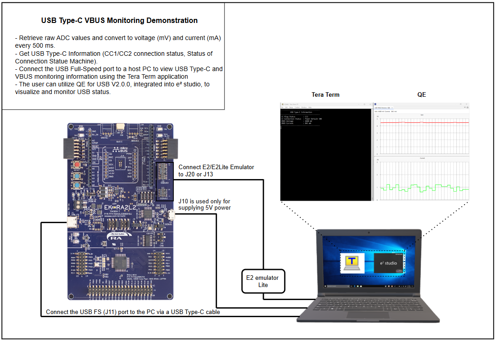
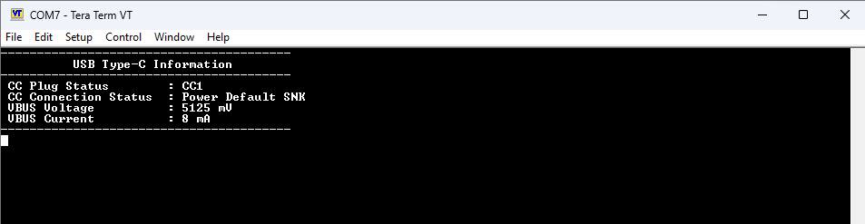
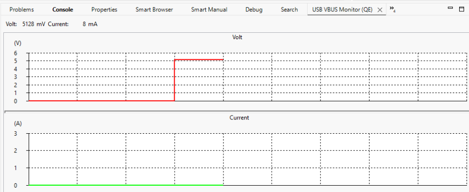
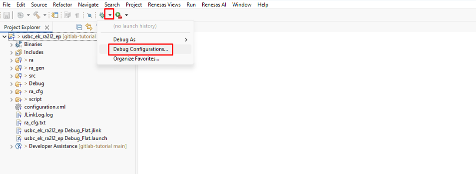
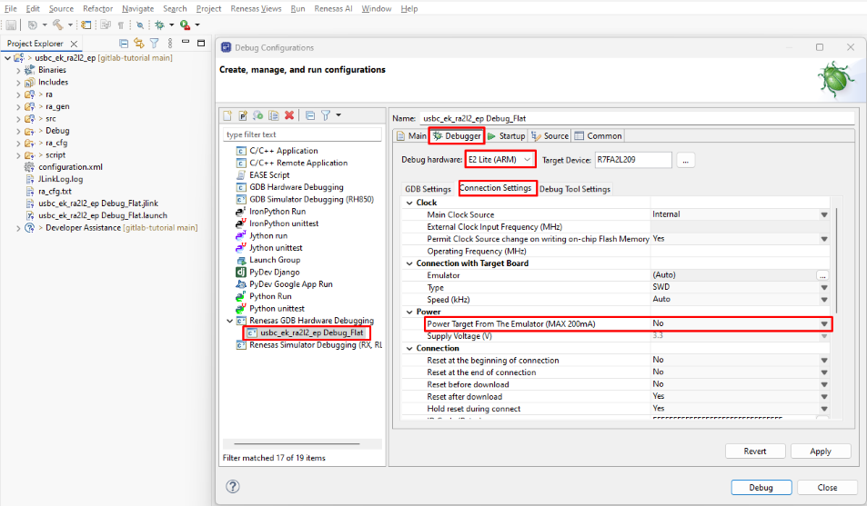

# Introduction #
This project demonstrates the monitoring of USB Type-C connection status and VBUS electrical characteristics on the Renesas EK-RA2L2 evaluation board. The application utilizes the RA2L2’s ADC to periodically sample analog signals every 500 ms to calculate voltage (mV) and current (mA). It also retrieves USBC connection information. All data is sent to a PC via USB Full-Speed PCDC, and users can view the results using Tera Term or the QE for USB tool in e² studio. The error LED will turn on if an error occurs.

Please refer to the [Example Project Usage Guide](https://github.com/renesas/ra-fsp-examples/blob/master/example_projects/Example%20Project%20Usage%20Guide.pdf) 
for general information on example projects and [readme.txt](./readme.txt) for specifics of operation.

## Required Resources ##
To build and run this example project, the following resources are needed.

### Software Requirements ###
* Renesas Flexible Software Package (FSP): Version 6.1.0
* e2 studio: Version 2025-07
* GCC ARM Embedded Toolchain: Version 13.2.1.arm-13-7
* Terminal Console Application: Tera Term or a similar application

### Hardware Requirements ###
* Supported RA board: EK-RA2L2
* 1 × RA board 
* 1 × USB Type-A male to Micro-B male cable
* 1 × USB Type-C male to Type-C male cable
* 1 × E2 Lite emulator with mini USB and target cables (for programming and debugging)

### Hardware Connections ###

To set up the hardware for this example project, make the following connections:
* Connect the E2 Lite emulator to the target board using either the J20 or J13 connector.
* Connect the J10 port to the host PC using a USB cable. This connection is dedicated to providing 5V power to the board.
* Connect the USB Full-Speed (J11) port to the host PC using a USB Type-C cable for data communication and additional power.

To ensure correct operation, set the jumpers on the EK-RA2L2 board as follows:

| **Jumper** | **Pins Shorted**                | **Purpose / Description**                                                           |
|:----------:|:-------------------------------:|:------------------------------------------------------------------------------------|
| **J16**    | 2–3                             | Boot mode: Normal operation                                                         |
| **J8**     | 1–2                             | Debug In mode                                                                       |
| **J9**     | 2–3                             | Debug In mode                                                                       |
| **J29**    | 1–2 3–4 5–6 7–8        | Target RA MCU debug signals connected to the debug interface                        |
| **J40**    | 5–6                             | Connects P109 to associated circuit                                                 |
| **J41**    | 5–6                             | Connects P110 to associated circuit                                                 |

## Related Collateral References ##
Refer to the following documents to enhance your understanding of the operation of this example project:
- [FSP User Manual on GitHub](https://renesas.github.io/fsp/)
- [FSP Known Issues](https://github.com/renesas/fsp/issues)

# Project Notes #

## System Level Block Diagram ##
A high-level block diagram of the system is shown below:

  

## FSP Modules Used ##

List all the various modules that are used in this example project. Refer to the FSP User Manual for further details on each module listed below:

| **Module Name**                                         | **Purpose / Functionality**                                   | **Stack Search Keyword**      |
|:--------------------------------------------------------|:--------------------------------------------------------------|:------------------------------|
| **USB Type-C** `r_usb_typec`                         | Monitors USB Type-C connection status and CC1/CC2 lines       | `r_usb_typec`                 |
| **ADC** `r_adc`                                      | Samples analog signals for VBUS voltage and current measurements | `r_adc`                    |
| **USB PCDC Communication Device** `rm_comms_usb_pcdc`| Enables USB Full-Speed communication with the host PC          | `rm_comms_usb_pcdc`           |

## Module Configuration Notes ##
This section describes FSP Configurator properties which are important or different than those selected by default. 
| Module Property Path and Identifier | Default Value | Configured Value | Rationale |
| :---------------------------------- | :-----------: | :--------------: | :-------- |
| configuration.xml > Stacks > USB-TYPEC (r_usb_typec) > Properties > Settings > Property > Module g_usbcc0 USB Type C (r_usb_typec) > USBCC Callback | NULL | usb_typec_callback | Assigns the application's callback function to handle USB Type-C events. |
| configuration.xml > Stacks > ADC (r_adc) > Properties > Settings > Property > Module g_adc ADC (r_adc) > Input > Channel Scan Mask (channel availability varies by MCU) > Channel 7 | ☐ | ☑ | Enables ADC Channel 7 for analog signal sampling required by the application. |
| configuration.xml > Stacks > ADC (r_adc) > Properties > Settings > Property > Module g_adc ADC (r_adc) > Input > Channel Scan Mask (channel availability varies by MCU) > Channel 8 | ☐ | ☑ | Enables ADC Channel 8 for analog signal sampling required by the application. |

## API Usage ##

The following table lists the key FSP APIs used by the application layer in this example project:

| No. | API                        | Description                                                           |
|-----|----------------------------|-----------------------------------------------------------------------|
| 1   | R_USB_TYPEC_Open           | This API is used to initialize the USB Type-C driver                  |
| 2   | R_USB_TYPEC_Close          | This API is used to deinitialize the USB Type-C driver                |
| 3   | R_ADC_ScanCfg              | This API is used to configure the ADC scan settings                   |
| 4   | R_ADC_ScanStart            | This API is used to start an ADC scan to sample analog signals        |
| 5   | R_ADC_Read                 | This API is used to read the result of an ADC conversion              |
| 6   | R_ADC_Close                | This API is used to deinitialize the ADC module                       |
| 7   | RM_COMMS_USB_PCDC_Open     | This API is used to initialize the USB PCDC communication interface   |
| 8   | RM_COMMS_USB_PCDC_Write    | This API is used to send data to the host PC over USB PCDC            |
| 9   | RM_COMMS_USB_PCDC_Close    | This API is used to deinitialize the USB PCDC communication interface |

## Verifying operation ##

1. Import the desired example project into your workspace.
2. Double click configuration.xml file, and click Generate Project Content. Next, build the project.
3. Conduct the hardware connection as described in the Hardware Connections section.
4. Debug or flash the example project to the RA board and run the program.
5. Open a serial terminal application (e.g., Tera Term) on the host PC and select the proper serial COM port.
6. The USB information will be displayed on the terminal.

7. Install **QE for USB V2.0.0** in e² studio by following the procedure outlined in section 2.1.1 of the *QE for USB V2.0.0 Release Note*, available at [Renesas QE for USB](https://www.renesas.com/en/software-tool/qe-usb-dedicated-tool-usb?srsltid=AfmBOoqyepZGvbPgIvPeZ3ampUHd8ETffkZ8UWTgQyFRalS1UZ3ilrmY). Confirm that the tool is successfully installed before proceeding with VBUS monitoring and USB Type-C status verification.

8. To monitor VBUS using QE for USB, open the **USB VBUS Monitor (QE)** view in e² studio by selecting **[Renesas Views] → [Renesas QE] → [USB VBUS Monitor (QE)]**. This view provides real-time monitoring of VBUS voltage and current measurements.

")

9. Pause program execution to observe the current VBUS status in the QE USB VBUS Monitor.

10. To verify the USB Type-C status, open the **USB Type-C Check (QE)** view in e² studio by selecting **[Renesas Views] → [Renesas QE] → [USB Type-C Check (QE)]** from the FSP configuration perspective.

")

## Special Note ##
### Debugging Note: QE and J-Link

When using J-Link as the debugging interface with the EK-RA2L2, the MCU may encounter an exception and halt at the Default Handler when the USB State Chart (QE) view is opened in e² studio.

**Recommended Solution:**  
To utilize the USB State Chart (QE) feature, use the E2 Emulator Lite with the following configuration (default settings):

1. Open **[Debug Configurations...]** in e² studio.

    

2. Select the `usb_typec_ek_ra2l2_ep Debug_Flat` configuration and navigate to the **Debugger** tab.
3. In the **Debug hardware** dropdown, choose **E2 Lite (ARM)**.
4. Switch to the **Connection Settings** tab and set **Power Target From The Emulator** to **No**.
5. Click **Apply** and then **Debug** to start the session.

    

Verify that the debug environment operates correctly with the E2 Lite Emulator before using the USB State Chart (QE) view.
