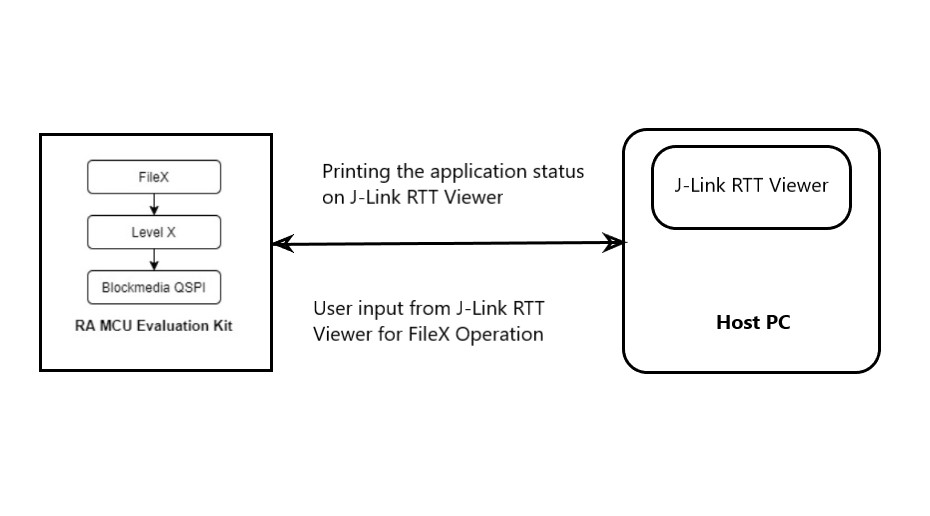
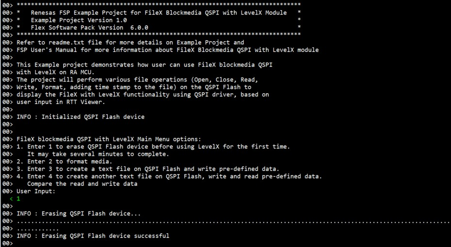
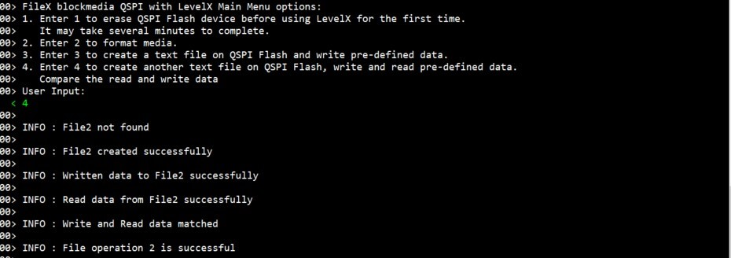

# Introduction #

This example project demonstrates the basic functionality of FileX on LevelX NOR module on Renesas RA MCUs based on Renesas FSP using Azure RTOS. FileX middleware on LevelX NOR uses the underlying QSPI driver to perform various operations like erasing and formatting QSPI Flash, writing and reading back data, opening and closing files on QSPI flash Macronix MX25L25645G.
These operations are done via FileX middleware, on underlying QSPI flash driver based on user input from the J-Link RTT Viewer.

J-Link RTT Viewer is used as user interface. System messages (Error and info messages) will be printed on J-Link RTT Viewer during the execution of the project.

Please refer to the [Example Project Usage Guide](https://github.com/renesas/ra-fsp-examples/blob/master/example_projects/Example%20Project%20Usage%20Guide.pdf) 
for general information on example projects and [readme.txt](./readme.txt) for specifics of operation.

## Required Resources ##
To build and run the FileX Blockmedia QSPI with LevelX example project, the following resources are needed.

### Software ###
* Renesas Flexible Software Package (FSP): Version 6.1.0
* e2 studio: Version 2025-07
* SEGGER J-Link RTT Viewer: Version 8.58
* GCC ARM Embedded Toolchain: Version 13.2.1.arm-13-7

### Hardware ###
Supported RA boards: EK-RA4M2, EK-RA4M3, EK-RA6E2, EK-RA6M3, EK-RA6M4, EK-RA6M5, EK-RA4L1, EK-RA4C1
* 1 x Renesas RA board.
* 1 x Type C USB cable for programming and debugging.
* 1 x Host Machine.

### Hardware Connections ###
For EK-RA6E2:
* Connect jumper J35 pins.

For EK-RA4L1:
* Connect jumper J15 pins.
* E1 must be closed.

For EK-RA4C1:
* The user must place jumper J6 on pins 2-3, J8 on pins 1-2, J9 on pins 2-3 and turn OFF SW4-4 to use the on-board debug functionality.

## Related Collateral References ##
The following documents can be referred to for enhancing your understanding of 
the operation of this example project:
- [FSP User Manual on GitHub](https://renesas.github.io/fsp/)
- [FSP Known Issues](https://github.com/renesas/fsp/issues)

# Project Notes #

## System Level Block Diagram ##

## FSP Modules Used ##
List all the various modules that are used in this example project. Refer to the FSP User Manual for further details on each module listed below.

| Module Name | Usage  | Searchable Keyword (using New Stack > Search) |
|-------------|-----------------------------------------------|-----------------------------------------------|
| FileX on LevelX NOR | With FileX on LevelX NOR driver, the user can operate the file system on NOR flash devices with wear-levelling performed by LevelX.| level |

## Module Configuration Notes ##
This section describes FSP Configurator properties that are important or different from those selected by default. 

|   Module Property Path and Identifier   |   Default Value   |   Used Value   |   Reason   |
| :-------------------------------------: | :---------------: | :------------: | :--------: |
| configuration.xml > Stacks > FileX_Thread > g_fx_media0 Azure RTOS FileX on LevelX NOR > Properties > Settings > Property > Module g_fx_media0 Azure RTOS FileX on LevelX NOR > Total Sectors | 57337 | 65536 | Total sectors calculated for on-board QSPI Flash MX25L25645G with block size 65,536. |
| configuration.xml > Stacks > FileX_Thread > g_rm_levelx_nor_spi0 LevelX NOR Port (rm_levelx_nor_spi) > Properties > Settings > Property > Module g_rm_levelx_nor_spi0 LevelX NOR Port (rm_levelx_nor_spi) > Memory Size (bytes) | 33554432 | 0x2000000 | Memory size given in hex. |
| configuration.xml > Stacks > FileX_Thread > g_qspi0 QSPI (r_qspi) > Properties > Settings > Property > Module g_qspi0 QSPI (r_qspi) > General > SPI Protocol | Extended SPI | QPI | QPI mode is selected. |
| configuration.xml > Stacks > FileX_Thread > g_qspi0 QSPI (r_qspi) > Properties > Settings > Property > Module g_qspi0 QSPI (r_qspi) > General > Address Bytes | 3 | 4 | 4-byte address mode is selected. |
| configuration.xml > Stacks > FileX_Thread > Properties > Settings > Property > Thread > Stack size (bytes) | 1024 | 4096 | Increased stack area to accomodate FileX function calls. |

## API Usage ##

The table below lists the FileX API used at the application layer by this example project.

| API Name    | Usage                                                                          |
|-------------|--------------------------------------------------------------------------------|
| fx_system_initialize | This function initializes the various control data structures for the FileX System component. |
| lx_nor_flash_initialize | This function initializes the NOR flash support. |
| fx_system_date_set | This function sets the system date to the variable used by the caller. |
| fx_system_time_set | This function sets the system time to the variable used by the caller. |
| fx_media_format | This function formats specified media - FAT12/16/32 format. |
| fx_media_open | This function opens media and checks for errors. |
| fx_media_close | This function closes media. |
| fx_file_create | This function verifies the file name, checks for various errors and creates an empty file. |
| fx_file_open | This function opens the specifed file for either reading or writing. |
| fx_file_close | This function closes the specified file. |
| fx_file_read | This function reads the specified number of bytes. |
| fx_file_write | This function writes the specified number of bytes into the file's data area. |
| fx_file_date_time_set | This function sets the date and time of the specified file. |
| fx_file_delete | This function deletes the specified file. |
| R_QSPI_Open | This function opens the QSPI driver module. |
| R_QSPI_Close | This function closes the QSPI driver module. |
| R_QSPI_DirectWrite | This function writes raw data directly to the QSPI. |
| R_QSPI_DirectRead | This function reads raw data directly from the QSPI. |
| R_QSPI_StatusGet | This function gets the write or erase status of the flash. |

## Verifying operation ##
Import, Build and Debug the EP (see section Starting Development of **FSP User Manual**). After running the EP, open the RTT Viewer to see the output.
Before running the example project, refer to the below steps for hardware connections:
* Connect RA MCU debug port to the host PC via a Type C USB cable. 

Below images showcases the output on J-Link RTT Viewer :

## Special Topics ##
* EK-RA6E2 board uses onboard QSPI flash Adesto® AT25SF128A.

* The setup_qspi.c and setup_qspi.h contains the API for configuration and initialization of QSPI flash device. It configures the 4-byte addressing and Quad-SPI protocol (Except EK-RA6E2, which configures the 3-byte addressing and Extended SPI).

* The main menu's first option to erase the QSPI flash device has to executed first when running LevelX on some device for the first time, otherwise all other options will fail and the EP will land into BSP_CFG_HANDLE_UNRECOVERABLE_ERROR().
