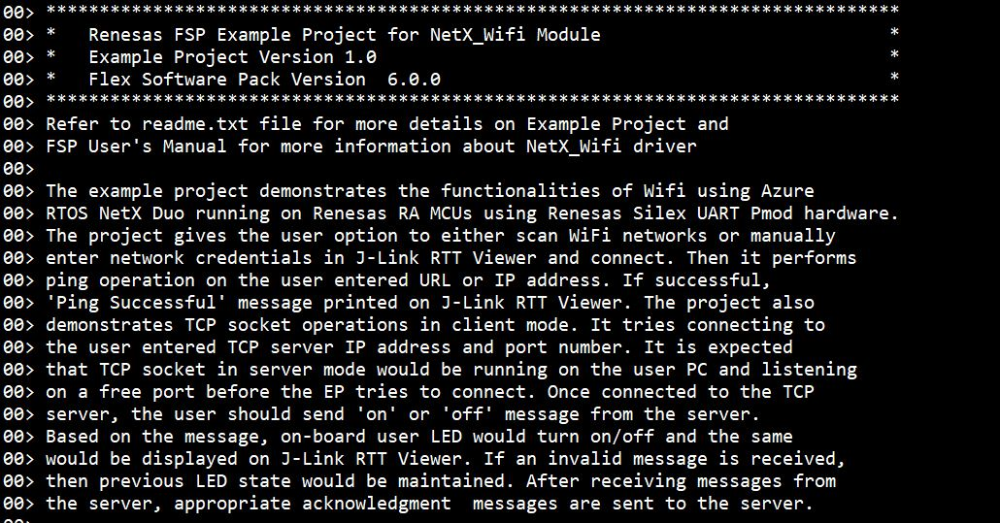
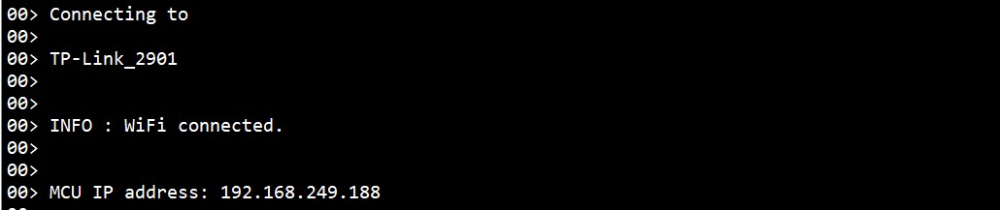

# Introduction #

The example code accompanying this file shows the operation of a NetX Duo Wifi module using RA MCU Azure RTOS NetX Duo Network Drivers. In this example code, A NetX Duo IP instance is created upon call to NetX Duo Network Drivers APIs, NetX Duo Wifi utilizes the WiFi Onchip Silex module for Wifi Access point connectivity, IP address assignment and Ping to IP address entered by the user. Upon successful initialization of WiFi Onchip Silex module, the user is asked to select the SSID to connect in auto scan mode or to Enter the desired SSID for wifi connection in Manual mode. Once Entered the SSID name the user is asked for security to be entered (Open, WPA or WPA2) as menu option, after this the password (according to security) is to be entered by the user to connect to particular SSID. The Azure NetX Duo initializes the packet pool creation with definite packet payload size, where the network packets are utilized in data transfer from client and server via TCP. The connection to TCP server (Details of requirements and steps to connect are mentioned in below sections) is done in client mode using NetX APIs for creation of TCP socket, binding of the specified port and connecting to the entered address of running TCP server by the user. Upon successful connection with TCP server data packets are sent to the server and received from the server by the application, On board LED state is changed (on or off) as per the message received from the connected TCP server.
The status messages, like MCU IP address, Ping status, TCP connection status, message from the  TCP server and errors (if any) are displayed on the J-Link RTT Viewer.

Please refer to the [Example Project Usage Guide](https://github.com/renesas/ra-fsp-examples/blob/master/example_projects/Example%20Project%20Usage%20Guide.pdf) for general information on example projects and [readme.txt](./readme.txt) for specifics of the operation.

## Required Resources ##
To build and run the NetX Wifi example project, the following resources are needed.

### Software ###
* Renesas Flexible Software Package (FSP): Version 6.0.0
* e2 studio: Version 2025-04.1
* SEGGER J-Link RTT Viewer: Version 8.44a
* GCC ARM Embedded Toolchain: Version 13.2.1.arm-13-7
* Sokit software is required for creation of TCP server over specified IP and port (detailed steps mentioned below). Download Link : https://softfamous.com/sokit/
* Refer to software requirements mentioned in [Example Project Usage Guide](https://github.com/renesas/ra-fsp-examples/blob/master/example_projects/Example%20Project%20Usage%20Guide.pdf)

### Hardware ###
Supported RA boards: EK-RA4M2, EK-RA2L1, EK-RA4M1, EK-RA6M1, EK-RA6M2, EK-RA6M3, EK-RA6M4, EK-RA6M5, EK-RA4M3, FPB-RA4E1, FPB-RA6E1, EK-RA4E2, EK-RA6E2, MCK-RA4T1, MCK-RA6T3, EK-RA8M1, EK-RA8D1, MCK-RA8T1, EK-RA2A2, FPB-RA8E1, EK-RA4L1, EK-RA8E2, EK-RA8P1, EK-RA4C1.
* 1 x Renesas RA board.
* 1 x Renesas Silex UART Pmod (P/N: RTK00WFMX0B01000BE).
* 1 x WiFi router Access Point (AP) with internet access. Note: WiFi router AP's credentials should be known.
* 1 x PC or laptop connected to the same WiFi router AP. On PC/laptop, create TCP server and start listening at port which is free.

### Hardware Connections ###
* For EK-RA4M2, EK-RA4M3, EK-RA6M3, EK-RA6M4, EK-RA6M5: 
  * Connect Renesas Silex UART Pmod ----> PMOD1 (J26)	
  * Please carefully align pin 1 on the Renesas Silex UART Pmod with pin 1 on the PMOD1.

* For EK-RA6M1, EK-RA6M2, EK-RA4M1:  
  * Connect Renesas Silex UART Pmod ----> PMODA (J5)
  * Please carefully align pin 1 on the Renesas Silex UART Pmod with pin 1 on the PMODA.

* For EK-RA2L1, FPB-RA4E1, FPB-RA6E1, EK-RA4E2, EK-RA6E2, MCK-RA4T1, MCK-RA6T3, EK-RA8M1, EK-RA8D1, FPB-RA8E1, EK-RA8P1:  
  * Connect Renesas Silex UART Pmod ----> PMOD2
  * Please carefully align pin 1 on the Renesas Silex UART Pmod with pin 1 on the PMOD2.

* For MCK-RA8T1:  
  * Connect
    * Renesas Silex UART Pmod (CN1:2) ----> P112
    * Renesas Silex UART Pmod (CN1:3) ----> P113
    * Renesas Silex UART Pmod (CN1:5) ----> GND
    * Renesas Silex UART Pmod (CN1:6) ----> VCC
    * Renesas Silex UART Pmod (CN1:8) ----> P114

* For EK-RA2A2:  
  * Connect
    * Renesas Silex UART Pmod (CN1:2) ----> P501 (J1:1)
    * Renesas Silex UART Pmod (CN1:3) ----> P500 (J4:19)
    * Renesas Silex UART Pmod (CN1:5) ----> GND
    * Renesas Silex UART Pmod (CN1:6) ----> VCC
    * Renesas Silex UART Pmod (CN1:8) ----> P203 (J3:9)

* For EK-RA4L1:
	* Connect
		* Renesas Silex UART Pmod (CN1:2) ----> P109 (J3:19)
		* Renesas Silex UART Pmod (CN1:3) ----> P110 (J3:20)
		* Renesas Silex UART Pmod (CN1:5) ----> GND  (J3:25)
		* Renesas Silex UART Pmod (CN1:6) ----> VCC  (J3:1)
		* Renesas Silex UART Pmod (CN1:8) ----> P306 (J4:11)

* For EK-RA8E2:  
  * The user must turn ON SW4-4 to use PMOD2 for UART.
  * Connect Renesas Silex UART Pmod (CN1:1) ----> PMOD2 (J25:1)
  * Please carefully align pin 1 on the Renesas Silex UART Pmod with pin 1 on the PMOD2.

* For EK-RA4C1:  
  * The user must place jumper J6 on pins 2-3, J8 on pins 1-2, J9 on pins 2-3 and turn OFF SW4-4 to use the on-board debug functionality.  
  * The user must close E52 to use P305 for RST pin of PMOD2.
  * Connect 
    * Renesas Silex UART Pmod (CN1:2) ----> P115 (J2:35)
    * Renesas Silex UART Pmod (CN1:3) ----> P608 (J2:37)
    * Renesas Silex UART Pmod (CN1:5) ----> GND  (J2:1)
    * Renesas Silex UART Pmod (CN1:6) ----> VCC  (J1:1)
    * Renesas Silex UART Pmod (CN1:8) ----> P305 (J2:38)

## Related Collateral References ##
The following documents can be referred to for enhancing your understanding of the operation of this example project:
- [FSP User Manual on GitHub](https://renesas.github.io/fsp/)
- [FSP Known Issues](https://github.com/renesas/fsp/issues)

# Project Notes #

## System Level Block Diagram ##

## FSP Modules Used ##
List all the various modules that are used in this example project. Refer to the FSP User Manual for further details on each module listed below.

| Module Name | Usage | Searchable Keyword (using New Stack > Search) |
|-------------|-----------------------------------------------|-----------------------------------------------|
| Azure RTOS NetX Duo IP Instance | This module provides network drivers for Azure RTOS NetX Duo. | Azure RTOS NetX Duo Network Drivers |
| NetX Duo Wifi Driver | For IP communication the NetX IP instance needs to be used. | NetX Duo IP |
| Net Duo packet pool | Packet Pool Module is used to send and receive the created data packets over TCP network. | NetX Duo Packet Pool | 
| WiFi Onchip Silex Driver | For wifi SSID connect, ping to IP/URL WiFi Onchip Silex Driver is used. | WiFi Onchip Silex Driver |

## Module Configuration Notes ##
This section describes FSP Configurator properties that are important or different from those selected by default. 

|   Module Property Path and Identifier   |   Default Value   |   Used Value   |   Reason   |
| :-------------------------------------: | :---------------: | :------------: | :--------: |
| configuration.xml > BSP > Properties > Settings > Property > RA Common > Heap size (bytes) | 0 | 0x1000 | Higher Heap size is required for standard library functions to be used as per FSP recommendation. |
| configuration.xml > BSP > Properties > Settings > Property > RA Common > Main stack size (bytes) | 0 | 0x400 | Main Program thread stack is configured to store the local variables of different functions in the code. |
| configuration.xml > Stacks > RTT Thread > Properties > Settings > Property > Thread > Priority | 1 | 5 | RTT thread priority is lowered to allow the IP threads to process incoming packets at the fastest rate possible. |
| configuration.xml > Stacks > Azure Wifi Thread > Properties > Settings > Property > Thread > Priority | 1 | 4 | Priority of the Application threads generally given lower priority compared to system services threads. |
| configuration.xml > Stacks > Azure Wifi Thread > Properties > Settings > Property > Thread > Stack size (bytes) | 1024 | 4096 | Updated to handle thread its worst-case function call nesting and local variable usage. |
| configuration.xml > Stacks > Azure Wifi Thread > g_ip0 Azure RTOS NetX Duo IP Instance > Properties > Settings > Property > Module g_ip0 Azure RTOS NetX Duo IP Instance > Default Gateway Address | 0.0.0.0 | 192.168.0.1 | Valid Gateway address for IP routing. |
| configuration.xml > Stacks > Azure Wifi Thread > g_ip0 Azure RTOS NetX Duo IP Instance > Properties > Settings > Property > Module g_ip0 Azure RTOS NetX Duo IP Instance > Subnet Mask | 255.255.255.0 | 0.0.0.0 | Subnet mask for IP routing. |

## API Usage ##

The table below lists the Azure RTOS NetX Duo Network Drivers API used at the application layer by this example project.

| API Name    | Usage                                                                          |
|-------------|--------------------------------------------------------------------------------|
| rm_wifi_onchip_silex_open | This API is used to initialize the WiFi module driver. |
| rm_wifi_onchip_silex_scan | This API is used to scan all Wifi Access points. |
| rm_wifi_onchip_silex_connect | This API is used to connect with specified Wifi Access point. |
| rm_wifi_onchip_silex_dns_query | This API is used to preform a DNS lookup. |	
| rm_wifi_onchip_silex_ip_addr_get | This API is used to fetch the IP address assigned to MCU. |	
| rm_wifi_onchip_silex_ping | This API is used to perform the Ping operation. |	
| nx_system_initialize | This API is used to initialize NetX System. |	
| nx_packet_pool_create | This service is used to create a packet pool of the specified packet size in the memory area. | 	
| nx_ip_create | This API is used to create an IP Instance. |
| nx_tcp_enable | This API is used to enable the Transmission Control Protocol (TCP) component of NetX. |	
| nx_tcp_socket_create | This API is used to create a TCP client or server socket for the specified IP instance. |	
| nx_tcp_client_socket_bind | This API is used to bind the previously created TCP client socket to the specified TCP port. |	
| nx_tcp_client_socket_connect | This API is used to connect the previously-created and bound TCP client socket to the specified server's port. |		
| nx_packet_allocate | This API is used to allocate a packet from the specified pool. |
| nx_tcp_socket_send | This service is used to send TCP data through a previously connected TCP socket. |	
| nx_tcp_socket_receive | This service is used to receive TCP data from the specified socket. |

## Verifying Operation ##
Import, Build and Debug the EP (see section Starting Development of **FSP User Manual**). After running the EP, open the J-Link RTT Viewer to see the output. Before running the example project, refer to the below steps for hardware connections:
* Connect RA MCU debug port to the host PC via a Type-C USB cable.
* Connect the Silex Module to the RA board.
* TCP Server must be running at valid IP address on same network on which Application is running.
**Note**: If TCP server not started before MCU tries to connect, then application would fail.

## The images below showcase the output on J-Link RTT Viewer ##

* NetX_wifi Banner Print and the EP Information:

  

* The user prompt for Auto Scan or to Specify Wifi access point:

  

* Connecting to Wifi access point and IP assignment:       

  

* Ping operation and Connection to TCP server running on same network:

  

* Validation of TCP server entered by the user and Prompt for the user to enter valid Port Number:

  

* Send message to server on Connection and wait for server message:      

  

* The message from TCP Server as "on" or "off" is sent and is displayed in J-Link RTT Viewer upon successful reception of valid message:  
(Here either "on" or "off" is considered as a valid message from TCP server as these perform same action on the user LED. Refer below images for Sokit tool images.)

## Steps for TCP server creation and connection ##

* Download and Run Sokit application (Download link attached in **[Software](#Software)** Requirements section of this file). The application interface looks like below image.

  

  Note: To find the **TCP server IP address**, please check the device or computer running the server. On Windows, open **Command Prompt** and enter **ipconfig**, the **IPv4 Address** shown is the **TCP server IP address**. **And ensure that the TCP server and TCP client are on the same Wi-Fi network.**

* The IP address of System on which Sokit is running must be entered under **TCP Addr** section, so that it runs TCP Server over this entered IP of System on network. Suggestion is to
TCP server in PC should listen at a port number greater than 10000. Enter IP address under **TCP Addr** section and free port under **Port** of Sokit application. After Entering the details click on **TCP Listen** button in application as shown in below image.    

  

* After successful connection to the TCP server The Sokit application shows IP address and port number of the client under **Connections** section in Sokit application with "Hello" message from client, as shown in Image below.

  

* After successful establishment of connection between TCP Client application (which is the EP running in client mode) and TCP server, message transfer can be made from server to client Select the Client in Connections window, Enter 'on' or 'off' in Buffer section (shown as Buf1, Buf2, Buf3 in image) of Sokit, as shown in below image.

  

* For the Application Other message than "on" or "off" is considered Invalid (Reception of Message is shown in J-Link RTT Viewer). Acknowledgement from connected client is sent to server on successful reception of "on" or "off" message. On sending "on", the user LED turns ON. On sending "off", the user LED turns OFF. No action is performed on reception of any other message string.

## Special Topics ##
### Running tips ###
* Presuming all necessary hardware connections done, users should connect their PC or laptop connected to the same WiFi router AP. 
* On PC/laptop, the user needs to create TCP server and start listening at port which is free.
* TCP server on PC can be created using freely available tool Sokit and using **[Steps for TCP server creation and connection](# Steps for TCP server creation and connection)**.
* TCP server must be running before the application tries to connect otherwise TCP connection functionality will fail on running application. 
* Values Sent from connected TCP server other than 'on' or 'off' will have no effect on LED.
* If the EP is not working in terms of network connection/ip, please re-check RA configuration property for pins and Ensure that the TCP server is running before application starts.
