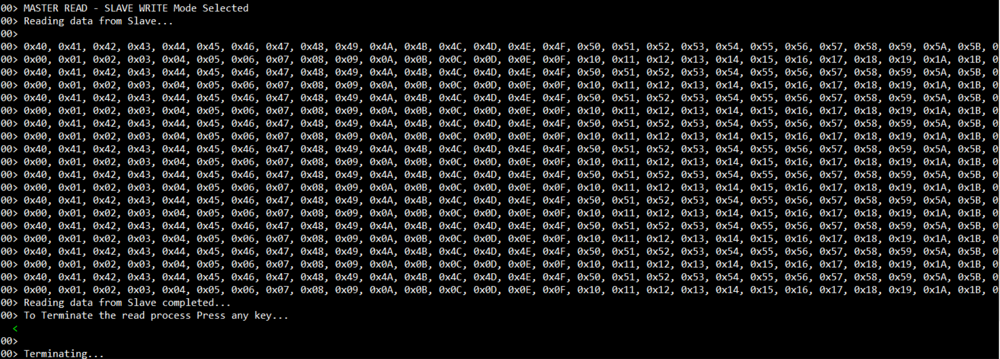
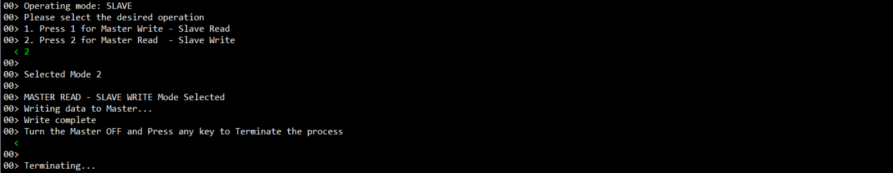

# Introduction #

This project demonstrates the basic functionalities of SSI driver and streaming example of SSI slave on Renesas RA MCUs based on Renesas FSP.The project configures two RA boards, the first board with one channel as the SSI master and the second board with one channel as the SSI slave.The EP is configured with two options, is displayed on both the SSI Master and the SSI Slave EPs.The selection of which can be done from the J-Link RTT Viewer.
1. Master Write - Slave Read
2. Slave Write - Master Read

On Selecting Master Write - Slave Read on both Master and Slave, the Master starts writing data, and the Slave reads the data. On Selecting Slave Write - Master Read on both Master and Slave, the Slave starts writing data, and the Master reads the data.The two example projects ssi_master_ek_ra6m3_ep and ssi_slave_ek_ra6m3_ep are provided for the the SSI Slave EP, one intended for Master and other for Slave.
 
Please refer to the [Example Project Usage Guide](https://github.com/renesas/ra-fsp-examples/blob/master/example_projects/Example%20Project%20Usage%20Guide.pdf) 
for general information on example projects and [readme.txt](./readme.txt) for specifics of operation.

## Required Resources ##
To build and run the SSI example project, the following resources are needed.

### Hardware ###
* 2x RA board 
* 2x Micro USB cable
* Host PC with at least 2 USB ports
* 5x Connecting/Jumper wires

Refer to [readme.txt](./readme.txt) for information on how to connect the hardware.

### Software ###
* Renesas Flexible Software Package (FSP): Version 6.1.0
* e2 studio: Version 2025-07
* SEGGER J-Link RTT Viewer: Version 8.58
* GCC ARM Embedded Toolchain: Version 13.2.1.arm-13-7

Refer to software requirements mentioned in [Example Project Usage Guide](https://github.com/renesas/ra-fsp-examples/blob/master/example_projects/Example%20Project%20Usage%20Guide.pdf)

## Related Collateral References ##
The following documents can be referred to for enhancing your understanding of 
the operation of this example project:
- [FSP User Manual on GitHub](https://renesas.github.io/fsp/)
- [FSP Known Issues](https://github.com/renesas/fsp/issues)

# Project Notes #

## System Level Block Diagram ##
High level block diagram

## FSP Modules Used ##
List of all the various modules that are used in this ssi_master_ek_ra6m3_ep example project. Refer to the FSP User Manual for further details on each module listed below.

| Module Name | Usage  | Searchable Keyword (using New Stack > Search) |
|-------------|-----------------------------------------------|-----------------------------------------------|
| SSI Master | SSI driver for Master | r_ssi |
| General PWM | Master configures General PWM for SSI Audio Clock | r_gpt |

## Module Configuration Notes ##
This section describes FSP Configurator properties that are important or different from those selected by default. 

**Common Configuration Properties for SSI Master**

|   Module Property Path and Identifier   |   Default Value   |   Used Value   |   Reason   |
| :-------------------------------------: | :---------------: | :------------: | :--------: |
|   configuration.xml > BSP > Property > Main Stack Size(bytes)  |  0   | 0x800  |  Change Stack size to accommodate functions usage in the EP and avoid any runtime errors |
|   configuration.xml > BSP > Property > Heap Size(bytes)  |  0   | 0x400  |  Change heap size to accommodate functions usage in the EP and avoid any runtime errors |
|   configuration.xml > g_i2s_master I2S(r_ssi) > Settings > Property > Common  >  DTC Support | Disabled | Enabled | Enable DTC support for the module |

**Configuration Properties for SSI Master**

|   Module Property Path and Identifier   |   Default Value   |   Used Value   |   Reason   |
| :-------------------------------------: | :---------------: | :------------: | :--------: |
| configuration.xml > g_i2s_master I2S(r_ssi) > Settings > Property > Module g_i2s_master I2S > channel| 0 | 0 | SSI Channel |
| configuration.xml > g_i2s_master I2S(r_ssi) > Settings > Property > Module g_i2s_master I2S > Operating Mode(Master/Slave)| Master Mode | Master Mode| SSI Master Configuration |
| configuration.xml > g_i2s_master I2S(r_ssi) > Settings > Property > Module g_i2s_master I2S > Bit Depth | 16 Bits | 32 bits| Bit Depth |
| configuration.xml > g_i2s_master I2S(r_ssi) > Settings > Property > Module g_i2s_master I2S > Word Length | 16 Bits| 32 bits | This property is used to specify Word Length |
| configuration.xml > g_i2s_master I2S(r_ssi) > Settings > Property > Module g_i2s_master I2S > WS Continue Mode | Disabled | Disabled | This property is used to enable/disable WS Continue Mode |
| configuration.xml > g_i2s_master I2S(r_ssi) > Settings > Property > Module g_i2s_master I2S > Bit Clock Source | External AUDIO_CLK| Internal AUDIO_CLK | This property is used to set Bit Clock Source |
| configuration.xml > g_i2s_master I2S(r_ssi) > Settings > Property > Module g_i2s_master I2S > Bit Clock Divider  | Audio Clock / 1| Audio Clock/64 | This property is used to set Bit clock Divider |
| configuration.xml > g_i2s_master I2S(r_ssi) > Settings > Property > Module g_i2s_master I2S > Callback | NULL | ssi_example_callback | Defined user callback for SSI events |
| configuration.xml > g_i2s_master I2S(r_ssi) > Settings > Property > Module g_i2s_master I2S > Transmit Interrupt Priority | Priority 0 | Priority 2| This property is used to set Transmit Interrupt Priority |
| configuration.xml > g_i2s_master I2S(r_ssi) > Settings > Property > Module g_i2s_master I2S > Receive Interrupt Priority  | Priority 0  | Priority 2 | This property is used to set Receive Interrupt Priority |
| configuration.xml > g_i2s_master I2S(r_ssi) > Settings > Property > Module g_i2s_master I2S > Idle/Error Interrupt Priority  | Priority 0  | Priority 2 | This property is used to set Idle/Error Interrupt Priority |

**For EK-RA4E2:**

|   Module Property Path and Identifier   |   Default Value   |   Used Value   |   Reason   |
| :-------------------------------------: | :---------------: | :------------: | :--------: |
| configuration.xml > g_i2s_master I2S(r_ssi) > Settings > Property > Module g_i2s_master I2S > Bit Clock Source | External AUDIO_CLK| External AUDIO_CLK | This property is used to set Bit Clock Source, not support Internal AUDIO_CLK by GPT. |

List of all the various modules that are used in this ssi_slave_ek_ra6m3_ep example project. Refer to the FSP User Manual for further details on each module listed below.

| Module Name | Usage  | Searchable Keyword (using New Stack > Search) |
|-------------|-----------------------------------------------|-----------------------------------------------|
| SSI Slave | SSI driver for Slave | r_ssi|

## Module Configuration Notes ##
This section describes FSP Configurator properties that are important or different from those selected by default. 

**Common Configuration Properties for SSI Slave**

|   Module Property Path and Identifier   |   Default Value   |   Used Value   |   Reason   |
| :-------------------------------------: | :---------------: | :------------: | :--------: |
|   configuration.xml > BSP > Property > Main Stack Size(bytes)  |  0   | 0x800  |  Change Stack size to accommodate functions usage in the EP and avoid any runtime errors |
|   configuration.xml > BSP > Property > Heap Size(bytes)  |  0   | 0x400  |  Change heap size to accommodate functions usage in the EP and avoid any runtime errors |
|   configuration.xml > g_i2s_slave I2S(r_ssi) > Settings > Property > Common  >  DTC Support | Disabled | Enabled | Enable DTC support for the module |

**Configuration Properties for SSI Slave**

|   Module Property Path and Identifier   |   Default Value   |   Used Value   |   Reason   |
| :-------------------------------------: | :---------------: | :------------: | :--------: |
| configuration.xml > g_i2s_slave I2S(r_ssi) > Settings > Property > Module g_i2s_slave I2S > channel| 0 | 0 | SSI Channel |
| configuration.xml > g_i2s_slave I2S(r_ssi) > Settings > Property > Module g_i2s_slave I2S > Operating Mode(Master/Slave)| Master Mode | Slave Mode| SSI Master Configuration |
| configuration.xml > g_i2s_slave I2S(r_ssi) > Settings > Property > Module g_i2s_slave I2S > Bit Depth | 16 Bits | 32 bits| Bit Depth |
| configuration.xml > g_i2s_slave I2S(r_ssi) > Settings > Property > Module g_i2s_slave I2S > Word Length | 16 Bits| 32 bits | This property is used to specify Word Length |
| configuration.xml > g_i2s_slave I2S(r_ssi) > Settings > Property > Module g_i2s_slave I2S > WS Continue Mode | Disabled | Disabled | This property is used to enable/disable WS Continue Mode |
| configuration.xml > g_i2s_slave I2S(r_ssi) > Settings > Property > Module g_i2s_slave I2S > Bit Clock Source | External AUDIO_CLK| External AUDIO_CLK | This property is used to set Bit Clock Source |
| configuration.xml > g_i2s_slave I2S(r_ssi) > Settings > Property > Module g_i2s_slave I2S > Bit Clock Divider  | Audio Clock / 1| Audio Clock/64 | This property is used to set Bit clock Divider |
| configuration.xml > g_i2s_slave I2S(r_ssi) > Settings > Property > Module g_i2s_slave I2S > Callback | NULL | ssi_example_callback | Defined user callback for SSI events |
| configuration.xml > g_i2s_slave I2S(r_ssi) > Settings > Property > Module g_i2s_slave I2S > Transmit Interrupt Priority | Priority 0 | Priority 2| This property is used to set Transmit Interrupt Priority |
| configuration.xml > g_i2s_slave I2S(r_ssi) > Settings > Property > Module g_i2s_slave I2S > Receive Interrupt Priority  | Priority 0  | Priority 2 | This property is used to set Receive Interrupt Priority |
| configuration.xml > g_i2s_slave I2S(r_ssi) > Settings > Property > Module g_i2s_slave I2S > Idle/Error Interrupt Priority  | Priority 0  | Priority 2 | This property is used to set Idle/Error Interrupt Priority |

## API Usage ##

The table below lists the SSI basic APIs used at the application layer by this example project.

| API Name    | Usage                                                                          |
|-------------|--------------------------------------------------------------------------------|
|R_SSI_Open| This API is used to open the SSI instance |
|R_SSI_Stop| This API is used to stop SSI |
|R_SSI_Write| This API is used to write data buffer to SSI |
|R_SSI_Read| This API is used to read data into provided buffer |
|R_SSI_Close| This API closes the SSI instance |
|R_GPT_Open| This API is used to initialize the General PWM configured as SSI Audio Clock |
|R_GPT_Start| This API is used to start SSI Audio Clock |
|R_GPT_Close| This API is used to stop the SSI Audio Clock |

## Verifying operation ##
* Import, Build and Debug the Example Projects for Master and Slave(see section Starting Development of **FSP User Manual**).
* Connect USB cables,and connecting wires as mentioned in the readme file [readme.txt](./readme.txt)
* Run the Example Projects on Master and Slave respectively and then open two instances of J-Link RTT Viewer to see the output status of the Example Projects for Master and Slave.
* Press "1", on both the EPs (master and slave sequentially).For the Master Write - Slave Read operation, after the transaction is completed,turn off the Slave first by pressing any key, and then for the Master press any key to terminate the process.
* Press "2", on both the EPs (master and slave sequentially).For the Master Read - Slave Write operation, after the transaction is completed,turn off the Master first by pressing any key, and then for the Slave press any key to terminate the process.
* The transaction/status messages will be displayed in J-Link RTT Viewer as depicted below:

	Master Write RTT Log
	
	
	Slave Read RTT Log
	
	
	Master Read RTT Log
	
	
	Slave Write RTT Log
	
		
### Special Topics 
#### Callback Handlers
1. **ssi_example_callback()** reloads FIFO's and handles errors.

#### SSI Master Clock Settings 
| Board       | SSI Master Clock Channel settings                                              |
|-------------|--------------------------------------------------------------------------------|
|EK_RA6M3     | 1                                                                              |
|EK-RA6M1     | 1                                                                              |
|EK-RA6M2     | 1                                                                              |
|EK-RA6M4     | 2                                                                              |
|EK-RA6M5     | 2                                                                              |
|EK-RA4M2     | 2                                                                              |
|EK-RA4M3     | 2                                                                              |
|EK-RA4E2     | 1                                                                              |
|EK-RA6E2     | 2                                                                              |
   

	

