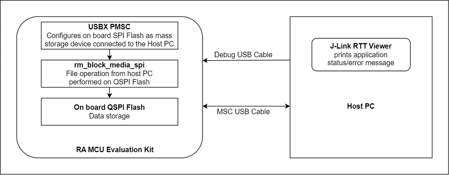
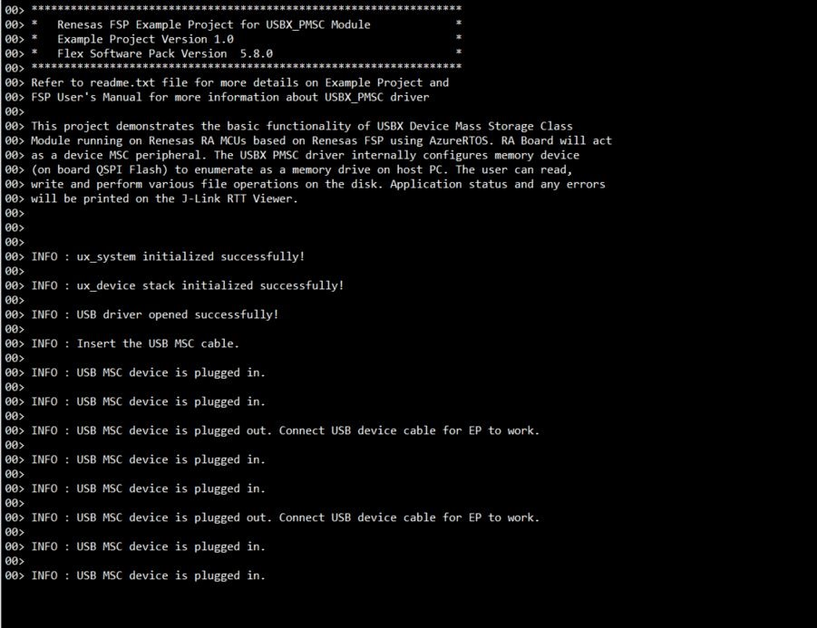
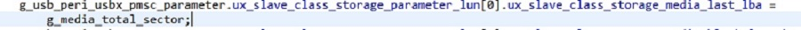

# Introduction #
This example project demonstrates basic functionalities of USBX Device Mass Storage Class module on Renesas RA MCUs based on Renesas FSP using Azure RTOS. RA Board will act as a device MSC peripheral. The USBX PMSC driver internally configures memory device (block media with sdmmc or block media SPI flash) to enumerate as a memory drive on host PC. The user can read, write and perform various file operations on the disk. The system initialization status and any errors occurred will be printed on the J-Link RTT Viewer.

For EK-RA4L1: Since this board does not support the SD/MMC Host Interface (SDHI), the PMSC driver internally configures memory device (on board QSPI Flash) to pop up as a memory drive on host PC.

Please refer to the [Example Project Usage Guide](https://github.com/renesas/ra-fsp-examples/blob/master/example_projects/Example%20Project%20Usage%20Guide.pdf) 
for general information on example projects and [readme.txt](./readme.txt) for specifics of operation.

## Required Resources ##
To build and run the USBX PMSC example project, the following resources are needed.

### Software ###
1. Refer to the software required section in [Example Project Usage Guide](https://github.com/renesas/ra-fsp-examples/blob/master/example_projects/Example%20Project%20Usage%20Guide.pdf)
2. Refer to [Special Topics](#special-topics) for more information of USBX pmsc setup.

### Hardware ###
* Supported RA boards: EK-RA4M2, EK-RA4M3, EK-RA6M1, EK-RA6M2, EK-RA6M3, EK-RA6M4, EK-RA6M5, EK-RA8D1, EK-RA8M1, MCK-RA8T1, EK-RA4L1
* For MCK-RA8T1, EK-RA4L1:
  * 1 x Renesas RA board.
  * 2 x Type-C USB cables.
  * 1 x PC running Windows 10.
  * 1 x Micro SD Card (For MCK-RA8T1).
* For other boards:
  * 1 x Renesas RA board.
  * 2 x Micro USB cables.
  * 1 x PC running Windows 10.
  * 1 x SD Card.
  * 1 x [PMOD](https://digilent.com/shop/pmod-sd-full-sized-sd-card-slot/) SD Full sized SD Card Slot.
  * 9 x Jumper wires.

Refer to [readme.txt](./readme.txt) for information on how to connect the hardware.

### Hardware Connections: ###
* USB connection settings:  
  The user needs to confirm the default USB speed selection used in the example project prior to set up the hardware connection.
  * For EK-RA4M2, EK-RA4M3, EK-RA6M1, EK-RA6M2, EK-RA6M3, EK-RA6M4, EK-RA6M5, EK-RA8M1, EK-RA8D1 (Full-Speed):
    1. Jumper J12 placement is pins 2-3.
    2. Connect Jumper j15 pins.
    3. Connect the micro USB end of the micro USB device cable to micro-AB USB Full Speed port (J11) of the board. Connect the other end of this cable to USB port of the host PC.
    4. Connect the micro USB end of the micro USB device cable to micro-AB USB (DEBUG USB) port (J10) of the respective board.

  * For MCK-RA8T1 (Full-Speed):
    1. Jumper JP9: Connect pins 2-3.
    2. Connect Jumper JP10 pins.
    3. Connect the Type-C USB end of the Type-C USB device cable to Type-C USB Full Speed port (CN14) of the board. Connect the other end of this cable to USB port of the host PC.
    4. Connect the Type-C USB end of the Type-C USB device cable to Type-C USB (DEBUG USB) port (CN11) of the respective board.

  * For EK-RA4L1 (Full-Speed):
    1. The user must turn ON S4-4 to select USB device mode.
    2. Set J17 jumper to pins 2-3, Set J7 jumper to use P407 for USBFS VBUS.
    3. Connect the RA board USB FS port (J11) to the PC via Type-C USB cable.
    4. Connect the RA board USB debug port (J10) to the PC via Type-C USB cable for EP debugging.

  * For EK-RA6M3 (High-Speed):
    1. Jumper J7: Connect pins 2-3.
    2. Connect Jumper J17 pins.
    3. Connect the micro USB end of the micro USB device cable to micro-AB USB High Speed port (J6) of the board. Connect the other end of this cable to USB port of the host PC.
    4. Connect the micro USB end of the micro USB device cable to micro-AB USB (DEBUG USB) port (J10) of the respective board.
 
  * For EK-RA6M5, EK-RA8M1 (High-Speed):
    1. Jumper J7: Connect pins 2-3.
    2. Connect Jumper J17 pins.
    3. Connect the micro USB end of the micro USB device cable to micro-AB USB High Speed port (J31) of the board. Connect the other end of this cable to USB port of the host PC.
    4. Connect the micro USB end of the micro USB device cable to micro-AB USB (DEBUG USB) port (J10) of the respective board.

  * For EK-RA8D1 (High-Speed):
    * Note: The user must turn-off SW1-6 to use USBHS.
    1. Jumper J7: Connect pins 2-3.
    2. Connect Jumper J17 pins.
    3. Connect the micro USB end of the micro USB device cable to micro-AB USB High Speed port (J31) of the board. Connect the other end of this cable to USB port of the host PC.
    4. Connect the micro USB end of the micro USB device cable to micro-AB USB (DEBUG USB) port (J10) of the respective board.

* SD Card connection settings:
  * For EK-RA6M3:
    * 1 Bit Width
      * P412(CMD)    --->    PMOD SD Pin2(MOSI)
      * P411(DAT0)   --->    PMOD SD Pin3(MISO)
      * P413(CLK)    --->    PMOD SD Pin4(SCLK)
      * GND          --->    PMOD SD Pin5(GND)
      * +3V3(VCC)    --->    PMOD SD Pin6(VCC)
      * P415(CD)     --->    PMOD SD Pin9(CD)
      * P414(WP)     --->    PMOD SD Pin10(WP)

    * 4 Bit Width
      * Above mentioned connections for 1 Bit Width. In addition below connections

      * P410(DAT1)   --->    PMOD SD Pin7(DAT1)
      * P206(DAT2)   --->    PMOD SD Pin8(DAT2)
      * P205(DAT3)   --->    PMOD SD Pin1(CS)
    * Link to Errata: https://www.renesas.com/us/en/document/mat/ek-ra6m3-v1-errata?language=en&r=1168086

  * For EK-RA6M1, EK-RA6M2:
    * 1 Bit Width
      * P412(CMD)    --->    PMOD SD Pin2(MOSI)
      * P411(DAT0)   --->    PMOD SD Pin3(MISO)
      * P413(CLK)    --->    PMOD SD Pin4(SCLK)
      * GND          --->    PMOD SD Pin5(GND)
      * +3V3(VCC)    --->    PMOD SD Pin6(VCC)
      * P210(CD)     --->    PMOD SD Pin9(CD)
      * P209(WP)     --->    PMOD SD Pin10(WP)

    * 4 Bit Width
      * Above mentioned connections for 1 Bit Width. In addition below connections

      * Trace cut Jumper E15 and solder to E12
      * P410(DAT1)   --->    PMOD SD Pin7(DAT1)
      * P206(DAT2)   --->    PMOD SD Pin8(DAT2)
      * P205(DAT3)   --->    PMOD SD Pin1(CS)

  * For EK-RA4M2, EK-RA4M3, EK-RA6M4, EK-RA6M5:
    * 1 Bit Width
      * P412(CMD)    --->    PMOD SD Pin2(MOSI)
      * P411(DAT0)   --->    PMOD SD Pin3(MISO)
      * P413(CLK)    --->    PMOD SD Pin4(SCLK)
      * GND          --->    PMOD SD Pin5(GND)
      * +3V3(VCC)    --->    PMOD SD Pin6(VCC)
      * P210(CD)     --->    PMOD SD Pin9(CD)
      * P209(WP)     --->    PMOD SD Pin10(WP)

    * 4 Bit Width
      * Above mentioned connections for 1 Bit Width. In addition below connections

      * P410(DAT1)   --->    PMOD SD Pin7(DAT1)
      * P206(DAT2)   --->    PMOD SD Pin8(DAT2)
      * P205(DAT3)   --->    PMOD SD Pin1(CS)

  * For EK-RA8M1:
    * 1 Bit Width
      * P811(CMD)    --->    PMOD SD Pin2(MOSI)
      * P812(DAT0)   --->    PMOD SD Pin3(MISO)
      * P810(CLK)    --->    PMOD SD Pin4(SCLK)
      * GND          --->    PMOD SD Pin5(GND)
      * +3V3(VCC)    --->    PMOD SD Pin6(VCC)
      * P503(CD)     --->    PMOD SD Pin9(CD)
      * P504(WP)     --->    PMOD SD Pin10(WP)

    * 4 Bit Width
      * Above mentioned connections for 1 Bit Width. In addition below connections

      * P500(DAT1)   --->    PMOD SD Pin7(DAT1)
      * P501(DAT2)   --->    PMOD SD Pin8(DAT2)
      * P502(DAT3)   --->    PMOD SD Pin1(CS)

  * For EK-RA8D1:
    * Note: The user must turn-off SW1-3, SW1-5, SW1-8 on board to use SDHI channel 1. Hardware connection for SDHI channel 1 as below:
    * 1 Bit Width
      * P401(CMD)    --->    PMOD SD Pin2(MOSI)
      * P402(DAT0)   --->    PMOD SD Pin3(MISO)
      * P400(CLK)    --->    PMOD SD Pin4(SCLK)
      * GND          --->    PMOD SD Pin5(GND)
      * +3V3(VCC)    --->    PMOD SD Pin6(VCC)
      * P406(CD)     --->    PMOD SD Pin9(CD)
      * P700(WP)     --->    PMOD SD Pin10(WP)

    * 4 Bit Width
      * Above mentioned connections for 1 Bit Width. In addition below connections

      * P403(DAT1)   --->    PMOD SD Pin7(DAT1)
      * P404(DAT2)   --->    PMOD SD Pin8(DAT2)
      * P405(DAT3)   --->    PMOD SD Pin1(CS)

  * For MCK-RA8T1:
    * Connect microSD Card to microSD Socket (CN12).

* QSPI connection settings:
  * For EK-RA4L1:
    * Connect jumper J15 pins.
    * E1 must be closed.

## Related Collateral References ##
The following documents can be referred to for enhancing your understanding of 
the operation of this example project:
- [FSP User Manual on GitHub](https://renesas.github.io/fsp/)
- [FSP Known Issues](https://github.com/renesas/fsp/issues)

# Project Notes #

## System Level Block Diagram ##

**For EK-RA4L1:**  

## FSP Modules Used ##
List all the various modules that are used in this example project. Refer to the FSP User Manual for further details on each module listed below.

| Module Name | Usage | Searchable Keyword  |
|-------------|-----------------------------------------------|-----------------------------------------------|
| USBX PMSC | This module provide a USBX Device Mass storage class support on RA device.| USBX PMSC |
| Block media on sdmmc | This module is internally configured by USBX PMSC driver to enumerate as a memory drive on host PC and the user can perform read, write operations on the drive. | sdmmc |
| USB Basic Driver | USB driver is required for hardware configuration on RA MCU. | r_usb_basic |
| DMAC Transfer | DMAC is used to transfer the usb data for faster process.  | r_dmac |

**For EK-RA4L1:**
| Module Name | Usage | Searchable Keyword  |
|-------------|-----------------------------------------------|-----------------------------------------------|
| USBX PMSC | This module provide a USBX Device Mass storage class support on RA device.| USBX PMSC |
| Block Media SPI Flash | This module is internally configured by USBX PMSC driver to enumerate as a memory drive on host PC and the user can perform read, write operations on the drive. | rm_block_media_spi |
| USB Basic Driver | USB driver is required for hardware configuration on RA MCU. | r_usb_basic |
| DMAC Transfer | DMAC is used to transfer the usb data for faster process.  | r_dmac |

## Module Configuration Notes ##
This section describes FSP Configurator properties which are important or different than those selected by default. 

**Common Configuration Properties**

|   Module Property Path and Identifier   |   Default Value   |   Used Value   |   Reason   |
| :-------------------------------------: | :---------------: | :------------: | :--------: |
| configuration.xml -> PMSC Thread -> Properties > Settings > Property > Common > Timer > Timer Ticks Per Second |100 | 1000 |The default ticks should be 1000 indicating 1 tick per millisecond. Follow FSP UM recommendations.|
| configuration.xml -> PMSC Thread -> Properties > Settings > Property > Thread > Priority| 1 | 21 |Use a lower priority level than the internal USBX thread priority. There is one internal thread:  ux_slave_storage thread (which is at priority 20). Follow FSP UM recommendations.|
| configuration.xml -> RTT Thread -> Properties > Settings > Property > Thread > Priority| 1 | 22 | RTT thread priority is lowered to allow the USBX PMSC data process at the fastest rate possible.|
| configuration.xml -> PMSC Thread -> g_basic0 USB (r_usb_basic) > Properties > Settings > Property > Common > DMA/DTC Support| DMA Disable | DMA Enable | DMA is used to offload CPU usage, to transfer the usb data for faster process.|
| configuration.xml -> PMSC Thread -> g_transfer0 Transfer Driver on r_dmac SDHIMMC0 DMA REQ (DMA transfer request) > Properties > Settings > Property > Transfer End Interrupt Priority| Disable | Priority 2 | Transfer End Interrupt Priority is enabled and set to priority 2 to trigger interrupt when transfer ends. |

**Configuration Properties for using USBHS**

|   Module Property Path and Identifier   |   Default Value   |   Used Value   |   Reason   |
| :-------------------------------------: | :---------------: | :------------: | :--------: |
| configuration.xml -> PMSC Thread -> g_basic0 USB (r_usb_basic) > Properties > Settings > Property > g_basic0 > USB Speed| Full-Speed | Hi-Speed | This property is used to configure USB speed. |
| configuration.xml -> PMSC Thread -> g_basic0 USB (r_usb_basic) > Properties > Settings > Property > Common > DMA/DTC Source Address| DMA Disabled | HS Address | USB basic driver is configured USB Speed as High Speed. Accordingly, DMA Source Address is provided with HS Address.|
| configuration.xml -> PMSC Thread -> g_basic0 USB (r_usb_basic) > Properties > Settings > Property > Common > DMA/DTC Destination Address| DMA Disabled | HS Address | USB basic driver is configured USB speed as High Speed (Default). Accordingly, DMA Destination Address is provided with HS Address. |
| configuration.xml -> PMSC Thread -> g_basic0 USB (r_usb_basic) > Properties > Settings > Property > g_basic0 > USB Module Number | USB_IP0_Port | USB_IP1_Port | This property is used to specify USB module number to be used as per configured USB speed. |
| configuration.xml -> PMSC Thread -> g_transfer0 Transfer (r_dmac) > Properties > Settings > Property > Module g_transfer0 Transfer (r_dmac) > Activation Source| No ELC Trigger | USBHS FIFO 1 (DMA/DTC Transfer request 1)  |This is an event trigger for DMA transfer 0 instance for destination pointer address.|
| configuration.xml -> PMSC Thread -> g_transfer1 Transfer (r_dmac) > Properties > Settings > Property > Module g_transfer1 Transfer (r_dmac) > Activation Source| No ELC Trigger | USBHS FIFO 0 (DMA/DTC Transfer request 0)  |This is an event trigger for DMA transfer 1 instance for source pointer address.|
| configuration.xml -> PMSC Thread -> g_transfer1 Transfer (r_dmac) > Properties > Settings > Property > Module g_transfer1 Transfer (r_dmac) > Transfer Size| 2 Bytes | 4 Bytes  | This is used to select DMAC transfer size. Follow FSP UM recommendations. |
| configuration.xml -> PMSC Thread -> g_transfer0 Transfer (r_dmac) > Properties > Settings > Property > Module g_transfer0 Transfer (r_dmac) > Transfer Size| 2 Bytes | 4 Bytes  |This is used to select DMAC transfer size. Follow FSP UM recommendations. |

**Configuration Properties for using USBFS**

|   Module Property Path and Identifier   |   Default Value   |   Used Value   |   Reason   |
| :-------------------------------------: | :---------------: | :------------: | :--------: |
| configuration.xml -> PMSC Thread -> g_basic0 USB (r_usb_basic) > Properties > Settings > Property > Common > DMA/DTC Source Address| DMA Disabled | FS Address | USB basic driver is configured USB Speed as Full Speed. Accordingly, DMA Source Address is provided with FS Address.|
| configuration.xml -> PMSC Thread -> g_basic0 USB (r_usb_basic) > Properties > Settings > Property > Common > DMA/DTC Destination Address| DMA Disabled | FS Address | USB basic driver is configured USB speed as Full Speed (Default). Accordingly, DMA Destination Address is provided with FS Address. |
| configuration.xml -> PMSC Thread -> g_transfer0 Transfer (r_dmac) > Properties > Settings > Property > Module g_transfer0 Transfer (r_dmac) > Activation Source| No ELC Trigger | USBFS FIFO 1 (DMA/DTC Transfer request 1)  |This is an event trigger for DMA transfer 0 instance for destination pointer address.|
| configuration.xml -> PMSC Thread -> g_transfer1 Transfer (r_dmac) > Properties > Settings > Property > Module g_transfer1 Transfer (r_dmac) > Activation Source| No ELC Trigger | USBFS FIFO 0 (DMA/DTC Transfer request 0)  |This is an event trigger for DMA transfer 1 instance for source pointer address.|

## API Usage ##
The table below lists the FSP provided API used at the application layer by this example project.

| API Name    | Usage                                                                          |
|-------------|--------------------------------------------------------------------------------|
|ux_system_initialize| This API is used to initialize the USBX system. |
|ux_device_stack_initialize| This API is used to initialize the USBX device stack.  |
|R_USB_Open|This API opens the USB basic driver.|

Refer to [Description of USBX Device Services](https://docs.microsoft.com/en-us/azure/rtos/usbx/usbx-device-stack-4) for more details of API used.

* Callback:  
  **usbx_status_callback()** is a user callback function which is registered as 9th argument of **ux_device_stack_initialize** API. 
  This callback is invoked by USBX to indicate to the application level about USB Attach and Removed events.

## Verifying operation ##
1. Import, generate and build the EP.
2. Now, flash USBX PMSC code on RA board.
3. Open J-Link RTT Viewer to see the output. 
4. The user can also copy the files to media manually.

Below images showcases the output on J-Link RTT Viewer:

Below image showcases the device enumeration in Device Manager:

## Special Topics ##
**For EK-RA4L1:** Before performing any file system operations, the user must format the USB drive using a Host PC with full permissions as below:

### Developing Descriptor ###
Refer **Descriptor** section of [Device Class (rm_usbx_port)](https://renesas.github.io/fsp/group___u_s_b_x.html) for developing  a descriptor.
We can take template file of required usb combination from mentioned path in above link and use the same in source folder by removing the **.template** file extension.

### Operations for changing the last LBA ###
* Last lba is getting set to media total sector in **usb_peri_usbx_pmsc_storage_init()** function in **rm_usbx_port.c** file as shown below.

* Media total sector is acquired from the **infoGet()** API during initialization in **usb_peri_usbx_pmsc_media_initialize()** function as shown below.

