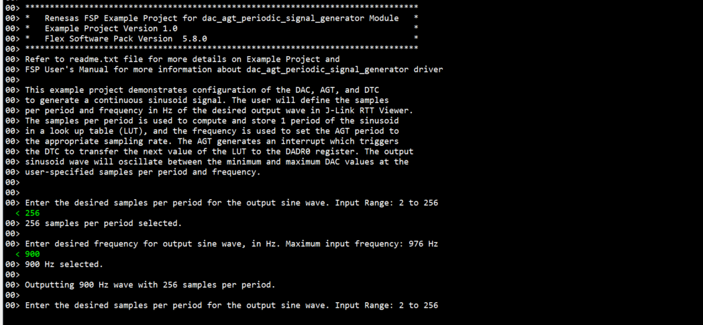

# Introduction #

The sample code accompanying this file shows the operation of the DAC, AGT, and DTC modules to generate a continuous sinusoid signal on a RA MCU. The user is prompted to set the output signal's samples per period and frequency in J-Link RTT Viewer.  The program first calculates one period of the the sinusoid signal stores it in a look up table.  Then, the samples per period and frequency are used to calculate and configure the counts per timer cycle of the AGT.  After the AGT module is started, every AGT cycle triggers the DTC to transfer the next value of the look up table to the DADR0 register and the corresponding voltage is output to the D/A output pin.  The desried output sinusoid wave will oscillate between the minimum and maximum DAC values at the user-specified samples per period and frequency.

For MCK-RA8T1: The AGT generates an interrupt which triggers the DTC to transfer the next value of the LUT to the DADR1 register.

Please refer to the [Example Project Usage Guide](https://github.com/renesas/ra-fsp-examples/blob/master/example_projects/Example%20Project%20Usage%20Guide.pdf) for general information on example projects and [readme.txt](./readme.txt) for specifics of the operation.

## Required Resources ##
To build and run the DAC AGT Periodic Signal Generator example project, the following resources are needed.

### Software ###
Refer to software requirements mentioned in [Example Project Usage Guide](https://github.com/renesas/ra-fsp-examples/blob/master/example_projects/Example%20Project%20Usage%20Guide.pdf)

### Hardware ###
* Supported RA boards: EK-RA2A1, EK-RA2L1, EK-RA4M2, EK-RA6M4, EK-RA4E2, EK-RA6E2, MCK-RA4T1, MCK-RA6T3, EK-RA8M1, EK-RA8D1, MCK-RA8T1, FPB-RA8E1, EK-RA4L1
* 1 x Renesas RA board.
* 1 x Type-C USB cable for programming and debugging.
* Optional hardware to view waveform: Oscilloscope and probes

### Hardware Connections ###
* Connect the USB Debug port on the RA board to the host PC via a Type-C USB cable.
* The following pin connections are required to capture the output signal from the DAC:
    * For EK-RA2L1, EK-RA4M2, EK-RA6M4, EK-RA4E2, EK-RA6E2, MCK-RA4T1, MCK-RA6T3, EK-RA8M1, EK-RA8D1:
	  * P014 is DA0 output.
    * For EK-RA2A1:
	  * P500 is DA12_0 output.
    * For MCK-RA8T1:
	  * P015 (CN1 Pin 13) is DA12_1 output.
    * For FPB-RA8E1:
	  * P014 (J1 Pin 34) is DA0 output.
	* For EK-RA4L1:
	  * P004 (J1 Pin 7) is DA0 output
## Related Collateral References ##
The following documents can be referred to for enhancing your understanding of the operation of this example project:
- [FSP User Manual on GitHub](https://renesas.github.io/fsp/)
- [FSP Known Issues](https://github.com/renesas/fsp/issues)

# Project Notes # 


## FSP Modules Used ##
List of all the various modules that are used in this example project. Refer to the FSP User's Manual for further details on each module listed below.

| Module Name | Usage  | Searchable Keyword (using New Stack > Search) |
|-------------|-----------------------------------------------|-----------------------------------------------|
| DAC | DAC is used to generate the output sinusoid signal. | DAC |
| AGT | AGT is used to trigger the DTC transfer. | AGT | 
| DTC | DTC is used to transfer values from the look up table to the DAC data register. | DTC |  

## Module Configuration Notes ##
This section describes FSP Configurator properties that are important or different from those selected by default. 

|   Module Property Path and Identifier   |   Default Value   |   Used Value   |   Reason   |
| :-------------------------------------: | :---------------: | :------------: | :--------: |
| configuration.xml -> g_timer0 Timer Driver on r_agt > Settings > Property > Module g_timer0 > Interrupts > Underflow Interrupt Priority | Disabled | Priority 1 | This configures the AGT to interrupt with priority 1 when the counter underflows. | 
| configuration.xml -> g_transfer0 Transfer on r_dtc > Settings > Property > Module g_transfer0 > Mode | Normal | Repeat | This configures the DTC transfer address to return to the start of the look up table after the number of data transfers reaches the specified repeat size. | 
| configuration.xml -> g_transfer0 Transfer on r_dtc > Settings > Property > Module g_transfer0 > Source Address Mode | Fixed | Incremented | This configures the DTC's source address to increment to the next value in the look up table after each transfer is completed. | 
configuration.xml -> g_transfer0 Transfer on r_dtc > Settings > Property > Module g_transfer0 > Activation Source | Disabled | AGT0 INT (AGT interrupt) | This configures the AGT interrupt to activate the DTC transfer, triggering the transfer of a value in the look up table to the DAC data register. | 


## API Usage ##

The table below lists the FSP provided API used at the application layer by this example project.

| API Name    | Usage                                                                          |
|-------------|--------------------------------------------------------------------------------|
| R_DAC_Open | This API initializes the DAC channel. |
| R_DAC_Start | This API starts the D/A conversion output. |
| R_AGT_Open | This API initializes the AGT module instance. |
| R_AGT_PeriodSet | This API updates the number of counts in the AGT period. |
| R_AGT_Start | This API starts the AGT timer. | 
| R_DTC_Open | This API initializes the DTC module and configures the DTC vector table.  | 
| R_DTC_Reconfigure | This API reconfigures the DTC data transfer destination, source, and length. | 
| R_DTC_Enable | This API enables transfers to be triggered by the activation source.  |
| R_FSP_SystemClockHzGet | This API gets the frequency of the clock operating the AGT counts.  | 

## Verifying operation ##
1. Import, Build and Debug the EP (see section Starting Development of **FSP User Manual**). 
Before running the example project, refer to the below steps for hardware connections :
	* Connect the USB Debug port on the RA board to the host PC via a Type-C USB cable. 
	* (Optional: to view waveform) Connect oscilloscope probes to the DAC output pin and GND pin. 
After running the EP, open J-Link RTT Viewer to set the desired specifications for the output wave.

The below image shows an example of operating the EP with J-Link RTT Viewer:




 
## Special Topics ##

### Generating Different Periodic Signals ### 
This program generates a continuous output signal by repeatedly iterating through one period of the sine function in a look up table. The user can generate additional periodic signals with this program by replacing the sine function with other periodic functions in the code section for calculating the look up table. 

**e.g. Triangle Wave:** 

To edit the program to generate a triangle wave, replace the code in the file *hal_entry.c* inside the function generate_lut() (lines 247-252) with the following code:

```c
        int duty_cycle = 50;
        int cutoff =  input_res *duty_cycle/100;
        uint16_t b = (uint16_t)(4095 +(4095/(input_res-cutoff))*cutoff);
        uint16_t m1 = (uint16_t)(4095/cutoff);
        uint16_t m2 = (uint16_t)(-4095/(input_res-cutoff));

        for(int i=0; i< cutoff; ++i )
        {
            sine_wave[i] = (uint16_t)(m1*i);
        }

        for(int i=cutoff; i<input_res; ++i)
        {
            sine_wave[i] = (uint16_t)(m2*i+b);
        }
```
