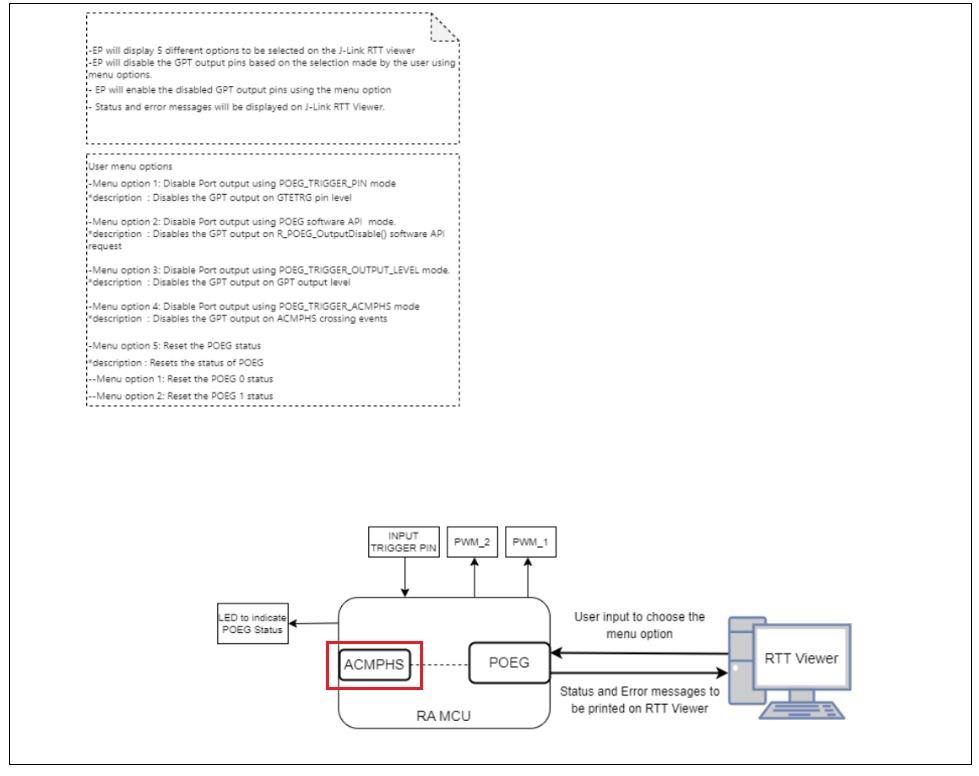
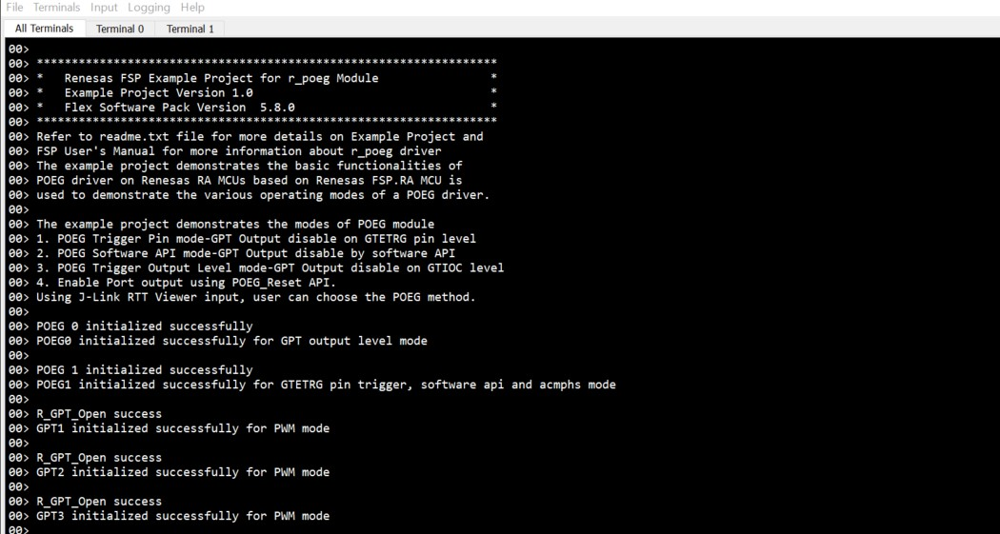
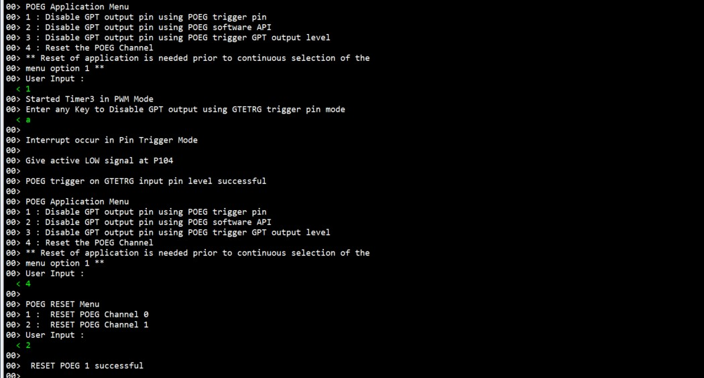
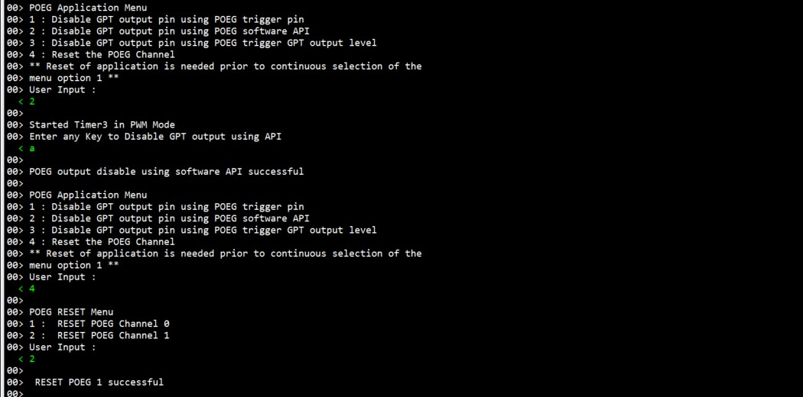
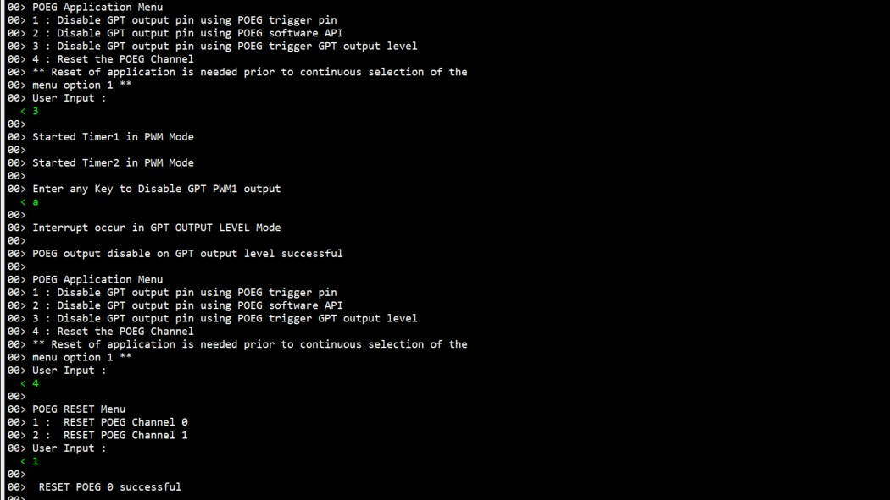
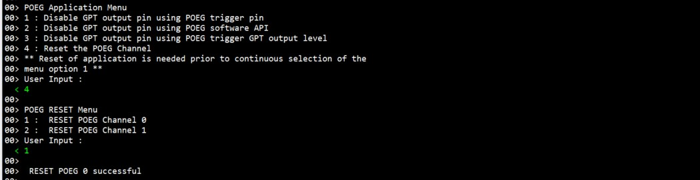
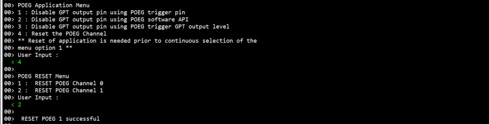
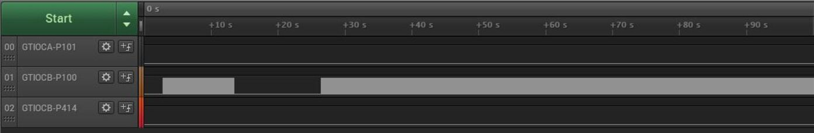

# Introduction #

This project demonstrates basic functionalities of Port Output Enable for GPT (POEG) module on Renesas RA MCUs based on Renesas FSP. Following is the sequence used by the application. The user input, error and info messages will be displayed on J-Link RTT Viewer. By default, POEG is enabled. The user can reference the Verifying Operation section to understand the recommended sequence of operations using these menus.

Menu option on the J-Link RTT Viewer is displayed as
1. Disable Port output using POEG_TRIGGER_PIN mode. 

2. Disable Port output using POEG R_POEG_OutputDisable() software API mode.

3. Disable Port output using POEG_TRIGGER_OUTPUT_LEVEL mode.

4. Disable Port output using POEG_TRIGGER_ACMPHS mode.

5. Enable Port output using POEG_Reset API.

The EP performs the GPT output disable functioning using the above mentioned options.
Verify the GPT operation using either a Logic analyzer or an LED output.

Note: 
1) Three different GPT's are used to demonstrate the Port Output Enable for GPT Example. PWM 1 and PWM 2 are used to demonstrate output disable on POEG_TRIGGER_OUTPUT_LEVEL mode.
PWM 3 is used to demonstrate output disable on POEG_TRIGGER_PIN mode, R_POEG_OutputDisable() software API mode and POEG_TRIGGER_ACMPHS mode respectively. 
2) **EK-RA4L1 board does not support using POEG trigger ACMPHS Mode.**

Please refer to the [Example Project Usage Guide](https://github.com/renesas/ra-fsp-examples/blob/master/example_projects/Example%20Project%20Usage%20Guide.pdf) 
for general information on example projects and [readme.txt](./readme.txt) for specifics of operation.

## Required Resources ##
To build and run the POEG example project, the following resources are needed.

### Software ###
* Renesas Flexible Software Package (FSP): Version 6.0.0
* e2 studio: Version 2025-04.1
* SEGGER J-Link RTT Viewer: Version 8.44a
* GCC ARM Embedded Toolchain: Version 13.2.1.arm-13-7

Refer to software requirements mentioned in [Example Project Usage Guide](https://github.com/renesas/ra-fsp-examples/blob/master/example_projects/Example%20Project%20Usage%20Guide.pdf)

### Hardware ###
Supported RA boards: EK-RA6M1, EK-RA6M2, EK-RA6M3, RSSK-RA6T1, MCK-RA4T1, MCK-RA6T2, MCK-RA6T3, EK-RA8D1, EK-RA8M1, MCK-RA8T1, FPB-RA8E1, EK-RA4L1
* 1 x Renesas RA board.
* 1 x Type-C USB cable for programming and debugging.
* 1 x Logic Analyzer (Optional).

Refer to [readme.txt](./readme.txt) for information on how to connect the hardware.

### Hardware Connections: ###
Connect the USB Debug port on the RA board to the host PC via a Type-C USB cable.
* For MCK-RA6T2:
  * Connect PA07 (CN4:11) --> PA00 (CN4:9)

* For FPB-RA8E1:
  * Connect DA0 - P014 (J1:P34) to IVCMP0_2 (AN000) - P004 (J1:P20)

## Related Collateral References ##
The following documents can be referred to for enhancing your understanding of 
the operation of this example project:
- [FSP User Manual on GitHub](https://renesas.github.io/fsp/)
- [FSP Known Issues](https://github.com/renesas/fsp/issues)

# Project Notes #

## System Level Block Diagram ##
 High level block diagram
 
 

For FPB-RA8E1: Internal Reference Voltage (Vref) is used as reference voltage source and AN000 is used as input voltage source for ACMPHS module, which is supplied by output of DAC0. Internal Reference Voltage value is set to 1.18V (Equivalent to a digital value 1465). The user can enter DAC0 value within permitted range to provide an analog signal input for AN000.

For EK-RA4L1: This board does not support ACMPHS.

## FSP Modules Used ##
List of all the various modules that are used in this project. Refer to the FSP User Manual for further details on each module listed below.

| Module Name | Usage  | Searchable Keyword (using New Stack > Search) |
|-------------|-----------------------------------------------|-----------------------------------------------|
| Port output enable for GPT  | Port output enable for GPT channel0.   | r_poeg |
| Port output enable for GPT  | Port output enable for GPT channel1.   | r_poeg |
| General PWM   | General PWM. | r_gpt |
| General PWM   | General PWM. | r_gpt |
| General PWM   | General PWM. | r_gpt |
| Comparator | Comparator High- Speed. | r_acmphs |
| DAC | DAC channel 0. | r_dac |
| DAC | DAC channel 1. | r_dac |

**For FPB-RA8E1:**
| Module Name | Usage  | Searchable Keyword (using New Stack > Search) |
|-------------|-----------------------------------------------|-----------------------------------------------|
| Port output enable for GPT  | Port output enable for GPT channel0.   | r_poeg |
| Port output enable for GPT  | Port output enable for GPT channel1.   | r_poeg |
| General PWM   | General PWM. | r_gpt |
| General PWM   | General PWM. | r_gpt |
| General PWM   | General PWM. | r_gpt |
| Comparator | Comparator High- Speed. | r_acmphs |
| DAC | DAC channel 0. | r_dac |

**For EK-RA4L1:**
| Module Name | Usage  | Searchable Keyword (using New Stack > Search) |
|-------------|-----------------------------------------------|-----------------------------------------------|
| Port output enable for GPT  | Port output enable for GPT channel0.   | r_poeg |
| Port output enable for GPT  | Port output enable for GPT channel1.   | r_poeg |
| General PWM   | General PWM. | r_gpt |
| General PWM   | General PWM. | r_gpt |
| General PWM   | General PWM. | r_gpt |

## Module Configuration Notes ##
This section describes FSP Configurator properties that are important or different from those selected by default. 

**Common Configuration Properties**

|   Module Property Path and Identifier   |   Default Value   |   Used Value   |   Reason   |
| :-------------------------------------: | :---------------: | :------------: | :--------: |
|   configuration.xml > BSP > Properties > Settings > Property > RA Common > Main Stack Size (bytes) |  0  | 0x400 | Change Stack size to accommodate functions usage in the EP and avoid any runtime errors. |
|   configuration.xml > BSP > Properties > Settings > Property > RA Common > Heap Size (bytes) |  0  | 0x400 | Change heap size to accommodate functions usage in the EP and avoid any runtime errors. |
|   configuration.xml > BSP > Properties > Settings > Property > RA Common > Parameter checking | Default (BSP) | Enabled | This property is used for parameter checking. | 

**Configuration Properties for POEG channel 0**

|   Module Property Path and Identifier   |   Default Value   |   Used Value   |   Reason   |
| :-------------------------------------: | :---------------: | :------------: | :--------: |
| configuration.xml > g_poeg0 Port Output Enable for GPT (r_poeg) > Properties > Settings > Property > Module g_poeg0 Port Output Enable for GPT (r_poeg) > General > Channel | 0 | 0 | POEG Channel. |
| configuration.xml > g_poeg0 Port Output Enable for GPT (r_poeg) > Properties > Settings > Property > Module g_poeg0 Port Output Enable for GPT (r_poeg) > General > Trigger > GPT Output Level |☐ | ☑ | POEG Trigger. |
| configuration.xml > g_poeg0 Port Output Enable for GPT (r_poeg) > Properties > Settings > Property > Module g_poeg0 Port Output Enable for GPT (r_poeg) > Input > GTETRG Polarity | Active High | Active Low| Select the polarity of the GTETRG pin. |
| configuration.xml > g_poeg0 Port Output Enable for GPT (r_poeg) > Properties > Settings > Property > Module g_poeg0 Port Output Enable for GPT (r_poeg) > Input > GTETRG Noise Filter | Disabled | PCLKB/32 | Configure the noise filter for the GTETRG pin. |
| configuration.xml > g_poeg0 Port Output Enable for GPT (r_poeg) > Properties > Settings > Property > Module g_poeg0 Port Output Enable for GPT (r_poeg) > Interrupts > Callback | NULL | channel0_user_callback | This property is used to specify  user callback function. |
| configuration.xml > g_poeg0 Port Output Enable for GPT (r_poeg) > Properties > Settings > Property > Module g_poeg0 Port Output Enable for GPT (r_poeg) > Interrupts > Interrupt Priority | Priority 0 | Priority 1  | This property is used to select the POEG interrupt priority. |

**Configuration Properties for POEG channel 1**

|   Module Property Path and Identifier   |   Default Value   |   Used Value   |   Reason   |
| :-------------------------------------: | :---------------: | :------------: | :--------: |
| configuration.xml > g_poeg1 Port Output Enable for GPT (r_poeg) > Properties > Settings > Property > Module g_poeg1 Port Output Enable for GPT (r_poeg) > General > Channel | 0 | 1 | POEG Channel. |
| configuration.xml > g_poeg0 Port Output Enable for GPT (r_poeg) > Properties > Settings > Property > Module g_poeg1 Port Output Enable for GPT (r_poeg) > General > Trigger > GTETRG Pin| ☐| ☑ | POEG Trigger. |
| configuration.xml > g_poeg1 Port Output Enable for GPT (r_poeg) > Properties > Settings > Property > Module g_poeg1 Port Output Enable for GPT (r_poeg) > Input > GTETRG Polarity | Active High | Active Low | Select the polarity of the GTETRG pin. |
| configuration.xml > g_poeg1 Port Output Enable for GPT (r_poeg) > Properties > Settings > Property > Module g_poeg1 Port Output Enable for GPT (r_poeg) > Input > GTETRG Noise Filter | Disabled | PCLKB/32 | Configure the noise filter for the GTETRG pin. |
| configuration.xml > g_poeg1 Port Output Enable for GPT (r_poeg) > Properties > Settings > Property > Module g_poeg1 Port Output Enable for GPT (r_poeg) > Interrupts > Callback | NULL | channel1_user_callback | This property is used to specify  user callback function. |
| configuration.xml > g_poeg1 Port Output Enable for GPT (r_poeg) > Properties > Settings > Property > Module g_poeg1 Port Output Enable for GPT (r_poeg) > Interrupts > Interrupt Priority | Priority 0 | Priority 1  | This property is used to select the POEG interrupt priority. |

**Configuration Properties for Timer, General PWM 1**

|   Module Property Path and Identifier   |   Default Value   |   Used Value   |   Reason   |
| :-------------------------------------: | :---------------: | :------------: | :--------: |
| configuration.xml > g_timer_pwm1 General PWM (r_gpt) > Properties > Settings > Property > Common > Pin Output Support | Disabled | Enabled with Extra features | Enables or disables support for outputting PWM waveforms on GTIOCx pins. |
| configuration.xml > g_timer_pwm1 General PWM (r_gpt) > Properties > Settings > Property > Module g_timer_pwm1 Timer, Genernal PWM (r_gpt) > General > Channel | 0 | 5| This property is used to channel of GPT. |
| configuration.xml > g_timer_pwm1 General PWM (r_gpt) > Properties > Settings > Property > Module g_timer_pwm1 Timer, Genernal PWM (r_gpt) > General > Mode | Periodic | Saw-wave PWM | This property is used to select the Mode selection. |
| configuration.xml > g_timer_pwm1 General PWM (r_gpt) > Properties > Settings > Property > Module g_timer_pwm1 Timer, Genernal PWM (r_gpt) > General > Period | 0x10000 | 1000  | This property is used to select  the timer period. |
| configuration.xml > g_timer_pwm1 General PWM (r_gpt) > Properties > Settings > Property > Module g_timer_pwm1 Timer, Genernal PWM (r_gpt) > Output > Duty Cycle Percent (only applicable in PWM mode) | 50 | 50 | This property is used to specify the timer duty cycle percent. Only used in PWM mode. |
| configuration.xml > g_timer_pwm1 General PWM (r_gpt) > Properties > Settings > Property > Module g_timer_pwm1 Timer, Genernal PWM (r_gpt) > Output > GTIOCA Output Enabled | False | False | This property is used to Enable the output of GTIOCA on a pin. |
| configuration.xml > g_timer_pwm1 General PWM (r_gpt) > Properties > Settings > Property > Module g_timer_pwm1 Timer, Genernal PWM (r_gpt) > Output > GTIOCB Output Enabled | False | True | This property is used to Enable the output of GTIOCB on a pin. |
| configuration.xml > g_timer_pwm1 General PWM (r_gpt) > Properties > Settings > Property > Module g_timer_pwm1 Timer, Genernal PWM (r_gpt) > Extra Features > Output Disable > POEG Link | POEG Channel 0| POEG Channel 0 | Select which POEG to link this GPT channel to. |
| configuration.xml > g_timer_pwm1 General PWM (r_gpt) > Properties > Settings > Property > Module g_timer_pwm1 Timer, Genernal PWM (r_gpt) > Extra Features > Output Disable > GTIOCA Disable Setting | Disable Prohibited | Disable Prohibited | Select the disable setting for GTIOCA. |
| configuration.xml > g_timer_pwm1 General PWM (r_gpt) > Properties > Settings > Property > Module g_timer_pwm1 Timer, Genernal PWM (r_gpt) > Extra Features > Output Disable > GTIOCB Disable Setting | Disable Prohibited |  Level low| Select the disable setting for GTIOCB. |
| configuration.xml > g_timer_pwm1 General PWM (r_gpt) > Properties > Settings > Property > Module g_timer_pwm1 Timer, Genernal PWM (r_gpt) > Extra Features > Extra Features | Disabled | Enabled | Select whether to enable extra features on this channel. |

**Configuration Properties for Timer, General PWM 2**

|   Module Property Path and Identifier   |   Default Value   |   Used Value   |   Reason   |
| :-------------------------------------: | :---------------: | :------------: | :--------: |
| configuration.xml > g_timer_pwm1 General PWM (r_gpt) > Properties > Settings > Property > Common > Pin Output Support | Disabled | Enabled with Extra features | Enables or disables support for outputting PWM waveforms on GTIOCx pins. |
| configuration.xml > g_timer_pwm1 General PWM (r_gpt) > Properties > Settings > Property > Module g_timer_pwm2 Timer, Genernal PWM (r_gpt) > General > Channel | 0 | 0| This property is used to channel of GPT. |
| configuration.xml > g_timer_pwm1 General PWM (r_gpt) > Properties > Settings > Property > Module g_timer_pwm2 Timer, Genernal PWM (r_gpt) > General > Mode | Periodic | Saw-wave PWM | This property is used to select the Mode selection. |
| configuration.xml > g_timer_pwm1 General PWM (r_gpt) > Properties > Settings > Property > Module g_timer_pwm2 Timer, Genernal PWM (r_gpt) > General > Period | 0x10000 | 1000  | This property is used to select  the timer period. |
| configuration.xml > g_timer_pwm1 General PWM (r_gpt) > Properties > Settings > Property > Module g_timer_pwm2 Timer, Genernal PWM (r_gpt) > Output > Duty Cycle Percent (only applicable in PWM mode) | 50 | 50 | This property is used to specify the timer duty cycle percent. Only used in PWM mode. |
| configuration.xml > g_timer_pwm1 General PWM (r_gpt) > Properties > Settings > Property > Module g_timer_pwm2 Timer, Genernal PWM (r_gpt) > Output > GTIOCA Output Enabled | False | True | This property is used to Enable the output of GTIOCA on a pin. |
| configuration.xml > g_timer_pwm1 General PWM (r_gpt) > Properties > Settings > Property > Module g_timer_pwm2 Timer, Genernal PWM (r_gpt) > Output > GTIOCB Output Enabled | False | True | Enable the output of GTIOCB on a pin. |
| configuration.xml > g_timer_pwm1 General PWM (r_gpt) > Properties > Settings > Property > Module g_timer_pwm2 Timer, Genernal PWM (r_gpt) > Extra Features > Output Disable > POEG Link | POEG Channel 0| POEG Channel 0 | Select which POEG to link this GPT channel to. |
| configuration.xml > g_timer_pwm1 General PWM (r_gpt) > Properties > Settings > Property > Module g_timer_pwm2 Timer, Genernal PWM (r_gpt) > Extra Features > Output Disable > GTIOCA Disable Setting | Disable Prohibited | Level low | Select the disable setting for GTIOCA. |
| configuration.xml > g_timer_pwm1 General PWM (r_gpt) > Properties > Settings > Property > Module g_timer_pwm2 Timer, Genernal PWM (r_gpt) > Extra Features > Output Disable > GTIOCB Disable Setting | Disable Prohibited | Disable Prohibited | Select the disable setting for GTIOCB. |
| configuration.xml > g_timer_pwm1 General PWM (r_gpt) > Properties > Settings > Property > Module g_timer_pwm2 Timer, Genernal PWM (r_gpt) > Extra Features > Extra Features | Disabled | Enabled | Select whether to enable extra features on this channel. |

**Configuration Properties for Timer, General PWM 3**

|   Module Property Path and Identifier   |   Default Value   |   Used Value   |   Reason   |
| :-------------------------------------: | :---------------: | :------------: | :--------: |
| configuration.xml > g_timer_pwm1 General PWM (r_gpt) > Properties > Settings > Property > Common > Pin Output Support | Disabled | Enabled with Extra features | Enables or disables support for outputting PWM waveforms on GTIOCx pins. |
| configuration.xml > g_timer_pwm1 General PWM (r_gpt) > Properties > Settings > Property > Module g_timer_pwm3 Timer, Genernal PWM (r_gpt) > General > Channel | 0 | 5| This property is used to channel of GPT. |
| configuration.xml > g_timer_pwm1 General PWM (r_gpt) > Properties > Settings > Property > Module g_timer_pwm3 Timer, Genernal PWM (r_gpt) > General > Mode | Periodic | Saw-wave PWM  | This property is used to select the Mode selection. |
| configuration.xml > g_timer_pwm1 General PWM (r_gpt) > Properties > Settings > Property > Module g_timer_pwm3 Timer, Genernal PWM (r_gpt) > General > Period | 0x10000 | 1000  | This property is used to select  the timer period. |
| configuration.xml > g_timer_pwm1 General PWM (r_gpt) > Properties > Settings > Property > Module g_timer_pwm3 Timer, Genernal PWM (r_gpt) > Output > Duty Cycle Percent (only applicable in PWM mode) | 50 | 50 | This property is used to specify the timer duty cycle percent. Only used in PWM mode. |
| configuration.xml > g_timer_pwm1 General PWM (r_gpt) > Properties > Settings > Property > Module g_timer_pwm3 Timer, Genernal PWM (r_gpt) > Output > GTIOCA Output Enabled | False | False | This property is used to Enable the output of GTIOCA on a pin. |
| configuration.xml > g_timer_pwm1 General PWM (r_gpt) > Properties > Settings > Property > Module g_timer_pwm3 Timer, Genernal PWM (r_gpt) > Output > GTIOCB Output Enabled | False | True | This property is used to Enable the output of GTIOCB on a pin. |
| configuration.xml > g_timer_pwm1 General PWM (r_gpt) > Properties > Settings > Property > Module g_timer_pwm3 Timer, Genernal PWM (r_gpt) > Extra Features > Output Disable > POEG Link | POEG Channel 1| POEG Channel 1 | Select which POEG to link this GPT channel to. |
| configuration.xml > g_timer_pwm1 General PWM (r_gpt) > Properties > Settings > Property > Module g_timer_pwm3 Timer, Genernal PWM (r_gpt) > Extra Features > Output Disable > GTIOCA Disable Setting | Disable Prohibited | Disable Prohibited | Select the disable setting for GTIOCA. |
| configuration.xml > g_timer_pwm1 General PWM (r_gpt) > Properties > Settings > Property > Module g_timer_pwm3 Timer, Genernal PWM (r_gpt) > Extra Features > Output Disable > GTIOCB Disable Setting | Disable Prohibited | Level low | Select the disable setting for GTIOCB. |
| configuration.xml > g_timer_pwm1 General PWM (r_gpt) > Properties > Settings > Property > Module g_timer_pwm3 Timer, Genernal PWM (r_gpt) > Extra Features > Extra Features | Disabled | Enabled | Select whether to enable extra features on this channel. |

## API Usage ##

The table below lists the POEG basic APIs used at the application layer by this example project.

| API Name    | Usage                                                                          |
|-------------|--------------------------------------------------------------------------------|
|R_POEG_Open | This API is used to open the POEG instance. |
|R_POEG_Reset | This API is used to reset POEG status. |
|R_POEG_OutputDisable | This API is used to disable GPT output pins. |
|R_GPT_Open | This API is used to open the GPT instance. |
|R_GPT_Start | This API is used to start the GPT. |

## Verifying operation ##
* Import, Build and Debug the example project.
* Connect the USB Debug port on the RA board to the host PC via a Type-C USB cable.
* Run the EP and then open J-Link RTT Viewer to see the output status.

**The EP information**

* Enter "1", for POEG Trigger on GTETRG Input pin level - This mode supports disabling GPT output pins based on GTETRG input pin level.
  Then reset the respective POEG status by entering Menu option "4".

* Enter "2", for POEG Output disable using Software API - This mode supports disabling GPT output pins by software API(R_POEG_OutputDisable).
  Then reset the respective POEG status by entering Menu option "4".
   
* Enter "3", for POEG Output disable on GPT output level - This mode supports disabling GPT output pins when GTIOC pins are the same level.
  Then reset the respective POEG status by entering Menu option "4".
  
* Enter "4", and then Enter "1" for POEG 0 reset.
* Enter "4", and then Enter "2" for POEG 1 reset.

* The status messages will be displayed in J-Link RTT Viewer as depicted below:

**POEG Output Disable On Input Pin Trigger J-Link RTT Viewer log**

	
**POEG Output Disable On Software API J-Link RTT Viewer log**

	
**POEG Output Disable On GPT Output Level J-Link RTT Viewer log**

	
**POEG POEG Reset Channel 0 J-Link RTT Viewer log**

**POEG POEG Reset Channel 1 J-Link RTT Viewer log**

### Callback Handlers
1. **channel0_user_callback()** disables the POEG0 interrupt to prevent it from firing continuously.
2. **channel1_user_callback()** disables the POEG1 interrupt to prevent it from firing continuously.

#### Special Topics ####
The table below lists the Supported Boards this example project.

| Boards	    | PIN Trigger	|GPT Output level|ACMPHS Mode    |
|---------------|---------------|----------------|---------------|
|  EK-RA6M1     |    Y          |       Y        |   Y           |
|  EK-RA6M2     |    Y          |       Y        |   Y           |
|  EK-RA6M3     |    Y          |       Y        |   Y           |
|  RSSK-RA6T1   |    Y          |       Y        |   Y           |
|  MCK-RA4T1    |    Y          |       Y        |   Y           |
|  MCK-RA6T2    |    Y          |       Y        |   Y           |
|  MCK-RA6T3    |    Y          |       Y        |   Y           |
|  EK-RA8D1     |    Y          |       Y        |   Y           |
|  EK-RA8M1     |    Y          |       Y        |   Y           |
|  MCK-RA8T1    |    Y          |       Y        |   Y           |
|  FPB-RA8E1    |    Y          |       Y        |   Y           |
|  EK-RA4L1     |    Y          |       Y        |   N           |

Below shows the Logic Analyzer Images for each POEG:

Below waveform shows the POEG output disable on input pin trigger:

**POEG output disable on input pin trigger waveform**

   
  
Below waveform shows the POEG output disable on software API:

**POEG output disable on software API waveform**
  
  
