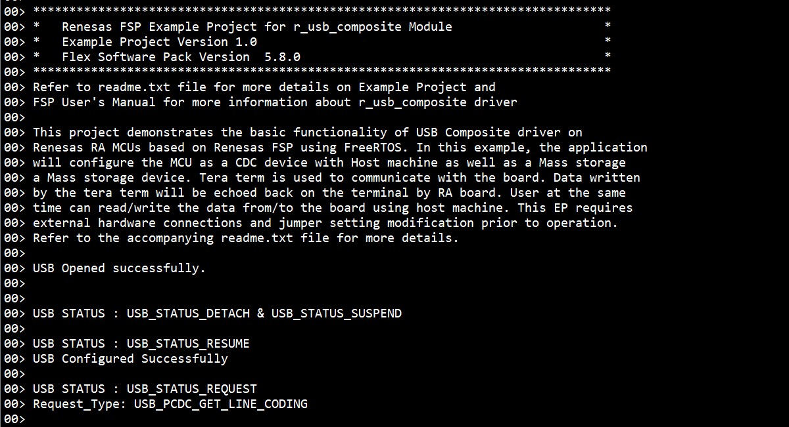

# Introduction #
The sample code accompanying with this file shows operation of a Composite Device using the USB FS peripheral on a RA MCU. 
USB Composite Class allows the device to enumerate as one or more USB device class. For e.g.: When connected to a PC, 
this sample code will show enumeration of a USB Mass Storage Device and a CDC Device. This allows the Host to simultaneously transfer communications data over the CDC, and perform file transfer using the Mass Storage Class.Such functionality is popular for applications that require a console interface to view status of the system, and ability to accept configuration information for modifying operating modes of the system.

Please refer to the [Example Project Usage Guide](https://github.com/renesas/ra-fsp-examples/blob/master/example_projects/Example%20Project%20Usage%20Guide.pdf) 
for general information on example projects and [readme.txt](./readme.txt) for specifics of operation.

## Required Resources ##
To build and run the usb composite example project, the following resources are needed.

### Hardware ###
* 1 x Renesas RA board.
* 2 x Type-C USB cables.
* 1 x Host PC with at least 2 USB ports (1 for debug and 1 for COM port).

### Hardware Connections ###
For EK-RA6M1, EK-RA6M2 (Full-Speed): 
*	Connect the micro USB end of the micro USB device cable to micro-AB USB Full-Speed port (J9) of the board. Connect the other end of this cable to USB port of the host PC.

For EK-RA4M2, EK-RA4M3, EK-RA6M4, EK-RA6M3, EK-RA6M3G, EK-RA6M5, RK-RA8M1, EK-RA8D1 (Full-Speed): 
* Jumper J12: Connect pins 2-3.
* Connect the jumper J15 pins. 
* Connect the micro USB end of the micro USB device cable to micro-AB USB Full-Speed port (J11) of the board. Connect the other end of this cable to USB port of the host PC. 

For MCK-RA8T1 (Full-Speed): 
* Jumper JP9: Connect pins 2-3.
* Connect the jumper JP10 pins.
* Connect the Type-C end of the Type-C USB device cable to Type-C USB Full-Speed port (CN14) of the board. Connect the other end of this cable to USB port of the host PC.

For EK-RA4L1 (Full-Speed):
* Turn ON S4-4 to select USB device mode.
* Set J17 jumper to pins 2-3, Set J7 jumper to use P407 for USBFS VBUS.
* Connect the Type-C end of the Type-C USB device cable to Type-C USB Full-Speed ort (J11) of the board. Connect the other end of this cable to USB port of the host PC.
	
For EK-RA6M3, EK-RA6M3G (High-Speed): 
* Jumper J7: Connect pins 2-3.
* Connect the jumper J17 pins.
* Connect the micro USB end of the micro USB device cable to micro-AB USB High-Speed port (J6) of the board. Connect the other end of this cable to USB port of the host PC. 
		
For EK-RA6M5, EK-RA8M1, EK-RA8D1 (High-Speed): 
* For EK-RA8D1, the user needs to turn OFF SW1-6 to use USB HS.
* Jumper J7: Connect pins 2-3.
* Connect the jumper J17 pins.
* Connect the micro USB end of the micro USB device cable to micro-AB USB High-Speed port (J31) of the board. Connect the other end of this cable to USB port of the host PC. 

### Software ###
Refer to software described in [Example Project Usage Guide](https://github.com/renesas/ra-fsp-examples/blob/master/example_projects/Example%20Project%20Usage%20Guide.pdf)

## Related Collateral References ##
The following documents can be referred to for enhancing your understanding of 
the operation of this example project:
- [FSP User Manual on GitHub](https://renesas.github.io/fsp/)
- [FSP Known Issues](https://github.com/renesas/fsp/issues)

# Project Notes #
## System Level Block Diagram ##

## FSP Modules Used ##
List all the various modules that are used in this example project. Refer to the FSP User Manual for further details on each module listed below.

| Module Name | Usage  | Searchable Keyword (using New Stack > Search) |
|-------------|-----------------------------------------------|-----------------------------------------------|
| USB composite |USB composite device works as a USB Peripheral by combining two peripheral device classes and r_usb_basic module. | USB composite |

## Module Configuration Notes ##
This section describes FSP Configurator properties which are important or different than those selected by default. 

|   Module Property Path and Identifier   |   Default Value   |   Used Value   |   Reason   |
| :-------------------------------------: | :---------------: | :------------: | :--------: |
|   configuration.xml -> Composite > Properties > Settings > Property > Thread > Stack Size (bytes) |   1024   |   2048   |   This is changed to handle its worst-case function call nesting and local variable usage.   |
|   configuration.xml -> Composite > Properties > Settings > Property > Common > Memory Allocation > Support Dynamic Allocation |   Disabled   |   Enabled   |   RTOS objects can be created using RAM that is automatically allocated from the FreeRTOS heap.   |
|   configuration.xml -> Composite > Properties > Settings > Property > Common > Memory Allocation > Total Heap Size  |   0   |   10000   |   This is changed because Dynamic Allocation support is enabled, so application makes use of amount of RAM available in the FreeRTOS heap.   |
|   configuration.xml -> Composite > g_basic USB (r_usb_basic) > Properties > Settings > Property > Common > DMA/DTC Support |   Disabled   | Enabled |   DMAC is used to handle the USB data transfer to offload MCU usage. |
|   configuration.xml -> Composite > g_basic USB (r_usb_basic) > Properties > Settings > Property > Module g_basic USB (r_usb_basic) > USB Callback  |   NULL   |   usb_composite_callback   |   As RTOS is used, so the callback function is set and this callback function will notify user about occurance of usb events.   |

### Configuration Properties for using USB Full-Speed: ###
By default, the EP runs in Full-Speed mode, except for EK-RA6M3, EK-RA6M3G and EK-RA8M1 boards.

|   Module Property Path and Identifier   |   Default Value   |   Used Value   |   Reason   |
| :-------------------------------------: | :---------------: | :------------: | :--------: |
| configuration.xml -> Composite -> g_basic USB (r_usb_basic) > Properties > Settings > Property > Common > DMA/DTC Source Address| DMA Disabled | FS Address | USB basic driver is configured USB Speed as Full Speed. Accordingly, DMA Source Address is provided with FS Address.|
| configuration.xml -> Composite -> g_basic USB (r_usb_basic) > Properties > Settings > Property > Common > DMA Destination Address| DMA Disabled | FS Address | USB basic driver is configured USB speed as Full Speed. Accordingly, DMA Destination Address is provided with FS Address. |
|   configuration.xml -> Composite > g_basic USB (r_usb_basic) > Properties > Settings > Property > Module g_basic USB (r_usb_basic) > USB Speed  |   Full Speed   |   Full Speed   |   USB Speed is configured as Full Speed.   |
|   configuration.xml -> Composite > g_basic USB (r_usb_basic) > Properties > Settings > Property > Module g_basic USB (r_usb_basic) > USB Module Number  |   USB_IP0 Port  |   USB_IP0 Port   |   This property is used to specify USB module number to be used as per configured USB speed.   |
| configuration.xml -> Composite -> g_transfer0 Transfer (r_dmac) > Properties > Settings > Property > Module g_transfer0 Transfer (r_dmac) > Transfer size| 2 Bytes | 2 Bytes  | The transfer size of DMA for Full Speed requires 2 Bytes. |
| configuration.xml -> Composite -> g_transfer0 Transfer (r_dmac) > Properties > Settings > Property > Module g_transfer0 Transfer (r_dmac) > Activation Source| No ELC Trigger | USBFS FIFO 0 (DMA/DTC Transfer request 0)  |This is an event trigger for DMA transfer 0 instance for destination pointer address.|
| configuration.xml -> Composite -> g_transfer1 Transfer (r_dmac) > Properties > Settings > Property > Module g_transfer1 Transfer (r_dmac) > Transfer size| 2 Bytes | 2 Bytes  | The transfer size of DMA for Full Speed requires 2 Bytes. |
| configuration.xml -> Composite -> g_transfer1 Transfer (r_dmac) > Properties > Settings > Property > Module g_transfer1 Transfer (r_dmac) > Activation Source| No ELC Trigger | USBFS FIFO 1 (DMA/DTC Transfer request 1)  |This is an event trigger for DMA transfer 1 instance for source pointer address.|

### Configuration Properties for using USB High-Speed: ###
|   Module Property Path and Identifier   |   Default Value   |   Used Value   |   Reason   |
| :-------------------------------------: | :---------------: | :------------: | :--------: |
| configuration.xml -> Composite -> g_basic USB (r_usb_basic) > Properties > Settings > Property > Common > DMA/DTC Source Address| DMA Disabled | HS Address | USB basic driver is configured USB Speed as High Speed. Accordingly, DMA Source Address is provided with HS Address.|
| configuration.xml -> Composite -> g_basic USB (r_usb_basic) > Properties > Settings > Property > Common > DMA/DTC Destination Address| DMA Disabled | HS Address | USB basic driver is configured USB speed as High Speed. Accordingly, DMA Destination Address is provided with HS Address. |
|   configuration.xml -> Composite > g_basic USB (r_usb_basic) > Properties > Settings > Property > Module g_basic USB (r_usb_basic) > USB Speed  |   Full Speed   |   Hi Speed   |   USB Speed is configured as High Speed.   |
|   configuration.xml -> Composite > g_basic USB (r_usb_basic) > Properties > Settings > Property > Module g_basic USB (r_usb_basic) > USB Module Number  |   USB_IP0 Port  |   USB_IP1 Port   |   This property is used to specify USB module number to be used as per configured USB speed.   |
| configuration.xml -> Composite -> g_transfer0 Transfer (r_dmac) > Properties > Settings > Property > Module g_transfer0 Transfer (r_dmac) > Transfer size| 2 Bytes | 4 Bytes  | The transfer size of DMA for High Speed requires 4 Bytes. |
| configuration.xml -> Composite -> g_transfer0 Transfer (r_dmac) > Properties > Settings > Property > Module g_transfer0 Transfer (r_dmac) > Activation Source| No ELC Trigger | USBHS FIFO 0 (DMA Transfer request 0)  |This is an event trigger for DMA transfer 0 instance for destination pointer address.|
| configuration.xml -> Composite -> g_transfer1 Transfer (r_dmac) > Properties > Settings > Property > Module g_transfer1 Transfer (r_dmac) > Transfer size| 2 Bytes | 4 Bytes  | The transfer size of DMA for High Speed requires 4 Bytes. |
| configuration.xml -> Composite -> g_transfer1 Transfer (r_dmac) > Properties > Settings > Property > Module g_transfer1 Transfer (r_dmac) > Activation Source| No ELC Trigger | USBHS FIFO 1 (DMA Transfer request 1)  |This is an event trigger for DMA transfer 1 instance for source pointer address.|

## API Usage ##
The table below lists the FSP provided API used at the application layer by this example project.

| API Name    | Usage                                                                          |
|-------------|--------------------------------------------------------------------------------|
|R_USB_Read | This API is used to Read data from tera term, when USB Write complete state event occur. |
|R_USB_Write| This API is used to Write back the read data from mcu to tera term, when USB READ complete state event occur.|
|R_USB_PeriControlDataGet| This API is used to get the class request, when USB class request type is USB_PCDC_SET_LINE_CODING .|
|R_USB_PeriControlDataSet| This API is used to set the class request, when USB class request type is USB_PCDC_GET_LINE_CODING .|
|R_USB_PeriControlStatusSet| This API is used to set the USB status as ACK response, when USB class request type is USB_PCDC_SET_CONTROL_LINE_STATE .|
|R_USB_Close| This API is used to close the opened USB instance, when any failure occur.|
|R_IOPORT_PinWrite| This API is used to toggle the LED pin state, when USB class request type is USB_PCDC_SET_CONTROL_LINE_STATE .| 

## Verifying operation ##
Import, Build and Debug the EP (*see section Starting Development* of **FSP User Manual**). After running the EP, open the J-Link RTT Viewer to see the output 
and connect to the Tera Term for writing and reading back the data. One can also copy the files to media manually.

Below images showcases the output on J-Link RTT Viewer:

Below images showcases the device enumeration in device manager:

## Special Topics ##
### Developing Descriptor ###
Refer **Descriptor** section of [usb_composite_descriptor](https://renesas.github.io/fsp/group___u_s_b___c_o_m_p_o_s_i_t_e.html) for developing  a descriptor.
We can take template file of required usb combination from mentioned path in above link and use the same in source folder by removing the .template file extension.

### Pipe Selection ###
* For Bulk In/Out transfers, USB Pipe 1 to USB Pipe 5 can be used for both usb_pcdc and usb_pmsc operations. The ability of a Pipe to support a USB transfer can be found in the MCU Group User's Manual: Hardware.         
    **Note :** XML configurator will throw an error when same pipes are selected for usb_pcdc and usb_pmsc. Hence it is recommended to select different pipes for usb_pcdc and usb_pmsc.
* For Interrupt, USB Pipe 6 to USB Pipe 9 can be used for usb_pcdc operation.