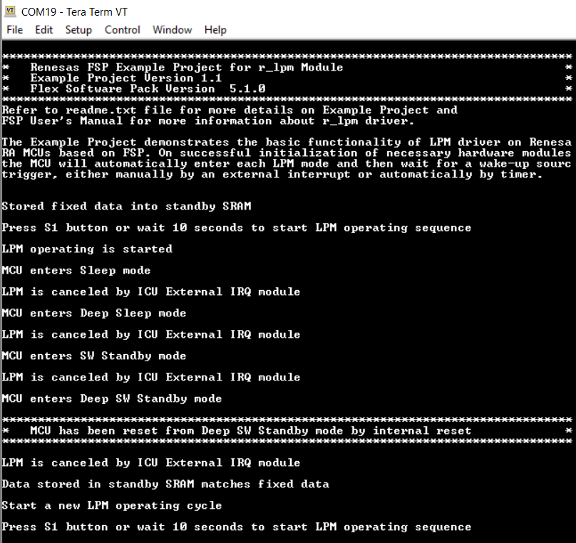

# Introduction #

This project demonstrates the basic functionalities of the Low Power Mode module (LPM) on Renesas RA MCUs using Renesas FSP.
The project also illustrates methods to reduce MCU power consumption and restore the pre-LPM states of peripheral modules.
The MCU will automatically enter each LPM mode and then wait for cancel sources to trigger manually by an external interrupt or automatically by a timer to exit LPM mode.
The EP log will print to the Host PC via the UART interface at a baud rate of 115200 bps.

Please refer to the [Example Project Usage Guide](https://github.com/renesas/ra-fsp-examples/blob/master/example_projects/Example%20Project%20Usage%20Guide.pdf) 
for general information on example projects and [readme.txt](./readme.txt) for specifics of operation.

## Required Resources ## 
To build and run the LPM example project, the following resources are needed.

### Hardware ###
* 1 x Renesas RA board
* 1 x Micro USB cable or 1 x Type C USB cable (For MCK-RA4T1 , MCK-RA6T2 , MCK-RA6T3) or 1 x Mini USB cable (For RSSK-RA6T1)
    * Additional 1 x Micro USB cable for boards have to use Pmod USBUART. 
* 1 x USB to UART Converter (eg. [PMOD USBUART](https://digilent.com/shop/pmod-usbuart-usb-to-uart-interface/)), if the RA Board does not support J-Link VCOM functionality.
    * RA Boards have to use Pmod USBUART: EK-RA2A1, EK-RA2E1, EK-RA2E2, EK-RA2L1, EK-RA4M1, EK-RA4M2, EK-RA4M3, EK-RA4W1, EK-RA6M1, EK-RA6M2, EK-RA6M3, EK-RA6M3G, EK-RA6M4, EK-RA6M5, FPB-RA4E1, FPB-RA6E1, MCK-RA6T2, RSSK-RA6T1.
    * Jumper JP1 placement is pins LCL-VCC
* 1 x Pmod BTN (Only MCK-RA4T1, MCK-RA6T3, RSSK-RA6T1 have to use)

Refer to [readme.txt](./readme.txt) for information on how to connect the hardware.

### Software ###
* Renesas Flexible Software Package (FSP): Version 6.3.0
* e2 studio: Version 2025-12
* GCC ARM Embedded Toolchain: Version 13.2.1.arm-13-7
* Terminal Console Application: Tera Term or a similar application

Refer to the software required section in [Example Project Usage Guide](https://github.com/renesas/ra-fsp-examples/blob/master/example_projects/Example%20Project%20Usage%20Guide.pdf)

## Related Collateral References ##
The following documents can be referred to for enhancing your understanding of 
the operation of this example project:
- [FSP User Manual on GitHub](https://renesas.github.io/fsp/)
- [FSP Known Issues](https://github.com/renesas/fsp/issues)

# Project Notes #

## System Level Block Diagram ##
High level block diagram of the system is as shown below:
 

## FSP Modules Used ##
List all the various modules that are used in this example project. Refer to the FSP User Manual for further details on each module listed below.

| Module Name | Usage | Searchable Keyword  |
|-------------|-----------------------------------------------|-----------------------------------------------|
| LPM | LPM is used to configure power cancellation, mode selection and return the MCU to low power mode to reduce power consumption | r_lpm |
| ULPT / AGT | ULPT/AGT is used to automatically cancel LPM modes; it is used as the request source and end source in snooze mode if the MCU supports this mode | r_ulpt / r_agt |
| External IRQ | External IRQ is used to manually cancel the LPM modes | r_icu |
| DTC | DTC is used to automatically cancel Snooze mode, only used on MCUs that support Snooze mode | r_dtc |
| SCI UART | SCI UART is used to print the log of the example project to the terminal application | r_sci_uart / r_sci_b_uart |

## Example Project Coverage ###
**Cancel/End sources selected for the MCU only support Sleep, SW Standby, and Snooze modes**
|   Board   |   Cancel Sleep mode  |   Cancel SW Standby mode   |   Cancel Snooze mode   |  Request / End Snooze mode   |
|-----------|----------------------|----------------------------|------------------------|------------------------------|
| EK-RA2A1 | IRQ6 AGT1_AGTI | IRQ6 AGT1_AGTI | IRQ6 DTC_COMPLETE | AGT1_AGTI |
| EK-RA2L1 | IRQ3 AGT1_AGTI | IRQ3 AGT1_AGTI | IRQ3 DTC_COMPLETE | AGT1_AGTI |
| EK-RA2E1 | IRQ3 AGT1_AGTI | IRQ3 AGT1_AGTI | IRQ3 DTC_COMPLETE | AGT1_AGTI |
| EK-RA2E2 | IRQ1 AGT1_AGTI | IRQ1 AGT1_AGTI | IRQ1 DTC_COMPLETE | AGT1_AGTI |
| EK-RA4M1 | IRQ0 AGT1_AGTI | IRQ0 AGT1_AGTI | IRQ0 DTC_COMPLETE | AGT1_AGTI |
| EK-RA4W1 | IRQ4 AGT1_AGTI | IRQ4 AGT1_AGTI | IRQ4 DTC_COMPLETE | AGT1_AGTI |
| FPB-RA2E3 | IRQ0 AGT1_AGTI | IRQ0 AGT1_AGTI | IRQ0 DTC_COMPLETE | AGT1_AGTI |

**Cancel/End sources selected for the MCU only support Sleep, SW Standby, Snooze mode, and Deep SW Standby modes**
|   Board   |   Cancel Sleep mode  |   Cancel SW Standby mode   |   Cancel Snooze mode   |  Request / End Snooze mode   |   Cancel Deep SW Standby mode   |
|-----------|----------------------|----------------------------|------------------------|------------------------------|---------------------------------|
| EK-RA4M2 | IRQ10-DS AGT1_AGTI | IRQ10-DS AGT1_AGTI | IRQ10-DS DTC_COMPLETE | AGT1_AGTI | IRQ10-DS AGT1_AGTI |
| EK-RA4M3 | IRQ10-DS AGT1_AGTI | IRQ10-DS AGT1_AGTI | IRQ10-DS DTC_COMPLETE | AGT1_AGTI | IRQ10-DS AGT1_AGTI |
| EK-RA6M1 | IRQ0-DS AGT1_AGTI | IRQ0-DS AGT1_AGTI | IRQ0-DS DTC_COMPLETE | AGT1_AGTI | IRQ0-DS AGT1_AGTI |
| EK-RA6M2 | IRQ0-DS AGT1_AGTI | IRQ0-DS AGT1_AGTI | IRQ0-DS DTC_COMPLETE | AGT1_AGTI | IRQ0-DS AGT1_AGTI |
| EK-RA6M3 | IRQ13-DS AGT1_AGTI | IRQ13-DS AGT1_AGTI | IRQ13-DS DTC_COMPLETE | AGT1_AGTI | IRQ13-DS AGT1_AGTI |
| EK-RA6M3G | IRQ13-DS AGT1_AGTI | IRQ13-DS AGT1_AGTI | IRQ13-DS DTC_COMPLETE | AGT1_AGTI | IRQ13-DS AGT1_AGTI |
| EK-RA6M4 | IRQ10-DS AGT1_AGTI | IRQ10-DS AGT1_AGTI | IRQ10-DS DTC_COMPLETE | AGT1_AGTI | IRQ10-DS AGT1_AGTI |
| EK-RA6M5 | IRQ10-DS AGT1_AGTI | IRQ10-DS AGT1_AGTI | IRQ10-DS DTC_COMPLETE | AGT1_AGTI | IRQ10-DS AGT1_AGTI |
| EK-RA4E2 | IRQ10-DS AGT1_AGTI | IRQ10-DS AGT1_AGTI | IRQ10-DS DTC_COMPLETE | AGT1_AGTI | IRQ10-DS AGT1_AGTI |
| EK-RA6E2 | IRQ10-DS AGT1_AGTI | IRQ10-DS AGT1_AGTI | IRQ10-DS DTC_COMPLETE | AGT1_AGTI | IRQ10-DS AGT1_AGTI |
| FPB-RA4E1 | IRQ1-DS AGT1_AGTI | IRQ1-DS AGT1_AGTI | IRQ1-DS DTC_COMPLETE | AGT1_AGTI | IRQ1-DS AGT1_AGTI |
| FPB-RA6E1 | IRQ1-DS AGT1_AGTI | IRQ1-DS AGT1_AGTI | IRQ1-DS DTC_COMPLETE | AGT1_AGTI | IRQ1-DS AGT1_AGTI |
| MCK-RA4T1 | IRQ14-DS AGT1_AGTI | IRQ14-DS AGT1_AGTI | IRQ14-DS DTC_COMPLETE | AGT1_AGTI | IRQ14-DS AGT1_AGTI |
| MCK-RA6T2 | IRQ12-DS AGT1_AGTI | IRQ12-DS AGT1_AGTI | IRQ12-DS DTC_COMPLETE | AGT1_AGTI | IRQ12-DS AGT1_AGTI |
| MCK-RA6T3 | IRQ14-DS AGT1_AGTI | IRQ14-DS AGT1_AGTI | IRQ14-DS DTC_COMPLETE | AGT1_AGTI | IRQ14-DS AGT1_AGTI |
| RSSK-RA6T1 | IRQ6-DS AGT1_AGTI | IRQ6-DS AGT1_AGTI | IRQ6-DS DTC_COMPLETE | AGT1_AGTI | IRQ6-DS AGT1_AGTI |

**Cancel/End sources selected for MCU only support Sleep, Deep Slep, SW Standby, and Deep SW Standby modes**
|   Mode   |   Cancel Sleep mode  |   Cancel Deep Sleep mode   |   Cancel SW Standby mode   |   Cancel Deep SW Standby mode   |
|----------|----------------------|----------------------------|----------------------------|---------------------------------|
| EK-RA8M1 | IRQ13-DS ULPT0_ULPTI | IRQ13-DS ULPT0_ULPTI | IRQ13-DS ULPT0_ULPTI | IRQ13-DS ULPT0_ULPTI |
| EK-RA8D1 | IRQ13-DS ULPT0_ULPTI | IRQ13-DS ULPT0_ULPTI | IRQ13-DS ULPT0_ULPTI | IRQ13-DS ULPT0_ULPTI |

## Module Configuration Notes ##
This section describes FSP Configurator properties which are important or different than those selected by default. 

**The tables below describes the configuration for the EK-RA8M1 board**

**Configuration Properties for Sleep mode LPM instance**
|   Module Property Path and Identifier   |   Default Value   |   Used Value   |   Reason   |
|-----------------------------------------|-------------------|----------------|------------|
| configuration.xml > g_lpm_sleep Low Power Modes (r_lpm) > Settings > Property > Module g_lpm_sleep Low Power Modes (r_lpm) > General > Low Power Mode | Sleep mode | Sleep mode | Select sleep mode for this LPM instance. |

**Configuration Properties for Deep Sleep mode LPM instance**
|   Module Property Path and Identifier   |   Default Value   |   Used Value   |   Reason   |
|-----------------------------------------|-------------------|----------------|------------|
| configuration.xml > g_lpm_deep_sleep Low Power Modes (r_lpm) > Settings > Property > Module g_lpm_deep_sleep Low Power Modes (r_lpm) > General > Low Power Mode | Sleep mode | Deep Sleep mode | Select deep sleep mode for this LPM instance. |
| configuration.xml > g_lpm_deep_sleep Low Power Modes (r_lpm) > Settings > Property > Module g_lpm_deep_sleep Low Power Modes (r_lpm) > Deep Sleep and Standby Options > Wake Sources > IRQ13 | ☐ | ☑ | Select IRQ13 interrupt as source to cancel deep sleep mode. |
| configuration.xml > g_lpm_deep_sleep Low Power Modes (r_lpm) > Settings > Property > Module g_lpm_deep_sleep Low Power Modes (r_lpm) > Deep Sleep and Standby Options > Wake Sources > ULPT0 Underflow Interrupt | ☐ | ☑ | Select ULPT0 Underflow Interrupt as the source to cancel deep sleep mode. |
| configuration.xml > g_lpm_deep_sleep Low Power Modes (r_lpm) > Settings > Property > Module g_lpm_deep_sleep Low Power Modes (r_lpm) > RAM Retention Control (Not available on every MCU) > TCM retention in Deep Sleep and Standby modes | Supply power to TCM | Supply power to TCM  | Retained TCM in deep sleep mode. |

**Configuration Properties for SW Standby mode LPM instance**
|   Module Property Path and Identifier   |   Default Value   |   Used Value   |   Reason   |
|-----------------------------------------|-------------------|----------------|------------|
| configuration.xml > g_lpm_sw_standby Low Power Modes (r_lpm) > Settings > Property > Module g_lpm_sw_standby Low Power Modes (r_lpm) > General > Low Power Mode | Sleep mode | Software Standby mode | Select Software Standby mode for this LPM instance. |
| configuration.xml > g_lpm_sw_standby Low Power Modes (r_lpm) > Settings > Property > Module g_lpm_sw_standby Low Power Modes (r_lpm) > General > Output port state in standby and deep standby | No change | No change | Retained state of the output pins after entering SW Standby mode. |
| configuration.xml > g_lpm_deep_sleep Low Power Modes (r_lpm) > Settings > Property > Module g_lpm_deep_sleep Low Power Modes (r_lpm) > Deep Sleep and Standby Options > Wake Sources > IRQ13 | ☐ | ☑ | Select IRQ13 interrupt as source to cancel SW Standby mode. |
| configuration.xml > g_lpm_deep_sleep Low Power Modes (r_lpm) > Settings > Property > Module g_lpm_deep_sleep Low Power Modes (r_lpm) > Deep Sleep and Standby Options > Wake Sources > ULPT0 Underflow Interrupt | ☐ | ☑ | Select ULPT0 Underflow Interrupt as the source to cancel SW Standby mode. |
| configuration.xml > g_lpm_sw_standby Low Power Modes (r_lpm) > Settings > Property > Module g_lpm_sw_standby Low Power Modes (r_lpm) > RAM Retention Control (Not available on every MCU) > RAM retention in Standby mode > Supply power to RAM Region 0 [0x22000000, 0x2201FFFF] | ☐ | ☑  | Retained this memory region in SW Standby mode. |
| configuration.xml > g_lpm_sw_standby Low Power Modes (r_lpm) > Settings > Property > Module g_lpm_sw_standby Low Power Modes (r_lpm) > RAM Retention Control (Not available on every MCU) > RAM retention in Standby mode > Supply power to RAM Region 1 [0x22020000, 0x2203FFFF] | ☐ | ☑  | Retained this memory region in SW Standby mode. |
| configuration.xml > g_lpm_sw_standby Low Power Modes (r_lpm) > Settings > Property > Module g_lpm_sw_standby Low Power Modes (r_lpm) > RAM Retention Control (Not available on every MCU) > RAM retention in Standby mode > Supply power to RAM Region 2 [0x22040000, 0x2205FFFF] | ☐ | ☑  | Retained this memory region in SW Standby mode. |
| configuration.xml > g_lpm_sw_standby Low Power Modes (r_lpm) > Settings > Property > Module g_lpm_sw_standby Low Power Modes (r_lpm) > RAM Retention Control (Not available on every MCU) > RAM retention in Standby mode > Supply power to RAM Region 3 [0x22060000, 0x2207FFFF] | ☐ | ☑  | Retained this memory region in SW Standby mode. |
| configuration.xml > g_lpm_sw_standby Low Power Modes (r_lpm) > Settings > Property > Module g_lpm_sw_standby Low Power Modes (r_lpm) > RAM Retention Control (Not available on every MCU) > RAM retention in Standby mode > Supply power to RAM Region 4 [0x22080000, 0x2209FFFF] | ☐ | ☑  | Retained this memory region in SW Standby mode. |
| configuration.xml > g_lpm_sw_standby Low Power Modes (r_lpm) > Settings > Property > Module g_lpm_sw_standby Low Power Modes (r_lpm) > RAM Retention Control (Not available on every MCU) > RAM retention in Standby mode > Supply power to RAM Region 5 [0x220A0000, 0x220BFFFF] | ☐ | ☑  | Retained this memory region in SW Standby mode. |
| configuration.xml > g_lpm_sw_standby Low Power Modes (r_lpm) > Settings > Property > Module g_lpm_sw_standby Low Power Modes (r_lpm) > RAM Retention Control (Not available on every MCU) > RAM retention in Standby mode > Supply power to RAM Region 6 [0x220C0000, 0x220DFFFF] | ☐ | ☑  | Retained this memory region in SW Standby mode. |
| configuration.xml > g_lpm_sw_standby Low Power Modes (r_lpm) > Settings > Property > Module g_lpm_sw_standby Low Power Modes (r_lpm) > RAM Retention Control (Not available on every MCU) > TCM retention in Deep Sleep and Standby modes | Supply power to TCM | Supply power to TCM  | Retained TCM in SW Standby mode. |
| configuration.xml > g_lpm_sw_standby Low Power Modes (r_lpm) > Settings > Property > Module g_lpm_sw_standby Low Power Modes (r_lpm) > RAM Retention Control (Not available on every MCU) > Standby RAM retention in Standby and Deep Standby modes | Supply power to Standby RAM | Supply power to Standby RAM  | Retained Standby RAM in SW Standby mode. |

**Configuration Properties for Deep SW Standby mode LPM instance**
|   Module Property Path and Identifier   |   Default Value   |   Used Value   |   Reason   |
|-----------------------------------------|-------------------|----------------|------------|
| configuration.xml > g_lpm_deep_sw_standby Low Power Modes (r_lpm) > Settings > Property > Module g_lpm_deep_sw_standby Low Power Modes (r_lpm) > General > Low Power Mode | Sleep mode | Deep Software Standby mode | Select Deep Standby mode for this LPM instance. |
| configuration.xml > g_lpm_deep_sw_standby Low Power Modes (r_lpm) > Settings > Property > Module g_lpm_deep_sw_standby Low Power Modes (r_lpm) > General > Output port state in standby and deep standby | No change | No change | Retained state of the output pins in Deep SW Standby mode. |
| configuration.xml > g_lpm_deep_sw_standby Low Power Modes (r_lpm) > Settings > Property > Module g_lpm_deep_sw_standby Low Power Modes (r_lpm) > RAM Retention Control (Not available on every MCU) > Standby RAM retention in Standby and Deep Standby modes | Supply power to Standby RAM | Supply power to Standby RAM  | Retained Standby RAM in Deep SW Standby mode. |
| configuration.xml > g_lpm_deep_sw_standby Low Power Modes (r_lpm) > Settings > Property > Module g_lpm_deep_sw_standby Low Power Modes (r_lpm) > Deep Standby Options > Cancel Sources > IRQ13 | ☐ | ☑ | Select IRQ13 interrupt as source to cancel Deep SW Standby mode. |
| configuration.xml > g_lpm_deep_sw_standby Low Power Modes (r_lpm) > Settings > Property > Module g_lpm_deep_sw_standby Low Power Modes (r_lpm) > Deep Standby Options > Cancel Sources > ULPT0 Underflow Interrupt | ☐ | ☑ | Select ULPT0 Underflow Interrupt as the source to cancel Deep SW Standby mode. |

**Configuration Properties for using SCI B UART**
|   Module Property Path and Identifier   |   Default Value   |   Used Value   |   Reason   |
|-----------------------------------------|-------------------|----------------|------------|
| configuration.xml > g_uart UART (r_sci_b_uart) > Settings > Property > Module g_uart UART (r_sci_b_uart) > General > Data Bits | 8bits | 8bits | Select the data bit length of 8 bits for a UART frame. |
| configuration.xml > g_uart UART (r_sci_b_uart) > Settings > Property > Module g_uart UART (r_sci_b_uart) > General > Parity | None | None | Do not use the parity check feature. |
| configuration.xml > g_uart UART (r_sci_b_uart) > Settings > Property > Module g_uart UART (r_sci_b_uart) > General > Stop Bits | 1bit | 1bit | Select the stop bit length of 1 bit for a UART frame. |
| configuration.xml > g_uart UART (r_sci_b_uart) > Settings > Property > Module g_uart UART (r_sci_b_uart) > Baud > Baud Rate | 115200 | 115200 | Select a baud rate of 115200 bits per second. |
| configuration.xml > g_uart UART (r_sci_b_uart) > Settings > Property > Module g_uart UART (r_sci_b_uart) > Interrupts > Callback | NULL | uart_callback | It is called from the interrupt service routine (ISR) upon SCI B UART transaction completion reporting the transaction status. |

**Configuration Properties for using ULPT**
|   Module Property Path and Identifier   |   Default Value   |   Used Value   |   Reason   |
|-----------------------------------------|-------------------|----------------|------------|
| configuration.xml > g_timer_cancel_lpm Timer, Ultra-Low-Power (r_ulpt) > Settings > Property > Module g_timer_cancel_lpm Timer, Ultra-Low-Power (r_ulpt) > General > Channel | 0 | 0 | Use ULPT Channel 0 to cancel LPM modes. |
| configuration.xml > g_timer_cancel_lpm Timer, Ultra-Low-Power (r_ulpt) > Settings > Property > Module g_timer_cancel_lpm Timer, Ultra-Low-Power (r_ulpt) > General > Mode | Periodic | Periodic | Configure the ULPT timer in periodic mode. |
| configuration.xml > g_timer_cancel_lpm Timer, Ultra-Low-Power (r_ulpt) > Settings > Property > Module g_timer_cancel_lpm Timer, Ultra-Low-Power (r_ulpt) > General > Period | 0x10000 | 10 | Set the periodic value for the ULPT timer. |
| configuration.xml > g_timer_cancel_lpm Timer, Ultra-Low-Power (r_ulpt) > Settings > Property > Module g_timer_cancel_lpm Timer, Ultra-Low-Power (r_ulpt) > General > Period Unit | Raw Counts | Seconds | Set the periodic for the ULPT timer to 10 seconds. |
| configuration.xml > g_timer_cancel_lpm Timer, Ultra-Low-Power (r_ulpt) > Settings > Property > Module g_timer_cancel_lpm Timer, Ultra-Low-Power (r_ulpt) > General > Count Source | LOCO | LOCO | Select LOCO as ULPT clock source to operate in LPM mode. |
| configuration.xml > g_timer_cancel_lpm Timer, Ultra-Low-Power (r_ulpt) > Settings > Property > Module g_timer_cancel_lpm Timer, Ultra-Low-Power (r_ulpt) > Interrupts > Callback | NULL | timer_cancel_lpm_callback | It is called from the interrupt service routine (ISR) each time the timer period elapses. |
| configuration.xml > g_timer_cancel_lpm Timer, Ultra-Low-Power (r_ulpt) > Settings > Property > Module g_timer_cancel_lpm Timer, Ultra-Low-Power (r_ulpt) > Interrupts > Underflow Interrupt Priority | Disabled | Priority 12 | Select ULPT interrupt priority. |

**Configuration Properties for using External IRQ**
|   Module Property Path and Identifier   |   Default Value   |   Used Value   |   Reason   |
|-----------------------------------------|-------------------|----------------|------------|
| configuration.xml > g_external_irq External IRQ (r_icu) > Settings > Property > Module g_external_irq External IRQ (r_icu) > Trigger | Rising | Falling | Detect button press using falling edge. |
| configuration.xml > g_external_irq External IRQ (r_icu) > Settings > Property > Module g_external_irq External IRQ (r_icu) > Digital Filtering | Disabled | Disabled | Do not use digital filtering in LPM modes. |
| configuration.xml > g_external_irq External IRQ (r_icu) > Settings > Property > Module g_external_irq External IRQ (r_icu) > Callback | NULL | external_irq_cancel_lpm_callback | It is called from the interrupt service routine (ISR) upon a falling edge is detected on the IRQ pin. |
| configuration.xml > g_external_irq External IRQ (r_icu) > Settings > Property > Module g_external_irq External IRQ (r_icu) > Pin Interrupt Priority | Priority 12 | Priority 12 | Select the External IRQ interrupt priority. |

## API Usage ##
The table below lists the FSP provided API used at the application layer by this example project.

For RA8 boards:

| API Name    | Usage                                                                          |
|-------------|--------------------------------------------------------------------------------|
| R_LPM_Open | This API is used to initialize the LPM module. |
| R_LPM_LowPowerModeEnter | This API is used to enter low power mode. |
| R_LPM_Close | This API is used to de-initialize the LPM module. |
| R_SCI_B_UART_Open | This API is used to initialize the SCI UART module. |
| R_SCI_B_UART_Write | This API is used to perform a write operation via the UART interface. |
| R_SCI_B_UART_Close | This API is used to de-initialize the SCI UART module. |
| R_ICU_ExternalIrqOpen | This API is used to initialize an IRQ input pin for use with the external interrupt interface. |
| R_ICU_ExternalIrqEnable | This API is used to enable external interrupts for a specified channel. |
| R_ICU_ExternalIrqDisable | This API is used to disable external interrupts for a specified channel. |
| R_ICU_ExternalIrqClose | This API is used to de-initialize the external interrupt channel. |
| R_ULPT_Open | This API is used to initialize the ULPT module. |
| R_ULPT_Start | This API is used to start the ULPT timer. |
| R_ULPT_Stop | This API is used to stop the ULPT timer. |
| R_ULPT_Reset | This API is used to reset the counter value of the ULPT timer. |
| R_ULPT_Close | This API is used to de-initialize the ULPT module. |
| R_BSP_SoftwareDelay | This API is used to delay a specified period of time. |

For other boards:

| API Name    | Usage                                                                          |
|-------------|--------------------------------------------------------------------------------|
| R_LPM_Open | This API is used to initialize the LPM module. |
| R_LPM_LowPowerModeEnter | This API is used to enter low power mode. |
| R_LPM_Close | This API is used to de-initialize the LPM module. |
| R_SCI_UART_Open | This API is used to initialize the SCI UART module. |
| R_SCI_UART_Write | This API is used to perform a write operation via the UART interface. |
| R_SCI_UART_Close | This API is used to de-initialize the SCI UART module. |
| R_ICU_ExternalIrqOpen | This API is used to initialize an IRQ input pin for use with the external interrupt interface. |
| R_ICU_ExternalIrqEnable | This API is used to enable external interrupts for a specified channel. |
| R_ICU_ExternalIrqDisable | This API is used to disable external interrupts for a specified channel. |
| R_ICU_ExternalIrqClose | This API is used to de-initialize the external interrupt channel. |
| R_AGT_Open | This API is used to initialize the AGT module. |
| R_AGT_Start | This API is used to start the AGT timer. |
| R_AGT_Stop | This API is used to stop the AGT timer. |
| R_AGT_Reset | This API is used to reset the counter value of the AGT timer. |
| R_AGT_Close | This API is used to de-initialize the AGT module. |
| R_DTC_Open | This API is used to initialize the AGT module. |
| R_DTC_Close | This API is used to de-initialize the AGT module. |
| R_DTC_Enable | This API is used to enable transfer on this activation source. |
| R_DTC_Disable | This API is used to disable transfer on this activation source. |
| R_BSP_SoftwareDelay | This API is used to delay a specified period of time. |

## Verifying operation ##
1. Download the example project to the RA board using the USB Debugport. J-Link may be disconnected when MCU enter LPM mode. Recommend to stop debugging after downloading EP.
2. Connect the PMOD USBUART module to the RA board according to the hardware connection instructions, and then connect the Pmod USBUART to the host PC via a micro-USB cable. Skip this step if RA board support J-Link VCOM functionality.
3. Open a terminal application on the host PC and connect to the COM Port provided by the J-Link onboard or Pmod USB UART.
4. Power-cycle the kits.
* Power-cycle the kit is required to avoid influence of debugging into cancel LPM mode. When the influence happens. The log "LPM is canceled, but source has not been detected" will be printed.
5. Press the user push-button S1 or wait 10 seconds to enter and cancel LPM mode. It will turn off LED1 before entering each LPM mode and turn on LED1 after exiting each LPM mode.
6. The LPM mode name will display on the terminal application before entering each LPM mode, and the canceling source name will display on the terminal application after exiting each LPM mode.

* The serial log when use push-button S1 to cancel/end lpm mode 

* The serial log when EP automation cancel/end lpm mode

