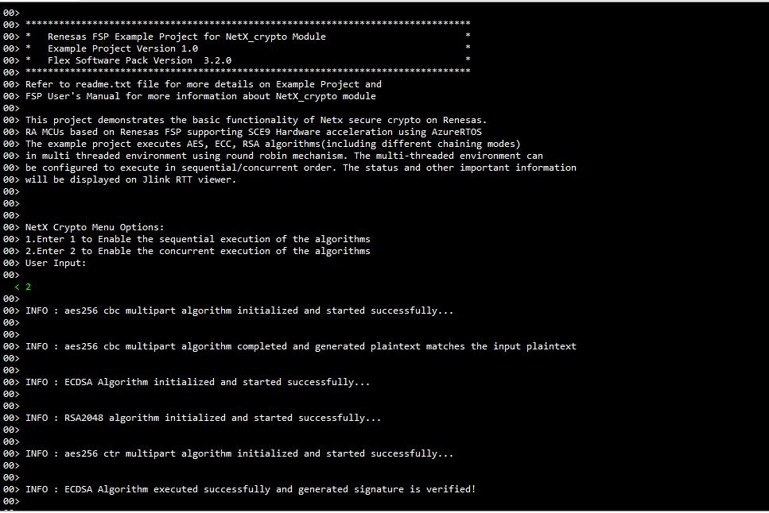

# Introduction #

This project demonstrates the basic functionality of Netx Crypto on Renesas RA MCUs based on SCE9 Hardware acceleration operating in an AzureRTOS environment. The example project executes ECC,RSA and AES algorithms(including different chaining modes) each in its own thread in multi threaded environment. 

From the RTT viewer, user can enter 1 to enable sequential execution of the different algorithms. The order of execution is AES -> ECC -> RSA Thread. In this mode, the example project uses ThreadX timer to keep track of the time used in each algorithm execution. Similarly, user can enter 2 to disable the sequential operation so the different application threads are executed in a round robin mechanism.  

The algorithms being executed, and the operational status will be displayed on Jlink RTT viewer.

Please refer to the [Example Project Usage Guide](https://github.com/renesas/ra-fsp-examples/blob/master/example_projects/Example%20Project%20Usage%20Guide.pdf) 
for general information on example projects and [readme.txt](./readme.txt) for specifics of operation.

## Required Resources ##
To build and run the NetX crypto example project, the following resources are needed.

### Hardware ###
* Renesas RA™ MCU kit
* 1x Micro USB cable
* A PC with at least 1 USB port for debug

Refer to [readme.txt](./readme.txt) for information on how to connect the hardware.

### Software ###
1. Refer to the software required section in [Example Project Usage Guide](https://github.com/renesas/ra-fsp-examples/blob/master/example_projects/Example%20Project%20Usage%20Guide.pdf)
2. Refer to [Special Topics](#special-topics) for more information of NetX crypto setup.

 
## Related Collateral References ##
The following documents can be referred to for enhancing your understanding of 
the operation of this example project:
- [FSP User Manual on GitHub](https://renesas.github.io/fsp/)
- [FSP Known Issues](https://github.com/renesas/fsp/issues)

# Project Notes #

## System Level Block Diagram ##
 High level block diagram
 
 

## FSP Modules Used ##
List all the various modules that are used in this example project. Refer to the FSP User Manual for further details on each module listed below.

| Module Name | Usage | Searchable Keyword  |
|-------------|-----------------------------------------------|-----------------------------------------------|
|NetX Crypto|NetX Crypto with hardware acceleration demonstrating the ECC, AES, RSA crypto algorithms on renesas mcus| rm_netx_crypto|
|Azure RTOS|Azure RTOS timer is used for algorithm execution time tracking ||
|[NIST CAVP test vectors](https://csrc.nist.gov/Projects/Cryptographic-Algorithm-Validation-Program )|NIST CAVP test vectors are used in the example project to demonstrate the cryptographic operation of the SCE9.||

## Module Configuration Notes ##
This section describes FSP Configurator properties which are important or different than those selected by default. 

**Common Configuration Properties**

|   Module Property Path and Identifier   |   Default Value   |   Used Value   |   Reason   |
| :-------------------------------------: | :---------------: | :------------: | :--------: |
| configuration.xml -> HAL/Common -> Properties > Settings > Property >Common > RSA > RSA 4096 Verify/Encryption (HW) |Disabled | Enabled |The default setting for RSA 4096 is disabled, should be enabled to verify the 4096 key size (Applies only for SCE9)|
| configuration.xml -> HAL/Common -> Properties > Settings > Property >Common > TRNG |Disabled | Enabled |The default setting for TRNG is disabled, should be enable to test the random key generation for aes method|
| configuration.xml -> ECC Thread -> Properties > Settings > Property >Common > Thread > Stack Size(bytes)| 1024| 8192 |Stack size of ecc thread should require minimum of 8KB to execute the algorithms|
| configuration.xml -> ECC Thread -> Properties > Settings > Property >Common > Thread> Time Slicing interval (ticks) |1 | 0xA |If example project runs on time slicing method then to execute each algorithm 10 time ticks should be required|
| configuration.xml -> AES Thread -> Properties > Settings > Property >Common > Thread > Stack Size(bytes)| 1024| 9216 |Stack size of aes thread should require minimum of 9KB to execute the algorithms|
| configuration.xml -> AES Thread -> Properties > Settings > Property >Common > Thread> Time Slicing interval (ticks) |1 | 0x80 |If example project runs on time slicing method then to execute each algorithm 128 time ticks should be required|
| configuration.xml -> AES Thread -> Properties > Settings > Property >Common > Thread > Stack Size(bytes)| 1024| 9216 |Stack size of aes thread should require minimum of 9KB to execute the algorithms|
| configuration.xml -> RSA Thread -> Properties > Settings > Property >Common > Thread> Time Slicing interval (ticks) |1 | 0x80 |If example project runs on time slicing method to execute each algorithm 128 time ticks should be required|
| configuration.xml -> RTT Thread -> Properties > Settings > Property >Common > Thread> Priority |1 | 2 |RTT thread priority is lowered to allow the USBX PCDC ACM data process at the fastest rate possible|

The table below lists the FSP provided API used at the application layer by this example project.

| API Name    | Usage                                                                          |
|-------------|--------------------------------------------------------------------------------|
|nx_crypto_initialize|This API is used to initialize the NetX crypto |
|_nx_crypto_method_aes_init|This API is used to initialize the NetX crypto aes method  |
|_nx_crypto_method_aes_operation|This API is used to do the encypt and decrypt operations in aes method|
|_nx_crypto_method_aes_cleanup|This API is used to cleanup the aes metadata|
|_nx_crypto_method_ecdh_init|This API is used to initialize the NetX crypto ecdh method|
|_nx_crypto_method_ecdh_operation |This API is used to perform the ecdh operations|
|_nx_crypto_method_ecdh_cleanup |This API is used to cleanup the ecdh metadata|
|_nx_crypto_method_ecdsa_init |This API is used to initialize the NetX crypto ecdsa method|
|_nx_crypto_method_ecdsa_operation |This API is used to perform the ecdsa operations|
|_nx_crypto_method_ecdsa_cleanup |This API is used to cleanup the ecdsa metadata|
|_nx_crypto_method_hmac_sha256_init |This API is used to initialize the NetX crypto hmac sha 256 method|
|_nx_crypto_method_hmac_sha256_operation |This API is used to perform encryption and decryption operation in hmac 256 method|
|_nx_crypto_method_hmac_sha256_cleanup |This API is used to cleanup the hmac sha 256 metadata|
|_nx_crypto_method_sha256_init |This API is used to initialize the Netx crypto sha256 method|
|_nx_crypto_method_sha256_operation |This API is used to encrypt and decrypt operations in sha256 method|
|_nx_crypto_method_sha256_cleanup |This API is used to cleanup the sha256 metadata|  

Note : The example project includes three threads exercising the above crypto APIs. AES, ECC and RSA threads operates the corresponding cryptographic APIs. Note that the SHA APIs are exercised in the RSA thread.

Refer to [Azure RTOS NetX Secure Crypto Hardware Acceleration](https://docs.microsoft.com/en-us/azure/rtos/netx/netx-crypto/chapter1) for more details of API used.

## Verifying operation ##

Import, Build and Debug the EP(see section Starting Development of FSP User Manual). After running the EP, open RTT viewer to see the output status of EP.  
* User needs to restart the example project to switch between option 1 and option 2

1. Below images showcase the output on **JLinkRTT_Viewer** when user input chooses for **sequential execution of the algorithms**:

	

	
	
	
 
2. Below images showcase the output on **JLinkRTT_Viewer** when user input chooses for **concurrent execution of the algorithms**:

	
	
	

