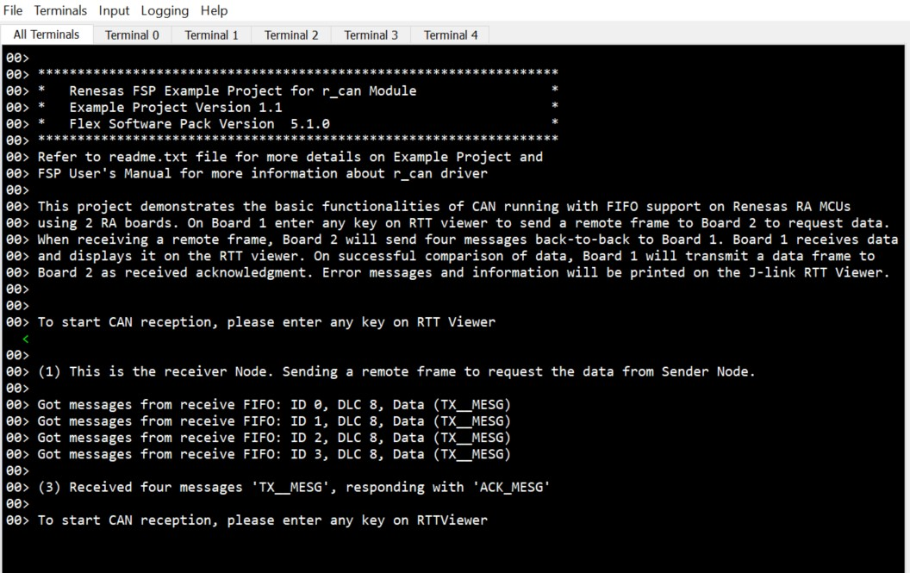
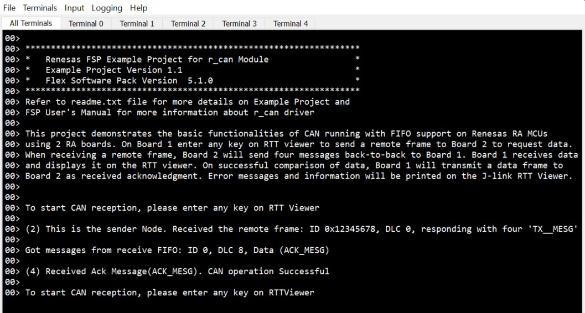

# Introduction #

This project demonstrates transmit and receive FIFO operations in the context of CAN (Controller Area Network) on Renesas RA MCUs
using 2 RA boards. On Board 1 enter any key on RTT viewer to send a remote frame to Board 2 to request data.
When receiving a remote frame, Board 2 will send four messages back-to-back to Board 1. Board 1 receives data
and displays it on the RTT viewer. On successful comparison of data, Board 1 will transmit a data frame to 
Board 2 as received acknowledgment. Error messages and information will be printed on the J-link RTT Viewer.

**Note**: In this example project, the same code runs on both boards.

Please refer to the [Example Project Usage Guide](https://github.com/renesas/ra-fsp-examples/blob/master/example_projects/Example%20Project%20Usage%20Guide.pdf) 
for general information on example projects and [readme.txt](./readme.txt) for specifics of operation.

## Required Resources ##
To build and run the can fifo example project, the following resources are needed.

### Hardware ###
* 2 x Renesas RA™ MCU kits
* 2 x Micro USB cable
* 2 x CAN transceiver boards (SN65HVD230 CAN Board)
* 10 x Connection wires : 8-Both sided Female, 2-Both sided Male.

Refer to [readme.txt](./readme.txt) on information on how to connect the hardware.

### Software ###
Refer to software requirements mentioned in [Example Project Usage Guide](https://github.com/renesas/ra-fsp-examples/blob/master/example_projects/Example%20Project%20Usage%20Guide.pdf)

## Related Collateral References ##
The following documents can be referred to for enhancing your understanding of 
the operation of this example project:
- [FSP User Manual on GitHub](https://renesas.github.io/fsp/)
- [FSP Known Issues](https://github.com/renesas/fsp/issues)

# Project Notes #

## System Level Block Diagram ##

## FSP Modules Used ##
List all the various modules that are used in this example project. Refer to the FSP User Manual for further details on each module listed below.

| Module Name | Usage  | Searchable Keyword|
|-------------|-----------------------------------------------|-----------------------------------------------|
| CAN | CAN module is used to receive and transmit data between slave and master. | r_can |

## Module Configuration Notes ##
This section describes FSP Configurator properties which are important or different than those selected by default. 
|   Module Property Path and Identifier   |   Default Value   |   Used Value   |   Reason   |
| :-------------------------------------: | :---------------: | :------------: | :--------: |
|   configuration.xml -> Stacks -> g_can CAN (r_can) > Settings > Property > Common > FIFO Support |   Disable   |   Enable   |  Select FIFO mode  |
|   configuration.xml -> Stacks -> g_can CAN (r_can) > Settings > Property > Module g_can CAN (r_can) > General > Global ID Mode |   Standard ID Mode   |   Mixed ID Mode   | The driver will use both standard ID mode and extended ID mode  |
|   configuration.xml -> Stacks -> g_can CAN (r_can) > Settings > Property > Module g_can CAN (r_can) > Input > Receive FIFO  > Receive ID 1 > Frame Type |  Remote Mailbox   |   Data Mailbox   | The receive FIFO 1 is used to capture data frames  |
|   configuration.xml -> Stacks -> g_can CAN (r_can) > Settings > Property > Module g_can CAN (r_can) > Input > Receive FIFO  > Receive ID 1 > Mask |  0x1FFFFFFF   |   0x7FC   | Set this to receive four standard data frames with IDs 0, 1, 2 and 3  |
|   configuration.xml -> Stacks -> g_can CAN (r_can) > Settings > Property > Module g_can CAN (r_can) > Input > Receive FIFO  > Receive ID 2 > ID |  0   |   0x12345678   | This is a sample ID for extended ID mode (29-bit)  |
|   configuration.xml -> Stacks -> g_can CAN (r_can) > Settings > Property > Module g_can CAN (r_can) > Input > Receive FIFO  > Receive ID 2 > ID mode |  Standard ID   |   Extended ID   | The receive FIFO 2 is used to receive Extended ID messages  |
|   configuration.xml -> Stacks -> g_can CAN (r_can) > Settings > Property > Module g_can CAN (r_can) > Interrupt > Transmit FIFO Interrupt Mode  |  Every Message   |   Empty    | Get an event when transmit FIFO is empty  |

 

## API Usage ##

The table below lists the CAN API used at the application layer by this example project.

| API Name    | Usage                                                                          |
|-------------|--------------------------------------------------------------------------------|
|R_CAN_Open| This API is used to initialize CAN module. |
|R_CAN_Write| This API is used to Write data to the CAN channel. |
|R_CAN_Close| This API is used to un-initialize CAN module. |

## Verifying operation ##
Import, Build and Debug the EP(see section Starting Development of [FSP User Manual](https://renesas.github.io/fsp/_s_t_a_r_t__d_e_v.html)) in both boards. After running the EP, open the RTT viewer to view status or check error messages.

Below images showcase the output on J-Link RTT Viewer :

Board 1 RTT log:

Board 2 RTT log:

## Special Topics ##
Transmit and Receive FIFOs (First In, First Out) are important components that contribute to the efficient and reliable communication between nodes in a CAN network.
* Transmit FIFOs in CAN controllers allow the buffering of outgoing messages.
* Receive FIFOs store incoming messages until the microcontroller is ready to process them.

When FIFO Support is enabled, mailboxes 24-27 form a 4-stage transmit FIFO and mailboxes 28-31 form a 4-stage receive FIFO.
The receive FIFO supports two independent ID/mask settings for acceptance filtering.