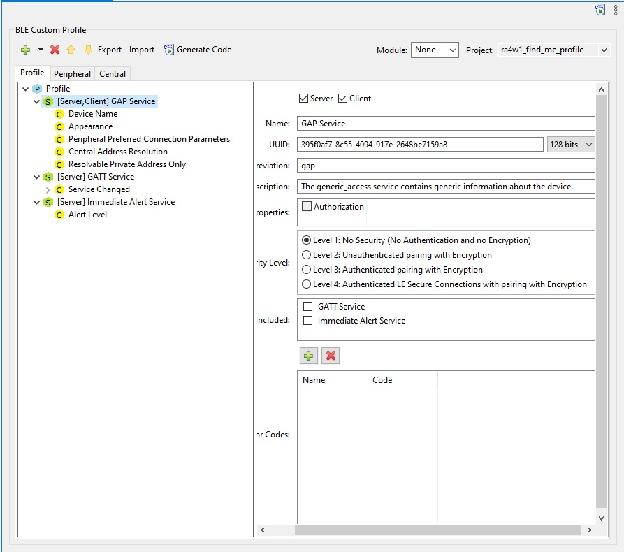
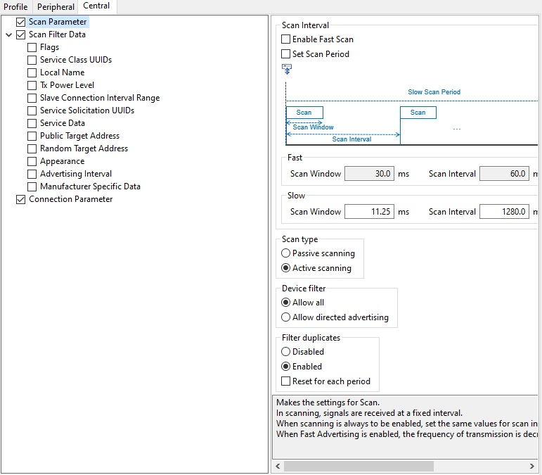
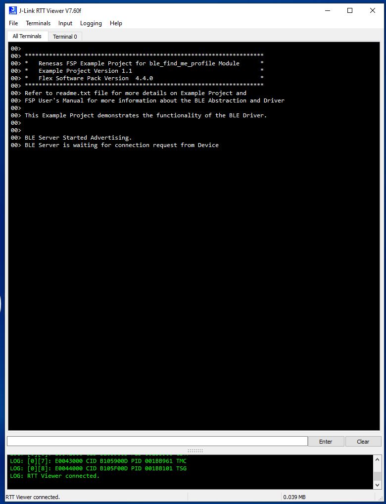
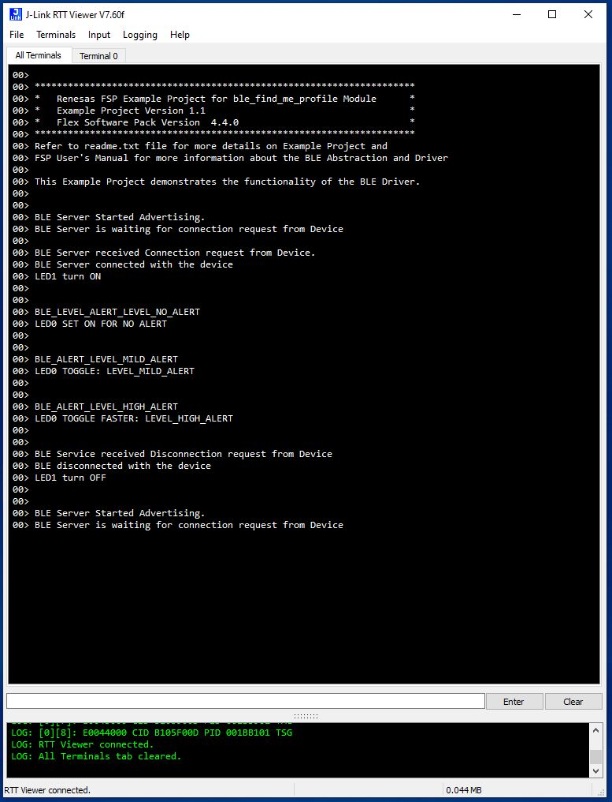

# Introduction #

This project demonstrates the basic functionality of an RA4 MCU operating as a BLE Server board establish connection with Renesas browser installed on the device client. 
An RA MCU using freeRTOS and the Renesas FSP was used to create this example project. This EP "find me profile" is configured to establish the connection with the Renesas GATTBrowser 
installed on the client device. Led 1 on the server board will provide visual feedback to indicate once the client has established connection or when a disconnection occurs. LED1 is 
turned on when the connection is established. It will turn off if the client is disconnected. The user can send alert levels, connect requests, or disconnect requests from the Renesas 
GATTBrowser on the client device. LED0 blink speed is used to indicate which user alert level is selected. If user chooses alert level 0, the LED0 does not blink. If user chooses alert 
level 1, LED0 blinks slower compared with if use chooses alert level 2. The connection status and LEDs status messages will display on Jlink RTT viewer.

Note: Download GATTbrowser app for IOS (https://apps.apple.com/us/app/gattbrowser/id1163057977)

Please refer to the [Example Project Usage Guide](https://github.com/renesas/ra-fsp-examples/blob/master/example_projects/Example%20Project%20Usage%20Guide.pdf) 
for general information on example projects and [readme.txt](./readme.txt) for specifics of operation.

## Required Resources ##
To build and run the "ra4w1_find_me_profile" example project, the following resources are needed.

### Hardware ###
* Renesas RA™ EK-RA4W1 MCU kit with BLE supported.
* Micro USB cable
* Host PC Computer
* Renesas GATTbrowser app installed on mobile device (IOS).

Refer to [readme.txt](./readme.txt) for information on how to connect the hardware or refer the below steps for hardware connections:

i.  Connect RA MCU debug port to the host PC via a micro USB cable. 

### Software ###
* Renesas Flexible Software Package (FSP): Version 5.8.0
* e2 studio: Version 2025-01
* SEGGER J-Link RTT Viewer: Version 8.12c
* GCC ARM Embedded Toolchain: Version 13.2.1.arm-13-7
* Refer to the software required section in [Example Project Usage Guide](https://github.com/renesas/ra-fsp-examples/blob/master/example_projects/Example%20Project%20Usage%20Guide.pdf)
* Renesas GATTbrowser installed on device.
* Install QE for BLE Developemnt in the compiler.
* Insatll QE tool into E2studio ID.
 
## Related Collateral References ##
The following documents can be referred to for enhancing and understanding of 
the operation of this example project:
- [FSP User Manual on GitHub](https://renesas.github.io/fsp/)
- [FSP Known Issues](https://github.com/renesas/fsp/issues)
- [QE_for_BLE: Development Assistance Tool for Bluetooth Low Energy](https://www.renesas.com/us/en/software-tool/qe-ble-development-assistance-tool-bluetooth-low-energy#download)

# Project Notes #

## System Level Block Diagram ##
 High level block diagram
 
 

## FSP Modules Used ##
The FSP modules used in this example project. Refer to the FSP User Manual for further details on each module listed below.

| Module Name | Usage | Searchable Keyword  |
|-------------|-----------------------------------------------|-----------------------------------------------|
| BLE Abstraction (rm_ble_abs)  | This FSP Module is used for BLE advertising parameter | rm_ble_abs|
| General PWM (r_gpt) | This FSP Module is used for LED timer | r_gpt  |

## Module Configuration Notes ##
This section describes FSP Configurator properties which are important or different than those selected by default. 

|   Module Property Path and Identifier   |   Default Value   |   Used Value   |   Reason   |
| :-------------------------------------: | :---------------: | :------------: | :--------: |
| configuration.xml -> BSP > Properties > Settings > Property >Main Stack Size (bytes)| 0x400 |0x1000| Main Program thread stack is configured to store the local variables of different functions in the code. |
| configuration.xml -> BSP > Properties > Settings > Property > Heap Size (bytes)| 0 |0x1000| Heap size is required for standard library functions to be used |
| configuration.xml -> Stacks > Threads > BLE_CORE_TASK > -> Properties > Settings > Property > Thread > Symbol | new_thread0 | ble_core_task | Create and name of task_entry file for system using|
| configuration.xml -> Stacks > Threads > BLE_CORE_TASK > -> Properties > Settings > Property > Thread > Name | New Thread | BLE_CORE_TASK | Name of Threads |
| configuration.xml -> Stacks > Threads > BLE_CORE_TASK > -> Properties > Settings > Property > Thread > Stack size (bytes) | 1024 | 2048 | Increase memory size |
| configuration.xml -> Stacks > Threads > BLE_CORE_TASK > -> Properties > Settings > Property > Thread > Priority | 1 | 4 | setting priority of the task |
| configuration.xml -> Stacks > Threads > BLE Abstraction(rm_ble_abs) > g_timer1 Timer > ->  Properties > Settings > Property > Interrupts > Underflow Interrupt Priority | Disable | 7 | setting interrupts priority |
| configuration.xml -> Stacks > Threads > BLE Abstraction(rm_ble_abs) > g_flash0 Flash > ->  Properties > Settings > Property > Common > Data Flash Programming | Disable | Enable | Enable data flash programming | 
| configuration.xml -> Stacks > Threads > BLE Abstraction(rm_ble_abs) > g_external_irq0 > -> Properties > Settings > Property > Module g_external_irq0 External IRQ (r_icu) > Pin Interrupt Priority | Disable | 1 | setting priority of the task |
| configuration.xml -> Stacks > Threads > BLE Abstraction(rm_ble_abs) > g_timer0 Timer > -> Properties > Settings > Property > Module g_timer0 Timer, General PWM (r_gpt) > Interrupts > Overflow/ Crest Interrupt Priority | Disable | 2 | setting priority of the task |
| configuration.xml -> Stacks > Threads > g_timer_periodic Timer, General PWM(rgpt) > Properties > Settings > Property > Common > Pin Output Support | Disable | Enable | Enable output pin |
| configuration.xml -> Stacks > Threads > g_timer_periodic Timer, General PWM(rgpt) > Properties > Settings > Property > Module g_timer_periodic Timer, General PWM(r_gpt) > General > Channel | 0 | 8 | Selection pin channel |
| configuration.xml -> Stacks > Threads > g_timer_periodic Timer, General PWM(rgpt) > Properties > Settings > Property > Module g_timer_periodic Timer, General PWM(r_gpt) > General > Mode | PWM | Periodic | Selection Mode 
| configuration.xml -> Stacks > Threads > g_timer_periodic Timer, General PWM(rgpt) > Properties > Settings > Property > Module g_timer_periodic Timer, General PWM(r_gpt) > General > Period | 0x1000 | 0x40000000000 | Setting timing |
| configuration.xml -> Stacks > Threads > g_timer_periodic Timer, General PWM(rgpt) > Properties > Settings > Property > Module g_timer_periodic Timer, General PWM(r_gpt) > Pins > GTIOCB | None | P106 | Setting output pin |
 

## R_BLE Custom Profile Configuration Notes ##
This section describes the BLE Custom Profile Configuration settings which are important or different than those selected by default. 

These custom BLE Profile configuration settings generate the source code under directory \qe_gen

|   Profile Tab   |   Selection and setting  |   
| :---------------: | :----------------------: |  
| Profile|Check: Peripheral | |  |
| Profile -> [Server,Client] GAP Service|1.Check: (Server, Client).___2.UUID: 128 bits.__3.Security Level: (1)|
| Profile -> [Server,Client] GAP Service -> Device Name|Properties: (Read, Write) | 
| Profile -> [Server,Client] GAP Service -> Appearance|Properties: (Read)| 
| Profile -> [Server,Client] GAP Service -> Peripheral Preferred Connection Parameters|Properties: (Read)|
| Profile -> [Server,Client] GAP Service -> Central Address Resolution|Properties: (Read)| 
| Profile -> [Server,Client] GAP Service -> Resolvable Private Address Only|Properties: (Read)| 
| Profile -> [Server] GATT Service|1.Check: Server.__2.Security Level: (1).__3.Included: GAP Service|
| Profile -> [Server] GATT Service -> Service Changed|Properties: (Indicate)| 
| Profile -> [Server] GATT Service -> Service Changed -> Client Characteristic Configuration|1.Properties: (Read, Write)__2.Aux Properties: (Peer Specific)| 
| Profile -> [Server] Immediate Alert Service|1.Customize: (Server)__2.Security Level:(Level 1)__3.Included: (GATT Service)| 
| Profile -> [Server] Immediate Alert Service -> Alert Level|1.Properties: WriteWithoutResponse| 

|   Peripheral Tab   |   Selection and setting  |   
| :---------------: | :----------------------: |  
| Advertising Data 14/31 -> Flages |Discovers: (LE General Discoverable Mode)|  |
| Advertising Data 14/31 -> Local Name |Local Name: (Complete local name). RA4W1_BLE  |
| Scan Response Data 11/31|Default)|  |
| Scan Response Data 11/31 -> Local Name |Local Name: (Complete local name). RA4W1_BLE  |
| Advertising Parameter|Advertising Interval: Check boxes(Enable Fast Advertising, Set Advertising Period)|  |
| Advertising Parameter|Advertising channel: Check boxes(CH37, CH38, CH39)|  |
| Advertising Parameter|Address type: Check box(Public address)|  |

|   Central Tab   |   Selection and setting  |   
| :---------------: | :----------------------: |  
| Scan Parameter|1.Scan type: (Active scanning)__2.Device filter: (Allow all)__3.Filter duplicates: (Enable)|  |
| Scan Filter Data|Default (No Check Boxes Selected)|  |
| Scan Filter Data|Connection Parameter|  |

## R_BLE Custom Profile Source Code Generation Notes ##
|   Function generated   |   Function does  |   
| :---------------: | :----------------------: |
|app_main|Application main function with main loop|
| gap_cb| GAP callback function common process |
| gatts_cb|GATT Server callback function common process|  
| gattc|GATT Client callback function common process|
| vs_cb|Advertising parameter callback function common process|
| ias_cb| Immediate Alert Service Server callback| 
| ||

## API Name ##

The table below lists the FSP provided API used at the application layer by this example project.

| API generated by (Renesas QE) | Usage | 
|-------------|-----------------------------------------------|
| R_BLE_GATT_GetMtu |This function gets the current MTU used in GATT communication  |
| R_BLE_Open | Open the BLE protocol stack |
| R_BLE_Close  | Close the BLE protocol stack  |
| R_BLE_Execute  | Execute the BLE task |
| R_BLE_IsTaskFree  | Check the BLE task queue is free or not |
| R_BLE_SetEvent | Set Event |
| R_BLE_GetVersion | Get the BLE FIT module version |
| R_BLE_GetLibType | Get the type of BLE protocol stack library |
| RM_BLE_ABS_StartLegacyAdvertising | Restart advertising when disconnected |

## Verifying Operation ##

Import, Build and Debug the EP(see section Starting Development of FSP User Manual). After running the EP, open RTT viewer, Select MCU Target Device follow the image below and press OK to see the output.

Below images showcases the output on JLinkRTT_Viewer :

Open the GATTBrowser installed on the device follow the image below.

 

From the Device with Renesas GATT Browser installed. Connect the device with RA4W1_BLE and send the requests (including "Connect, Disconnect and Alert Levels = 0, 1 or 2").

