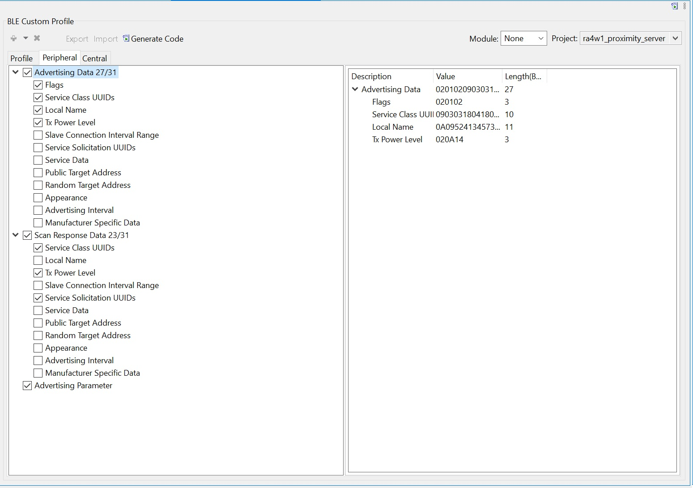
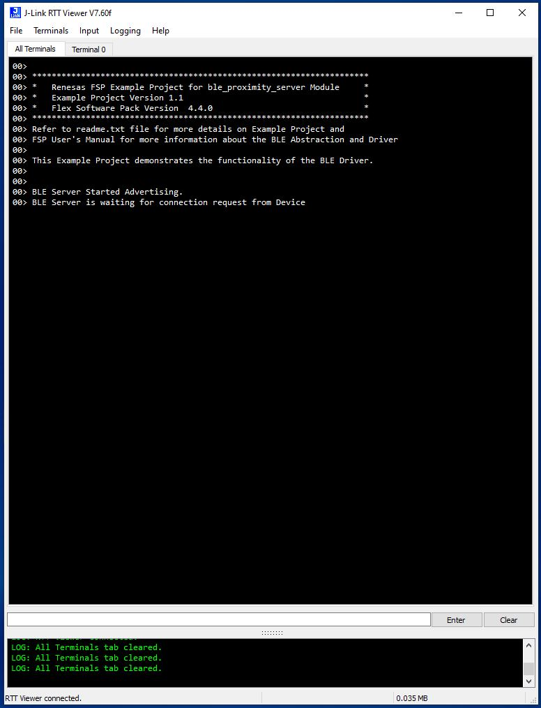
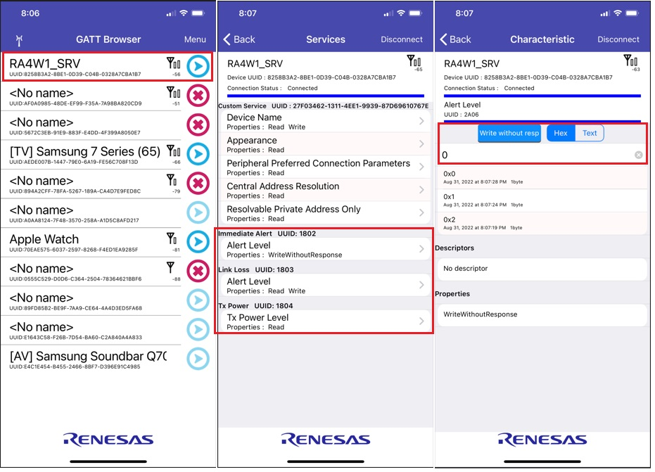
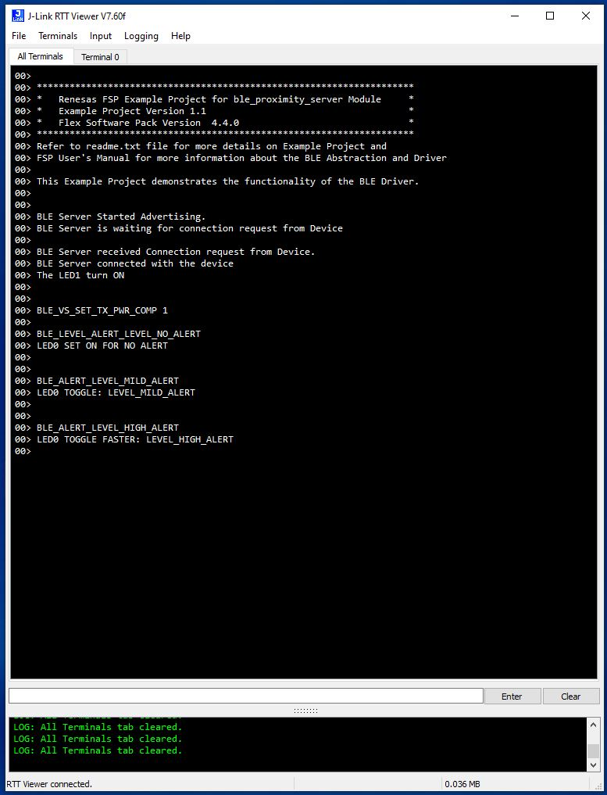

# Introduction #

This project demonstrates the basic functionality of an RA4 MCU operating as a BLE Proximity Profile Server by establishing a connection 
with Renesas browser installed on the device client. This EP "ra4w1_proximity_server" is configured to establish the connection with the 
Renesas GATTBrowser installed on the client device. LED1 on the server board will provide visual feedback to indicate once the client has 
established connection or when a disconnection occurs. LED1 is turned on when the connection is established. It will turn off if the client 
is disconnected. The user can send alert levels, connect requests, or disconnect requests from the Renesas GATT Browser on the client device. 
LED0 blink speed is used to indicate which user alert level value is changed. If user chooses alert level 0, the LED0 does not blink(it 
remains lighted). If user chooses alert level 1, then LED0 blinks slow. If the user chooses alert level 2. then LED0 blinks fast. LED0 Alert 
levels set for both operation of Immediate Alert Level and Link Loss Alert Level. The user also can read and test Tx_power level (tps) and 
test Receive Signal Strength Indicated (RSSI). The connection status and LEDs status messages will display on Jlink RTT viewer.

Note: Download GATTbrowser app for IOS (https://apps.apple.com/us/app/gattbrowser/id1163057977)

Please refer to the [Example Project Usage Guide](https://github.com/renesas/ra-fsp-examples/blob/master/example_projects/Example%20Project%20Usage%20Guide.pdf) 
for general information on example projects and [readme.txt](./readme.txt) for specifics of operation.

## Required Resources ##
To build and run the "ra4w1_proximity_server" example project, the following resources are needed.

### Hardware ###
* Renesas RA™ EK-RA4W1 MCU kit with BLE supported.
* Micro USB cable
* Host PC Computer
* Renesas GATTbrowser app installed on mobile device (IOS).

Refer to [readme.txt](./readme.txt) for information on how to connect the hardware or refer the below steps for hardware connections:

i.  Connect RA MCU debug port to the host PC via a micro USB cable. 

### Software ###
* Renesas Flexible Software Package (FSP): Version 6.2.0
* e2 studio: Version 2025-10
* SEGGER J-Link RTT Viewer: Version 8.74
* GCC ARM Embedded Toolchain: Version 13.2.1.arm-13-7
* Refer to the software required section in [Example Project Usage Guide](https://github.com/renesas/ra-fsp-examples/blob/master/example_projects/Example%20Project%20Usage%20Guide.pdf)
* Renesas GATTbrowser installed on device.
* Install QE tool into E2studio IDE.
 
## Related Collateral References ##
The following documents can be referred to for enhancing and understanding of 
the operation of this example project:
- [FSP User Manual on GitHub](https://renesas.github.io/fsp/)
- [FSP Known Issues](https://github.com/renesas/fsp/issues)
- [QE_for_BLE: Development Assistance Tool for Bluetooth Low Energy](https://www.renesas.com/us/en/software-tool/qe-ble-development-assistance-tool-bluetooth-low-energy#download)

# Project Notes #

## System Level Block Diagram ##
 High level block diagram
 
 

## FSP Modules Used ##
The FSP modules used in this example project. Refer to the FSP User Manual for further details on each module listed below.

| Module Name | Usage | Searchable Keyword  |
|-------------|-----------------------------------------------|-----------------------------------------------|
| BLE Abstraction (rm_ble_abs)  | This FSP Module provides Abstraction | rm_ble_abs|
| General PWM (r_gpt) | This FSP Module is used for LED timer | r_gpt  |

## Module Configuration Notes ##
This section describes FSP Configurator properties which are important or different than those selected by default. 

|   Module Property Path and Identifier   |   Default Value   |   Used Value   |   Reason   |
| :-------------------------------------: | :---------------: | :------------: | :--------: |
| configuration.xml -> BSP > Properties > Settings > Property >Main Stack Size (bytes)| 0x400 |0x1000| Main Program thread stack is configured to store the local variables of different functions in the code. |
| configuration.xml -> BSP > Properties > Settings > Property > Heap Size (bytes)| 0 |0x1000| Heap size is required for standard library functions to be used |
| configuration.xml -> Stacks > Threads > BLE_CORE_TASK > -> Properties > Settings > Property > Thread > Symbol | new_thread0 | ble_core_task | Create and name of task_entry file for system using|
| configuration.xml -> Stacks > Threads > BLE_CORE_TASK > -> Properties > Settings > Property > Thread > Name | New Thread | BLE_CORE_TASK | Name of Thread |
| configuration.xml -> Stacks > Threads > BLE_CORE_TASK > -> Properties > Settings > Property > Thread > Stack size (bytes) | 1024 | 2048 | Increase memory size |
| configuration.xml -> Stacks > Threads > BLE_CORE_TASK > -> Properties > Settings > Property > Thread > Priority | 1 | 4 | setting priority of the Thread |
| configuration.xml -> Stacks > Threads > BLE Abstraction(rm_ble_abs) > g_timer1 Timer > ->  Properties > Settings > Property > Interrupts > Underflow Interrupt Priority | Disable | 7 | setting interrupts priority |
| configuration.xml -> Stacks > Threads > BLE Abstraction(rm_ble_abs) > g_flash0 Flash > ->  Properties > Settings > Property > Common > Data Flash Programming | Disable | Enable | Enable data flash programming | 
| configuration.xml -> Stacks > Threads > BLE Abstraction(rm_ble_abs) > g_external_irq0 > -> Properties > Settings > Property > Module g_external_irq0 External IRQ (r_icu) > Pin Interrupt Priority | Disable | 1 | setting priority of the interrupt |
| configuration.xml -> Stacks > Threads > BLE Abstraction(rm_ble_abs) > g_timer0 Timer > -> Properties > Settings > Property > Module g_timer0 Timer, General PWM (r_gpt) > Interrupts > Overflow/ Crest Interrupt Priority | Disable | 2 | setting priority of the interrupt |
| configuration.xml -> Stacks > Threads > g_timer_periodic Timer, General PWM(rgpt) > Properties > Settings > Property > Common > Pin Output Support | Disable | Enable | Enable output pin |
| configuration.xml -> Stacks > Threads > g_timer_periodic Timer, General PWM(rgpt) > Properties > Settings > Property > Module g_timer_periodic Timer, General PWM(r_gpt) > General > Channel | 0 | 8 | Selection pin channel |
| configuration.xml -> Stacks > Threads > g_timer_periodic Timer, General PWM(rgpt) > Properties > Settings > Property > Module g_timer_periodic Timer, General PWM(r_gpt) > General > Mode | PWM | Periodic | Selection Mode 
| configuration.xml -> Stacks > Threads > g_timer_periodic Timer, General PWM(rgpt) > Properties > Settings > Property > Module g_timer_periodic Timer, General PWM(r_gpt) > General > Period | 0x1000 | 0x100000000 | Setting timer period |
| configuration.xml -> Stacks > Threads > g_timer_periodic Timer, General PWM(rgpt) > Properties > Settings > Property > Module g_timer_periodic Timer, General PWM(r_gpt) > Pins > GTIOCB | None | P106 | Setting output pin |
 

## R_BLE Custom Profile Configuration Notes ##
This section describes the BLE Custom Profile Configuration settings which are important or different than those selected by default. 

These custom BLE Profile configuration settings generate the source code under directory \qe_gen

|   Profile Tab   |   Selection and Setting  |   
| :---------------: | :----------------------: |  
| Profile|Check: Peripheral | |  |
| Profile -> [Server,Client] GAP Service|1.Check: (Server, Client).___2.UUID: 128 bits.__3.Security Level: (1).__4. Included: Check: Immeiate Alert Service, Link Loss Service, Tx Power Service.|
| Profile -> [Server,Client] GAP Service -> Device Name|Properties: Check: (Read, Write) | 
| Profile -> [Server,Client] GAP Service -> Appearance|Properties: Check: (Read)| 
| Profile -> [Server,Client] GAP Service -> Peripheral Preferred Connection Parameters|Properties: Check: (Read)|
| Profile -> [Server,Client] GAP Service -> Central Address Resolution|Properties: Check: (Read)| 
| Profile -> [Server,Client] GAP Service -> Resolvable Private Address Only|Properties: Check: (Read)| 
| Profile -> [Server] GATT Service|1.Check: Server.__2.Security Level: Selecte: (1).__3.Included: Check: GAP Service, Immediate Alert Service, Link Loss Service, Tx Power Service.|
| Profile -> [Server] GATT Service -> Service Changed|Properties: Check: (Indicate)| 
| Profile -> [Server] GATT Service -> Service Changed -> Client Characteristic Configuration|1.Properties: Check: (Read, Write)__2.Aux Properties: Check: (Peer Specific)| 
| Profile -> [Server] Immediate Alert Service|1.Customize: Check: (Server)__2.Security Level: Check:(Level 1)__3.Included: Check: (Immediate Alert Service, Link Loss Service, Tx Power Service.)| 
| Profile -> [Server] Immediate Alert Service -> Alert Level|1.Properties: Check: WriteWithoutResponse__2. Zux Properties: Check: Peer Specific| 
| Profile -> [Server] Link Loss Service|1.Check: (Server)__2. Security Level: Check: Level 1. 3.Included: Check: GAP Service, Immediate Alert Service, Link Loss Service, Tx Power Service.| 
| Profile -> [Server] Link Loss Service -> Alert Level | 1.Properties: Check: (Read, Write).__2. Aux Properties: Check: Peer Specific |
| Profile -> [Server] Tx Power Service | 1.Check: (Server)__2. Security Level: Check: Level 1. 3.Included: Check: GAP Service, Immediate Alert Service, Link Loss Service, Tx Power Service.|  |
| Profile -> [Server] Tx Power Service -> Tx Power Level| 1.Properties: Check: (Read).__2. Aux Properties: Check: Peer Specific  |

|   Peripheral Tab   |   Selection and setting  |   
| :---------------: | :----------------------: |  
| Advertising Data 27/31 -> Flags |Discovers: Check: (LE General Discover)| 
| Advertising Data 27/31 -> Service Class UUIDs | List of services: Check: GATT Service, Immediate Alert Service, Link Loss Service, Tx Power Service.|
| Advertising Data 27/31 -> Local Name |Local Name: (Complete local name). RA4W1_SRV  |
| Advertising Data 27/31 -> Tx Power Level | Tx Power Level (DEC): 20 |
| Scan Response Data 23/31|Default)|  |
| Scan Response Data 23/31 -> Service Class UUIDs | List of services: Check: GATT Service, Immediate Alert Service, Link Loss Service, Tx Power Service.|
| Scan Response Data 23/31 -> Tx Power Level | Tx Power Level (DEC): 20 |
| Scan Response Data 23/31 -> Service solicitation UUIDs | List of services: Check: GATT Service, Immediate Alert Service, Link Loss Service, Tx Power Service.|
| Advertising Parameter|Advertising Interval: Check:(Enable Fast Advertising, Set Advertising Period)|
| Advertising Parameter|Advertising channel: Check: (CH37, CH38, CH39)| 
| Advertising Parameter|Address type: Check box(Public address) |

|   Central Tab   |   Selection and setting  |   
| :---------------: | :----------------------: |  
| Scan Parameter|1.Scan type: (Active scanning)__2.Device filter: (Allow all)__3.Filter duplicates: (Enable)|
| Scan Filter Data | Default (No Check Boxes Selected) | 
| Scan Filter Data | Connection Parameter |

## R_BLE Custom Profile Source Code Generation Notes ##
|   Function generated   |   Description  |   
| :---------------: | :----------------------: |
|app_main|Application main function with main loop|
| gap_cb| Callback function for GAP API|
| gatts_cb|Callback function for GATT Server API|  
| gattc|Callback function for GATT Client API|
| vs_cb|Advertising parameter callback function common process|
| ias_cb| Callback function for Immediate Alert Service server feature| 
| lls_cb | Callback function for Link Loss Service server feature |
| tps_cb | Callback function for Tx Power Service server feature |

## API Name ##

The table below lists the FSP provided API used at the application layer by this example project.

| API generated by (Renesas QE) | Usage | 
|-------------|-----------------------------------------------|
| R_BLE_GATT_GetMtu |This function gets the current MTU used in GATT communication  |
| R_BLE_Open | Open the BLE protocol stack |
| R_BLE_Close  | Close the BLE protocol stack  |
| R_BLE_Execute  | Execute the BLE task |
| R_BLE_IsTaskFree  | Check the BLE task queue is free or not |
| R_BLE_SetEvent | Set Event |
| R_BLE_GetVersion | Get the BLE FIT module version |
| R_BLE_GetLibType | Get the type of BLE protocol stack library |
| RM_BLE_ABS_StartLegacyAdvertising | Restart advertising when disconnected |

## Verifying Operation ##

Import, Build and Debug the EP(see section Starting Development of FSP User Manual). After running the EP, open RTT viewer, Select MCU Target Device following the image below and press OK to see the output.

Below images showcases the output on JLinkRTT_Viewer :

Open the GATTBrowser installed on the device follow the image below.

 
 

From the Device with Renesas GATT Browser installed. Connect the device with RA4W1_SRV and send the requests.
Including 
1. "Connect, Disconnect"
2. Write without response Immediate Alert Level = 0, 1 or 2.
3. Write and Read back Link Loss Alert Levels = 0, 1 or 2. (User needs to write first then read back)
4. Read Tx Power and RSSI ((click the connect button first, then click the read button to read the Tx Power and RSSI values, next click the disconnect button to close the connection).).

