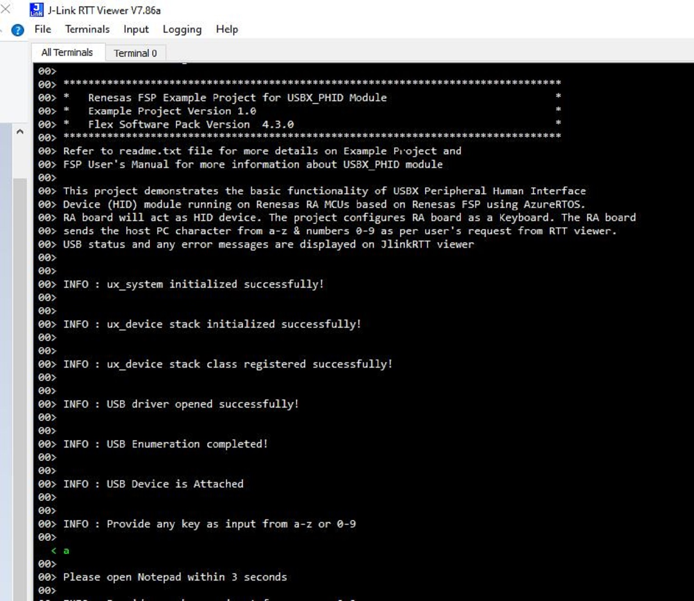
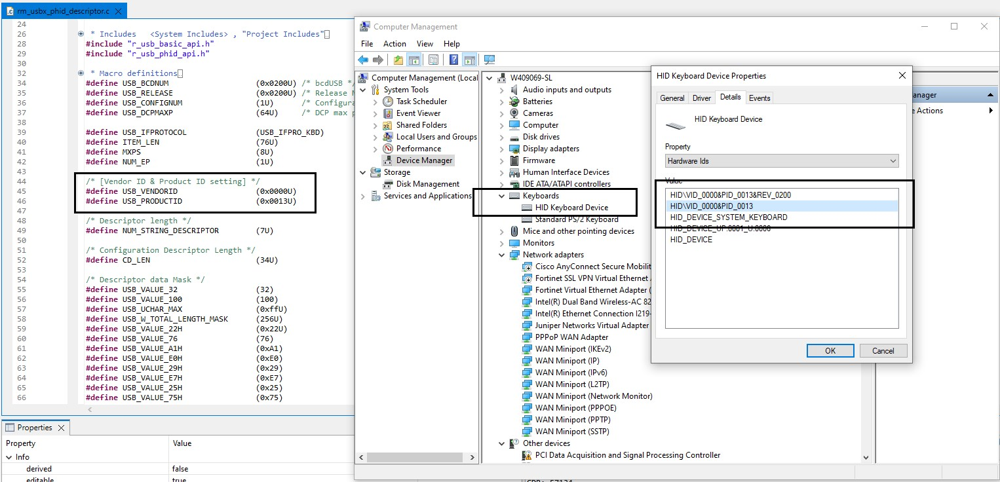

# Introduction #

This project demonstrates basic functionality of USBX Peripheral Human Interface Device Class module on Renesas RA MCUs 
based on Renesas FSP using Azure RTOS. User will be able to use RA board as a keyboard(HID Device) by connecting it to
the Host PC. Once the board is connected, user can provide any input from RTT Viewer to send characters 
from a - z & numbers 0 - 9 from RA board to host PC.
USB status and any error messages are displayed on RTT Viewer. 

Please refer to the [Example Project Usage Guide](https://github.com/renesas/ra-fsp-examples/blob/master/example_projects/Example%20Project%20Usage%20Guide.pdf) 
for general information on example projects and [readme.txt](./readme.txt) for specifics of operation.

## Required Resources ##
To build and run the USBX PHID example project, the following resources are needed.
   
### Hardware ###
* Renesas RA™ MCU kit
* 2x Micro USB cables
* HOST Machine

Refer to [readme.txt](./readme.txt) for information on how to connect the hardware.

### Software ###
1. Refer to the software required section in [Example Project Usage Guide](https://github.com/renesas/ra-fsp-examples/blob/master/example_projects/Example%20Project%20Usage%20Guide.pdf)
2. Refer to [Special Topics](#special-topics) for more information of USBX phid setup.

 
## Related Collateral References ##
The following documents can be referred to for enhancing your understanding of 
the operation of this example project:
- [FSP User Manual on GitHub](https://renesas.github.io/fsp/)
- [FSP Known Issues](https://github.com/renesas/fsp/issues)

# Project Notes #

## System Level Block Diagram ##
 High level block diagram
 
 

## FSP Modules Used ##
List of all the various modules that are used in this example project. Refer to the FSP User Manual for further details on each module listed below.

| Module Name | Usage | Searchable Keyword  |
|-------------|-----------------------------------------------|-----------------------------------------------|
|USBX PHID| USBX PHID is used to communicate with Host machine to send characters from the device class| rm_usbx_port|
| USB Basic Driver | USB driver is required for hardware configuration on RA MCU |r_usb_basic|

## Module Configuration Notes ##
This section describes FSP Configurator properties which are important or different than those selected by default. 

**Common Configuration Properties**

|   Module Property Path and Identifier   |   Default Value   |   Used Value   |   Reason   |
| :-------------------------------------: | :---------------: | :------------: | :--------: |
| configuration.xml -> PHID Thread -> Properties > Settings > Property >Common > Timer> Timer Ticks Per Second |100 | 1000 |The default ticks should be 1000 indicating 1 tick per millisecond|
| configuration.xml -> PHID Thread -> Properties > Settings > Property >Thread > Priority| 1 | 21 |PHID thread priority is lowered to allow the other usb operations at faster rate|
| configuration.xml -> RTT Thread -> Properties > Settings > Property >Thread > Priority| 1 | 22 | RTT thread priority is lowered to allow the USBX PHID data process at the fastest rate possible.|

Refer to [User Callback Handlers](#user-callback-handlers) section for user callback

The table below lists the FSP provided API used at the application layer by this example project.

| API Name    | Usage                                                                          |
|-------------|--------------------------------------------------------------------------------|
|[ux_system_initialize](https://docs.microsoft.com/en-us/azure/rtos/usbx/usbx-device-stack-2#initialization-of-usbx-resources)|This API is used to initialize the USBX system |
|[ux_system_uninitialize](https://docs.microsoft.com/en-us/azure/rtos/usbx/usbx-device-stack-2#uninitialization-of-usbx-resources)|This API is used to un initialize he USBX system|
|[ux_device_stack_initialize](https://docs.microsoft.com/en-us/azure/rtos/usbx/usbx-device-stack-4#ux_device_stack_initialize)|This API is used to initialize the USBX device stack  |
|[ux_device_stack_uninitialize](https://docs.microsoft.com/en-us/azure/rtos/usbx/usbx-device-stack-4#ux_device_stack_uninitialize)|This API is used to uninitialize the USBX device stack|
|[ux_device_stack_class_register](https://docs.microsoft.com/en-us/azure/rtos/usbx/usbx-device-stack-4#ux_device_stack_class_register)|This API is used to registers the usb device slave class|
|[ux_device_stack_class_unregister](https://docs.microsoft.com/en-us/azure/rtos/usbx/usbx-device-stack-4#ux_device_stack_class_unregister)|This API is used to un registers the usb device class|
|[ux_device_class_hid_event_set](https://docs.microsoft.com/en-us/azure/rtos/usbx/usbx-device-stack-5#ux_device_class_hid_event_set)|This API is used to set the PHID event|
|R_USB_Open|This API opens the USB basic driver|
|R_USB_Close|This API closes the USB basic driver|

Refer to [USBX Device HID Class Considerations](https://docs.microsoft.com/en-us/azure/rtos/usbx/usbx-device-stack-5#usb-device-hid-class) for more details of API used.

## Verifying operation ##

Import, Build and Debug the EP(see section Starting Development of FSP User Manual). After running the EP, open RTT viewer to see the output status of ep.

1. Below images showcases the output on **JLinkRTT_Viewer** :

 
 
2. Below image shows Keyboard keys printing on Notepad.

 
 
3. Below image showcases the device enumeration in device manager. User can update the Vendor ID and Product ID of their own devices in descriptor file.

 

### Special Topics 
#### Developing Descriptor
1. Refer **Descriptors** section in [USBX Porting Layer (rm_usbx_port)](https://renesas.github.io/fsp/group___u_s_b_x.html) for developing the descriptor. We can take template file of required usb combination from mentioned path in above link and use the same in source folder by removing the **.template** file extension.

#### User Callback Handlers
1. **usbx_status_callback()** which handle the USB Attach and Removed events.
2. **ux_hid_device_instance_activate()** and **ux_hid_device_instance_deactivate()** which handles the device stack enumeration events.

#### USBX PHID Example Project Limitations
1. USBX PHID module does not support High speed mode.
2. This example project does not support the out transfer.
