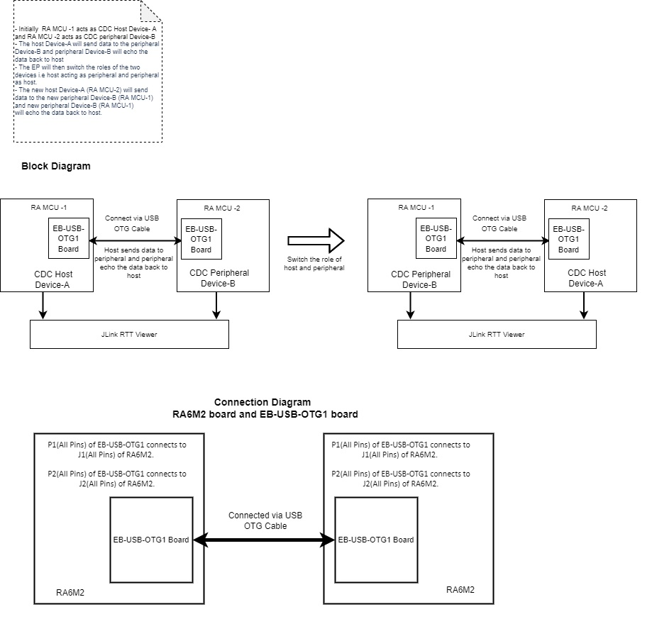
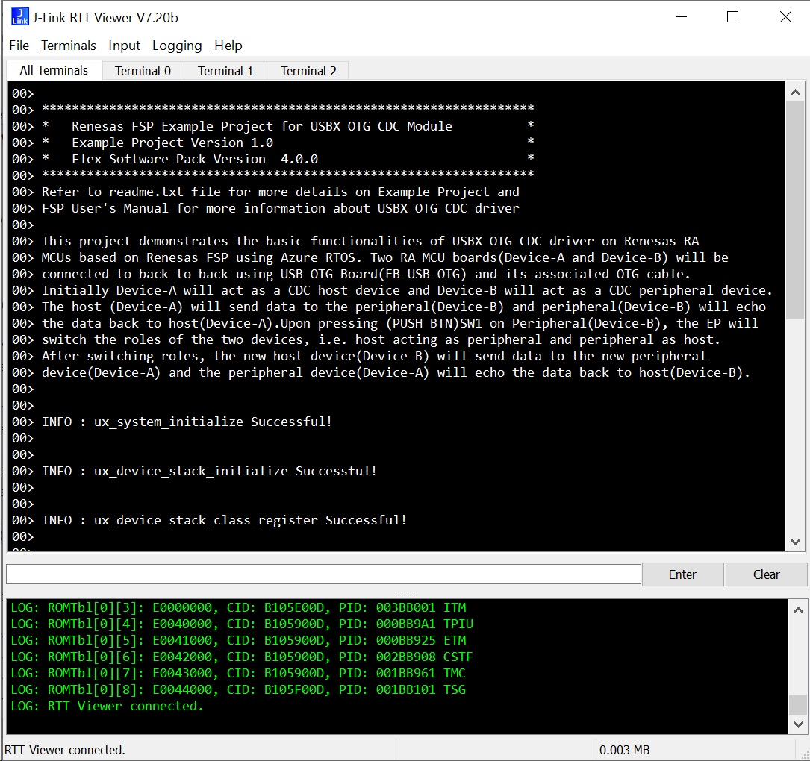
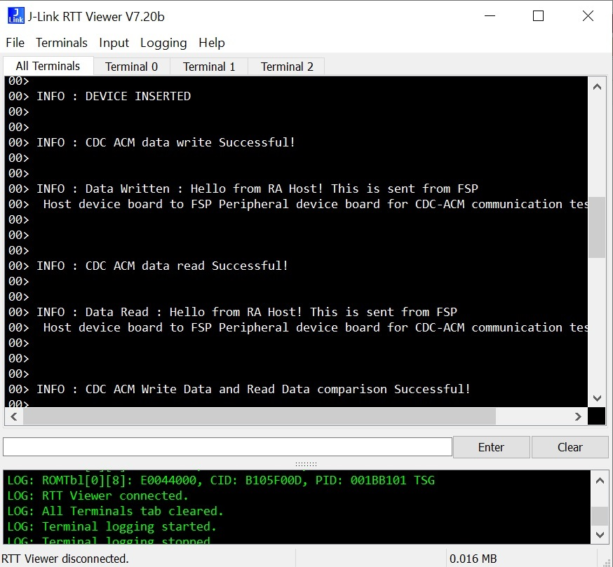
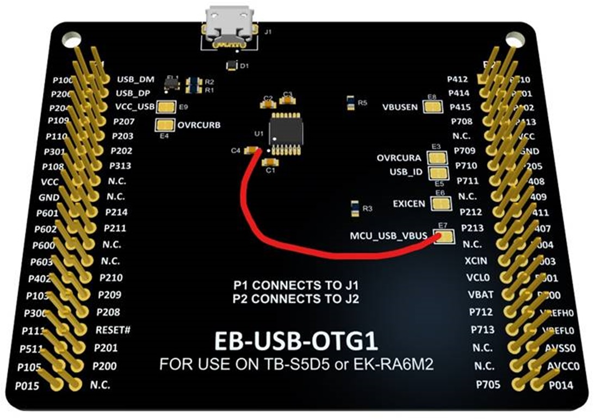
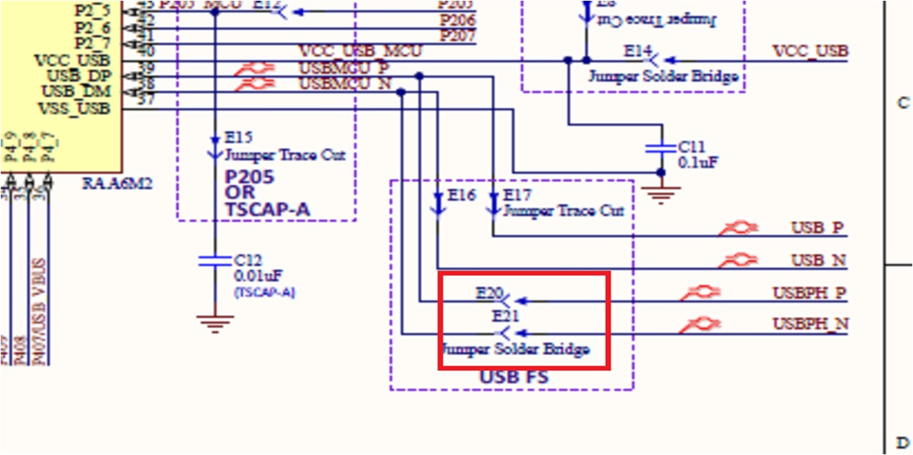

# Introduction #

This project demonstrates the basic functionalities of USBX OTG CDC driver on Renesas RA MCUs based on Renesas FSP using Azure RTOS.
Two RA MCU boards(Device-A and Device-B) will be connected to back to back using USB OTG Board(EB-USB-OTG) and its associated OTG cable.
Initially Device-A will act as a CDC host device and Device-B will act as a CDC peripheral device. The host (Device-A) will send data to 
the peripheral(Device-B) and peripheral(Device-B) will echo the data back to host(Device-A). Upon pressing (PUSH BTN)SW1 on Peripheral(Device-B),
the EP will switch the roles of the two devices, i.e. host acting as peripheral and peripheral as host. After switching roles, the new host 
device(Device-B) will send data to the new peripheral device(Device-A) and the peripheral device(Device-A) will echo the data back to host(Device-B).
USBX status and any errors will be printed on the JLinkRTTViewer which will be handled in a separate thread. 

Please refer to the [Example Project Usage Guide](https://github.com/renesas/ra-fsp-examples/blob/master/example_projects/Example%20Project%20Usage%20Guide.pdf) 
for general information on example projects and [readme.txt](./readme.txt) for specifics of operation.

## Required Resources ##
To build and run the USBX OTG-CDC example project, the following resources are needed.

### Hardware ###
* 2x Renesas RA™ MCU kit.
* 2x EB-USB-OTG1 board.(https://app.circuithub.com/projects/REA-MLP/EB-USB-OTG1_v1/revisions/35287/project)
* 2x Micro USB cables.
* 1x Micro USB OTG cable.

Refer to [readme.txt](./readme.txt) for information on how to connect the hardware.

### Software ###
1. Refer to the software required section in [Example Project Usage Guide](https://github.com/renesas/ra-fsp-examples/blob/master/example_projects/Example%20Project%20Usage%20Guide.pdf)
2. Refer to [Special Topics](#special-topics) for more information of USBX OTG-CDC setup.

 
## Related Collateral References ##
The following documents can be referred to enhance your understanding of 
the operation of this example project:
- [FSP User Manual on GitHub](https://renesas.github.io/fsp/)
- [FSP Known Issues](https://github.com/renesas/fsp/issues)

# Project Notes #

## System Level Block Diagram ##
 High level block diagram
 
 

## FSP Modules Used ##
List of all the various modules that are used in this example project. Refer to the FSP User Manual for further details on each module listed below.

| Module Name | Usage | Searchable Keyword  |
|-------------|-----------------------------------------------|-----------------------------------------------|
| Azure RTOS USBX OTG CDC | USBX OTG CDC is used to communicate between the host and the peripheral device to perform read/write operation, and to switch the role between host and peripheral. | Azure RTOS USBX OTG CDC |
| USB Basic Driver | A USB driver is required for hardware configuration on RA MCU. |r_usb_basic|
| External IRQ | External IRQ is required to detect the attaching of a USB-A cable. |r_icu|

## Module Configuration Notes ##
This section describes FSP Configurator properties that are important or different from those selected by default. 

**Common Configuration Properties**

|   Module Property Path and Identifier   |   Default Value   |   Used Value   |   Reason   |
| :-------------------------------------: | :---------------: | :------------: | :--------: |
| configuration.xml > USBX Otg Thread > Properties > Settings > Property > Common > Timer > Timer Ticks Per Second |100 | 1000 |The default ticks should be 1000, indicating 1 tick per millisecond.|
| configuration.xml > USBX Otg Thread > Properties > Settings > Property > Thread > Priority| 1 | 15 |USBX Otg thread priority is lowered to allow the other USB operations to be serviced at a faster rate|
| configuration.xml > USBX Hcdc Thread > Properties > Settings > Property > Common > Timer > Timer Ticks Per Second |100 | 1000 |The default ticks should be 1000, indicating 1 tick per millisecond.|
| configuration.xml > USBX Hcdc Thread > Properties > Settings > Property > Thread > Priority| 1 | 16 |USBX Hcdc thread priority is lowered to allow the other USB operations to be serviced at a faster rate|
| configuration.xml > USBX Hcdc Thread > Properties > Settings > Property > Thread > Auto Start| Enabled | Disabled |USBX Hcdc thread auto start is disabled to keep the thread in suspended state|
| configuration.xml > USBX Pcdc Thread > Properties > Settings > Property > Common > Timer > Timer Ticks Per Second |100 | 1000 |The default ticks should be 1000, indicating 1 tick per millisecond.|
| configuration.xml > USBX Pcdc Thread > Properties > Settings > Property > Thread > Priority| 1 | 16 |USBX Pcdc thread priority is lowered to allow the other USB operations to be serviced at a faster rate|
| configuration.xml > USBX Pcdc Thread > Properties > Settings > Property > Thread > Auto Start| Enabled | Disabled |USBX Pcdc thread auto start is disabled to keep the thread in suspended state|
| configuration.xml > RTT Thread > Properties > Settings > Property > Thread > Priority| 1 | 18 | The RTT thread priority is lowered to allow the internal thread to take priority.|

**Configuration Properties for External IRQ.**

|   Module Property Path and Identifier   |   Default Value   |   Used Value   |   Reason   |
| :-------------------------------------: | :---------------: | :------------: | :--------: |
| configuration.xml > g_external_irq0 External IRQ(r_icu) Stacks > g_external_irq0 External IRQ(r_icu) > Properties > Module g_external_irq0 External IRQ(r_icu) > Channel | 0 | 7 | Interrupt will be generated on channel 7.|
| configuration.xml > g_external_irq0 External IRQ(r_icu) Stacks > g_external_irq0 External IRQ(r_icu) > Properties > Module g_external_irq0 External IRQ(r_icu) > Trigger| Rising | Both Edges | Interrupt will be triggered on Both Edges|
| configuration.xml > g_external_irq0 External IRQ(r_icu) Stacks > g_external_irq0 External IRQ(r_icu) > Properties > Module g_external_irq0 External IRQ(r_icu) > Digital Filtering| Disabled | Enabled |Digital Filtering is enabled for noise filtering|
| configuration.xml > g_external_irq0 External IRQ(r_icu) Stacks > g_external_irq0 External IRQ(r_icu) > Properties > Module g_external_irq0 External IRQ(r_icu) > Callback| NULL | usb_otg_irq_callback |This callback will be called when USB-A cable is attached or detached|

Refer to [User Callback Handlers](#user-callback-handlers) section for user callback

The table below lists the FSP provided API used at the application layer by this example project.

| API Name    | Usage                                                                          |
|-------------|--------------------------------------------------------------------------------|
|[ux_system_initialize](https://docs.microsoft.com/en-us/azure/rtos/usbx/usbx-device-stack-2#initialization-of-usbx-resources)|This API is used to initialize the USBX system |
|[ux_device_stack_initialize](https://docs.microsoft.com/en-us/azure/rtos/usbx/usbx-device-stack-4#ux_device_stack_initialize)|This API is used to initialize the USBX device stack  |
|[ux_device_stack_class_register](https://docs.microsoft.com/en-us/azure/rtos/usbx/usbx-device-stack-4#ux_device_stack_class_register)|This API is used to register the slave class to the slave stack|
|[ux_host_stack_initialize](https://docs.microsoft.com/en-us/azure/rtos/usbx/usbx-host-stack-4#ux_host_stack_initialize)|This API is used to initialize the USBX host stack|
|[ux_host_class_cdc_acm_write](https://docs.microsoft.com/en-us/azure/rtos/usbx/usbx-host-stack-5#ux_host_class_cdc_acm_write)|This API writes to the cdc_acm interface|
|[ux_host_class_cdc_acm_read](https://docs.microsoft.com/en-us/azure/rtos/usbx/usbx-host-stack-5#ux_host_class_cdc_acm_read) |This API reads from the cdc_acm interface|
|[ux_device_class_cdc_acm_read](https://docs.microsoft.com/en-us/azure/rtos/usbx/usbx-device-stack-5#ux_device_class_cdc_acm_read) |This API reads from the OUT data pipe (OUT from the host, IN from the device)|
|[ux_device_class_cdc_acm_write](https://docs.microsoft.com/en-us/azure/rtos/usbx/usbx-device-stack-5#ux_device_class_cdc_acm_write) |This API writes to the IN data pipe (IN from the host, OUT from the device).|
|R_USB_Open |This API opens USB basic driver|
|R_USB_OtgCallbackSet |This API is used to set a callback function to be called when the OTG role swap is completed on Azure RTOS|

Refer to [USBX Device Class Considerations](https://docs.microsoft.com/en-us/azure/rtos/usbx/usbx-device-stack-5#usb-device-cdc-acm-class) for more details of API used.

#### User Callback Handlers
1. **apl_device_swich_complete_cb()** which handles the USB OTG current mode .
2. **ux_peri_cdc_instance_activate()** and **ux_peri_cdc_instance_deactivate()** which handles the device stack enumeration events.

## Connection Details ##	    	 
1. Connect P1(All Pins) of EB-USB-OTG1 to J1(All Pins) of EK-RA6M2.	
2. Connect P2(All Pins) of EB-USB-OTG1 to J2(All Pins) of EK-RA6M2.

## Verifying operation ##
1. Import, generate and build the USBX OTG CDC host and USBX OTG CDC peripheral EPs.

	 **For USBX OTG CDC host EP** 
		
		* Uncomment the macro APL_USB_OTG_A_DEVICE in usbx_otg_cdc.h 
		
	  **For USBX OTG CDC peripheral EP** 
	  
		* Comment the macro APL_USB_OTG_A_DEVICE in usbx_otg_cdc.h 
	
2. Flash USBX OTG CDC host code on RA6M2 board(i.e. board 1) which will act as the host device.
3. Open J-Link RTT viewer to check the messages from board 1.
4. Flash USBX OTG CDC peripheral code on another RA6M2 Board (i.e. board 2) which will act as a peripheral device.
5. Open J-Link RTT viewer to check the messages from board 2. 
6. Verify the operation of both host and peripheral devices on J-Link RTT viewer.
7. Press the SW1(PUSH BTN) switch on peripheral device (i.e. board 2).
8. Verify the operation of both the host and the peripheral devices on J-Link RTT viewer after the device role has changed.
9. LED blinking can be verified on the peripheral device.

The below image showcases the output on JLinkRTT_Viewer :

**JLinkRTT_Viewer Image 1** 

**JLinkRTT_Viewer Image 2** 

### Special Topics 
#### Developing Descriptor

A USB device provides information about itself in data structures called USB descriptors. 	

The host obtains descriptors from an attached device by sending various standard control requests to the default endpoint. Those requests specify the type of descriptor to retrieve. In response to such requests, the device sends descriptors that include information about the device, its configurations, interfaces and the related endpoints.

* Refer **Descriptor** section in [Device Class (rm_usbx_port)](https://renesas.github.io/fsp/group___u_s_b_x.html) for developing the descriptor. We can take the template file (**rm_usbx_otg_descriptor.c.template**) of the required USB combination from **ra/fsp/src/rm_usbx_port** folder and use the same in the source folder by removing the **.template** file extension.

#### Hardware Changes Required

1. EB-USB-OTG1 (https://app.circuithub.com/projects/REA-MLP/EB-USB-OTG1_v1/revisions/35287/project)

   Short positive side of C4 to the trace cut jumper E7 on both the OTG boards.

2. EK RA6M2 - Short the Jumpers E20 and E21. 

