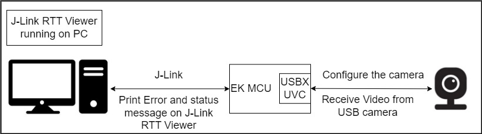
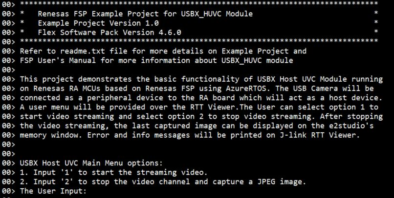
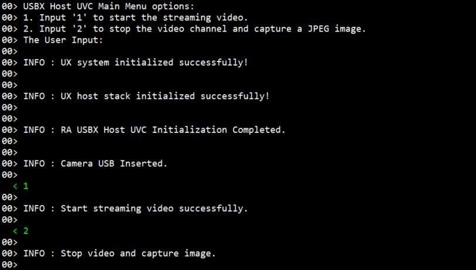

# Introduction #

This Example Project demonstrates the operation of USBX Host UVC Module running on Renesas RA MCUs based on Renesas FSP using AzureRTOS. 
The USB camera will be connected as a peripheral device to the RA board which will act as a host device. A user menu will be provided over the RTT Viewer. The User can select option 1 to start video streaming and select option 2 to stop video streaming.
After stopping the video streaming, the last captured image can be displayed on the e2studio's memory window. Error and info messages will be printed on J-link RTT Viewer.

Please refer to the [Example Project Usage Guide](https://github.com/renesas/ra-fsp-examples/blob/master/example_projects/Example%20Project%20Usage%20Guide.pdf) 
for general information on example projects and [readme.txt](./readme.txt) for specifics of the operation.

## Required Resources ##
To build and run the USBX Host UVC example project, the following resources are needed.

### Hardware ###
* Renesas RA™ MCU kit (Supported board: EK-RA6M3, EK-RA6M5)
* 1x Micro USB cables for programming and debugging
* 1x Micro USB host cable (type-A female to micro-B male)
* 1x USB Video Camera [(Logitech C310 HD WEBCAM)](https://www.amazon.com/Logitech-Widescreen-Correction-Noise-Reducing-FaceTime/dp/B003LVZO8S?th=1)
* Host System (Windows PC)

Refer to [readme.txt](./readme.txt) for information on how to connect the hardware.

### Software ###
Refer to software requirements mentioned in [Example Project Usage Guide](https://github.com/renesas/ra-fsp-examples/blob/master/example_projects/Example%20Project%20Usage%20Guide.pdf)

## Related Collateral References ##
The following documents can be referred to for enhancing your understanding of 
the operation of this example project:
- [FSP User Manual on GitHub](https://renesas.github.io/fsp/)
- [FSP Known Issues](https://github.com/renesas/fsp/issues)

# Project Notes #

## System Level Block Diagram ##

## FSP Modules Used ##
List all the various modules that are used in this example project. Refer to the FSP User Manual for further details on each module listed below.

| Module Name | Usage  | Searchable Keyword (using New Stack > Search) |
| :---------: | :---------------: | :------------: |
| Azure RTOS USBX HUVC | This module provides USBX Host Video Class support on RA device. | HUVC |
| Azure RTOS USBX Port | This USB driver works by combining USBX and r_usb_basic module. | rm_usbx_port |
| USB Basic Driver | The USB module operates in combination with the device class drivers provided by Renesas to form a complete USB stack. | rm_usb_basic |
| DMAC Transfer | DMAC is used to transfer the USB data to offload MCU usage. | r_dmac |

## Module Configuration Notes ##
This section describes FSP Configurator properties that are important or different from those selected by default. 

**Common Configuration Properties**

|   Module Property Path and Identifier   |   Default Value   |   Used Value   |   Reason   |
| :-------------------------------------: | :---------------: | :------------: | :--------: |
|   configuration.xml > BSP > Properties > Settings > Property > Main Stack Size (bytes)| 0x400 |0x400| Main Program thread stack is configured to store the local variables of different functions in the code. |
|   configuration.xml > BSP > Properties > Settings > Property > Heap Size (bytes)| 0 |0| Heap size is required for standard library functions to be used. |
|   configuration.xml > USBX Camera Thread > Properties > Settings > Property > Common > Timer > Timer Ticks Per Second |100 | 1000 |The default ticks should be 1000 indicating 1 tick per millisecond.  |
|   configuration.xml > USBX camera Thread > Properties > Settings > Property > Thread > priority  |   1   |   21   |   USBX camera Thread priority is lowered to allow the other USB operations to be serviced at a faster rate.   |
|   configuration.xml > USBX camera Thread > Properties > Settings > Property > Stack Size (bytes)| 1024 | 0x3000 | The size of the RTT Thread Stack is default to prevent memory overflow. |
|   configuration.xml > RTT Thread > Properties > Settings > Property > Thread > priority  |   1   |   20   |   RTT thread priority is lowered to allow the internal thread taking priority. |
|   configuration.xml > RTT Thread > Properties > Settings > Property > Stack Size (bytes)| 1024 | 4096 | The size of the RTT Thread Stack is default to prevent memory overflow. |
|   configuration.xml > USBX camera Thread Stacks > g_basic0 USB > Properties > Settings > Property > Module g_basic0 USB Driver on r_usb_basic > USB Speed| Full Speed | Hi Speed | USB Speed is configured as **Hi Speed**. |
|   configuration.xml > USBX camera Thread Stacks > g_basic0 USB > Properties > Settings > Property > Module g_basic0 USB Driver on r_usb_basic > USB Module Number| USB_IP0 Port | USB_IP1 Port | This property is used to specify USB module number to be used as per configured USB speed.|
|   configuration.xml > USBX camera Thread Stacks > g_basic0 USB > Properties > Settings > Property > Module g_basic0 USB Driver on r_usb_basic > USBHS Interrupt Priority| Not Support | Priority 12 | Select the interrupt priority used by the main USBHS ISR. |
|   configuration.xml > USBX camera Thread Stacks > g_basic0 USB > Properties > Settings > Property > Module g_basic0 USB Driver on r_usb_basic > USBHS D0FIFO Interrupt Priority| Not Support | Priority 12 | Select the interrupt priority used by the USBHS D0FIFO ISR. |
|   configuration.xml > USBX camera Thread Stacks > g_basic0 USB > Properties > Settings > Property > Module g_basic0 USB Driver on r_usb_basic > USBHS D1FIFO Interrupt Priority| Not Support | Priority 12 | Select the interrupt priority used by the USBHS D1FIFO ISR. |
|   configuration.xml > USBX camera Thread Stacks > g_basic0 USB > Properties > Settings > Property > Common > DMA Support| Disabled | Enabled | Enable or disable DMA support for the USB module. |
|   configuration.xml > USBX camera Thread Stacks > g_basic0 USB > Properties > Settings > Property > Common > DMA Source Address| DMA Disabled | HS Address | Set this to match the speed mode when DMA is enabled. |
|   configuration.xml > USBX camera Thread Stacks > g_basic0 USB > Properties > Settings > Property > Common > DMA Destination Address| DMA Disabled | HS Address | Set this to match the speed mode when DMA is enabled. |
|   configuration.xml > USBX camera Thread Stacks > g_basic0 USB > g_transfer0 Transfer > Properties > Settings > Property > Module g_transfer0 Transfer Driver on r_dmac > Transfer Size| 2 Bytes | 4 Bytes | Select the transfer size. |
|   configuration.xml > USBX camera Thread Stacks > g_basic0 USB > g_transfer0 Transfer > Properties > Settings > Property > Module g_transfer0 Transfer Driver on r_dmac > Activation Source| No ELC Trigger | USBHS FIFO 1 (DMA transfer request 1) | Select the DMAC transfer start event. |
|   configuration.xml > USBX camera Thread Stacks > g_basic0 USB > g_transfer1 Transfer > Properties > Settings > Property > Module g_transfer1 Transfer Driver on r_dmac > Transfer Size| 2 Bytes | 4 Bytes | Select the transfer size. |
|   configuration.xml > USBX camera Thread Stacks > g_basic0 USB > g_transfer1 Transfer > Properties > Settings > Property > Module g_transfer1 Transfer Driver on r_dmac > Activation Source| No ELC Trigger | USBHS FIFO 0 (DMA transfer request 0) | Select the DMAC transfer start event. |

## API Usage ##

The table below lists the FSP provided API used at the application layer by this example project.

| API Name    | Usage                                                                          |
|-------------|--------------------------------------------------------------------------------|
|ux_system_initialize| This API is used to initialize the USBX system. |
|ux_host_stack_initialize| This API is used to initialize the USB host stack. |
|ux_host_class_video_transfer_callback_set| This function sets the video transfer callback function. |
|tx_semaphore_put| This API is used to place an instance in counting semaphore. |
|tx_semaphore_get| This API is used to get instance from counting semaphore. |
|tx_thread_sleep| This API is used to suspend the current thread for a specified time. |
|tx_event_flags_get| This API is used to get event flags from event flags group. |
|tx_event_flags_set| This API is used to set event flags in an event flags group. |
|tx_queue_send| This API is used to send message to message queue. |
|tx_queue_receive| This API is used to get message from message queue. |
|tx_byte_release| This API is used to release bytes back to memory pool. |
|tx_thread_info_get| This API is used to retrieve information about thread |
|ux_host_class_video_frame_parameters_set| This API is used to set the video parameters for the video device. |
|ux_host_class_video_max_payload_get| This API is used to return the maximum payload size for a given video parameter setting. |
|ux_host_class_video_start| This API is used to start the video streaming. |
|ux_host_class_video_stop| This API is used to stop the current video channel. |
|ux_host_class_video_transfer_buffer_add| This API is used to add a buffer for video transfer requests. |
|ux_utility_memory_compare| This API is used to compares two memory blocks. |
|ux_utility_string_length_get| This function derives the length of a NULL-terminated string. |
|ux_host_stack_uninitialize| This API is used to un-initializes all the host code for USB. |
|ux_system_uninitialize| This API is used to un-initializes the various control data structures for the USBX system. |
|R_USB_Open| This API opens the USB basic driver. |
|R_USB_Close| This API opens the USB basic driver. |

## User Callback Handlers ##
| Callback Name    | Usage                                                                          |
|-------------|--------------------------------------------------------------------------------|
|ux_host_usr_event_notification| This function is used to handle the USB Attach and Removed events. |
|uvc_transfer_request_done_callback| This function is invoked to indicate the transfer completion to the USB camera. |

## Verifying operation ##
    
1. Import, generate, build, and download the USBX HUVC project to the RA board.
2. Open J-Link RTT Viewer to verify the initialization status.

    Below images show the output on J-Link RTT Viewer:

3. Once the USB initialization is complete, The User enters '1' to start the streaming video and then enters '2' to stop the video channel and capture a JPEG image.

4. After stopping the video channel, the last captured image can be displayed via the memory window view on e2studio.

a) Click [Windows] → [Show View] → [Memory] to open the Memory view.

b) In "Memory Monitor" pane, click icon  to add monitor: "fb_data.p_pointer" and click [OK] to proceed.

c) Click "New Renderings…" in Memory Rendering pane. Select "Image" and click "Add Rendering(s)" to 
display JPEG images. Only if a JPEG file header is found at the given memory address, e2studio will decode the image to be shown.

d) Click icon  to enable the "Real-time Refresh"

e) Example:

## Special Notes on attach and detach the Camera: ##

* The attach and detach events of the camera are detected by the program.
* If user disconnects the camera while the image is being streamed, user needs to reset the MCU.
* If user disconnects the camera when the image capture is stopped, the application can handle repeated attach and detached operations.