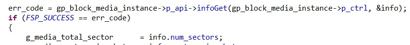

# Introduction #

This example project demonstrates basic functionalities of USBX Device Mass Storage Class module
on Renesas RA MCUs based on Renesas FSP using Azure RTOS. RA Board will act as a device MSC 
peripheral. The USBX PMSC driver internally configures memory device (block media with sdmmc) to 
enumerate as a   memory drive on host PC. User can read, write and perform various file operations
on the disk. The system initialization status and any errors occurred will be printed on the RTT
viewer.

Please refer to the [Example Project Usage Guide](https://github.com/renesas/ra-fsp-examples/blob/master/example_projects/Example%20Project%20Usage%20Guide.pdf) 
for general information on example projects and [readme.txt](./readme.txt) for specifics of operation.

## Required Resources ##
To build and run the USBX PMSC example project, the following resources are needed.

### Hardware ###
* Renesas RA™ MCU kit with USB Support
* 2x USB A to USB Micro B Cable.(One for onboard debugger and other for USB MSC connection)
* PC running Windows 10
* 1x [PMOD](https://digilent.com/shop/pmod-sd-full-sized-sd-card-slot/) based full sized SD Card or Micro SD CARD with Adapter.

Refer to [readme.txt](./readme.txt) for information on how to connect the hardware.

### Software ###
1. Refer to the software required section in [Example Project Usage Guide](https://github.com/renesas/ra-fsp-examples/blob/master/example_projects/Example%20Project%20Usage%20Guide.pdf)
2. Refer to [Special Topics](#special-topics) for more information of USBX pmsc setup.

 
## Related Collateral References ##
The following documents can be referred to for enhancing your understanding of 
the operation of this example project:
- [FSP User Manual on GitHub](https://renesas.github.io/fsp/)
- [FSP Known Issues](https://github.com/renesas/fsp/issues)

# Project Notes #

## System Level Block Diagram ##

## FSP Modules Used ##
List all the various modules that are used in this example project. Refer to the FSP User Manual for further details on each module listed below.

| Module Name | Usage | Searchable Keyword  |
|-------------|-----------------------------------------------|-----------------------------------------------|
| USBX PMSC | This module provide a USBX Device Mass storage class support on RA device.| USBX PMSC|
| Block media on sdmmc | This module is internally configured by USBX PMSC driver to enumerate as a memory drive on host PC and user can perform read, write operations on the drive. | sdmmc|
| USB Basic Driver | USB driver is required for hardware configuration on RA MCU |r_usb_basic|
| DMAC Transfer | DMAC is used to transfer the usb data for faster process  | r_dmac  |

## Module Configuration Notes ##
This section describes FSP Configurator properties which are important or different than those selected by default. 

**Common Configuration Properties**

|   Module Property Path and Identifier   |   Default Value   |   Used Value   |   Reason   |
| :-------------------------------------: | :---------------: | :------------: | :--------: |
| configuration.xml -> PMSC Thread -> Properties > Settings > Property >Common > Timer> Timer Ticks Per Second |100 | 1000 |The default ticks should be 1000 indicating 1 tick per millisecond. Follow FSP UM recommendations.|
| configuration.xml -> PMSC Thread -> Properties > Settings > Property >Thread > Priority| 1 | 21 |Use a lower priority level than the internal USBX thread priority. There is one internal thread:  ux_slave_storage thread (which is at priority 20). Follow FSP UM recommendations.|
| configuration.xml -> RTT Thread -> Properties > Settings > Property >Thread > Priority| 1 | 22 | RTT thread priority is lowered to allow the USBX PMSC data process at the fastest rate possible.|
| configuration.xml -> PMSC Thread Stacks -> g_basic0 Instance > Properties > Settings > Property > Common >DMA Support| Disable | Enable | DMA is used to offload CPU usage, to transfer the usb data for faster process|
| configuration.xml -> PMSC Thread Stacks -> g_transfer0 Transfer Driver on r_dmac SDHIMMC0 DMA REQ (DMA transfer request) > Settings > Property > Transfer End Interrupt Priority| Disable | Priority 2 | Transfer End Interrupt Priority is enabled and set to priority 2 to trigger interrupt when transfer ends. |

**Configuration Properties for using USBHS**

|   Module Property Path and Identifier   |   Default Value   |   Used Value   |   Reason   |
| :-------------------------------------: | :---------------: | :------------: | :--------: |
| configuration.xml -> PMSC Thread Stacks -> g_basic0 Instance > Properties > Settings > Property > g_basic0 > USB Speed| Full-Speed | Hi-Speed | This property is used to configure USB speed |
| configuration.xml -> PMSC Thread Stacks -> g_basic0 Instance > Properties > Settings > Property > Common >DMA Source Address| DMA Disabled | HS Address | USB basic driver is configured USB Speed as High Speed. Accordingly, DMA Source Address is provided with HS Address|
| configuration.xml -> PMSC Thread Stacks -> g_basic0 Instance > Properties > Settings > Property > Common >DMA Destination Address| DMA Disabled | HS Address | USB basic driver is configured USB speed as High Speed (Default). Accordingly, DMA Destination Address is provided with HS Address |
| configuration.xml -> PMSC Thread Stacks -> g_basic0 Instance > Properties > Settings > Property > g_basic0 > USB Module Number | USB_IP0_Port | USB_IP1_Port | This property is used to specify USB module number to be used as per configured USB speed. |
| configuration.xml -> PMSC Thread Stacks -> g_transfer0 Transfer Driver on r_dmac Instance > Properties > Settings > Property > Module g_transfer0 Transfer driver > Activation Source| No ELC Trigger | USBHS FIFO 1 (DMA Transfer request 1)  |This is an event trigger for DMA transfer 0 instance for destination pointer address|
| configuration.xml -> PMSC Thread Stacks -> g_transfer1 Transfer Driver on r_dmac Instance > Properties > Settings > Property > Module g_transfer1 Transfer driver > Activation Source| No ELC Trigger | USBHS FIFO 0 (DMA Transfer request 0)  |This is an event trigger for DMA transfer 1 instance for source pointer address|
| configuration.xml -> PMSC Thread Stacks -> g_transfer1 Transfer Driver on r_dmac Instance > Properties > Settings > Property > Module g_transfer1 Transfer driver > Transfer Size| 2 Bytes | 4 Bytes  | This is used to select DMAC transfer size. Follow FSP UM recommendations. |
| configuration.xml -> PMSC Thread Stacks -> g_transfer0 Transfer Driver on r_dmac Instance > Properties > Settings > Property > Module g_transfer0 Transfer driver > Transfer Size| 2 Bytes | 4 Bytes  |This is used to select DMAC transfer size. Follow FSP UM recommendations. |

**Configuration Properties for using USBFS**

|   Module Property Path and Identifier   |   Default Value   |   Used Value   |   Reason   |
| :-------------------------------------: | :---------------: | :------------: | :--------: |
| configuration.xml -> PMSC Thread Stacks -> g_basic0 Instance > Properties > Settings > Property > Common > DMA Source Address| DMA Disabled | FS Address | USB basic driver is configured USB Speed as Full Speed. Accordingly, DMA Source Address is provided with FS Address|
| configuration.xml -> PMSC Thread Stacks -> g_basic0 Instance > Properties > Settings > Property > Common > DMA Destination Address| DMA Disabled | FS Address | USB basic driver is configured USB speed as Full Speed (Default). Accordingly, DMA Destination Address is provided with FS Address |
| configuration.xml -> PMSC Thread Stacks -> g_transfer0 Transfer Driver on r_dmac Instance > Properties > Settings > Property > Module g_transfer0 Transfer driver > Activation Source| No ELC Trigger | USBFS FIFO 1 (DMA Transfer request 1)  |This is an event trigger for DMA transfer 0 instance for destination pointer address|
| configuration.xml -> PMSC Thread Stacks -> g_transfer1 Transfer Driver on r_dmac Instance > Properties > Settings > Property > Module g_transfer1 Transfer driver > Activation Source| No ELC Trigger | USBFS FIFO 0 (DMA Transfer request 0)  |This is an event trigger for DMA transfer 1 instance for source pointer address|

## API Usage ##
The table below lists the FSP provided API used at the application layer by this example project.

| API Name    | Usage                                                                          |
|-------------|--------------------------------------------------------------------------------|
|ux_system_initialize| This API is used to initialize the USBX system |
|ux_device_stack_initialize| This API is used to initialize the USBX device stack  |
|R_USB_Open|This API opens the USB basic driver|

Refer to [Description of USBX Device Services](https://docs.microsoft.com/en-us/azure/rtos/usbx/usbx-device-stack-4) for more details of API used.

* Callback :  
  **usbx_status_callback()** is a user callback function which is registered as 9th argument of **ux_device_stack_initialize** API. 
  This callback is invoked by USBX to indicate to the application level about USB Attach and Removed events.

## Verifying operation ##
1. Import, generate and build the project EP.
2. Now, flash USBX PMSC code on RA board.
3. Open RTT viewer to see the output 
4. User can also copy the files to media manually.

Below images showcases the output on JLinkRTT_Viewer :

Below image showcases the device enumeration in device manager :

## Special Topics ##

### Developing Descriptor ###
Refer **Descriptor** section of [Device Class (rm_usbx_port)](https://renesas.github.io/fsp/group___u_s_b_x.html) for developing  a descriptor.
We can take template file of required usb combination from mentioned path in above link and use the same in source folder by removing the **.template** file extension.

### Operations for changing the last LBA ###
* Last lba is getting set to media total sector in **usb_peri_usbx_pmsc_storage_init()** function in **rm_usbx_port.c** file as shown below.

* media total sector is acquired from the **infoGet()** API during initialization in **usb_peri_usbx_pmsc_media_initialize()** function as shown below.

