# Introduction #

This project demonstrates the basic functionality of the AWS HTTPS client library with Ethernet driver on Renesas RA MCUs based on Renesas FSP using FreeRTOS. 
The AWS client is used to connect to the HTTPS adafruit server, which is a cloud platform. 
Upon successful connection, the menu is displayed allowing the user to send GET, PUT, POST requests to the adafruit server. 
On POST/PUT request, MCU die temperature is read via(using) ADC and uploaded to server. 
On GET request, the most recently uploaded MCU die temperature data is read from the adafruit server. 
JLink RTT Viewer is used to display the status and responses of the requests made to the server.

Please refer to the [Example Project Usage Guide](https://github.com/renesas/ra-fsp-examples/blob/master/example_projects/Example%20Project%20Usage%20Guide.pdf) 
for general information on example projects and [readme.txt](./readme.txt) for specifics of operation.

## Required Resources ##
To build and run the aws_https_client example project, the following resources are needed.

### Hardware ###
* Renesas RA™ MCU kit - 1x
* Micro USB cable - 1x
* Ethernet Switch or Router with Ethernet port - 1x
* Ethernet Cable (RJ45 CAT5/6) - 1x
* HOST Machine - 1x

Refer to [readme.txt](./readme.txt) on information on how to connect the hardware.

### Software ###
1. Refer to the software required section in [Example Project Usage Guide](https://github.com/renesas/ra-fsp-examples/blob/master/example_projects/Example%20Project%20Usage%20Guide.pdf)
2. Refer to **Special Topics** for obtaining the certificates and key which is required to update in the code. 

 
## Related Collateral References ##
The following documents can be referred to, for enhancing your understanding of 
the operation of this example project:
- [FSP User Manual on GitHub](https://renesas.github.io/fsp/)
- [FSP Known Issues](https://github.com/renesas/fsp/issues)

# Project Notes #

## System Level Block Diagram ##
 High level block diagram
 
 

## FSP Modules Used ##
List all the various modules that are used in this example project. Refer to the FSP User Manual for further details on each module listed below.

| Module Name | Usage | searchable Keyword  |
|-------------|-----------------------------------------------|-----------------------------------------------|
|AWS HTTPS Wrapper|To get access of AWS core HTTP library for client connection |AWS HTTPS Wrapper|
|FreeRTOS + TCP|To get access of TCP/IP network library to form network layer|rm_freertos_plus_tcp|
|Ethernet Driver| This is a dependent module of FreeRTOS+TCP to get access of physical layer of FSP board with the help of Ethernet driver |r_ether|
|Secure Sockets | Secure sockets are used to form secure connection|Secure Sockets|
|FreeRTOS+Crypto|This is used for secure connection by accessing MbedTLS and MbedCrypto libraries|FreeRTOS+Crypto|
|MbedTLS|This is a dependent module of FreeRTOS+Crypto which is used for server/client certificate parsing|mbedTLS|
|Mbed Crypto | This is a dependent module of MbedTLS which is used for secure TLS connection | rm_psa_crypto |
|LittleFS | To store RSA keys in flash memory | rm_littlefs_flash |
|ADC |This is used to demonstrate reading the internal temperature sensor value to send to the server  | r_adc   |

## Module Configuration Notes ##
This section describes FSP configurator properties which are important or different than those selected by default. 

|   Module Property Path and Identifier   |   Default Value   |   Used Value   |   Reason   |
| :-------------------------------------: | :---------------: | :------------: | :--------: |
| configuration.xml -> BSP > Properties > Settings > Property >Main Stack Size (bytes)| 0x400 |0x1000| Main Program thread stack is configured to store the local variables of different functions in the code |
| configuration.xml -> BSP > Properties > Settings > Property > Heap Size (bytes)| 0 |0x2000| Heap size is required for standard library functions to be used |
| configuration.xml -> User App Thread > Properties > Settings > Property > Common > General > Use Mutexes| Disabled | Enabled | Enabled to include mutex functionality |
| configuration.xml -> User App Thread > Properties > Settings > Property > Common > General > Use Recursive Mutexes| Disabled | Enabled | Enabled to include recursive mutex functionality |
| configuration.xml -> User App Thread > Properties > Settings > Property > Common > Memory Allocation > Support Dynamic Memory Allocation| Disabled | Enabled | RTOS objects can be created using RAM that is automatically allocated from the FreeRTOS heap |
| configuration.xml -> User App Thread > Properties > Settings > Property > Common > Memory Allocation > Total Heap Size | 0 | 0x20000 | RAM is used to obtain memory allocation for secure libraries |
| configuration.xml -> User App Thread > Properties > Settings > Property > Common > Optional Functions > eTaskGetState() Function| Disabled | Enabled | Include eTaskGetState() function in build |
| configuration.xml -> User App Thread > Properties > Settings > Property > Common > Optional Functions > xTaskGetHandle() Function| Disabled | Enabled | Include xTaskGetHandle() function in build |
| configuration.xml -> User App Thread > AWS HTTPS Wrapper > AWS Core HTTP > Properties > Settings > Property > Common > HTTP Receive Retry Timeout (ms) | 1 | 200 | The maximum duration between non-empty network reads while receiving an HTTP response via the HTTPClient_Send API function| 
| configuration.xml -> User App Thread > AWS HTTPS Wrapper > AWS Core HTTP > Properties > Settings > Property > Common > HTTP Send Retry Timeout (ms) | 1 | 200 | The maximum duration between non-empty network transmissions while sending an HTTP request via the HTTPClient_Send API function| 
| configuration.xml -> User App Thread > AWS HTTPS Wrapper > AWS IOT Common > Properties > Settings > Property > IOT Thread Default Stack Size | 512 | 0x1000 | Stack size for new thread to store network information| 
| configuration.xml -> User App Thread > AWS HTTPS Wrapper > AWS IOT Common > Properties > Settings > Property > IOT Network Receive task Stack Size | 512 | 0x1000 | Stack size for storing data from receive task|
| configuration.xml -> User App Thread > AWS HTTPS Wrapper > FreeRTOS+TCP  > Properties > Settings > Property > Common > DHCP callback function | Disable | Enable |DHCP callback function is required to obtain dynamic IP address |
| configuration.xml -> User App Thread > AWS HTTPS Wrapper > FreeRTOS+TCP  > Properties > Settings > Property > Common > Let TCP use windowing Mechanism | Disable | Enable | For flow control use the TCP windowing mechanism|
| configuration.xml -> User App Thread > AWS HTTPS Wrapper > FreeRTOS+TCP  > Properties > Settings > Property > Common > FreeRTOS_SendPingRequest() is available |Disable|Enable| Enabled to support the sending of ping requests|
| configuration.xml -> User App Thread > AWS HTTPS Wrapper > FreeRTOS+TCP  > Properties > Settings > Property > Common > DNS Request Attempts | 2 | 5 | Number of attempts for DNS requests |
| configuration.xml -> User App Thread > AWS HTTPS Wrapper > g_ether0 Ethernet Driver on r_ether  > Properties >  Settings > Property > General > Flow control functionality | Disable | Enable |Enabled for flow control|
| configuration.xml -> User App Thread > AWS HTTPS Wrapper > g_ether0 Ethernet Driver on r_ether  > Properties >  Settings > Property > Buffers > Number of TX buffer | 1 | 8 |Buffer size increased for faster processing|
| configuration.xml -> User App Thread > AWS HTTPS Wrapper > g_ether0 Ethernet Driver on r_ether  > Properties >  Settings > Property > Buffers > Number of RX buffer | 1 | 8 |Buffer size increased for faster processing|
| configuration.xml -> User App Thread > AWS HTTPS Wrapper > g_ether_phy0 Ethernet Driver on r_ether_phy  > Properties >  Settings > Property > Common > Reference Clock |Default |Enable|Selected to use the RMII reference clock|
| configuration.xml -> User App Thread > AWS HTTPS Wrapper > LittleFS > Properties >  Settings > Property > Common > Warning Messages | Disabled | Enabled | To print the warning messages of LittleFS this needs to chosen as enabled|
| configuration.xml -> User App Thread > AWS HTTPS Wrapper > LittleFS > Properties >  Settings > Property > Common > Error Messages | Disabled | Enabled | To print the error messages of LittleFS this needs to chosen as enabled|
| configuration.xml -> User App Thread > AWS HTTPS Wrapper > LittleFS > Properties >  Settings > Property > Common > Debug Messages | Disabled | Enabled | To print the debug messages of LittleFS this needs to chosen as enabled|
| configuration.xml -> User App Thread > AWS HTTPS Wrapper > MbedTLS (Crypto Only) > Properties > Settings > Property > Common > Cipher > Alternate > MBEDTLS_GCM_ALT | Define | Undefine | MBEDTLS_GCM_ALT does not bind to the cipher keys |
| configuration.xml -> User App Thread > AWS HTTPS Wrapper > MbedTLS (Crypto Only) > Properties > Settings > Property > Common > Public Key Cryptography (PKC) > ECC > MBEDTLS_ECDH_C | Undefine | Define | Mbed TLS implements ECDH algorithm |
| configuration.xml -> User App Thread > AWS HTTPS Wrapper > MbedTLS (Crypto Only) > Properties > Settings > Property > Common > Public Key Cryptography (PKC) > RSA > MBEDTLS_PK_RSA_ALT_SUPPORT | Undefine | Define |To support external private RSA keys |
| configuration.xml -> User App Thread > AWS HTTPS Wrapper > MbedTLS (Crypto Only) > Properties > Settings > Property > Common > Hardware Acceleration > Hash > SHA256/224 | Use Software | Use Hardware |Defines MBEDTLS_SHA256_ALT and MBEDTLS_SHA256_PROCESS_ALT |
| configuration.xml -> User App Thread > AWS HTTPS Wrapper > MbedTLS (Crypto Only) > Properties > Settings > Property > Common > Hardware Acceleration > Cipher > AES | Use Software | Use Hardware |Defines MBEDTLS_AES_ALT, MBEDTLS_AES_SETKEY_ENC_ALT, MBEDTLS_AES_SETKEY_DEC_ALT, MBEDTLS_AES_ENCRYPT_ALT and MBEDTLS_AES_DECRYPT_ALT |
| configuration.xml -> User App Thread > AWS HTTPS Wrapper > MbedTLS (Crypto Only) > Properties > Settings > Property > Common > Hardware Acceleration > Public Key Cryptography (PKC) > ECC | Use Software | Use Hardware | Defines MBEDTLS_ECP_ALT |
| configuration.xml -> User App Thread > AWS HTTPS Wrapper > MbedTLS (Crypto Only) > Properties > Settings > Property > Common > Hardware Acceleration > Public Key Cryptography (PKC) > ECDSA | Use Software | Use Hardware | Defines MBEDTLS_ECDSA_SIGN_ALT and MBEDTLS_ECDSA_VERIFY_ALT |
| configuration.xml -> User App Thread > AWS HTTPS Wrapper > MbedTLS (Crypto Only) > Properties > Settings > Property > Common > Hardware Acceleration > Public Key Cryptography (PKC) > RSA | Use Software | Use Hardware | Defines MBEDTLS_RSA_ALT |
| configuration.xml -> User App Thread > g_adc ADC Driver on g_adc > Properties > Settings > g_adc ADC Driver on r_adc > General > Mode |Single Scan | Continuous Scan | Continuous mode to be selected for continuous reading of ADC value (MCU Die Temperature)|
| configuration.xml -> User App Thread > g_adc ADC Driver on g_adc > Properties > Settings > g_adc ADC Driver on r_adc > input > Channel Scan Mask (channel availability varies by MCU) > Temperature Sensor | Uncheck | Check | Enable the internal temperature sensor to read the ADC value |

## API Usage ##

The table below lists the FSP provided API used at the application layer by this example project.

| API Name    | Usage                                                                          |
|-------------|--------------------------------------------------------------------------------|
|R_ADC_ScanCfg| This API is used to configure the ADC scan parameters|
|R_ADC_ScanStart|This API is used to start scanning of configured ADC channel|
|R_ADC_Read|This API is used to read the ADC data from the configured channel|
|FreeRTOS_gethostbyname| This API is used to resolve the host name to IP address|
|FreeRTOS_inet_ntoa|This API is used to convert an IP address expressed in decimal dot notation|
|FreeRTOS_SendPingRequest|This API is used to send a ping request to remote PC|
|IotHttpsClient_GetUrlPath|This API is used to perform the HTTPS request to the server|
|IotHttpsClient_GetUrlAddress|This API is used to retrieve the URL address|
|IotHttpsClient_Init|This API is used to initialize the HTTPS library|
|IotHttpsClient_Connect|This API is used to connect request to the server|
|IotHttpsClient_Disconnect|This API is used to disconnect from the connected server|
|IotHttpsClient_Cleanup|This API is used to cleanup the HTTPS library|
|IotHttpsClient_InitializeRequest|This API is used to initialize the HTTPS client request to the server with the user credentials|
|IotHttpsClient_AddHeader|This API is used to add the header in JSON format for HTTPS client request to the server|
|IotHttpsClient_SendSync|This API is used to send in synchronous connection|
|IotHttpsClient_ReadResponseStatus|This API is used to read the response status from the server|
|IotClock_SleepMs | This API is used to delay for few seconds to retry the server connection|

## Verifying operation ##

**Note 1:** To run the application with the supplied key, certificate and code, user need not require to create Adafruit account with login of their own login credentials. Here in this case the output can only be seen on the RTT console. This is the default behavior of the application with the supplied code.  
**Note 2:** If the user wants access to Adafruit Dashboard, modify the application along with your own keys, you are required to sign up and create an account with your desired login credentials(if you don't have one). The steps for creating the account, generating the private Key and certificate are explained in the Special Topics sections.  
**Note 3:** After the sign up and login to Adafruit account, you can create feed on the Dashboard and generate ADAFRUIT IO Key, for your own creation of new feeds.

Import, Build and Debug the EP(*see section Starting Development* of **FSP User Manual**). After running the EP, open RTT viewer to see the output.

Below images showcase the output on JLink RTT Viewer :

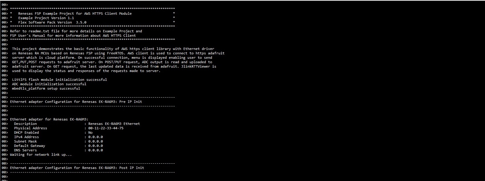

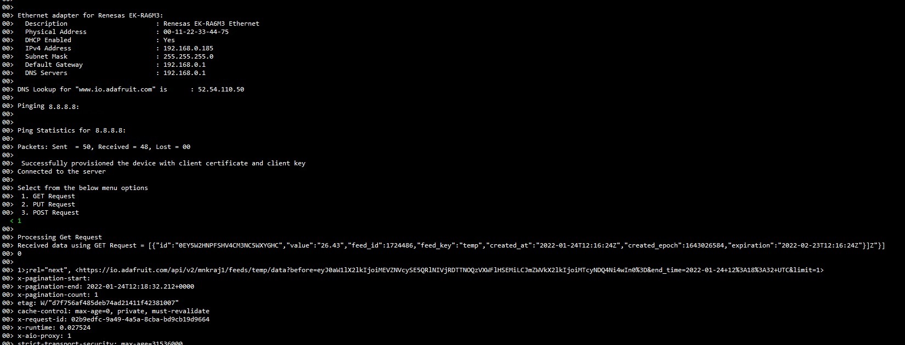

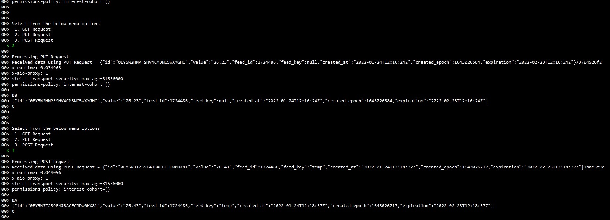

After executing the menu options, the updated data will be shown in the user feed on the Adafruit IO server.
To view user feed data, Click on Feeds and select the created feed.
Below image show the adafruit server with feed data:

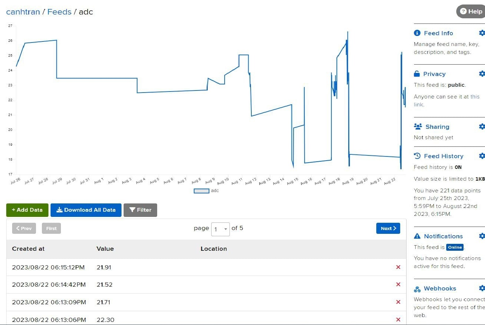

## Special Topics ##

**1. Obtaining Adafruit server credentials:**

Following steps guide you how to obtain the username and AIO key.

1.Go to https://io.adafruit.com. Click on **Get Started for Free** to create an account or **Sign In** if already created as shown in the  below image

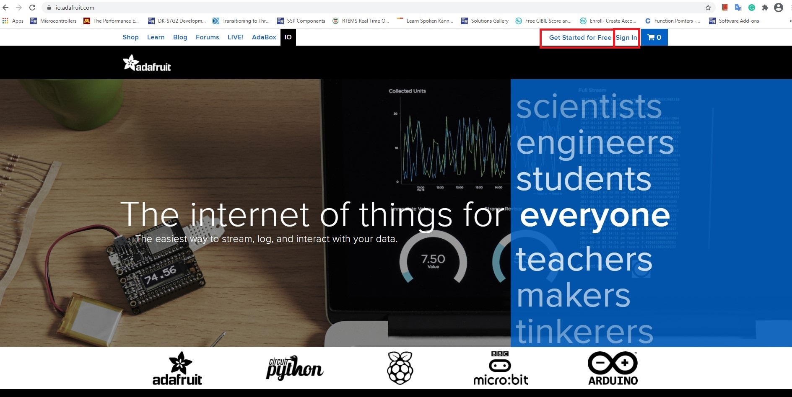

2. Create an account by providing the requested details as shown in below image to obtain user credentials viz., **username** and **password**   
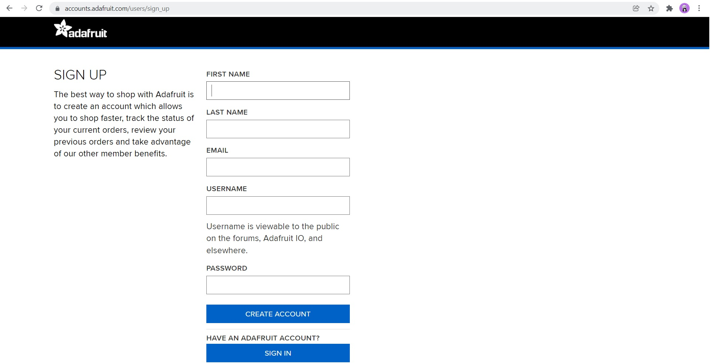  
3. After successful creation of account, user name will display on top of the page as shown in below image. Click on **IO**, dashboard will displays with the following options **Feeds , Dashboards, My key** etc.

 
 
 4.  Click on My Key option to see your username and Active key. These two details are important for communicating with adafruit server. 
 If the key is compromised, we can generate the new key by clicking on the Regenerate key option as shown in below image. 
 The Active Key and Username generated are required and used in the usr_app.h as explained in the section 4 of Creation of Adafruit Feeds.  
 
 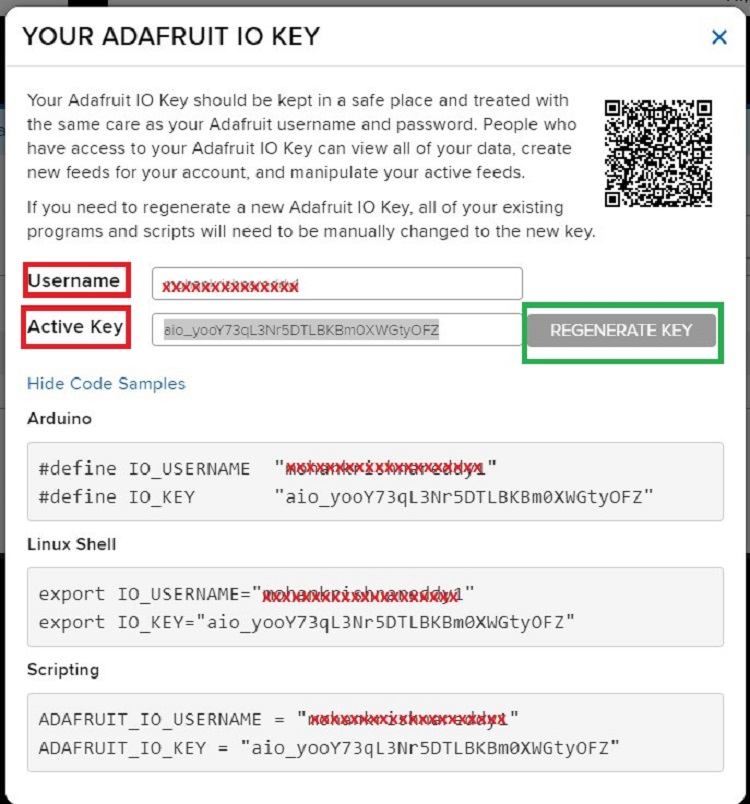 
 
 
**2. Creation of Adafruit Feeds:**  

1. For creating a new feed, go to Feeds -> view all, as shown in the image below:

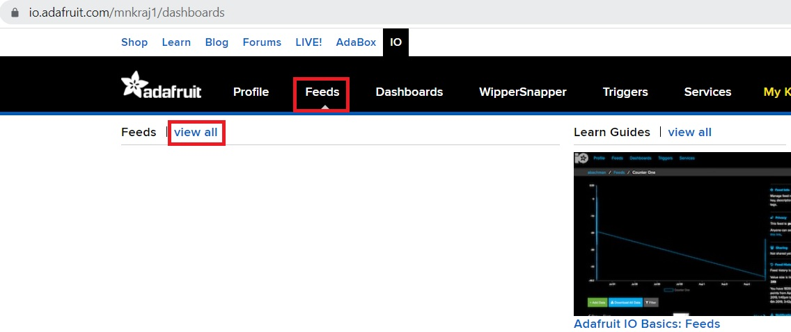  

2. Then click on the "+New Feed" button, a dialog box will appear to Create a new Feed. Fill the name and description of feed and click on "Create" button, as shown in below image.  

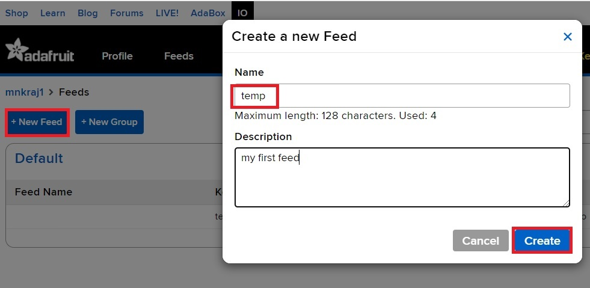  

3. Once the feed is created, Open the created feed and click on Privacy and select Visibility as Public through drop down menu and save as shown in below image:  
Also, User can add data manually for the feed using the dashboard.  
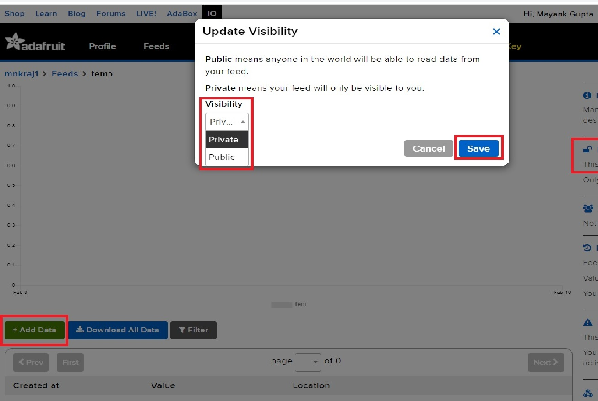  
4. After obtaining the user name, Active key from the "your ADAFRUIT IO Key" Pop-up window and creating the feed. User has to update the following details at respective URL macros in the aws_https_client_ep/src/user_app.h file as shown in the below image.  
 Use GET url: https://io.adafruit.com/api/v2/{**username**}/feeds/{feed_key}/data?limit=1  
#define IOT_DEMO_HTTPS_PRESIGNED_GET_URL   "https://io.adafruit.com/api/v2/**mnkraj1**/feeds/**temp**/data?limit=1"  
#define IOT_DEMO_HTTPS_PRESIGNED_PUT_POST_URL    "https://io.adafruit.com/api/v2/**mnkraj1**/feeds/**temp**/data/"  

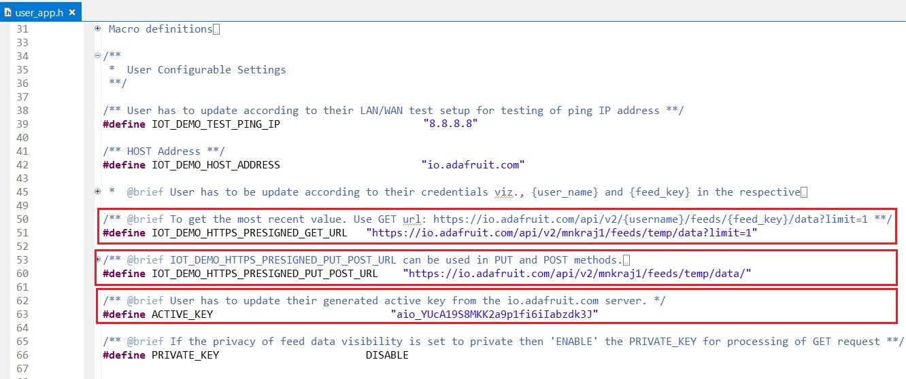  

**3. Obtaining Server Certificate:**

1. Open browser and copy paste the following URL http://cacerts.geotrust.com/GeoTrustRSACA2018.crt. Server certificate with .crt extension will be downloaded with the file name **GeoTrustRSACA2018.crt**

2. After downloaded the .crt file, need to be convert to .pem format using OpenSSL.

3. OpenSSL can be downloaded from  https://www.openssl.org/source/. depends on the Operating System, required installer can be downloaded and installed.

4. Copy the downloaded certificate to the bin folder of your installed openssl.

5. Open the cmd prompt in Administrator mode from the bin folder as shown in the below image.

 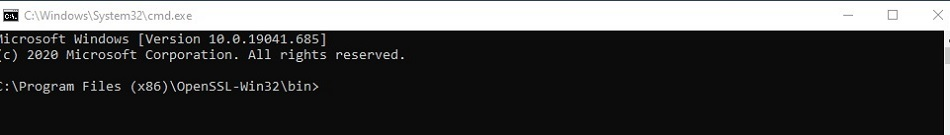

 6. Type the conversion command :**Openssl.exe x509 -inform DER -outform PEM -in GeoTrustRSACA2018.crt -out GeoTrustRSACA2018.crt.pem** as shown below image
 
 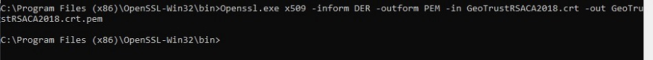
 
 7. GeoTrustRSACA2018.crt.pem file will be generated in your bin folder as shown in below image.
 
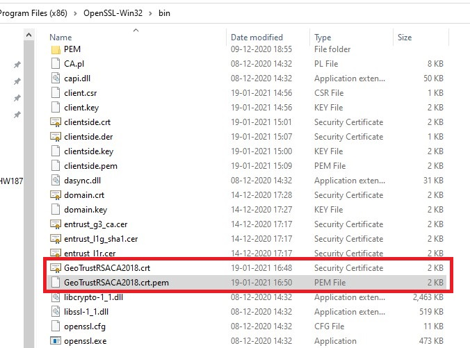

8. Open the converted certificate file with notepad and copy the content and update in the aws_https_client_ep\src\usr_app.h file at the **IOT_HTTPS_TRUSTED_ROOT_CA** macro as shown in below image.

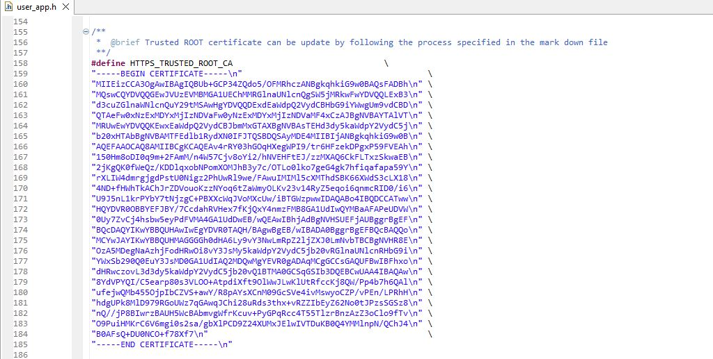

**4. Obtaining Client Certificate and Private Key:**

1. Open the cmd prompt from the bin folder of installed Openssl. 

2. To generate the private key and CSR certificate use the command **openssl req -newkey rsa:2048 -nodes -keyout clientside.key -x509 -days 365 -out clientside.crt**  as shown below.

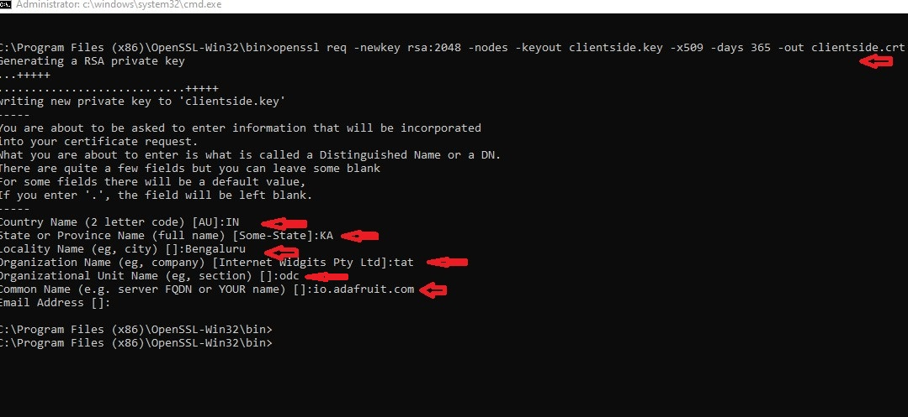

3. clientside.key and clientside.crt files are generated in binary folder. Verify client certificate is properly generated by using command **openssl x509 -text -noout -in clientside.crt** as shown below.  
**NOTE:** clientside.key is the private key which is used on the client side and clientside.crt is the certificate used on the client side.
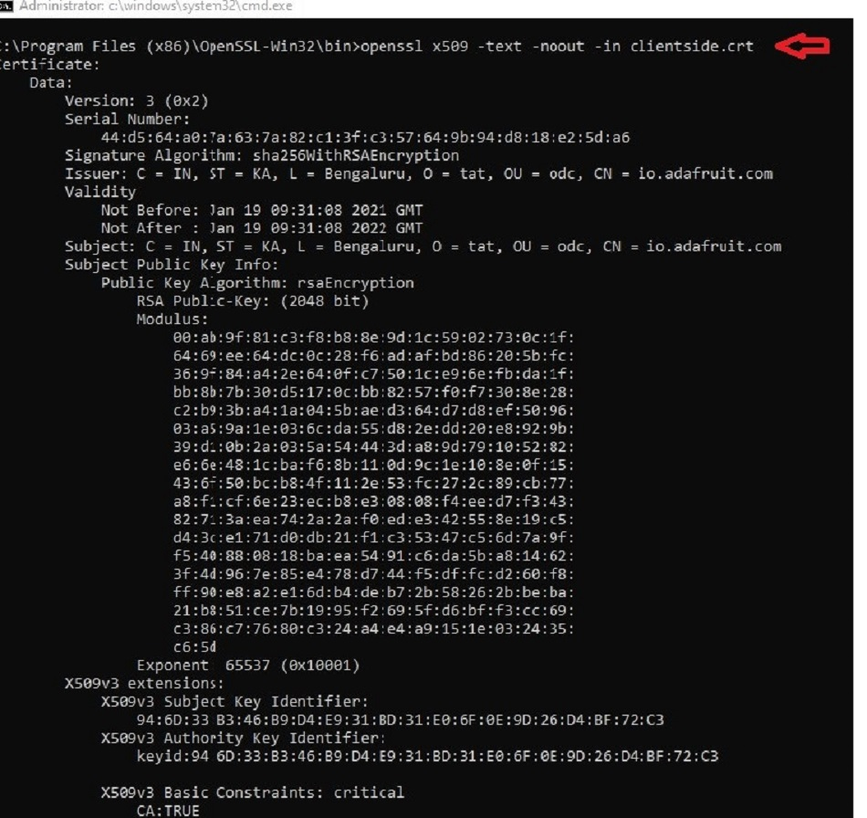

4. Generated client certificate is in .crt format. It has to be converted to .pem format. Conversion can be done from .crt to .der and then .der to .pem. 
To convert from .crt to .der, Use the command **openssl x509 -in clientside.crt -outform der -out clientside.der** as shown below.

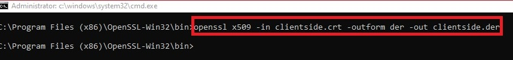

5. To convert .der to .pem use the command **openssl x509 -inform der -in clientside.der -out clientside.pem** as shown below.

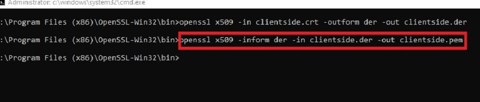

6. The generated files can be found in bin folder of OpenSSL installed software as shown in below image.

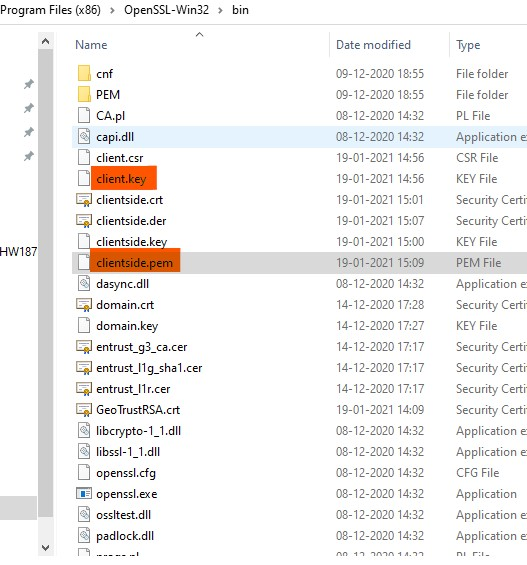

7. Open the generated files in notepad and copy the content and paste in the aws_https_client_ep/src/usr_app.h 

 i . Copied client certificate to be update at the CLIENT_CERTIFICATE_PEM macro as shown in below image.
 
 
 
 ii. Copied client key to be update at the CLIENT_KEY_PEM macro as shown in below image.
 
  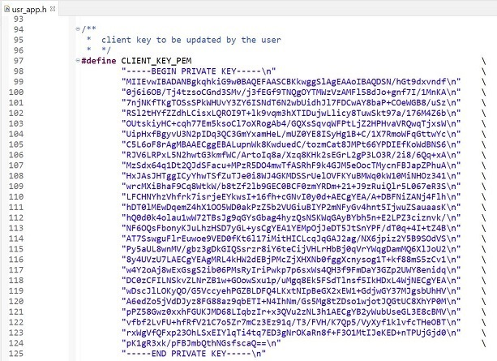
  
  
**NOTE:** Client Certificate and client Key are required for AWS Client application to authenticate server in secure connection. If missing of both, then it cannot be connect to server instead return an error as no certificates were found.