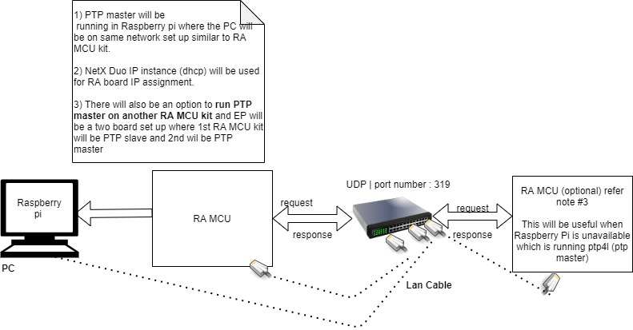
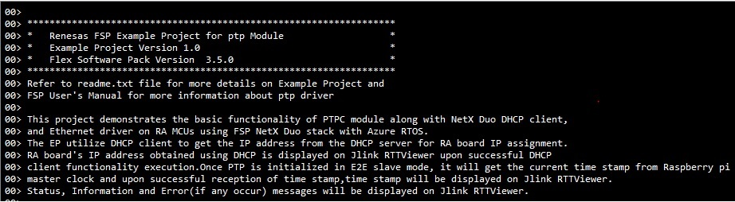
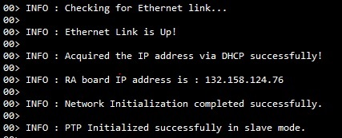
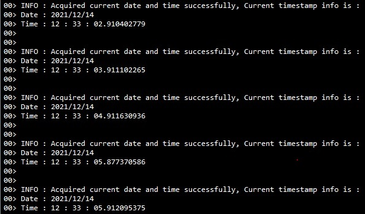
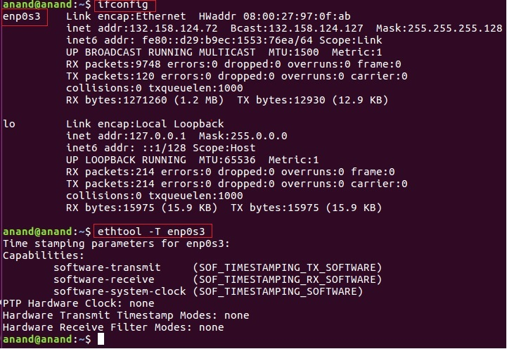
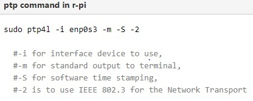
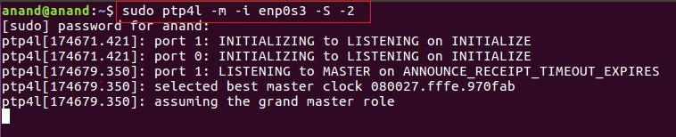
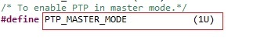
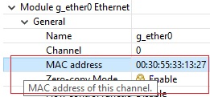
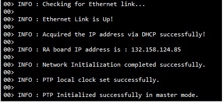

# Introduction #

The sample code accompanying this file shows the operation of a PTP module on a RA MCU using Azure RTOS. 
In this sample code, a NetX Duo IP instance is created with IP address as (default 0.0.0.0 - Not assigned).  
The NetX stack is enabled for UDP, ICMP, and ARP. DHCP client is used to getting the IP address from the DHCP server 
for RA board IP assignment. DHCP Client uses the UDP for sending and receiving DHCP messages.  
When DHCP Client is created and started, DHCP messages are exchanged, it waits for a valid IP address to be assigned from the DHCPv4 server.

Once the PTP module is opened, set the local clock id, MAC address, IP address and configure the PTP instance to operate as an end to end Slave.
It will get the current timestamp from Raspberry-Pi or another RA board master clock and upon successful reception of timestamp,
the timestamp will be displayed on Jlink RTTViewer.

NetX Duo DHCP Client is compliant with [RFC2132](https://tools.ietf.org/html/rfc2132), [RFC2131](https://tools.ietf.org/html/rfc2131).

The status messages, ptp info, and the code flow informational messages as part of the initialization are displayed on the JlinkRTTViewer.

Please refer to the [Example Project Usage Guide](https://github.com/renesas/ra-fsp-examples/blob/master/example_projects/Example%20Project%20Usage%20Guide.pdf) 
for general information on example projects and [readme.txt](./readme.txt) for specifics of the operation.

## Required Resources ##
To build and run the ptp example project, the following resources are needed.

### Hardware ###
* Renesas RA™ MCU kit with Ethernet Precision Time Protocol Controller module
* Micro USB cable
* Router/Ethernet Switch (with a DHCP Server).
* Ethernet Cable CAT5/6 (LAN Cable)
* Raspberry-Pi or another RA board to run the PTP master.
* Windows PC for viewing RTT outputs.

Refer to [readme.txt](./readme.txt) for information on how to connect the hardware.

### Software ###
Refer to software requirements mentioned in [Example Project Usage Guide](https://github.com/renesas/ra-fsp-examples/blob/master/example_projects/Example%20Project%20Usage%20Guide.pdf)

## Related Collateral References ##
The following documents can be referred to for enhancing your understanding of 
the operation of this example project:
- [FSP User Manual on GitHub](https://renesas.github.io/fsp/)
- [FSP Known Issues](https://github.com/renesas/fsp/issues)

# Project Notes #

## System Level Block Diagram ##

## FSP Modules Used ##
List all the various modules that are used in this example project. Refer to the FSP User Manual for further details on each module listed below.

| Module Name | Usage  | Searchable Keyword (using New Stack > Search) |
|-------------|-----------------------------------------------|-----------------------------------------------|
| ptp |  ptp is used to synchronize clocks in the Internet computing infrastructure and  also used most often to synchronize device clocks in special-purpose industrial automation and measurement networks. | ptp |
| NetX Duo IP Instance | For IP communication the NetX IP instance needs to be used. | NetX Duo IP|
| NetX Duo Packet Pool | Packet Pool Module is used to send and receive the created data packets over UDP network.  | NetX Duo Packet Pool |
| NetX Duo Ethernet driver | Ethernet connection is required for physical connection to connect over network. | NetX Duo Ethernet Driver |
| NetX Duo DHCP IPv4 Client | DHCPv4 module is used to obtain IP address and to automate the process of configuring devices on IP networks, by using network services such as DNS, and any communication protocol based on UDP or TCP. | dhcp |

## Module Configuration Notes ##
This section describes FSP Configurator properties that are important or different from those selected by default. 

|   Module Property Path and Identifier   |   Default Value   |   Used Value   |   Reason   |
| :-------------------------------------: | :---------------: | :------------: | :--------: |
|   configuration.xml -> BSP > Properties > Settings > Property > Heap Size (bytes)| 0 |0x400| Heap size is required for standard library functions to be used as per FSP requirements. |
|   configuration.xml -> PTP Thread > Settings > Property > Thread > priority  |   1   |   2   |   PTP thread priority is lowered to allow the IP thread to process incoming packets at the fastest rate possible.   |
|   configuration.xml -> RTT Thread > Settings > Property > Thread > priority  |   1   |   3   |   RTT thread priority is lowered to allow the PTP and IP threads to process incoming packets at the fastest rate possible.   |
|   configuration.xml -> PTP Thread > g_ether0 Ethernet driver on r_ether > Settings > General > MAC address  |   00:11:22:33:44:55   |   00:30:55:33:14:27   |   Sets the MAC address, as master and slave can not use same MAC address.   |
|   configuration.xml -> PTP Thread > g_ptp0 PTP Driver on r_ptp > Properties > Settings > Property > Frame Format| Ethernet | IEEE802.3,LLC,SNAP,IPv4,UDP | Format of the frame is changed to send PTP messages using IEEE802.3 frames with an IP and UDP header. |

## API Usage ##

The table below lists the PTP, DHCP Client API used at the application layer by this example project.

| API Name    | Usage                                                                          |
|-------------|--------------------------------------------------------------------------------|
|R_PTP_Open|This API initializes ptp driver.|
|R_PTP_LocalClockIdSet|This API sets the local clock id.|
|R_PTP_MacAddrSet|This API sets the mac address.|
|R_PTP_IpAddrSet|This API sets the IP address.|
|R_PTP_MessageFlagsSet|This API sets the PTP message flag.|
|R_PTP_PortStateSet|This API changes the current state of the PTP instance.|
|R_PTP_LocalClockValueGet|This API gets the local clock value.|
|R_PTP_MasterClockIdSet|This API sets the master clock id.|
|R_PTP_LocalClockValueSet|This API sets the local clock value.|
|R_PTP_Close|This API closes the PTP instance.|
|nx_system_initialize|This function initializes the various components and system data structures.|
|nx_packet_pool_create|This API creates a packet pool of the specified packet size in the memory area supplied by the user.|
|nx_ip_address_get|This API retrieves IP address and its subnet mask of the primary network interface.|
|nx_ip_create|This API creates an IP instance with the user supplied IP address and network driver.|
|nx_udp_enable|This API enables the UDP service.|
|nx_icmp_enable|This service enables the Internet Control Message Protocol (ICMP) component for the specified IP instance.|
|nx_ip_status_check|This service checks and optionally waits for the specified status of a previously created IP instance. |
|nx_dhcp_create|This service creates a DHCP instance for the previously created IP instance.|
|nx_dhcp_packet_pool_set|This service allows the application to create the DHCP Client packet pool|
|nx_dhcp_start|This service starts DHCP processing on all interfaces enabled for DHCP.|
|nx_dhcp_user_option_retrieve|This service retrieves the specified DHCP option from the DHCP options buffer on the first interface enabled for DHCP found on the DHCP Client record.|

## Verifying operation ##
1. Run the PTP master(ptp4l), user need to follow steps as described under **[Special Topics](#special-topics)**.   

	* PTP master will be running in Raspberry-Pi, where the PC will be on the same network setup similar to RA MCU kit.
	* If Raspberry-Pi is not available, then use another RA board to run PTP master and follow the steps as described under **[Special Topics](#special-topics)**.
		 
2. Import, Build and Debug the EP(see section Starting Development of **FSP User Manual**). 
Before running the example project, refer to the below steps for hardware connections :
	* Connect RA MCU debug port to the host PC via a micro USB cable. 
	* Connect an Ethernet cable to the RJ45 connector on RA MCU via ethernet switch/hub which is connected to Router or LAN where DHCP server is residing.
	* A DHCP Server needs to exist on the network to assign  an IP address to the RA MCU running this PTP Example Project.

   After running the EP, open RTT viewer to see the output.    
   Below images shows an example of output observed on JLinkRTT_Viewer:

   

   

   

## Special Topics ##

### Steps to run the PTP master(ptp4l) on Raspberry-Pi : 
* Install linuxptp on Rapsberry pi using *"apt install linuxptp"* command, If clock fails to start please upgrade system packages by using command *"sudo apt upgrade"*.
* Once linuxptp is installed check ptp capabilities by using *"ethtool -T enp0s3"*. Here enp0s3 or any other Ethernet port can be verified by *"ifconfig"* command in Raspberry-Pi for active Ethernet port.    
  
* If at least software transmit and receive is available upon running above command then we can proceed to run ptp4l(using sudo) as below:
  
    
* Refer below terminal log :  
      
  	

### Steps to run the PTP master on another RA board :
* To run the EP in master mode, user should update the **PTP_MASTER_MODE** macro value present in the **ptp_ek_ra6m3_ep\src\ptp_ep.h** file as shown in below image.
      
  
  
  Also user should change the MAC address (different from the slave) of the EK-RA6M3 master board to allow proper DHCP configuration.  
  
  
  
* Generate, Build and Debug the EP. Before running the example project, refer to the below steps for hardware connections :
     * Connect RA MCU debug port to the host PC via a micro USB cable. 
     * Connect an Ethernet cable to the RJ45 connector on RA MCU via Ethernet switch/hub which is connected to Router or LAN where DHCP server is residing.
     * A DHCP Server needs to exist on the network to assign  an IP address to the RA MCU running this PTP Example Project.

  After running the EP, open RTT viewer to see the output.    
  Below images shows an example of output observed on JLinkRTT_Viewer:

  

  

* User can obtain the local clock time in their time zone by changing the **TIME_ZONE_OFFSET** macro value present in the **ptp_ek_ra6m3_ep\src\ptp_ep.h** file as shown in below image.

         
  Refer [timezone](https://www.epochconverter.com/timezones) for getting **TIME_ZONE_OFFSET** macro value as per required timezone.  
  
  **Note:** Currently EP does not support pulse timer feature.
