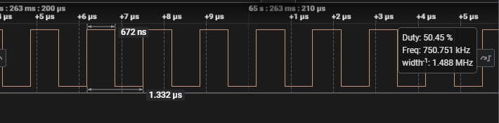
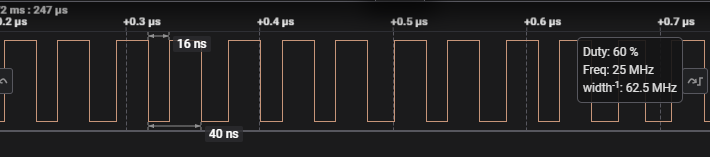

# Introduction #
This example project demonstrates the typical use of the Multiple Clocks Output.  
The user inputs key from Terminal Application to start Clocks Output Option to the clock output pin.  
Enter number 3 in the Terminal Application to stop the clocks output from the clock output pin of the MCU.  
The EP information or any error messages will be displayed on the Terminal Application.

Note:
* For Terminal Application:
	* To display information, the user can select between the SEGGER J-Link RTT Viewer and the Serial Terminal (UART) with J-Link OB VCOM. It is important to note that the user should only operate a single terminal application at a time to avoid conflicts or data inconsistencies. For instructions on how to switch between these options, please refer the first step in the "Verifying Operation" section.
	* By default, EP information is printed to the host PC using the Serial Terminal for boards that support J-Link OB VCOM. LED1 is turned ON to indicate the UART initialized unsuccessfully. 
	* For RA boards that do not support J-Link OB VCOM, EP information is instead printed via the SEGGER J-Link RTT Viewer.
	* RA boards supported for J-Link OB VCOM: EK-RA2A2, EK-RA4E2, EK-RA6E2, EK-RA8D1, EK-RA8M1.

* For Verifying Operation:
	* To verify EP, the user can select between the GPT or oscilloscope.
	* By default, the EP uses GPT to capture clock output value. To use oscilloscope, please follow the instructions in "Verifying Operation" section.

Please refer to the [Example Project Usage Guide](https://github.com/renesas/ra-fsp-examples/blob/master/example_projects/Example%20Project%20Usage%20Guide.pdf) 
for general information on example projects and [readme.txt](./readme.txt) for specifics of operation.

## Required Resources ##
To build and run the clock output, the following resources are needed.

### Software Requirements ###
* Renesas Flexible Software Package (FSP): Version 5.8.0
* e2 studio: Version 2025-01
* SEGGER J-Link RTT Viewer: Version 8.12c
* GCC ARM Embedded Toolchain: Version 13.2.1.arm-13-7
* Terminal Console Application: Tera Term or a similar application

### Hardware Requirements ###  
Supported RA boards: EK-RA2A1, EK-RA2A2, EK-RA2E1, EK-RA2L1, EK-RA4E2, EK-RA4M1, EK-RA4M2, EK-RA4M3, EK-RA6E2, EK-RA6M1, EK-RA6M2, EK-RA6M3, EK-RA6M3G, EK-RA6M4, EK-RA6M5, EK-RA8M1, EK-RA8D1.
* 1 x RA board.
* 1 x Micro USB cable.
* 1 x Oscilloscope to verify the CLKOUT signal.

### Hardware Connections ###
* Connect the RA board USB debug port to the PC via micro-USB cable for EP debugging.
* CLKOUT Pin Configuration for RA Development Kits:  
	| Development Kit | CLKOUT_PIN | Connector and Pin |
	|-----------------|------------|-------------------|
	| EK-RA2A1        | P110       | J1-P35            |
	| EK-RA2A2	  	  | P210       | J2-P8             |
	| EK-RA2E1        | P109       | J2-P27            |
	| EK-RA2L1        | P109       | J1-P33            |
	| EK-RA4E2        | P109       | J2-P27            |
	| EK-RA4M1        | P205       | J2-P14            |
	| EK-RA4M2        | P205       | J4-P10            |
	| EK-RA4M3        | P205       | J4-P11            |
	| EK-RA6E2        | P109       | J2-P27            |
	| EK-RA6M1        | P205       | J4-P10            |
	| EK-RA6M2        | P205       | J2-P14            |
	| EK-RA6M3        | P205       | J2-P4             |
	| EK-RA6M3G       | P205       | J2-P4             |
	| EK-RA6M4        | P205       | J4-P11            |
	| EK-RA6M5        | P205       | J2-P5             |
	| EK-RA8M1        | P205       | J51-P36           |
	| EK-RA8D1        | P913       | J57-P19           |

For Verifying Operation:
* Using the GPT to capture clock output value (Default):
	* For EK-RA2A1:
		* Connect CLKOUT pin - P110 (J1-P35) to GTIOCA pin - P408 (J1-P27).

	* For EK-RA2A2:
		* The user must cut E12, E13 and then short E7, E11 to use main clock (MOSC).
		* Connect CLKOUT pin - P210 (J2-P8) to GTIOC4A pin - P011 (J1-P9).

	* For EK-RA2E1:
		* The user must cut E12, E13 and then short E7, E11 to use main clock (MOSC).
		* The user must cut E1, E8 and then short E9, E10 to use sub-clock (SOSC).
		* Connect CLKOUT pin - P109 (J2-P27) to GTIOC4A pin - P105 (J2-P34).

	* For EK-RA2L1:
		* The user must cut E12, E13 and then short E7, E11 to use main clock (MOSC).
		* The user must cut E1, E8 and then short E9, E10 to use sub-clock (SOSC).
		* Connect CLKOUT pin - P109 (J1-P33) to GTIOC0A pin - P415 (J1-P3).

	* For EK-RA4E2:
		* The user must short E81 to use P410 for RXD0_PIN.
		* Connect CLKOUT pin - P109 (J2-P27) to GTIOC1A pin - P409 (J2-P7).

	* For EK-RA4M1:
		* The user must cut E15 and then short E12 to use P205 for CLKOUT_PIN.
		* Connect CLKOUT pin - P205 (J2-P14) to GTIOC0A pin - P415 (J2-P11).

	* For EK-RA4M2:
		* Connect CLKOUT pin - P205 (J4-P10) to GTIOC1A pin - P105 (J3-P21).

	* For EK-RA4M3:
		* Connect CLKOUT pin - P205 (J4-P11) to GTIOC1A pin - P405 (J1-P7).

	* For EK-RA6M1:
		* The user must cut E15 and then short E12 to use P205 for CLKOUT_PIN.
		* Connect CLKOUT pin - P205 (J4-P10) to GTIOC0A pin - P415 (J2-P5).

	* For EK-RA6M2:
		* The user must cut E15 and then short E12 to use P205 for CLKOUT_PIN.
		* Connect CLKOUT pin - P205 (J2-P14) to GTIOC0A pin - P415 (J2-P5).

	* For EK-RA6M3, EK-RA6M3G:
		* Connect CLKOUT pin - P205 (J2-P4) to GTIOC0A pin - P415 (J3-P32).

	* For EK-RA6M4:
		* Connect CLKOUT pin - P205 (J4-P11) to GTIOC2A pin - P113 (J3-P8).

	* For EK-RA6M5:
		* Connect CLKOUT pin - P205 (J2-P5) to GTIOC0A pin - P415 (J1-P31).

	* For EK-RA6E2:
		* Connect CLKOUT pin - P109 (J2-P27) to GTIOC3A pin - P403 (J1-P11).

	* For EK-RA8D1:
		* Turn OFF SW1 - 3 to use pin P415 for GTIOC0A.
		* Connect CLKOUT pin - P913 (J57-P19) to GTIOC0A pin - P415 (J51-P12).

	* For EK-RA8M1:
		* Connect CLKOUT pin - P205 (J51-P36) to GTIOC0A pin - P415 (J51-P42).

* Using the oscilloscope to measure clock output waveform:
	* Connect the ground clip of the oscilloscope probe to a ground point on the RA board.
	* Connect the probe tip to the CLKOUT pin(CLKOUT_PIN) on the RA board. 

## Related Collateral References ##
The following documents can be referred to for enhancing your understanding of 
the operation of this example project:
- [FSP User Manual on GitHub](https://renesas.github.io/fsp/)
- [FSP Known Issues](https://github.com/renesas/fsp/issues)

# Project Notes #

## System Level Block Diagram ##
 High level block diagram of the system is as shown below:  
 

## Module Configuration Notes ##
This section describes FSP Configurator properties which are important or different than those selected by default. 

|   Module Property Path and Identifier   |   Default Value   |   Used Value   |   Reason   |
| :-------------------------------------: | :---------------: | :------------: | :--------: |
| configuration.xml -> Clocks > Clock Src |      |   XTAL   |  Select XTAL for the clock source to enable main clock (MOSC). |
| configuration.xml -> BSP > Properties > Settings > Property > RA Common > Main Oscillator Populated| Not Populated | Populated | Select the main oscillator (XTAL) on the board. Apply only for EK-RA2E1, EK-RA2L1, EK-RA2A2. |
| configuration.xml -> BSP > Properties > Settings > Property > RA Common > Subclock Populated| Not Populated | Populated | Select the subclock crystal on the board. Apply only for EK-RA2E1, EK-RA2L1. |
| configuration.xml -> Stacks > g_input_capture Timer, General PWM (r_gpt) > Settings > Property > Module g_input_capture Timer, General PWM (r_gpt) > General > Mode| Periodic | Periodic | Mode selection. |
| configuration.xml -> Stacks > g_input_capture Timer, General PWM (r_gpt) > Settings > Property > Module g_input_capture Timer, General PWM (r_gpt) > General > Period| 0x10000 | 0x1000000000 | Specify the timer period. |
| configuration.xml -> Stacks > g_input_capture Timer, General PWM (r_gpt) > Settings > Property > Module g_input_capture Timer, General PWM (r_gpt) > General > Period Unit| Raw Counts | Raw Counts | Unit of the period. |
| configuration.xml -> Stacks > g_input_capture Timer, General PWM (r_gpt) > Settings > Property > Module g_input_capture Timer, General PWM (r_gpt) > Input > Start Source > GTIOCA Rising Edge While GTIOCB Low| ☐ | ☑ | Select external source that will start the timer. |
| configuration.xml -> Stacks > g_input_capture Timer, General PWM (r_gpt) > Settings > Property > Module g_input_capture Timer, General PWM (r_gpt) > Input > Clear Source > GTIOCA Rising Edge While GTIOCB Low| ☐ | ☑ | Select external source that will clear the timer. |
| configuration.xml -> Stacks > g_input_capture Timer, General PWM (r_gpt) > Settings > Property > Module g_input_capture Timer, General PWM (r_gpt) > Input > Capture A Source > GTIOCA Rising Edge While GTIOCB Low| ☐ | ☑ | Select external source that will trigger a capture A event. |
| configuration.xml -> Stacks > g_input_capture Timer, General PWM (r_gpt) > Settings > Property > Module g_input_capture Timer, General PWM (r_gpt) > Interrupts > Callback | NULL | input_capture_user_callback | It is called from the interrupt service routine (ISR) each time the timer period elapses. |
| configuration.xml -> Stacks > g_input_capture Timer, General PWM (r_gpt) > Settings > Property > Module g_input_capture Timer, General PWM (r_gpt) > Interrupts > Overflow/Crest Interrupt priority | Disabled | Priority 0 (highest) | Select the interrupt priority for Overflow/Crest. |
| configuration.xml -> Stacks > g_input_capture Timer, General PWM (r_gpt) > Settings > Property > Module g_input_capture Timer, General PWM (r_gpt) > Interrupts > Capture/Compare match A Interrupt priority | Disabled | Priority 0 (highest) | Select the interrupt priority for Capture/Compare match A. |

**For EK-RA2A2, EK-RA2E1, EK-RA4E2, EK-RA6E2: Using GPT16** 
|   Module Property Path and Identifier   |   Default Value   |   Used Value   |   Reason   |
| :-------------------------------------: | :---------------: | :------------: | :--------: |
| configuration.xml -> Stacks > g_input_capture Timer, General PWM (r_gpt) > Settings > Property > Module g_input_capture Timer, General PWM (r_gpt) > General > Period| 0x10000 | 0x10000 | Specify the timer period. |

**Configuration Properties for using the Serial Terminal (UART)**   
**For EK-RA8D1, EK-RA8M1:**  
|   Configure Interrupt Event Path        |   Default Value   |   Used Value   |   Reason   |
|-----------------------------------------|-------------------|----------------|------------|
| configuration.xml > Interrupts > Interrupts Configuration > New User Event > SCI > SCI9 > SCI9 RXI (Receive data full) | empty | sci_b_uart_rxi_isr | Assign the UART receive ISR (Receive data full) to the interrupt vector table. |
| configuration.xml > Interrupts > Interrupts Configuration > New User Event > SCI > SCI9 > SCI9 TXI (Transmit data empty) | empty | sci_b_uart_txi_isr | Assign the UART transfer ISR (Transfer data empty) to the interrupt vector table. |
| configuration.xml > Interrupts > Interrupts Configuration > New User Event > SCI > SCI9 > SCI9 TEI (Transmit end) | empty | sci_b_uart_tei_isr | Assign the UART transfer ISR (Transfer end) to the interrupt vector table. |
| configuration.xml > Interrupts > Interrupts Configuration > New User Event > SCI > SCI9 > SCI9 ERI (Receive error) | empty | sci_b_uart_eri_isr | Assign the UART receive ISR (Receive error) to the interrupt vector table. |

|   Configure Clock Path                  |   Default Value   |   Used Value   |   Reason   |
|-----------------------------------------|-------------------|----------------|------------|
| configuration.xml > Clocks > Clocks Configuration > SCICLK Disable | SCICLK Disable | SCICLK Src:PLL1P | Enable operating clock for SCI module by PLL1P clock source. |

**For EK-RA4E2, EK-RA6E2:**  
|   Configure Interrupt Event Path        |   Default Value   |   Used Value   |   Reason   |
|-----------------------------------------|-------------------|----------------|------------|
| configuration.xml > Interrupts > Interrupts Configuration > New User Event > SCI > SCI0 > SCI0 RXI (Receive data full) | empty | sci_uart_rxi_isr | Assign the UART receive ISR (Receive data full) to the interrupt vector table. |
| configuration.xml > Interrupts > Interrupts Configuration > New User Event > SCI > SCI0 > SCI0 TXI (Transmit data empty) | empty | sci_uart_txi_isr | Assign the UART transfer ISR (Transfer data empty) to the interrupt vector table. |
| configuration.xml > Interrupts > Interrupts Configuration > New User Event > SCI > SCI0 > SCI0 TEI (Transmit end) | empty | sci_uart_tei_isr | Assign the UART transfer ISR (Transfer end) to the interrupt vector table. |
| configuration.xml > Interrupts > Interrupts Configuration > New User Event > SCI > SCI0 > SCI0 ERI (Receive error) | empty | sci_uart_eri_isr | Assign the UART receive ISR (Receive error) to the interrupt vector table. |

**For EK-RA2A2:**
|   Configure Interrupt Event Path        |   Default Value   |   Used Value   |   Reason   |
|-----------------------------------------|-------------------|----------------|------------|
| configuration.xml > Interrupts > Interrupts Configuration > New User Event > SCI > SCI9 > SCI9 RXI (Receive data full) | empty | sci_uart_rxi_isr | Assign the UART receive ISR (Receive data full) to the interrupt vector table. |
| configuration.xml > Interrupts > Interrupts Configuration > New User Event > SCI > SCI9 > SCI9 TXI (Transmit data empty) | empty | sci_uart_txi_isr | Assign the UART transfer ISR (Transfer data empty) to the interrupt vector table. |
| configuration.xml > Interrupts > Interrupts Configuration > New User Event > SCI > SCI9 > SCI9 TEI (Transmit end) | empty | sci_uart_tei_isr | Assign the UART transfer ISR (Transfer end) to the interrupt vector table. |
| configuration.xml > Interrupts > Interrupts Configuration > New User Event > SCI > SCI9 > SCI9 ERI (Receive error) | empty | sci_uart_eri_isr | Assign the UART receive ISR (Receive error) to the interrupt vector table. |

## API Usage ##

The table below lists the FSP provided API used at the application layer by this example project.

| API Name    | Usage                                                                          |
|-------------|--------------------------------------------------------------------------------|
|R_IOPORT_PinCfg| This API is used to configure the settings of a pin.|
|R_GPT_Open| This API is used to initialize the timer module and applies configurations.|
|R_GPT_Close| This API is used to stop counter, disable output pins, and clear internal driver data.|
|R_GPT_Enable| This API is used to enable external event triggers that start, stop, clear, or capture the counter.|
|R_GPT_Disable| This API is used to disable external event triggers that start, stop, clear, or capture the counter.|
|R_GPT_InfoGet| This API is used to get timer information and store it in provided pointer.|

**For using the Serial Terminal (UART)**

**For EK-RA8D1, EK-RA8M1:**
| API Name    | Usage                                                                          |
|-------------|--------------------------------------------------------------------------------|
| R_SCI_B_UART_Open | This API is used to configures the UART driver based on the input configurations. |
| R_SCI_B_UART_Write | This API is used to transmit user specified number of bytes from the source buffer pointer. |
| R_SCI_B_UART_Close | This API is used to abort any in progress transfers, disables interrupts, receiver, and transmitter, close lower level transfer drivers if used and remove power. |

**For EK-RA2A2, EK-RA4E2, EK-RA6E2:**
| API Name    | Usage                                                                          |
|-------------|--------------------------------------------------------------------------------|
| R_SCI_UART_Open | This API is used to configures the UART driver based on the input configurations. |
| R_SCI_UART_Write | This API is used to transmit user specified number of bytes from the source buffer pointer. |
| R_SCI_UART_Close | This API is used to abort any in progress transfers, disables interrupts, receiver, and transmitter, close lower level transfer drivers if used and remove power. |

## Verifying Operation ##
1. Import the example project. Note that the EP supports the Serial terminal by default for RA boards that support J-link OB VCOM.
	* By default, the EP supports Serial terminal for RA boards that support J-link OB VCOM
		* Define USE_VIRTUAL_COM=1 macro in Project Properties -> C/C++ Build -> Settings -> Tool Settings -> GNU ARM Cross C Compiler -> Preprocessor
	
	* To use SEGGER J-Link RTT Viewer, please follow the instructions as below:
		* Define USE_VIRTUAL_COM=0 macro in Project Properties -> C/C++ Build -> Settings -> Tool Settings -> GNU ARM Cross C Compiler -> Preprocessor  
2. Generate, build the Example project.
3. Connect the RA board debug port to the host PC via a micro USB cable.
4. Open a Serial terminal application on the host PC and connect to the COM Port provided by the J-Link on-board or Open J-Link RTT Viewer (In case user selected SEGGER J-Link RTT Viewer or RA boards do not support J-Link OB VCOM).
5. Debug or flash the example project to the RA board.
6. After the main menu is displayed on the terminal application, the user can select option to perform clock output operation as desired.  
	* Type '1' to Start Main_Clock Output
	* Type '2' to Start Sub_Clock Output
	* Type '3' to Stop Clock Output
7. Verifying Operation:
	* By default, the EP uses the GPT to capture clock output value
		* Define GPT_MEASURE_CLKOUT=1 macro in Project Properties -> C/C++ Build -> Settings -> Tool Settings -> GNU ARM Cross C Compiler -> Preprocessor
		* The user must connect CLKOUT pin to GTIOC0A pin as "Hardware Connections" section.
		* View clock output value on Terminal Application.

	* For using the oscilloscope to measure clock output waveform
		* Define GPT_MEASURE_CLKOUT=0 macro in Project Properties -> C/C++ Build -> Settings -> Tool Settings -> GNU ARM Cross C Compiler -> Preprocessor
		* Connect the ground clip of the oscilloscope probe to a ground point on the RA board.
		* Connect the probe tip to the CLKOUT pin (CLKOUT_PIN) on the RA board. CLKOUT pin for each board refer "Hardware Connections" section.  

	* Note:
		* For Serial terminal application:
			* To echo back characters typed in Tera Term, the user needs to enable it through [Setup] -> [Terminal...] -> Check [Local echo].	
			* The configuration parameters of the serial port on the terminal application are as follows:
				* COM port is port provided by the J-Link on-board.  
				* Baud rate: 115200 bps  
				* Data length: 8-bits    
				* Parity: none   
				* Stop bit: 1-bit  
				* Flow control: none  

### The below images showcase the output ###
**The EP information:**  

**Main clock output operation:**  
* Using the GPT to capture clock output value:

   

* Using the oscilloscope to measure clock output waveform:

  

**Sub clock output operation:**
* Using the GPT to capture clock output value:

* Using the oscilloscope to measure clock output waveform:

**Stop clock output:**

  

## Special Topics ##

### Clock Specifications ###
The Main clock oscillator (MOSC) has to be divided by as least 32 when measured by GPT.  

| No. | Board            | Main clock (XTAL) | Sub clock      | Main clock divided by 32  |
|-----|------------------|-------------------|----------------| --------------------------|
| 1   | EK-RA2A1         | 12 MHz            | 32.768 KHz     | 375 KHz				      |
| 2   | EK-RA2A2         | 20 MHz            | 32.768 KHz     | 625 KHz					  |
| 3   | EK-RA2E1         | 20 MHz            | 32.768 KHz     | 625 KHz					  |
| 4   | EK-RA2L1         | 20 MHz            | 32.768 KHz     | 625 KHz					  |
| 5   | EK-RA4E2         | 20 MHz            | 32.768 KHz     | 625 KHz					  |
| 6   | EK-RA4M1         | 12 MHz            | 32.768 KHz     | 375 KHz				      |
| 7   | EK-RA4M2         | 24 MHz            | 32.768 KHz     | 750 KHz					  |
| 8   | EK-RA4M3         | 24 MHz            | 32.768 KHz     | 750 KHz					  |	
| 9   | EK-RA6E2         | 20 MHz            | 32.768 KHz     | 625 KHz					  |
| 10  | EK-RA6M1         | 12 MHz            | 32.768 KHz     | 375 KHz				      |
| 11  | EK-RA6M2         | 12 MHz            | 32.768 KHz     | 375 KHz				      |
| 12  | EK-RA6M3         | 24 MHz            | 32.768 KHz     | 750 KHz					  |
| 13  | EK-RA6M3G        | 24 MHz            | 32.768 KHz     | 750 KHz					  |
| 14  | EK-RA6M4         | 24 MHz            | 32.768 KHz     | 750 KHz					  |
| 15  | EK-RA6M5         | 24 MHz            | 32.768 KHz     | 750 KHz					  |
| 16  | EK-RA8M1         | 20 MHz            | 32.768 KHz     | 625 KHz					  |
| 17  | EK-RA8D1         | 20 MHz            | 32.768 KHz     | 625 KHz					  |