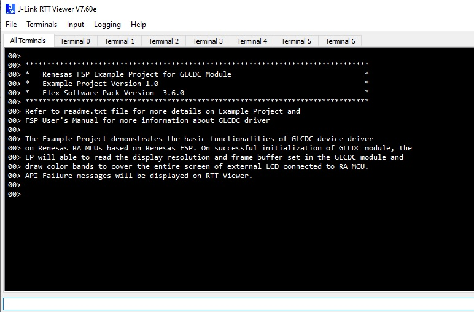
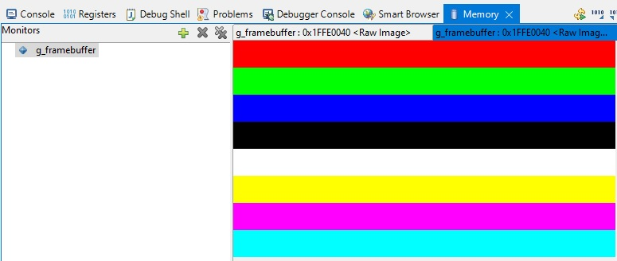

# Introduction #

This Example Project demonstrates the basic functionalities of the GLCDC device driver on Renesas RA MCUs based on Renesas FSP. On successful initialization of the GLCDC module,
the EP will read the display resolution and frame buffer set in the GLCDC module and draw color bands to cover the entire screen of external LCD connected to RA MCU.
User can view raw image in e2studio IDE. Errors and Status information will be printed on Jlink RTT Viewer during the execution of the project.

Please refer to the [Example Project Usage Guide](https://github.com/renesas/ra-fsp-examples/blob/master/example_projects/Example%20Project%20Usage%20Guide.pdf) 
for general information on example projects and [readme.txt](./readme.txt) for specifics of operation.

## Required Resources ##
To build and run the GLCDC example project, the following resources are needed.

### Hardware ###
* Renesas RA boards: EK-RA6M3G
* Micro USB cable
* Host Machine 

Refer to [readme.txt](./readme.txt) for information on how to connect the hardware.

### Software ###
* Renesas Flexible Software Package (FSP): Version 5.9.0
* e2 studio: Version 2025-04
* SEGGER J-Link RTT Viewer: Version 8.12f
* GCC ARM Embedded Toolchain: Version 13.2.1.arm-13-7

Refer to software requirements mentioned in [Example Project Usage Guide](https://github.com/renesas/ra-fsp-examples/blob/master/example_projects/Example%20Project%20Usage%20Guide.pdf)

## Related Collateral References ##
The following documents can be referred to for enhancing your understanding of 
the operation of this example project:
- [FSP User Manual on GitHub](https://renesas.github.io/fsp/)
- [FSP Known Issues](https://github.com/renesas/fsp/issues)

# Project Notes #

## System Level Block Diagram ##

## FSP Modules Used ##
List all the various modules that are used in this example project. Refer to the FSP User Manual for further details on each module listed below.

| Module Name | Usage  | Searchable Keyword (using New Stack > Search) |
|-------------|-----------------------------------------------|-----------------------------------------------|
| Graphics LCD | With GLCDC driver, user can reposition, alpha blend, color correct, dither and convert to and from a wide variety of pixel formats.| GLCD |

## Module Configuration Notes ##
This section describes FSP Configurator properties that are important or different from those selected by default. 

|   Module Property Path and Identifier   |   Default Value   |   Used Value   |   Reason   |
| :-------------------------------------: | :---------------: | :------------: | :--------: |
|   configuration.xml -> BSP > Property > Main Stack Size(bytes)  |  0x400   | 0x800  |  Modified main stack size to accomodate function calls |
|   configuration.xml -> BSP > Property > Heap Size(bytes)  |  0   | 0x400  |  Changed heap size to accomodate functions usage in the EP and avoid any runtime errors |
|   configuration.xml -> g_display Graphics LCD (r_glcdc) > Settings > Property > Module  >  Input > Graphics Layer 1  > General > Enabled | Yes | Yes | Enabling this option to create framebuffer that is required for color band display |
|   configuration.xml -> g_display Graphics LCD (r_glcdc) > Settings > Property > Module  >  Input > Graphics Layer 1  > General > Horizontal size | 480 | 480 | Horizontal pixel value of LCD used is 480 |
|   configuration.xml -> g_display Graphics LCD (r_glcdc) > Settings > Property > Module  >  Input > Graphics Layer 1  > General > Vertical size | 272 | 272 | Vertical pixel value of LCD used is 272 |
|   configuration.xml -> g_display Graphics LCD (r_glcdc) > Settings > Property > Module  >  Input > Graphics Layer 1  > General > Color format | RGB565(16 bit) | RGB565(16 bit) | The LCD board is designed in RGB565 format |
|   configuration.xml -> g_display Graphics LCD (r_glcdc) > Settings > Property > Module  >  Input > Graphics Layer 1  > Framebuffer > Number of framebuffers | 2 | 2 | Using a double-buffer allows one to be output to the LCD while the other is being drawn to memory, eliminating tearing and in some cases reducing bus load. Even though this example does not demonstrate this effect, this is an example of a typical graphics application setting |
|   configuration.xml -> g_display Graphics LCD (r_glcdc) > Settings > Property > Module  >  Output > Timing  > Horizontal Total Cycles  |   525   |   525  |   Typical value for horizontal period time for parallel RGB input as per LCD datasheet  |
|   configuration.xml -> g_display Graphics LCD (r_glcdc) > Settings > Property > Module  >  Output > Timing  > Horizontal active video cycles  |   480   |   480  |  Horizontal display area per LCD datasheet |
|   configuration.xml -> g_display Graphics LCD (r_glcdc) > Settings > Property > Module  >  Output > Timing  > Horizontal back porch cycles  |   40   |   40  |   Typical value of number of HSD back porch cycles for parallel RGB input as per LCD datasheet |
|   configuration.xml -> g_display Graphics LCD (r_glcdc) > Settings > Property > Module  >  Output > Timing  > Horizontal sync signal cycles |   1   |   1  |   Typical value of number of Hsync signal assertion cycles |
|   configuration.xml -> g_display Graphics LCD (r_glcdc) > Settings > Property > Module  >  Output > Timing  > Horizontal sync signal polarity |   Low Active   |   Low Active  |   Hsync polarity is active low as per LCD datasheet |
|   configuration.xml -> g_display Graphics LCD (r_glcdc) > Settings > Property > Module  >  Output > Timing  > Vertical total lines |   316   |   316  |   Typical value of total lines in a frame |
|   configuration.xml -> g_display Graphics LCD (r_glcdc) > Settings > Property > Module  >  Output > Timing  > Vertical active video lines |   272   |   272  |   Vertical display area per LCD datasheet |
|   configuration.xml -> g_display Graphics LCD (r_glcdc) > Settings > Property > Module  >  Output > Timing > Vertical back porch lines |   8   |   8  |  Typical value of number of VSD back porch cycles for parallel RGB input as per LCD datasheet |
|   configuration.xml -> g_display Graphics LCD (r_glcdc) > Settings > Property > Module  >  Output > Timing > Vertical sync signal lines |   1   |   1  | Typical value of Vsync signal assertion line |
|   configuration.xml -> g_display Graphics LCD (r_glcdc) > Settings > Property > Module  >  Output > Timing > Vertical sync signal polarity |  Low active | Low active | VSD polarity control bit is low active by default as per LCD datasheet |
|   configuration.xml -> g_display Graphics LCD (r_glcdc) > Settings > Property > Module  >  Output > Timing > Data Enable Signal Polarity | High active | High active | DE polarity is active high by default as per LCD datasheet |
|   configuration.xml -> g_display Graphics LCD (r_glcdc) > Settings > Property > Module  >  Output > Timing > Sync edge | Rising edge | Rising edge | Sync signal is rising edge for LCD |
|   configuration.xml -> g_display Graphics LCD (r_glcdc) > Settings > Property > Module  >  Output > Format > Color format | 16bits RGB565 | 16bits RGB565 | The LCD board is designed in RGB565 format |
|   configuration.xml -> g_display Graphics LCD (r_glcdc) > Settings > Property > Module  >  TCON > Hsync pin select | LCD_TCON0 | LCD_TCON0 | LCD_TCON0 is selected as the respective pin is Hsync pin for the board |
|   configuration.xml -> g_display Graphics LCD (r_glcdc) > Settings > Property > Module  >  TCON > Vsync pin select | LCD_TCON1 | LCD_TCON1 | LCD_TCON1 is selected as the respective pin is Vsync pin for the board |
|   configuration.xml -> g_display Graphics LCD (r_glcdc) > Settings > Property > Module  >  TCON > Data enable (DE) pin select | LCD_TCON2 | LCD_TCON2 | LCD_TCON2 is selected as the respective pin id DE pin for the board |
|   configuration.xml -> g_display Graphics LCD (r_glcdc) > Settings > Property > Module  >  TCON > Panel clock source | GLCDCCLK | GLCDCLK | Internal clock PCLKA is selected |
|   configuration.xml -> g_display Graphics LCD (r_glcdc) > Settings > Property > Module  >  TCON > Panel clock division ratio | 1/24 | 1/24 | Divider selection for generation of required specific frequency to the panel |

## API Usage ##

The table below lists the GLCDC API used at the application layer by this example project.

| API Name    | Usage                                                                          |
|-------------|--------------------------------------------------------------------------------|
|R_GLCDC_Open| Open GLCDC module. |
|R_GLCDC_Start| Start GLCDC module. |

## Verifying operation ##
Import, Build and Debug the EP(see section Starting Development of **FSP User Manual**). After running the EP, open the RTT viewer to view status or
check any error messages.
User can view the raw image in e2studio IDE using Memory Monitor. User has to add "g_framebuffer" under "Monitor" and add rendering as Raw Image.
The output can also be seen in LCD screen.
Before running the example project, refer to the below steps for hardware connections :
* Connect RA MCU debug port to the host PC via a micro USB cable. 

The below images showcase the output on JLink RTT Viewer and in the Memory Monitor view in e2 studio, respectively:

## Special Topics ##
In this example project, the BLEN (backlight enable) pin, which is P603, is set GPIO mode, initially high in the Pin configuration. 
But it is recommended to use the P603 as a PWM output function (GPT7's GTIOCA) to control the brightness of the LCD backlight and reduce power consumption.

