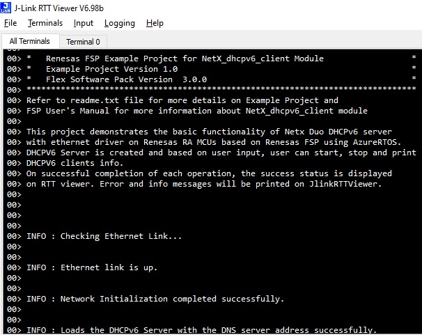

# Introduction #

The sample code accompanying this file shows the operation of a NetX Duo DHCPv6 Server on a RA MCU using Azure RTOS. 
In this sample code, a NetX Duo IP instance is created with IP address as (default 0.0.0.0 - Not assigned). 
The Server is always configured with the IP address, In this EP 2001.EE08.0.0.0.0.0.2 is the IP address of the Board (DHCP Server). 
The NetX stack is enabled for UDP, ICMP, ARP, IPV6, ICMPv6. DHCP Server uses the UDP protocol to receive DHCP Client requests and transmit responses. 
DHCP Server creates its packet pool based on the settings minimum packet payload size and number of packets in the packet pool. 
It creates pool of IPv6 addresses from the given range, and set server DUID. The DNS IPV6 address is updated for DHCPV6 server database, 
so that when the Clients request for IP address, DHCPV6 server also provides the DNS server info the clients.

Once the DHCPv6 Server is running and has created client records and assigned IP addresses, it
periodically checks the time remaining on each of the client IP leases. If a lease expires, the server simply
removes the client record from the client record table and returns that IP address back to the pool of
assignable IP addresses. No message is sent to the client.

The status messages, client's info, and the code flow informational messages as part of the initialization are displayed on the JlinkRTTViewer.

**Note :** Range of IPv6 address for clients are from 2001.EE08.0.0.0.0.0.110 to 2001.EE08.0.0.0.0.0.150.

NetX Duo DHCPV6 Server is compliant with [RFC3315](https://tools.ietf.org/html/rfc3315) , [RFC3646](https://tools.ietf.org/html/rfc3646) , and related RFCs.

Please refer to the [Example Project Usage Guide](https://github.com/renesas/ra-fsp-examples/blob/master/example_projects/Example%20Project%20Usage%20Guide.pdf) 
for general information on example projects and [readme.txt](./readme.txt) for specifics of the operation.

## Required Resources ##
To build and run the dhcpv6 server example project, the following resources are needed.

### Hardware ###
* Renesas RA™ MCU kit with Ethernet Support
* Micro USB cable
* Host Machine
* Ethernet cable

Refer to [readme.txt](./readme.txt) for information on how to connect the hardware.

### Software ###
Refer to software requirements mentioned in [Example Project Usage Guide](https://github.com/renesas/ra-fsp-examples/blob/master/example_projects/Example%20Project%20Usage%20Guide.pdf)

## Related Collateral References ##
The following documents can be referred to for enhancing your understanding of 
the operation of this example project:
- [FSP User Manual on GitHub](https://renesas.github.io/fsp/)
- [FSP Known Issues](https://github.com/renesas/fsp/issues)

# Project Notes #

## System Level Block Diagram ##

## FSP Modules Used ##
List all the various modules that are used in this example project. Refer to the FSP User Manual for further details on each module listed below.

| Module Name | Usage  | Searchable Keyword (using New Stack > Search) |
|-------------|-----------------------------------------------|-----------------------------------------------|
| NetX Duo DHCP IPV6 Server | DHCPV6 Server module is used to provide and assign dynamic global IPv6 address automatically, default gateways, and other network parameters to dhcpv6 Client devices.| dhcp |

## Module Configuration Notes ##
This section describes FSP Configurator properties that are important or different from those selected by default. 

|   Module Property Path and Identifier   |   Default Value   |   Used Value   |   Reason   |
| :-------------------------------------: | :---------------: | :------------: | :--------: |
|   configuration.xml -> BSP > Properties > Settings > Property > Heap Size (bytes)| 0 |0x400| Heap size is required for standard library functions to be used as per FSP requirements. |
|   configuration.xml -> DHCPV6 Server Thread > Settings > Property > Thread > priority  |   1   |   2   |   DHCPV6 server thread priority is lowered to allow the IP thread to process incoming packets at the fastest rate possible.   |
|   configuration.xml -> RTT Thread > Settings > Property > Thread > priority  |   1   |   3   |   RTT thread priority is lowered to allow the DHCP server and IP threads to process incoming packets at the fastest rate possible.   |
|   configuration.xml -> DHCPV6 Server Thread > g_ether0 Ethernet driver on r_ether > Settings > General > MAC address  |   00:11:22:33:44:55   |   00:11:22:33:44:66   |   Sets the MAC address, as server and client can not use same MAC address.   |

## API Usage ##

The table below lists the DHCPV4 Server API used at the application layer by this example project.

| API Name    | Usage                                                                          |
|-------------|--------------------------------------------------------------------------------|
|nx_dhcpv6_create_dns_address| This API is used to create a DNS IPv6 address. |
|nx_dhcpv6_set_server_duid| This API is used to set server DUID.|
|nx_dhcpv6_create_ip_address_range| This API is used to create the dhcpv6 IP address range.|
|nx_dhcpv6_server_start| This API is used to start DHCPV6 Server processing.|

## Verifying operation ##
Import, Build and Debug the EP(see section Starting Development of **FSP User Manual**). After running the EP, open RTT viewer to see the output.
Before running the example project, refer to the below steps for hardware connections :
* Connect RA MCU debug port to the host PC via a micro USB cable. 
* Connect an Ethernet cable to the RJ45 connector on RA MCU and connect another end to the ethernet port of PC/another RA board where dhcpv6 client is residing.

**Note**: 
* On RA6 devices (RA6M4/RA6M5), Ethernet may fail if TrustZone memory boundaries are not properly configured, even for flat applications. When debugging with e² studio, the required TrustZone boundaries (IDAU) for Ethernet operation are configured automatically but these settings are not applied when programming the device using a standalone method (e.g., via a HEX file). In such cases, users must configure the TrustZone memory partitions using Renesas Device Partition Manager (RDPM) or Renesas Flash Programmer.
* For more information on configuring TrustZone on RA devices, refer to: https://www.renesas.com/en/document/apn/security-design-arm-trustzone-using-cortex-m33 

**Steps to be followed when using another RA board as dhcpv6 client :**
* Presuming all necessary hardware connections done, run the dhcpv6 server EP on RA board and based on menu option, start the server.
* once the server is started, run the dhcpv6 client EP on another RA board and observe the output/info on RTT viewer.

Below image showcases the hardware connection setup required for running the EP :

Below images showcases the output on JLinkRTT_Viewer :

## Special Topics ##
If EP is not working in terms of network connection/ip, please re-check [readme.txt](./readme.txt).
