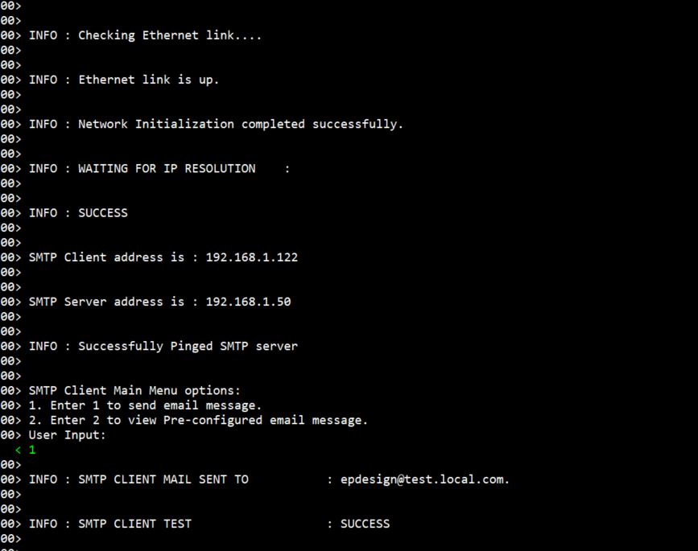

# Introduction #

The sample code accompanying this file shows the operation of a NetX Duo SMTP Client on a RA MCU using Azure RTOS. 
In this sample code, a NetX Duo IP instance is created with IP address as (default 0.0.0.0 - Not assigned). 
The NetX stack is enabled for TCP, ICMP, ARP, IPV4. SMTP Client utilizes the reliable Transmission Control Protocol 
(TCP) services to perform its content transfer function.

SMTP Client creates its packet pool based on the settings minimum packet payload size and number of packets in the packet pool. 
When SMTP Client is created and started, NetX Duo SMTP Client creates a new TCP connection with the SMTP server and begins an SMTP session. In this session, 
the Client sends a series of commands to the SMTP Server as part of the SMTP protocol, culminating in sending out the actual mail message. 
The TCP connection is then terminated, regardless of the outcome of the SMTP session. 

After mail transmission, regardless of success or failure, the SMTP client is returned to the initial state and can be used for another mail transfer session.
The status messages, Client IP addresses, and the code flow informational messages as part of the initialization are displayed on the JlinkRTTViewer.

NetX Duo SMTP Client is compliant with [RFC2821](https://tools.ietf.org/html/rfc2821) , [RFC2554](https://tools.ietf.org/html/rfc2554) , and related RFCs.

Please refer to the [Example Project Usage Guide](https://github.com/renesas/ra-fsp-examples/blob/master/example_projects/Example%20Project%20Usage%20Guide.pdf) 
for general information on example projects and [readme.txt](./readme.txt) for specifics of operation.

## Required Resources ##
To build and run the SMTP client example project, the following resources are needed.

### Hardware ###
* Renesas RA™ MCU kit with Ethernet Support
* Micro USB cable
* Host Machine 
* Ethernet cable
* Ethernet switch

Refer to [readme.txt](./readme.txt) for information on how to connect the hardware.

### Software ###
* Local SMTP mail server(e.g Argo soft mail server)
      Note: One of the mail servers used here for testing is Argo soft mail server.
* Refer to software requirements mentioned in [Example Project Usage Guide](https://github.com/renesas/ra-fsp-examples/blob/master/example_projects/Example%20Project%20Usage%20Guide.pdf)

## Related Collateral References ##
The following documents can be referred to for enhancing your understanding of 
the operation of this example project:
- [FSP User Manual on GitHub](https://renesas.github.io/fsp/)
- [FSP Known Issues](https://github.com/renesas/fsp/issues)

# Project Notes #

## System Level Block Diagram ##

## FSP Modules Used ##
List all the various modules that are used in this example project. Refer to the FSP User Manual for further details on each module listed below.

| Module Name | Usage  | Searchable Keyword (using New Stack > Search) |
|-------------|-----------------------------------------------|-----------------------------------------------|
| NetX Duo SMTP Client | SMTP is a protocol for transferring mail across networks and the Internet. It utilizes the reliable Transmission Control Protocol (TCP) services to perform its content transfer function.| smtp |

## Module Configuration Notes ##
This section describes FSP Configurator properties that are important or different from those selected by default. 

|   Module Property Path and Identifier   |   Default Value   |   Used Value   |   Reason   |
| :-------------------------------------: | :---------------: | :------------: | :--------: |
|   configuration.xml -> g_smtp_client0 NetX Duo SMTP Client > Settings > Property > Module  > azure > nxd_smtp_client > address_type  |  ipv6    | ipv4 |  selects server address type.  |
|   configuration.xml -> g_smtp_client0 NetX Duo SMTP Client > Settings > Property > Module  > azure > nxd_smtp_client > server_address_ipv4  |  192.168.0.2   |  132.158.124.88  |  set up the SMTP Server IP address. User can configure this as per their network environment |
|   configuration.xml -> g_smtp_client0 NetX Duo SMTP Client > Settings > Property > Module  > azure > nxd_smtp_client > client_name  |  username  |   epdesign   |  The host username during SMTP authentication with the Server  |
|   configuration.xml -> g_smtp_client0 NetX Duo SMTP Client > Settings > Property > Module  > azure > nxd_smtp_client > client_password  |  password    |   epdesign   | The user password during SMTP authentication with the Server. |
|   configuration.xml -> g_smtp_client0 NetX Duo SMTP Client > Settings > Property > Module  > azure > nxd_smtp_client > client_address  |  username@domain.com    |   epdesign@test.local.com   |  Specify the sender address were message is to be delivered. |
|   configuration.xml -> g_smtp_client0 NetX Duo SMTP Client > Settings > Property > Module  > azure > nxd_smtp_client > client_domain  |  domain.com   |   test.local.com    |  selects domain name.  |
|   configuration.xml -> g_smtp_client0 NetX Duo SMTP Client > Settings > Property > Module  > azure > ip > address  |  192.168.0.2   |    132.158.124.108   |  set up the SMTP Client IP address. User can configure this as per their network environment   |
|   configuration.xml -> g_smtp_client0 NetX Duo SMTP Client > Settings > Property > Module  > azure > ip > subnet_mask  |  255.255.255.0  |   255.255.255.128    |  selects the subnet mask.  |
|   configuration.xml -> RTT Thread > Settings > Property > Thread > priority  |   1   |   2   |   RTT thread priority is lowered to allow the DHCP Client and IP threads to process incoming packets at the fastest rate possible.   |

## API Usage ##

The table below lists the SMTP Client API used at the application layer by this example project.

| API Name    | Usage                                                                          |
|-------------|--------------------------------------------------------------------------------|
|nxd_smtp_client_create| This API creates an SMTP Client instance on the specified IP instance. |
|nx_smtp_mail_send| This API creates and sends an SMTP mail item |
|nx_ip_fragment_enable| This API enables IPv4 and IPv6 packet fragmenting and reassembling functionality |
|nx_ip_status_check| This API checks and optionally waits for the specified status of the primary network interface of a previously created IP instance. |
|nx_ip_address_get| This API retrieves IPv4 address. |
|nx_icmp_ping| This API sends a ping request to the specified IP address and waits for the specified amount of time for a ping response message. |
|nx_packet_release| This API releases a packet, including any additional packets chained to the specified packet. |

## Verifying operation ##
Import, Build and Debug the EP(see section Starting Development of **FSP User Manual**). After running the EP, open the RTT viewer to see the output.
Before running the example project, refer to the below steps for hardware connections :
* Connect RA MCU debug port to the host PC via a micro USB cable. 
* Connect an Ethernet cable to the RJ45 connector on RA MCU via ethernet switch which is connected to the Host machine where the SMTP server is residing.
* A SMTP Server needs to exist on the network to run SMTP Client Example Project on the RA MCU board.

Below image showcases the hardware connection setup required for running the EP :

Below images showcases the output on JLinkRTT_Viewer :

## Special Topics ##
Running the SMTP Server
 * Users can use any local SMTP mail server, but one used for testing is ArgoSoft Mail Server.
 * Following are the steps to run ArgoSoft Mail Server.
   1. Download and Install the server from link [Argosoft Mail Server](https://www.argosoft.com/rootpages/download)
   2. Run the MailServerUi file and configure the server 
   3. On running the server the first time it asks to accept the 30 days free trial version.
   4. On accepting, it asks to add a domain name, where we need to add a domain name as test.local.com
	   
   5. Once the domain name is added it ask to configure Username and Password and Confirm Password
      User can add Username: epdesign, Password: epdesign, and Confirm Password: epdesign.
	  
	  **Note**: The username, password, and confirm password should be entered same as configured in configuration property Client Name and Client Password under g_smtp_client0 Netx Duo SMTP Client. 
	  	
   6. To Confirm all the above have been configured correctly User can go to User and expand domain -> default, expand default, and check if a domain name is test.local.com added or not.
   7. Then Go to epdesign and click edit, and check Username it should appear as epdesign as configured previously.
	  	
   8. Once all the above configurations are done and verified User can start the server.
   
Step to Validate the email from the Client
 * In Argo Softmail server go to Users -> Mailbox and click on it, to view the sent mail by the client.
   
 * Also to check the detailed communication log between server and client user can check under logs ->  View logs