# Introduction #

This example project demonstrates the use of the Azure NetX Duo network stack over the USBX RNDIS module on an RA MCU. It performs various network operations leveraging NetX Duo. The RA board creates a DHCP server and assigns the dynamic IP address for the host PC. The RA board and the host PC are directly linked via a point-to-point Ethernet connection over a USB cable. After obtaining the IP address, the project enables the user to interact with a menu through the J-Link RTT Viewer or a terminal application on the host PC.

The available operations include:
* TCP Client Service: Connect to a server, send a request, wait for a response from the server, and disconnect from the server.
* UDP Client Service: Send a request and wait for a response from the server.
* Web HTTP Server: Handle HTTP requests from the browser, including requesting the homepage, retrieving board network configuration, controlling onboard LEDs, and requesting the status of onboard LEDs.

The menu options:
* Type `1 <x.x.x.x>:<port>` to perform TCP client operation.
* Type `2 <x.x.x.x>:<port>` to perform UDP client operation.
* Type `3` to start the web HTTP server.

Notes: 
* For RA boards that do not support J-Link OB VCOM,  EP information is communicated to the user via host PC exclusively through the SEGGER J-Link RTT Viewer.
    * The board does not support J-Link OB VCOM: EK-RA6M5.
* For the RA boards support J-Link OB VCOM, the EP uses the Serial Terminal by default instead.

Please refer to the [Example Project Usage Guide](https://github.com/renesas/ra-fsp-examples/blob/master/example_projects/Example%20Project%20Usage%20Guide.pdf) 
for general information on example projects and [readme.txt](./readme.txt) for specifics of operation.

## Required Resources ## 
To build and run the example project, the following resources are needed.

### Hardware Requirements ###
* Supported RA boards: EK-RA6M5
* 1 x RA Board.
* 2 x Micro USB cables.
    * One cable is used for firmware programming and debugging via the onboard debugger.
    * The other cable connects the RA board to a host PC and acts as a USB network interface, allowing network communication over USB.

### Hardware Connections  ###
* General: Connect the RA Board to the Host PC: Using a micro-USB cable, connect the RA board's [DEBUG] port to the host PC. This connection is necessary
  for programming the RA board, enabling debugging, and displaying runtime information in the terminal or RTT Viewer on the host PC.
* For the specific RA boards, to establish network connectivity, connect any 1 port (High speed or Full Speed) of the RA board's USB Port to the Host PC following the below introductions:
    * EK-RA6M5:
        * High Speed (Default):
            * Connect the RA board's USB HS port (J31 connector) to the Host PC using a micro USB cable.
            * Connect the jumper J17 pins.
            * Short Pin 2-3 of jumper J7.
        * Full Speed:
            * Connect the RA board's USB FS port (J11 connector) to the Host PC using a micro USB cable.
            * Connect the jumper J15 pins.
            * Short Pin 2-3 of jumper J12.

### Software Requirements ###
* Renesas Flexible Software Package (FSP): Version 6.2.0
* e2 studio: Version 2025-10
* GCC ARM Embedded Toolchain: Version 13.2.1.arm-13-7
* Terminal Console Application: Tera Term version 4.99
* SEGGER J-Link RTT Viewer: Version 8.74
* Web Browser Application: Microsoft Edge, Google Chrome
* Socket Application: Sokit
* RNDIS (Remote Network Driver Interface Specification) driver installed to recognize the MCU as a USB Ethernet interface.

Refer to the software required section in [Example Project Usage Guide](https://github.com/renesas/ra-fsp-examples/blob/master/example_projects/Example%20Project%20Usage%20Guide.pdf)

## Related Collateral References ##
The following documents can be referred to for enhancing your understanding of 
the operation of this example project:
- [FSP User Manual on GitHub](https://renesas.github.io/fsp/)
- [FSP Known Issues](https://github.com/renesas/fsp/issues)

# Project Notes #

## System Level Block Diagram ##
**The high-level block diagram of the system is shown below:**

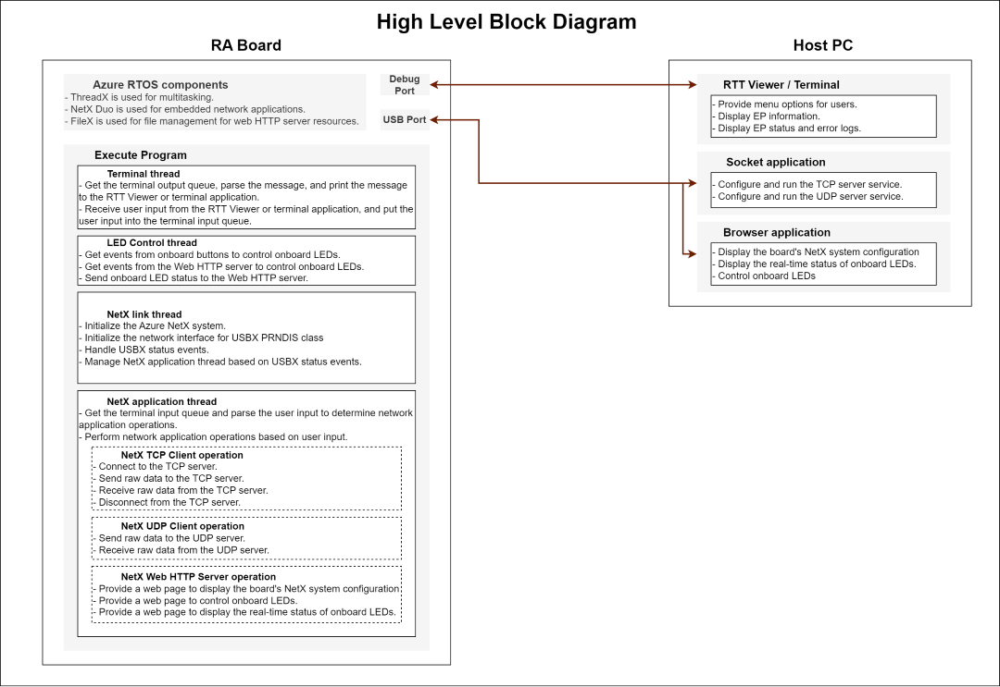

**The Thread interaction flow diagram of the system is shown below:**

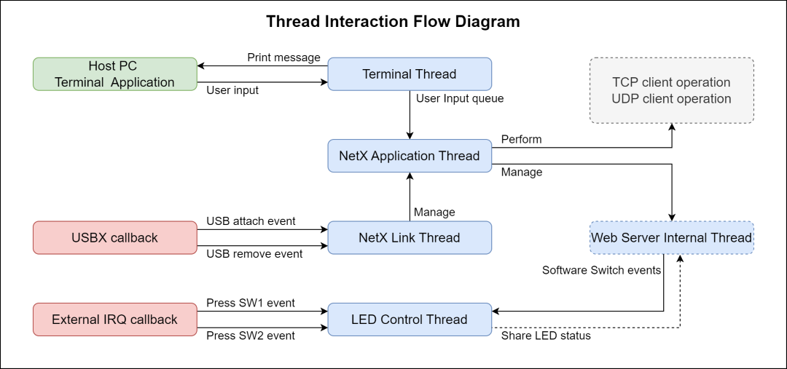

**The web server homepage of the system is shown below:**

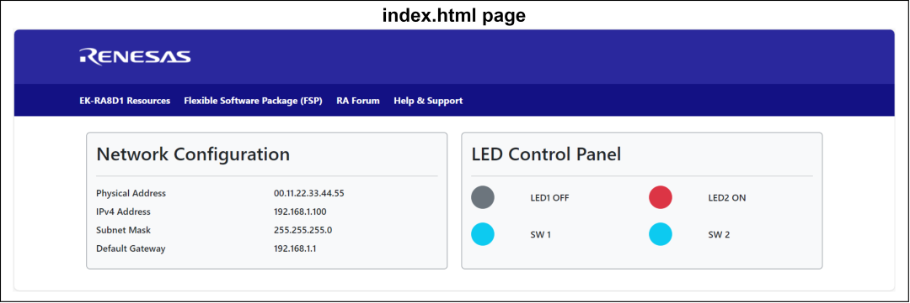

## FSP Modules Used ##
List all the various modules that are used in this example project. Refer to the FSP User Manual for further details on each module listed below.

| Module Name | Usage | Searchable Keyword  |
|-------------|-----------------------------------------------|-----------------------------------------------|
| NetX Duo Web HTTP/HTTPS Server | The NetX Duo Web HTTP/HTTPS Server is used to access the NetX Duo Web HTTP/HTTPS Server library. | NetX Duo Web HTTP/HTTPS Server |
| NetX Duo DHCP IPv4 Server | The NetX Duo DHCP IPv4 Client is used to assigns the dynamic IP address for the host PC. | NetX Duo DHCP IPv4 Server |
| NetX Duo IP Instance | The NetX Duo IP instance is used for IP communication. The HTTPS Client uses IPv4. | NetX Duo IP |
| NetX Duo Packet Pool | The NetX Duo Packet Pool is used to send and receive data packets over a TCP network. | NetX Duo Packet Pool |
| NetX Duo Ethernet Driver | An Ethernet connection is required as a physical connection to the network. | NetX Duo Ethernet Driver |
| FileX on Block Media | The FileX on Block Media is used to configure the FileX system and media properties. | FileX on Block Media |
| Block Media SPI Flash | The Block Media SPI Flash is middleware that implements a block media interface using external SPI flash as a media area. | rm_block_media_spi |
| QSPI Flash | The QSPI Flash is used to communicate directly with the external flash chip. | r_qspi |

## Module Configuration Notes ##
This section describes FSP configuration properties that are important or different from those selected by default.

|   Module Property Path and Identifier   |   Default Value  |   Used Value   |   Reason   |
|-----------------------------------------|-------------------|----------------|------------|
| configuration.xml > BSP > Properties > Settings > Property > Main Stack Size (bytes) | 0x400 | 0x2000 | The stack size is increased to handle larger local variables required for the main thread. |
| configuration.xml > BSP > Properties > Settings > Property > Heap Size (bytes) | 0 | 0x2000 | Heap size is allocated to enable dynamic memory allocation for standard library functions. |
| configuration.xml > Net Link Thread > Properties > Settings > Property > Thread > Auto start | Enabled | Disabled | Manual control of when the Net Link thread starts allows better flow management. |
| configuration.xml > Net Link Thread > Properties > Settings > Property > Common > Timer Ticks Per Second | 100 | 1000 | Timer Ticks Per Second for Azure RTOS must set to 1000. |
| configuration.xml > Net App Thread > Properties > Settings > Property > Thread > Auto start | Enabled | Disabled | Manual control of when the Net App Thread starts to ensure readiness of dependencies. |
| configuration.xml > Net App Thread > Properties > Settings > Property > Thread > Stack size (bytes) | 1024 | 4096 | Increased stack size to handle more complex operations or a larger number of local variables. |
| configuration.xml > g_fx_media0 Azure RTOS FileX on Block Media > Properties > Settings > Property > Module g_fx_media0 > Total Sectors | 65536 | 32 | Set for the specific total number of sectors of the block media. |
| configuration.xml > g_fx_media0 Azure RTOS FileX on Block Media > Properties > Settings > Property > Module g_fx_media0 > Bytes per Sector | 512 | 4096 | Set for the specific bytes per sector of the block media. |
| configuration.xml > g_rm_filex_block_media_0 FileX I/O (rm_filex_block_media) > Properties > Settings > Property > Module g_rm_filex_block_media_0 > Partition Number | 0 | 1 | Set for the specific partition number of the block media. |
| configuration.xml > g_rm_block_media0 Block Media SPI Flash (rm_block_media_spi) > Properties > Settings > Property > Module g_rm_block_media0 > Block count | 8192 | 32 | Set for the specific number of sectors of the external flash. |
| configuration.xml > g_qspi0 QSPI Flash (r_qspi0) > Properties > Settings > Property > Module g_qspi0 > General > Address Bytes | 3 | 3 | Set for the specific number of address bytes by default for the external flash. |
| configuration.xml > g_qspi0 QSPI Flash (r_qspi0) > Properties > Settings > Property > Module g_qspi0 > General > Read Mode | Fast Read Quad I/O | Standard Read | Set for the specific read mode for the external flash. |
| configuration.xml > g_dhcp_server0 Azure RTOS NetX Duo DHCP IPv4 Server > Properties > Settings > Property > Common > Common > Maximum Physical Interfaces | 1 | 2 | Set the supported physical interfaces to 2 for USB RNDIS interface. |
| configuration.xml > g_dhcp_server0 Azure RTOS NetX Duo DHCP IPv4 Server > Properties > Settings > Property > Common > Common > Periodic IPv6 router solicitation messages support | Enable | Disable | Disable the periodic IPv6 router solicitation messages support. |
| configuration.xml > g_external_irq_sw1 External IRQ (r_icu) > Properties > Settings > Property > Module g_external_irq_sw1 > Channel | 0 | 10 | Channel set to 10 to match the external interrupt pin. |
| configuration.xml > g_external_irq_sw1 External IRQ (r_icu) > Properties > Settings > Property > Module g_external_irq_sw1 > Callback | NULL | external_irq_sw1_callback | Callback function for handling external interrupts on SW1. |
| configuration.xml > g_external_irq_sw2 External IRQ (r_icu) > Properties > Settings > Property > Module g_external_irq_sw2 > Channel | 0 | 9 | Channel set to 9 to match the external interrupt pin. |
| configuration.xml > g_external_irq_sw2 External IRQ (r_icu) > Properties > Settings > Property > Module g_external_irq_sw2 > Callback | NULL | external_irq_sw2_callback | Callback function for handling external interrupts on SW2. |

## API Usage ##
The table below lists the FSP provided API used at the application layer in this example project.

**USBX APIs**
| API Name    | Usage                                                                          |
|-------------|--------------------------------------------------------------------------------|
| ux_system_initialize | This API is used to initialize the USBX system resources in preparation for use. |
| ux_device_stack_initialize | This API is used to initialize the generic portion of the device side of USBX. |
| ux_device_stack_class_register | This API is used to register a device class to the device stack. |
| ux_network_driver_init | This API is used to initialize the USBX portion of the network driver. |
| R_USB_Open | This API is used to register a device class to the device stack. |

**NetX Duo APIs**
| API Name    | Usage                                                                          |
|-------------|--------------------------------------------------------------------------------|
| nx_system_initialize | This API is used to initialize the basic NetX Duo system resources in preparation for use. |
| nx_packet_pool_create | This API is used to attach the USBX RNDIS as secondary interface to the IP instance. |
| nx_ip_interface_attach | This API is used to create a packet pool of the specified packet size in the memory area supplied by the user. |
| nx_packet_allocate | This API is used to allocate a packet from the specified pool and adjust the prepend pointer in the packet according to the type of packet specified. |
| nx_packet_data_append | This API is used to append data to the end of the specified packet. |
| nx_packet_data_retrieve | This API is used to copy data from the supplied packet into the supplied buffer. |
| nx_packet_release | This API is used to release a packet, including any additional packets chained to the specified packet. |
| nx_ip_create | This API is used to create an IP instance with the user supplied IP address and network driver. |
| nx_ip_interface_status_check | This API is used to check and optionally waits for the specified status of the specific network interface of a previously created IP instance. |
| nx_ip_interface_physical_address_get | This API is used to retrieve the physical address of a network interface from the IP instance. |
| nx_interface_address_get | This API is used to retrieve IPv4 address and its subnet mask of the specific network interface. |
| nx_arp_enable | This API is used to initialize the ARP component of NetX Duo for the specific IP instance. |
| nx_icmp_enable | This API is used to enable the ICMP component for the specified IP instance. |
| nx_icmp_ping | This API is used to send a ping request to the specified IP address and waits for the specified amount of time for a ping response message. |
| nx_udp_enable | This API is used to enable the User Datagram Protocol (UDP) component of NetX Duo. |
| nx_tcp_enable | This API is used to enable the Transmission Control Protocol (TCP) component of NetX Duo. |
| nx_dhcp_server_create | This API is used to create a DHCP Server for the previously created IP instance. |
| nx_dhcp_create_server_ip_address_list | This API is used to create a list of available IP addresses for DHCP clients on the specified interface. |
| nx_dhcp_set_interface_network_parameters | This API is used to set the DHCP server default options for network critical parameters as gateway, dns server and network mask for the specified interface. |
| nx_dhcp_server_start | This API is used to initialize the DHCP processing thread and offers the network parameters to DHCP clients. |
| nx_tcp_socket_create | This API is used to create a TCP client or server socket for the specified IP instance. |
| nx_tcp_client_socket_bind | This API is used to bind the previously created TCP client socket to the specified TCP port. |
| nx_tcp_client_socket_unbind | This API is used to release the binding between the TCP client socket and a TCP port. |
| nx_tcp_client_socket_connect | This API is used to connect the previously created and bound TCP client socket to the specified server's port. |
| nx_tcp_socket_disconnect | This API is used to disconnect an established client or server socket connection. |
| nx_tcp_socket_receive | This API is used to receive TCP data from the specified socket. |
| nx_tcp_socket_send | This API is used to send TCP data through a previously connected TCP socket. |
| nx_udp_socket_create | This API is used to create a UDP socket for the specified IP instance. |
| nx_udp_socket_bind | This API is used to bind the previously created UDP socket to the specified UDP port. |
| nx_udp_socket_unbind | This API is used to release the binding between the UDP socket and a UDP port. |
| nx_udp_socket_receive | This API is used to receive a UDP data from the specified socket. |
| nx_udp_socket_send | This API is used to send a UDP data through a previously created and bound UDP socket for IPv4 networks. |
| nx_web_http_server_create | This API is used to create an HTTP Server instance, which runs in the context of its own ThreadX thread. |
| nx_web_http_server_start | This API is used to start a previously created HTTP or HTTPS Server instance. |
| nx_web_http_server_stop | This API is used to stop a previously created HTTP or HTTPS Server instance. |
| nx_web_http_server_callback_generate_response_header | This API is used to generate an HTTP response header in the HTTP(S) server callback routine, as defined by the application. |
| nx_web_http_server_callback_packet_send | This API is used to send a complete HTTP server response from an HTTP callback. |

**ThreadX APIs**
| API Name    | Usage                                                                          |
|-------------|--------------------------------------------------------------------------------|
| tx_thread_resume | This API is used to resume a suspended thread. |
| tx_thread_suspend | This API is used to suspend a currently running thread. |
| tx_thread_sleep | This API is used to put the current thread to sleep for a specified number of ticks. |
| tx_thread_info_get | This API is used to retrieve information about a specific thread, such as its state, run count, etc. |
| tx_byte_pool_create | This API is used to create a byte memory pool that can be used for dynamic memory allocation. |
| tx_byte_allocate | This API is used to allocate a block of memory from a byte pool. |
| tx_byte_release | This API is used to release a previously allocated block of memory back to the byte pool. |
| tx_queue_create | This API is used to create a queue that can store and manage messages passed between threads. |
| tx_queue_send | This API is used to send a message to a previously created queue. |
| tx_queue_receive | This API is used to receive a message from a previously created queue. |
| tx_event_flags_create | This API is used to create an event flag group that can be used for thread synchronization. |
| tx_event_flags_set | This API is used to set one or more event flags in a specified event flag group. |
| tx_event_flags_get | This API is used to retrieve the event flags that have been set in a specified event flag group. |

**FileX APIs**
| API Name    | Usage                                                                          |
|-------------|--------------------------------------------------------------------------------|
| fx_system_initialize | This API is used to initialize the FileX file system, preparing it for use. |
| fx_media_open | This API is used to open and initialize a media instance for FileX file operations. |
| RM_FILEX_BLOCK_MEDIA_Open | This API is used to initialize the FileX Block Media interface for the block media driver. |
| RM_FILEX_BLOCK_MEDIA_BlockDriver | This API is used to access block media device functions such as open, close, read, write, and control operations on a block media device. |

## Verifying Operation ##
1. Import, generate, build, download, and run the example project to the RA board using e2 studio on the host PC.
2. Open the terminal application on the host PC and connect to the RA board.
3. Make sure the RNDIS driver is installed successfully. If not, please go to [RNDIS Driver installation](#41-rndis-driver-installation) section
4. Wait for the RA board to obtain the IP address from the router.
5. The RA board's network configuration details and menu options will be displayed in the terminal application.
6. Verify TCP Client Operation:
    1. Launch a socket application on the host PC.
    2. Set up a TCP server by specifying the server's IP address and port number.
    3. Ensure that the server is configured to listen for incoming connections.
    4. In the terminal, type the command: `1 <x.x.x.x>:<port>`. For example, if the server's IP is `192.168.2.10` and the port is `12345`, type: `1 192.168.2.10:12345`.
    5. The RA board will send a TCP request to the server.
    6. The socket application will display the TCP request.
    7. In the socket application, type any data and click Send to respond to the RA board.
    8. The RA board will display the received data in the terminal application.
7. Verify UDP Client Operation:
    1. Launch a socket application on the host PC.
    2. Set up a UDP server by specifying the server's IP address and port number.
    3. Ensure that the server is configured to listen for incoming connections.
    4. In the terminal, type the command: `2 <x.x.x.x>:<port>`. For example, if the server's IP is `192.168.2.10` and the port is `12345`, type: `2 192.168.2.10:12345`.
    5. The RA board will send a UDP request to the server.
    6. The socket application will display the UDP request.
    7. In the socket application, type any data and click Send to respond to the RA board.
    8. The RA board will display the received data in the terminal application.
8. Verify Web Server Operation:
    1. In the terminal, type '3 to start the web server.
    2. Open a web browser on the host PC.
    3. In the URL bar, type: `<x.x.x.x>/index.html` and press Enter, where `<x.x.x.x>` is the IP address of the RA board.
    4. The browser will display the network configuration and LED control panel.
    5. In the LED control panel on the webpage, click on the SW1 or SW2 buttons to toggle LED1 or LED2 on the RA board.
    6. Click on SW1 or SW2 buttons on the RA board to toggle LED1 or LED2.
    7. The RA board will update the LED states dynamically on the webpage.
    8. In the terminal, type any character to stop the web server.

### Note: ###
* For the Serial Terminal application: The macro USE_VIRTUAL_COM is set to 1.
    1. To echo back typed content in Tera Term, go to [Setup] -> [Terminal...] and check [Local echo].
    2. The configuration parameters of the serial port are:
        - COM port: Provided by the J-Link on-board.
        - Baud rate: 115200 bps
        - Data length: 8 bits
        - Parity: None
        - Stop bit: 1 bit
        - Flow control: None

### The below images showcase the output on the terminal application ###
**The EP information**

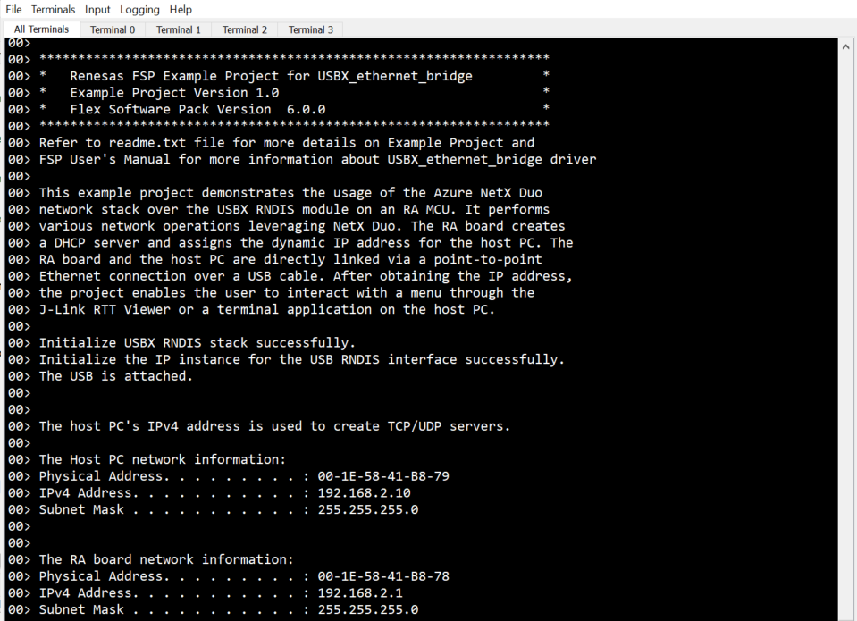

**The TCP client operation**

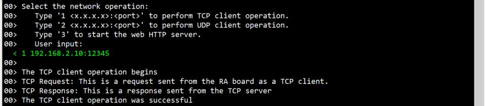

**The UDP client operation**

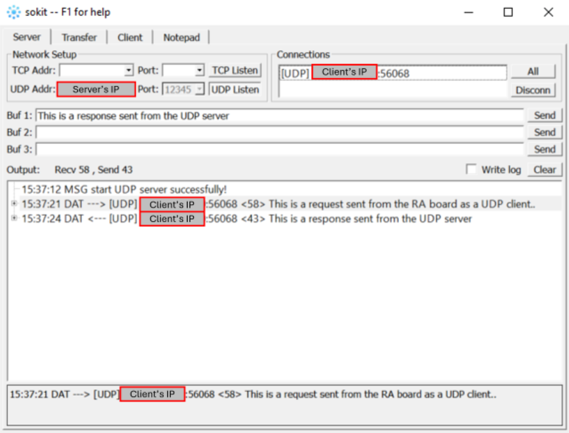

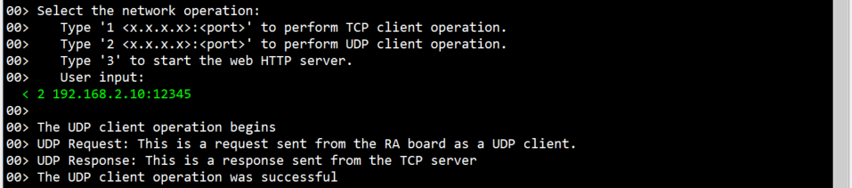

**The Web http server operation**

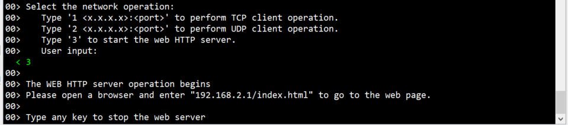

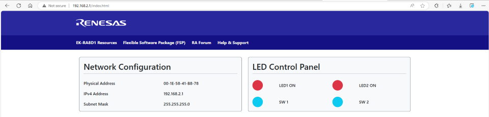

## Special Topics ##
### 1. Additional include path: ###
"The required include paths for the manually added drivers have already been configured to ensure successful compilation. 

The following paths were added to the **Project Properties** -> **C/C++ Build** -> **Settings** -> **Tool Settings** -> **GNU ARM Cross C Compiler** -> **Includes** -> **Include paths (-I)**:

1. ` "${workspace_loc:/${ProjName}/src/ux_network_driver_src}" `
2. ` "${workspace_loc:/${ProjName}/src/ux_device_class_rndis_src}" `

### 2. Terminal notes: ###
* Information can be displayed using either the SEGGER J-Link RTT Viewer or a serial terminal (UART) via J-Link OB VCOM, depending on availability. If J-Link OB VCOM is unsupported, the example project defaults to the SEGGER J-Link RTT Viewer; if supported, it defaults to the serial terminal (UART).
  * To configure display options:
    * **For UART via J-Link OB VCOM**: Define `USE_VIRTUAL_COM=1`
    * **For J-Link RTT Viewer**: Define `USE_VIRTUAL_COM=0`
  * The board does not support J-Link OB VCOM: EK-RA6M5.

Set this in **Project Properties** -> **C/C++ Build** -> **Settings** -> **Tool Settings** -> **GNU ARM Cross C Compiler** -> **Preprocessor**.

### 3. Webserver folder notes: ###
* The `src/webserver` folder contains all the necessary files for the web HTTP server functionality.
* The `src/webserver/website` folder contains all the resources that will be served by the web server.
    * The `index.html` file is the main HTML file for the homepage of the website.
    * The `script.js` file includes all the JavaScript functions used to create dynamic content on the website.
    * The `logo.png` file is the logo displayed on the homepage.
    * The `favicon.ico` file is the small icon that appears in the browser tab for the website.
* The `src/webserver/website.bin` is a file system image containing all the files from the `website` folder in FAT12 format. This image is loaded into the external OSPI flash on the RA board to support FileX operations, which serve as a file system dependency for the web HTTP server.

### 4. Software Introduction ###

#### 4.1. RNDIS Driver installation ####
We must disable the driver signature enforcement of windows to install the RNDIS driver. This below introduction is a temporary way to let driver signature enforcement disable. It will become enabled the next time we reboot windows 10
1. Press 'Win + X', the windows start menu is pop up, select the "Shut down or sign out", you will see the power option. Then, you hold Shift key and left-click on the "Restart" option. This will restart your system and will take you to the Advanced Boot menu.

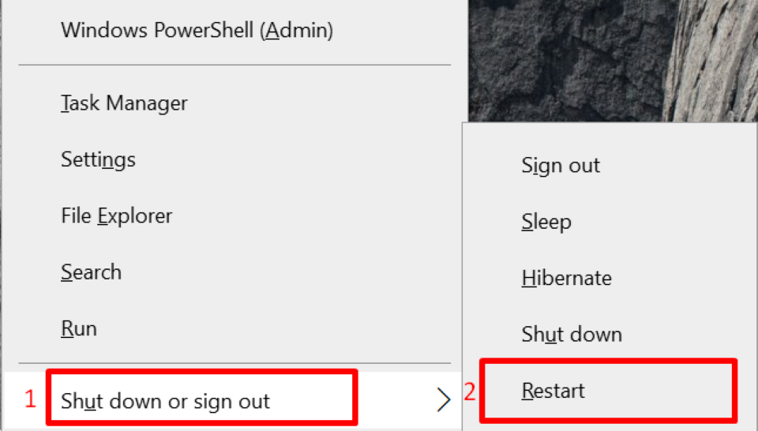

2. Select the "Troubleshoot" option in the Advanced Boot menu

3. In the Troubleshoot section, select "Advanced Options"

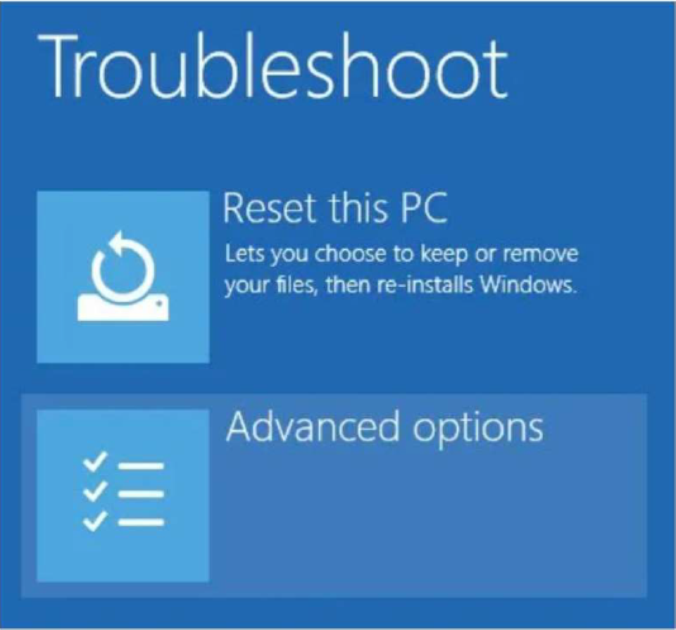

4. Select "Start-up Settings" The Startup Setting option will allow you to boot your Windows system in different modes.

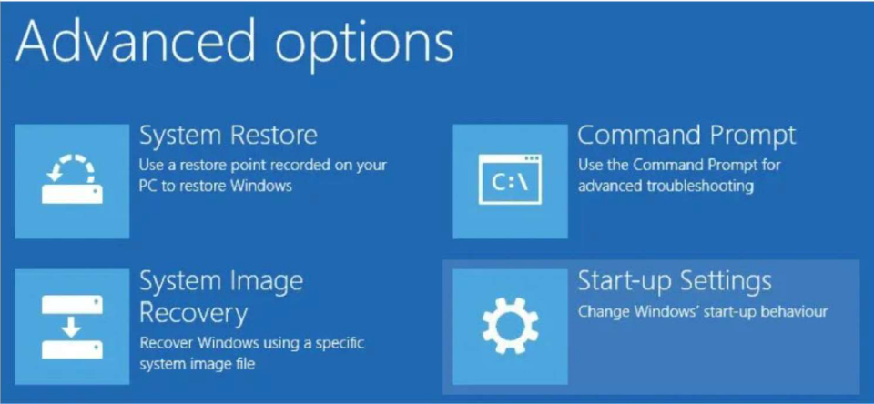

5. Click on the "Restart" button to continue.

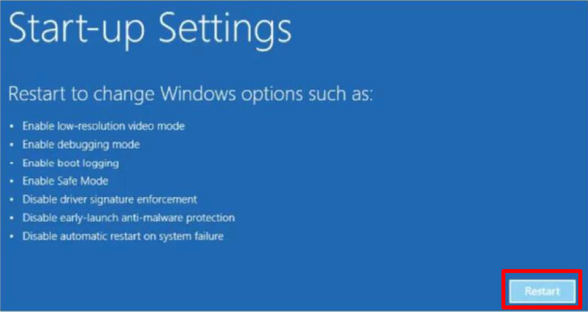

6. Then press F7 key to select the "Disable driver signature enforcement" option. Now, you can install unsigned drivers in Windows without issues.

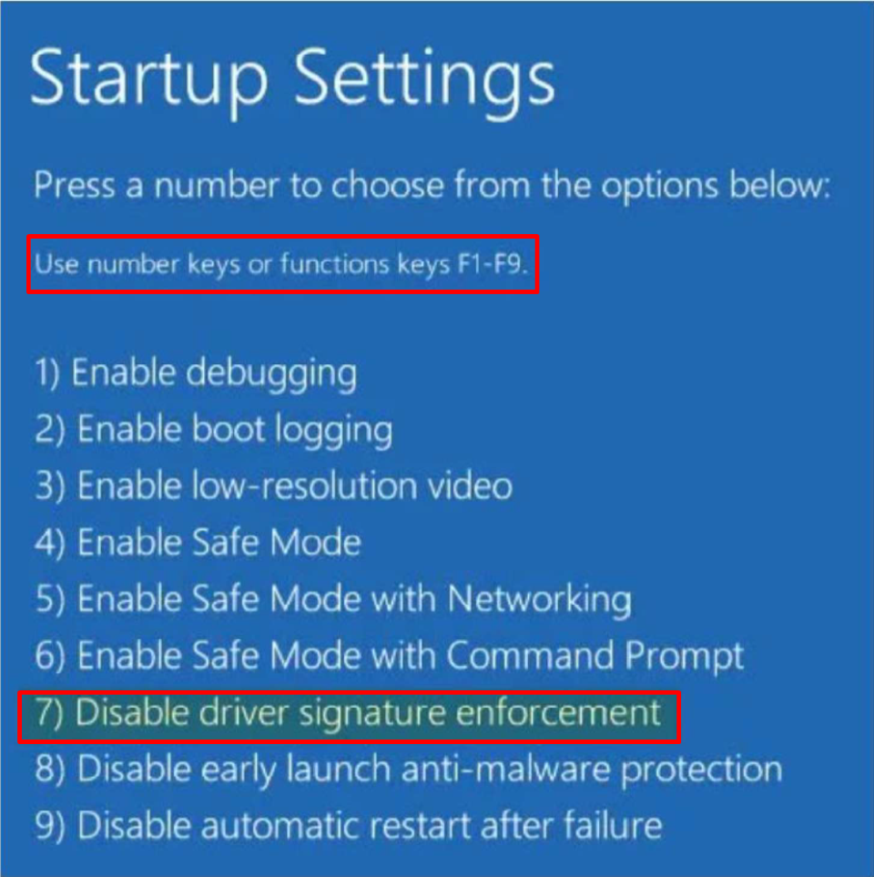

7. After the system boot into windows, connect the RA board to Host PC like the [hardware connection](#hardware-connections) section 

8. Open Device Manager, you will find out that there is an unknown USB device under "Other devices" category. Right-click this unknown USB device and select "Update driver" option

9. Select "Browse my computer for drivers"

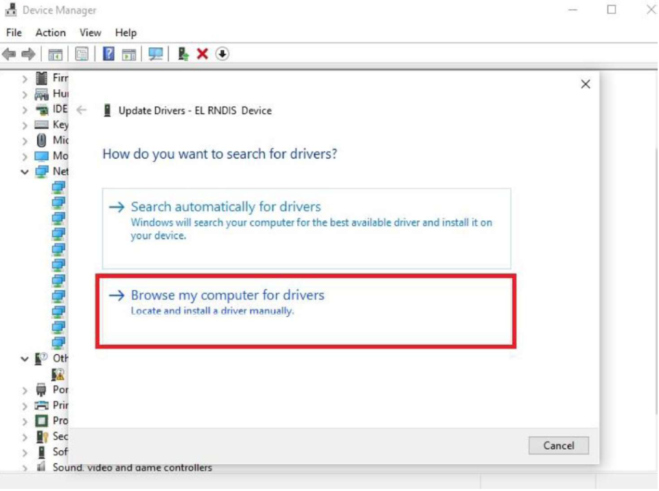

10. Select "Let me pick from a list of available drivers on my computer"

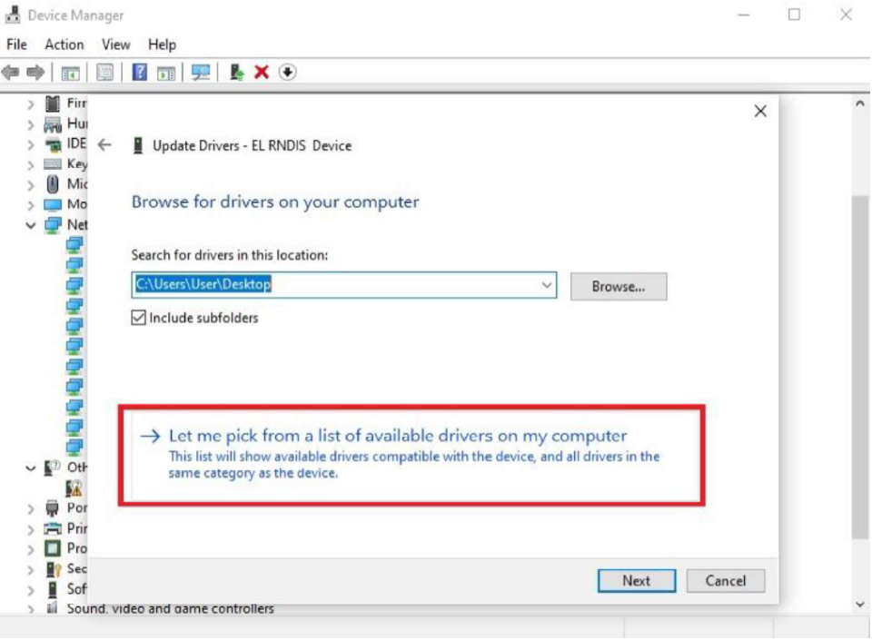

11. Click "Next" button

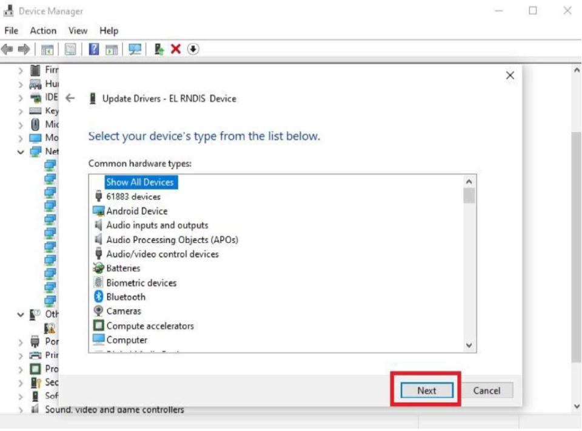

12. Click "Have Disk..." button

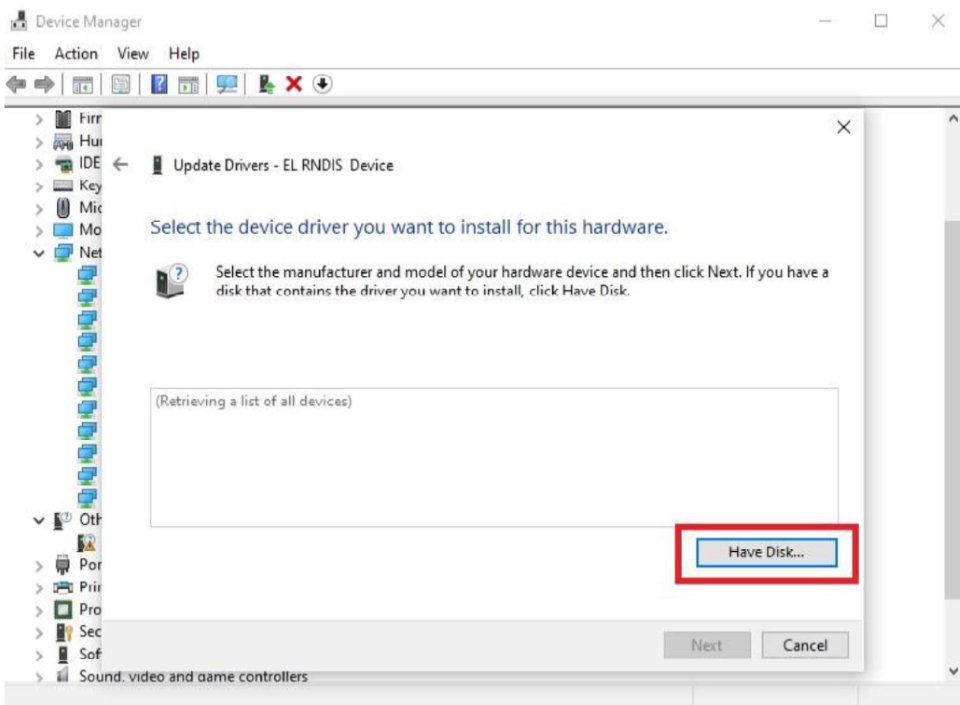

13. Browse the directory where you store the unsigned RNDIS INF file. This file is stored in the e2studio folder with name is **RNDIS_INF_NDIS_6_0_for_RA.inf**

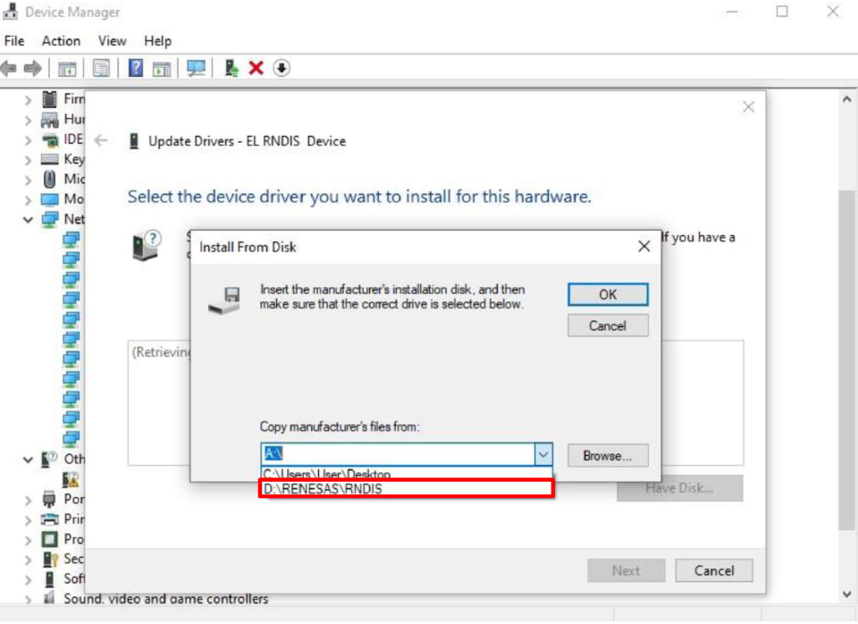

14. During the driver installation, you may receive a pop-up message to notify below information. This is due to the use of unsigned INF. Click install this driver software anyway

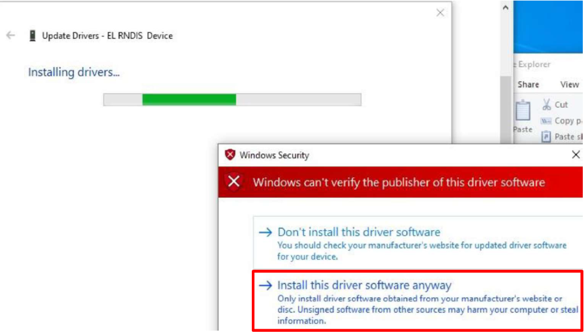

15. Once the driver installation is completed. you should be able to see message as same as below

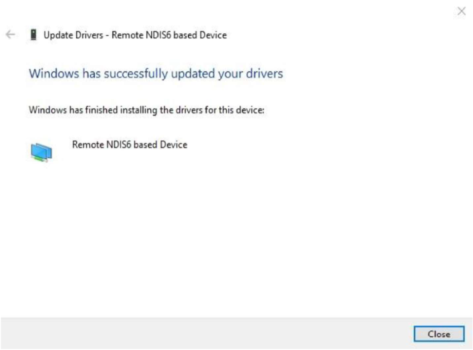

16. Now, In Device Manager, if you see the Remote NDIS6 based Device under "Network adapters" category, the RNDIS driver is installed successfully.

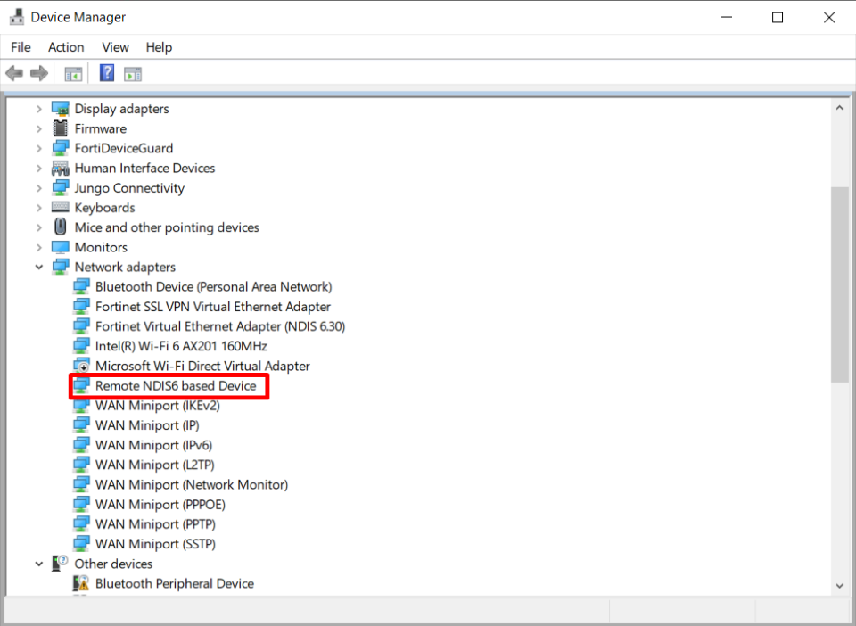

Note: The file **RNDIS_INF_NDIS_6_0_for_RA.inf** is based on the [Window RNDIS template](https://learn.microsoft.com/en-us/windows-hardware/drivers/network/remote-ndis-inf-template). In this file, the VID and PID have been modified to match the USB descriptor used in this project.

#### 4.2. Sokit (Socket Application) ####
Sokit (Socket Application) setup on PC as TCP, UDP server
1. Download sokit tool from https://www.softpedia.com/get/Network-Tools/Misc-Networking-Tools/sokit.shtml
2. Once downloaded, extract the contents and start sokit.exe.
3. Once started, in the 'Server' tab configure the 'Network Setup'.
4. Input the server's IP address and the port number
    * For TCP: In the 'TCP Addr' field, enter the PC's IPv4 address. And in 'Port' field, enter the port number.
    * For UDP: In the 'UDP Addr' field, enter the PC's IPv4 address. And in 'Port' field, enter the port number.
    
Note: Please provide an unused port number. It is recommended to give port number greater than 10,000.

5. Start the TCP, UDP server on PC.
    * For TCP: Click the 'TCP Listen' button. This will start the TCP server on PC.
    * For UDP: Click the 'UDP Listen' button. This will start the UDP server on PC.
6. The connection log will display on the 'Output window' on the PC.
    * For TCP: The 'Output' window will display the message 'hh:mm:ss MSG start TCP server successfully!'.
    * For UDP: The 'Output' window will display the message 'hh:mm:ss MSG start UDP server successfully!'.
7. Now wait for the EP to connect to server.
8. Once the EP connects to the server, the 'Connections' window will display the IP address and port number of the client.
9. There are three user input buffers provided for sending messages i.e. 'Buf 1', 'Buf 2' and 'Buf 3'.
10. In one buffer, enter 'This is a response sent from the TCP server'.
11. While sending, select the IP address of the client i.e. the MCU from the 'Connections' window. 
12. And then click 'Send' button of the appropriate buffer to send message.
13. Messages received from the client will be displayed on the 'Output' window.
14. The 'Output' window and console display messages upon each transaction.
15. To stop the server
    * For TCP: Click the 'TCP Listen' button again. This will stop the server.
    * For UDP: Click the 'UDP Listen' button again. This will stop the server.

### 4. USB change mode notes: ###
* To change USB speed mode, users can refer to the following configuration:

    * USB High-speed configuration with DMAC support:

    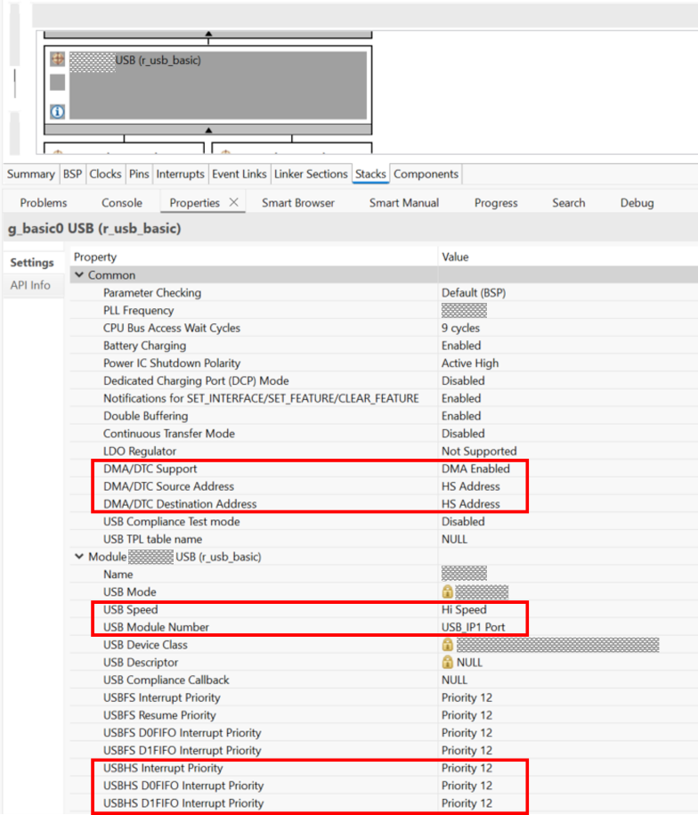

    

    

    * USB Full-speed configuration with DMAC support:

    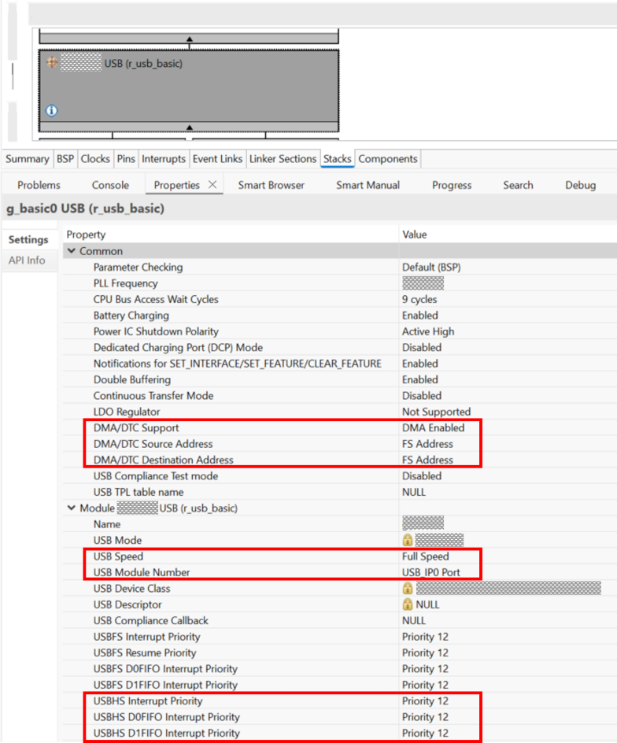

    

    

