# Introduction #

This project demonstrates the basic functionality of AWS https client library with ethernet driver on Renesas RA MCUs 
based on Renesas FSP using FreeRTOS. aws client is used to connect to https adafruit server which is cloud platform. 
On successful connection, menu is displayed enabling user to send GET,PUT,POST requests to adafruit server. On POST/PUT 
request, MCU Die temperature is read via(using) ADC and uploaded to server. On GET request, the last MCU die temperature 
data is read from the adafruit server. JlinkRTTViewer is used to display the status and responses of the requests made to server.

Please refer to the [Example Project Usage Guide](https://github.com/renesas/ra-fsp-examples/blob/master/example_projects/Example%20Project%20Usage%20Guide.pdf) 
for general information on example projects and [readme.txt](./readme.txt) for specifics of operation.

## Required Resources ##
To build and run the aws_https_client example project, the following resources are needed.

### Hardware ###
* Renesas RA™ MCU kit - 1x
* Micro USB cable - 1x
* Ethernet Switch - 1x
* LAN Cable - 1x
* HOST Machine - 1x

Refer to [readme.txt](./readme.txt) on information on how to connect the hardware.

### Software ###
1. Refer to the software required section in [Example Project Usage Guide](https://github.com/renesas/ra-fsp-examples/blob/master/example_projects/Example%20Project%20Usage%20Guide.pdf)
2. Refer to **Special Topics** for obtaining the certificates and key which is required to update in the code. 

 
## Related Collateral References ##
The following documents can be referred to for enhancing your understanding of 
the operation of this example project:
- [FSP User Manual on GitHub](https://renesas.github.io/fsp/)
- [FSP Known Issues](https://github.com/renesas/fsp/issues)

# Project Notes #

## System Level Block Diagram ##
 High level block diagram
 
 

## FSP Modules Used ##
List all the various modules that are used in this example project. Refer to the FSP User Manual for further details on each module listed below.

| Module Name | Usage | searchable Keyword  |
|-------------|-----------------------------------------------|-----------------------------------------------|
|AWS Core HTTP|To get access of aws client library for client connection |AWS Core HTTP|
|FreeRTOS + TCP|To get access of TCP/IP network library to form network layer|rm_freertos_plus_tcp|
|Ethernet Driver| This is dependent module of FreeRTOS+TCP to get access of physical layer of FSP board with the help of ethernet driver |r_ether & r_ether_phy|
|MbedTLS|This is dependent module of FreeRTOS MbedTLS which is used for server/client certificate parsing|mbedTLS|
| Mbed Crypto | This is dependent module of MbedTLS which is used for secure TLS connection | rm_psa_crypto |
| SCE | This module provides SCE functions for compatibility mode  | r_sce |
| Littlefs | To store rsa keys in flash memory | rm_littlefs_flash |
| ADC |ADC module is used to demonstrate that to read internal temperature sensor value and send it to the server  | r_adc   |

## Module Configuration Notes ##
This section describes FSP configurator properties which are important or different than those selected by default. 

|   Module Property Path and Identifier   |   Default Value   |   Used Value   |   Reason   |
| :-------------------------------------: | :---------------: | :------------: | :--------: |
|   configuration.xml -> BSP > Properties > Settings > Property >MAin Stack Size (bytes)| 0x400 |0x1000| Main Program thread stack is configured to store the local variables of different functions in the code |
| configuration.xml -> BSP > Properties > Settings > Property > Heap Size (bytes)| 0 |0x2000| Heap size is required for standard library functions to be used |
| configuration.xml -> User App Thread -> Properties > Settings > Property >Memory Allocation > Support Dynamic Mermory Allocation| Disabled | Enabled | RTOS objects can be created using RAM that is automatically allocated from the FreeRTOS heap |
| configuration.xml -> User App Thread -> Properties > Settings > Property >Memory Allocation > Total Heap Size | 0 | 0x20000 | RAM is used to obtain memory allocation for secure libraries |
| configuration.xml -> User App Thread > Properties > Settings > Property > Common > General > Use Mutexes| Disabled | Enabled | Enabled to include mutex functionality |
| configuration.xml -> User App Thread > Properties > Settings > Property > Common > General > Use Recursive Mutexes| Disabled | Enabled | Enabled to include recursive mutex functionality |
| configuration.xml -> User App Thread > Properties > Settings > Property > Thread > Stack size (bytes) | 1024 | 25000 | Stack size for User App thread| 
| configuration.xml -> User App Thread > Properties > Settings > Property > Thread > Priority | 1 | 2 | Priority for User App thread|
| configuration.xml -> User App Thread > Properties > Settings > Property > Common > Optional Functions > eTaskGetState() Function| Disabled | Enabled | Include eTaskGetState() function in build |
| configuration.xml -> User App Thread > Properties > Settings > Property > Common > Optional Functions > xTaskGetHandle() Function| Disabled | Enabled | Include xTaskGetHandle() function in build |
| configuration.xml -> User App Thread > AWS Core HTTP > Properties > Settings > Property > Common > HTTP Receive Retry Timeout (ms) | 1 | 200 | The maximum duration between non-empty network reads while receiving an HTTP response via the HTTPClient_Send API function| 
| configuration.xml -> User App Thread > AWS Core HTTP > Properties > Settings > Property > Common > HTTP Send Retry Timeout (ms) | 1 | 200 | The maximum duration between non-empty network transmissions while sending an HTTP request via the HTTPClient_Send API function|  
| configuration.xml -> User App Thread > AWS Core HTTP > AWS Transport Interface on MbedTLS/PKCS11 > AWS TCP Sockets Wrapper > FreeRTOS+TCP  > Properties > Settings > Property > DHCP callback function | Disable | Enable |DHCP callback function is required to obtain dynamic ip address |
|  configuration.xml -> User App Thread > AWS Core HTTP > AWS Transport Interface on MbedTLS/PKCS11 > AWS TCP Sockets Wrapper > FreeRTOS+TCP  > Properties >  Settings > Property > Let TCP use windowing Mechanism | Disable | Enable | For Flow control use the TCP windowing mechanism|
|  configuration.xml -> User App Thread > AWS Core HTTP > AWS Transport Interface on MbedTLS/PKCS11 > AWS TCP Sockets Wrapper > FreeRTOS+TCP  > Properties >  Settings > Property > FreeRTOS_SendPingRequest() is available |Disable|Enable|To Support the sending of Ping request this needs to chosen as enabled.|
| configuration.xml -> User App Thread > AWS Core HTTP > AWS Transport Interface on MbedTLS/PKCS11 > AWS TCP Sockets Wrapper > FreeRTOS+TCP  > Properties > Settings > Property > Common > DNS Request Attempts | 2 | 5 | Number of attempts for DNS requests |
| configuration.xml -> User App Thread > AWS Core HTTP > AWS Transport Interface on MbedTLS/PKCS11 > AWS TCP Sockets Wrapper > FreeRTOS+TCP  > FreeRTOS+ TCP Wrapper to r_ether > g_ether0 Ethernet Driver on r_ether  > Properties >  Settings > Property > General > Flow control functionality | Disable | Enable |Enabled for flow control|
| configuration.xml -> User App Thread > AWS Core HTTP > AWS Transport Interface on MbedTLS/PKCS11 > AWS TCP Sockets Wrapper > FreeRTOS+TCP  > FreeRTOS+ TCP Wrapper to r_ether > g_ether0 Ethernet Driver on r_ether  > Properties >  Settings > Property > Buffers > Number of TX buffer | 1 | 4 |Buffer size increased for faster processing|
| configuration.xml -> User App Thread > AWS Core HTTP > AWS Transport Interface on MbedTLS/PKCS11 > AWS TCP Sockets Wrapper > FreeRTOS+TCP  > FreeRTOS+ TCP Wrapper to r_ether > g_ether0 Ethernet Driver on r_ether  > Properties >  Settings > Property > Buffers > Number of RX buffer | 1 | 4 |Buffer size increased for faster processing|
| configuration.xml -> User App Thread > AWS Core HTTP > AWS Transport Interface on MbedTLS/PKCS11 > AWS TCP Sockets Wrapper > FreeRTOS+TCP  > FreeRTOS+ TCP Wrapper to r_ether > g_ether0 Ethernet Driver on r_ether > g_ether_phy0 Ethernet Driver on r_ether_phy  > Properties >  Settings > Property > Common > Reference Clock |Default |Enable|Selected to use the RMII reference clock|
|configuration.xml -> User App Thread > AWS Core HTTP > AWS Transport Interface on MbedTLS/PKCS11 > AWS TCP Sockets Wrapper > FreeRTOS+TCP  > FreeRTOS+ TCP Wrapper to r_ether > g_ether0 Ethernet Driver on r_ether > g_ether_phy0 Ethernet Driver on r_ether_phy  > Properties >  Settings > Property > PHI-LSI Address | 0 | 1 | which specifies the address of the PHI-LSI address|
| configuration.xml -> User App Thread > AWS Core HTTP > AWS Transport Interface on MbedTLS/PKCS11 > AWS PKCS11 to MbedTLS > FreeRTOS MbedTLS Port > MbedTLS > Properties > Settings > Property > Common > SSL Options > MBEDTLS_SSL_RENEGOTIATION	| Undefine | Define | Enabled support for TLS renegotiation |
| configuration.xml -> User App Thread > AWS Core HTTP > AWS Transport Interface on MbedTLS/PKCS11 > AWS PKCS11 to MbedTLS > FreeRTOS MbedTLS Port > MbedTLS > MbedTLS (Crypto Only) > Properties > Settings > Property > Common > Message Authentication Code (MAC) > MBEDTLS_CMAC_C | Undefine | Define | Enabled macro MBEDTLS_CMAC_C |
| configuration.xml -> User App Thread > AWS Core HTTP > AWS Transport Interface on MbedTLS/PKCS11 > AWS PKCS11 to MbedTLS > FreeRTOS MbedTLS Port > MbedTLS > MbedTLS (Crypto Only) > Properties > Settings > Property > Common > Public Key Cryptography (PKC) > ECC > MBEDTLS_ECDH_C | Undefine | Define | Mbed TLS implements ECDH algorithm |
| configuration.xml -> User App Thread > AWS Core HTTP > AWS Transport Interface on MbedTLS/PKCS11 > AWS PKCS11 to MbedTLS > FreeRTOS MbedTLS Port > MbedTLS > Properties > Settings > Property > Common >  Key Exchange > MBEDTLS_KEY_EXCHANGE_PSK_ENABLED | Undefine | Define |Enable the PSK based ciphersuite modes in SSL / TLS. |
| configuration.xml -> User App Thread > g_adc ADC Driver on g_adc > Properties > Settings > Module g_adc ADC Driver on r_adc > General > Mode |Single Scan | Continuous Scan | Continuous mode to be selected for continuous reading of adc value (MCU Die Temperature)|
| configuration.xml -> User App Thread > g_adc ADC Driver on g_adc > Properties > Settings > Module g_adc ADC Driver on r_adc > input > Channel Scan Mask (channel availability varies by MCU) > Temperature Sensor | Uncheck | Check | Enable the internal temperature sensor to read the adc value |

## API Usage ##

The table below lists the FSP provided API used at the application layer by this example project.

| API Name    | Usage                                                                          |
|-------------|--------------------------------------------------------------------------------|
|R_ADC_Open| This API is used to open ADC module|
|R_ADC_ScanCfg| This API is used to configure the ADC scan parameters|
|R_ADC_ScanStart|This API is used to start scanning of configured adc channel|
|R_ADC_Read|This API is used to read the adc data from the configured channel|
|R_ADC_Close| This API is used to close ADC module|
|FreeRTOS_IPInit| This API is used to initialise the FreeRTOS-Plus-TCP network stack and initialise the IP-task|
|FreeRTOS_gethostbyname| This API is used to resolve the host name to ip address|
|FreeRTOS_inet_ntoa|This API is used to convert an ip address expressed in decimal dot notation|
|FreeRTOS_inet_addr|This API is used to Convert the ip address from dotted decimal format to the 32-bit format|
|FreeRTOS_SendPingRequest|This API is used to send a ping request to remote pc|
|RM_LITTLEFS_FLASH_Open|This API is used to open the LittleFS driver and initializes lower layer driver| 
|RM_LITTLEFS_FLASH_Close|This API is used to closes the lower level LittleFS driver|
|vAlternateKeyProvisioning|This API is used to perform device provisioning using the specified TLS client credentials|
|TLS_FreeRTOS_Connect|This API is used to create a TLS connection with FreeRTOS sockets|
|TLS_FreeRTOS_send|This API is used to sends data over an established TLS connection|
|TLS_FreeRTOS_recv|This API is used to receive data from an established TLS connection|
|HTTPClient_InitializeRequestHeaders|This API is used to initialize the HTTP's request headers| 
|HTTPClient_AddHeader|This API is used to add a header to the HTTP's request headers| 
|HTTPClient_strerror|This API is used to convert error code to string for HTTP Client library | 
|HTTPClient_Send|This API is used to send the request headers and request body over the transport | 

## Verifying operation ##

Import, Build and Debug the EP(*see section Starting Development* of **FSP User Manual**). After running the EP, open rtt viewer to see the output.

Below images showcases the output on JLinkRTT_Viewer :

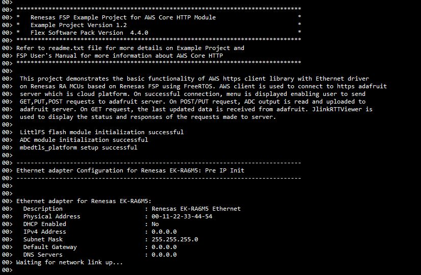

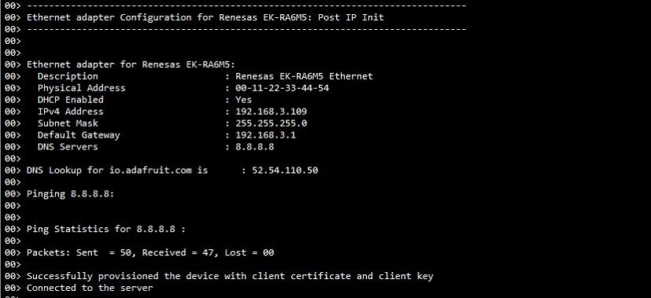

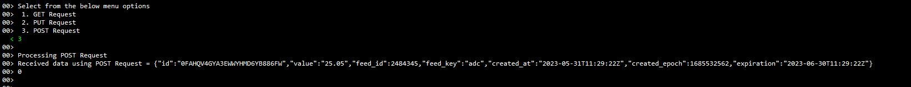

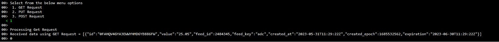

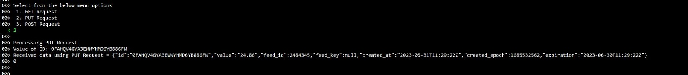

Below image show the adafruit server with feed data:

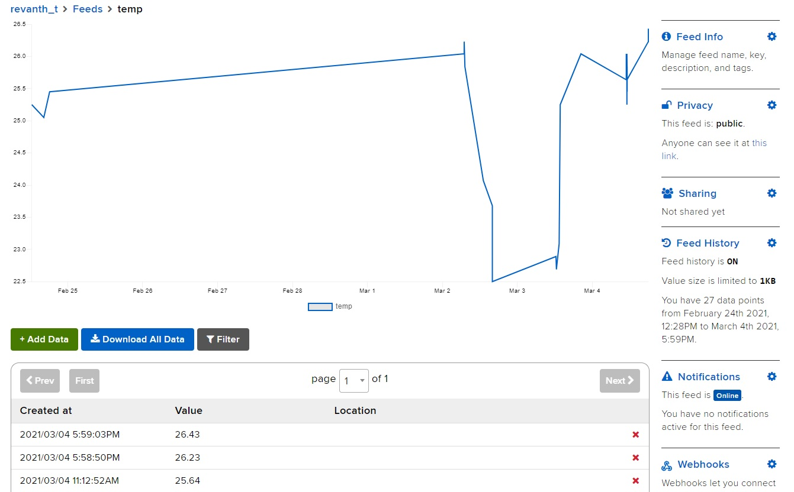

## Special Topics ##

**1. Obtaining Adafruit server credentials**:

Following steps guide you how to obtain the username and AIO key.

1.Go to https://io.adafruit.com. Click on **Get Started for Free** option as shown in the  below image

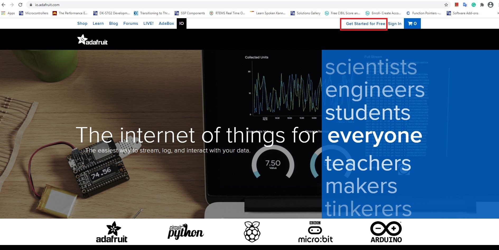

2. Create an account by providing the requested details to obtain user credintails viz., **username** and **password** 
3. After successful creation of account, user name will display on top of the page as shown in below image. Click on **IO**, dashboard will displays with the following options **Feeds , Dashboards, My key** etc.

 
 
 4.  Click on My Key option to see your username and Active key. These two details are important for communicating with adafruit server. If the key is compromised, we can generate the new key by clicking on the Regenerate key option as shown in below image.

  
 
 5. After obtaining the user name and io key. User has to update the following details at respective url macros in the aws_https_client_ep/src/user_app.h file as shown in the below image.

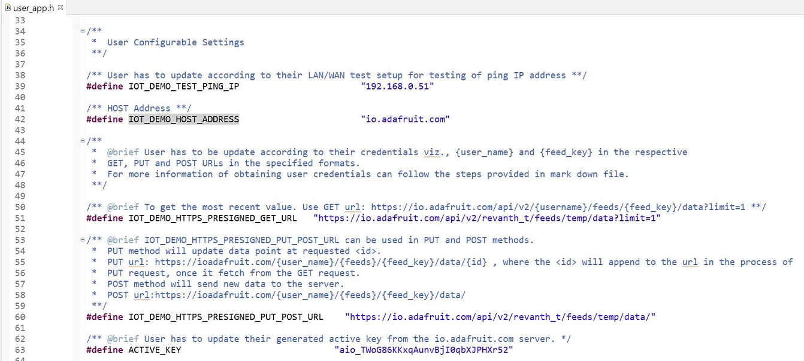

**2. Obtaining Server Certificate:**

1. Open browser and copy paste the following url http://cacerts.geotrust.com/GeoTrustRSACA2018.crt. Server certificate with .crt extension will be downloaded with the file name **GeoTrustRSACA2018.crt**

2. After downloaded the .crt file, need to be convert to .pem format using OpenSSL.

3. OpenSSL can be downloaded from  https://www.openssl.org/source/. depends on the Operating System, required installer can be downloaded and installed.

4. Copy the downloaded certificate to the bin folder of your installed openssl.

5. Open the cmd prompt in Administrator mode from the bin folder as shown in the below image.

 

 6. Type the conversion command :**Openssl.exe x509 -inform DER -outform PEM -in GeoTrustRSACA2018.crt -out GeoTrustRSACA2018.crt.pem** as shown below image
 
 
 
 7. GeoTrustRSACA2018.crt.pem file will be generated in your bin folder as shown in below image.
 

8. Open the converted certificate file with notepad and copy the content and update in the aws_https_client_ep\src\usr_app.h file at the **HTTPS_TRUSTED_ROOT_CA** macro as shown in below image.

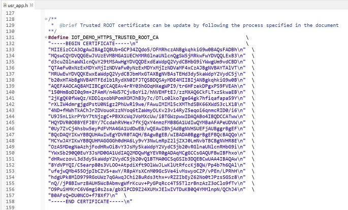

**3. Obtaining Client Certificate and Private Key:**

1. Open the cmd prompt from the bin folder of installed Openssl. 

2. To generate the private key and CSR certificate use the command **openssl req -newkey rsa:2048 -nodes -keyout clientside.key -x509 -days 365 -out clientside.crt**  as shown below.
**NOTE:** Output file can be any name.

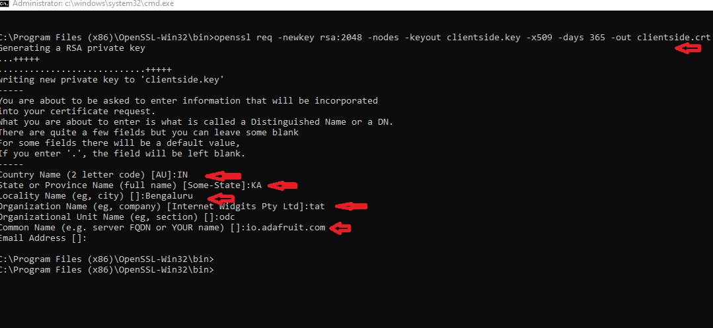

3. clientside.key and clientside.crt files are generated in binary folder. Verify client certificate is properly generated by using command **openssl x509 -text -noout -in clientside.crt** as shown below.

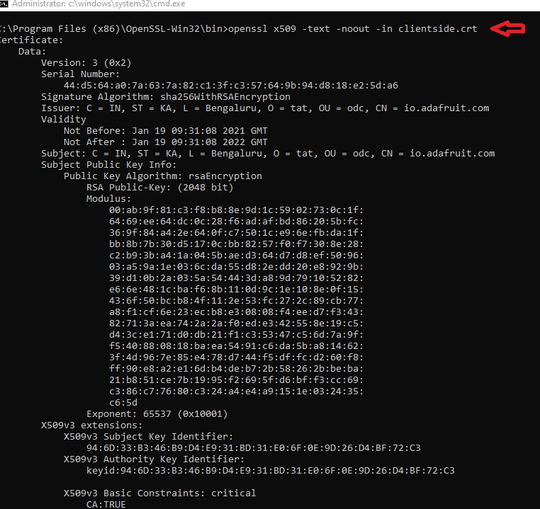

4. Generated client certificate is in .crt format. It has to be converted to .pem format. Conversion can be done from .crt to .der and then .der to .pem. 
To convert from .crt to .der, Use the command **openssl x509 -in clientside.crt -outform der -out clientside.der** as shown below.

5. To convert .der to .pem use the command **openssl x509 -in clientside.crt -outform der -out clientside.der** as shown below.

6. The generated files can be found in bin folder of OpenSSL installed software as shown in below image.

7. Open the generated files in notepad and copy the content and paste in the aws_https_client_ep/src/usr_app.h 

 i . Copied client certificate to be update at the CLIENT_CERTIFICATE_PEM macro as shown in below image.
 
 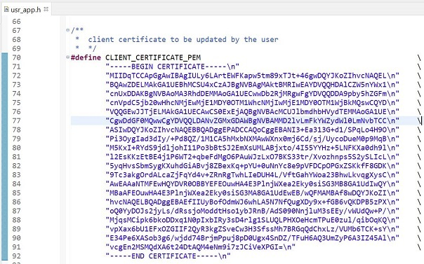
 
 ii. Copied client key to be update at the CLIENT_KEY_PEM macro as shown in below image.
 
  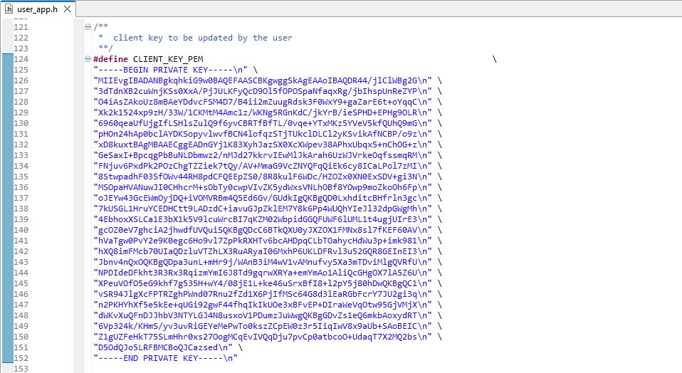
  
  
**NOTE:** Client Certificate and client Key are required for AWS Client application to authenticate server in secure connection. If missing of both, then it cannot be connect to server instead return an error as no certificates were found.