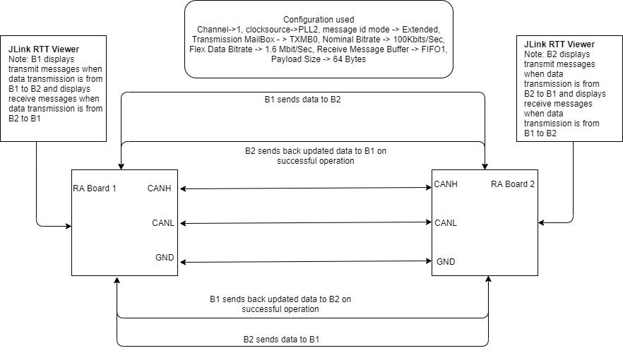
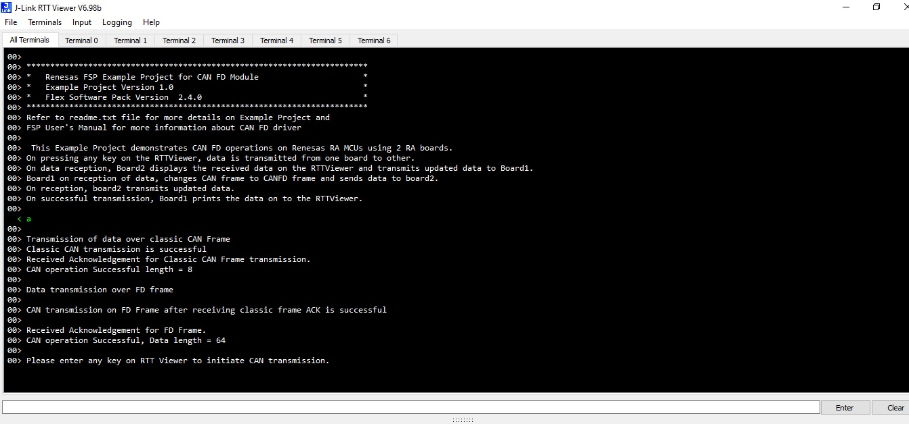
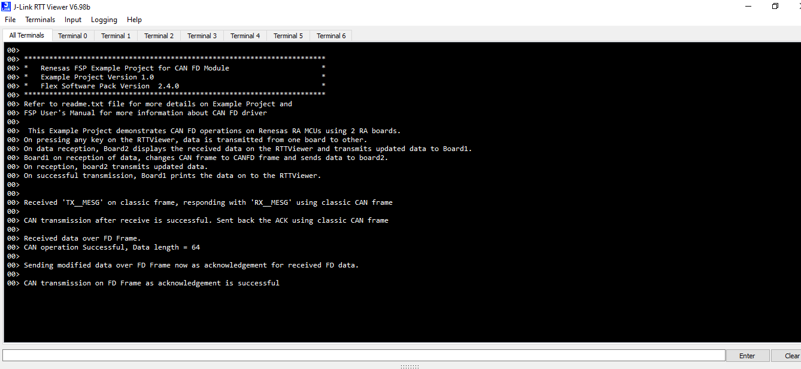

# Introduction #

The sample code accompanying this file shows the operation of CAN-FD running on Renesas RA MCUs using 2 RA boards (namely B1 and B2).
In this sample code, if user enters input(any Key) on B1 via the RTT, it transmits data1 to B2.
On reception of data1, B2 displays the received data on RTT and transmits the updated data(data2) back to B1 as acknowledgment.
On reception of data2, B1 displays the received data on RTT. Upon successful reception of data2, B1 changes mode from CAN to CAN-FD and transmits data3 to B2 using CAN-FD frame.
B2 receives the data3, displays it on RTT and transmits data4 to B1 using CAN-FD frame as an acknowledgement.
B1 receives the data4 as acknowledgement, notifies application that transaction is completed and received ACK from B2 for both the transactions.
Also once the transmission is completed, Boards prints the transmitted & received data on to RTTViewer.

**Note**: In this example project, the same code runs on both boards. The board from which the user initiates the transmission becomes the board1 and board which receives the data becomes board2.

Please refer to the [Example Project Usage Guide](https://github.com/renesas/ra-fsp-examples/blob/master/example_projects/Example%20Project%20Usage%20Guide.pdf) 
for general information on example projects and [readme.txt](./readme.txt) for specifics of operation.

## Required Resources ##
To build and run the can fd example project, the following resources are needed.

### Hardware ###
* Renesas RA™ MCU kits (EK_RA6M5) - 2
* Micro USB cable
* Connection wires

Refer to [readme.txt](./readme.txt) on information on how to connect the hardware.

### Software ###
Refer to software requirements mentioned in [Example Project Usage Guide](https://github.com/renesas/ra-fsp-examples/blob/master/example_projects/Example%20Project%20Usage%20Guide.pdf)

## Related Collateral References ##
The following documents can be referred to for enhancing your understanding of 
the operation of this example project:
- [FSP User Manual on GitHub](https://renesas.github.io/fsp/)
- [FSP Known Issues](https://github.com/renesas/fsp/issues)

# Project Notes #

## System Level Block Diagram ##

## FSP Modules Used ##
List all the various modules that are used in this example project. Refer to the FSP User Manual for further details on each module listed below.

| Module Name | Usage  | Searchable Keyword|
|-------------|-----------------------------------------------|-----------------------------------------------|
| CANFD | CANFD module is used to support CAN with both flexible data rate and classic frame, to support multiple channel operation and gateway function. | CAN |

## Module Configuration Notes ##
This section describes FSP Configurator properties which are important or different than those selected by default. 

**Note**: Following is the formula for data and nominal bitrate calculation.

**bitrate = canfd_clock_hz / ((time_segment_1 + time_segment_2 + 1) * prescalar)**

Refer [FSP User Manual on GitHub](https://renesas.github.io/fsp/group___c_a_n_f_d.html) for more details like min, max values of time_segment_1, time_segment_2 and prescalar.

Sample bit rate calculation is provided as below:

For example, if the user desires to configure nominal bitrate of 500Kbits/sec, the following values can be used in configurator:

canfd_clock_hz = 40MHz

time_segment_1 = 20

time_segment_2 = 19

prescalar = 2

These values are chosen by taking reference of ek-ra6m5 hardware user manual from the **Section 32.4.1**

|   Module Property Path and Identifier   |   Default Value   |   Used Value   |   Reason   |
| :-------------------------------------: | :---------------: | :------------: | :--------: |
|   configuration.xml -> g_canfd0 CAN FD Driver on r_canfd > Settings > Property > Common > Global Error Interrupt > Sources  |   Not checked   |   Checked   |  Error conditions for which interrupt has to be triggered are enabled, so that the application handles them by setting error status flags in callback  |
|   configuration.xml -> g_canfd0 CAN FD Driver on r_canfd > Settings > Property > Common > Reception > Message Buffers > Number of buffers |   0   |   1 | Number of RX Message Buffer to be used for reception is specified here. '0' value disables the RX message buffers
|   configuration.xml -> g_canfd0 CAN FD Driver on r_canfd > Settings > Property > Common > Reception > Message Buffers > Payload Size |   8   |   64 | Maximum data payload size of 64 is specified here for the RX message buffer to accommodate data length in FD frame
|   configuration.xml -> g_canfd0 CAN FD Driver on r_canfd > Settings > Property > Module g_canfd0 CANFD Driver on r_canfd > Bitrate > Manual > Nominal > Prescaler |   1   |   4 | Prescaler value is updated for the chosen nominal bitrate 100KBits/Sec (Refer note for formula)
|   configuration.xml -> g_canfd0 CAN FD Driver on r_canfd > Settings > Property > Module g_canfd0 CANFD Driver on r_canfd > Bitrate > Manual > Nominal > Time Segment 1 |   29   |   74 | Time Segment value is calculated for the chosen nominal bitrate 100KBits/Sec (Refer note for formula)
|   configuration.xml -> g_canfd0 CAN FD Driver on r_canfd > Settings > Property > Module g_canfd0 CANFD Driver on r_canfd > Bitrate > Manual > Nominal > Time segment 2 |   10  |   25 | Time Segment value is calculated for the chosen nominal bitrate 100KBits/Sec (Refer note for formula)
|   configuration.xml -> g_canfd0 CAN FD Driver on r_canfd > Settings > Property > Module g_canfd0 CANFD Driver on r_canfd > Bitrate > Manual > Nominal > Sync Jump width |   4   |   10 | Sync Jump width value is calculated for the chosen nominal bitrate 100KBits/Sec (Refer note for formula)
|   configuration.xml -> g_canfd0 CAN FD Driver on r_canfd > Settings > Property > Module g_canfd0 CANFD Driver on r_canfd > Bitrate > Manual > Data > Prescaler |   1   |   2 | Prescaler value is updated for the chosen nominal bitrate 1.6MBits/Sec (Refer note for formula)
|   configuration.xml -> g_canfd0 CAN FD Driver on r_canfd > Settings > Property > Module g_canfd0 CANFD Driver on r_canfd > Bitrate > Manual > Data > Time Segment 1 |   2   |   9 | Time Segment value is calculated for the chosen nominal bitrate 1.6MBits/Sec (Refer note for formula)
|   configuration.xml -> g_canfd0 CAN FD Driver on r_canfd > Settings > Property > Module g_canfd0 CANFD Driver on r_canfd > Bitrate > Manual > Data > Time segment 2 |   2  |   9 | Time Segment value is calculated for the chosen nominal bitrate 1.6MBits/Sec (Refer note for formula)
|   configuration.xml -> g_canfd0 CAN FD Driver on r_canfd > Settings > Property > Module g_canfd0 CANFD Driver on r_canfd > Bitrate > Manual > Data > Sync Jump width |   1   |   2 | Sync Jump width value is calculated for the chosen nominal bitrate 1.6MBits/Sec (Refer note for formula)
|   configuration.xml -> g_canfd0 CAN FD Driver on r_canfd > Settings > Property > Module g_canfd0 CANFD Driver on r_canfd > Bitrate > Manual > Use Manual Settings |   No   |   Yes | Use manual bitrate values so that automatic bitrate values are overwritten and user configured bitrate values are used
|   configuration.xml -> g_canfd0 CAN FD Driver on r_canfd > Settings > Property > Module g_canfd0 CANFD Driver on r_canfd > Transmit Interrupts |   TXMB0 disabled   |   TXMB0 Enabled | Relevant Tx buffer is enabled to trigger interrupt after transmission is complete
|   configuration.xml -> g_canfd0 CAN FD Driver on r_canfd > Settings > Property > Module g_canfd0 CANFD Driver on r_canfd > Channel Error Interrupts |   Not checked   |   Checked | Required channel error interrupt sources are enabled for which interrupt has to be triggered are enabled, so that the application handles them by setting error status flags in callback 
 

## API Usage ##

The table below lists the CAN FD API used at the application layer by this example project.

| API Name    | Usage                                                                          |
|-------------|--------------------------------------------------------------------------------|
|R_CANFD_Open| This API is used to initialize CANFD module. |
|R_CANFD_Write| This API is used to Write data to the CANFD channel.|
|R_CANFD_InfoGet| This API is used to get the status information for CAN transmission .|
|R_CANFD_Read| This API is used to  read data from a CANFD Message Buffer or FIFO .|
|R_CANFD_Close| This API is used to close the CANFD channel .|
|R_IOPORT_PinWrite| This API is used to set pin's status.|

## Verifying operation ##
Import, Build and Debug the EP(see section Starting Development of [FSP User Manual](https://renesas.github.io/fsp/_s_t_a_r_t__d_e_v.html)) in both boards. After running the EP, open rtt viewer to input key for initiating the operation.
Before running the example project, refer the below steps for hardware connections :
* Connect RA MCU debug port to the host PC via a micro USB cable. 
* E33, E34, E35 on the board needs to be shorted to use on-board CAN Transreceivers
* CANH, CANL and GND on both boards needs to be connected.

Below images showcases the output on JLinkRTT_Viewer :

Data Transmission from B1 to B2

Board 1 RTT log:

Board 2 RTT log:

