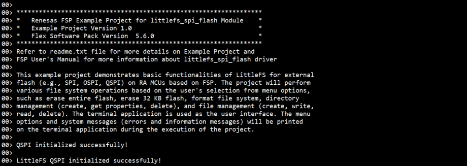
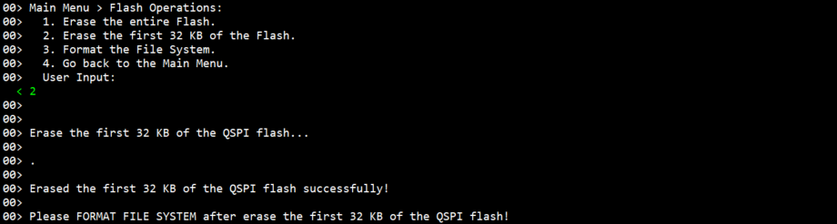
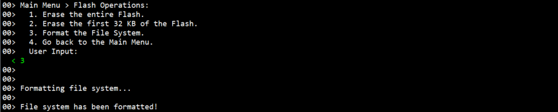

# Introduction #

This example project demonstrates basic functionalities of LittleFS for external flash (e.g., SPI, OSPI, QSPI) on RA MCU based on FSP. The project will perform various file system operations based on the user's selection from menu options, such as erase entire flash, erase 32 KB flash, format file system, directory management (create, get properties, delete),and file management (create, write, read, delete). The terminal application is used as the user interface. The menu options and system messages (errors and information messages) will be printed on the terminal application during the execution of the project.

In the Main Menu, the user selects a sub menu such as Flash Operations Menu, Directory Operations Menu, File Operations Menu.
1. Flash Operations.
2. Directory Operations.
3. File Operations.

In the Flash Operations Menu, the user selects operation to perform.
1. Erase the entire Flash.
2. Erase the first 32 KB of the Flash.
3. Format the File System.
4. Go back to the Main Menu.

In the Directory Operations Menu, the user selects operation to perform.
1. Create the Directory.
2. Get the Directory Properties.
3. Delete the Directory.
4. Go back to the Main Menu.

In the File Operations Menu, the user selects operation to perform.
1. Open the File.
2. Write to the File.
3. Read from the File.
4. Delete the File.
5. Go back to the Main Menu.

Please refer to the [Example Project Usage Guide](https://github.com/renesas/ra-fsp-examples/blob/master/example_projects/Example%20Project%20Usage%20Guide.pdf) 
for general information on example projects and [readme.txt](./readme.txt) for specifics of operation.

## Required Resources ## 
The following resources are needed to build and run the littlefs_qspi example project.

### Hardware ###
Supported RA boards: EK-RA6M5
* 1 x Renesas RA board.
* 1 x Micro USB cable for programming and debugging.

### Hardware Connections  ###
  * Connect the USB Debug port on the RA board to the host PC via a micro USB cable. 

### Software ###
* Renesas Flexible Software Package (FSP): Version 5.7.0
* e2 studio: Version 2024-10
* SEGGER J-Link RTT Viewer: Version 8.10f
* GCC ARM Embedded Toolchain: Version 13.2.1.arm-13-7

Refer to the software required section in [Example Project Usage Guide](https://github.com/renesas/ra-fsp-examples/blob/master/example_projects/Example%20Project%20Usage%20Guide.pdf)

## Related Collateral References ##
The following documents can be referred to for enhancing your understanding of the operation of this example project:
- [FSP User Manual on GitHub](https://renesas.github.io/fsp/)
- [FSP Known Issues](https://github.com/renesas/fsp/issues)

# Project Notes #

## System Level Block Diagram ##
 High level block diagram of the system is as shown below:
 

## FSP Modules Used ##
List all the various modules that are used in this example project. Refer to the FSP User Manual for further details on each module listed below.

| Module Name | Usage | Searchable Keyword  |
|-------------|-----------------------------------------------|-----------------------------------------------|
| LittleFS | LittleFS is used for file system operation. | LittleFS |
| LittleFS on SPI Flash | This module provides the hardware port layer for the LittleFS file system on SPI flash memory. | rm_littlefs_spi_flash |
| QSPI Flash | QSPI is used to configure flash device and perform write, read, or erase operations on flash device's memory array. | r_qspi |

**Note:**
* Blocking Read/Write/Erase:  
  The LittleFS port blocks on Read/Write/Erase calls until the operation has completed.
* Memory Constraints:  
  The block size defined in the LittleFS configuration must be a multiple of the data flash erase size of the MCU. It must be greater than 104 bytes which is the minimum block size of a LittleFS block. 

## Module Configuration Notes ##
This section describes FSP configuration properties that are important or different from those selected by default.

**Configuration Properties for using LittleFS**

|   Module Property Path and Identifier   |   Default Value   |   Used Value   |   Reason   |
|-----------------------------------------|-------------------|----------------|------------|
| configuration.xml > Stacks > Properties > LittleFS > Settings > Property > Common > Use Malloc | Enabled | Enabled | Enable to use malloc with LittleFS. |
| configuration.xml > BSP > Properties > Settings > Property > RA Common > Heap size (bytes) | 0 | 0x400 | A heap size is required to use malloc with LittleFS. |
| configuration.xml > BSP > Properties > Settings > Property > RA Common > Main stack size (bytes) | 0x400 | 0x800 | Set the size of the main program stack. |

**Configuration without using malloc**
|   Module Property Path and Identifier   |   Default Value   |   Used Value   |   Reason   |
|-----------------------------------------|-------------------|----------------|------------|
| configuration.xml > Stacks > Properties > LittleFS > Settings > Property > Common > Use Malloc | Enabled | Disabled | Disable to not use malloc with LittleFS. |
| configuration.xml > BSP > Properties > Settings > Property > RA Common > Heap size (bytes) | 0 | 0 | The main heap size is disabled by default. |
| configuration.xml > BSP > Properties > Settings > Property > RA Common > Main stack size (bytes) | 0x400 | 0x800 | Set the size of the main program stack. |

**Configuration Properties for using LittleFS on SPI Flash**

|   Module Property Path and Identifier   |   Default Value   |   Used Value   |   Reason   |
|-----------------------------------------|-------------------|----------------|------------|
| configuration.xml > Stacks > Properties > LittleFS on SPI Flash (rm_littlefs_spi_flash) > Settings > Property > Module LittleFS on SPI Flash (rm_littlefs_spi_flash) > Read Size | 1 | 1 | Minimum size of a block read. |
| configuration.xml > Stacks > Properties > LittleFS on SPI Flash (rm_littlefs_spi_flash) > Settings > Property > Module LittleFS on SPI Flash (rm_littlefs_spi_flash) > Program Size | 4 | 4 | Minimum size of a block program. |
| configuration.xml > Stacks > Properties > LittleFS on SPI Flash (rm_littlefs_spi_flash) > Settings > Property > Module LittleFS on SPI Flash (rm_littlefs_spi_flash) > Block Size (bytes) | 4096 | 4096 | Size of an erasable block. |
| configuration.xml > Stacks > Properties > LittleFS on SPI Flash (rm_littlefs_spi_flash) > Settings > Property > Module LittleFS on SPI Flash (rm_littlefs_spi_flash) > Block Cycles | 1024 | 1024 | Number of erase cycles before LittleFS evicts metadata logs and moves the metadata to another block. |
| configuration.xml > Stacks > Properties > LittleFS on SPI Flash (rm_littlefs_spi_flash) > Settings > Property > Module LittleFS on SPI Flash (rm_littlefs_spi_flash) > Cache Size | 64 | 64 | Size of block caches. |
| configuration.xml > Stacks > Properties > LittleFS on SPI Flash (rm_littlefs_spi_flash) > Settings > Property > Module LittleFS on SPI Flash (rm_littlefs_spi_flash) > Lookahead Size | 16 | 16 | Size of the lookahead buffer in bytes. |
| configuration.xml > Stacks > Properties > LittleFS on SPI Flash (rm_littlefs_spi_flash) > Settings > Property > Module LittleFS on SPI Flash (rm_littlefs_spi_flash) > Memory Size (bytes) | 33554432 | 33554432 | Set the size that LittleFS Memory should be used. |

**Configuration Properties for using QSPI Flash**

|   Module Property Path and Identifier   |   Default Value   |   Used Value   |   Reason   |
|-----------------------------------------|-------------------|----------------|------------|
| configuration.xml > Stacks > Properties > g_qspi QSPI Flash (r_qspi) > Settings > Property > Module g_qspi QSPI (r_qspi) > General > SPI Protocol | Extended SPI | QPI | Select QPI mode. |
| configuration.xml > Stacks > Properties > g_qspi QSPI Flash (r_qspi) > Settings > Property > Module g_qspi QSPI (r_qspi) > General > Address Bytes | 3 | 4 | Select 4 bytes address. |

## API Usage ##
The table below lists the FSP provided API used at the application layer in this example project.

| API Name    | Usage                                                                          |
|-------------|--------------------------------------------------------------------------------|
| RM_LITTLEFS_SPI_FLASH_Open | This API is used to open the driver and initialize the lower layer driver. |
| RM_LITTLEFS_SPI_FLASH_Close | This API is used to close the lower-level driver. |
| lfs_mount | This API is used to mount a LittleFS. |
| lfs_unmount | This API is used to unmount a LittleFS. |
| lfs_format | This API is used to format a block device with the LittleFS. |
| lfs_mkdir | This API is used to create a directory. |
| lfs_stat | This API is used to find info about a file or directory. |
| lfs_remove | This API is used to remove a file or directory. |
| lfs_file_open | This API is used to open a file (Used malloc). |
| lfs_file_opencfg | This API is used to open a file with extra configuration (Unused malloc). |
| lfs_file_close | This API is used to close a file. |
| lfs_file_write | This API is used to write data to the file. |
| lfs_file_seek | This API is used to change the position of the file. |
| lfs_file_read | This API is used to read data from the file. |
| R_QSPI_Open | This API is used to initialize QSPI module. |
| R_QSPI_DirectWrite | This API is used to write raw data directly to the QSPI. |
| R_QSPI_DirectRead | This API is used to read raw data directly from the QSPI. |
| R_QSPI_Erase | This API is used to erase a block or sector of flash. |
| R_QSPI_Close | This API is used to de-initialize QSPI module. |
| R_QSPI_StatusGet | This API is used to get the write or erase status of the flash. |

## Verifying Operation ##
1. Import the example project.
2. Generate, build the example project.
3. Connect the RA MCU debug port to the host PC via a micro USB cable.
4. Debug or flash the example project to the RA board.
5. Open the J-Link RTT Viewer on the host PC.
6. After the main menu is displayed on the J-Link RTT Viewer, the user selects options to perform file system management as desired.
    * Type '1' and enter to select Flash Operations Menu.
	    * Type '1' and enter to erase the entire flash.
		* Type '2' and enter to erase the first 32 KB of the flash.
		* Type '3' and enter to format the file system.
		* Type '4' and enter to go back to the Main Menu.  
		**Note: After erasing the entire flash or 32 KB flash, the user must format the file system.**

	* Type '2' and enter to select Directory Operations Menu.
		* Type '1' and enter to create a new directory.
		* Type '2' and enter to get the root directory properties.
		* Type '3' and enter to delete a directory.
		* Type '4' and enter to go back to the Main Menu.

	* Type '3' and enter to select File Operations Menu.
		* Type '1' and enter to create an empty file or open an existed file.
		* Type '2' and enter to write a fixed content into a file.
		* Type '3' and enter to read the entire file and display the first 1 KB of its content.
		* Type '4' and enter to delete a file.
		* Type '5' and enter to go back to the Main Menu.

The below images showcase the output on the J-Link RTT Viewer:

The EP information:

The EP Menu

* The Main Menu:

* The Flash Operations Menu:

* The Directory Operations Menu:

* The File Operations Menu:

Flash Operations

* Erase the entire Flash:

* Erase the first 32 KB of the flash:

* Format the File System:

* Go back to the Main Menu:

Directory Operations

* Create Directory:

* Get Directory Properties:

* Delete Directory:

* Go back to the Main Menu:

File Operations

* Create an empty file or open an existed file:

* Write to the File:

* Read from the File:

* Delete File:

* Go back to the Main Menu:

