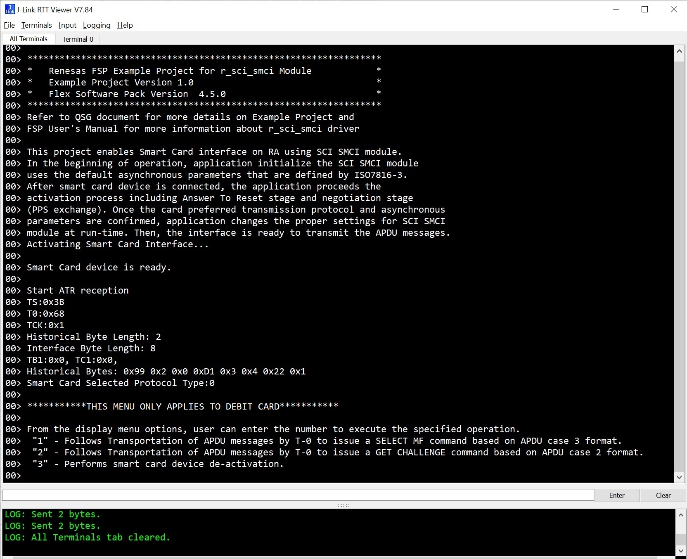
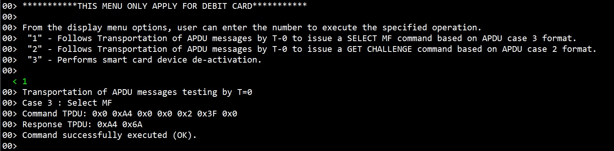
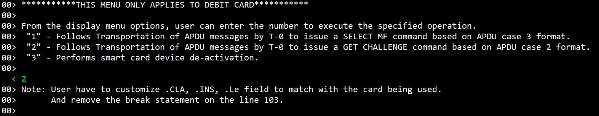
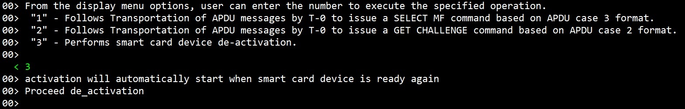
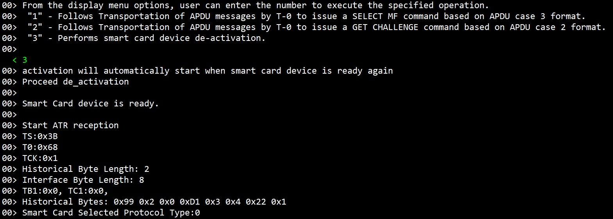

# Introduction #

This project demonstrates the basic functionalities of SCI Smart Card Interface Device on Renesas RA MCUs based on Renesas
	FSP using SCI_SMCI module without RTOS. ISO 7816-3 Smart Card will be connected to the RA board which is configured as
	SCI Smart Card Interface (Please looks at the Table of Smart Card Connections). The application sets and configure baud 
	rate for the smart. This project also demonstrates the ATR proceeds in five steps: Initial character TS; format bytes T0;
	Interface bytes TAi, TBi, TCi, TDi and vaiable number; Historical bytes, and the check byte TCK (optional) for SIM Card 
	and Debit Card.	For the SIM Card, the application proceeds the activation process including Answer To Reset stage and 
	negotiation stage will show(Completed PPS exchange). For the Debit Card, user can follow the the Menu to do the test. User
	can "Enter" value from Menu and all information of the chip in the card the Smart Card connected to the RA board will be 
	printed it the RTTViewer...	

Please refer to the [Example Project Usage Guide](https://github.com/renesas/ra-fsp-examples/blob/master/example_projects/Example%20Project%20Usage%20Guide.pdf) 
for general information on example projects and [readme.txt](./readme.txt) for specifics of the operation.

## Required Resources ##
To build and run the SCI_SMCI example project, the following resources are needed.

### Hardware ###
* 1 x EK-RA6M5 board
* 1 x Micro USB cable for programming and debugging
* 1 x 1x SIM Card (the standard SIM, Micro SIM or Nano SIM) with wires connection soldered are ready on SIM or socket.
* 1 x Debit Card and 1x of ISO 7816-3 Card (Should be used ISO 7816-3 AT88SC0104C) If user would like to test for both.

Refer to [readme.txt](./readme.txt) for information on how to connect the hardware.

### Software ###
* Renesas Flexible Software Package (FSP): Version 6.0.0
* e2 studio: Version 2025-04.1
* SEGGER J-Link RTT Viewer: Version 8.44a
* GCC ARM Embedded Toolchain: Version 13.2.1.arm-13-7
* Refer to software requirements mentioned in [Example Project Usage Guide](https://github.com/renesas/ra-fsp-examples/blob/master/example_projects/Example%20Project%20Usage%20Guide.pdf)

## Related Collateral References ##
The following documents can be referred to for enhancing your understanding of 
the operation of this example project:
- [FSP User Manual on GitHub](https://renesas.github.io/fsp/)

# Project Notes #

## System Level Block Diagram ##

## FSP Modules Used ##
List all the various modules that are used in this example project. Refer to the FSP User Manual for further details on each module listed below.

| Module Name | Usage  | Searchable Keyword (using New Stack > Search) |
| :---------: | :---------------: | :------------: |
| I/O Port | This module is used communicate with Host machine to perfrom write/read operations. | r_ioport |
| SMCI | This module provides Driver support configuration read/write between RA device and Smart Card. | r_sci_smci |
| External IRQ| Supports configuring interrupts for IRQ pins on the target MCUs. | r_icu|
| Timer General PWM | The GPT module is used count events, generate a periodic interrupt, output a periodic or PWM. |r_gpt|

## Module Configuration Notes ##
This section describes FSP Configurator properties that are important or different from those selected by default. 

**Common Configuration Properties**

|   Module Property Path and Identifier   |   Default Value   |   Used Value   |   Reason   |
| :-------------------------------------: | :---------------: | :------------: | :--------: |
|   configuration.xml > BSP > Properties > Settings > Property > Heap Size (bytes)| 0 |0x400| Heap size is required for standard library functions to be used. |
|   configuration.xml > g_smci0 SMCI Thread > Properties > Settings > Property > Module g_smci0 SMCI (r_sci_smci) > General > Channel |0 | 7 | Selected this channel to set connectivity of SCI (TX/RX/SCK).  |
|   configuration.xml > g_smci0 SMCI Thread > Properties > Settings > Property > Module g_smci0 SMCI (r_sci_smci) > Baud > Baud Rate |9600 | 10000 | Enter the desired baud rate. If the requested baud rate cannot be achieved within the acceptable error rate, the error mark and percent error rate are printed in a comment in the generated smci_baud_setting_t structure.  |
|   configuration.xml > g_smci0 SMCI Thread > Properties > Settings > Property > Module g_smci0 SMCI (r_sci_smci) > Pins > TX/RX/SCK |TX0/RX0/SCK0 | TX7/RX7/SCK7 | Selected and set Transmit/Receive and Clock channels  |
|   configuration.xml > External IRQ Thread > Properties > Settings > Property > Module g_ext_irq_smc_detect External IRQ (r_icu) > Name | g_external_irq0 | g_ext_irq_smc_detect | Assigned a name for external IRQ Smart Card detection function  |
|   configuration.xml > External IRQ Thread > Properties > Settings > Property > Module g_ext_irq_smc_detect External IRQ (r_icu) > Channel | 0 | 11 |Select channel available for interrupt  |
|   configuration.xml > External IRQ Thread > Properties > Settings > Property > Module g_ext_irq_smc_detect External IRQ (r_icu) > Callback | NULL | smar_card_detection_cb | Assigned callback function for detection card  |
|   configuration.xml > External IRQ Thread > Properties > Settings > Property > Module g_ext_irq_smc_detect External IRQ (r_icu) > Pins > IRQ > IRQ00 | None| P708 | Select Interruption pin to detect with or without Smart Card  |
|   configuration.xml > External IRQ Thread > Properties > Settings > Property > Module g_smci_etu_count_timer Timer, General PWM (r_gpt) > General > Name | g_timer0 | g_smci_etu_count_timer | Assigned a name for the etu timer function  |
|   configuration.xml > External IRQ Thread > Properties > Settings > Property > Module g_smci_etu_count_timer Timer, General PWM (r_gpt) > General > Period  | 0x100000000 | 1 | Set to 1 timing for PWM  |
|   configuration.xml > External IRQ Thread > Properties > Settings > Property > Module g_smci_etu_count_timer Timer, General PWM (r_gpt) > General > Period Unit | Raw Counts | Microseconds | Select unit counting using Mricrosenconds  |
|   configuration.xml > External IRQ Thread > Properties > Settings > Property > Module g_smci_etu_count_timer Timer, General PWM (r_gpt) > Interrupts > Callback | NULL | recveExpireCallback | Assign a name for Call back expire function  |
|   configuration.xml > External IRQ Thread > Properties > Settings > Property > Module g_smci_etu_count_timer Timer, General PWM (r_gpt) > Interrupts > Overflow/Crest Interrupt Priority | Disable | Priority 12 | Set Priority Level  |
|   configuration.xml > External IRQ Thread > Properties > Settings > Property > Module g_smci_etu_count_timer Timer, General PWM (r_gpt) > Interrupts > Pins > GTIOC0A | None | P415 | Select and set the pin for PWM timer  |

## API Usage ##

The table below lists the FSP provided API used at the application layer by this example project.

| API Name    | Usage                                                                          |
|-------------|--------------------------------------------------------------------------------|
| R_SCI_SMCI_Open | This API is used to open SCI in Smart Card Interface Mode. |
| R_SCI_SMCI_BaudSet | This API is used to update the baud rate. |
| R_SCI_SMCI_ClockControl | This API is used to enable or disable the SMCI clock to control the start of the activation or de-activation. |
| R_SCI_SMCI_TransferModeSet | This API is used to change the peripheral settings based on provided transfer mode and data convention type. |
| R_SCI_SMCI_Read | This API is used to read from Smart Card device.  The read buffer is used until the read is complete. |
| R_ICU_ExternalIrqOpen | This API is used to to detect the smart card. |
| R_GPT_PeriodSet | This API is used to set the calculated period may or may not. |
| R_GPT_Start | This API is used to start SMCI ETU count timer. |
| R_GPT_Reset | This API is used to reset SMCI ETU count timer. |
| R_GPT_Stop | This API is used to stop SMCI ETU count timer. |
| R_IOPORT_PinRead | This API is used to enable read level or the value of a pin. |
| R_IOPORT_PinWrite | This API is used to enable write level or the value of a pin. |

## Verifying operation ##

Import the EP and perform necessary changes in the project configuration. Please see the Module Configuration Notes section for more details.

The following is the procedure to operation this EP using sci_smci module:

1. Connect SIM Card or Debit Card to the board as mentioned in readme file.

2. Connect RA MCU board to the PC as mentioned in readme file.

3. Generate, build, and download the sci_smic_ek_ra6m5 example project to the RA board.

4. Open J-Link RTT Viewer to verify the Output status.

    Below image show the Output Information of the SIM Card after ATR responsed and displayed on J-Link RTT Viewer:

	
	
    Below images show the Output Information of the Debit Card after ATR responsed and displayed on J-Link RTT Viewer:
	
	
	
	Follow the instructions displayed on the RTT Viewer as shown above.
	
	a. Enter “1” to issue a SELECT MF command based on APDU case-3 format.
	
	
	
	b. Enter “2” to issue a GET CHALLENGE command based on APDU case 2 format.
	
	
	
	c. 	1- Remove pin P708 from 3.3V and connect to GND. 
        2- Enter “3” to Performs smart card device de-activation.	
	
	
	d. If you remove pin P708 from GND, MCU will detect smart card inserted.
	
	
