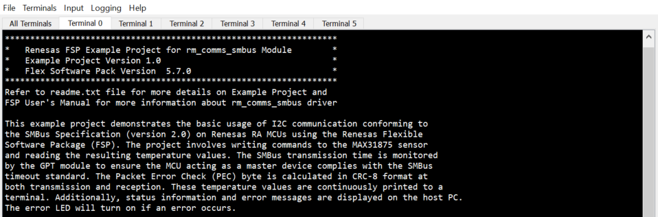

# Introduction #

This example project demonstrates the basic usage of I2C communication conforming to the SMBus Specification (version 2.0) on Renesas RA MCUs using the Renesas Flexible Software Package (FSP). The project involves writing commands to the MAX31875 sensor and reading the resulting temperature values. The SMBus transmission time is monitored by the GPT module to ensure the MCU acting as a master device complies with the SMBus timeout standard. The Packet Error Check (PEC) byte is calculated in CRC-8 format at both transmission and reception. These temperature values are continuously printed to a terminal. Additionally, status information and error messages are displayed on the host PC. The error LED will turn on if an error occurs.

**NOTE:**
- To display information, users can choose between the SEGGER J-Link RTT Viewer and the Serial Terminal (UART) with J-Link OB VCOM. It is important to note that the user should only operate a single terminal application at a time to avoid conflicts or data inconsistencies. 
- For instructions on how to switch between these options, please refer to the "Verifying Operation" section in this file.
- By default, EP information is printed to the host PC using the Serial Terminal for boards that support J-Link OB VCOM.
- RA boards support J-Link OB VCOM: EK-RA8M1, EK-RA2A2, EK-RA4E2, EK-RA6E2, EK-RA8D1, FPB-RA2E3, MCK-RA4T1, MCK-RA6T3, MCK-RA8T1, FPB-RA8E1.

**For the RA boards that do not support J-Link OB VCOM, EP uses the SEGGER J-Link RTT Viewer by default instead.**

Please refer to the [Example Project Usage Guide](https://github.com/renesas/ra-fsp-examples/blob/master/example_projects/Example%20Project%20Usage%20Guide.pdf) 
for general information on example projects and [readme.txt](./readme.txt) for specifics of operation.

## Required Resources ## 
To build and run the SMBus example project, the following resources are needed.

### Software ###
* Renesas Flexible Software Package (FSP): Version 5.8.0
* E2 studio: Version 2025-01
* SEGGER J-Link RTT Viewer: Version 8.12c
* GCC ARM Embedded Toolchain: Version 13.2.1.arm-13-7
* Serial Terminal Console Application: Tera Term or a similar application (for boards that support J-Link OB VCOM)

### Hardware Requirements ###
Supported RA Boards: EK-RA8M1, CK-RA6M5, EK-RA2A1, EK-RA2A2, EK-RA2E1, EK-RA2E2, EK-RA2L1, EK-RA4E2, EK-RA4M1, EK-RA4M2, EK-RA4M3, EK-RA4W1, EK-RA6E2, EK-RA6M1, EK-RA6M2, EK-RA6M3, EK-RA6M3G, EK-RA6M4, EK-RA6M5, EK-RA8D1, FPB-RA2E3, FPB-RA4E1, FPB-RA6E1, MCK-RA4T1, MCK-RA6T2, MCK-RA6T3, MCK-RA8T1, RSSK-RA6T1, FPB-RA8E1.
* 1 x Host PC.
* 1 x Renesas RA board.
* 1 x Micro USB cable or 1 x Type C USB cable (For CK-RA6M5, MCK-RA4T1 , MCK-RA6T2 , MCK-RA6T3, FPB-RA8E1) or 1 x Mini USB cable (For RSSK-RA6T1)
* 1 x Evaluation Kit for the MAX31875
    * Link Product: https://www.mouser.com/ProductDetail/Analog-Devices-Maxim-Integrated/MAX31875EVKIT?qs=BZBei1rCqCDTW6E3jJcKjw%3D%3D&_gl=1
    * Manufacturer Product Number: MAX31875EVKIT#

**RA boards that do not require external resistors for pull-up:**

**For EK-RA8M1, CK-RA6M5, EK-RA2E1, EK-RA2L1, EK-RA4M3, EK-RA6M3, EK-RA6M3G, EK-RA6M4, EK-RA6M5, EK-RA8D1, FPB-RA4E1, FPB-RA6E1, FPB-RA8E1:**
* 4 x Jumper cables (4 - both ends female).

**For EK-RA2A2, FPB-RA2E3, MCK-RA4T1, MCK-RA6T3, MCK-RA8T1:**
* No additional jumper cables required.

**RA boards that require external resistors for pull-up:** EK-RA2A1, EK-RA2E2, EK-RA4E2, EK-RA4M1, EK-RA4M2, EK-RA4W1, EK-RA6E2, EK-RA6M1, EK-RA6M2, MCK-RA6T2, RSSK-RA6T1.
* 2 x Resistors (3.3K ohm or 4.7K ohm).
* 1 x breadboard.
* 7 x Jumper cables
    * 6 - male to female, 1 - both ends female.
    * 4 - male to female, 3 - both ends male ( For RSSK-RA6T1).

### Hardware Connections ###
* EK-RA8M1:
    * Connect RA board to Host PC by Micro USB cable.
    * Connect RA board to MAX31875PMB1 as below:

        | RA board | MAX31875PMB1 |
        |----------|---------------|
        | SCL1 P512 (J56-Pin37) | SCL (J1-Pin3) |
        | SDA1 P511 (J57-Pin38) | SDA (J1-Pin4) |
        | GND (J57-Pin49) | GND (J1-Pin5) |
        | VCC (J56-Pin40) | VDD (J1-Pin6) |

* CK-RA6M5:
    * Connect RA board to Host PC by TypeC USB cable.
    * Connect RA board to MAX31875PMB1 as below:

        | RA board | MAX31875PMB1 |
        |----------|---------------|
        | SCL1 P512 (J3-Pin10) | SCL (J1-Pin3) |
        | SDA1 P511 (J3-Pin9) | SDA (J1-Pin4) |
        | GND (J6-Pin6) | GND (J1-Pin5) |
        | VCC (J6-Pin4) | VDD (J1-Pin6) |

* EK-RA2A1:
    * Connect RA board to Host PC by Micro USB cable.
    * Connect RA board to MAX31875PMB1 as below:

        | RA board | MAX31875PMB1 |
        |----------|---------------|
        | SCL1 P109 (J1-Pin37) | SCL (J1-Pin3) |
        | SDA1 P110 (J1-Pin35) | SDA (J1-Pin4) |
        | GND (J1-Pin17) | GND (J1-Pin5) |
        | VCC (J1-Pin15) | VDD (J1-Pin6) |

* EK-RA2A2, FPB-RA2E3:
    * Connect RA board to Host PC by Micro USB cable.
    * Connect MAX31875PMB1 (JU4:1) to RA board via the PMOD2 Port (PMOD2:1)

* EK-RA2E1:
    * Connect RA board to Host PC by Micro USB cable.
    * Connect RA board to MAX31875PMB1 as below:

        | RA board | MAX31875PMB1 |
        |----------|---------------|
        | SCL0 P408 (J2-Pin08) | SCL (J1-Pin3) |
        | SDA0 P407 (J2-Pin09) | SDA (J1-Pin4) |
        | GND (J2-Pin40) | GND (J1-Pin5) |
        | VCC (J2-Pin01) | VDD (J1-Pin6) |

* EK-RA2E2:
    * Connect RA board to Host PC by Micro USB cable.
    * Connect RA board to MAX31875PMB1 as below:

        | RA board | MAX31875PMB1 |
        |----------|---------------|
        | SCL0 P400 (J1-Pin02) | SCL (J1-Pin3) |
        | SDA0 P401 (J1-Pin03) | SDA (J1-Pin4) |
        | GND (J1-Pin13) | GND (J1-Pin5) |
        | VCC (J1-Pin01) | VDD (J1-Pin6) |

* EK-RA2L1:
    * Connect RA board to Host PC by Micro USB cable.
    * Connect RA board to MAX31875PMB1 as below:

        | RA board | MAX31875PMB1 |
        |----------|---------------|
        | SCL0 P408 (J1-Pin10) | SCL (J1-Pin3) |
        | SDA0 P407 (J1-Pin11) | SDA (J1-Pin4) |
        | GND (J1-Pin40) | GND (J1-Pin5) |
        | VCC (J1-Pin01) | VDD (J1-Pin6) |

* EK-RA4E2, EK-RA6E2:
    * Connect RA board to Host PC by Micro USB cable.
    * Connect RA board to MAX31875PMB1 as below:

        | RA board | MAX31875PMB1 |
        |----------|---------------|
        | SCL0 P205 (J2-Pin16) | SCL (J1-Pin3) |
        | SDA0 P206 (J2-Pin15) | SDA (J1-Pin4) |
        | GND (J2-Pin40) | GND (J1-Pin5) |
        | VCC (J2-Pin01) | VDD (J1-Pin6) |

* EK-RA4M1:
    * Connect RA board to Host PC by Micro USB cable.
    * Connect RA board to MAX31875PMB1 as below:

        | RA board | MAX31875PMB1 |
        |----------|---------------|
        | SCL0 P400 (J2-Pin37) | SCL (J1-Pin3) |
        | SDA0 P401 (J2-Pin08) | SDA (J1-Pin4) |
        | GND (J2-Pin12) | GND (J1-Pin5) |
        | VCC (J2-Pin10) | VDD (J1-Pin6) |

* EK-RA4M2:
    * Connect RA board to Host PC by Micro USB cable.
    * Connect RA board to MAX31875PMB1 as below:

        | RA board | MAX31875PMB1 |
        |----------|---------------|
        | SCL0 P400 (J1-Pin04) | SCL (J1-Pin3) |
        | SDA0 P401 (J1-Pin03) | SDA (J1-Pin4) |
        | GND (J1-Pin27) | GND (J1-Pin5) |
        | VCC (J1-Pin01) | VDD (J1-Pin6) |

* EK-RA4M3, EK-RA6M4:
    * Connect RA board to Host PC by Micro USB cable.
    * Connect RA board to MAX31875PMB1 as below:

        | RA board | MAX31875PMB1 |
        |----------|---------------|
        | SCL1 P512 (J2-Pin37) | SCL (J1-Pin3) |
        | SDA1 P511 (J2-Pin38) | SDA (J1-Pin4) |
        | GND (J2-Pin39) | GND (J1-Pin5) |
        | VCC (J2-Pin40) | VDD (J1-Pin6) |

* EK-RA4W1:
    * Connect RA board to Host PC by Micro USB cable.
    * Connect RA board to MAX31875PMB1 as below:

        | RA board | MAX31875PMB1 |
        |----------|---------------|
        | SCL1 P205 (CN7-Pin08) | SCL (J1-Pin3) |
        | SDA1 P206 (CN7-Pin07) | SDA (J1-Pin4) |
        | GND (CN7-Pin19) | GND (J1-Pin5) |
        | VCC (CN7-Pin18) | VDD (J1-Pin6) |

* EK-RA6M1:
    * Connect RA board to Host PC by Micro USB cable.
    * Connect RA board to MAX31875PMB1 as below:

        | RA board | MAX31875PMB1 |
        |----------|---------------|
        | SCL0 P400 (J1-Pin01) | SCL (J1-Pin3) |
        | SDA0 P401 (J1-Pin03) | SDA (J1-Pin4) |
        | GND (J1-Pin17) | GND (J1-Pin5) |
        | VCC (J1-Pin15) | VDD (J1-Pin6) |

* EK-RA6M2:
    * Connect RA board to Host PC by Micro USB cable.
    * Connect RA board to MAX31875PMB1 as below:

        | RA board | MAX31875PMB1 |
        |----------|---------------|
        | SCL0 P400 (J4-Pin13) | SCL (J1-Pin3) |
        | SDA0 P401 (J4-Pin11) | SDA (J1-Pin4) |
        | GND (J4-Pin36) | GND (J1-Pin5) |
        | VCC (J4-Pin37) | VDD (J1-Pin6) |

* EK-RA6M3, EK-RA6M3G:
    * Connect RA board to Host PC by Micro USB cable.
    * Connect RA board to MAX31875PMB1 as below:

        | RA board | MAX31875PMB1 |
        |----------|---------------|
        | SCL2 P512 (J1-Pin05) | SCL (J1-Pin3) |
        | SDA2 P511 (J1-Pin21) | SDA (J1-Pin4) |
        | GND (J1-Pin30) | GND (J1-Pin5) |
        | VCC (J1-Pin36) | VDD (J1-Pin6) |

* EK-RA6M5:
    * Connect RA board to Host PC by Micro USB cable.
    * Connect RA board to MAX31875PMB1 as below:

        | RA board | MAX31875PMB1 |
        |----------|---------------|
        | SCL1 P512 (J4-Pin38) | SCL (J1-Pin3) |
        | SDA1 P511 (J4-Pin39) | SDA (J1-Pin4) |
        | GND (J4-Pin40) | GND (J1-Pin5) |
        | VCC (J4-Pin01) | VDD (J1-Pin6) |

* EK-RA8D1:
    * Connect RA board to Host PC by Micro USB cable.
    * Connect RA board to MAX31875PMB1 as below:

        | RA board | MAX31875PMB1 |
        |----------|---------------|
        | SCL1 P512 (J57-Pin04) | SCL (J1-Pin3) |
        | SDA1 P511 (J57-Pin02) | SDA (J1-Pin4) |
        | GND (J57-Pin39) | GND (J1-Pin5) |
        | VCC (J57-Pin05) | VDD (J1-Pin6) |

* FPB-RA4E1, FPB-RA6E1:
    * Connect RA board to Host PC by Micro USB cable.
    * Connect RA board to MAX31875PMB1 as below:

        | RA board | MAX31875PMB1 |
        |----------|---------------|
        | SCL0 P400 (J3-Pin01) | SCL (J1-Pin3) |
        | SDA0 P401 (J3-Pin02) | SDA (J1-Pin4) |
        | GND (J3-Pin12) | GND (J1-Pin5) |
        | VCC (J3-Pin15) | VDD (J1-Pin6) |

* FPB-RA8E1:
    * Connect RA board to Host PC by TypeC USB cable.
    * Connect RA board to MAX31875PMB1 as below:

        | RA board | MAX31875PMB1 |
        |----------|---------------|
        | SCL1 P512 (J24-Pin10) | SCL (J1-Pin3) |
        | SDA1 P511 (J24-Pin9) | SDA (J1-Pin4) |
        | GND (J18-Pin6) | GND (J1-Pin5) |
        | VCC (J18-Pin4) | VDD (J1-Pin6) |     

* MCK-RA4T1, MCK-RA6T3:
    * Connect RA board to Host PC by Type C USB cable.
    * Connect MAX31875PMB1 (JU4:1) to RA board via the PMOD1 Port (PMOD1:1)
    * Jumper J10 short pin2-3 to select SCL Pin
    * Jumper J11 short pin1-2 to select SDA Pin

* MCK-RA6T2:
    * Connect RA board to Host PC by Type C USB cable.
    * Connect RA board to MAX31875PMB1 as below:

        | RA board | MAX31875PMB1 |
        |----------|---------------|
        | SCL0 PB06 (CN4-Pin33) | SCL (J1-Pin3) |
        | SDA0 PB07 (CN4-Pin31) | SDA (J1-Pin4) |
        | GND (CN4-Pin25) | GND (J1-Pin5) |
        | VCC (CN4-Pin23) | VDD (J1-Pin6) |

* MCK-RA8T1:
    * Connect RA board to Host PC by Type C USB cable.
    * Connect MAX31875PMB1 (JU4:1) to RA board via the PMOD6A Port (PMOD6A:1)

* RSSK-RA6T1:
    * Connect RA board to Host PC by Mini USB cable.
    * Connect RA board to MAX31875PMB1 as below:

        | RA board | MAX31875PMB1 |
        |----------|---------------|
        | SCL1 P101 (CN8-Pin02) | SCL (J1-Pin3) |
        | SDA1 P100 (CN8-Pin03) | SDA (J1-Pin4) |
        | GND (CN8-Pin05) | GND (J1-Pin5) |
        | VCC (CN8-Pin06) | VDD (J1-Pin6) |

Refer to the software required section in [Example Project Usage Guide](https://github.com/renesas/ra-fsp-examples/blob/master/example_projects/Example%20Project%20Usage%20Guide.pdf)

## Related Collateral References ##
The following documents can be referred to for enhancing your understanding of 
the operation of this example project:
- [FSP User Manual on GitHub](https://renesas.github.io/fsp/)
- [FSP Known Issues](https://github.com/renesas/fsp/issues)

# Project Notes #

## System Level Block Diagram ##
High level block diagram of the system is shown below:
 

## FSP Modules Used ##
List all the various modules that are used in this example project. Refer to the FSP User Manual for further details on each module listed below.

| Module Name | Usage | Searchable Keyword  |
|-------------|-----------------------------------------------|-----------------------------------------------|
| SMBus Communication Device | SMBus is used to communicate with the Evaluation Kit for the MAX31875 | rm_comms_smbus |

**Configuration Properties for SMBus Communication Device**

|   Module Property Path and Identifier   |   Default Value   |   Used Value   |   Reason   |
|-----------------------------------------|-------------------|----------------|------------|
| configuration.xml > g_comms_smbus0 SMBus Communication Device (rm_comms_smbus) > Settings > Property > Module g_comms_smbus0 SMBus Communication Device (rm_comms_smbus) > Callback | comms_smbus_callback | comms_smbus_callback | Provide a user callback function. |
| configuration.xml > g_comms_smbus0 SMBus Communication Device (rm_comms_smbus) > Settings > Property > Module g_comms_smbus0 SMBus Communication Device (rm_comms_smbus) > Slave Address | 0x00 | 0x48 | Specify the slave address. |
| configuration.xml > g_comms_smbus0 SMBus Communication Device (rm_comms_smbus) > Settings > Property > Module g_comms_smbus0 SMBus Communication Device (rm_comms_smbus) > CRC support | Enable | Enable | Enable PEC support and use CRC-8 algorithm to generate PEC byte for SMBus communication. |
| configuration.xml > g_i2c_master0 I2C Master (r_iic_master) > Settings > Property > Common > DTC on Transmission and Reception | Disable | Disable | DTC support must be disabled. |

**For EK-RA8M1, CK-RA6M5, EK-RA2A1, EK-RA4M3, EK-RA4W1, EK-RA6M4, EK-RA6M5, EK-RA8D1, MCK-RA8T1, RSSK-RA6T1, FPB-RA8E1:**  
|   Module Property Path and Identifier   |   Default Value   |   Used Value   |   Reason   |
|-----------------------------------------|-------------------|----------------|------------|
| configuration.xml > g_comms_smbus_rsc_ctrl0 SMBus Resources control (rm_comms_smbus) > Settings > Property > Module g_comms_smbus_rsc_ctrl0 SMBus Resources control (rm_comms_smbus) > IIC channel | 0 | 1 | Select IIC channel 1. |
| configuration.xml > g_comms_smbus_rsc_ctrl0 SMBus Resources control (rm_comms_smbus) > Settings > Property > Module g_comms_smbus_rsc_ctrl0 SMBus Resources control (rm_comms_smbus) > IIC variant | IIC | IIC | Select IIC as IIC variant be used under I2C Shared Bus stack. |

**For EK-RA2A2, EK-RA2E1, EK-RA2L1, EK-RA4M1, EK-RA4M2, EK-RA6M1, EK-RA6M2, FPB-RA2E3, FPB-RA4E1, FPB-RA6E1:**  
|   Module Property Path and Identifier   |   Default Value   |   Used Value   |   Reason   |
|-----------------------------------------|-------------------|----------------|------------|
| configuration.xml > g_comms_smbus_rsc_ctrl0 SMBus Resources control (rm_comms_smbus) > Settings > Property > Module g_comms_smbus_rsc_ctrl0 SMBus Resources control (rm_comms_smbus) > IIC channel | 0 | 0 | Select IIC channel 0. |
| configuration.xml > g_comms_smbus_rsc_ctrl0 SMBus Resources control (rm_comms_smbus) > Settings > Property > Module g_comms_smbus_rsc_ctrl0 SMBus Resources control (rm_comms_smbus) > IIC variant | IIC | IIC | Select IIC as IIC variant be used under I2C Shared Bus stack. |

**For EK-RA6M3, EK-RA6M3G:**  
|   Module Property Path and Identifier   |   Default Value   |   Used Value   |   Reason   |
|-----------------------------------------|-------------------|----------------|------------|
| configuration.xml > g_comms_smbus_rsc_ctrl0 SMBus Resources control (rm_comms_smbus) > Settings > Property > Module g_comms_smbus_rsc_ctrl0 SMBus Resources control (rm_comms_smbus) > IIC channel | 0 | 2 | Select IIC channel 2. |
| configuration.xml > g_comms_smbus_rsc_ctrl0 SMBus Resources control (rm_comms_smbus) > Settings > Property > Module g_comms_smbus_rsc_ctrl0 SMBus Resources control (rm_comms_smbus) > IIC variant | IIC | IIC | Select IIC as IIC variant be used under I2C Shared Bus stack. |

**For EK-RA2E2, EK-RA4E2, EK-RA6E2, MCK-RA4T1, MCK-RA6T2, MCK-RA6T3:**  
|   Module Property Path and Identifier   |   Default Value   |   Used Value   |   Reason   |
|-----------------------------------------|-------------------|----------------|------------|
| configuration.xml > g_comms_smbus_rsc_ctrl0 SMBus Resources control (rm_comms_smbus) > Settings > Property > Module g_comms_smbus_rsc_ctrl0 SMBus Resources control (rm_comms_smbus) > IIC channel | 0 | 0 | Select IIC channel 0. |
| configuration.xml > g_comms_smbus_rsc_ctrl0 SMBus Resources control (rm_comms_smbus) > Settings > Property > Module g_comms_smbus_rsc_ctrl0 SMBus Resources control (rm_comms_smbus) > IIC variant | IIC | IIC_B | Select IIC_B version as IIC variant be used under I2C Shared Bus stack. |

**Configuration Properties for SMBus timer (GPT)**
|   Module Property Path and Identifier   |   Default Value   |   Used Value   |   Reason   |
|-----------------------------------------|-------------------|----------------|------------|
| configuration.xml > g_comms_smbus_rsc_ctrl0_timer Timer, General PWM (r_gpt) > Settings > Property > Module g_comms_smbus_rsc_ctrl0_timer Timer, General PWM (r_gpt) > General > Compare Match > Compare Match A > Status | Enable | Enable | Enable Compare Match A. |
| configuration.xml > g_comms_smbus_rsc_ctrl0_timer Timer, General PWM (r_gpt) > Settings > Property > Module g_comms_smbus_rsc_ctrl0_timer Timer, General PWM (r_gpt) > General > Compare Match > Compare Match A > Compare match value | 0xa | 0xa | Set compare match A value is 10ms. |
| configuration.xml > g_comms_smbus_rsc_ctrl0_timer Timer, General PWM (r_gpt) > Settings > Property > Module g_comms_smbus_rsc_ctrl0_timer Timer, General PWM (r_gpt) > General > Mode | One-Shot | One-Shot | Set GPT mode is One-Shot. |
| configuration.xml > g_comms_smbus_rsc_ctrl0_timer Timer, General PWM (r_gpt) > Settings > Property > Module g_comms_smbus_rsc_ctrl0_timer Timer, General PWM (r_gpt) > General > Period | 0x19 | 0x19 | Set overflow value is 25ms. |
| configuration.xml > g_comms_smbus_rsc_ctrl0_timer Timer, General PWM (r_gpt) > Settings > Property > Module g_comms_smbus_rsc_ctrl0_timer Timer, General PWM (r_gpt) > General > Period Unit | Milliseconds | Milliseconds | Set period unit is milliseconds. |
| configuration.xml > g_comms_smbus_rsc_ctrl0_timer Timer, General PWM (r_gpt) > Settings > Property > Module g_comms_smbus_rsc_ctrl0_timer Timer, General PWM (r_gpt) > Input > Stop Source | GTETRGA Rising Edge | GTETRGA Rising Edge | Select GTETRGA Rising Edge as external source that will stop the timer. |
| configuration.xml > g_comms_smbus_rsc_ctrl0_timer Timer, General PWM (r_gpt) > Settings > Property > Module g_comms_smbus_rsc_ctrl0_timer Timer, General PWM (r_gpt) > Interrupts > Overflow/Crest Interrupt Priority | Disable | Priority 2 | Select the overflow interrupt priority. |

**Configuration Properties for using the Serial Terminal (UART)**

**For EK-RA8D1, EK-RA8M1, FPB-RA8E1:**  
|   Configure interrupt event path   |   Default Value   |   Used Value   |   Reason   |
|-----------------------------------------|-------------------|----------------|------------|
| configuration.xml > Interrupts > Interrupts Configuration > New User Event > SCI > SCI9 > SCI9 RXI (Receive data full) | empty | sci_b_uart_rxi_isr | Assign the UART receive ISR (Receive data full) to the interrupt vector table. |
| configuration.xml > Interrupts > Interrupts Configuration > New User Event > SCI > SCI9 > SCI9 TXI (Transmit data empty) | empty | sci_b_uart_txi_isr | Assign the UART transfer ISR (Transmit data empty) to the interrupt vector table. |
| configuration.xml > Interrupts > Interrupts Configuration > New User Event > SCI > SCI9 > SCI9 TEI (Transmit end) | empty | sci_b_uart_tei_isr | Assign the UART transfer ISR (Transmit end) to the interrupt vector table. |
| configuration.xml > Interrupts > Interrupts Configuration > New User Event > SCI > SCI9 > SCI9 ERI (Receive error) | empty | sci_b_uart_eri_isr | Assign the UART receive ISR (Receive error) to the interrupt vector table. |

|   Configure Clock path   |   Default Value   |   Used Value   |   Reason   |
|-----------------------------------------|-------------------|----------------|------------|
| configuration.xml > Clocks > Clocks Configuration | SCICLK Disable | SCICLK Src:PLL1P | Enable operating clock for SCI module by PLL1P clock source. |

**For EK-RA4E2, EK-RA6E2:**  
|   Configure Interrupt Event Path        |   Default Value   |   Used Value   |   Reason   |
|-----------------------------------------|-------------------|----------------|------------|
| configuration.xml > Interrupts > Interrupts Configuration > New User Event > SCI > SCI0 > SCI0 RXI (Receive data full) | empty | sci_uart_rxi_isr | Assign the UART receive ISR (Receive data full) to the interrupt vector table. |
| configuration.xml > Interrupts > Interrupts Configuration > New User Event > SCI > SCI0 > SCI0 TXI (Transmit data empty) | empty | sci_uart_txi_isr | Assign the UART transfer ISR (Transfer data empty) to the interrupt vector table. |
| configuration.xml > Interrupts > Interrupts Configuration > New User Event > SCI > SCI0 > SCI0 TEI (Transmit end) | empty | sci_uart_tei_isr | Assign the UART transfer ISR (Transfer end) to the interrupt vector table. |
| configuration.xml > Interrupts > Interrupts Configuration > New User Event > SCI > SCI0 > SCI0 ERI (Receive error) | empty | sci_uart_eri_isr | Assign the UART receive ISR (Receive error) to the interrupt vector table. |

**For EK-RA2A2, FPB-RA2E3, MCK-RA4T1, MCK-RA6T3:**
|   Configure Interrupt Event Path        |   Default Value   |   Used Value   |   Reason   |
|-----------------------------------------|-------------------|----------------|------------|
| configuration.xml > Interrupts > Interrupts Configuration > New User Event > SCI > SCI9 > SCI9 RXI (Receive data full) | empty | sci_uart_rxi_isr | Assign the UART receive ISR (Receive data full) to the interrupt vector table. |
| configuration.xml > Interrupts > Interrupts Configuration > New User Event > SCI > SCI9 > SCI9 TXI (Transmit data empty) | empty | sci_uart_txi_isr | Assign the UART transfer ISR (Transfer data empty) to the interrupt vector table. |
| configuration.xml > Interrupts > Interrupts Configuration > New User Event > SCI > SCI9 > SCI9 TEI (Transmit end) | empty | sci_uart_tei_isr | Assign the UART transfer ISR (Transfer end) to the interrupt vector table. |
| configuration.xml > Interrupts > Interrupts Configuration > New User Event > SCI > SCI9 > SCI9 ERI (Receive error) | empty | sci_uart_eri_isr | Assign the UART receive ISR (Receive error) to the interrupt vector table. |

**For MCK-RA8T1:**  
|   Configure interrupt event path   |   Default Value   |   Used Value   |   Reason   |
|-----------------------------------------|-------------------|----------------|------------|
| configuration.xml > Interrupts > Interrupts Configuration > New User Event > SCI > SCI3 > SCI3 RXI (Receive data full) | empty | sci_b_uart_rxi_isr | Assign the UART receive ISR (Receive data full) to the interrupt vector table. |
| configuration.xml > Interrupts > Interrupts Configuration > New User Event > SCI > SCI3 > SCI3 TXI (Transmit data empty) | empty | sci_b_uart_txi_isr | Assign the UART transfer ISR (Transmit data empty) to the interrupt vector table. |
| configuration.xml > Interrupts > Interrupts Configuration > New User Event > SCI > SCI3 > SCI3 TEI (Transmit end) | empty | sci_b_uart_tei_isr | Assign the UART transfer ISR (Transmit end) to the interrupt vector table. |
| configuration.xml > Interrupts > Interrupts Configuration > New User Event > SCI > SCI3 > SCI3 ERI (Receive error) | empty | sci_b_uart_eri_isr | Assign the UART receive ISR (Receive error) to the interrupt vector table. |

|   Configure Clock path   |   Default Value   |   Used Value   |   Reason   |
|-----------------------------------------|-------------------|----------------|------------|
| configuration.xml > Clocks > Clocks Configuration | SCICLK Disable | SCICLK Src:PLL1P | Enable operating clock for SCI module by PLL1P clock source. |

## API Usage ##
The table below lists the FSP provided API used at the application layer in this example project.

| API Name    | Usage                                                                          |
|-------------|--------------------------------------------------------------------------------|
| R_IIC_MASTER_Open | This API is used to initialize IIC master module to communicate with sensor. |
| R_GPT_Open | This API is used to initialize GPT module to handle timeout for SMBus standard. |
| R_ELC_Open | This API is used to initialize ELC module to link IIC event to GPT. |
| RM_COMMS_SMBus_Open | This API is used to initialize SMBus Middleware driver. |
| RM_COMMS_SMBus_Write | This API is used to write data to specific register of sensor via SMBus. |
| RM_COMMS_SMBus_WriteRead | This API is used to read data from specific register of sensor via SMBus. |
| R_IIC_MASTER_Close | This API is used to de-initialize IIC master module. |
| R_GPT_Close |	This API is used to de-initialize GPT module. |
| R_ELC_Close |	This API is used to de-initialize ELC module. |
| RM_COMMS_SMBus_Close | This API is used to de-initialize SMBus Middleware driver. |
| R_BSP_SoftwareDelay | This API is used to delay a specified period of time. |

**For RA boards use IIC_B version:**

| API Name    | Usage                                                                                |
|-------------|--------------------------------------------------------------------------------------|
| R_IIC_B_MASTER_Open | This API is used to initialize IIC master module to communicate with sensor. |
| R_IIC_B_MASTER_Close | This API is used to de-initialize IIC master module.                        |

**API use for the Serial Terminal (UART):**

* **For RA boards use SCI_B version:**

| API Name    | Usage                                                     |
|-------------|-----------------------------------------------------------|
| R_SCI_B_UART_Open | This API is used to initialize SCI UART module.     |
| R_SCI_B_UART_Write | This API is used to perform a write operation.     |
| R_SCI_B_UART_Close | This API is used to de-initialize SCI UART module. |

* **For RA boards use SCI version:**

| API Name    | Usage                                                   |
|-------------|---------------------------------------------------------|
| R_SCI_UART_Open | This API is used to initialize SCI UART module.     |
| R_SCI_UART_Write | This API is used to perform a write operation.     |
| R_SCI_UART_Close | This API is used to de-initialize SCI UART module. |

## Verifying Operation ##
1. Import the example project. 

    By default, the EP supports Serial terminal for RA boards that support J-link OB VCOM

    * Define USE_VIRTUAL_COM=1 macro in Project Properties -> C/C++ Build -> Settings -> Tool Settings -> GNU ARM Cross C Compiler -> Preprocessor

    To use SEGGER J-Link RTT Viewer, please follow the instructions below:

    * Define USE_VIRTUAL_COM=0 macro in Project Properties -> C/C++ Build -> Settings -> Tool Settings -> GNU ARM Cross C Compiler -> Preprocessor
2. Before running the example project, make sure hardware connections are completed.
3. Download the example project to the RA board using the USB Debug Port.
4. Open the terminal application and view output log.

### The below images showcase the output on the Serial terminal application (Tera Term) ###

### The below images showcase the output on the SEGGER J-Link RTT Viewer ###

## Special Topics ##
The SMBus transaction time is monitored by the GPT module to ensure the MCU acting as a master device complies with the SMBus timeout standard.
| Communication     | Handle by                                                          |
|-------------|--------------------------------------------------------------------------|
| From start condition to acknowledge bit do not exceed 10 ms | GPT compare match A |
| Between acknowledge bits do not exceed 10 ms | GPT compare match A |
| From acknowledge bit to stop condition do not exceed 10 ms | GPT compare match A |
| The total of above values do not exceed 25 ms | GPT overflow |

The error LED information:
* The RA Boards use Red LED as error LED: EK-RA8M1, CK-RA6M5, EK-RA2A2, EK-RA2E1, EK-RA2E2, EK-RA2L1, EK-RA4E2, EK-RA4M2, EK-RA4M3, EK-RA6E2, EK-RA6M3, EK-RA6M3G, EK-RA6M4, EK-RA6M5, EK-RA8D1.
* The RA Boards use LED 1 as error LED: EK-RA2A1, EK-RA4M1, EK-RA4W1, EK-RA6M1, EK-RA6M2.
* The RA Boards use LED 2 as error LED: FPB-RA2E3, FPB-RA4E1, FPB-RA6E1, MCK-RA4T1, MCK-RA6T2,  MCK-RA6T3, MCK-RA8T1, RSSK-RA6T1, FPB-RA8E1.