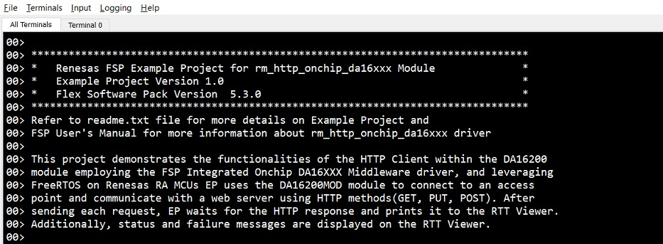

# Introduction #

This project demonstrates the functionalities of the HTTP Client within the DA16200 module, employing the FSP Integrated Onchip
DA16XXX Middleware driver, and leveraging FreeRTOS on Renesas RA MCUs. EP uses the US159-DA16200EVZ Ultra Low Power Wi-Fi Pmod™
module to connect to an access point and communicate with a web server using HTTP methods (GET, PUT, POST). After sending each 
request, EP waits for the HTTP response and prints it to the RTT Viewer. Additionally, status and failure messages are displayed
on the RTT Viewer.

Please refer to the [Example Project Usage Guide](https://github.com/renesas/ra-fsp-examples/blob/master/example_projects/Example%20Project%20Usage%20Guide.pdf) 
for general information on example projects and [readme.txt](./readme.txt) for specifics of the operation.

## Required Resources ##
To build and run the example project, the following resources are needed.

### Hardware ###
* 1 x RA board: EK-RA6M5
* 1 x Micro USB cable for programming, debugging and observing EP operations on RTT viewer.
* 1 x Wi-Fi router Access Point(AP) with internet access. Note: WiFi router AP's credentials should be known.
* 1 x US159-DA16200EVZ Ultra Low Power Wi-Fi Pmod™ (Part Number: US159-DA16200MEVZ) (SDK v3.2.8.1).  
    * Note: Please ensure the Pmod™ SDK is up-to-date before executing the project.  
    For SDK update instructions, please refer to Section 5, 6, and 7 in the provided link: https://www.renesas.com/en/document/apn/da16200da16600-sdk-update-guide

### Hardware Connections ###
* Plug in the US159-DA16200MEVZ to the Pmod2 connector on the MCU evaluation kit and be careful to align Pin 1 on the module to Pin 1 on the MCU kit.
* Connect the USB Debug port on EK-RA6M5 to the PC using a micro USB cable.

### Software ###
* Renesas Flexible Software Package (FSP): Version 5.9.0
* e2 studio: Version 2025-04
* SEGGER J-Link RTT Viewer: Version 8.12f
* GCC ARM Embedded Toolchain: Version 13.2.1.arm-13-7

Refer to the software required section in [Example Project Usage Guide](https://github.com/renesas/ra-fsp-examples/blob/master/example_projects/Example%20Project%20Usage%20Guide.pdf) for basic information on setting up and using the above software.
 
## Related Collateral References ##
The following documents can be referred to for enhancing your understanding of 
the operation of this example project:
- [FSP User Manual on GitHub](https://renesas.github.io/fsp/)
- [FSP Known Issues](https://github.com/renesas/fsp/issues)

# Project Notes #

## System Level Block Diagram ##
 High level block diagram
 

 
## FSP Modules Used ##
List all the various modules that are used in this example project. Refer to the FSP User Manual for further details on each module listed below.

| Module Name | Usage | Searchable Keyword  |
|-------------|-----------------------------------------------|-----------------------------------------------|
| HTTP Client on DA16XXX | The HTTP Onchip da16xxx Middleware is used to communicate with the HTTP server over a Wi-Fi network using the DA16XXX module. | rm_http_onchip_da16xx|

## Module Configuration Notes ##
This section describes FSP Configurator properties which are important or different than those selected by default. 

|   Module Property Path and Identifier   |   Default Value   |   Used Value   |   Reason   |
| --------------------------------------- | ----------------- | ---------------| ---------- |
|configuration.xml > HTTP Client Thread > Properties > Settings > Property > Common > General > Use Mutexes | Disabled | Enabled | Enabled to include mutex functionality|
|configuration.xml > HTTP Client Thread > Properties > Settings > Property > Thread > Stack size (bytes)|1024 |2048|RAM is used to obtain memory allocation|
|configuration.xml > HTTP Client Thread > HTTP Client on DA16XXX (rm_http_onchip_da16xxx) > DA16XXX transport on UART (rm_at_transport_da16xxx_uart) > Properties > Settings > Property > Module Reset Port | 06 | 04 |Setup reset port for the MCU|
|configuration.xml > HTTP Client Thread > HTTP Client on DA16XXX (rm_http_onchip_da16xxx) > DA16XXX transport on UART (rm_at_transport_da16xxx_uart) > Properties > Settings > Property > Module Reset Pin | 03 | 04 |Setup reset pin for the MCU|
|configuration.xml > g_uart0 > module > general > channel | 0 | 0 | PMOD2 is available on UART channel 0 |
|configuration.xml > g_uart0 > Pins > TXD0 | unavailable | P411 | Select TX pin |
|configuration.xml > g_uart0 > Pins > RXD0 | unavailable | P410 | Select RX pin |

The table below lists the FSP provided API used at the application layer in this example project.

| API Name    | Usage                                                                          |
|-------------|--------------------------------------------------------------------------------|
|WIFI_On | This API is used to turn on Wi-Fi module and initialize the drivers |
|WIFI_Scan| This API is used to Perform a Wi-Fi network Scan |
|WIFI_ConnectAP | This API is used to connect to the Wi-Fi Access Point (AP) |
|WIFI_IsConnected | This API is used to check if the Wi-Fi is connected|
|WIFI_GetIPInfo | This API is used to get IP configuration (IP address, NetworkMask, Gateway and DNS server addresses)|
|WIFI_Disconnect |This API is used to disconnect from the currently connected Access Point|
|WIFI_Off |This API is used to turn off the Wi-Fi module|
|RM_HTTP_DA16XXX_Open |This API is used to initialize the DA16XXX on-chip HTTP Client service|
|RM_HTTP_DA16XXX_Send |This API is used to send the HTTP request with the configured buffers|
|RM_HTTP_DA16XXX_Close |This API is used to close the DA16XXX HTTP Client service|

## Verifying operation ##
1. Set up hardware connections.
* Plug in the US159-DA16200MEVZ to the Pmod2 connector on the MCU evaluation kit and be careful to align Pin 1 on the module to Pin 1 on the MCU kit.
* Connect the USB Debug port to view the status/error messages on J-Link RTT Viewer.
2. Import project, generate, build, and download to the RA board.
3. wifi_on_chip_http_client banner Print and EP Information:

4. Initialize Wifi successfully and print a menu for users to choose from:

5. The user presses '1' to scan for WiFi APs and print a list of WiFi access points for the user to select.

6. Enter the WiFi index and password for WiFi connection.

7. After step 4, User can press '2' to enter WiFi AP credentials manually.

8. Connecting to Wifi access point, on successful connection the EP displays the MCU IP address:    

9. After successfully connecting to Wifi, print the HTTP method menu for users to choose from: 

10. The user presses '1' to make an HTTP GET request

11. The user presses '2' to make an HTTP PUT request

12. The user presses '3' to make an HTTP POST request

