# Introduction #

This example project demonstrates the operation of the FileX file system, incorporating LevelX wear leveling
features on the OSPI block media of the RA MCU. The project will perform various FileX file system operations
based on the user's selection from the menu option, such as erase OSPI Flash, media management (open, format),
directory management (create, get properties, delete), file management (create, write, read, delete), and sector 
level operation (defragment, write, read, erase). The terminal application is used as the user interface. The menu options and
system messages (errors and information messages) will be printed on the terminal application during the execution
of the project.

**NOTE:**
- To display information, users can choose between the SEGGER J-Link RTT Viewer and the Serial Terminal (UART)with J-Link OB VCOM. It is important to note that the user should only operate a single terminal application at a time to avoid conflicts or data inconsistencies. 
- For instructions on how to switch between these options, please refer to the  **[Verifying Operation](#verifying-operation)** section in this file.
- By default, EP information is printed to the host PC using the Serial Terminal for boards that support J-Link OB VCOM.
 
  Vice versa, for the RA boards that do not support J-Link OB VCOM, EP uses the SEGGER J-Link RTT Viewer by default instead.
- RA boards supported for J-Link OB VCOM: EK-RA8D1

In Main menu, based on the input, user selects sub menu such as media menu, directory menu, file menu, or sector.
1. Flash Media operation menu.
2. Directory operation menu.
3. File operation menu.
4. Sector operation menu.

In Flash Media menu, based on the input, user selects operations to perform.
1. Erase entire Flash.
2. Format Media.
3. Open Media.
4. Defragment the Flash.
5. Go back Main Menu.

In Directory menu, based on the input, user selects operations to perform.
1. Create Directory.
2. Get Directory properties.
3. Delete Directory.
5. Go back Main Menu.

In File menu, based on the input, user selects operations to perform.
1. Create Empty File.
2. Write To File.
3. Read From File.
3. Delete File.
5. Go back Main Menu.

In Sector menu, based on the input, user selects operations to perform.
1. Write to Sector.
2. Read from Sector.
3. Erase Sector.
4. Go back Main Menu.

Please refer to the [Example Project Usage Guide](https://github.com/renesas/ra-fsp-examples/blob/master/example_projects/Example%20Project%20Usage%20Guide.pdf) 
for general information on example projects and [readme.txt](./readme.txt) for specifics of operation.

## Required Resources ## 
The following resources are needed to build and run the FileX_block_media_ospi_LevelX example project.

### Hardware ###
Supported RA boards: EK-RA8D1
* 1 x Renesas RA board.
* 1 x Micro USB cable for programming and debugging

### Hardware Connections  ###
  * Connect the USB Debug port on the RA board to the host PC via a micro USB cable. 

### Software ###
* Renesas Flexible Software Package (FSP): Version 5.7.0
* E2 studio: Version 2024-10
* SEGGER J-Link RTT Viewer: Version 8.10f
* GCC ARM Embedded Toolchain: Version 13.2.1.arm-13-7
* Serial Terminal Console Application: Tera Term or a similar application (for boards that support J-Link OB VCOM)

Refer to the software required section in [Example Project Usage Guide](https://github.com/renesas/ra-fsp-examples/blob/master/example_projects/Example%20Project%20Usage%20Guide.pdf)

## Related Collateral References ##
The following documents can be referred to for enhancing your understanding of 
the operation of this example project:
- [FSP User Manual on GitHub](https://renesas.github.io/fsp/)
- [FSP Known Issues](https://github.com/renesas/fsp/issues)

# Project Notes #

## System Level Block Diagram ##
 High level block diagram of the system is as shown below:
 
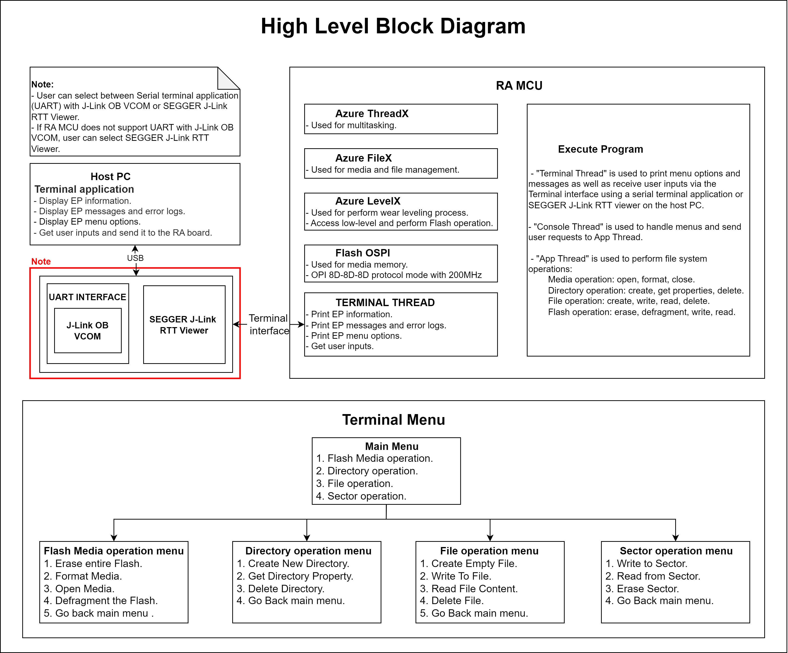

## FSP Modules Used ##
List all the various modules that are used in this example project. Refer to the FSP User Manual for further details on each module listed below.

| Module Name | Usage | Searchable Keyword  |
|-------------|-----------------------------------------------|-----------------------------------------------|
| Azure RTOS FileX on LevelX NOR | Azure RTOS FileX on LevelX NOR is used to configure the FileX system and media properties. | FileX |
| LevelX NOR Port | This module provides the hardware port layer for LevelX on NOR SPI flash memory. | rm_levelx_nor_spi |
| OSPI Flash | OSPI_B is used to configure flash device and perform write, read, or erase operations on flash device's memory array. | r_ospi_b |

## Module Configuration Notes ##
This section describes FSP configuration properties that are important or different from those selected by default.

**Configuration Properties for using Azure RTOS FileX on LevelX NOR**

|   Module Property Path and Identifier   |   Default Value   |   Used Value   |   Reason   |
|-----------------------------------------|-------------------|----------------|------------|
| configuration.xml > Stacks > Properties > g_fx_media Azure RTOS FileX on LevelX NOR > Settings > Property > Module g_fx_media Azure RTOS FileX on LevelX NOR > Volume Name | Volume 1 | RA OSPI_B | Set the volume label for the media. |
| configuration.xml > Stacks > Properties > g_fx_media Azure RTOS FileX on LevelX NOR > Settings > Property > Module g_fx_media Azure RTOS FileX on LevelX NOR > Number of FATs | 1 | 1 | Set the number of FATs in the media to 1. |
| configuration.xml > Stacks > Properties > g_fx_media Azure RTOS FileX on LevelX NOR > Settings > Property > Module g_fx_media Azure RTOS FileX on LevelX NOR > Directory Entries | 256 | 256 | Set the number of directory entries in the root directory. |
| configuration.xml > Stacks > Properties > g_fx_media Azure RTOS FileX on LevelX NOR > Settings > Property > Module g_fx_media Azure RTOS FileX on LevelX NOR > Hidden Sectors | 0 | 0 | set the number of sectors hidden. |
| configuration.xml > Stacks > Properties > g_fx_media Azure RTOS FileX on LevelX NOR > Settings > Property > Module g_fx_media Azure RTOS FileX on LevelX NOR > Total Sectors | 65536 | 66048 | Set the total number of sectors in the media. |
| configuration.xml > Stacks > Properties > g_fx_media Azure RTOS FileX on LevelX NOR > Settings > Property > Module g_fx_media Azure RTOS FileX on LevelX NOR > Sectors per Cluster | 1 | 1 | Set the number of sectors in each cluster. |
| configuration.xml > Stacks > Properties > g_fx_media Azure RTOS FileX on LevelX NOR > Settings > Property > Module g_fx_media Azure RTOS FileX on LevelX NOR > Working media memory size | 512 | 512 | Set the memory allocated for the file system. |

**Configuration Properties for using LevelX NOR Port**

|   Module Property Path and Identifier   |   Default Value   |   Used Value   |   Reason   |
|-----------------------------------------|-------------------|----------------|------------|
| configuration.xml > Stacks > Properties > g_rm_levelx_nor_spi LevelX NOR Port (rm_levelx_nor_spi) > Settings > Property > Common > Page Buffer Size (bytes) | 256 | 64 | Select the memory storage size for the block media. |
| configuration.xml > Stacks > Properties > g_rm_levelx_nor_spi LevelX NOR Port (rm_levelx_nor_spi) > Settings > Property > Module g_rm_levelx_nor_spi LevelX NOR Port (rm_levelx_nor_spi) > Memory Start Address Offset (bytes) | 0 | 0x80000 | Select the starting offset to use in the SPI memory. |
| configuration.xml > Stacks > Properties > g_rm_levelx_nor_spi LevelX NOR Port (rm_levelx_nor_spi) > Settings > Property > Module g_rm_levelx_nor_spi LevelX NOR Port (rm_levelx_nor_spi) > Memory Size (bytes) | 33554432 | 33816576 | Select the size of the LevelX memory that is sufficient to use the FAT32 format. |
| configuration.xml > Stacks > Properties g_rm_levelx_nor_spi LevelX NOR Port (rm_levelx_nor_spi) > > Settings > Property > Module g_rm_levelx_nor_spi LevelX NOR Port (rm_levelx_nor_spi) > Poll Status Count | 0xFFFFFFFF | 0xFFFFFFFF | Number of times to poll for operation complete status for blocking memory operations. |

**Configuration Properties for using OSPI Flash**

|   Module Property Path and Identifier   |   Default Value   |   Used Value   |   Reason   |
|-----------------------------------------|-------------------|----------------|------------|
| configuration.xml > Stacks > Properties > g_ospi_b OSPI Flash (r_ospi_b) > Settings > Property > Common > DMAC Support | Disable | Enable | Enable DMAC support for the OSPI module. |
| configuration.xml > Stacks > Properties > g_ospi_b OSPI Flash (r_ospi_b) > Settings > Property > Common > Autocalibration Support | Disable | Enable | Enable DS autocalibration for dual-data-rate modes. |
| configuration.xml > Stacks > Properties > g_ospi_b OSPI Flash (r_ospi_b) > Settings > Property > Module g_ospi_b OSPI Flash (r_ospi_b) > General > Channel | 0 | 1 | Use OSPI_B Channel 1 to communicate with flash device. |
| configuration.xml > Stacks > Properties > g_ospi_b OSPI Flash (r_ospi_b) > Settings > Property > Module g_ospi_b OSPI Flash (r_ospi_b) > General > Initial Protocol Mode | SPI (1S-1S-1S) | Dual data rate OPI (8D-8D-8D) | Select Dual data rate OPI (8D-8D-8D) as the initial protocol mode. |
| configuration.xml > Stacks > Properties > g_ospi_b OSPI Flash (r_ospi_b) > Settings > Property > Module g_ospi_b OSPI Flash (r_ospi_b) > General > Initial Address Bytes | 4 | 4 | Select the number of address bytes to be 4 bytes for the initial protocol mode. |
| configuration.xml > Stacks > Properties > g_ospi_b OSPI Flash (r_ospi_b) > Settings > Property > Module g_ospi_b OSPI Flash (r_ospi_b) > General > Write Status Bit | 0 | 0 | Position of the status bit in the flash device register. |
| configuration.xml > Stacks > Properties > g_ospi_b OSPI Flash (r_ospi_b) > Settings > Property > Module g_ospi_b OSPI Flash (r_ospi_b) > General > Write Enable Bit | 1 | 1 | Position of the write enable bit in the flash device register. |
| configuration.xml > Stacks > Properties > g_ospi_b OSPI Flash (r_ospi_b) > Settings > Property > Module g_ospi_b OSPI Flash (r_ospi_b) > General > Sector Erase Size | 4096 | 262144 | Sector size of the flash device. |
| configuration.xml > Stacks > Properties > g_ospi_b OSPI Flash (r_ospi_b) > Settings > Property > Module g_ospi_b OSPI Flash (r_ospi_b) > General > Block Erase Size | 262144 | 0 | Set Block Erase Size to 0 due to Block Erase is not supported on this Flash. |
| configuration.xml > Stacks > Properties > g_ospi_b OSPI Flash (r_ospi_b) > Settings > Property > Module g_ospi_b OSPI Flash (r_ospi_b) > Defaults > Command Definitions > Page Program Command | 0x12 | 0x12 | Page program command of flash device in SPI (1S-1S-1S) protocol mode. |
| configuration.xml > Stacks > Properties > g_ospi_b OSPI Flash (r_ospi_b) > Settings > Property > Module g_ospi_b OSPI Flash (r_ospi_b) > Defaults > Command Definitions > Read Command | 0x13 | 0x13 | Read Command of flash device in SPI (1S-1S-1S) protocol mode. |
| configuration.xml > Stacks > Properties > g_ospi_b OSPI Flash (r_ospi_b) > Settings > Property > Module g_ospi_b OSPI Flash (r_ospi_b) > Defaults > Command Definitions > Write Enable Command | 0x06 | 0x06 | Write Enable Command of flash device in SPI (1S-1S-1S) protocol mode. |
| configuration.xml > Stacks > Properties > g_ospi_b OSPI Flash (r_ospi_b) > Settings > Property > Module g_ospi_b OSPI Flash (r_ospi_b) > Defaults > Command Definitions > Status Command | 0x05 | 0x05 | Status Command of flash device in SPI (1S-1S-1S) protocol mode. |
| configuration.xml > Stacks > Properties > g_ospi_b OSPI Flash (r_ospi_b) > Settings > Property > Module g_ospi_b OSPI Flash (r_ospi_b) > Defaults > Erase Command Definitions > Sector Erase Command | 0xDC | 0xDC | Sector Erase Command of flash device in SPI (1S-1S-1S) protocol mode. |
| configuration.xml > Stacks > Properties > g_ospi_b OSPI Flash (r_ospi_b) > Settings > Property > Module g_ospi_b OSPI Flash (r_ospi_b) > Defaults > Erase Command Definitions > Block Erase Command | 0xDC | 0 | Set Block Erase Command to 0 due to Block Erase is not supported on this Flash. |
| configuration.xml > Stacks > Properties > g_ospi_b OSPI Flash (r_ospi_b) > Settings > Property > Module g_ospi_b OSPI Flash (r_ospi_b) > Defaults > Erase Command Definitions > Chip Erase Command | 0x60 | 0x60 | Chip Erase Command of flash device in SPI (1S-1S-1S) protocol mode. |
| configuration.xml > Stacks > Properties > g_ospi_b OSPI Flash (r_ospi_b) > Settings > Property > Module g_ospi_b OSPI Flash (r_ospi_b) > Defaults > Dummy Cycles > Memory Read Dummy Cycles | 0 | 0 | Memory Read Dummy Cycles of flash device in SPI (1S-1S-1S) protocol mode. |
| configuration.xml > Stacks > Properties > g_ospi_b OSPI Flash (r_ospi_b) > Settings > Property > Module g_ospi_b OSPI Flash (r_ospi_b) > Defaults > Dummy Cycles > Status Read Dummy Cycles | 0 | 0 | Status Read Dummy Cycles of flash device in SPI (1S-1S-1S) protocol mode. |
| configuration.xml > Stacks > Properties > g_ospi_b OSPI Flash (r_ospi_b) > Settings > Property > Module g_ospi_b OSPI Flash (r_ospi_b) > High-speed Mode > Auto-Calibration > Data latching delay | 0x08 | 0 | Set this to 0 to trigger auto-calibration when appropriate. |
| configuration.xml > Stacks > Properties > g_ospi_b OSPI Flash (r_ospi_b) > Settings > Property > Module g_ospi_b OSPI Flash (r_ospi_b) > High-speed Mode > Auto-Calibration > Auto-Calibration Address | 0x00 | 0x90040000 | Set the address of the read/write destination to be performed for auto-calibration. |
| configuration.xml > Stacks > Properties > g_ospi_b OSPI Flash (r_ospi_b) > Settings > Property > Module g_ospi_b OSPI Flash (r_ospi_b) > High-speed Mode > Command Definitions > Page Program Command | 0x1212 | 0x1212 | Page program command of flash device in Dual data rate OPI (8D-8D-8D) protocol mode. |
| configuration.xml > Stacks > Properties > g_ospi_b OSPI Flash (r_ospi_b) > Settings > Property > Module g_ospi_b OSPI Flash (r_ospi_b) > High-speed Mode > Command Definitions > Dual Read Command | 0xEEEE | 0xEEEE | Dual Read Command of flash device in Dual data rate OPI (8D-8D-8D) protocol mode. |
| configuration.xml > Stacks > Properties > g_ospi_b OSPI Flash (r_ospi_b) > Settings > Property > Module g_ospi_b OSPI Flash (r_ospi_b) > High-speed Mode > Command Definitions > Write Enable Command | 0x0606 | 0x0606 | Write Enable Command of flash device in Dual data rate OPI (8D-8D-8D) protocol mode. |
| configuration.xml > Stacks > Properties > g_ospi_b OSPI Flash (r_ospi_b) > Settings > Property > Module g_ospi_b OSPI Flash (r_ospi_b) > High-speed Mode > Command Definitions > Status Command | 0x0505 | 0x0505 | Status Command of flash device in Dual data rate OPI (8D-8D-8D) protocol mode. |
| configuration.xml > Stacks > Properties > g_ospi_b OSPI Flash (r_ospi_b) > Settings > Property > Module g_ospi_b OSPI Flash (r_ospi_b) > High-speed Mode > Command Definitions > Sector Erase Command | 0 | 0xDCDC | Sector Erase Command of flash device in Dual data rate OPI (8D-8D-8D) protocol mode. |
| configuration.xml > Stacks > Properties > g_ospi_b OSPI Flash (r_ospi_b) > Settings > Property > Module g_ospi_b OSPI Flash (r_ospi_b) > High-speed Mode > Command Definitions > Block Erase Command | 0 | 0 | Set Block Erase Command to 0 due to Block Erase is not supported on this Flash. |
| configuration.xml > Stacks > Properties > g_ospi_b OSPI Flash (r_ospi_b) > Settings > Property > Module g_ospi_b OSPI Flash (r_ospi_b) > High-speed Mode > Command Definitions > Chip Erase Command | 0 | 0x6060 | Chip Erase Command of flash device in Dual data rate OPI (8D-8D-8D) protocol mode. |
| configuration.xml > Stacks > Properties > g_ospi_b OSPI Flash (r_ospi_b) > Settings > Property > Module g_ospi_b OSPI Flash (r_ospi_b) > High-speed Mode > Protocol | Dual data rate OPI (8D-8D-8D) | Dual data rate OPI (8D-8D-8D) | Select Dual data rate OPI (8D-8D-8D) as the high-speed protocol mode. |
| configuration.xml > Stacks > Properties > g_ospi_b OSPI Flash (r_ospi_b) > Settings > Property > Module g_ospi_b OSPI Flash (r_ospi_b) > High-speed Mode > Command Length Bytes | 2 | 2 | Command length of flash device in dual data rate OPI (8D-8D-8D) protocol mode. |
| configuration.xml > Stacks > Properties > g_ospi_b OSPI Flash (r_ospi_b) > Settings > Property > Module g_ospi_b OSPI Flash (r_ospi_b) > High-speed Mode > Memory Read Dummy Cycles | 20 | 20 | Memory Read Dummy Cycles of flash device in dual data rate OPI (8D-8D-8D) protocol mode. |
| configuration.xml > Stacks > Properties > g_ospi_b OSPI Flash (r_ospi_b) > Settings > Property > Module g_ospi_b OSPI Flash (r_ospi_b) > High-speed Mode > Status Read Dummy Cycles | 3 | 3 | Status Read Dummy Cycles of flash device in dual data rate OPI (8D-8D-8D) protocol mode. |

**Configuration Properties for using the Serial Terminal (UART):**

|   Configure Interrupt Event Path        |   Default Value   |   Used Value   |   Reason   |
|-----------------------------------------|-------------------|----------------|------------|
| configuration.xml > Interrupts > Interrupts Configuration > New User Event > SCI > SCI9 > SCI9 RXI (Receive data full) | empty | sci_b_uart_rxi_isr | Assign the UART receive ISR (Receive data full) to the interrupt vector table. |
| configuration.xml > Interrupts > Interrupts Configuration > New User Event > SCI > SCI9 > SCI9 TXI (Transmit data empty) | empty | sci_b_uart_txi_isr | Assign the UART transfer ISR (Transfer data empty) to the interrupt vector table. |
| configuration.xml > Interrupts > Interrupts Configuration > New User Event > SCI > SCI9 > SCI9 TEI (Transmit end) | empty | sci_b_uart_tei_isr | Assign the UART transfer ISR (Transfer end) to the interrupt vector table. |
| configuration.xml > Interrupts > Interrupts Configuration > New User Event > SCI > SCI9 > SCI9 ERI (Receive error) | empty | sci_b_uart_eri_isr | Assign the UART receive ISR (Receive error) to the interrupt vector table. |

**Configure SCICLK in Clock Configuration**
|   Configure Clock path   |   Default Value   |   Used Value   |   Reason   |
|-----------------------------------------|-------------------|----------------|------------|
| configuration.xml > Clocks > Clocks Configuration | SCICLK Disable | SCICLK Src:PLL1P | Enable operating clock for SCI module by PLL1P clock source. |

## API Usage ##
The table below lists the FSP provided API used at the application layer in this example project.

| API Name    | Usage                                                                          |
|-------------|--------------------------------------------------------------------------------|
| tx_event_flags_set | This API is used to set or clear event flags in an event flags group, depending upon the specified set option. |
| tx_event_flags_get | This API is used to retrieve event flags from the specified event flags group. |
| tx_thread_sleep | This API is used to cause the calling thread to suspend for the specified number of timer ticks. |
| fx_system_initialize | This API is used to initialize all the major FileX data structures. |
| fx_system_date_set | This API is used to set the system date as specified. |
| fx_system_time_set | This API is used to set the system time as specified. |
| fx_system_date_get | This API is used to retrieve the current system date. |
| fx_system_time_get | This API is used to retrieve the current system time. |
| fx_media_open | This API is used to open media for file access using the supplied I/O driver. |
| fx_media_format | This API is used to format the supplied media in a FAT 12/16/32 compatible manner based on the supplied parameters. |
| fx_media_extended_space_available | This API is used to get the available space size of the media. |
| fx_media_flush | This API is used to flush all cached sectors and directory entries of any modified files to the physical media. |
| fx_media_close | This API is used to close the specified media. |
| fx_directory_create | This API is used to create a subdirectory in the current default directory or in the path supplied in the directory name. |
| fx_directory_first_full_entry_find | This API is used to retrieve the first entry name in the default directory with full information. |
| fx_directory_next_full_entry_find | This API is used to retrieve the next entry name in the default directory with full information. |
| fx_directory_delete | This API is used to delete the specified directory. |
| fx_directory_information_get | This API is used to get a directory's entry information. |
| fx_file_create | This API is used to create the specified file in the default directory or in the directory path supplied with the file name. |
| fx_file_open | This API is used to open the specified file for either reading or writing. |
| fx_file_truncate | This API is used to truncate the size of the file to the specified size. |
| fx_file_write | This API is used to write bytes from the specified buffer, starting at the file's current position. |
| fx_file_date_time_set | This API is used to set the date and time of the specified file. |
| fx_file_seek | This API is used to position the internal file read/write pointer at the specified byte offset. |
| fx_file_read | This API is used to read bytes from the file and store them in the supplied buffer. |
| fx_file_delete | This API is used to delete the specified file. |
| fx_file_close | This API is used to close the specified file. |
| RM_FILEX_LEVELX_NOR_DeviceDriver | This API is used to access LevelX NOR device functions such as open, close, read, write, and control. |
| lx_nor_flash_initialize | This API is used to initialize the NOR flash data structures. |
| lx_nor_flash_defragment | This API is used to defragment the NOR flash. |
| _lx_nor_flash_logical_sector_find | This API is used to find the specified logical sector in the NOR flash. |
| RM_LEVELX_NOR_SPI_Write | This API is used to write data to the specific sector in the NOR flash. |
| RM_LEVELX_NOR_SPI_Read | This API is used to read from the specific sector in the NOR flash. |
| RM_LEVELX_NOR_SPI_BlockErase | This API is used to erase the specific sector in the NOR flash. |
| RM_LEVELX_NOR_SPI_BlockErasedVerify | This API is used to verify that the specified block of the NOR flash has been erased. |
| R_OSPI_B_Open | This API is used to initialize OSPI_B module. |
| R_OSPI_B_SpiProtocolSet | This API is used to change OSPI_B's protocol mode. |
| R_OSPI_B_DirectTransfer | This API is used to write, or read flash device register. |
| R_OSPI_B_Write | This API is used to write data to flash device memory array. |
| R_OSPI_B_Erase | This API is used to erase a Flash device's sector. |
| R_OSPI_B_Close | This API is used to de-initialize OSPI_B module. |

For using the Serial Terminal (UART):
| API Name    | Usage                                                                          |
|-------------|--------------------------------------------------------------------------------|
| R_SCI_B_UART_Open | This API is used to initialize the SCI UART module. |
| R_SCI_B_UART_Write | This API is used to perform a write operation. |
| R_SCI_B_UART_Close | This API is used to de-initialize the SCI UART module. |

## Verifying Operation ##
1. Import the example project. 

    By default, the EP supports Serial terminal for RA boards that support J-link OB VCOM

    * Define USE_VIRTUAL_COM=1 macro in Project Properties -> C/C++ Build -> Settings -> Tool Settings -> GNU ARM Cross C Compiler -> Preprocessor

    To use SEGGER J-Link RTT Viewer, please follow the instructions below:

    * Define USE_VIRTUAL_COM=0 macro in Project Properties -> C/C++ Build -> Settings -> Tool Settings -> GNU ARM Cross C Compiler -> Preprocessor

2. Generate, and build the example project.
3. Before running the example project, make sure hardware connections are completed.
4. Connect the RA MCU debug port to the host PC via a micro USB cable.
5. Open a Serial terminal application on the host PC and connect to the COM Port provided by the J-Link on-board or 
   Open J-Link RTT Viewer (In case the user selected SEGGER J-Link RTT Viewer or RA boards do not support J-Link OB VCOM).
   * Note: For using the serial terminal:
        * Please ensure that the connection to the SEGGER J-Link RTT Viewer has been terminated.
        * The COM port is provided by the J-Link onboard, with a baud rate of 115200 bps, a data length of 8 bits, no parity check, one stop bit, and no flow control.
        * To echo back what was typed in Tera Term, the user needs to enable it through [Setup] -> [Terminal...] -> Check [Local echo].

6. Debug or flash the EP project to the RA board.
7. After the main menu is displayed on the terminal application, the user selects options to perform file system management as desired.

Note: The user needs to type the menu option and hit enter key according to the Menu details below.  

### Menu details ###
1. In MAIN MENU: The user input options from the terminal will go to the next menu as follows:
    * Type '1' and enter to go to FLASH MEDIA MENU.
    * Type '2' and enter to go to DIRECTORY MENU.
    * Type '3' and enter to go to FILE MENU.
    * Type '4' and enter to go to SECTOR MENU.
2. In FLASH MEDIA MENU: The user input options will perform flash, media operations as follows:
    * Type '1' and enter to erase the entire flash.
    * Type '2' and enter to format the media in FAT32 format.
    * Type '3' and enter to open the media.
    * Type '4' and enter to defragment the Flash.
    * Type '5' and enter to go back MAIN MENU.
3. In DIRECTORY MENU: The user input options will perform directory operations as follows:
    * Type '1' and enter to create a new directory.
    * Type '2' and enter to get root directory properties.
    * Type '3' and enter to delete a directory.
    * Type '4' and enter to go back MAIN MENU.
4. In FILE MENU: The user input options will perform file operations as follows:
    * Type '1' and enter to create an empty file.
    * Type '2' and enter to write a fixed content into a file.
    * Type '3' and enter to read the first 1 KB of content in a file.
    * Type '4' and enter to delete a file.
    * Type '5' and enter to go back MAIN MENU.
5. In SECTOR MENU: The user input options will perform sector operations as follows:
    * Type '1' and enter to write data into the selected sector.
    * Type '2' and enter to read and display the data in the selected sector.
    * Type '3' and enter to erase the selected sector.
    * Type '4' and enter to go back MAIN MENU.

The below images showcase the output on the Serial terminal application (Tera Term):

The EP information:

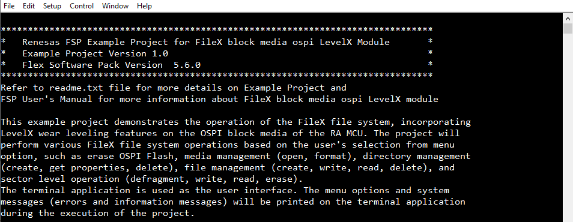

Flash Media Operation:

* Erase entire Flash.

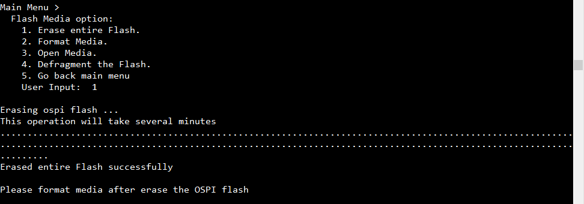

* Format Media.

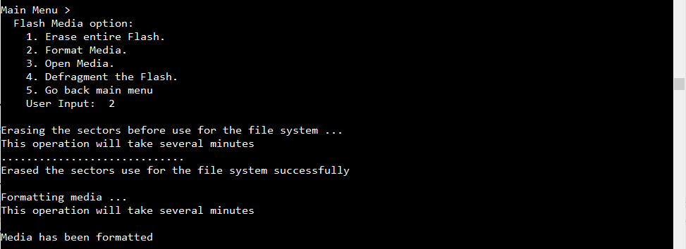

* Open Media.

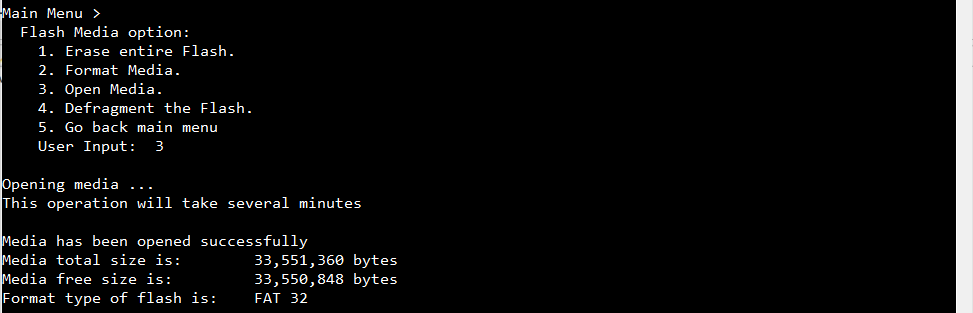

* Defragment the Flash. 

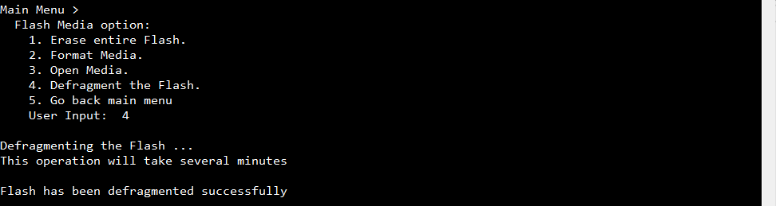

Directory Operation:

* Create Directory.

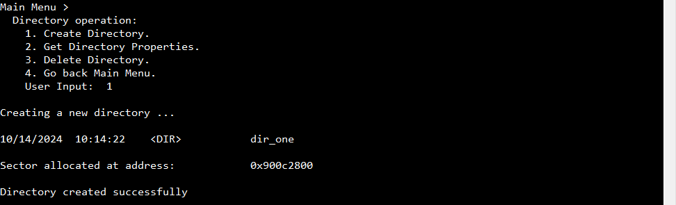

* Get Directory Properties.

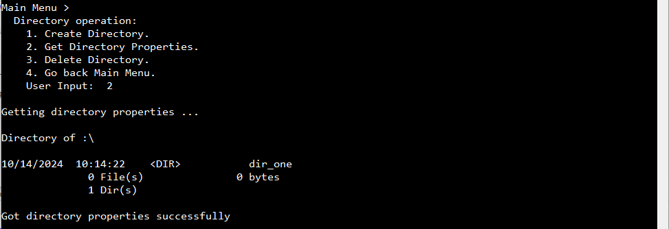

* Delete Directory.

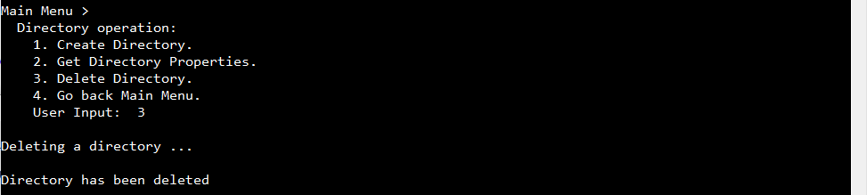

File Operation:

* Create Empty File.

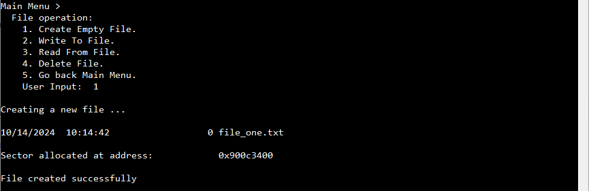

* Write To File.

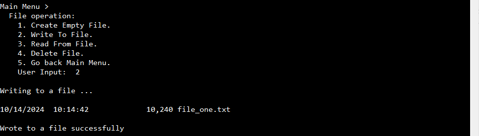

* Read From File.

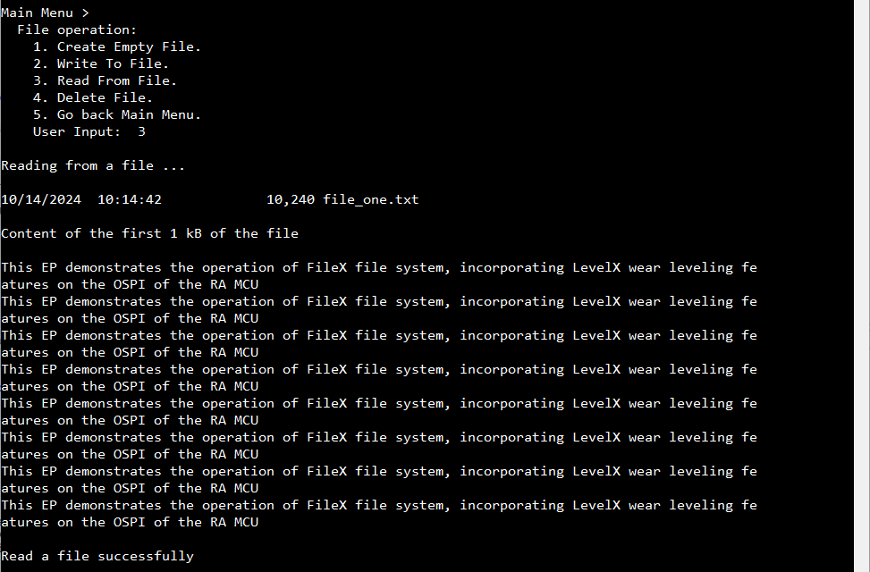

* Delete File.

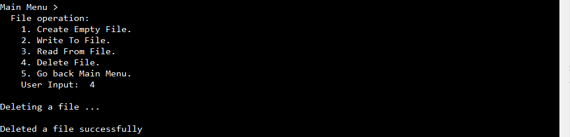

Sector Operation:

* Write to Sector.

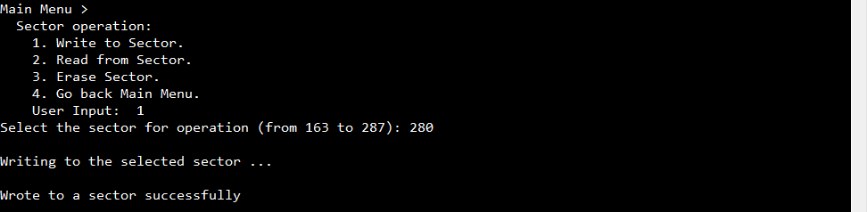

* Read from Sector.

* Erase Sector.

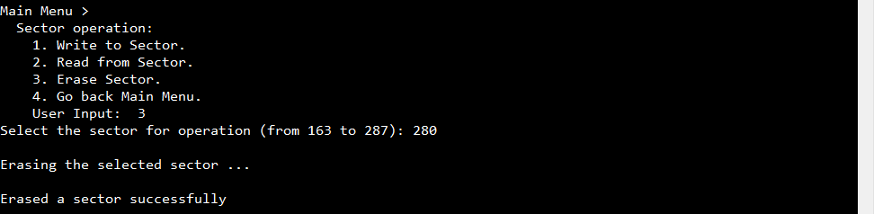