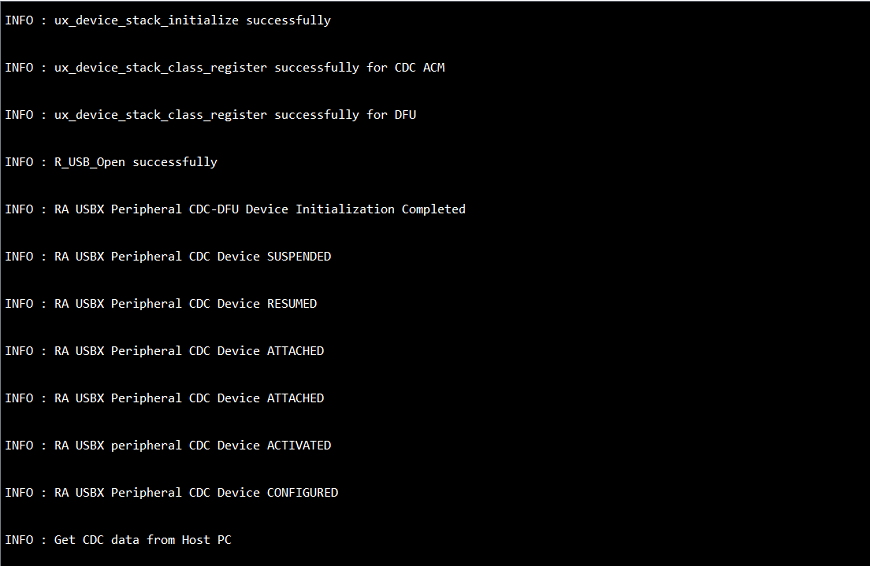
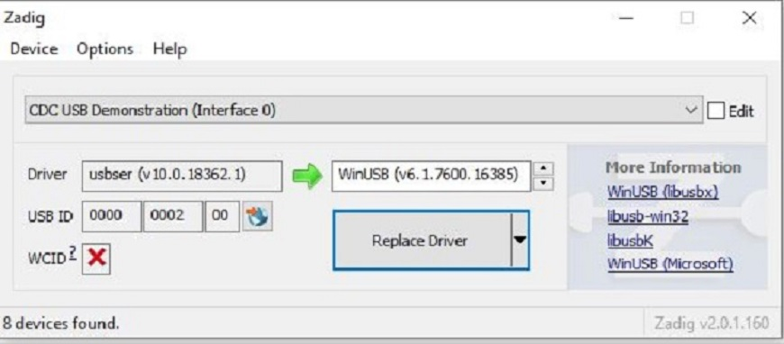
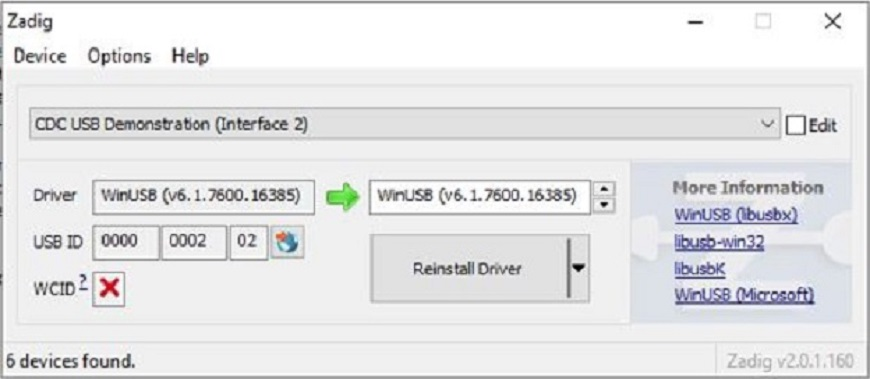
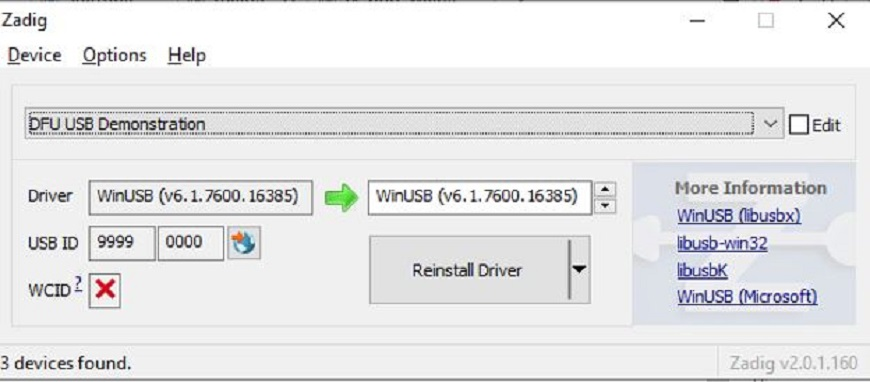
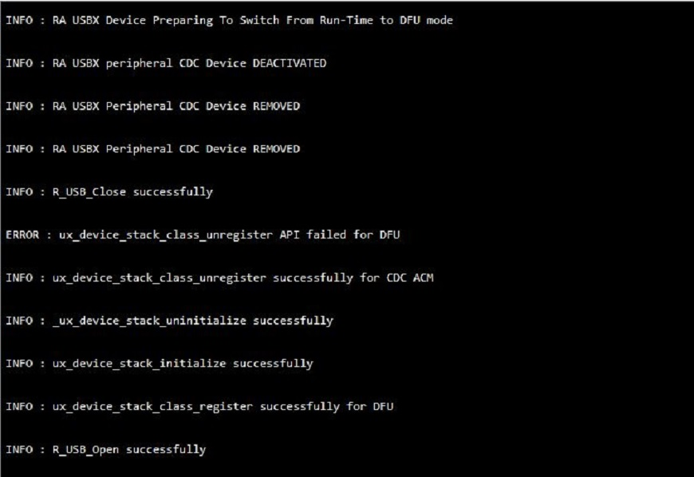
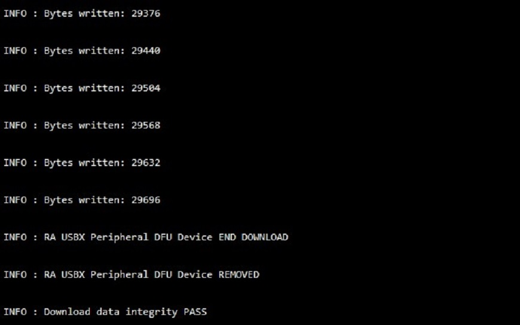
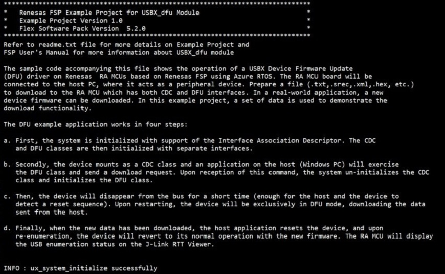

# Introduction #

The sample code accompanying this file shows the operation of a USBX Device Firmware Update (DFU) driver on Renesas 
RA MCUs based on Renesas FSP using Azure RTOS. The RA MCU board will be connected to the host PC, where it acts as 
a peripheral device. Prepare a file (.txt,.srec,.xml,.hex, etc.) to download to the RA MCU which has both CDC and 
DFU interfaces. In a real-world application, a new device firmware can be downloaded. In this example project, a 
set of data is used to demonstrate the download functionality.

The DFU example application works in four steps:

a. The system is initialized with support of the Interface Association Descriptor. The CDC and DFU classes are 
   then initialized with separate interfaces.

b. The device mounts as a CDC class and an application on the host (Windows PC) will exercise the DFU class 
   and send a download request. Upon reception of this command, the system un-initializes the CDC class and initializes 
   the DFU class.

c. Then, the device will disappear from the bus for a short time (enough for the host and the device to detect a reset 
   sequence). Upon restarting, the device will be exclusively in DFU mode, downloading the data sent from the host.

d. Finally, when the new data has been downloaded, the host application resets the device, and upon re-enumeration, 
   the device will revert to its normal operation with the new firmware. The RA MCU will display the USB enumeration 
   status on the J-Link RTT Viewer.

Please refer to the [Example Project Usage Guide](https://github.com/renesas/ra-fsp-examples/blob/master/example_projects/Example%20Project%20Usage%20Guide.pdf) 
for general information on example projects and [readme.txt](./readme.txt) for specifics of the operation.

## Required Resources ##
To build and run the USBX Device Firmware Update(DFU) example project, the following resources are needed.

### Hardware ###
* Renesas RA™ MCU kit
* 1 x Micro USB cable for programming and debugging
* 1 x Micro USB cable for connecting the MCU to the host PC
* Host System (Windows PC) with at least 2 USB ports

Refer to [readme.txt](./readme.txt) for information on how to connect the hardware.

### Software ###
* Renesas Flexible Software Package (FSP): Version 5.5.0
* e2 studio: Version 2024-07
* SEGGER J-Link RTT Viewer: Version 7.98b
* GCC ARM Embedded Toolchain: Version 13.2.1.arm-13-7
* Zadig.exe (v2.0.1.160)
* dfu-util-0.11-binaries

Note: Refer to software requirements mentioned in [Example Project Usage Guide](https://github.com/renesas/ra-fsp-examples/blob/master/example_projects/Example%20Project%20Usage%20Guide.pdf)

## Related Collateral References ##
The following documents can be referred to for enhancing your understanding of 
the operation of this example project:
- [FSP User Manual on GitHub](https://renesas.github.io/fsp/)
- [FSP Known Issues](https://github.com/renesas/fsp/issues)

# Project Notes #

## System Level Block Diagram ##

## FSP Modules Used ##
List all the various modules that are used in this example project. Refer to the FSP User Manual for further details on each module listed below.

| Module Name | Usage  | Searchable Keyword (using New Stack > Search) |
| :---------: | :---------------: | :------------: |
| USBX DFU   | This module provides USBX DFU class support on RA device. | dfu |
| USBX PCDC| USBX PCDC is used to communicate with Host machine to perform write/read operations. | rm_usbx_port|
| USB Basic Driver | USB driver is required for hardware configuration on RA MCU. |r_usb_basic|

## Module Configuration Notes ##
This section describes FSP Configurator properties that are important or different from those selected by default. 

**Common Configuration Properties**

|   Module Property Path and Identifier   |   Default Value   |   Used Value   |   Reason   |
| :-------------------------------------: | :---------------: | :------------: | :--------: |
|   configuration.xml > BSP > Properties > Settings > Property > Heap Size (bytes)| 0 |0x400| Heap size is required for standard library functions to be used. |
|   configuration.xml > USBX PERI DFU Thread > Properties > Settings > Property > Common > Timer > Timer Ticks Per Second |100 | 1000 |The default ticks should be 1000 indicating 1 tick per millisecond.  |
|   configuration.xml > USBX PERI DFU  Thread > Settings > Property > Thread > priority  |   1   |   15   |   USBX PERI DFU Thread priority is lowered to allow the other USB operations to be serviced at a faster rate.   |
|   configuration.xml > USBX PERI CDC_DFU  Thread > Settings > Property > Thread > priority  |   1   |   15   |   USBX PERI CDC_DFU Thread priority is lowered to allow the other USB operations to be serviced at a faster rate.   |
|   configuration.xml > RTT Thread > Settings > Property > Thread > priority  |   1   |   16   |   RTT thread priority is lowered to allow the internal thread taking priority. |
|   configuration.xml > RTT Thread > Properties > Settings > Property > Stack Size (bytes)| 1024 | 4096 | The size of the RTT Thread Stack is increased so that data from any type of file can be printed on the J-Link RTT Viewer. |

**Configuration Properties for USB Speed as Full Speed.**

|   Module Property Path and Identifier   |   Default Value   |   Used Value   |   Reason   |
| :-------------------------------------: | :---------------: | :------------: | :--------: |
| configuration.xml > USBX PERI DFU  Thread Stacks > g_basic0 Instance > Properties > Settings > Property > Module g_basic0 USB Driver on r_usb_basic > USB Speed| Full Speed | Full Speed | USB Speed is configured as **Full Speed**.|
| configuration.xml > USBX PERI DFU  Thread Stacks > g_basic0 Instance > Properties > Settings > Property > Module g_basic0 USB Driver on r_usb_basic > USB Module Number| USB_IP0 Port | USB_IP0 Port | This property is used to specify USB module number to be used as per configured USB speed.|
| configuration.xml > USBX PERI CDC_DFU  Thread Stacks > g_basic1 Instance > Properties > Settings > Property > Module g_basic1 USB Driver on r_usb_basic > USB Speed| Full Speed | Full Speed | USB Speed is configured as **Full Speed**.|
| configuration.xml > USBX PERI CDC_DFU  Thread Stacks > g_basic1 Instance > Properties > Settings > Property > Module g_basic1 USB Driver on r_usb_basic > USB Module Number| USB_IP0 Port | USB_IP0 Port | This property is used to specify USB module number to be used as per configured USB speed.|

## API Usage ##

The table below lists the FSP provided API used at the application layer by this example project.

| API Name    | Usage                                                                          |
|-------------|--------------------------------------------------------------------------------|
|ux_system_initialize| This API is used to initialize the USBX system. |
|ux_host_stack_initialize| This API is used to initialize the USBX device stack. |
|ux_device_stack_class_register| This API is used to registers a slave class to the slave stack. |
|R_USB_Open| This API opens the USB basic driver. |
|_ux_device_class_cdc_acm_read|This API reads from the CDC class.|
|_ux_device_class_cdc_acm_write|This API writes to  the CDC class.|
|_ux_utility_memory_compare|This API compares two memory blocks.|
|R_USB_Close|This API closes the USB basic driver.|
|ux_device_stack_class_unregister|This API unregisters a slave class to the slave stack.|
|_ux_device_stack_uninitialize|This API uninitialized the generic portion of the device side of USBX.|

## Verifying operation ##

Import the EP and perform necessary changes in the project configuration. Please see the “Module Configuration Notes” section for more details.

Note: This EP is supported only USB Full speed mode.

The following is the procedure to download new data and reset the MCU:

The steps 5 to 9 only need to be done once.

1. On a Windows machine, prepare a file in format of .txt, .srec, .xml, .hex, etc. to download to the MCU.

2. Connect RA MCU board to the PC as mentioned in readme file.

3. Generate Project Content, build and download the USBX DFU project to the RA board.

4. Open J-Link RTT Viewer to verify the initialization status.

    Below images show the USBX DFU Initialization on J-Link RTT Viewer:

	
	
	

5. Launch zadig application on Host PC and install the drivers as shown below:

	**Note: There will be two USB devices enumerated with this application.**
	
	a. In the zadig, choose Options -> List all devices.
	
	
		
	b. Check the two USB interfaces that are named CDC USB Demonstration (Interface 0) and (Interface 2).
		
	
		
	
		
	c. Select **WinUSB driver** to install for the other CDC USB Demonstration interface (interface 2).
	
	**Note:**  
	**+ The USB device driver installed in interface 0 is a COM port. No changes should be made to this.**  
	**+ The PC may need to be restarted to finish the driver installation.**
		
6. Once the driver is installed, open the directory: \dfu-util-0.11-binaries.tar\dfu-util-0.11-binaries\win64.
	
7. Paste the prepared file (e.g. data.txt) in the directory and open command line from this directory.

8. Run command .\dfu-util -D data.txt to download to the MCU. 

9. Again, launch Zadig and install the driver for "DFU USB Demonstration".

	

10. Now, run the command .\dfu-util -D data.txt to download to the MCU. 

	
	
11. Open J-Link RTT Viewer to verify the Output status.

    Below images show the output on J-Link RTT Viewer:

	
	
	
	
	
	
	
	
	Run till the maximum bytes need to be written as per the file prepared:
	
	
	
	
	
	

### Key Notes
1. There are two COM ports of the same name in the Zadig application, i.e., CDC USB Demonstration (Interface 0) and CDC USB Demonstration (Interface 2).
   The USB device driver installed in interface 0 is a COM port. No changes should be made to this.

### Special Topics 
#### Download Links
1. Zadig Application download link: [Zadig.exe (v2.0.1.160)](https://sourceforge.net/projects/libwdi/files/zadig/)
2. dfu-util download link: [dfu-util-0.11-binaries.tar.xz](https://sourceforge.net/projects/dfu-util/files/)

#### Data File
1. File download to MCU: [data.txt](./data.txt)
