# Introduction #

This Example Project demonstrates the basic functionality of CEU driver on Renesas RA MCUs based on FSP. 
On successful initialization of CEU and camera setup, user is requested to select memory (1. SDRAM and 2. SRAM)
to save image. By default, the Example Project configures the camera in test pattern mode, and the image captured is a color bar.
The user can get the actual image by modifying the macro OV3640_TEST_PATTERN in the ov3640.h file with a value of 0U.
Type '1' and enter to select 'SDRAM' to choose SXGA (1280 x 960) format and store the image in SDRAM.
Type '2' and enter to select 'SRAM' to choose VGA (640 x 480) format and store the image in SRAM.
The captured image can be viewed in e2studio using the 'image viewer'.

Please refer to the [Example Project Usage Guide](https://github.com/renesas/ra-fsp-examples/blob/master/example_projects/Example%20Project%20Usage%20Guide.pdf) 
for general information on example projects and [readme.txt](./readme.txt) for specifics of operation.

Note: This Example Project does not perform color correction for the camera sensor.

## Required Resources ## 
To build and run the CEU example project, the following resources are needed.

### Hardware ###
* 1 x Renesas RA boards: EK-RA8D1
* 1 x OV3640 camera module (included in the kit)
* 1 x Micro USB cable

Refer to [readme.txt](./readme.txt) for information on how to connect the hardware.

  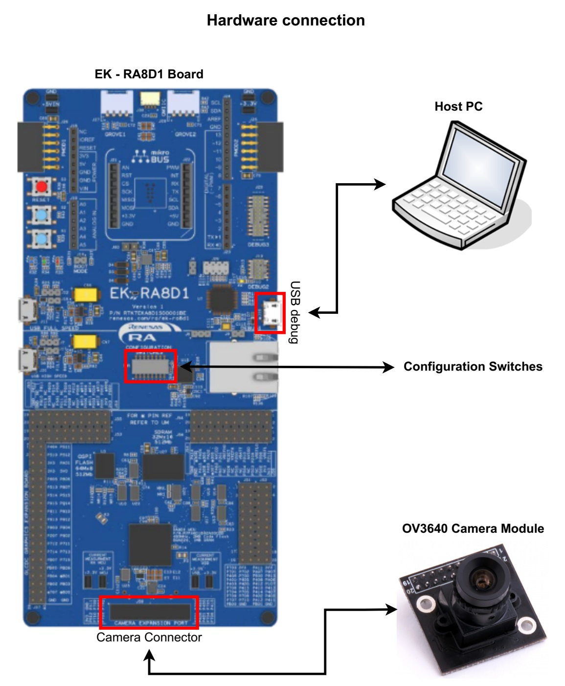

Camera connection:

  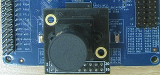

Configuration Switches:

| SW1-1 PMOD1 | SW1-2 TRACE | SW1-3 CAMERA | SW1-4 ETHA | SW1-5 ETHB | SW1-6 GLCD | SW1-7 SDRAM | SW1-8 I3C |
|-------------|-------------|--------------|------------|------------|------------|-------------|-----------|
| OFF | OFF | ON | OFF | OFF | OFF | ON | OFF |

### Software ###
* Renesas Flexible Software Package (FSP)
* e2 studio: Version 2024-07
* SEGGER J-Link RTT Viewer: Version 7.98b
* GCC ARM Embedded Toolchain: Version 13.2.1.arm-13-7

Refer to the software required section in [Example Project Usage Guide](https://github.com/renesas/ra-fsp-examples/blob/master/example_projects/Example%20Project%20Usage%20Guide.pdf)

## Related Collateral References ##
The following documents can be referred to for enhancing your understanding of 
the operation of this example project:
- [FSP User Manual on GitHub](https://renesas.github.io/fsp/)
- [FSP Known Issues](https://github.com/renesas/fsp/issues)

# Project Notes #

## System Level Block Diagram ##
 High level block diagram of the system is as shown below:
 
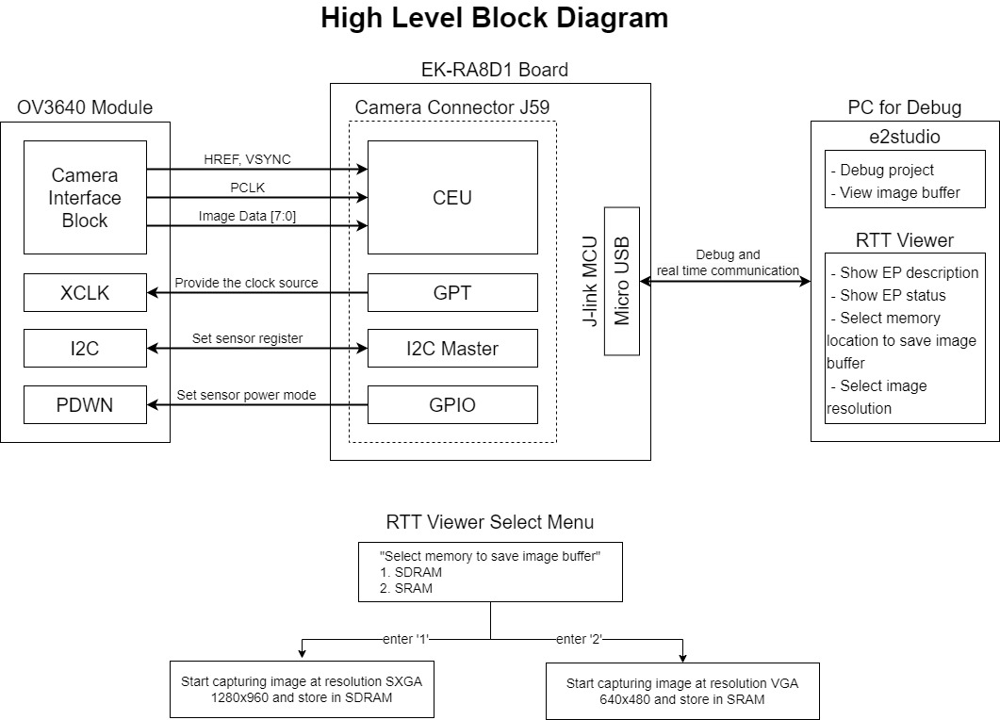

## FSP Modules Used ##
List all the various modules that are used in this example project. Refer to the FSP User Manual for further details on each module listed below.

| Module Name | Usage | Searchable Keyword  |
|-------------|-----------------------------------------------|-----------------------------------------------|
| CEU | CEU is used to capture images from the camera | r_ceu |
| I2C Master | I2C Master is used to configure the camera | r_iic_master |
| GPT | GPT is used to provide the clock for the camera | r_gpt |
| IO Port | IO Port is used to set power mode for the camera | r_ioport |

## Module Configuration Notes ##
This section describes FSP Configurator properties which are important or different than those selected by default. 

**Configuration Properties for using g_ceu_vga instance**

|   Module Property Path and Identifier   |   Default Value   |   Used Value   |   Reason   |
|-----------------------------------------|-------------------|----------------|------------|
| configuration.xml > g_ceu_vga Capture Engine Unit (r_ceu) > Settings > Property > Module g_ceu_vga Capture Engine Unit (r_ceu) > Input > Capture Specifications > Horizontal capture resolution | 640 | 640 | Width of image resolution VGA. |
| configuration.xml > g_ceu_vga Capture Engine Unit (r_ceu) > Settings > Property > Module g_ceu_vga Capture Engine Unit (r_ceu) > Input > Capture Specifications > Vertical capture resolution | 480 | 480 | Height of image resolution VGA. |
| configuration.xml > g_ceu_vga Capture Engine Unit (r_ceu) > Settings > Property > Module g_ceu_vga Capture Engine Unit (r_ceu) > Output > Byte Swapping > Swap 8-bit units | ☐ | ☑ | The image data is different in endian between the camera and the MCU. |
| configuration.xml > g_ceu_vga Capture Engine Unit (r_ceu) > Settings > Property > Module g_ceu_vga Capture Engine Unit (r_ceu) > Output > Byte Swapping > Swap 16-bit units | ☐ | ☑ | The image data is different in endian between the camera and the MCU. |
| configuration.xml > g_ceu_vga Capture Engine Unit (r_ceu) > Settings > Property > Module g_ceu_vga Capture Engine Unit (r_ceu) > Output > Byte Swapping > Swap 32-bit units | ☐ | ☑ | The image data is different in endian between the camera and the MCU. |
| configuration.xml > g_ceu_vga Capture Engine Unit (r_ceu) > Settings > Property > Module g_ceu_vga Capture Engine Unit (r_ceu) > Interrupts > Callback | g_ceu0_user_callback | g_ceu_user_callback | It is called from the interrupt service routine (ISR) each time the CEU capture operation completes. |
| configuration.xml > g_ceu_vga Capture Engine Unit (r_ceu) > Settings > Property > Module g_ceu_vga Capture Engine Unit (r_ceu) > Interrupts > CEU Interrupt Priority | Priority 12 | Priority 12 | Select the CEU interrupt priority. |

**Configuration Properties for using g_ceu_sxga instance**

|   Module Property Path and Identifier   |   Default Value   |   Used Value   |   Reason   |
|-----------------------------------------|-------------------|----------------|------------|
| configuration.xml > g_ceu_sxga Capture Engine Unit (r_ceu) > Settings > Property > Module g_ceu_sxga Capture Engine Unit (r_ceu) > Input > Capture Specifications > Horizontal capture resolution | 640 | 1280 | Width of image resolution SXGA. |
| configuration.xml > g_ceu_sxga Capture Engine Unit (r_ceu) > Settings > Property > Module g_ceu_sxga Capture Engine Unit (r_ceu) > Input > Capture Specifications > Vertical capture resolution | 480 | 960 | Height of image resolution SXGA. |
| configuration.xml > g_ceu_sxga Capture Engine Unit (r_ceu) > Settings > Property > Module g_ceu_sxga Capture Engine Unit (r_ceu) > Output > Byte Swapping > Swap 8-bit units | ☐ | ☑ | The image data is different in endian between the camera and the MCU. |
| configuration.xml > g_ceu_sxga Capture Engine Unit (r_ceu) > Settings > Property > Module g_ceu_sxga Capture Engine Unit (r_ceu) > Output > Byte Swapping > Swap 16-bit units | ☐ | ☑ | The image data is different in endian between the camera and the MCU. |
| configuration.xml > g_ceu_sxga Capture Engine Unit (r_ceu) > Settings > Property > Module g_ceu_sxga Capture Engine Unit (r_ceu) > Output > Byte Swapping > Swap 32-bit units | ☐ | ☑ | The image data is different in endian between the camera and the MCU. |
| configuration.xml > g_ceu_sxga Capture Engine Unit (r_ceu) > Settings > Property > Module g_ceu_sxga Capture Engine Unit (r_ceu) > Interrupts > Callback | g_ceu0_user_callback | g_ceu_user_callback | It is called from the interrupt service routine (ISR) each time the CEU capture operation completes. |
| configuration.xml > g_ceu_sxga Capture Engine Unit (r_ceu) > Settings > Property > Module g_ceu_sxga Capture Engine Unit (r_ceu) > Interrupts > CEU Interrupt Priority | Priority 12 | Priority 12 | Select the CEU interrupt priority. |

**Configuration Properties for using I2C Master**

|   Module Property Path and Identifier   |   Default Value   |   Used Value   |   Reason   |
|-----------------------------------------|-------------------|----------------|------------|
| configuration.xml > g_i2c_master_for_ov3640 I2C Master (r_iic_master) > Settings > Property > Module g_i2c_master_for_ov3640 I2C Master (r_iic_master) > Channel | 0 | 1 | Use I2C Master Channel 1 to control the camera module. |
| configuration.xml > g_i2c_master_for_ov3640 I2C Master (r_iic_master) > Settings > Property > Module g_i2c_master_for_ov3640 I2C Master (r_iic_master) > Rate | Standard | Fast-mode | Optimize communication speed with the camera. |
| configuration.xml > g_i2c_master_for_ov3640 I2C Master (r_iic_master) > Settings > Property > Module g_i2c_master_for_ov3640 I2C Master (r_iic_master) > Slave Address | 0x00 | 0x3C | Specific slave address of the OV3640 camera. |
| configuration.xml > g_i2c_master_for_ov3640 I2C Master (r_iic_master) > Settings > Property > Module g_i2c_master_for_ov3640 I2C Master (r_iic_master) > Address Mode | 7-Bit | 7-Bit | Specific address mode of the OV3640 camera. |
| configuration.xml > g_i2c_master_for_ov3640 I2C Master (r_iic_master) > Settings > Property > Module g_i2c_master_for_ov3640 I2C Master (r_iic_master) > Callback | NULL | g_i2c_master_for_ov3640_callback | It is called from the interrupt service routine (ISR) upon IIC transaction completion reporting the transaction status. |
| configuration.xml > g_i2c_master_for_ov3640 I2C Master (r_iic_master) > Settings > Property > Module g_i2c_master_for_ov3640 I2C Master (r_iic_master) > Interrupt Priority Level | Priority 12 | Priority 12 | Select the IIC master interrupt priority. |

**Configuration Properties for using GPT**

|   Module Property Path and Identifier   |   Default Value   |   Used Value   |   Reason   |
|-----------------------------------------|-------------------|----------------|------------|
| configuration.xml > g_timer_periodic Timer, General PWM (r_gpt) > Settings > Property > Common >Pin Output Support | Disabled | Enabled | Provide clock source for camera. |
| configuration.xml > g_timer_periodic Timer, General PWM (r_gpt) > Settings > Property > Module g_timer_periodic Timer, General PWM (r_gpt) >General > Channel | 0 | 3 | Use GPT Channel 3 to generate the input clock for the camera module. |
| configuration.xml > g_timer_periodic Timer, General PWM (r_gpt) > Settings > Property > Module g_timer_periodic Timer, General PWM (r_gpt) >General > Mode | Periodic | Periodic | Set the GPT in periodic mode to generate the clock source. |
| configuration.xml > g_timer_periodic Timer, General PWM (r_gpt) > Settings > Property > Module g_timer_periodic Timer, General PWM (r_gpt) >General > Period | 0x100000000 | 24000 | Set the GPT frequency to 24 Mhz, to be in specification for the camera's clock source [6 ~ 27MHz]. |
| configuration.xml > g_timer_periodic Timer, General PWM (r_gpt) > Settings > Property > Module g_timer_periodic Timer, General PWM (r_gpt) >General > Period Unit | Raw Counts | Kilohertz | Set the GPT frequency to 24 MHz. |
| configuration.xml > g_timer_periodic Timer, General PWM (r_gpt) > Settings > Property > Module g_timer_periodic Timer, General PWM (r_gpt) >Output > GTIOCA Output Enabled | False | True | Provide a 24 MHz clock frequency output pin. |

## API Usage ##
The table below lists the FSP provided API used at the application layer by this example project.

| API Name    | Usage                                                                          |
|-------------|--------------------------------------------------------------------------------|
| R_CEU_Open | This API is used to initialize CEU module. |
| R_CEU_CaptureStart | This API is used to starts a capture image. |
| R_CEU_Close | This API is used to stop and close CEU module. |
| R_GPT_Open | This API is used to initialize the GPT timer. |
| R_GPT_Start | This API is used to Start GPT timer in periodic mode, when timer starts, it provides a 24 MHz clock frequency for the camera. |
| R_IIC_MASTER_Open | This API is used to initialize the I2C Master module. |
| R_IIC_MASTER_Write | This API is used to perform a write from the camera register. |
| R_IIC_MASTER_Read | This API is used to perform a read from the camera register. |
| R_BSP_PinWrite | This API is used to set the output level for a PWDN pin of the camera. |
| R_BSP_SoftwareDelay | This API is used to delay a specified period of time. |

## SDRAM Configuration ##
The table below describes the configuration properties for using SDRAM.

| Properties | Setting |
|------------|---------|
| Clock source | 120 MHz |
| Bus width | 16-bit |
| Endian mode | Little endian |
| Auto-refresh | Enable |
| Self-refresh | Disable |
| Continuous access | Enable |

## Verifying Operation ##
1. Import, generate and build the project EP.
2. On Debug the project EP by e2studio IDE:
* Open memory view.

  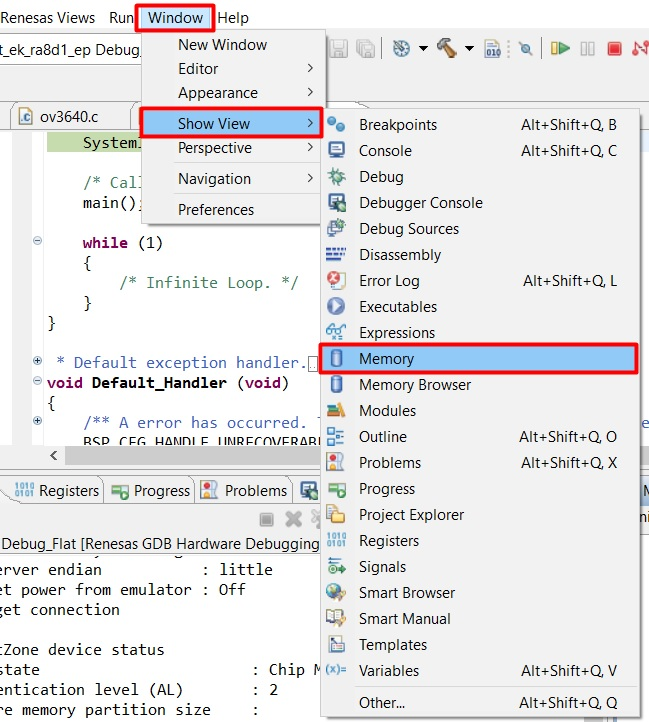

* Add image buffer under memory monitor.

  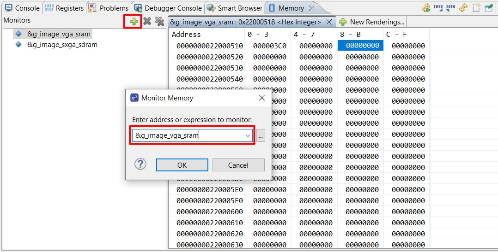

* Open Raw Image Rendering 

  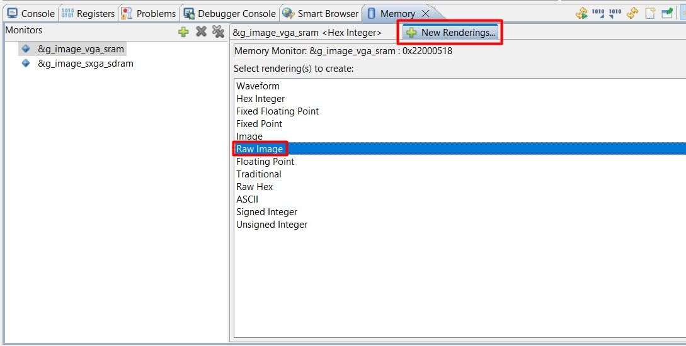

* Set Raw Image Format:
  * For VGA resolution images:
    * Width as 640
    * Height as 480
    * Encoding to YCbCr 16bpp (4:2:2) (Cb,y0,Cr,y1)
    * Line alignment to 4 bytes
    * Start Position to Top

      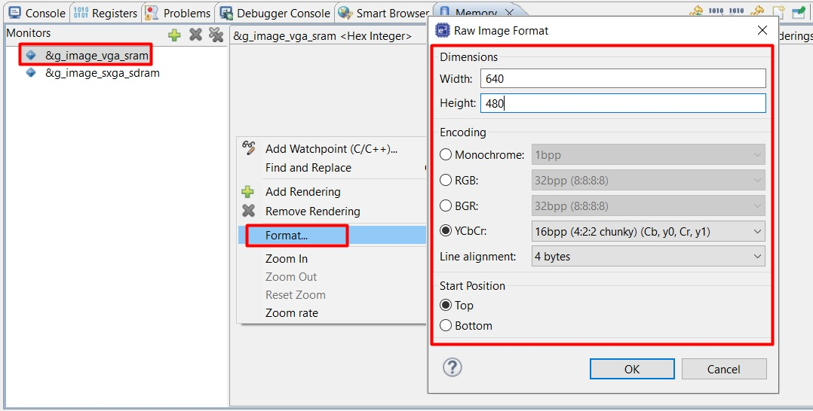

  * For SXGA resolution images:
    * Width as 1280
    * Height as 960
    * Encoding to YCbCr 16bpp (4:2:2) (Cb,y0,Cr,y1)
    * Line alignment to 4 bytes
    * Start Position to Top

      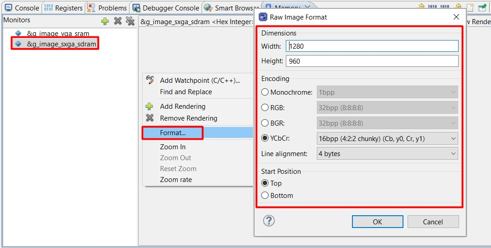

3. Open the RTT viewer, select the memory type and image resolution to start capturing images.
* Below image shows RTT Viewer operation:
  * EP Information

    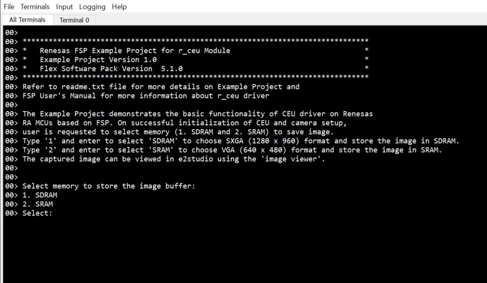

  * Capture a SXGA resolution image and store in SDRAM

    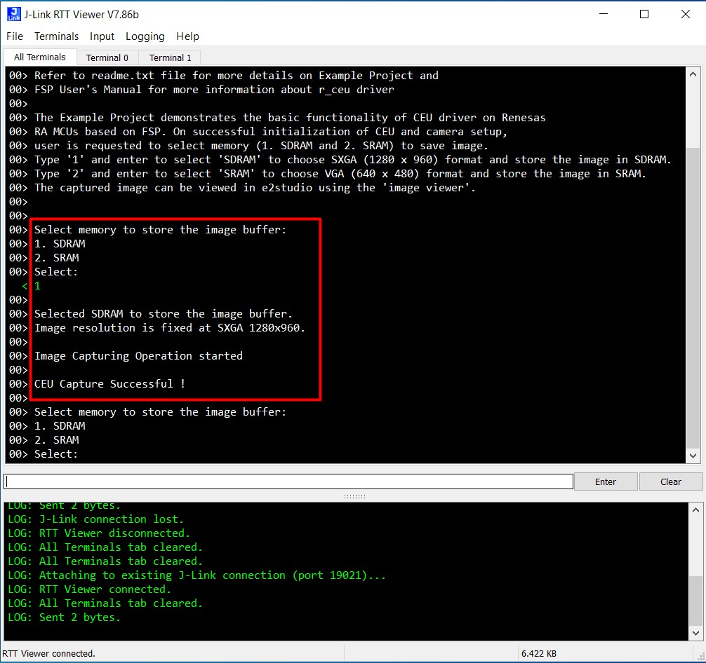

  * Capture a VGA resolution image and store in SRAM

    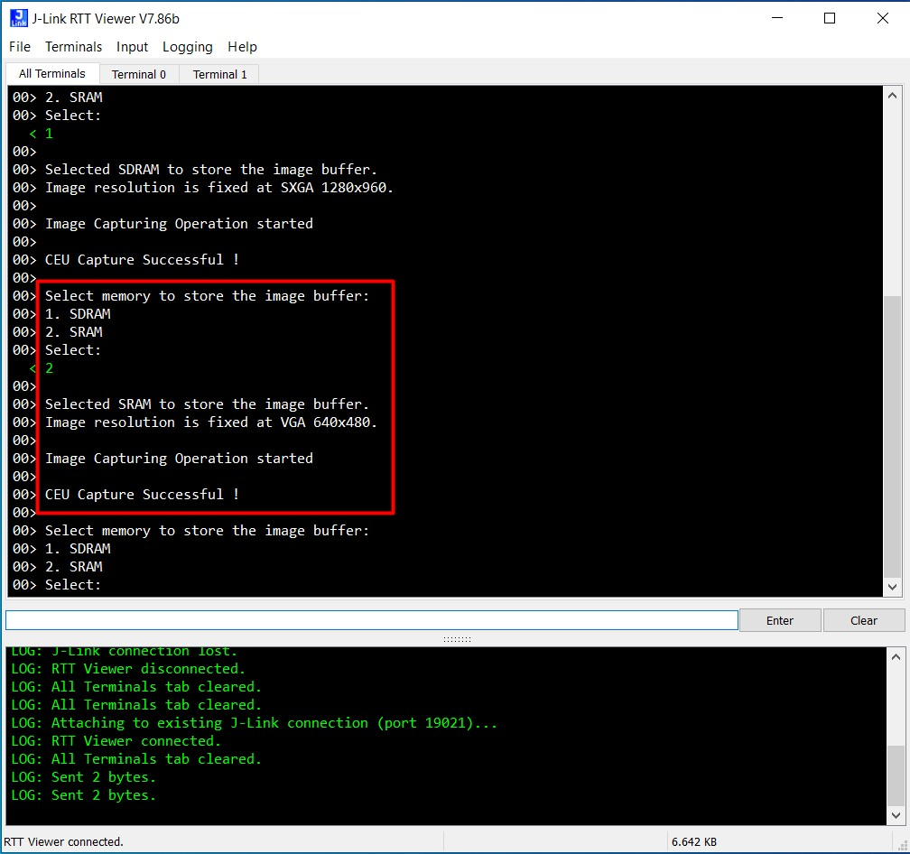
  
* Below image shows image captured on Raw Image rendering:
  * SXGA image and store in SDRAM
  
    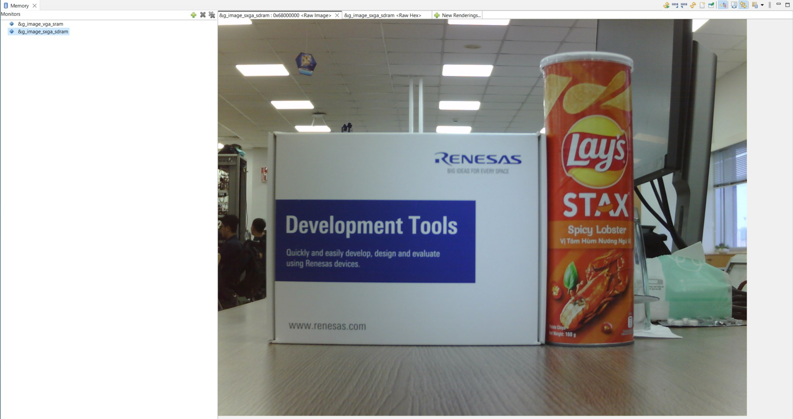

  * VGA image and store in SRAM
  
    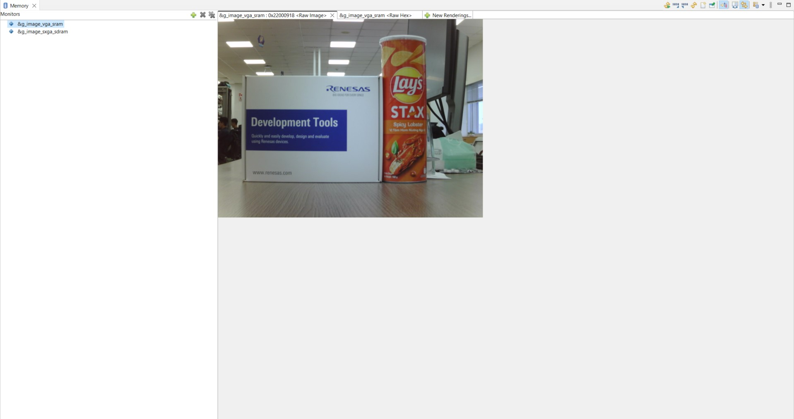

## Special Topics ##
* The files ov3640.c and ov3640.h contain the API for initialization and configuration of the OV3640 camera module.
* The OV3640 is configured in YUV422 output format, and the user selectable image resolution is SXGA or VGA.
* g_ceu_sxga is the CEU instance configured in Data Synchronous Fetch mode at SXGA resolution.
* g_ceu_vga is the CEU instance configured in Data Synchronous Fetch mode at VGA resolution. 
* OV3640_TEST_PATTERN in ov3640.h is used to enable/disable using test pattern of OV3640. It is enable by default
and a matching result between captured data and test pattern will be shown in RTT Viewer for this case.
Disable it to capture live data from camera.
* OV3640 Test pattern image:

  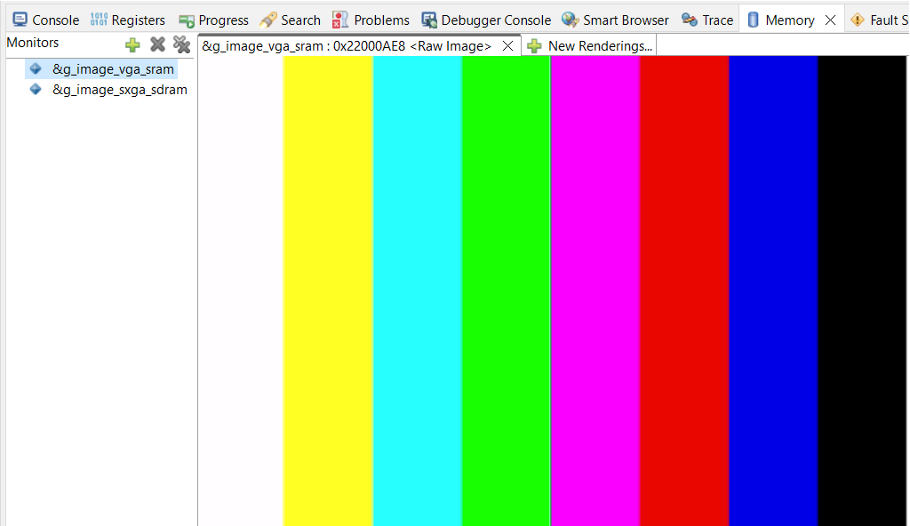
