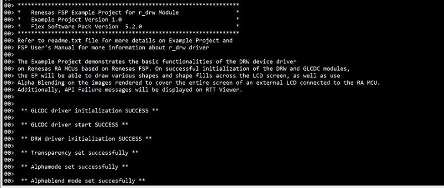
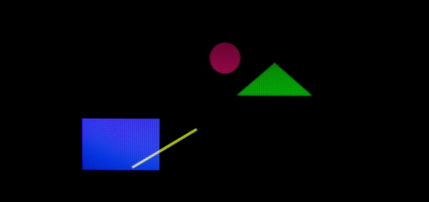

# Introduction #

This Example Project demonstrates the basic functionalities of 2D Drawing Engine (DRW) device driver on Renesas RA MCUs based on Renesas FSP. On successful initialization
of DRW and GLCDC modules, the EP will draw various shapes and shape fills across the LCD screen, as well as use Alpha Blending on the images rendered
to cover the entire screen of an external LCD connected to the RA MCU. API Failure messages will also be displayed on RTT Viewer.

Please refer to the [Example Project Usage Guide](https://github.com/renesas/ra-fsp-examples/blob/master/example_projects/Example%20Project%20Usage%20Guide.pdf) 
for general information on example projects and [readme.txt](./readme.txt) for specifics of operation.

## Required Resources ##
To build and run the DRW example project, the following resources are needed.

### Hardware ###
* Renesas RA™ MCU kit: EK-RA6M3G, EK-RA8D1
* Micro USB cable
* PC with Windows 10 

Refer to [readme.txt](./readme.txt) for information on how to connect the hardware.

### Software ###
* Renesas Flexible Software Package (FSP)
* e2 studio: Version 2024-07
* SEGGER J-Link RTT Viewer: Version 7.98b
* GCC ARM Embedded Toolchain: Version 13.2.1.arm-13-7

Refer to software requirements mentioned in [Example Project Usage Guide](https://github.com/renesas/ra-fsp-examples/blob/master/example_projects/Example%20Project%20Usage%20Guide.pdf)

## Related Collateral References ##
The following documents can be referred to for enhancing your understanding of 
the operation of this example project:
- [FSP User Manual on GitHub](https://renesas.github.io/fsp/)
- [FSP Known Issues](https://github.com/renesas/fsp/issues)

# Project Notes #

## System Level Block Diagram ##

For EK-RA8D1:

## FSP Modules Used ##
List all the various modules that are used in this example project. Refer to the FSP User Manual for further details on each module listed below.

| Module Name | Usage  | Searchable Keyword (using New Stack > Search) |
|-------------|-----------------------------------------------|-----------------------------------------------|
| D/AVE 2D Port Interface (r_drw) | This module is a port of D/AVE 2D.| r_drw |
| Graphics LCD (r_glcdc) | With GLCDC driver, user can reposition, alpha blend, color correct, dither and convert to and from a wide variety of pixel formats.| r_glcdc |

For EK-RA8D1:
| Module Name | Usage  | Searchable Keyword (using New Stack > Search) |
|-------------|-----------------------------------------------|-----------------------------------------------|
| D/AVE 2D Port Interface (r_drw) | This module is a port of D/AVE 2D.| r_drw |
| Graphics LCD (r_glcdc) | With GLCDC driver, user can reposition, alpha blend, color correct, dither and convert to and from a wide variety of pixel formats.| r_glcdc |
| MIPI Display (r_mipi_dsi)| MIPI DSI is used to get data from GLCDC and transmit it to MIPI PHY. | r_mipi_dsi |
| MIPI Physical Layer (r_mipi_phy)| MIPI PHY is used to send data to MIPI LCD. | r_mipi_phy |

## Module Configuration Notes ##
This section describes FSP Configurator properties that are important or different from those selected by default. 

|   Module Property Path and Identifier   |   Default Value   |   Used Value   |   Reason   |
| :-------------------------------------: | :---------------: | :------------: | :--------: |
|   configuration.xml -> BSP > Property > Main stack size (bytes)  |  0   | 0x1000  |  Main stack size is required for DRW library functions to be used. |
|   configuration.xml -> BSP > Property > Heap size (bytes)  |  0   | 0x1500  |  Heap size is required for DRW library functions to be used. |
|   configuration.xml -> g_display0 Graphics LCD (r_glcdc) > Stacks > Properties > Interrupts  > Callback Function | NULL | glcdc_callback | Define user callback function |
|   configuration.xml -> D/AVE 2D Port Interface (r_drw) > Property > Common > Allow Indirect mode  |  Enabled   | Enabled  | Mode selected for functioning of d2 driver functions. |

Please refer GLCDC EP notes for GLCDC stack related properties.

For EK-RA8D1:

|   Module Property Path and Identifier   |   Default Value   |   Used Value   |   Reason   |
| :-------------------------------------: | :---------------: | :------------: | :--------: |
|   configuration.xml -> g_display0 Graphics LCD (r_glcdc) > Stacks > Properties > Input  > Graphics Layer 1 > General > Color format | RGB56 (16-bit) | RGB888 (32-bit) | To use 32 bits Color format input |
|   configuration.xml -> g_display0 Graphics LCD (r_glcdc) > Stacks > Properties > Output  > Format > Color format | 24bits RGB888 | 24bits RGB888 | To use 32bits Color format |
|   configuration.xml -> g_mipi_dsi0 MIPI Display (r_mipi_dsi) > Stacks > Properties > Sequence Channel 1 Interrupt Enable > Interrupts  > Callback Function | mipi_dsi0_callback | mipi_dsi_callback | Define user callback function |

## API Usage ##

The table below lists the GLCDC and DRW APIs used at the application layer in this example project.

| API Name    | Usage                                                                          |
|-------------|--------------------------------------------------------------------------------|
|R_GLCDC_Open| Open GLCDC module. |
|R_GLCDC_Start| Start GLCDC module. |
|R_GLCDC_BufferChange| Changes the framebuffer pointer. |
|R_GLCDC_Stop| Stop GLCDC module. |
|R_GLCDC_Close| Close GLCDC module. |
|d2_opendevice| Creates a new device handle. |
|d2_inithw| Initialize D/AVE2D module. |
|d2_flushframe| Wait for current rendering to end.|
|d2_framebuffer| Defines framebuffer's memory and layout. |
|d2_setalpha| Set alpha value. |
|d2_setalphamode| Choose alpha source.|
|d2_setblendmode| Choose blendmode for RGB.|
|d2_clear| Clear the framebuffer.|
|d2_setantialiasing| Globally disable or enable antialiasing.|
|d2_setlinecap| Specify line end style.|
|d2_setlinejoin| Specify polyline connection style.|
|d2_selectrendermode| Set render mode. |
|d2_setcolor| Set desired color registers. |
|d2_rendercircle| Render a circle or circle ring. |
|d2_rendertri| Render a triangle. |
|d2_renderbox| Render a rectangle. |
|d2_renderline| Render a wide line. |
|d2_endframe| Mark the end of a frame. |
|d2_startframe|Beginning of a frame.|
|d2_deinithw| Unlink hardware currently bound by specified device.|
|d2_closedevice| Close/Destroy the device handler. |
|d2_geterrorstring| Returns string with human readable error description.|

For EK-RA8D1: MIPI API additional used at the application layer in this example project.
| API Name    | Usage                                                                          |
|-------------|--------------------------------------------------------------------------------|
|R_MIPI_DSI_Command| This API is used to send a command to the peripheral device. |

## Verifying operation ##
Import, Build and Debug the EP(see section Starting Development of [FSP User Manual](https://renesas.github.io/fsp/)). After running the EP, open the RTT viewer to view status or
check any error messages.
User can view the rendered images and animation on the LCD screen.
The animating output can be seen in LCD screen.
Refer the below steps for hardware connections :
* Connect RA MCU debug port to the host PC via a micro USB cable
* Connect LCD to the RA board

The below image showcase the output on J-Link RTT Viewer:

The animating shapes can be captured on Graphical LCD and memory monitor of e2studio when EP is paused as shown below respectively:

## Special Topics ##
In this example project, the BLEN (backlight enable) pin is set to GPIO mode and is initially high in the Pin configuration.
However, using the BLEN pin as a PWM output function (GPT's GTIOCA or GTIOCB) is recommended, to control the brightness of the LCD backlight and reduce power consumption.
| Board            |BLEN pin         | 
|------------------|-----------------|
| EK-RA6M3G        | P603            |
| EK-RA8D1         | P404            |

