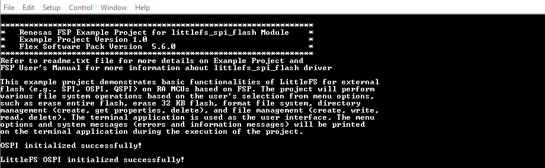
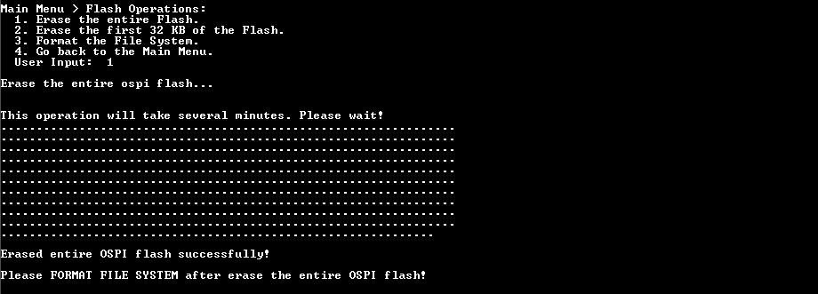
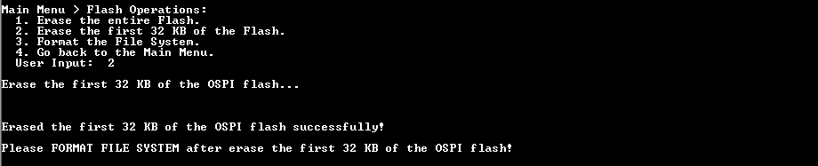
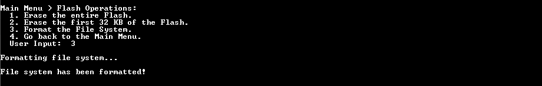
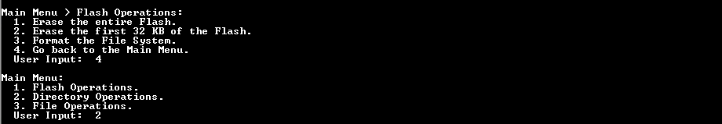
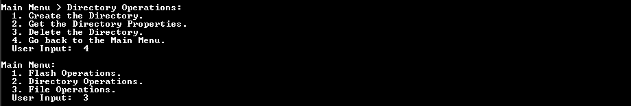
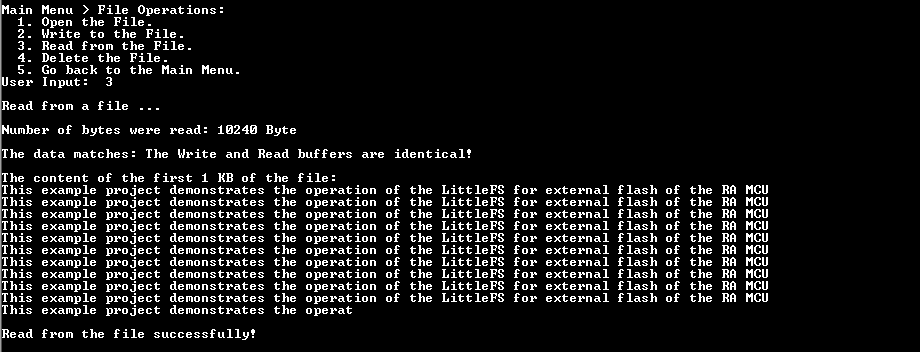

# Introduction #

This example project demonstrates basic functionalities of LittleFS for external flash (e.g., SPI, OSPI, QSPI) on RA MCU based on FSP. The project will perform various file system operations based on the user's selection from menu options, such as erase entire flash, erase 32 KB flash, format file system, directory management (create, get properties, delete),and file management (create, write, read, delete). The terminal application is used as the user interface. The menu options and system messages (errors and information messages) will be printed on the terminal application during the execution of the project.

**Note:**
- To display information, users can choose between the SEGGER J-Link RTT Viewer and the Serial Terminal (UART) with J-Link OB VCOM. It is important to note that the user should only operate a single terminal application at a time to avoid conflicts or data inconsistencies. 
- For instructions on how to switch between these options, please refer to the  **[Verifying Operation](#verifying-operation)** section in this file.
- By default, EP information is printed to the host PC using the Serial Terminal for boards that support J-Link OB VCOM. Vice versa, for the RA boards that do not support J-Link OB VCOM, EP uses the SEGGER J-Link RTT Viewer by default instead.
- RA boards supported for J-Link OB VCOM: EK-RA8D1

In the Main Menu, the user selects a sub menu such as Flash Operations Menu, Directory Operations Menu, File Operations Menu.
1. Flash Operations.
2. Directory Operations.
3. File Operations.

In the Flash Operations Menu, the user selects operation to perform.
1. Erase the entire Flash.
2. Erase the first 32 KB of the Flash.
3. Format the File System.
4. Go back to the Main Menu.

In the Directory Operations Menu, the user selects operation to perform.
1. Create the Directory.
2. Get the Directory Properties.
3. Delete the Directory.
4. Go back to the Main Menu.

In the File Operations Menu, the user selects operation to perform.
1. Open the File.
2. Write to the File.
3. Read from the File.
4. Delete the File.
5. Go back to the Main Menu.

Please refer to the [Example Project Usage Guide](https://github.com/renesas/ra-fsp-examples/blob/master/example_projects/Example%20Project%20Usage%20Guide.pdf) 
for general information on example projects and [readme.txt](./readme.txt) for specifics of operation.

## Required Resources ## 
The following resources are needed to build and run the littlefs_ospi_b example project.

### Hardware ###
Supported RA boards: EK-RA8D1
* 1 x Renesas RA board.
* 1 x Micro USB cable for programming and debugging.

### Hardware Connections  ###
  * Connect the USB Debug port on the RA board to the host PC via a micro USB cable. 

### Software ###
* Renesas Flexible Software Package (FSP): Version 5.8.0
* e2 studio: Version 2025-01
* SEGGER J-Link RTT Viewer: Version 8.12c
* GCC ARM Embedded Toolchain: Version 13.2.1.arm-13-7
* Serial Terminal Console Application: Tera Term or a similar application (for boards that support J-Link OB VCOM)

Refer to the software required section in [Example Project Usage Guide](https://github.com/renesas/ra-fsp-examples/blob/master/example_projects/Example%20Project%20Usage%20Guide.pdf)

## Related Collateral References ##
The following documents can be referred to for enhancing your understanding of the operation of this example project:
- [FSP User Manual on GitHub](https://renesas.github.io/fsp/)
- [FSP Known Issues](https://github.com/renesas/fsp/issues)

# Project Notes #

## System Level Block Diagram ##
 High level block diagram of the system is as shown below:
 

## FSP Modules Used ##
List all the various modules that are used in this example project. Refer to the FSP User Manual for further details on each module listed below.

| Module Name | Usage | Searchable Keyword  |
|-------------|-----------------------------------------------|-----------------------------------------------|
| LittleFS | LittleFS is used for file system operation. | LittleFS |
| LittleFS on SPI Flash | This module provides the hardware port layer for the LittleFS file system on SPI flash memory. | rm_littlefs_spi_flash |
| OSPI Flash | OSPI_B is used to configure flash device and perform write, read, or erase operations on flash device's memory array. | r_ospi_b |
| DMAC | DMAC is used to write data to OSPI_B flash and read back to verification without CPU. | r_dmac |

**Note:**
* Blocking Read/Write/Erase:  
  The LittleFS port blocks on Read/Write/Erase calls until the operation has completed.
* Memory Constraints:  
  The block size defined in the LittleFS configuration must be a multiple of the data flash erase size of the MCU. It must be greater than 104 bytes which is the minimum block size of a LittleFS block. 

## Module Configuration Notes ##
This section describes FSP configuration properties that are important or different from those selected by default.

**Configuration Properties for using LittleFS**

|   Module Property Path and Identifier   |   Default Value   |   Used Value   |   Reason   |
|-----------------------------------------|-------------------|----------------|------------|
| configuration.xml > Stacks > Properties > LittleFS > Settings > Property > Common > Use Malloc | Enabled | Enabled | Enable to use malloc with LittleFS. |
| configuration.xml > BSP > Properties > Settings > Property > RA Common > Heap size (bytes) | 0 | 0x400 | A heap size is required to use malloc with LittleFS. |
| configuration.xml > BSP > Properties > Settings > Property > RA Common > Main stack size (bytes) | 0x400 | 0x1200 | Set the size of the main program stack. |

**Configuration without using malloc**
|   Module Property Path and Identifier   |   Default Value   |   Used Value   |   Reason   |
|-----------------------------------------|-------------------|----------------|------------|
| configuration.xml > Stacks > Properties > LittleFS > Settings > Property > Common > Use Malloc | Enabled | Disabled | Disable to not use malloc with LittleFS. |
| configuration.xml > BSP > Properties > Settings > Property > RA Common > Heap size (bytes) | 0 | 0 | The main heap size is disabled by default. |
| configuration.xml > BSP > Properties > Settings > Property > RA Common > Main stack size (bytes) | 0x400 | 0x1200 | Set the size of the main program stack. |

**Enable Data cache in BSP Configuration**
|   Module Property Path and Identifier   |   Default Value   |   Used Value   |   Reason   |
|-----------------------------------------|-------------------|----------------|------------|
| configuration.xml > BSP > Properties > Settings > Property > RA8D1 Family > Cache settings > Data cache | Disabled | Enabled | Enable Data cache to improve performance. |

**Configuration Properties for using LittleFS on SPI Flash**

|   Module Property Path and Identifier   |   Default Value   |   Used Value   |   Reason   |
|-----------------------------------------|-------------------|----------------|------------|
| configuration.xml > Stacks > Properties > LittleFS on SPI Flash (rm_littlefs_spi_flash) > Settings > Property > Module LittleFS on SPI Flash (rm_littlefs_spi_flash) > Read Size | 1 | 1 | Minimum size of a block read. |
| configuration.xml > Stacks > Properties > LittleFS on SPI Flash (rm_littlefs_spi_flash) > Settings > Property > Module LittleFS on SPI Flash (rm_littlefs_spi_flash) > Program Size | 4 | 4 | Minimum size of a block program. |
| configuration.xml > Stacks > Properties > LittleFS on SPI Flash (rm_littlefs_spi_flash) > Settings > Property > Module LittleFS on SPI Flash (rm_littlefs_spi_flash) > Block Size (bytes) | 4096 | 4096 | Size of an erasable block. |
| configuration.xml > Stacks > Properties > LittleFS on SPI Flash (rm_littlefs_spi_flash) > Settings > Property > Module LittleFS on SPI Flash (rm_littlefs_spi_flash) > Block Cycles | 1024 | 1024 | Number of erase cycles before LittleFS evicts metadata logs and moves the metadata to another block. |
| configuration.xml > Stacks > Properties > LittleFS on SPI Flash (rm_littlefs_spi_flash) > Settings > Property > Module LittleFS on SPI Flash (rm_littlefs_spi_flash) > Cache Size | 64 | 64 | Size of block caches. |
| configuration.xml > Stacks > Properties > LittleFS on SPI Flash (rm_littlefs_spi_flash) > Settings > Property > Module LittleFS on SPI Flash (rm_littlefs_spi_flash) > Lookahead Size | 16 | 16 | Size of the lookahead buffer in bytes. |
| configuration.xml > Stacks > Properties > LittleFS on SPI Flash (rm_littlefs_spi_flash) > Settings > Property > Module LittleFS on SPI Flash (rm_littlefs_spi_flash) > Memory Size (bytes) | 33554432 | 0x20000 | Set the size that LittleFS Memory should be used. |

**Configuration Properties for using OSPI Flash**

|   Module Property Path and Identifier   |   Default Value   |   Used Value   |   Reason   |
|-----------------------------------------|-------------------|----------------|------------|
| configuration.xml > Stacks > Properties > g_ospi_b OSPI Flash (r_ospi_b) > Settings > Property > Common > DMAC Support | Disable | Enable | Enable DMAC support for the OSPI module. |
| configuration.xml > Stacks > Properties > g_ospi_b OSPI Flash (r_ospi_b) > Settings > Property > Common > Autocalibration Support | Disable | Enable | Enable DS autocalibration for dual-data-rate modes. |
| configuration.xml > Stacks > Properties > g_ospi_b OSPI Flash (r_ospi_b) > Settings > Property > Module g_ospi_b OSPI Flash (r_ospi_b) > General > Channel | 0 | 1 | Use OSPI_B Channel 1 to communicate with flash device. |
| configuration.xml > Stacks > Properties > g_ospi_b OSPI Flash (r_ospi_b) > Settings > Property > Module g_ospi_b OSPI Flash (r_ospi_b) > General > Initial Protocol Mode | SPI (1S-1S-1S) | Dual data rate OPI (8D-8D-8D) | Select Dual data rate OPI (8D-8D-8D) as the initial protocol mode. |
| configuration.xml > Stacks > Properties > g_ospi_b OSPI Flash (r_ospi_b) > Settings > Property > Module g_ospi_b OSPI Flash (r_ospi_b) > General > Initial Address Bytes | 4 | 4 | Select the number of address bytes to be 4 bytes for the initial protocol mode. |
| configuration.xml > Stacks > Properties > g_ospi_b OSPI Flash (r_ospi_b) > Settings > Property > Module g_ospi_b OSPI Flash (r_ospi_b) > General > Write Status Bit | 0 | 0 | Position of the status bit in the flash device register. |
| configuration.xml > Stacks > Properties > g_ospi_b OSPI Flash (r_ospi_b) > Settings > Property > Module g_ospi_b OSPI Flash (r_ospi_b) > General > Write Enable Bit | 1 | 1 | Position of the write enable bit in the flash device register. |
| configuration.xml > Stacks > Properties > g_ospi_b OSPI Flash (r_ospi_b) > Settings > Property > Module g_ospi_b OSPI Flash (r_ospi_b) > General > Sector Erase Size | 4096 | 4096 | Sector size of the flash device. |
| configuration.xml > Stacks > Properties > g_ospi_b OSPI Flash (r_ospi_b) > Settings > Property > Module g_ospi_b OSPI Flash (r_ospi_b) > General > Block Erase Size | 262144 | 0 | Set Block Erase Size to 0 due to Block Erase is not supported on this Flash. |
| configuration.xml > Stacks > Properties > g_ospi_b OSPI Flash (r_ospi_b) > Settings > Property > Module g_ospi_b OSPI Flash (r_ospi_b) > Defaults > Command Definitions > Page Program Command | 0x12 | 0x12 | Page program command of flash device in SPI (1S-1S-1S) protocol mode. |
| configuration.xml > Stacks > Properties > g_ospi_b OSPI Flash (r_ospi_b) > Settings > Property > Module g_ospi_b OSPI Flash (r_ospi_b) > Defaults > Command Definitions > Read Command | 0x13 | 0x13 | Read Command of flash device in SPI (1S-1S-1S) protocol mode. |
| configuration.xml > Stacks > Properties > g_ospi_b OSPI Flash (r_ospi_b) > Settings > Property > Module g_ospi_b OSPI Flash (r_ospi_b) > Defaults > Command Definitions > Write Enable Command | 0x06 | 0x06 | Write Enable Command of flash device in SPI (1S-1S-1S) protocol mode. |
| configuration.xml > Stacks > Properties > g_ospi_b OSPI Flash (r_ospi_b) > Settings > Property > Module g_ospi_b OSPI Flash (r_ospi_b) > Defaults > Command Definitions > Status Command | 0x05 | 0x05 | Status Command of flash device in SPI (1S-1S-1S) protocol mode. |
| configuration.xml > Stacks > Properties > g_ospi_b OSPI Flash (r_ospi_b) > Settings > Property > Module g_ospi_b OSPI Flash (r_ospi_b) > Defaults > Erase Command Definitions > Sector Erase Command | 0x2121 | 0x2121 | Sector Erase Command of flash device in SPI (1S-1S-1S) protocol mode. |
| configuration.xml > Stacks > Properties > g_ospi_b OSPI Flash (r_ospi_b) > Settings > Property > Module g_ospi_b OSPI Flash (r_ospi_b) > Defaults > Erase Command Definitions > Block Erase Command | 0xDCDC | 0 | Set Block Erase Command to 0 due to Block Erase is not supported on this Flash. |
| configuration.xml > Stacks > Properties > g_ospi_b OSPI Flash (r_ospi_b) > Settings > Property > Module g_ospi_b OSPI Flash (r_ospi_b) > Defaults > Erase Command Definitions > Chip Erase Command | 0x6060 | 0x6060 | Chip Erase Command of flash device in SPI (1S-1S-1S) protocol mode. |
| configuration.xml > Stacks > Properties > g_ospi_b OSPI Flash (r_ospi_b) > Settings > Property > Module g_ospi_b OSPI Flash (r_ospi_b) > Defaults > Dummy Cycles > Memory Read Dummy Cycles | 0 | 0 | Memory Read Dummy Cycles of flash device in SPI (1S-1S-1S) protocol mode. |
| configuration.xml > Stacks > Properties > g_ospi_b OSPI Flash (r_ospi_b) > Settings > Property > Module g_ospi_b OSPI Flash (r_ospi_b) > Defaults > Dummy Cycles > Status Read Dummy Cycles | 0 | 0 | Status Read Dummy Cycles of flash device in SPI (1S-1S-1S) protocol mode. |
| configuration.xml > Stacks > Properties > g_ospi_b OSPI Flash (r_ospi_b) > Settings > Property > Module g_ospi_b OSPI Flash (r_ospi_b) > High-speed Mode > Auto-Calibration > Data latching delay | 0x08 | 0 | Set this to 0 to trigger auto-calibration when appropriate. |
| configuration.xml > Stacks > Properties > g_ospi_b OSPI Flash (r_ospi_b) > Settings > Property > Module g_ospi_b OSPI Flash (r_ospi_b) > High-speed Mode > Auto-Calibration > Auto-Calibration Address | 0x00 | 0x90020000 | Set the address of the read/write destination to be performed for auto-calibration. |
| configuration.xml > Stacks > Properties > g_ospi_b OSPI Flash (r_ospi_b) > Settings > Property > Module g_ospi_b OSPI Flash (r_ospi_b) > High-speed Mode > Command Definitions > Page Program Command | 0x1212 | 0x1212 | Page program command of flash device in Dual data rate OPI (8D-8D-8D) protocol mode. |
| configuration.xml > Stacks > Properties > g_ospi_b OSPI Flash (r_ospi_b) > Settings > Property > Module g_ospi_b OSPI Flash (r_ospi_b) > High-speed Mode > Command Definitions > Dual Read Command | 0xEEEE | 0xEEEE | Dual Read Command of flash device in Dual data rate OPI (8D-8D-8D) protocol mode. |
| configuration.xml > Stacks > Properties > g_ospi_b OSPI Flash (r_ospi_b) > Settings > Property > Module g_ospi_b OSPI Flash (r_ospi_b) > High-speed Mode > Command Definitions > Write Enable Command | 0x0606 | 0x0606 | Write Enable Command of flash device in Dual data rate OPI (8D-8D-8D) protocol mode. |
| configuration.xml > Stacks > Properties > g_ospi_b OSPI Flash (r_ospi_b) > Settings > Property > Module g_ospi_b OSPI Flash (r_ospi_b) > High-speed Mode > Command Definitions > Status Command | 0x0505 | 0x0505 | Status Command of flash device in Dual data rate OPI (8D-8D-8D) protocol mode. |
| configuration.xml > Stacks > Properties > g_ospi_b OSPI Flash (r_ospi_b) > Settings > Property > Module g_ospi_b OSPI Flash (r_ospi_b) > High-speed Mode > Command Definitions > Sector Erase Command | 0 | 0x2121 | Sector Erase Command of flash device in Dual data rate OPI (8D-8D-8D) protocol mode. |
| configuration.xml > Stacks > Properties > g_ospi_b OSPI Flash (r_ospi_b) > Settings > Property > Module g_ospi_b OSPI Flash (r_ospi_b) > High-speed Mode > Command Definitions > Block Erase Command | 0 | 0 | Set Block Erase Command to 0 due to Block Erase is not supported on this Flash. |
| configuration.xml > Stacks > Properties > g_ospi_b OSPI Flash (r_ospi_b) > Settings > Property > Module g_ospi_b OSPI Flash (r_ospi_b) > High-speed Mode > Command Definitions > Chip Erase Command | 0 | 0x6060 | Chip Erase Command of flash device in Dual data rate OPI (8D-8D-8D) protocol mode. |
| configuration.xml > Stacks > Properties > g_ospi_b OSPI Flash (r_ospi_b) > Settings > Property > Module g_ospi_b OSPI Flash (r_ospi_b) > High-speed Mode > Protocol | Dual data rate OPI (8D-8D-8D) | Dual data rate OPI (8D-8D-8D) | Select Dual data rate OPI (8D-8D-8D) as the high-speed protocol mode. |
| configuration.xml > Stacks > Properties > g_ospi_b OSPI Flash (r_ospi_b) > Settings > Property > Module g_ospi_b OSPI Flash (r_ospi_b) > High-speed Mode > Command Length Bytes | 2 | 2 | Command length of flash device in dual data rate OPI (8D-8D-8D) protocol mode. |
| configuration.xml > Stacks > Properties > g_ospi_b OSPI Flash (r_ospi_b) > Settings > Property > Module g_ospi_b OSPI Flash (r_ospi_b) > High-speed Mode > Memory Read Dummy Cycles | 20 | 20 | Memory Read Dummy Cycles of flash device in dual data rate OPI (8D-8D-8D) protocol mode. |
| configuration.xml > Stacks > Properties > g_ospi_b OSPI Flash (r_ospi_b) > Settings > Property > Module g_ospi_b OSPI Flash (r_ospi_b) > High-speed Mode > Status Read Dummy Cycles | 3 | 3 | Status Read Dummy Cycles of flash device in dual data rate OPI (8D-8D-8D) protocol mode. |

**Configure OCTASPICLK in Clock Configuration**
|   Configure Clock path   |   Default Value   |   Used Value   |   Reason   |
|-----------------------------------------|-------------------|----------------|------------|
| configuration.xml > Clocks > Clocks Configuration | PPL2 Disable | PPL2 Src:XTAL | Enable operating clock PPL2 by XTAL clock source. |
| configuration.xml > Clocks > Clocks Configuration > PPL2 Src:XTAL > PPL2 Div /2 | PPL2 Mul x96.00 | PPL2 Mul x80.00 | Select multiple for operating clock PPL2. |
| configuration.xml > Clocks > Clocks Configuration | OCTASPICLK Disable | OCTASPICLK Src: PLL2P | Enable operating clock for OCTASPI module by PLL2P clock source. |
| configuration.xml > Clocks > Clocks Configuration > OCTASPICLK Src: PLL2P | OCTASPICLK Div /4 | OCTASPICLK Div /2 | Select divisor for operating clock OCTASPICLK. |

**Configuration Properties for using the Serial Terminal (UART)**

|   Configure Interrupt Event Path        |   Default Value   |   Used Value   |   Reason   |
|-----------------------------------------|-------------------|----------------|------------|
| configuration.xml > Interrupts > Interrupts Configuration > New User Event > SCI > SCI9 > SCI9 RXI (Receive data full) | empty | sci_b_uart_rxi_isr | Assign the UART receive ISR (Receive data full) to the interrupt vector table. |
| configuration.xml > Interrupts > Interrupts Configuration > New User Event > SCI > SCI9 > SCI9 TXI (Transmit data empty) | empty | sci_b_uart_txi_isr | Assign the UART transfer ISR (Transfer data empty) to the interrupt vector table. |
| configuration.xml > Interrupts > Interrupts Configuration > New User Event > SCI > SCI9 > SCI9 TEI (Transmit end) | empty | sci_b_uart_tei_isr | Assign the UART transfer ISR (Transfer end) to the interrupt vector table. |
| configuration.xml > Interrupts > Interrupts Configuration > New User Event > SCI > SCI9 > SCI9 ERI (Receive error) | empty | sci_b_uart_eri_isr | Assign the UART receive ISR (Receive error) to the interrupt vector table. |

**Configure SCICLK in Clock Configuration**
|   Configure Clock path   |   Default Value   |   Used Value   |   Reason   |
|-----------------------------------------|-------------------|----------------|------------|
| configuration.xml > Clocks > Clocks Configuration | SCICLK Disable | SCICLK Src:PLL1P | Enable operating clock for SCI module by PLL1P clock source. |

## API Usage ##
The table below lists the FSP provided API used at the application layer in this example project.

| API Name    | Usage                                                                          |
|-------------|--------------------------------------------------------------------------------|
| RM_LITTLEFS_SPI_FLASH_Open | This API is used to open the driver and initialize the lower layer driver. |
| RM_LITTLEFS_SPI_FLASH_Close | This API is used to close the lower-level driver. |
| lfs_mount | This API is used to mount a LittleFS. |
| lfs_unmount | This API is used to unmount a LittleFS. |
| lfs_format | This API is used to format a block device with the LittleFS. |
| lfs_mkdir | This API is used to create a directory. |
| lfs_stat | This API is used to find info about a file or directory. |
| lfs_remove | This API is used to remove a file or directory. |
| lfs_file_open | This API is used to open a file (Used malloc). |
| lfs_file_opencfg | This API is used to open a file with extra configuration (Unused malloc). |
| lfs_file_close | This API is used to close a file. |
| lfs_file_write | This API is used to write data to the file. |
| lfs_file_seek | This API is used to change the position of the file. |
| lfs_file_read | This API is used to read data from the file. |
| R_OSPI_B_Open | This API is used to initialize OSPI_B module. |
| R_OSPI_B_SpiProtocolSet | This API is used to change OSPI_B's protocol mode. |
| R_OSPI_B_DirectTransfer | This API is used to write, or read flash device registers. |
| R_OSPI_B_Write | This API is used to write data to flash device memory array. |
| R_OSPI_B_Erase | This API is used to erase a Flash device's sector. |
| R_OSPI_B_StatusGet | This API is used to get the write or erase status of the flash. |
| R_OSPI_B_Close | This API is used to de-initialize OSPI_B module. |
| SCB_InvalidateDCache | This API is used to invalidate DCache. |

**For using the Serial Terminal (UART)**
| API Name    | Usage                                                                          |
|-------------|--------------------------------------------------------------------------------|
| R_SCI_B_UART_Open | This API is used to initialize the SCI UART module. |
| R_SCI_B_UART_Write | This API is used to perform a write operation. |
| R_SCI_B_UART_Close | This API is used to de-initialize the SCI UART module. |

## Verifying Operation ##
1. Import the example project. 

    By default, the EP supports Serial terminal for RA boards that support J-link OB VCOM

    * Define USE_VIRTUAL_COM=1 macro in Project Properties -> C/C++ Build -> Settings -> Tool Settings -> GNU ARM Cross C Compiler -> Preprocessor

    To use SEGGER J-Link RTT Viewer, please follow the instructions below:

    * Define USE_VIRTUAL_COM=0 macro in Project Properties -> C/C++ Build -> Settings -> Tool Settings -> GNU ARM Cross C Compiler -> Preprocessor

2. Generate, build the example project.
3. Connect the RA MCU debug port to the host PC via a micro USB cable.
4. Open a Serial terminal application on the host PC and connect to the COM Port provided by the J-Link on-board or 
   Open J-Link RTT Viewer (In case the user selected SEGGER J-Link RTT Viewer or RA boards do not support J-Link OB VCOM).
   * Note: For using the serial terminal application
        * Please ensure that the connection to the SEGGER J-Link RTT Viewer has been terminated.
	    * To echo back what was typed in Tera Term, the user needs to enable it through [Setup] -> [Terminal...] -> Check [Local echo].	
	    * The configuration parameters of the serial port on the terminal application are as follows:
		    * COM port is a port provided by the J-Link on-board.  
		    * Baud rate: 115200 bps  
			* Data length: 8-bits    
			* Parity: none  
			* Stop bit: 1-bit  
			* Flow control: none  
5. Debug or flash the example project to the RA board.
6. After the main menu is displayed on the terminal application, the user selects options to perform file system management as desired.
    * Type '1' and enter to select Flash Operations Menu.
	    * Type '1' and enter to erase the entire flash.
		* Type '2' and enter to erase the first 32 KB of the flash.
		* Type '3' and enter to format the file system.
		* Type '4' and enter to go back to the Main Menu.  
		**Note: After erasing the entire flash or 32 KB flash, the user must format the file system.**

	* Type '2' and enter to select Directory Operations Menu.
		* Type '1' and enter to create a new directory.
		* Type '2' and enter to get the root directory properties.
		* Type '3' and enter to delete a directory.
		* Type '4' and enter to go back to the Main Menu.

	* Type '3' and enter to select File Operations Menu.
		* Type '1' and enter to create an empty file or open an existed file.
		* Type '2' and enter to write a fixed content into a file.
		* Type '3' and enter to read the entire file and display the first 1 KB of its content.
		* Type '4' and enter to delete a file.
		* Type '5' and enter to go back to the Main Menu.

The below images showcase the output on the Serial terminal application (Tera Term):

The EP information:

The EP Menu

* The Main Menu:

* The Flash Operations Menu:

* The Directory Operations Menu:

* The File Operations Menu:

Flash Operations

* Erase the entire Flash:

* Erase the first 32 KB of the flash:

* Format the File System:

* Go back to the Main Menu:

Directory Operations

* Create Directory:

* Get Directory Properties:

* Delete Directory:

* Go back to the Main Menu:

File Operations

* Create an empty file or open an existed file:

* Write to the File:

* Read from the File:

* Delete File:

* Go back to the Main Menu:

