# Modbus TCP Server Example on RA Boards

## Table of Contents
1. [Introduction](#introduction)
2. [Required Resources](#required-resources)
    1. [Hardware Requirements](#hardware-requirements)
        1. [Required Boards](#required-boards)
        2. [Supported Boards](#supported-boards)
        3. [Additional Hardware](#additional-hardware)
        4. [Hardware Connections](#hardware-connections)
    2. [Software Requirements](#software-requirements)

3. [Verifying the application](#verifying-the-application)
4. [Project Notes](#project-notes)
    1. [System Level Block Diagram](#system-level-block-diagram)
    2. [FSP Modules Used](#FSP-Modules-Used)
    3. [Module Configuration Notes:](#module-configuration-notes)
    4. [API Usage](#api-usage)
    5. [Memory Usage](#memory-usage)
    6. [Clock Configuration](#clock-configuration)
    7. [Application Execution Flow](#application-execution-flow)
    8. [Troubleshooting Tips](#troubleshooting-tips)
    9. [Known Limitations](#known-limitations)
5. [Special Topics](#special-topics)
6. [Conclusion and Next Steps](#conclusion-and-next-steps)
7. [References](#references)
8. [Notice](#notice)

# Introduction

This example project implements a Modbus TCP server on a Renesas RA MCU using the Flexible Software Package (FSP) and an RTOS-based TCP/IP stack. It maps coils, discrete inputs, holding registers, and input registers to on-board LEDs, user switches, and an ADC temperature sensor. A Modbus client (e.g., QModMaster on a PC) can control LEDs, read switch status, adjust the LED1 blink interval, and monitor temperature via standard Modbus function codes. The EP information and error messages are output to a terminal, using either the SEGGER J-Link RTT Viewer or a UART serial terminal, with UART selected as the default interface.

Notes: 
* By default, EP information is printed to the host PC using the Serial Terminal for boards that support J-Link OB VCOM.  
* RA boards support J-Link OB VCOM: EK-RA8D1
* For the RA boards that do not support J-Link OB VCOM, EP uses the SEGGER J-Link RTT Viewer by default instead.

Please refer to the [Example Project Usage Guide](https://github.com/renesas/ra-fsp-examples/blob/master/example_projects/Example%20Project%20Usage%20Guide.pdf) 


# Required Resources 

To build and run the Modbus TCP Server example project, the following resources are needed.

## Hardware Requirements

### Required Boards 
* 1 x RA board

### Supported Boards 
* EK-RA8D1

### Additional Hardware

- 1 × USB cable for programming and debugging  
  *Use the appropriate connector depending on board type (USB Type-C / Micro-USB).*

- 1 × Ethernet/LAN cable (Ethernet cable CAT5/6) 

- 1 × Host PC running Windows 11 (for Modbus client application and network configuration)

## Hardware Connection
* Connect the USB Debug port on the board to the PC using a suitable USB cable (such as micro-USB or USB Type-C, depending on the board connector).
* Connect an Ethernet cable (CAT5/6) between the Ethernet port on the RA board and the Ethernet port on the PC running the Modbus client application.

* For EK-RA8D1:
    * Set the configuration switches (SW1) as below:
        * CAUTION: Do not enable SW1-4 and SW1-5 together. 

        | SW1-1 PMOD1 | SW1-2 TRACE | SW1-3 CAMERA | SW1-4 ETHA | SW1-5 ETHB | SW1-6 GLCD | SW1-7 SDRAM | SW1-8 I3C |
        |-------------|-------------|--------------|------------|------------|------------|-------------|-----------|
        | OFF | OFF | OFF | OFF | ON | OFF | OFF | OFF |

## Software Requirements
* Renesas Flexible Software Package (FSP): Version 6.3.0
* e2 studio: Version 2025-12
* SEGGER J-Link RTT Viewer: Version 8.92
* Terminal Console Application: Tera Term or similar
* LLVM Embedded Toolchain for ARM: Version 21.1.1
* Modbus Client Application: QModMaster (https://sourceforge.net/projects/qmodmaster/)

# Verifying Operation
1. Import the example project into e²studio. 
3. Ensure all required hardware connections are completed before running the example. Refer to [Hardware Connection](#hardware-connection) for detailed setup instructions.
4. Configure a static IP address on the host PC to match the Modbus TCP server's network configuration (192.168.0.1, Subnet Mask: 255.255.255.0).
 
    **Windows 11 Static IP Configuration:**
 
    4.1. Open **Settings** → **Network & Internet** → **Ethernet**

    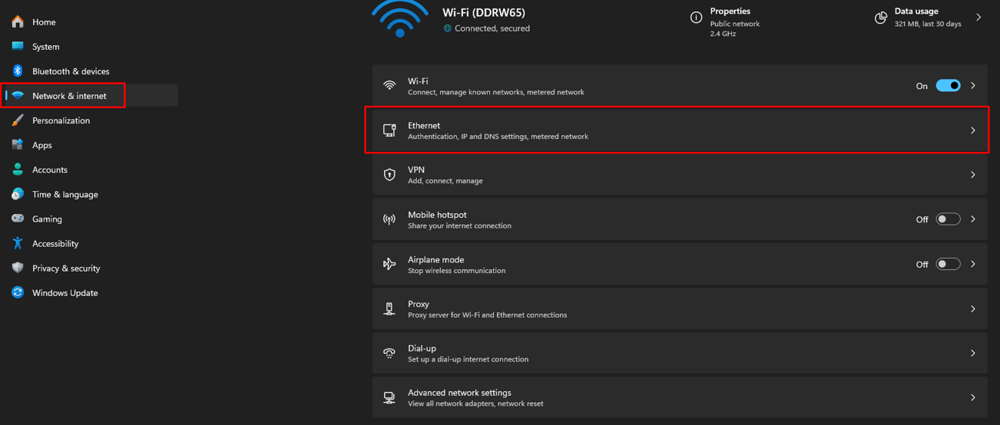

    4.1. Scroll down and click **Edit** next to **IP assignment**

    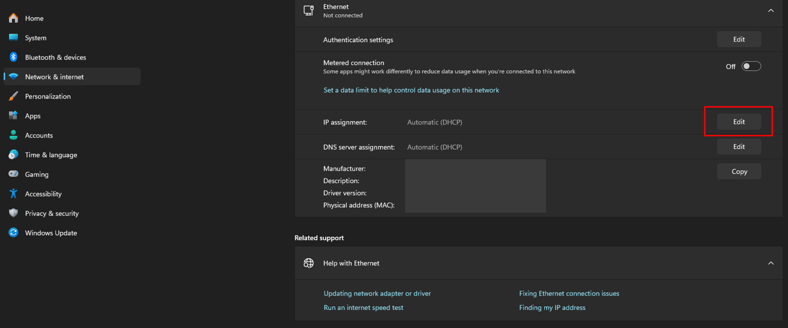
        
    4.3. Select **Manual** and enable **IPv4**
    4.4. Configure the following parameters:
        - **IP address:** 192.168.0.2
        - **Subnet mask:** 255.255.255.0

    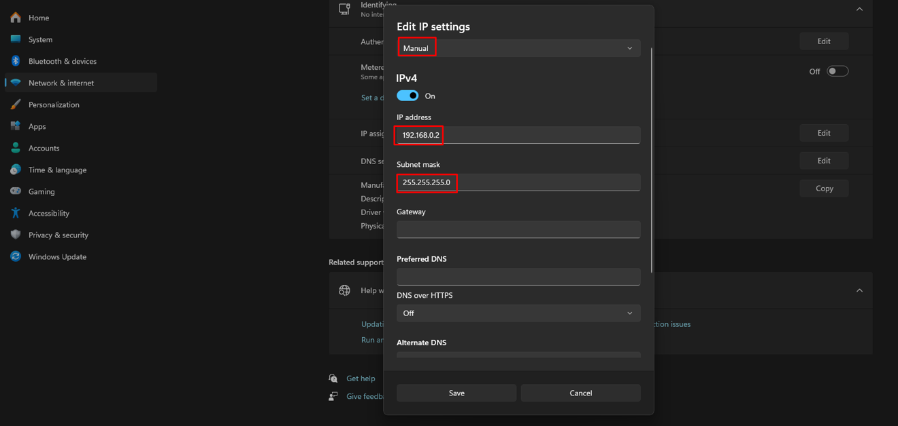

    4.5. Click **Save** to apply the changes

5. On the host PC, open a terminal application and connect to the RA board.

    | Board                  | Terminal application Tool     |
    |------------------------|-------------------------------|
    | EK-RA8D1               | Tera Term (Serial Terminal)   |

    * **Tera Term setup:**  
      * To enable local echo, go to **Setup → Terminal…** and check **Local echo**.  
      * Configure the serial port with the following parameters:  
         - **COM port:** Assigned by the J-Link on-board  
        - **Baud rate:** 115200 bps  
        - **Data bits:** 8  
        - **Parity:** None  
        - **Stop bit:** 1  
        - **Flow control:** None

6. Debug or program the EP project to the RA board and observe the output log.

7. Confirm the network connection between the host PC and RA board:
    * Open Command Prompt (cmd) on the host PC
    * Type `ipconfig` to verify the static IP address is configured correctly

        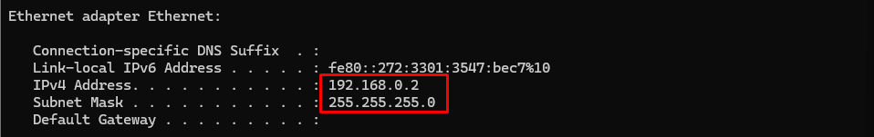

    * Ping the RA board's IP address (192.168.0.1) to confirm connectivity:
      ```
      ping 192.168.0.1
      ```
    * A successful ping response indicates the Ethernet connection is established

8. The following section demonstrates the terminal output and Modbus TCP client interaction with the running server:

    * EP Information

        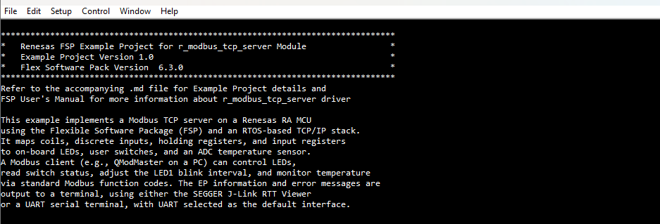

    * Modbus TCP Function Codes

        

    * Modbus TCP Server Initialization

        * **Network Configuration:**
            * Server IP Address: 192.168.0.1
            * Subnet Mask: 255.255.255.0
            * Gateway: 192.168.0.1 (optional, for local network only)

        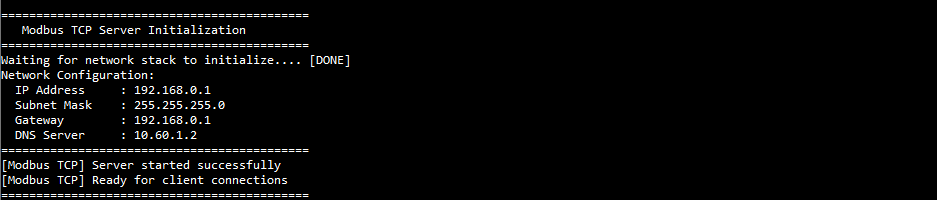

    * Once the Modbus TCP server is initialized, launch the Modbus client application on PC and connect to the server using the configured IP address (192.168.0.1). This example has been validated with **QModMaster**, which provides full compatibility with the Modbus TCP server implementation. Establish a Modbus TCP connection between the server and client.

        > **Note:** Configure the following Modbus client settings:
        > - **Options > Setting > Base Addr > 0**
        > - **Modbus Mode:** TCP
        > - **Unit ID:** 255

        

    * To read or write data:
        - Select the appropriate Function Code
        - Enter the Start Address
        - Specify the number of registers to access
        - Choose the Data Format
        - Click **Read / Write** to execute the operation

        Refer to the [Modbus TCP Register Mapping](#2-modbus-tcp-register-mapping) section for detailed function code and register definitions.


        **Read Coils (Function Code 0x01):**

        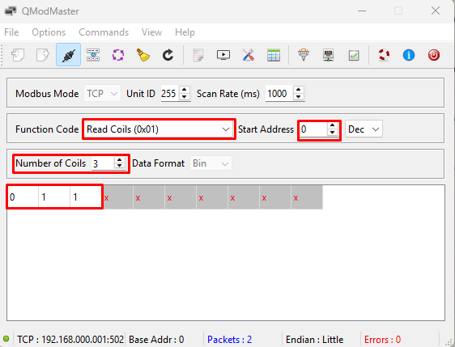

        **Read Discrete Inputs (Function Code 0x02):**

        

        **Read Holding Registers (Function Code 0x03):**

        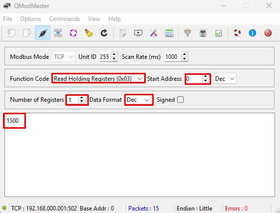

        **Read Input Registers (Function Code 0x04):**

        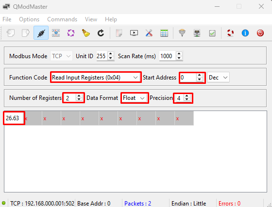

        **Write Single Coil (Function Code 0x05):**

        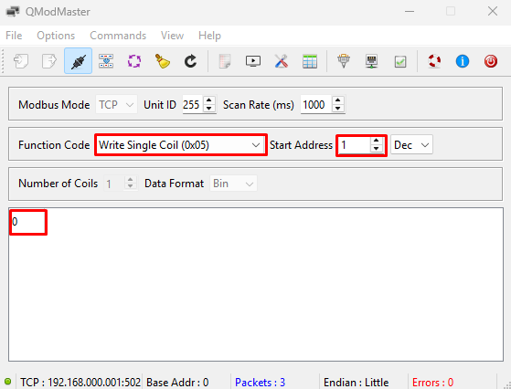

        **Write Single Register (Function Code 0x06):**

        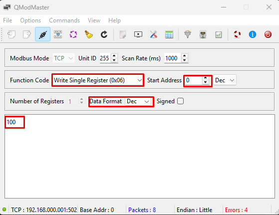

        **Write Multiple Coils (Function Code 0x0F):**

        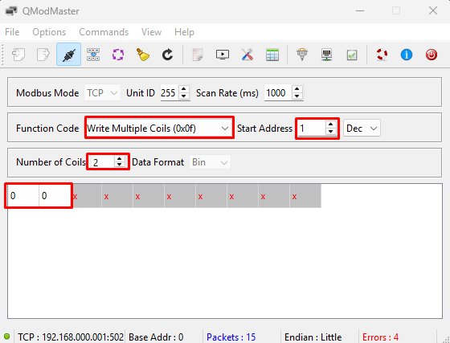

# Project Notes

## System Level Block Diagram  

High level block diagram of the system is as shown below: 

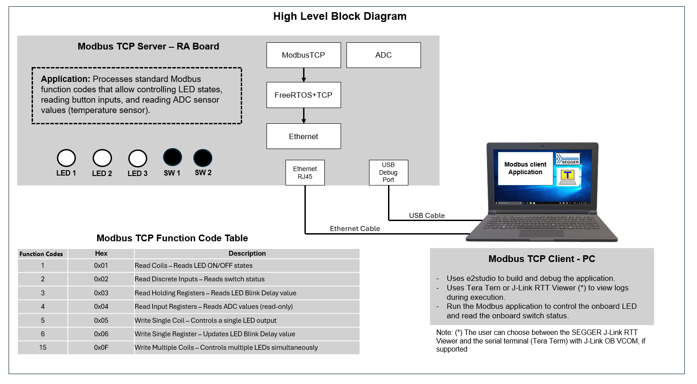

## FSP Modules Used

List all the various modules that are used in this example project. Refer to the FSP User Manual for further details on each module listed below.  
| Module Name | Usage | Searchable Keyword |
|-------------|-----------------------------------------------|-----------------------------------------------|
| FreeRTOS + TCP | Provides a real-time operating system kernel along with a lightweight TCP/IP stack for network communication and task management. | r_freertos_tcp_plus, r_freertos_port |
| Modbus TCP | Implements the Modbus protocol for TCP/IP-based communication between devices, supporting server and data exchange operations.  | r_modbus_tcp_server |
| Ethernet | Handles low-level Ethernet frame transmission and reception using the MCU’s Ethernet controller, enabling physical network connectivity. | r_ether, r_ether_phy |
| ADC | Provides access to the Analog-to-Digital Converter peripheral for sampling analog signals, such as reading temperature sensors | r_adc |
| I/O Port | Configures and controls digital input/output pins such as driving LEDs and reading switch states. | r_ioport |

## Module Configuration Notes

This section describes FSP Configurator properties which are important or different than those selected by default. 

**Configuration Properties for the BSP**
|   Module Property Path and Identifier   |   Default Value   |   Used Value   |   Reason   |
|-----------------------------------------|-------------------|----------------|------------|
| configuration.xml > BSP > Properties > Settings > Property > Heap Size (bytes) | 0 | 0x1000 | Heap size is allocated to enable dynamic memory allocation for standard library functions. |

**Configuration Properties for the FreeRTOS**   
|   Module Property Path and Identifier   |   Default Value   |   Used Value   |   Reason   |
|-----------------------------------------|-------------------|----------------|------------|
| configuration.xml > Stacks > Threads > App Thread > Properties > Settings > Property > Common > Memory Allocation > Support Dynamic Allocation | Disabled | Enabled | Enable Memory Dynamic Allocation. |
| configuration.xml > Stacks > Threads > App Thread > Properties > Settings > Property > Common > Memory Allocation > Total Heap Size |1024 | 0x6000 | The total amount of RAM available in the FreeRTOS heap. |

**Configuration Properties for the ModbusTCP**   
|   Module Property Path and Identifier   |   Default Value   |   Used Value   |   Reason   |
|-----------------------------------------|-------------------|----------------|------------|
| configuration.xml > Stacks > Threads > App Thread > ModbusTCP(r_modbus_tcp_server) Stacks > Properties > Settings > Property > Module ModbusTCP(r_modbus_tcp_server) > IP Addresses |192.168.1.101 | 192.168.0.1 | Register in the IP Addresses parameter. |
| configuration.xml > Stacks > Threads > App Thread > ModbusTCP(r_modbus_tcp_server) Stacks > Properties > Settings > Property > Module ModbusTCP(r_modbus_tcp_server) > Callback for Function Code | NULL | modbus_tcp_server_callback | Assigned a callback function to handle incoming Modbus function codes. |

**Configuration Properties for the FreeRTOS+TCP**   
|   Module Property Path and Identifier   |   Default Value   |   Used Value   |   Reason   |
|-----------------------------------------|-------------------|----------------|------------|
| configuration.xml > Stacks > Threads > App Thread > ModbusTCP(r_modbus_tcp_server) Stacks > FreeRTOS+TCP > Properties > Settings > Property > Use DHCP |Enable | Disable | Disable DHCP. |
| configuration.xml > Stacks > Threads > App Thread > ModbusTCP(r_modbus_tcp_server) Stacks > FreeRTOS+TCP > Properties > Settings > Property > DHCP Register Hostname | Enable | Disable | Disable DHCP. |
| configuration.xml > Stacks > Threads > App Thread > ModbusTCP(r_modbus_tcp_server) Stacks > FreeRTOS+TCP > Properties > Settings > Property > FreeRTOS_select() (and associated) API function is available | Disable | Enable | Allows waiting on multiple sockets at once. |
| configuration.xml > Stacks > Threads > App Thread > ModbusTCP(r_modbus_tcp_server) Stacks > FreeRTOS+TCP > Properties > Settings > Property > TCP keep-alive interval | 120 | 1200 | Time between TCP attempts to maintain connection. |

**Configuration Properties for the Ethernet** 
|   Module Property Path and Identifier   |   Default Value   |   Used Value   |   Reason   |
|-----------------------------------------|-------------------|----------------|------------|
| configuration.xml > Stacks > Threads > App Thread > ModbusTCP(r_modbus_tcp_server) Stacks > g_ether_phy0 Ethernet (r_ether_phy) > Properties > Settings > Property > Module g_ether_phy0 Ethernet (r_ether_phy) > PHY-LSI Address |0 | 5 | Set the address of the PHY-LSI used. |
| configuration.xml > Stacks > Threads > App Thread > ModbusTCP(r_modbus_tcp_server) Stacks > g_ether_phy_lsi0 Ethernet PHY-LSI > Properties > Settings > Property > Module g_ether_phy_lsi0 Ethernet PHY-LSI > PHY-LSI Address |0 | 5 | Set the address of the PHY-LSI used. |

**Configuration Properties for the ADC** 
|   Module Property Path and Identifier   |   Default Value   |   Used Value   |   Reason   |
|-----------------------------------------|-------------------|----------------|------------|
| configuration.xml > Stacks > Threads > App Thread > g_adc0 ADC (r_adc) Stacks > Properties > Settings > Property > Module g_adc0 ADC (r_adc) > Input > Channel Scan Mask (channel availability varies by MCU) > Temperature Sensor | ☐ | ☑ | Temperature sensor is enabled. |

**Configuration Properties for the Serial Terminal (UART instance)**   
|   Configure interrupt event path   |   Default Value   |   Used Value   |   Reason   |
|-----------------------------------------|-------------------|----------------|------------|
| configuration.xml > Interrupts > Interrupts Configuration > New User Event > SCI > SCI9 > SCI9 RXI (Receive data full) | empty | sci_b_uart_rxi_isr | Assign the UART receive ISR (Receive data full) to the interrupt vector table. |
| configuration.xml > Interrupts > Interrupts Configuration > New User Event > SCI > SCI9 > SCI9 TXI (Transmit data empty) | empty | sci_b_uart_txi_isr | Assign the UART transfer ISR (Transmit data empty) to the interrupt vector table. |
| configuration.xml > Interrupts > Interrupts Configuration > New User Event > SCI > SCI9 > SCI9 TEI (Transmit end) | empty | sci_b_uart_tei_isr | Assign the UART transfer ISR (Transmit end) to the interrupt vector table. |
| configuration.xml > Interrupts > Interrupts Configuration > New User Event > SCI > SCI9 > SCI9 ERI (Receive error) | empty | sci_b_uart_eri_isr | Assign the UART receive ISR (Receive error) to the interrupt vector table. |

## API Usage

The links below list the FSP provided API used at the application layer by this example project.
- [MODBUS TCP APIs on GitHub IO]
- [FREERTOS APIs on GitHub IO](https://www.freertos.org/Documentation/03-Libraries/02-FreeRTOS-plus/02-FreeRTOS-plus-TCP/01-FreeRTOS-Plus-TCP)
- [ADC APIs on GitHub IO](https://renesas.github.io/fsp/group___a_d_c.html)
- [BSP IO APIs on GitHub IO](https://renesas.github.io/fsp/group___b_s_p___i_o.html)

## Memory Usage

**Memory Usage of this example project in Bytes**
This section outlines the code and data memory consumption in the example project, encompassing both the HAL driver and application code. It provides an estimate of the memory requirements for the module and the application.

|   Compiler                              |   text	        |   data         |   .bss           |
| :-------------------------------------: | :-------------: | :------------: | :--------------: |
|   LLVM                                  |  68714  Bytes   |   276 Bytes     |  39316   Bytes |

**Memory Analysis and Detailed View**

For comprehensive memory analysis, use the **Memory Usage View** feature in e² studio. This debugging tool analyzes the project's `*.map` or `*.lbp` files to provide detailed insights into total memory consumption, ROM/RAM utilization, and section-level information regarding objects and symbols.

**To Access the Memory Usage View:**

1. Build the project to generate the link map file (*.map).
2. Navigate to **Window** → **Show View** → **Other…** → **C/C++** → **Memory Usage**.


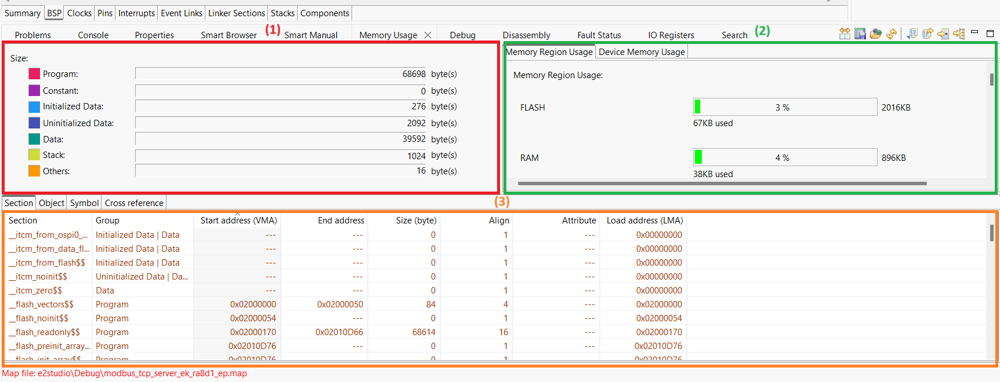

**Note:**
- (1): Group size region
- (2): RAM/ROM usage region shows percentage of RAM/ROM usage 
- (3): Detail table region

**For Additional Information:**
Refer to the e² studio Help System: **Help > Help Contents > e2 studio User Guide > Building Projects > Memory Usage > Using Memory Usage View**.

## Clock configuration

|   Configure Clock path   |   Default Value   |   Used Value   |   Reason   |
|-----------------------------------------|-------------------|----------------|------------|
| configuration.xml > Clocks > Clocks Configuration > SCICLK Src | SCICLK Disable | SCICLK Src:PLL1P | Enable operating clock for SCI module by PLL1P clock source. |
| configuration.xml > Clocks > Clocks Configuration > SCICLK Div | SCICLK Div/4 | SCICLK Div/4 | Divider for SCICLK is 4. |

# Application Execution Flow

Sequence Diagram of the EP is as shown below:  

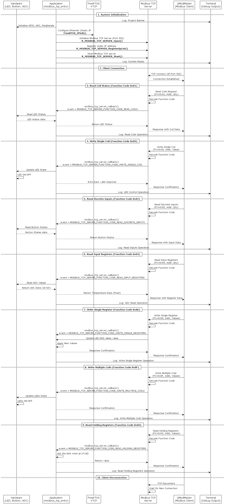

## Troubleshooting Tips 

No troubleshooting tips are seen in this EP

## Known Limitations


# Special Topics #

## 1. Terminal notes

By default, the EP supports Serial terminal for RA boards that support J-link OB VCOM
* Define USE_VIRTUAL_COM = 1 macro in Project Properties -> C/C++ Build -> Settings -> Tool Settings -> GNU ARM Cross C Compiler -> Preprocessor

To use SEGGER J-Link RTT Viewer, please follow the instructions below:
* Define USE_VIRTUAL_COM = 0 macro in Project Properties -> C/C++ Build -> Settings -> Tool Settings -> GNU ARM Cross C Compiler -> Preprocessor

## 2. Modbus TCP Register Mapping

| Function Code | Operation                | Start Address | Type     | Description                                 |
|---------------|--------------------------|---------------|----------|---------------------------------------------|
| **0x01**      | Read Coils               | 0             | Boolean  | LED1 (Blue) — 1 = ON, 0 = OFF               |
| 0x01          | Read Coils               | 1             | Boolean  | LED2 (Green) — 1 = ON, 0 = OFF              |
| 0x01          | Read Coils               | 2             | Boolean  | LED3 (Red) — 1 = ON, 0 = OFF                |
| **0x02**      | Read Discrete Inputs     | 0             | Boolean  | SW1 — 0 = Pressed, 1 = Released             |
| 0x02          | Read Discrete Inputs     | 1             | Boolean  | SW2 — 0 = Pressed, 1 = Released             |
| **0x03**      | Read Holding Registers   | 0             | uint16   | LED1 blink delay (ms), default = 1500 ms    |
| **0x04**      | Read Input Registers     | 0             | uint16   | ADC measured value (temperature)            |
| **0x05**      | Write Single Coil        | 1             | Boolean  | Control LED2 — 0 = OFF, 1 = ON              |
| 0x05          | Write Single Coil        | 2             | Boolean  | Control LED3 — 0 = OFF, 1 = ON              |
| **0x06**      | Write Single Register    | 0             | uint16   | Update LED1 blink delay (ms)                |
| **0x0F**      | Write Multiple Coils     | 1, 2          | Boolean  | Update LED2 and LED3 simultaneously         |

## 3. Connection Timeout: TCP Keep-Alive Interval

The TCP keep-alive interval ensures persistent Modbus TCP connections by preventing idle connections from being closed by network devices.

**Configuration:**
- **Default:** 120s  
- **Used:** 1200s  
- **Location:** `configuration.xml > Stacks > Threads > App Thread > ModbusTCP(r_modbus_tcp_server) Stacks > FreeRTOS+TCP > Properties > TCP keep-alive interval`

**Notes:**
- Shorter intervals keep connections active and responsive.  
- Prevents network devices from closing idle connections.  
- Adjust based on network and client requirements.

# Conclusion and Next Steps

This example demonstrates a Modbus TCP server on a Renesas RA MCU using FSP and an RTOS-based TCP/IP stack. It maps coils, discrete inputs, holding registers, and input registers to on-board LEDs, switches, and an ADC temperature sensor.

A Modbus client (e.g., QModMaster) can control LEDs, read switch status, adjust LED1 blink rate, and monitor temperature. Endpoint info and error messages are shown via SEGGER J-Link RTT Viewer or UART.

**Next Steps:**
- Explore the project source code in the `src` directory.  
- Refer to FSP HAL drivers and the user manual for technical details.  
- Visit renesas.com for Modbus TCP resources and application notes.  

This example provides hands-on experience with Modbus TCP, enabling remote monitoring and control of RA MCU hardware.

# References

The following documents can be referred to for enhancing your understanding of 
the operation of this example project:
- [FSP User Manual on GitHub](https://renesas.github.io/fsp/)
- [FSP Known Issues](https://github.com/renesas/fsp/issues)
- [RA8D1 - (480MHz Arm Cortex-M85 Based Graphics Microcontroller)](https://www.renesas.com/en/products/ra8d1)
- [Quick Start Guide: Modbus TCP](https://www.renesas.com/en/document/qsg/renesas-ra-family-quick-start-guide-modbus-tcp)

# Notice

1. Descriptions of circuits, software and other related
information in this document are provided only to illustrate the
operation of semiconductor products and application examples. You are
fully responsible for the incorporation or any other use of the
circuits, software, and information in the design of your product or
system. Renesas Electronics disclaims any and all liability for any
losses and damages incurred by you or third parties arising from the use
of these circuits, software, or information. 

2. Renesas Electronics
hereby expressly disclaims any warranties against and liability for
infringement or any other claims involving patents, copyrights, or other
intellectual property rights of third parties, by or arising from the
use of Renesas Electronics products or technical information described
in this document, including but not limited to, the product data,
drawings, charts, programs, algorithms, and application examples. 

3. No license, express, implied or otherwise, is granted hereby under any
patents, copyrights or other intellectual property rights of Renesas
Electronics or others. 

4. You shall be responsible for determining what
licenses are required from any third parties, and obtaining such
licenses for the lawful import, export, manufacture, sales, utilization,
distribution or other disposal of any products incorporating Renesas
Electronics products, if required. 

5. You shall not alter, modify, copy,
or reverse engineer any Renesas Electronics product, whether in whole or
in part. Renesas Electronics disclaims any and all liability for any
losses or damages incurred by you or third parties arising from such
alteration, modification, copying or reverse engineering. 

6. Renesas Electronics products are classified according to the following two
quality grades: "Standard" and "High Quality". The intended applications
for each Renesas Electronics product depends on the product's quality
grade, as indicated below. "Standard": Computers; office equipment;
communications equipment; test and measurement equipment; audio and
visual equipment; home electronic appliances; machine tools; personal
electronic equipment; industrial robots; etc. "High Quality":
Transportation equipment (automobiles, trains, ships, etc.); traffic
control (traffic lights); large-scale communication equipment; key
financial terminal systems; safety control equipment; etc. Unless
expressly designated as a high reliability product or a product for
harsh environments in a Renesas Electronics data sheet or other Renesas
Electronics document, Renesas Electronics products are not intended or
authorized for use in products or systems that may pose a direct threat
to human life or bodily injury (artificial life support devices or
systems; surgical implantations; etc.), or may cause serious property
damage (space system; undersea repeaters; nuclear power control systems;
aircraft control systems; key plant systems; military equipment; etc.).
Renesas Electronics disclaims any and all liability for any damages or
losses incurred by you or any third parties arising from the use of any
Renesas Electronics product that is inconsistent with any Renesas
Electronics data sheet, user's manual or other Renesas Electronics
document. 

7. No semiconductor product is absolutely secure. Notwithstanding any security measures or features that may be implemented in Renesas Electronics hardware or software products, Renesas Electronics shall have absolutely no liability arising out of
any vulnerability or security breach, including but not limited to any unauthorized access to or use of a Renesas Electronics product or a system that uses a Renesas Electronics product. RENESAS ELECTRONICS DOES NOT WARRANT OR GUARANTEE THAT RENESAS ELECTRONICS PRODUCTS, OR ANY
SYSTEMS CREATED USING RENESAS ELECTRONICS PRODUCTS WILL BE INVULNERABLE OR FREE FROM CORRUPTION, ATTACK, VIRUSES, INTERFERENCE, HACKING, DATA LOSS OR THEFT, OR OTHER SECURITY INTRUSION ("Vulnerability Issues"). RENESAS ELECTRONICS DISCLAIMS ANY AND ALL RESPONSIBILITY OR LIABILITY
ARISING FROM OR RELATED TO ANY VULNERABILITY ISSUES. FURTHERMORE, TO THE EXTENT PERMITTED BY APPLICABLE LAW, RENESAS ELECTRONICS DISCLAIMS ANY AND ALL WARRANTIES, EXPRESS OR IMPLIED, WITH RESPECT TO THIS DOCUMENT
AND ANY RELATED OR ACCOMPANYING SOFTWARE OR HARDWARE, INCLUDING BUT NOT LIMITED TO THE IMPLIED WARRANTIES OF MERCHANTABILITY, OR FITNESS FOR A PARTICULAR PURPOSE. 

8. When using Renesas Electronics products, refer to the latest product information (data sheets, user's manuals, application notes, "General Notes for Handling and Using Semiconductor Devices" in
the reliability handbook, etc.), and ensure that usage conditions are within the ranges specified by Renesas Electronics with respect to
maximum ratings, operating power supply voltage range, heat dissipation characteristics, installation, etc. Renesas Electronics disclaims any
and all liability for any malfunctions, failure or accident arising out of the use of Renesas Electronics products outside of such specified
ranges. 

9. Although Renesas Electronics endeavors to improve the quality and reliability of Renesas Electronics products, semiconductor products
have specific characteristics, such as the occurrence of failure at a certain rate and malfunctions under certain use conditions. Unless
designated as a high reliability product or a product for harsh environments in a Renesas Electronics data sheet or other Renesas
Electronics document, Renesas Electronics products are not subject to radiation resistance design. You are responsible for implementing safety
measures to guard against the possibility of bodily injury, injury or damage caused by fire, and/or danger to the public in the event of a
failure or malfunction of Renesas Electronics products, such as safety design for hardware and software, including but not limited to
redundancy, fire control and malfunction prevention, appropriate treatment for aging degradation or any other appropriate measures.
Because the evaluation of microcomputer software alone is very difficult and impractical, you are responsible for evaluating the safety of the
final products or systems manufactured by you. 

10. Please contact a
Renesas Electronics sales office for details as to environmental matters such as the environmental compatibility of each Renesas Electronics
product. You are responsible for carefully and sufficiently investigating applicable laws and regulations that regulate the
inclusion or use of controlled substances, including without limitation, the EU RoHS Directive, and using Renesas Electronics products in
compliance with all these applicable laws and regulations. Renesas Electronics disclaims any and all liability for damages or losses
occurring as a result of your noncompliance with applicable laws and regulations. 

11. Renesas Electronics products and technologies shall not be used for or incorporated into any products or systems whose
manufacture, use, or sale is prohibited under any applicable domestic or foreign laws or regulations. You shall comply with any applicable export
control laws and regulations promulgated and administered by the governments of any countries asserting jurisdiction over the parties or
transactions. 

12. It is the responsibility of the buyer or distributor of Renesas Electronics products, or any other party who distributes,
disposes of, or otherwise sells or transfers the product to a third party, to notify such third party in advance of the contents and
conditions set forth in this document. 

13. This document shall not be
reprinted, reproduced or duplicated in any form, in whole or in part, without prior written consent of Renesas Electronics. 

14. Please contact a Renesas Electronics sales office if you have any questions regarding the information contained in this document or Renesas Electronics
products. (Note1) "Renesas Electronics" as used in this document means Renesas Electronics Corporation and also includes its directly or
indirectly controlled subsidiaries. (Note2) "Renesas Electronics product(s)" means any product developed or manufactured by or for
Renesas Electronics.

                                                                                   (Rev.5.0-1 October 2020)
## Corporate Headquarters 

Contact information TOYOSU FORESIA, 3-2-24

Toyosu, Koto-ku, Tokyo 135-0061, Japan 

www.renesas.com 

## Contact information 

For further information on a product, technology, the most up-to-date version of a
document, or your nearest sales office, please visit:
www.renesas.com/contact/. 

## Trademarks 
Renesas and the Renesas logo are trademarks of Renesas Electronics Corporation. All trademarks and
registered trademarks are the property of their respective owners.

							© 2025 Renesas Electronics Corporation. All rights reserved
