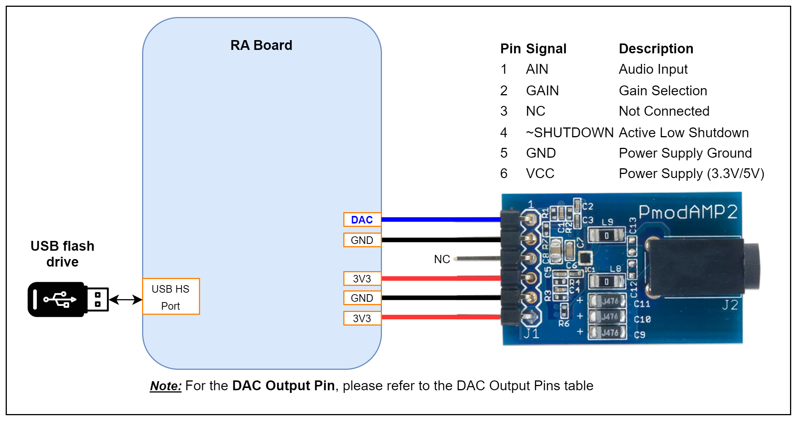
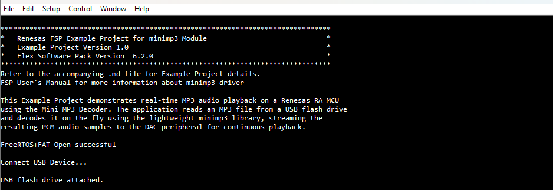
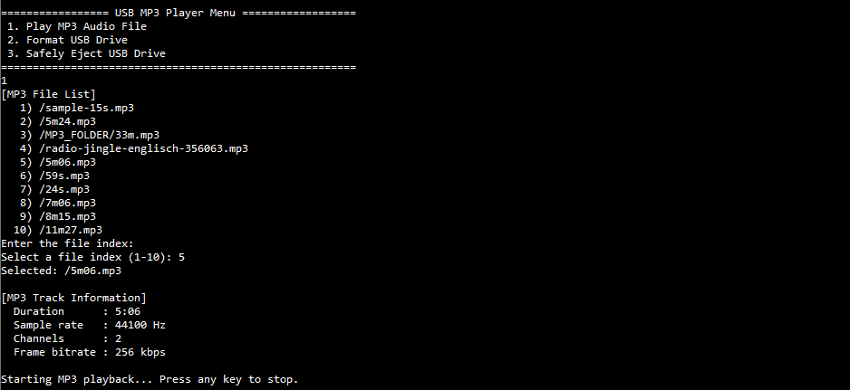
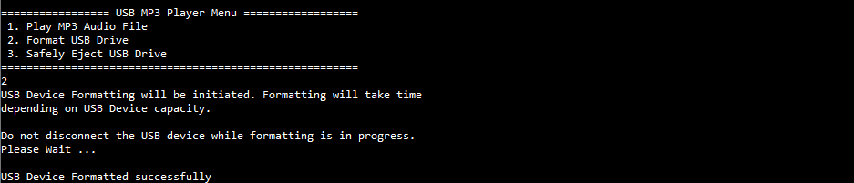
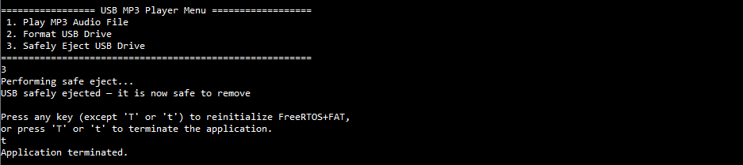
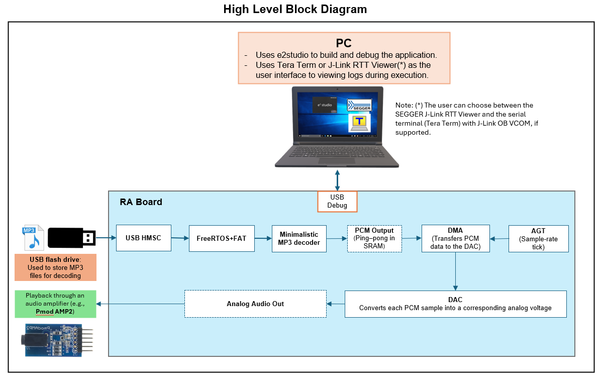
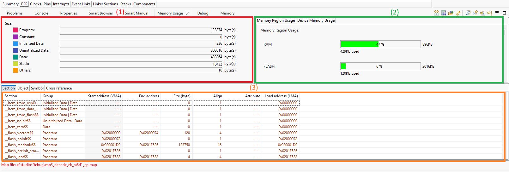
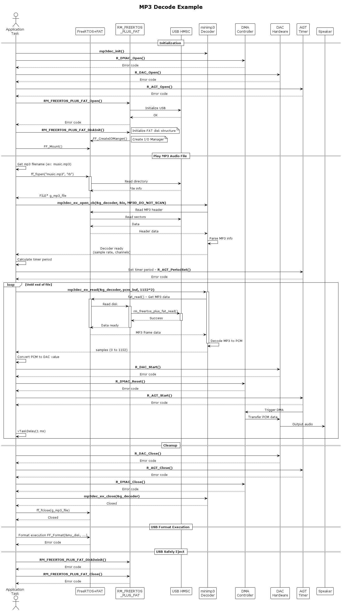

# MINI MP3 Example on RA Boards

## Table of Contents
1. [Introduction](#introduction)
2. [Required Resources](#required-resources)
    1. [Hardware Requirements](#hardware-requirements)
        1. [Required Boards](#required-boards)
        2. [Supported Boards](#supported-boards)
        3. [Additional Hardware](#additional-hardware)
        4. [Hardware Connections](#hardware-connections)
    2. [Software Requirements](#software-requirements)

3. [Verifying the application](#verifying-the-application)
4. [Project Notes](#project-notes)
    1. [System Level Block Diagram](#system-level-block-diagram)
    2. [FSP Modules Used](#FSP-Modules-Used)
    3. [Module Configuration Notes:](#module-configuration-notes)
    4. [API Usage](#api-usage)
    5. [Memory Usage](#memory-usage)
    6. [Clock Configuration](#clock-configuration)
    7. [Application Execution Flow](#application-execution-flow)
    8. [Troubleshooting Tips](#troubleshooting-tips)
    9. [Known Limitations](#known-limitations)
5. [Special Topics](#special-topics)
6. [Conclusion and Next Steps](#conclusion-and-next-steps)
7. [References](#references)
8. [Notice](#notice)

# Introduction
This Example Project demonstrates real-time MP3 audio playback on a Renesas RA MCU using the Mini MP3 Decoder. The application reads an MP3 file from a USB flash drive and decodes it on the fly, streaming the resulting PCM audio samples to the DAC peripheral for continuous playback. The EP information and error messages are output to a terminal, using either the SEGGER J-Link RTT Viewer or a UART serial terminal, with UART selected as the default interface.

**Main Menu:**
1. Play MP3 Audio File
2. Format USB Drive
3. Safely Eject USB Drive

Please refer to the [Example Project Usage Guide](https://github.com/renesas/ra-fsp-examples/blob/master/example_projects/Example%20Project%20Usage%20Guide.pdf) 
for general information on example projects

# Required Resources
To build and run this example project, the following resources are needed.

## Hardware Requirements

### Required Boards 

* 1 x RA board

### Supported Boards 

* EK-RA8D1

### Additional Hardware 

- 1 × USB cable for programming and debugging  
  *Use the appropriate connector depending on board type (USB Type-C / Micro-USB).*

- 1 × Digilent PMOD AMP2 (SKU: 410-233)  
  *Audio amplifier module.*

- 1 × Wired headset with 3.5 mm audio jack

- 1 × USB flash drive

- 1 × USB OTG/host cable  
  *Ensure the connector type matches the board (e.g., USB-C OTG or Micro-USB OTG).*

- 5 × Female-to-female jumper wires

## Hardware Connections
* Connect the USB Debug port on the board to the PC using an appropriate USB cable (Micro-USB or USB Type-C, depending on board type). Refer to the [USB Configuration](#3-usb-configuration) section for the type and location of the Debug port.
* Connect a USB flash drive to the USB High-Speed port using a USB OTG cable. Configure the RA board for USB Host Mode by setting jumpers and switches as specified in the [USB Configuration](#3-usb-configuration) section.
* Connect the PMOD AMP2 audio amplifier module to the RA board using 5 female-to-female jumper wires according to the pinout table below:

    | PMOD AMP2 Pin | Signal | RA Board Connection |
    |---|---|---|
    | 1 | AIN (Audio Input) | DAC Output Pin (See table below) |
    | 2 | GAIN | Ground (GND) |
    | 3 | NC | Not Connected |
    | 4 | SD (Shutdown) | 3.3V Supply |
    | 5 | GND | Ground (GND) |
    | 6 | VCC | 3.3V Supply |

    **DAC Output Pins**

    | Board | DAC Output Pin |
    |-------|---|
    | EK-RA8D1 | P014 |

    **Reference Connection Diagram (EK-RA8D1):**
    
    

* Connect a wired headset to the audio output jack on the PMOD AMP2 module.

## Software Requirements
* Renesas Flexible Software Package (FSP): Version 6.3.0
* e2 studio: Version 2025-12
* SEGGER J-Link RTT Viewer: Version 8.92
* Terminal Console Application: Tera Term version 4.99
* LLVM Embedded Toolchain for ARM: Version 21.1.1

# Verifying Operation

1. Import the example project into e²studio. 
2. Generate the project content and build the example.
3. Ensure all required hardware connections are completed before running the example.
4. On the host PC, open a terminal application and connect to the RA board.

    | Board                  | Terminal application Tool     |
    |------------------------|-------------------------------|
    | EK-RA8D1               | Tera Term (Serial Terminal)   |

    * **Tera Term setup:**  
      * To enable local echo, go to **Setup → Terminal…** and check **Local echo**.  
      * Configure the serial port with the following parameters:  
         - **COM port:** Assigned by the J-Link on-board  
        - **Baud rate:** 115200 bps  
        - **Data bits:** 8  
        - **Parity:** None  
        - **Stop bit:** 1  
        - **Flow control:** None
5. Debug or program the EP project to the RA board and observe the output log.

6. The image below illustrates the terminal application in operation:
  * EP Information

    

  * Main menu

    

  * Play MP3 Audio File

    

  * Format USB Drive

    

  * Safely Eject USB Drive

    
  
# Project Notes

This section provides a system-level block diagram of the mini mp3 EP that visually represents the overall architecture, highlighting how different modules interact and how data flows through the system. 
It shows FSP modules DAC, AGT, DMAC, USB HMSC and Minimp3 Library, which are essential for the application's functionality. Module configuration details are generally covered in the FSP User Manual (UM), 
with additional notes provided only when specific configurations deviate from the standard setup and require user attention. API usage is documented with references to the FSP UM, and
the actual implementation of these APIs is illustrated in the application flow diagram.

Memory usage is outlined, including RAM and Flash consumption, along with the initial FSP version used during the release of the example project, categorized by MCU group and compiler. 
Lastly, any non-default clock configurations and special considerations for clock setup are clearly documented to ensure proper system operation.

## System Level Block Diagram
 High level block diagram of the system is as shown below:
 

## FSP Modules Used
List all the various modules that are used in this example project. Refer to the FSP User Manual for further details on each module listed below.

| Module Name        | Usage                                                                | Searchable Keyword        |
|-------------------|-----------------------------------------------------------------------|---------------------------|
| DAC               | Digital-to-Analog conversion for audio output                         | r_dac                     |
| AGT               | Timer module used for generating precise timing events                | r_agt                     |
| DMAC              | Direct Memory Access controller for efficient data transfer           | r_dmac                    |
| USB HMSC          | USB Host Mass Storage Class for accessing USB flash drives            | r_usb_hmsc                |
| FreeRTOS FAT      | File system support for reading/writing files on storage media        | FreeRTOS FAT              |
| Minimp3 Library   | Lightweight MP3 decoder library for audio playback                    | Minimp3                   |

## Module Configuration Notes
This section describes FSP Configurator properties which are important or different than those selected by default.

**BSP Configuration**
|   Module Property Path and Identifier   |   Default Value   |   Used Value   |   Reason   |
|-----------------------------------------|-------------------|----------------|------------|
| configuration.xml > BSP > Properties > Settings > Property > RA Common > Main stack size (bytes) | 0x400 | 0x4800 | Set the size of the main program stack |
| configuration.xml > BSP > Properties > Settings > Property > RA Common > Heap size size (bytes) | 0 | 0x40000 | Set the heap size |

**Configuration Properties for App Thread**

|   Module Property Path and Identifier   |   Default Value   |   Used Value   |   Reason   |
|-----------------------------------------|-------------------|----------------|------------|
| configuration.xml > Stacks > App Thread > Settings > Property > Memory Allocation > Support Dynamic Allocation | Disable | Enable | Enable dynamic allocation |
| configuration.xml > Stacks > App Thread > Settings > Property > Memory Allocation > Total Heap Size | 1024 | 0xF000 | Set the heap size for thread |
| configuration.xml > Stacks > App Thread > Settings > Property > Thread > Stack size (bytes) | 1024 | 0x6B00 | Set the stack size for thread |

**Configuration Properties for FreeRTOS+FAT**

|   Module Property Path and Identifier   |   Default Value   |   Used Value   |   Reason   |
|-----------------------------------------|-------------------|----------------|------------|
| configuration.xml > Stacks > App Thread > FreeRTOS+FAT > Settings > Property > Commom > Long Function Names | Disable | Enable | Enable long function name |

**Configuration Properties for DMAC instance**

| Module Property Path and Identifier | Default Value | Used Value      | Reason |
|-------------------------------------|---------------|-----------------|--------|
| configuration.xml > g_transfer1 Transfer (r_dmac) > Properties > Settings > Property > Module g_transfer1 Transfer (r_dmac) > Source Address Mode | Fixed | Offset addition | Enable automatic increment of the source address for each transfer to read sequential data from memory. |
| configuration.xml > g_transfer1 Transfer (r_dmac) > Properties > Settings > Property > Module g_transfer1 Transfer (r_dmac) > Number of Transfers | 1 | 1152 | Set to match the total number of data items (samples/bytes) to be transferred in one DMA operation. |
| configuration.xml > g_transfer1 Transfer (r_dmac) > Properties > Settings > Property > Module g_transfer1 Transfer (r_dmac) > Activation Source | No ELC Trigger | AGT0 INT (AGT interrupt) | Use the AGT0 interrupt as the DMA trigger so that data transfers are synchronized with the AGT timer period. |
| configuration.xml > g_transfer1 Transfer (r_dmac) > Properties > Settings > Property > Module g_transfer1 Transfer (r_dmac) > Callback | NULL | transfer_callback | Defines the callback function to handle the end-of-transfer event |
| configuration.xml > g_transfer1 Transfer (r_dmac) > Properties > Settings > Property > Module g_transfer1 Transfer (r_dmac) > Transfer End Interrupt Priority | Disabled | Priority 2 | Select the transfer end interrupt priority |

**Configuration Properties for the Serial Terminal (UART instance)**   
|   Configure interrupt event path   |   Default Value   |   Used Value   |   Reason   |
|-----------------------------------------|-------------------|----------------|------------|
| configuration.xml > Interrupts > Interrupts Configuration > New User Event > SCI > SCI9 > SCI9 RXI (Receive data full) | empty | sci_b_uart_rxi_isr | Assign the UART receive ISR (Receive data full) to the interrupt vector table. |
| configuration.xml > Interrupts > Interrupts Configuration > New User Event > SCI > SCI9 > SCI9 TXI (Transmit data empty) | empty | sci_b_uart_txi_isr | Assign the UART transfer ISR (Transmit data empty) to the interrupt vector table. |
| configuration.xml > Interrupts > Interrupts Configuration > New User Event > SCI > SCI9 > SCI9 TEI (Transmit end) | empty | sci_b_uart_tei_isr | Assign the UART transfer ISR (Transmit end) to the interrupt vector table. |
| configuration.xml > Interrupts > Interrupts Configuration > New User Event > SCI > SCI9 > SCI9 ERI (Receive error) | empty | sci_b_uart_eri_isr | Assign the UART receive ISR (Receive error) to the interrupt vector table. |

## API Usage
The links below list the FSP provided API used at the application layer by this example project.
- [Minimp3 Library APIs on GitHub IO](https://renesas.github.io/fsp/group___m_i_n_i_m_p3___p_o_r_t.html)
- [DAC APIs on GitHub IO](https://renesas.github.io/fsp/group___d_a_c.html)
- [AGT APIs on GitHub IO](https://renesas.github.io/fsp/group___a_g_t.html)
- [DMAC APIs on GitHub IO](https://renesas.github.io/fsp/group___d_m_a_c.html)
- [FreeRTOS+FAT Port for RA APIs on GitHub IO](https://renesas.github.io/fsp/group___r_m___f_r_e_e_r_t_o_s___p_l_u_s___f_a_t.html)
- [USB HMSC APIs on GitHub IO](https://renesas.github.io/fsp/group___u_s_b___h_m_s_c.html)
- [BSP IO APIs on GitHub IO](https://renesas.github.io/fsp/group___b_s_p___i_o.html)

## Memory Usage

**Memory Usage of this Example Project in Bytes**
This section outlines the code and data memory consumption in the example project, encompassing both the HAL driver and application code. It provides an estimate of the memory requirements for the module and the application.

|   Compiler                              |   text	        |   data         |   .bss           |
| :-------------------------------------: | :-------------: | :------------: | :--------------: |
|   LLVM                                  |   135742 Bytes   |   340 Bytes     |    439524 Bytes |

**Memory Analysis and Detailed View**

For comprehensive memory analysis, use the **Memory Usage View** feature in e² studio. This debugging tool analyzes the project's `*.map` or `*.lbp` files to provide detailed insights into total memory consumption, ROM/RAM utilization, and section-level information regarding objects and symbols.

**To Access the Memory Usage View:**

1. Build the project to generate the link map file (*.map).
2. Navigate to **Window** → **Show View** → **Other…** → **C/C++** → **Memory Usage**.

**Note:**
- (1): Group size region
- (2): RAM/ROM usage region shows percentage of RAM/ROM usage 
- (3): Detail table region

## Clock configuration
|   Configure Clock path   |   Default Value   |   Used Value   |   Reason   |
|-----------------------------------------|-------------------|----------------|------------|
| configuration.xml > Clocks > Clocks Configuration > SCICLK Src | SCICLK Disable | SCICLK Src:PLL1P | Enable operating clock for SCI module by PLL1P clock source. |
| configuration.xml > Clocks > Clocks Configuration > SCICLK Div | SCICLK Div/4 | SCICLK Div/4 | Divider for SCICLK is 4. |

# Application Execution Flow
Sequence Diagram of the EP is as shown below:
 

## Troubleshooting Tips 

No specific troubleshooting tips are provided for this example project at this time. 

## Known Limitations

There are no known limitations identified for this example project at this time.

# Special Topics #

## 1. Terminal notes
By default, the EP supports Serial terminal for RA boards that support J-link OB VCOM
* Define USE_VIRTUAL_COM = 1 macro in Project Properties -> C/C++ Build -> Settings -> Tool Settings -> Compiler -> Includes -> Macro Defines (-D)

To use SEGGER J-Link RTT Viewer, please follow the instructions below:
* Define USE_VIRTUAL_COM = 0 macro in Project Properties -> C/C++ Build -> Settings -> Tool Settings -> Compiler -> Includes -> Macro Defines (-D)

## 2. Long Function Name (LFN)
The EP supports long file names up to 64 characters. Ensure file names do not exceed 64 characters and use only ASCII characters for full compatibility. This includes the complete file path (e.g., `/path/to/filename.mp3`).

## 3. USB Configuration

The USB configuration for the RA board depends on the desired mode of operation. The table below outlines the jumper and switch settings required for different USB ports and modes:

| Board | Port Type | Connector | Pin | Host Mode | Device Mode |
|-------|-----------|-----------|-----|-----------|-------------|
| **EK-RA8D1** | Debug | Micro-USB | J10 | USB Debug | USB Debug |
| | High-Speed | Micro-USB | J31 | J7: 1-2 J17: Remove SW1-6: OFF | J7: 2-3 J17: 1-2 |
| | Full-Speed | Micro-USB | J11 | J12: 1-2 J15: Remove | J12: 2-3 J15: 1-2 |

**Note:** Configure jumpers and switches according to the desired mode before powering on the board.

# Conclusion and Next Steps

The Mini MP3 Example Project (EP) illustrates how to integrate key FSP components DAC, AGT, DMAC, USB HMSC, FreeRTOS, FAT File System, and Minimp3 decoding to enable audio playback from a USB flash drive on RA series MCUs.
This EP as a hands-on reference for developers working with USB Mass Storage, audio output, DMA-based streaming, and file-system processing on embedded platforms.

**Next Steps for Exploration:**

- Try different MP3 files to observe playback behavior and verify decoding robustness.  
- Explore audio output expansion, such as PMOD AMP2 or custom amplifiers, to improve sound quality.  
- Extend the EP to support pause/resume, volume control, or track selection through UI or commands. 

# References

The following documents can be referred to for enhancing your understanding of 
the operation of this example project:
- [FSP User Manual on GitHub](https://renesas.github.io/fsp/)
- [FSP Known Issues](https://github.com/renesas/fsp/issues)
- [RA8D1 - (480MHz Arm Cortex-M85 Based Graphics Microcontroller with Helium and TrustZone)](https://www.renesas.com/en/products/ra8d1)
- For detailed usage of minimp3, please visit https://github.com/lieff/minimp3.

# Notice

1. Descriptions of circuits, software and other related
information in this document are provided only to illustrate the
operation of semiconductor products and application examples. You are
fully responsible for the incorporation or any other use of the
circuits, software, and information in the design of your product or
system. Renesas Electronics disclaims any and all liability for any
losses and damages incurred by you or third parties arising from the use
of these circuits, software, or information. 

2. Renesas Electronics
hereby expressly disclaims any warranties against and liability for
infringement or any other claims involving patents, copyrights, or other
intellectual property rights of third parties, by or arising from the
use of Renesas Electronics products or technical information described
in this document, including but not limited to, the product data,
drawings, charts, programs, algorithms, and application examples. 

3. No license, express, implied or otherwise, is granted hereby under any
patents, copyrights or other intellectual property rights of Renesas
Electronics or others. 

4. You shall be responsible for determining what
licenses are required from any third parties, and obtaining such
licenses for the lawful import, export, manufacture, sales, utilization,
distribution or other disposal of any products incorporating Renesas
Electronics products, if required. 

5. You shall not alter, modify, copy,
or reverse engineer any Renesas Electronics product, whether in whole or
in part. Renesas Electronics disclaims any and all liability for any
losses or damages incurred by you or third parties arising from such
alteration, modification, copying or reverse engineering. 

6. Renesas Electronics products are classified according to the following two
quality grades: "Standard" and "High Quality". The intended applications
for each Renesas Electronics product depends on the product's quality
grade, as indicated below. "Standard": Computers; office equipment;
communications equipment; test and measurement equipment; audio and
visual equipment; home electronic appliances; machine tools; personal
electronic equipment; industrial robots; etc. "High Quality":
Transportation equipment (automobiles, trains, ships, etc.); traffic
control (traffic lights); large-scale communication equipment; key
financial terminal systems; safety control equipment; etc. Unless
expressly designated as a high reliability product or a product for
harsh environments in a Renesas Electronics data sheet or other Renesas
Electronics document, Renesas Electronics products are not intended or
authorized for use in products or systems that may pose a direct threat
to human life or bodily injury (artificial life support devices or
systems; surgical implantations; etc.), or may cause serious property
damage (space system; undersea repeaters; nuclear power control systems;
aircraft control systems; key plant systems; military equipment; etc.).
Renesas Electronics disclaims any and all liability for any damages or
losses incurred by you or any third parties arising from the use of any
Renesas Electronics product that is inconsistent with any Renesas
Electronics data sheet, user's manual or other Renesas Electronics
document. 

7. No semiconductor product is absolutely secure. Notwithstanding any security measures or features that may be implemented in Renesas Electronics hardware or software products, Renesas Electronics shall have absolutely no liability arising out of
any vulnerability or security breach, including but not limited to any unauthorized access to or use of a Renesas Electronics product or a system that uses a Renesas Electronics product. RENESAS ELECTRONICS DOES NOT WARRANT OR GUARANTEE THAT RENESAS ELECTRONICS PRODUCTS, OR ANY
SYSTEMS CREATED USING RENESAS ELECTRONICS PRODUCTS WILL BE INVULNERABLE OR FREE FROM CORRUPTION, ATTACK, VIRUSES, INTERFERENCE, HACKING, DATA LOSS OR THEFT, OR OTHER SECURITY INTRUSION ("Vulnerability Issues"). RENESAS ELECTRONICS DISCLAIMS ANY AND ALL RESPONSIBILITY OR LIABILITY
ARISING FROM OR RELATED TO ANY VULNERABILITY ISSUES. FURTHERMORE, TO THE EXTENT PERMITTED BY APPLICABLE LAW, RENESAS ELECTRONICS DISCLAIMS ANY AND ALL WARRANTIES, EXPRESS OR IMPLIED, WITH RESPECT TO THIS DOCUMENT
AND ANY RELATED OR ACCOMPANYING SOFTWARE OR HARDWARE, INCLUDING BUT NOT LIMITED TO THE IMPLIED WARRANTIES OF MERCHANTABILITY, OR FITNESS FOR A PARTICULAR PURPOSE. 

8. When using Renesas Electronics products, refer to the latest product information (data sheets, user's manuals, application notes, "General Notes for Handling and Using Semiconductor Devices" in
the reliability handbook, etc.), and ensure that usage conditions are within the ranges specified by Renesas Electronics with respect to
maximum ratings, operating power supply voltage range, heat dissipation characteristics, installation, etc. Renesas Electronics disclaims any
and all liability for any malfunctions, failure or accident arising out of the use of Renesas Electronics products outside of such specified
ranges. 

9. Although Renesas Electronics endeavors to improve the quality and reliability of Renesas Electronics products, semiconductor products
have specific characteristics, such as the occurrence of failure at a certain rate and malfunctions under certain use conditions. Unless
designated as a high reliability product or a product for harsh environments in a Renesas Electronics data sheet or other Renesas
Electronics document, Renesas Electronics products are not subject to radiation resistance design. You are responsible for implementing safety
measures to guard against the possibility of bodily injury, injury or damage caused by fire, and/or danger to the public in the event of a
failure or malfunction of Renesas Electronics products, such as safety design for hardware and software, including but not limited to
redundancy, fire control and malfunction prevention, appropriate treatment for aging degradation or any other appropriate measures.
Because the evaluation of microcomputer software alone is very difficult and impractical, you are responsible for evaluating the safety of the
final products or systems manufactured by you. 

10. Please contact a
Renesas Electronics sales office for details as to environmental matters such as the environmental compatibility of each Renesas Electronics
product. You are responsible for carefully and sufficiently investigating applicable laws and regulations that regulate the
inclusion or use of controlled substances, including without limitation, the EU RoHS Directive, and using Renesas Electronics products in
compliance with all these applicable laws and regulations. Renesas Electronics disclaims any and all liability for damages or losses
occurring as a result of your noncompliance with applicable laws and regulations. 

11. Renesas Electronics products and technologies shall not be used for or incorporated into any products or systems whose
manufacture, use, or sale is prohibited under any applicable domestic or foreign laws or regulations. You shall comply with any applicable export
control laws and regulations promulgated and administered by the governments of any countries asserting jurisdiction over the parties or
transactions. 

12. It is the responsibility of the buyer or distributor of Renesas Electronics products, or any other party who distributes,
disposes of, or otherwise sells or transfers the product to a third party, to notify such third party in advance of the contents and
conditions set forth in this document. 

13. This document shall not be
reprinted, reproduced or duplicated in any form, in whole or in part, without prior written consent of Renesas Electronics. 

14. Please contact a Renesas Electronics sales office if you have any questions regarding the information contained in this document or Renesas Electronics
products. (Note1) "Renesas Electronics" as used in this document means Renesas Electronics Corporation and also includes its directly or
indirectly controlled subsidiaries. (Note2) "Renesas Electronics product(s)" means any product developed or manufactured by or for
Renesas Electronics.

                                                                                   (Rev.5.0-1 October 2020)
## Corporate Headquarters 

Contact information TOYOSU FORESIA, 3-2-24

Toyosu, Koto-ku, Tokyo 135-0061, Japan 

www.renesas.com 

## Contact information 

For further information on a product, technology, the most up-to-date version of a
document, or your nearest sales office, please visit:
www.renesas.com/contact/. 

## Trademarks 
Renesas and the Renesas logo are trademarks of Renesas Electronics Corporation. All trademarks and
registered trademarks are the property of their respective owners.

							© 2025 Renesas Electronics Corporation. All rights reserved
