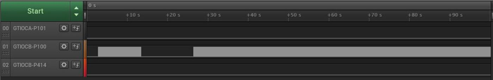

# Introduction #

This project demonstrates basic functionalities of Port Output Enable for GPT(POEG) module on Renesas RA MCUs based on Renesas FSP. Following is the sequence used by the application.User Input, error and info messages will be displayed on J-Link RTT Viewer.By default, POEG is enabled. User can reference the Verifying Operation section to understand the recommended sequence of operations using these menus.

Menu option on the J-Link RTT Viewer is displayed as
1. Disable Port output using POEG_TRIGGER_PIN mode. 

2. Disable Port output using POEG R_POEG_OutputDisable() software API mode.

3. Disable Port output using POEG_TRIGGER_OUTPUT_LEVEL mode.

4. Disable Port output using POEG_TRIGGER_ACMPHS mode.

5. Enable Port output using POEG_Reset API.

The EP performs the GPT output disable functioning using the above mentioned options.
Verify the GPT operation using either a Logic analyzer or an LED output.

Note : Three different GPT's are used to demonstrate the Port Output Enable for GPT Example. PWM 1 and PWM 2 are used to demonstrate output disable on POEG_TRIGGER_OUTPUT_LEVEL mode.
PWM 3 is used to demonstrate output disable on POEG_TRIGGER_PIN mode,R_POEG_OutputDisable() software API mode and POEG_TRIGGER_ACMPHS mode respectively. 

Please refer to the [Example Project Usage Guide](https://github.com/renesas/ra-fsp-examples/blob/master/example_projects/Example%20Project%20Usage%20Guide.pdf) 
for general information on example projects and [readme.txt](./readme.txt) for specifics of operation.

## Required Resources ##
To build and run the POEG example project, the following resources are needed.

### Hardware ###
* 1x RA board 
* 1x Micro USB cable
* 1x Host PC
* 1x Jumper Cable 

Refer to [readme.txt](./readme.txt) for information on how to connect the hardware.

### Software ###
* Renesas Flexible Software Package (FSP): Version 6.3.0
* e2 studio: Version 2025-12
* SEGGER J-Link RTT Viewer: Version 8.92
* GCC ARM Embedded Toolchain: Version 13.2.1.arm-13-7

Refer to software requirements mentioned in [Example Project Usage Guide](https://github.com/renesas/ra-fsp-examples/blob/master/example_projects/Example%20Project%20Usage%20Guide.pdf)

## Related Collateral References ##
The following documents can be referred to for enhancing your understanding of 
the operation of this example project:
- [FSP User Manual on GitHub](https://renesas.github.io/fsp/)
- [FSP Known Issues](https://github.com/renesas/fsp/issues)

# Project Notes #

## System Level Block Diagram ##
 High level block diagram
 
 

## FSP Modules Used ##
List of all the various modules that are used in this project. Refer to the FSP User Manual for further details on each module listed below.

| Module Name | Usage  | Searchable Keyword (using New Stack > Search) |
|-------------|-----------------------------------------------|-----------------------------------------------|
| Port output enable for GPT  | Port output enable for GPT channel0   | r_poeg |
| Port output enable for GPT  | Port output enable for GPT channel1   | r_poeg |
| General PWM   | General PWM | r_gpt |
| General PWM   | General PWM | r_gpt |
| General PWM   | General PWM | r_gpt |
| Comparator | Comparator High- Speed | r_dac |
| DAC | DAC channel 0 | r_acmphs |
| DAC | DAC channel 1 | r_acmphs |

## Module Configuration Notes ##
This section describes FSP Configurator properties that are important or different from those selected by default. 

**Common Configuration Properties for poeg_ek_ra6m3_ep**

|   Module Property Path and Identifier   |   Default Value   |   Used Value   |   Reason   |
| :-------------------------------------: | :---------------: | :------------: | :--------: |
|   configuration.xml > BSP > Property > Main Stack Size(bytes) |  0  | 0x400 | Change Stack size to accommodate functions usage in the EP and avoid any runtime errors |
|   configuration.xml > BSP > Property > Heap Size(bytes) |  0  | 0x400 | Change heap size to accommodate functions usage in the EP and avoid any runtime errors |
|   configuration.xml > BSP > Property > Parameter checking | Default (BSP) | Enabled | This property is used for parameter checking | 

**Configuration Properties for POEG channel0**

|   Module Property Path and Identifier   |   Default Value   |   Used Value   |   Reason   |
| :-------------------------------------: | :---------------: | :------------: | :--------: |
| configuration.xml > g_poeg0 Port Output Enable for GPT (r_poeg) > Settings > Property > Module g_poeg0 POEG > General > Channel | 0 | 0 | POEG Channel |
| configuration.xml > g_poeg0 Port Output Enable for GPT (r_poeg) > Settings > Property > Module g_poeg0 POEG > General > Trigger | |  GPT output Level | POEG Trigger |
| configuration.xml > g_poeg0 Port Output Enable for GPT (r_poeg) > Settings > Property > Module g_poeg0 POEG > Input > GTETRG Polarity | Active High | Active Low| Select the polarity of the GTETRG pin |
| configuration.xml > g_poeg0 Port Output Enable for GPT (r_poeg) > Settings > Property > Module g_poeg0 POEG > Input > GTETRG Noise Filter | Disabled | PCLKB/32 | Configure the noise filter for the GTETRG pin |
| configuration.xml > g_poeg0 Port Output Enable for GPT (r_poeg) > Settings > Property > Module g_poeg0 POEG > Interrupts > Callback | NULL | channel0_user_callback | This property is used to specify  user callback function |
| configuration.xml > g_poeg0 Port Output Enable for GPT (r_poeg) > Settings > Property > Module g_poeg0 POEG > Interrupts > Interrupt Priority | Priority 0 | Priority 1  | This property is used to select the POEG interrupt priority |

**Configuration Properties for POEG channel1**

|   Module Property Path and Identifier   |   Default Value   |   Used Value   |   Reason   |
| :-------------------------------------: | :---------------: | :------------: | :--------: |
| configuration.xml > g_poeg1 Port Output Enable for GPT (r_poeg) > Settings > Property > Module g_poeg1 POEG > General > Channel | 0 | 1 | POEG Channel |
| configuration.xml > g_poeg0 Port Output Enable for GPT (r_poeg) > Settings > Property > Module g_poeg1 POEG > General > Trigger | | GTETRG Pin and ACMPHS0 | POEG Trigger |
| configuration.xml > g_poeg1 Port Output Enable for GPT (r_poeg) > Settings > Property > Module g_poeg1 POEG > Input > GTETRG Polarity | Active High | Active Low | Select the polarity of the GTETRG pin |
| configuration.xml > g_poeg1 Port Output Enable for GPT (r_poeg) > Settings > Property > Module g_poeg1 POEG > Input > GTETRG Noise Filter | Disabled | PCLKB/32 | Configure the noise filter for the GTETRG pin |
| configuration.xml > g_poeg1 Port Output Enable for GPT (r_poeg) > Settings > Property > Module g_poeg1 POEG > Interrupts > Callback | NULL | channel1_user_callback | This property is used to specify  user callback function |
| configuration.xml > g_poeg1 Port Output Enable for GPT (r_poeg) > Settings > Property > Module g_poeg1 POEG > Interrupts > Interrupt Priority | Priority 0 | Priority 1  | This property is used to select the POEG interrupt priority |

**Configuration Properties for General PWM 1**

|   Module Property Path and Identifier   |   Default Value   |   Used Value   |   Reason   |
| :-------------------------------------: | :---------------: | :------------: | :--------: |
| configuration.xml > g_timer_pwm1 General PWM (r_gpt) > Settings > Property > Module g_timer_pwm1 GPT  > Common > Pin Output Support | Disabled | Enabled with Extra features | Enables or disables support for outputting PWM waveforms on GTIOCx pins |
| configuration.xml > g_timer_pwm1 General PWM (r_gpt) > Settings > Property > Module g_timer_pwm1 GPT  > Common > Clock Source | Disabled | PCLKD| Configure the clock source |
| configuration.xml > g_timer_pwm1 General PWM (r_gpt) > Settings > Property > Module g_timer_pwm1 GPT  > general > Channel | 0 | 5| This property is used to channel of GPT |
| configuration.xml > g_timer_pwm1 General PWM (r_gpt) > Settings > Property > Module g_timer_pwm1 GPT  > general > Mode | Periodic | PWM  | This property is used to select the Mode selection |
| configuration.xml > g_timer_pwm1 General PWM (r_gpt) > Settings > Property > Module g_timer_pwm1 GPT  > general > Period | 0x100000000 | 1000  | This property is used to select  the timer period |
| configuration.xml > g_timer_pwm1 General PWM (r_gpt) > Settings > Property > Module g_timer_pwm1 GPT  > Output > Duty Cycle Percent (only applicable in PWM mode) | 50 | 50 | This property is used to specify the timer duty cycle percent. Only used in PWM mode |
| configuration.xml > g_timer_pwm1 General PWM (r_gpt) > Settings > Property > Module g_timer_pwm1 GPT  > Output > GTIOCA Output Enabled | False | False | This property is used to Enable the output of GTIOCA on a pin |
| configuration.xml > g_timer_pwm1 General PWM (r_gpt) > Settings > Property > Module g_timer_pwm1 GPT  > Output > GTIOCB Output Enabled | False | True | This property is used to Enable the output of GTIOCB on a pin |
| configuration.xml > g_timer_pwm1 General PWM (r_gpt) > Settings > Property > Module g_timer_pwm1 GPT  > Extra Features > Output Disable > POEG Link | POEG Channel 0| POEG Channel 1 | Select which POEG to link this GPT channel to |
| configuration.xml > g_timer_pwm1 General PWM (r_gpt) > Settings > Property > Module g_timer_pwm1 GPT  > Extra Features > Output Disable > GTIOCA Disable Setting | Disable Prohibited | Disable Prohibited | Select the disable setting for GTIOCA |
| configuration.xml > g_timer_pwm1 General PWM (r_gpt) > Settings > Property > Module g_timer_pwm1 GPT  > Extra Features > Output Disable > GTIOCB Disable Setting | Disable Prohibited |  Level low| Select the disable setting for GTIOCB |
| configuration.xml > g_timer_pwm1 General PWM (r_gpt) > Settings > Property > Module g_timer_pwm1 GPT  > Extra Features > Extra Features | Disabled | Enabled | Select whether to enable extra features on this channel |

**Configuration Properties for General PWM 2**

|   Module Property Path and Identifier   |   Default Value   |   Used Value   |   Reason   |
| :-------------------------------------: | :---------------: | :------------: | :--------: |
| configuration.xml > g_timer_pwm2 General PWM (r_gpt) > Settings > Property > Module g_timer_pwm2 GPT  > Common > Pin Output Support | Disabled | Enabled with Extra features | Enables or disables support for outputting PWM waveforms on GTIOCx pins |
| configuration.xml > g_timer_pwm2 General PWM (r_gpt) > Settings > Property > Module g_timer_pwm2 GPT  > Common > Clock Source | Disabled | PCLKD| Configure the clock source |
| configuration.xml > g_timer_pwm2 General PWM (r_gpt) > Settings > Property > Module g_timer_pwm2 GPT  > general > Channel | 0 | 0| This property is used to channel of GPT |
| configuration.xml > g_timer_pwm2 General PWM (r_gpt) > Settings > Property > Module g_timer_pwm2 GPT  > general > Mode | Periodic | Periodic | This property is used to select the Mode selection |
| configuration.xml > g_timer_pwm2 General PWM (r_gpt) > Settings > Property > Module g_timer_pwm2 GPT  > general > Period | 0x100000000 | 1000  | This property is used to select  the timer period |
| configuration.xml > g_timer_pwm2 General PWM (r_gpt) > Settings > Property > Module g_timer_pwm2 GPT  > Output > Duty Cycle Percent (only applicable in PWM mode) | 50 | 50 | This property is used to specify the timer duty cycle percent. Only used in PWM mode |
| configuration.xml > g_timer_pwm2 General PWM (r_gpt) > Settings > Property > Module g_timer_pwm2 GPT  > Output > GTIOCA Output Enabled | False | True | This property is used to Enable the output of GTIOCA on a pin |
| configuration.xml > g_timer_pwm2 General PWM (r_gpt) > Settings > Property > Module g_timer_pwm2 GPT  > Output > GTIOCB Output Enabled | False | True | Enable the output of GTIOCB on a pin |
| configuration.xml > g_timer_pwm2 General PWM (r_gpt) > Settings > Property > Module g_timer_pwm2 GPT  > Extra Features > Output Disable > POEG Link | POEG Channel 0| POEG Channel 1 | Select which POEG to link this GPT channel to |
| configuration.xml > g_timer_pwm2 General PWM (r_gpt) > Settings > Property > Module g_timer_pwm2 GPT  > Extra Features > Output Disable > GTIOCA Disable Setting | Disable Prohibited | Level low | Select the disable setting for GTIOCA |
| configuration.xml > g_timer_pwm2 General PWM (r_gpt) > Settings > Property > Module g_timer_pwm2 GPT  > Extra Features > Output Disable > GTIOCB Disable Setting | Disable Prohibited | Disable Prohibited | Select the disable setting for GTIOCB |
| configuration.xml > g_timer_pwm2 General PWM (r_gpt) > Settings > Property > Module g_timer_pwm2 GPT  > Extra Features > Extra Features | Disabled | Enabled | Select whether to enable extra features on this channel |

**Configuration Properties for General PWM 3**

|   Module Property Path and Identifier   |   Default Value   |   Used Value   |   Reason   |
| :-------------------------------------: | :---------------: | :------------: | :--------: |
| configuration.xml > g_timer_pwm3 General PWM (r_gpt) > Settings > Property > Module g_timer_pwm3 GPT  > Common > Pin Output Support | Disabled | Enabled with Extra features | Enables or disables support for outputting PWM waveforms on GTIOCx pins |
| configuration.xml > g_timer_pwm3 General PWM (r_gpt) > Settings > Property > Module g_timer_pwm3 GPT  > Common > Clock Source | Disabled | PCLKD| Configure the clock source |
| configuration.xml > g_timer_pwm3 General PWM (r_gpt) > Settings > Property > Module g_timer_pwm3 GPT  > general > Channel | 0 | 5| This property is used to channel of GPT |
| configuration.xml > g_timer_pwm3 General PWM (r_gpt) > Settings > Property > Module g_timer_pwm3 GPT  > general > Mode | Periodic | PWM  | This property is used to select the Mode selection |
| configuration.xml > g_timer_pwm3 General PWM (r_gpt) > Settings > Property > Module g_timer_pwm3 GPT  > general > Period | 0x100000000 | 1000  | This property is used to select  the timer period |
| configuration.xml > g_timer_pwm3 General PWM (r_gpt) > Settings > Property > Module g_timer_pwm3 GPT  > Output > Duty Cycle Percent (only applicable in PWM mode) | 50 | 50 | This property is used to specify the timer duty cycle percent. Only used in PWM mode |
| configuration.xml > g_timer_pwm3 General PWM (r_gpt) > Settings > Property > Module g_timer_pwm3 GPT  > Output > GTIOCA Output Enabled | False | False | This property is used to Enable the output of GTIOCA on a pin |
| configuration.xml > g_timer_pwm3 General PWM (r_gpt) > Settings > Property > Module g_timer_pwm3 GPT  > Output > GTIOCB Output Enabled | False | True | This property is used to Enable the output of GTIOCB on a pin |
| configuration.xml > g_timer_pwm3 General PWM (r_gpt) > Settings > Property > Module g_timer_pwm3 GPT  > Extra Features > Output Disable > POEG Link | POEG Channel 0| POEG Channel 0 | Select which POEG to link this GPT channel to |
| configuration.xml > g_timer_pwm3 General PWM (r_gpt) > Settings > Property > Module g_timer_pwm3 GPT  > Extra Features > Output Disable > GTIOCA Disable Setting | Disable Prohibited | Disable Prohibited | Select the disable setting for GTIOCA |
| configuration.xml > g_timer_pwm3 General PWM (r_gpt) > Settings > Property > Module g_timer_pwm3 GPT  > Extra Features > Output Disable > GTIOCB Disable Setting | Disable Prohibited | Level low | Select the disable setting for GTIOCB |
| configuration.xml > g_timer_pwm3 General PWM (r_gpt) > Settings > Property > Module g_timer_pwm3 GPT  > Extra Features > Extra Features | Disabled | Enabled | Select whether to enable extra features on this channel |

**Configuration Properties for General DAC 0**

Note : The DAC 0 settings are kept as default .

**Configuration Properties for General DAC 1**

Note : The DAC 1 settings are kept as default .

**Configuration Properties for General ACMPHS**

|   Module Property Path and Identifier   |   Default Value   |   Used Value   |   Reason   |
| :-------------------------------------: | :---------------: | :------------: | :--------: |
| configuration.xml > g_comparator High Speed Comparator (r_acmphs) > Settings > Property > Module g_comparator ACMPHS > Channel | 0 | 0 | Enables the hardware channel |
| configuration.xml > g_comparator High Speed Comparator (r_acmphs) > Settings > Property > Module g_comparator ACMPHS > Trigger Edge Selector | Both Edge| Both Edge |  The trigger specifies when a comparator callback event should occur |
| configuration.xml > g_comparator High Speed Comparator (r_acmphs) > Settings > Property > Module g_comparator ACMPHS > Noise Filter | No Filter | 32 | This property is used to select the PCLK divisor for the hardware digital debounce filter.|
| configuration.xml > g_comparator High Speed Comparator (r_acmphs) > Settings > Property > Module g_comparator ACMPHS > Callback | NULL | acmphs_user_callback | This property is used to specify acmphs callback |
| configuration.xml > g_comparator High Speed Comparator (r_acmphs) > Settings > Property > Module g_comparator ACMPHS > Comparator Interrupt Priority| Priority 0 | Priority 2 | This property is used to specify Comparator Interrupt Priority |
| configuration.xml > g_comparator High Speed Comparator (r_acmphs) > Settings > Property > Module g_comparator ACMPHS > Analog Input Voltage Source (IVCMP)| MCU specific options| DAC121 |  The trigger specifies selection of the Analog input voltage source|
| configuration.xml > g_comparator High Speed Comparator (r_acmphs) > Settings > Property > Module g_comparator ACMPHS > Reference Voltage Input Source (IVREF) | MCU specific options| DAC120 DA | This property is used to select the Analog reference voltage source|

## API Usage ##

The table below lists the POEG basic APIs used at the application layer by this example project.

| API Name    | Usage                                                                          |
|-------------|--------------------------------------------------------------------------------|
|R_POEG_Open | This API is used to open the POEG instance |
|R_POEG_Reset | This API is used to reset POEG status |
|R_POEG_OutputDisable | This API is used to disable GPT output pins |
|R_GPT_Open | This API is used to open the GPT instance |
|R_GPT_Start | This API is used to start the GPT  |
|R_DAC_Open | This API is used to open the DAC instance |
|R_ACMPHS_Open | This API is used to open the ACMPHS instance |
|R_DAC_Write | This API is used to write to the DAC |
|R_DAC_Start | This API is used to start the conversion of the DAC|
|R_ACMPHS_InfoGet | This API is used to get the ACMPHS Info|
|R_ACMPHS_OutputEnable | This API is used enable output of the ACMPHS |

## Verifying operation ##
* Import, Build and Debug the Example Projects for POEG(see section Starting Development of **FSP User Manual**).
* Connect USB cable as mentioned in the readme file [readme.txt](./readme.txt)
* Run the POEG Example Project and then open J-Link RTT Viewer to see the output status of the Example Project.

**EP info**

* Enter "1", for POEG trigger on GTETRG input pin level - This mode supports disabling GPT output pins based on GTETRG input pin level.
  Then reset the resepective POEG status by entering Menu option "5" .

* Enter "2", for POEG output disable using software API - This mode supports disabling GPT output pins by software API(R_POEG_OutputDisable).
  Then reset the resepective POEG status by entering Menu option "5" .
   
* Enter "3", for POEG output disable on GPT output level - This mode supports disabling GPT output pins when GTIOC pins are the same level
  Then reset the resepective POEG status by entering Menu option "5" .
  
* Enter "4", for POEG output disable on ACMPHS crossing events - This mode supports disabling GPT output pins based on comparator crossing event.
  Then reset the resepective POEG status by entering Menu option "5" .
  Reset of application is needed prior to continuous selection of the menu option "4" to restart the DAC0 and DAC1 and ACMPHS .
  Note: Take out the Jumper Cable if it is still connected, while testing Menu option "4".
  
* Enter "5", and then Enter "1" for POEG 0 reset .
* Enter "5", and then Enter "2" for POEG 1 reset .

* The status messages will be displayed in J-Link RTT Viewer as depicted below:

**POEG Output Disable On Input Pin Trigger RTT log**

	
**POEG Output Disable On Software API RTT_log**

	
**POEG Output Disable On GPT Output Level RTT log**

	
**POEG Output Disable On ACMPHS Events RTT log**

	
**POEG POEG Reset Channel0 RTT log**

**POEG POEG Reset Channel1 RTT log**

### Callback Handlers
1. **channel0_user_callback()** disable the POEG0 interrupt to prevent it from firing continuously.
2. **channel2_user_callback()** disable the POEG1 interrupt to prevent it from firing continuously.
3. **acmphs_user_callback()** to toggle the flag of ACMPHS Events.

#### Special Topics ####
The table below lists the Supported Boards this example project.

| Boards	    | PIN Trigger	|GPT Output level|ACMPHS Mode    |
|---------------|---------------|----------------|---------------|
|  EK_RA2A1     |    Y          |       Y        |   N			 |  
|  EK_RA2E1     |    Y          |       Y        |   N           |
|  EK_RA2E2     |    Y          |       Y        |   N           |
|  EK_RA2L1     |    Y          |       Y        |   N           |
|  EK_RA4M1  	|    Y          |       Y        |   N           |
|  EK_RA4M2     |    Y          |       Y        |   N           |
|  EK_RA4M3     |    Y          |       Y        |   N           |
|  EK_RA4W1     |    Y          |       Y        |   N           |
|  EK_RA6M1     |    Y          |       Y        |   Y           |
|  EK_RA6M2     |    Y          |       Y        |   Y           |
|  EK_RA6M3     |    Y          |       Y        |   Y           |
|  EK_RA6M3G    |    Y          |       Y        |   Y           |
|  EK_RA6M4     |    Y          |       Y        |   N           |
|  EK_RA6M5     |    Y          |       Y        |   N           |
|  FPB_RA4E1    |    Y          |       Y        |   N           |
|  FPB_RA6E1    |    Y          |       Y        |   N           |
|  MCK_RA6T2    |    Y          |       Y        |   Y           |
|  RSSK_RA6T1   |    Y          |       Y        |   Y           |
|  EK_RA8M1     |    Y          |       Y        |   Y           |
|  EK_RA8D1     |    Y          |       Y        |   Y           |

Below shows the Logic Analyzer Images for each POEG 

Below waveform shows the POEG output disable on input pin trigger

**POEG output disable on input pin trigger waveform**

   
  
Below waveform shows the POEG output disable on software API

**POEG output disable on software API waveform**
  
  

Below waveform shows the POEG output disable on ACMPHS events
  
**POEG output disable on ACMPHS events waveform**
  
    

